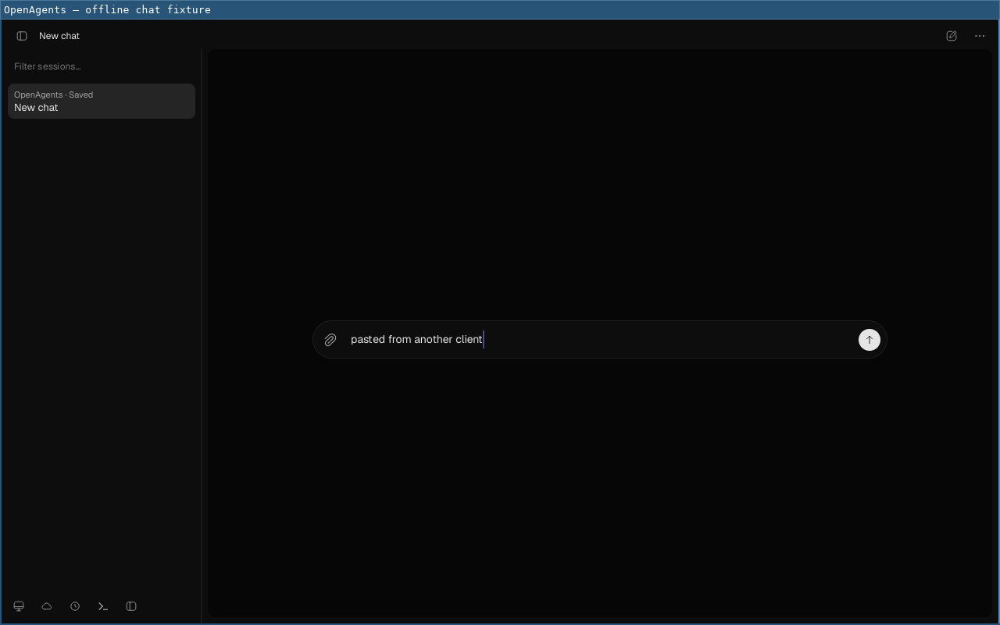
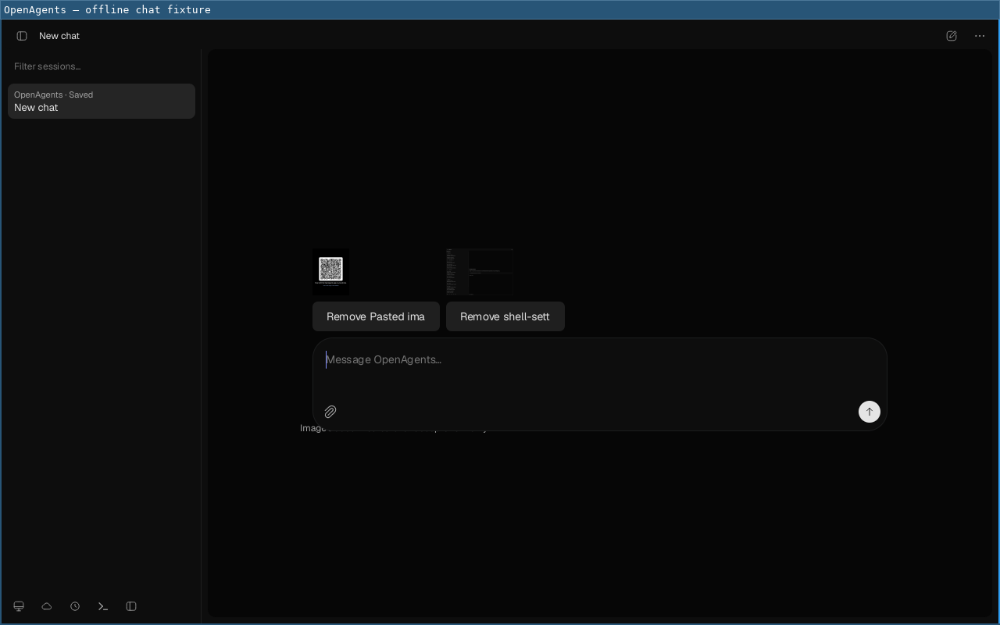
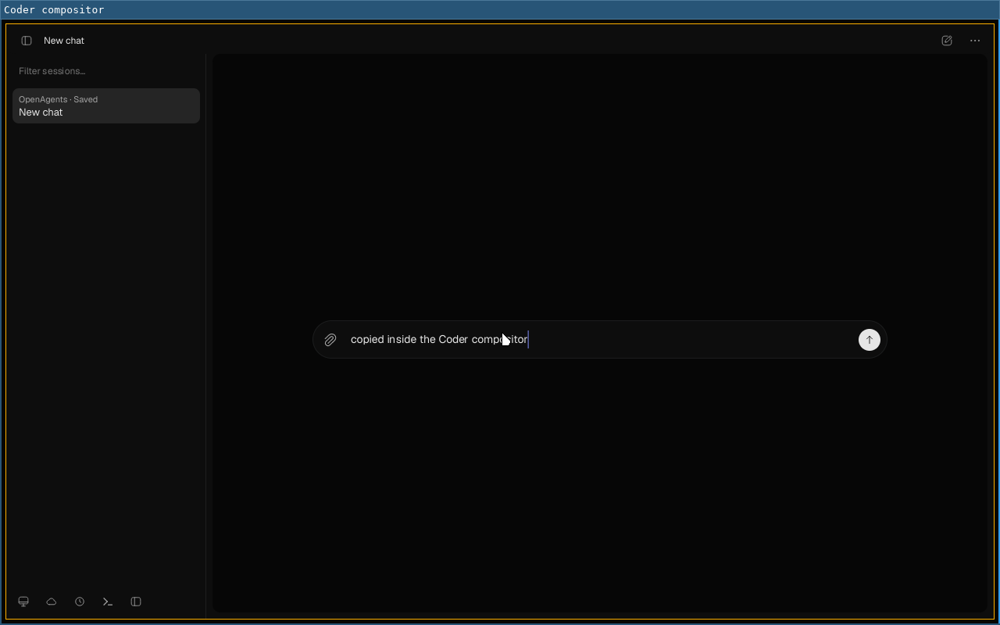

# Linux desktop integration: notifications, clipboard, drop, NixOS (2026-09-30)

[#10026](https://github.com/OpenAgentsInc/openagents/issues/10026), part of
[#10003](https://github.com/OpenAgentsInc/openagents/issues/10003). No
visuals, menus, or painter changed; this is platform code only.

## What changed

- **Notifications.** When a chat's Coder asks a question, asks for
  approval, finishes, or fails while the window is not in front, the app
  notifies once (`openagents_desktop::notices`): the chat's title and what
  Coder is doing, never a message. Linux delivers through the desktop portal
  (`org.freedesktop.portal.Notification.AddNotification`, after
  `org.freedesktop.host.portal.Registry.Register` as
  `com.openagents.desktop` where the portal has it), else the notification
  server (`org.freedesktop.Notifications.Notify`, replacing the chat's
  previous notice). `openagents-desktop --notify-test` shows one and says
  which way it went. macOS and Windows drop notices for now.
- **Clipboard.** The window joins the Wayland seat on winit's own
  connection (`rust_native_desktop::wayland`) and reads and sets the
  clipboard through the core `wl_data_device`, which needs no data-control
  protocol, so it works on GNOME and on CoderOS's compositor where
  `arboard` and `wl-paste` cannot read. Order: that seat, then
  `wl-copy`/`wl-paste` or `xclip`, then `arboard` (one kept for the
  process, so an X11 selection outlives the call). Pasting an image takes
  PNG or JPEG bytes, or a file a file manager copied (`text/uri-list`).
  `OPENAGENTS_CLIPBOARD_TRACE=1` prints which way each action went (never
  what it carried).
- **Drop.** winit 0.30 has no drag and drop on Wayland; the same seat
  accepts `text/uri-list` (files), else PNG or JPEG pixels (written to
  `$XDG_RUNTIME_DIR/openagents/drops/`, `0700`), and hands paths to the app
  as X11, macOS, and Windows drops already arrive. In the composer, images
  attach; any other file or a folder puts its path in the message. Several
  files dropped together are all taken, one after another.
- **NixOS.** `coderos-coder-host-install` carries
  `ConditionPathExists=!%E/systemd/user/com.openagents.desktop.host.service`
  and `ConditionPathExists=!%h/.openagents/host/service.adopted.json`, so
  systemd skips it (at login and when `coder-update` starts it) once the
  app runs the host. `coder-update` checks the unit file too. The desktop
  entry now says `X-GNOME-UsesNotifications=true`.

## Tests

Mac (`cargo test -p rust-native-desktop -p openagents-desktop`) and Linux
(Debian 11 `rust:1.97.1-bullseye` on coderos-4080, scratch clone and target
under `/tmp`, CPU share 64, `nice -n 19`): all pass, including the new
`transfer` tests (drop and paste type order, `text/uri-list` decoding),
`linux_clipboard_follows_the_display_server`, the `notices` tests,
`dropped_files_that_are_not_images_become_their_paths`, and
`files_dropped_together_are_all_taken`.

`notifications_over_a_private_bus` (ignored by default) under
`dbus-run-session` with stand-in services: no portal, the server gets
`Notify` with urgency 2 and `desktop-entry`, and the second notice for the
chat replaces the first (`replaces_id` 41); with a portal, the portal gets
`AddNotification` with title, body, and priority, and the server is not
asked.

## coderos-4080 (NixOS), headless

All of it on a private session bus (`dbus-run-session`), a scratch `HOME`
and `XDG_RUNTIME_DIR`, and a headless sway (`WLR_BACKENDS=headless`,
pixman); nothing touched the login session, `~/.openagents`, the running
host, or the owner's windows. The window rendered with Mesa's lavapipe.

**Notifications through the owner's own stack** (the store paths the
session runs: xdg-desktop-portal 1.20.4, xdg-desktop-portal-gtk 1.15.3,
mako 1.11.0):

```text
$ openagents-desktop --notify-test
notification delivered through the desktop portal (org.freedesktop.portal.Notification)
$ makoctl list
Notification 1: OpenAgents
  Urgency: normal
```

**Clipboard in the app window on sway**, started with no `wl-copy`,
`wl-paste`, or `xclip` on its `PATH`; keys from `wtype`, the other client is
`wl-clipboard` 2.3.0:

```text
== 1. another client copies text; Ctrl+V in the composer
== 2. select all, Ctrl+C in the composer; another client reads the clipboard
wl-paste reads: "pasted from another client" (types: text/plain;charset=utf-8 UTF8_STRING text/plain STRING TEXT )
== 3. another client copies a PNG; Ctrl+V attaches it
== 4. a file manager copies a file (text/uri-list); Ctrl+V attaches it
== app trace
clipboard: joined the window's Wayland seat
clipboard: paste through the window's Wayland seat
clipboard: copy through the window's Wayland seat
clipboard: image paste through the window's Wayland seat
clipboard: image paste through the window's Wayland seat
```




**Clipboard inside the Coder compositor** (the installed
`coder-compositor-0.1.0`, nested in the headless sway with an empty grant
and software GL; it has no data-control protocol, so `arboard` and
`wl-paste` cannot read its clipboard). Typed through its virtual keyboard:
text, select all, Ctrl+C, Backspace, Ctrl+V; the text came back:

```text
clipboard: joined the window's Wayland seat
clipboard: copy through the window's Wayland seat
clipboard: paste through the window's Wayland seat
```



**The NixOS module**, in a scratch copy of the owner's host flake with
`--override-input openagents git+file:///tmp/…/src?dir=os`: the installer's
unit renders

```text
[Unit]
ConditionPathExists=!%E/systemd/user/com.openagents.desktop.host.service
ConditionPathExists=!%h/.openagents/host/service.adopted.json
ConditionUser=christopherdavid
```

the unit builds (`unit-coderos-coder-host-install.service`) and the system
instantiates (`nixos-system-coderos-4080-26.05…drv`); nothing was switched.
`systemd-analyze --user condition` with those two lines: an empty home
passes, a home with the app's unit fails, a home with `service.adopted.json`
fails, and the owner's account (read only) fails, so its installer is
skipped without the hand mask. The new flake check `coder-host-stands-down`
passes, and fails with the old module (`missing:
ConditionPathExists=!%E/…; ConditionPathExists=!%h/…`).

## A stock desktop

Ubuntu 24.04 in a container on a private bus, Xvfb, xdg-desktop-portal
1.18.4 with the GTK backend 1.15.1 and dunst 1.9.2: `--notify-test` went
through the portal, the portal called its GTK backend, the backend called
dunst's `Notify` (seen with `dbus-monitor`), and dunst displayed one
notification. GNOME Shell 46 would not start headless in a container (it
needs logind), so the GNOME Shell and KDE Plasma notification look is an
owner check, as are drag and drop from a file manager and the clipboard on
a real GNOME session (`NEEDS_OWNER.md`).

A portal whose backend has no notification server behind it still answers
`AddNotification`; the app cannot tell, and the notice is lost.
