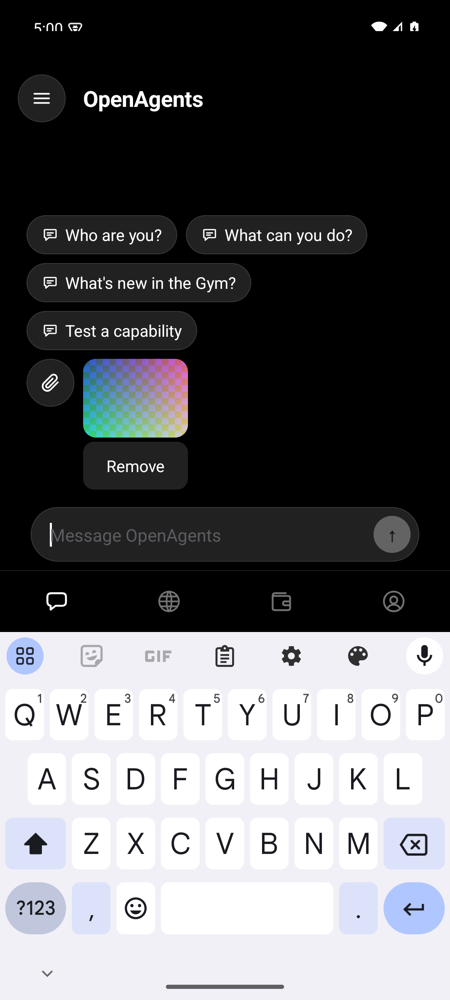
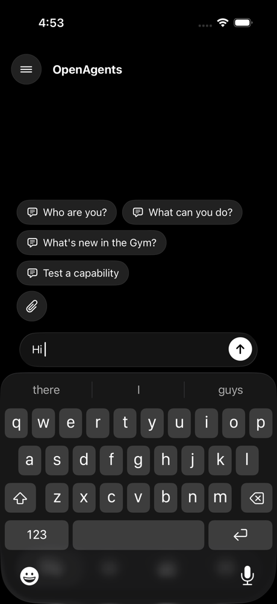
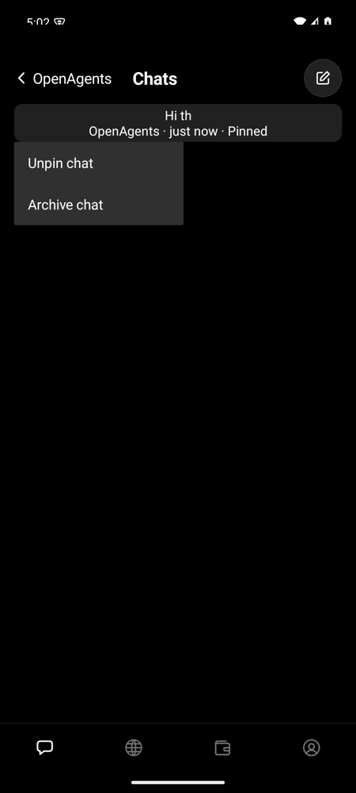
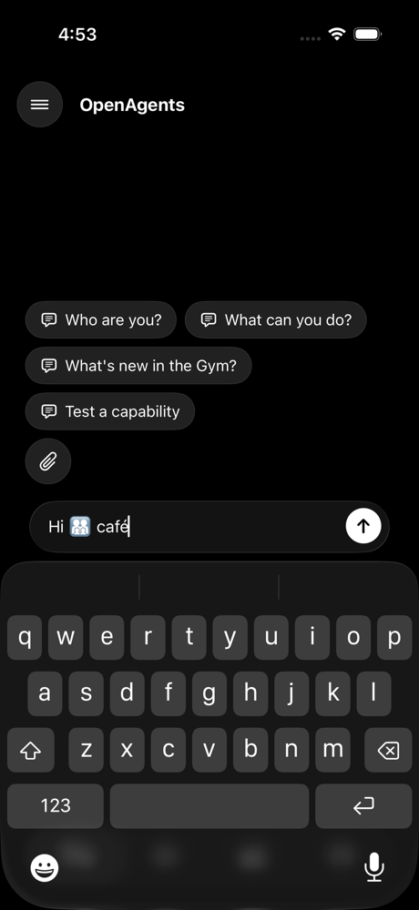
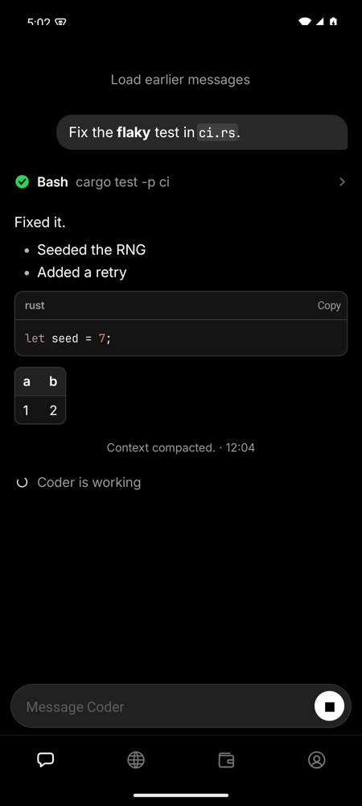
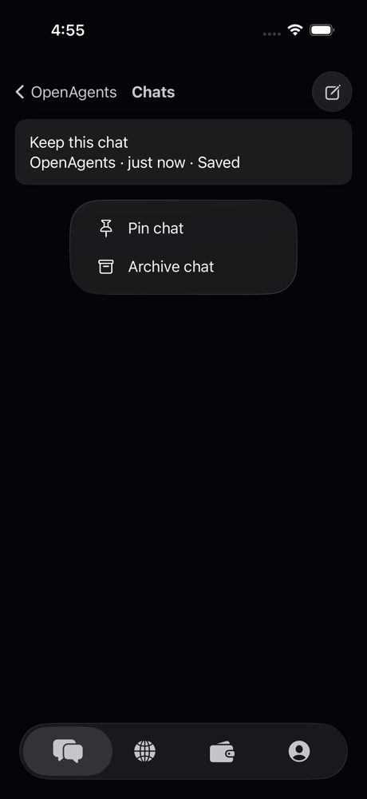
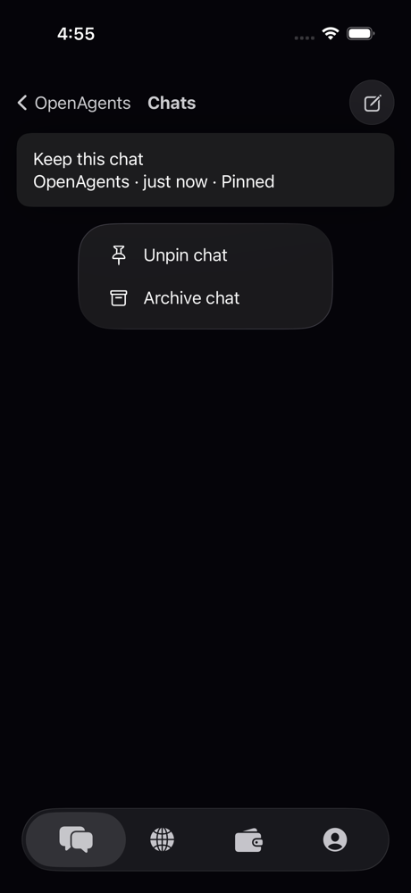
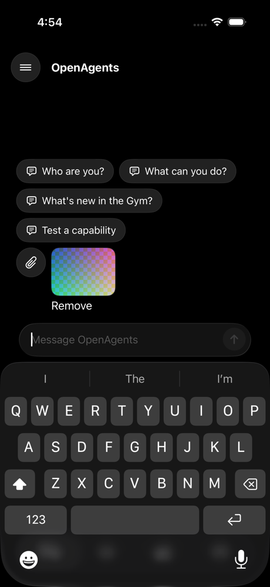
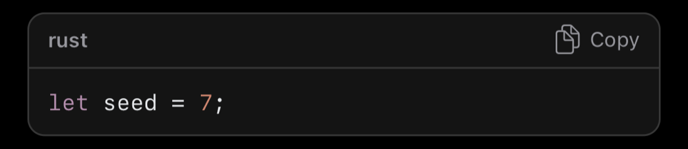

# Phone hosts adopt the shared contracts (#10028, CDP-23)

The iOS and Android hosts map the Rust Native additions made for desktop
chat, so the phones and the desktop use the same shared Rust for editing,
card menus, images, and code colors. Zeron's composer editing, menu, image
attachment, and syntax-span designs are the source, reimplemented in Rust
Native; no code is copied.

## What changed

- **Editing.** `rust_native::edit::mirror` edits a native field's draft
  through the shared `Editor`. `UITextView` and `EditText` report each
  change (text, selection, and marked IME range in UTF-16); Rust returns
  the canonical draft, which the field shows. The delete key, undo, and
  redo go to the shared editor. A deletion never splits a grapheme, an IME
  composition is one undo step, the byte bound refuses, and a stamp
  (token, lifetime, revision) from an older draft is refused. A send keeps
  the draft until Rust accepts it; the next composer token clears it.
  iOS offers Undo and Redo in the field's edit menu and on Command-Z;
  Android on Ctrl+Z, Ctrl+Shift+Z, and the text menu.
- **Card menus.** A stack with `style.menu = context` is a card whose other
  buttons are its menu. The phone chat list's saved-chat cards carry the
  shared chat commands' menu (`commands::Kind::Menu`: pin or unpin, archive
  or restore). iOS shows it as a `UIMenu` on a long press, Android as a
  `PopupMenu`. Rename stays on the desktop until the phones have a title
  field.
- **Images.** The attach control opens the system photo picker; the shared
  `attachments` code decodes and bounds the photo, and the draft shows an
  `image:{id}` surface with its alternative text. The hosts draw it from
  the bytes Rust holds (`UIImage`, `Bitmap`). A text-only route keeps the
  words and the image rather than dropping the image.
- **Code colors.** `rust_native_syntax_spans` and JNI
  `TranscriptNative.highlight` return paint-only spans in UTF-16; both
  transcript painters color code blocks on their own worker without
  changing text or layout.

## Checks

- `cargo test -p rust-native --features ffi,shaping`: 108 passed, including
  the mirror (typing, grapheme-safe deletion for ZWJ families, flags, skin
  tones and combining marks, IME composition and cancel, stale stamps, byte
  bound, UTF-16 selection, submission) and menu and syntax tests.
- `cargo test --manifest-path crates/openagents-mobile/Cargo.toml`: 150
  passed, including the chat card menu and image draft tests.
- `cargo test -p openagents-chat-app`, `cargo check -p rust-native-desktop
  -p openagents-desktop --tests`, and strict Clippy on the three crates.
- iOS, fresh iPhone 17 Pro simulator (iOS 26.5):
  `UITests/SharedContractsUITests.swift` and the transcript scroll test
  pass. They type `Hi 👨‍👩‍👧‍👦 café` (with a combining accent), delete
  it grapheme by grapheme, undo from the edit menu, attach a PNG, open and
  use a card's menu, and show the fixture's highlighted Rust block.
- Android, fresh API 35 emulator: `scripts/build-openagents-android.sh
  check` (lint and unit tests, including `DraftEditorTest`), then typing,
  delete, Ctrl+Z and Ctrl+Shift+Z, an attached image, the card's
  `PopupMenu` (pin, then unpin), and the fixture's highlighted Rust block.

| iOS | Android |
| --- | --- |
|  |  |
|  |  |
|  |  |
|  | |
|  | |
|  | |
|  | |

Physical-device IME checks (Japanese kana, dictation) and VoiceOver and
TalkBack passes over the new menus remain for a device run.
