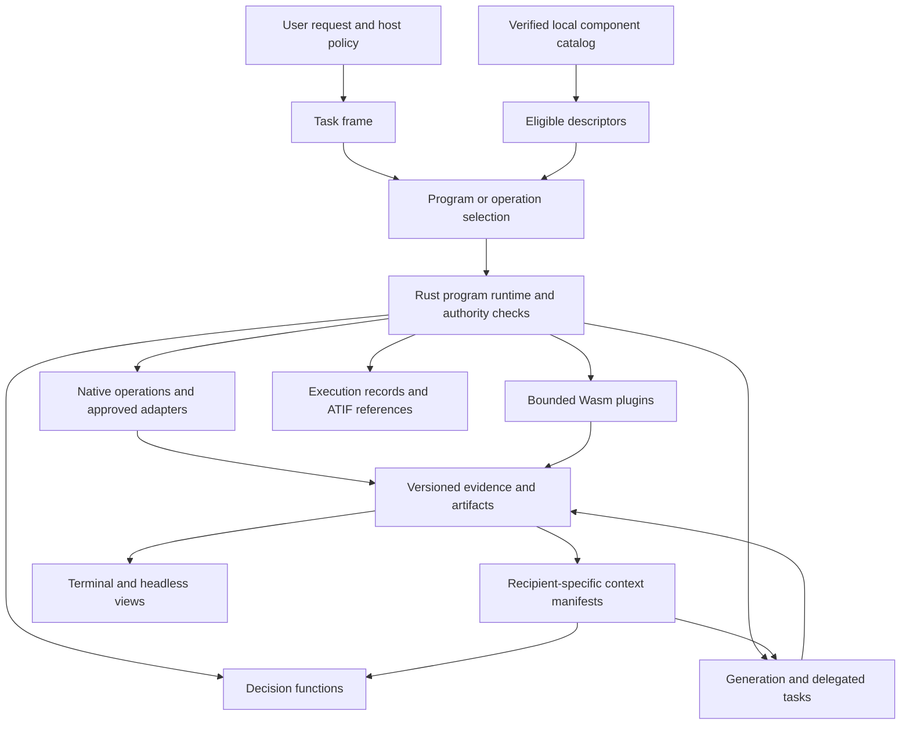

# Architecture and terminology

Status: target specification. See the [implementation boundary](README.md#current-implementation-boundary).

## Naming decision

Use **programs and extensions** for the whole system and **Wasm plugin** for
an executable guest. In interfaces, use **Programs** for workflows and
**Extensions** for installed packages and their components. An extension's
component type must remain visible: a program, plugin, skill, decision
function, or adapter has a different lifecycle.

This reconciles the two glossaries rather than renaming one object repeatedly:

| Term | Reference Coder usage | OpenAgents contract |
| --- | --- | --- |
| Program | Proposed Jev-selected state machine in code, itself a signature | Declarative named steps interpreted by Rust under NIP-PRG. The reusable workflow unit. |
| Signature | Proposed common descriptor for tools, plugins, skills, and programs | Use **operation descriptor** for the selectable interface; a descriptor is metadata, not a new execution engine. |
| Plugin | Wasm module with a manifest and bounded host imports | Retain this narrow meaning. A plugin can implement an operation or supported host role. |
| Capability | Granted ability or guest import | A host-granted ability. A capability manifest describes availability and requirements; it grants nothing by itself. |
| Executor | Built-in agent or external session adapter | Performs a bounded task. Native generation and external agents retain distinct configuration and evidence limits. |
| Skill | Instructions with progressive loading | Scoped guidance; structured skills may reference supported hooks and operations under existing authority. |
| Extension package | No single equivalent spanning these contracts | Immutable distribution bundle for components, schemas, documentation, dependencies, and evidence references. |
| Decision function | Typed semantic function | State/question/output contract plus a consuming policy and admitted model scope; invoked by the host. |

The [repository glossary](../glossary.md) defines the adopted terms. An MCP
server or an external agent is not a Wasm plugin merely because it adds a
capability. Model weights remain decision artifacts served through a door;
a plugin may prepare their input but does not load arbitrary weights into a
Wasm host or make a model call behind the host's accounting.

## Component ownership

Keep control flow, source versions, argument validation, authority, resource
limits, and transitions in Rust. TypeSafe supplies judgments at declared
semantic boundaries. Generation writes patches, explanations, summaries, and
open-ended arguments. A plugin performs its typed bounded operation. None of
these components can edit its own permission envelope.

Use the existing shared `turn::run`, program runtime, decision client,
`supervise`, write boundary, project scheduler, ATIF, and verifier. New
libraries may isolate responsibilities as implementation warrants; package
loading must not introduce a second terminal-specific agent or scheduler.

## Operation descriptors

The proposed registry normalizes interfaces while preserving the component's
actual kind. Each descriptor contains:

| Field group | Required meaning |
| --- | --- |
| Identity | Publisher-qualified component ID, component kind, exact release and descriptor digests. |
| Selection | Short purpose, supported task classes, limitations, and typed input/output schema references. |
| Execution binding | Native operation ID, program reference, plugin export, decision function, or approved adapter binding. |
| Preconditions | Required evidence types, supported languages/formats, availability, compatibility, and freshness conditions. |
| Effects | Reads, writes, subprocesses, network/disclosure destinations, delegation, and possible spend. |
| Resources | Enforceable limits, required minima, declared costs with provenance, and unknown cost fields. |
| Context | Required inputs, optional manual/skill references, output representations, and source-expansion support. |
| Evidence | Conformance results, workload evaluation references, license/provenance, and experimental/default-admitted status. |

A program descriptor is a discovery view of its definition, not an independent
editable execution specification. Verify shared fields against the pinned
component. Display text may change on a catalog listing, but selector wording
comes from a digested descriptor. Otherwise a copy edit would silently change
a measured policy.

Descriptors and manuals are untrusted package content. Their instructions
cannot authorize tool calls, change the selector's rules, request credentials,
or suppress a failure. Validate limits, lengths, duplicate identities, and
schema references before indexing. Resolve identifiers to exact bindings
before dispatch; never execute an arbitrary name generated by a model.

## Progressive discovery

1. Read a bounded local index without executing package code or probes.
2. Filter mechanically for compatibility, installation, host grants, data
   destinations, current revocation policy, and usable dependencies.
3. Retrieve a bounded candidate set using explicit IDs, paths, language,
   artifact types, and indexed descriptions. This retrieval proposes
   candidates; keyword overlap does not decide user intent or authorize work.
4. Use an admitted semantic function when the task needs interpretation.
   Record the shortlist, excluded candidates, question identity, and outcome.
5. Load full schemas and optional guidance only for the selected operations.
   Build the recipient's context and validate proposed arguments.
6. Recheck mutable authority and source preconditions, then dispatch through
   the operation's own host boundary.

An explicit operator selection bypasses semantic selection, not admission.
Discovery never installs a package, starts an MCP server, runs a detection
command, or acquires credentials. Show an unavailable requested component with
its cause rather than substituting a similarly named one.

Keep a bounded expansion path when retrieval finds nothing useful. A selector
cannot recover an operation that its shortlist omitted. Include `none` in a
single-choice task; preserve unavailable judgments separately. Catalog size
must be measured against retrieval recall, descriptor bytes, loaded schema
bytes, decision cost, and complete-task outcome.

The generator can receive a small, task-specific set of native operation
schemas and propose arguments. Host-owned program selection, delegation,
background scheduling, and decision calls remain host operations. Do not
reintroduce a generic elective delegation or decision-model tool. Both an
ordinary turn and a selected program use the same operation and authority
contracts; an ordinary answer does not require creating a program.

## Authority and trust

Effective authority is the intersection of operator/session grants, task
scope, parent program limits, component requirements, and supported host
restrictions. A requirement asks for access; it is not a grant. An unknown or
unenforceable required restriction refuses execution. Minimum resource
requirements that exceed a ceiling refuse before work begins.

Known path conflicts, missing prerequisites, budget exhaustion, revoked
releases, and denied disclosure are mechanical facts. A high Noul cannot
override them. Semantic inspection may surface ambiguity about a script, but
must name the script digest and cannot certify its arbitrary future behavior.
Existing filesystem write isolation does not establish read or network
confinement for external executors.

A probe executes only under the approval contract in `crates/capability`.
Preserve present, absent, unavailable, unprobed, and unknown states. Never
interpret an unrun or failed probe as availability. Package trust and probe
approval remain outside an untrusted checkout.

## Scoped skills and hooks

A skill has a digested description, body, source identity, applicability,
input requirements, and activation lifetime. Optional guidance can be chosen
by relevance. Root and subtree instructions, user constraints, and applicable
host rules are resolved by precedence and scope before relevance selection;
they cannot be omitted because a model rates them uninteresting.

A structured skill may reference a pinned program or supported host hook. It
cannot embed shell hooks or create new lifecycle events. Hook configuration
states its trigger, required snapshot, operation binding, effects, resource
allowance, output destination, failure behavior, and expiration. Proposed
lifetimes are one operation, one task, or explicit session scope. Task closure,
cancellation, incompatible input change, or deactivation removes the hook.
Session scope requires an explicit host choice; activation never makes a hook
permanent by accident.

An allowed-operation list narrows the parent's authority. A skill body cannot
widen it. Record skill revisions and activation/deactivation events. Retain
applicable constraints in the task frame across context rebuilds; evict optional
manuals without erasing the binding requirements they accompanied.

MCP integrations contribute descriptors and schemas through an approved host
adapter. Host-owned connection and credential configuration stays outside the
package. The adapter must declare effects, cancellation, deadlines, result
bounds, and receipt limits; unsupported enforcement produces a visible refusal.
MCP discovery is not a substitute for these contracts.
