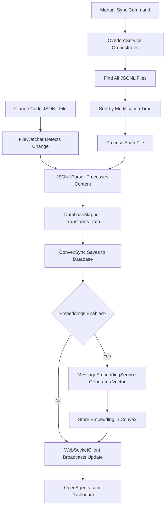
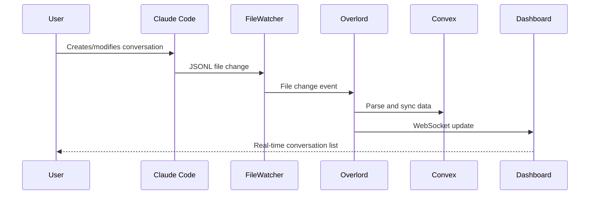

# Overlord Sync Architecture Guide

This guide provides a comprehensive understanding of the Overlord sync system for Claude Code conversations. It covers both technical architecture for coding agents and practical usage for users.

## Table of Contents
- [Overview](#overview)
- [Architecture Components](#architecture-components)
- [User Guide](#user-guide)
- [Technical Deep Dive](#technical-deep-dive)
- [Data Flow](#data-flow)
- [Database Schema](#database-schema)
- [Error Handling](#error-handling)
- [Limitations and Future Work](#limitations-and-future-work)

## Overview

The Overlord sync system transforms Claude Code from an isolated desktop tool into a networked, manageable development platform. It monitors local Claude Code conversations (JSONL files) and syncs them to a cloud database with real-time updates and web dashboard integration.

### Key Features
- **Real-time monitoring** of Claude Code session files
- **Newest-first sync** prioritizes recent conversations
- **Duplicate prevention** skips already-synced messages
- **Vector embeddings** for semantic search over conversations
- **WebSocket integration** for real-time updates
- **Type-safe architecture** using Effect-TS patterns
- **Comprehensive error handling** with graceful degradation

## Architecture Components

### 1. FileWatcher Service (`FileWatcher.ts`)

**Purpose**: Monitors Claude Code project directories for JSONL file changes.

**Watched Paths**:
- `~/.claude/projects/` (primary location)
- `~/.config/claude/projects/` (alternative location)

**File Structure**:
```
~/.claude/projects/{hashed-project-path}/{session-id}.jsonl
```

**Key Methods**:
- `findClaudePaths()` - Discovers Claude installation directories
- `watchPaths()` - Starts watching for file changes
- `getChanges()` - Streams file change events

**Events Detected**:
- `created` - New JSONL files
- `modified` - Updated conversation files
- `deleted` - Removed sessions

### 2. JSONLParser Service (`JSONLParser.ts`)

**Purpose**: Parses Claude Code JSONL files into structured data.

**Supported Entry Types**:
- `user` - User messages with text and optional images
- `assistant` - AI responses with thinking, content, and usage data
- `summary` - Conversation summaries for long sessions

**Parsing Features**:
- **Flexible content handling** - Adapts to various JSONL formats
- **Cost calculation** - Estimates usage costs from token data
- **Tool extraction** - Links tool_use and tool_result entries
- **Error resilience** - Continues parsing despite malformed entries

**Cost Calculation**:
```typescript
// Claude 3.5 Sonnet pricing
const INPUT_COST_PER_TOKEN = 3 / 1_000_000  // $3 per 1M tokens
const OUTPUT_COST_PER_TOKEN = 15 / 1_000_000 // $15 per 1M tokens
```

### 3. DatabaseMapper Service (`DatabaseMapper.ts`)

**Purpose**: Transforms parsed JSONL data into database-compatible records.

**Record Types**:
- `SessionRecord` - Session metadata with costs and project info
- `MessageRecord` - Individual messages with all content types
- `ImageRecord` - Separate image storage (future implementation)

**Project Name Extraction**:
```typescript
// Converts hashed paths like "-Users-christopherdavid-code-myproject"
// Into friendly names like "myproject"
```

### 4. ConvexSync Service (`ConvexSync.ts`)

**Purpose**: Handles database operations with Convex cloud storage.

**Sync Strategy**:
1. **Session-first** - Create/update session records
2. **Message deduplication** - Check existing messages by `entry_uuid`
3. **Content updates** - Apply parsing fixes to existing messages
4. **Atomic operations** - Process entire sessions consistently

**Critical Implementation Notes**:
- **ALWAYS check for existing messages** before creating new ones
- **Use `entry_uuid` for deduplication** - this is the primary key
- **Update existing messages** to apply content fixes
- **Generate embeddings** when enabled via CLI options
- **Skip images** - log presence but don't store (not yet implemented)

**Vector Embedding Integration**:
- **Optional embedding generation** via `--enable-embeddings` flag
- **Configurable embedding models** via `--embedding-model` option
- **Content filtering** - only embeds messages with meaningful content
- **Error resilience** - embedding failures don't break sync process
- **1536-dimensional vectors** stored in Convex with cosine similarity search

### 5. WebSocketClient Service (`WebSocketClient.ts`)

**Purpose**: Real-time communication with OpenAgents.com dashboard.

**Message Types**:
- `heartbeat` - Periodic health checks (30-second intervals)
- `file_change` - File system event notifications
- `session_update` - Sync completion notifications
- `command_result` - Future remote command responses

**Authentication**:
```typescript
{
  headers: {
    'Authorization': `Bearer ${apiKey}`,
    'X-User-ID': userId
  }
}
```

### 6. OverlordService (`OverlordService.ts`)

**Purpose**: Main orchestrator that coordinates all services.

**Core Operations**:
- `startDaemon()` - Launch monitoring with WebSocket connection
- `syncSession()` - Sync specific session by ID
- `syncAllSessions()` - Bulk sync with newest-first ordering
- `detectClaudeInstallations()` - Find and analyze Claude directories

**Daemon State**:
```typescript
interface DaemonState {
  running: boolean
  startTime: Date | null
  sessionCount: number
  lastSync: Date | null
}
```

## User Guide

### Installation

Navigate to the Overlord package:
```bash
cd packages/overlord
```

### Available Commands

#### 1. Detect Claude Installations
```bash
overlord detect
```
Shows all discovered Claude Code installations with session counts and last activity.

#### 2. Start Monitoring Daemon
```bash
overlord spawn --user-id=your-user-id --api-key=your-api-key
```
Launches the background monitoring service with real-time sync.

**Options**:
- `--user-id` - Your user identifier
- `--api-key` - API key for OpenAgents.com
- `--endpoint` - WebSocket endpoint (default: wss://openagents.com/ws)

#### 3. Manual Sync Operations
```bash
# Sync all sessions (newest first)
overlord transport all --user-id=xxx --api-key=yyy

# Sync specific session
overlord transport session-id-here --user-id=xxx --api-key=yyy

# Sync with folder filtering
overlord transport all --user-id=xxx --api-key=yyy --include-path="myproject" --exclude-path="temp"

# Sync with vector embeddings enabled
overlord transport all --user-id=xxx --api-key=yyy --enable-embeddings --embedding-model="text-embedding-3-small"
```

**Path Filtering Options**:
- `--include-path` or `-i` - Only sync projects containing this path substring (can be used multiple times)
- `--exclude-path` or `-e` - Exclude projects containing this path substring (can be used multiple times)

**Vector Embedding Options**:
- `--enable-embeddings` - Generate vector embeddings for semantic search (defaults to false)
- `--embedding-model` - Embedding model to use (defaults to "text-embedding-3-small")

#### 4. Limited Import (Testing)
```bash
overlord import --user-id=xxx --api-key=yyy --limit=10

# Import with path filtering
overlord import --user-id=xxx --api-key=yyy --limit=5 --include-path="important-project"

# Import with embeddings enabled
overlord import --user-id=xxx --api-key=yyy --limit=5 --enable-embeddings --embedding-model="nomic-embed-text"
```
Imports up to 10 most recent conversations for testing purposes. Supports same path filtering and embedding options as transport command.

#### 5. Check Status
```bash
overlord status
```
Shows daemon status, uptime, watched paths, and sync statistics.

### Typical Workflow

1. **First-time setup**:
   ```bash
   overlord detect  # Verify Claude installations found
   overlord import --limit=5  # Test with recent conversations
   ```

2. **Start monitoring**:
   ```bash
   overlord spawn --user-id=xxx --api-key=yyy
   ```

3. **Manual sync** (if needed):
   ```bash
   # Sync all projects
   overlord transport all --user-id=xxx --api-key=yyy
   
   # Or sync only specific projects
   overlord transport all --user-id=xxx --api-key=yyy --include-path="important-work"
   ```

### Current Limitations

**✅ Folder Filtering**: 
- System supports `--include-path` and `--exclude-path` options for selective syncing
- Path filtering works by substring matching on project directory paths
- Multiple include/exclude paths can be specified

**❌ No Selective Sync**:
- Cannot sync specific project types or date ranges
- All discovered JSONL files are processed

**❌ Manual API Credentials**:
- Must provide user ID and API key for each command
- No persistent credential storage

## Technical Deep Dive

### Sync Priority Algorithm

**Problem Solved**: With 652+ Claude Code sessions, users want recent work available immediately.

**Solution**: Sort files by modification time (newest first):

```typescript
// Get file stats and sort by modification time
const filesWithStats = yield* Effect.tryPromise(async () => {
  const statsPromises = jsonlFiles.map(async (file) => {
    const filePath = path.join(claudePath, file)
    const fileStat = await fs.stat(filePath)
    return { file, filePath, mtime: fileStat.mtime.getTime() }
  })
  const results = await Promise.all(statsPromises)
  return results.sort((a, b) => b.mtime - a.mtime) // Newest first
})
```

### Effect Service Architecture

**CRITICAL**: All services use Effect-TS patterns. Coding agents MUST understand:

1. **Service Dependencies**:
   ```typescript
   // All layers must be provided
   Effect.provide(OverlordService.OverlordServiceLive),
   Effect.provide(ConvexSync.ConvexSyncServiceLive),
   Effect.provide(FileWatcher.FileWatcherLive),
   Effect.provide(WebSocketClient.WebSocketClientLive)
   ```

2. **Error Handling**:
   ```typescript
   // Use Effect.catchAll for graceful degradation
   yield* syncOperation.pipe(
     Effect.catchAll((error) => Effect.log(`Sync failed: ${error}`))
   )
   ```

3. **Concurrent Operations**:
   ```typescript
   // Fork background processes
   yield* Effect.fork(backgroundTask)
   ```

### Database Operations

**Message Deduplication Logic**:
```typescript
// ALWAYS check before creating
const existingMessage = yield* client.ConvexClient.messages.getByUuid(
  sessionId,
  messageRecord.entry_uuid
)

if (!existingMessage) {
  // Create new message
  yield* client.ConvexClient.messages.create(messageRecord)
} else {
  // Update existing message for fixes
  yield* client.ConvexClient.messages.update(updateArgs)
}
```

**Session Upsert Pattern**:
```typescript
// Sessions are updated for activity tracking
const existingSession = yield* client.ConvexClient.sessions.getById(sessionId)

if (!existingSession) {
  yield* client.ConvexClient.sessions.create(sessionRecord)
} else {
  yield* client.ConvexClient.sessions.updateActivity(sessionId)
}
```

## Data Flow

### Complete Sync Flow



### Real-time Event Flow



## Database Schema

### Key Tables

**claude_sessions**:
```sql
CREATE TABLE claude_sessions (
  id VARCHAR(255) PRIMARY KEY,
  user_id VARCHAR(255) NOT NULL,
  project_path TEXT NOT NULL,
  project_name VARCHAR(255),
  status VARCHAR(50) DEFAULT 'active',
  started_at BIGINT NOT NULL,
  last_activity BIGINT NOT NULL,
  message_count BIGINT DEFAULT 0,
  total_cost DECIMAL(10,6) DEFAULT 0.000000
);
```

**claude_messages**:
```sql
CREATE TABLE claude_messages (
  id BIGINT AUTO_INCREMENT PRIMARY KEY,
  session_id VARCHAR(255) NOT NULL,
  entry_uuid VARCHAR(255) NOT NULL UNIQUE,
  entry_type VARCHAR(50) NOT NULL,
  role VARCHAR(50),
  content LONGTEXT,
  thinking LONGTEXT,
  summary LONGTEXT,
  model VARCHAR(255),
  token_usage JSON,
  cost DECIMAL(10,6),
  timestamp BIGINT NOT NULL,
  turn_count BIGINT,
  tool_name VARCHAR(255),
  tool_input LONGTEXT,
  tool_use_id VARCHAR(255),
  tool_output LONGTEXT,
  tool_is_error BOOLEAN DEFAULT FALSE,
  embedding_id VARCHAR(255)  -- Links to Convex message_embeddings table
);
```

**message_embeddings** (Convex):
```typescript
// Convex schema for vector embeddings
message_embeddings: defineTable({
  message_id: v.id("messages"),           // Reference to message
  embedding: v.array(v.float64()),       // 1536-dimensional vector
  model: v.string(),                     // Embedding model used
  dimensions: v.number(),                // Vector dimensions (1536)
  created_at: v.number()                 // Timestamp
}).vectorIndex("by_embedding", {
  vectorField: "embedding",
  dimensions: 1536,                      // OpenAI text-embedding-3-small
  filterFields: ["model"]                // Enable model-based filtering
})
```

### Indexes for Performance

```sql
-- Essential indexes for common queries
CREATE INDEX idx_sessions_user_id ON claude_sessions(user_id);
CREATE INDEX idx_sessions_last_activity ON claude_sessions(last_activity);
CREATE INDEX idx_messages_session_id ON claude_messages(session_id);
CREATE INDEX idx_messages_entry_uuid ON claude_messages(entry_uuid);
CREATE INDEX idx_messages_timestamp ON claude_messages(timestamp);
```

## Error Handling

### Graceful Degradation

**File Parsing Errors**:
- Continue processing other files
- Log specific error details
- Maintain sync statistics

**Network Failures**:
- WebSocket auto-reconnection (5-second delay)
- Database operation retries
- Local file monitoring continues

**Service Dependencies**:
- Services operate independently where possible
- Missing dependencies logged but don't crash daemon
- Partial functionality maintained

### Logging Strategy

**Log Levels**:
- `Effect.log()` - General information
- `Effect.logWarning()` - Recoverable issues (e.g., images not stored)
- `Effect.logError()` - Critical failures

**Key Log Points**:
```typescript
yield* Effect.log(`Created new session: ${sessionId}`)
yield* Effect.log(`Synced ${entries.length} entries for session ${sessionId}`)
yield* Effect.logWarning(`Message has ${images.length} images - not yet implemented`)
yield* Effect.logError(`Failed to sync session: ${error}`)
```

## Limitations and Future Work

### Current Missing Features

**1. Folder Filtering** ⚠️ **HIGH PRIORITY**
- No way to include/exclude specific project directories
- Users with many projects need selective sync
- **Recommendation**: Add command-line options:
  ```bash
  overlord spawn --include-path="/path/to/important/project"
  overlord spawn --exclude-path="/path/to/temp/experiments"
  ```

**2. Image Storage**
- Images detected and logged but not stored
- Affects completeness of conversation history
- **Implementation needed**: Image upload to cloud storage

**3. Background Daemon Management**
- `burrow`/`unburrow` commands are placeholders
- No process management or auto-restart
- **Implementation needed**: Proper daemon lifecycle

**4. Credential Persistence**
- API keys required for every command
- No secure local storage option
- **Security consideration**: Balance convenience vs. security

**5. Remote Command Execution**
- WebSocket receives commands but doesn't execute them
- Future feature for remote management
- **Use case**: Trigger syncs from web dashboard

### Recommended Enhancements

**✅ Folder Filtering** (Implemented)
```typescript
interface FilterOptions {
  includePaths?: ReadonlyArray<string>
  excludePaths?: ReadonlyArray<string>
}
```

**Priority 1: Advanced Filtering**
```typescript
interface AdvancedFilterOptions extends FilterOptions {
  projectPatterns?: string[]
  dateRange?: { after?: Date; before?: Date }
  fileSize?: { minMB?: number; maxMB?: number }
}
```

**Priority 2: Sync Configuration**
```typescript
interface SyncConfig {
  maxConcurrentSessions: number
  batchSize: number
  retryAttempts: number
  syncInterval: number
}
```

**Priority 3: Monitoring Dashboard**
- Real-time sync status
- Per-project sync statistics
- Error reporting and resolution

## Common Issues and Solutions

### Issue: "No Claude installations found"
**Cause**: Claude Code data not in expected locations
**Solution**: 
1. Check if Claude Code is installed and has been used
2. Verify data location: `ls ~/.claude/projects/`
3. Check alternative location: `ls ~/.config/claude/projects/`

### Issue: "Service not found" errors
**Cause**: Missing Effect service layers
**Solution**: Ensure all required layers are provided:
```typescript
Effect.provide(OverlordService.OverlordServiceLive)
Effect.provide(ConvexSync.ConvexSyncServiceLive)
Effect.provide(FileWatcher.FileWatcherLive)
Effect.provide(WebSocketClient.WebSocketClientLive)
```

### Issue: WebSocket connection failures
**Cause**: Network issues or invalid credentials
**Solution**:
1. Verify API key and user ID
2. Check network connectivity
3. Confirm endpoint URL (default: wss://openagents.com/ws)

### Issue: Duplicate messages in database
**Cause**: Concurrent sync operations or UUID collisions
**Solution**: ConvexSync checks `entry_uuid` before creation

## Conclusion

The Overlord sync system provides a robust foundation for Claude Code integration with comprehensive error handling, real-time updates, and extensible architecture. The newest-first sync priority ensures users see their most recent work immediately, while the Effect-TS architecture provides type safety and reliable error handling.

**For Coding Agents**: Always respect the Effect service architecture, provide all required layers, and understand the sync priority system.

**For Users**: Start with `detect` and `import --limit=5` for testing, then use `spawn` for continuous monitoring.

## Vector Embedding Features

### Semantic Search Capabilities

The vector embedding system enables powerful semantic search over Claude Code conversations:

**Search Types**:
- **Similarity search** - Find messages similar to a query vector
- **Text-based search** - Generate embedding from query text and find similar messages  
- **Cross-session search** - Search across multiple conversations
- **Model-filtered search** - Search within specific embedding models

**Example Usage**:
```typescript
// Search for similar messages using text query
const results = yield* ConvexEmbeddingService.searchSimilarByText({
  query_text: "database migration error",
  limit: 10,
  model_filter: "text-embedding-3-small"
})

// Search within specific session
const sessionResults = yield* ConvexEmbeddingService.searchSimilar({
  query_embedding: embeddingVector,
  session_id: "specific-session-id",
  limit: 5
})
```

### Content Processing Pipeline

**Message Content Extraction**:
```typescript
// Content combination for embedding generation
const messageContent = {
  content: messageRecord.content || "",
  thinking: messageRecord.thinking || "",
  tool_output: messageRecord.tool_output || "",
  entry_type: messageRecord.entry_type,
  role: messageRecord.role
}
```

**Content Filtering Rules**:
- **Skip summary entries** - Summaries are meta-content, not searchable content
- **Require meaningful content** - At least one non-empty field (content, thinking, tool_output)
- **Include tool outputs** - Tool results are valuable for semantic search
- **Include thinking content** - AI reasoning is useful for finding similar problem-solving patterns

### Embedding Provider Integration

**Current Implementation** (OpenAI):
- Model: `text-embedding-3-small` (1536 dimensions)
- Cost: ~$0.00002 per 1K tokens
- Performance: ~1000 embeddings/minute

**Recommended Alternatives** (Local/Free):
```bash
# Ollama with nomic-embed-text
overlord transport --enable-embeddings --embedding-model="nomic-embed-text"

# Hugging Face sentence-transformers  
overlord transport --enable-embeddings --embedding-model="all-MiniLM-L6-v2"

# Custom embedding service
overlord transport --enable-embeddings --embedding-model="custom-model"
```

### Performance Characteristics

**Storage Requirements**:
- 1536 dimensions × 8 bytes (float64) = ~12KB per embedding
- 1000 messages × 12KB = ~12MB storage
- Convex vector index adds ~20% overhead

**Search Performance**:
- Sub-50ms query response for <100K vectors
- Cosine similarity with HNSW indexing
- Configurable result limits (1-256)

**Generation Performance**:
- Embedding generation during sync (optional)
- Graceful failure - embedding errors don't break sync
- Batch processing for efficiency

### Future Enhancements

**Priority 1: Local Embedding Support**
- Remove dependency on external embedding APIs
- Support Ollama, Hugging Face, and custom endpoints
- Reduce costs and improve privacy

**Priority 2: Advanced Search Features**
- Hybrid search (semantic + keyword)
- Conversation-aware search (context continuity)
- Time-based relevance scoring

**Priority 3: Search UI Integration**  
- Web dashboard search interface
- Real-time search suggestions
- Search result ranking and filtering

**Critical Missing Feature**: Local embedding provider support should be the next enhancement to eliminate external API dependencies.