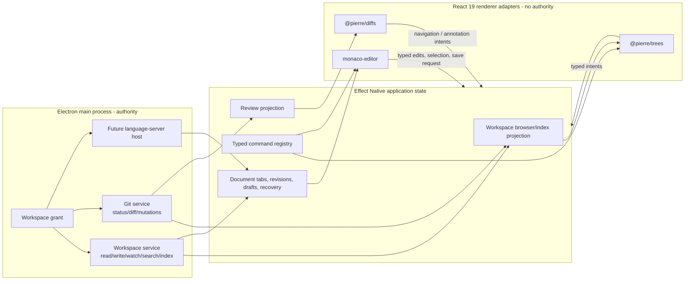

# OpenAgents Desktop basic IDE: VS Code outcomes with Monaco and Pierre

Date: 2026-07-18

Status: implementation plan; no product code is changed by this document

Target: `apps/openagents-desktop/`, its Effect Native contracts, and narrowly
shared Desktop workbench styles in `packages/ui/`

Owner outcome: open an explicit Editor mode in Desktop, see a real repository
explorer beside real editable source, and cover the ordinary VS Code editing
loop without importing the VS Code workbench or its Explorer implementation

## Decision

Build the classic OpenAgents Desktop IDE as three replaceable projections over
authority OpenAgents already owns:

1. Use **`monaco-editor`** as the code-editing engine. Start from the exact
   `0.55.1` dependency and worker-loading pattern already proven in the retired
   Khala Code Desktop implementation, then upgrade only through a separate
   compatibility packet.
2. Use **`@pierre/trees@1.0.0-beta.5`** through its public React entry point for
   the repository explorer. Do not port VS Code's `AsyncDataTree`, list widget,
   Explorer renderer, file-service integration, or context-key machinery.
3. Use **`@pierre/diffs@1.2.12`** for file and aggregate review instead of the
   current hand-rendered `<pre>` diff. The same adapter should later power
   compare, conflict, and agent-change review.
4. Keep **Effect Native and OpenAgents Desktop state/services canonical**.
   Monaco owns scoped editing mechanics; Pierre owns scoped tree/diff rendering;
   neither owns the workspace, documents, Git repository, permissions, session,
   recovery, or receipts.
5. Extend the existing `files` workspace mode into the first **Editor mode**
   rather than creating another application shell. Files replaces the existing
   primary rail with Explorer, reuses the existing top bar for mode controls,
   and reuses the existing main region for source. It is never a right panel.

This is not a VS Code fork. It is VS Code-level basic workflow parity built from
a stock editor engine, Pierre's focused projection libraries, and OpenAgents'
typed authority plane.

## Owner-directed first delivery: Command-E Files sidebar

The first deliverable is deliberately narrower than Editor mode: **Command-E**
on macOS (**Control-E** elsewhere) toggles the existing Files tree for the
current selected coding session/worktree as an existing-shell workspace mode.
The tree replaces the primary Sessions rail, Files controls reuse the existing
top bar, and the editor reuses the existing main region. This does not wait for
Monaco or the new whole-workspace path index. The minimum audited Pierre adapter
is pulled forward so Files is a real navigable tree rather than a temporary
hand-rendered list.

The ordered implementation ledger is:

1. [#9006](https://github.com/OpenAgentsInc/openagents/issues/9006) admits the
   canonical command binding, pure surface transition, invariants, and behavior
   contract.
2. [#9007](https://github.com/OpenAgentsInc/openagents/issues/9007) wires the
   effective shortcut to the mounted right sidebar, proves current-worktree
   scope and toggle behavior, and records the packaged verification boundary.
3. [#9008](https://github.com/OpenAgentsInc/openagents/issues/9008) fixes
   literal Git-ignore classification for arbitrary valid filenames, replaces
   the temporary list with the pinned Pierre Trees projection, and proves a
   non-empty root, directory expansion, and document open in packaged Electron.
4. [#9009](https://github.com/OpenAgentsInc/openagents/issues/9009) supersedes
   the right-sidebar composition: Files replaces the existing primary rail,
   reuses the existing top bar and main region, is removed from the right-panel
   catalog, and restores Sessions plus Chat on exit.

Implementation status: #9006 and #9007 landed the contract, typed toggle, and
mounted current-worktree surface. #9008 upgrades that surface to the real
Pierre tree and closes the empty-tree regression exposed by a leading-colon
filename in the owner's working directory. #9009 makes the final owner-directed
shell composition explicit without changing the workspace authority boundary.

This quick-files slice is a prerequisite interaction rung, not a substitute
for IDE-00 through IDE-07. IDE-02 still owns the complete indexed, watched,
scale-tested explorer rather than duplicating the quick-files adapter.

## Exact evidence pins

The source checkouts were clean and synced before this plan was written.

| Source | Commit | Tree | Observed | Role |
| --- | --- | --- | --- | --- |
| OpenAgents target | `907ff2ac94ba7b56964358645deb4d70d23fd59c` | `4fb0f937f9fabcf86e786abaf630076cef0ed578` | 2026-07-18 CDT | Current Desktop authority, state, React workbench, and prior audits |
| `microsoft/vscode` | `70bbb6920a89486a98a7c810bdb5596d0de746f5` | `25749933e2b845f80b6dbcaa24e4bfef6f647502` | Synced 2026-07-18 CDT; commit timestamp 2026-07-19 UTC | Editor/workbench behavior and architecture reference |
| `pierrecomputer/pierre` | `4f94a5e765195b27e1e4188b943aab2ae44613cb` | `07920b0558a4c3ecd68a39198cca1046ac309c4b` | 2026-07-18 CDT | Tree, diff, and editor-theme projection reference |

License boundary:

- VS Code is MIT-licensed. Study its behavior and architecture; consume Monaco
  as a package rather than copying the workbench.
- Pierre trees and diffs are Apache-2.0 at the pinned revision. The packaged
  Desktop application must carry the required licenses and the trees NOTICE.
  The #9008 package-boundary oracle pins Trees exactly, confines the import to
  the owned adapter, and verifies the installed license and NOTICE closure.
- No direct dependency on private `@pierre/path-store` is permitted. It is an
  implementation detail inlined into the public tree build.

## What OpenAgents already audited and built

### The earlier VS Code audit

`docs/khala-code/2026-07-05-vscode-explorer-editor-adoption-audit.md`
already reached the correct high-level decision:

- use Monaco rather than vendoring VS Code editor internals;
- adapt stable identity, typed metadata, deterministic sorting, reveal, and
  keyboard behavior from Explorer without taking the workbench stack;
- keep a product-owned workspace service between the renderer and every
  filesystem provider;
- load Monaco and its workers only when the editor surface is opened.

That audit was not hypothetical. Its implementation log records a functioning
retired Khala Code vertical slice:

- `1d04ee5379` rendered a read-only file tree and Monaco source pane;
- `6db1a404ab` added open tabs and loaded-tree search;
- the package pinned `monaco-editor@0.55.1`;
- Monaco's editor, JSON, CSS, HTML, and TypeScript workers were loaded through
  Vite `?worker` imports;
- the editor was lazy, themed from OpenAgents tokens, bounded to twelve tabs,
  disposed explicitly, and could attach a selected file/range to the composer.

The superseded client was intentionally removed in `393510cee5`; its
architecture did not survive as product authority. Reuse the proven bundling,
worker, theme, and lifecycle lessons, not its raw absolute-path model URIs,
read-only limitation, hand-built tree, or DOM-local application state.

An older web experiment (`f00e51a4ad`) also mounted Monaco beside a custom file
tree. It is evidence that the dependency and interaction model are familiar,
not a production component to resurrect.

### The current Desktop foundation

The current Desktop is much closer to a real IDE beneath the pixels than the
visible `<textarea>` suggests.

| Capability already present | Current owner / evidence | Keep or change |
| --- | --- | --- |
| Explicit workspace grant and root-private authority | `apps/openagents-desktop/src/workspace-service.ts` | Keep |
| Root-relative opaque path refs in the renderer | `workspace-contract.ts`, `workspace-browser.ts` | Keep |
| Lazy, paged directory tree with ignore/secret/binary/symlink policy | `workspace-service.ts`, `workspace-browser.ts` | Keep as metadata/authority; add a Pierre path-index projection |
| Cancellable path/content search and 20,000-entry scale bound | `workspace-search-host.ts`, `workspace-search-worker.ts` | Keep; do not overload it as the tree index |
| Recursive watcher, epoch invalidation, overflow handling | `workspace-service.ts` | Keep; project confirmed changes into Pierre |
| Create file/folder, revision-bound rename, non-recursive delete, reveal | workspace operation contract and service | Keep; Pierre callbacks dispatch these intents only |
| UTF-8 open, save, save-as, 1 MB limit, expected-revision conflicts | document contract and service | Keep |
| Dirty tabs, close confirmation, find, selection, undo/redo scaffold | `renderer/workspace-editor.ts` | Evolve for Monaco's incremental/native model mechanics |
| Rename retargeting and restart recovery drafts | `renderer/workspace-editor.ts`, shell recovery | Keep and harden |
| Git status, bounded diffs, stale checks, secret/binary refusal | workspace and Git/GitHub services | Keep as authority |
| Files + editor split UI, tabs, search, save/conflict UI | `renderer/react-workspace-surfaces.tsx` | Replace custom tree and `<textarea>` with adapters |
| Maximizable workbench surface | `renderer/react-primitive-adapters.tsx`, `surface-layout.ts` | Make this the Editor-mode entry point |
| Replaceable typed Effect Native `CodeEditor` host contract | `apps/openagents.com/packages/effect-native-core/src/index.ts` | Extend narrowly where required |
| Documented textarea host driver | `apps/openagents.com/packages/effect-native-render-dom/src/index.ts` | Retain as test/fallback; install app-owned Monaco driver in Desktop |
| Shared Khala/Effect Native theme tokens | `packages/ui/src/workbench/theme-bridge.ts`, `desktop-workbench.css` | Remain theme authority |

The visible gap is therefore specific:

- production React files UI still renders its own non-virtualized tree, caps
  the visible projection at 500 rows, and edits in a `<textarea>`;
- the compatibility Effect Native renderer still registers
  `makeStubCodeEditorDriver()`;
- review still hand-renders hunks instead of using Pierre;
- there is no language-server bridge or Problems projection;
- “Files” can maximize, but the product does not present that state as a clear
  first-class Editor mode.

### Existing product contract

This plan implements a first bounded rung of requirements already stated in:

- `specs/desktop/desktop-trust-complete-workbench.product-spec.md` — two
  densities over one state graph, including a classic workbench with editor,
  files, symbols, search, diagnostics, source control, diff, terminal, preview,
  extensions, settings, themes, and keymaps;
- `specs/openagents/cursor-capability-parity.product-spec.md` — full workflow
  parity without copying Cursor's closed bundle;
- `docs/sol/2026-07-11-openagents-coding-cutover-issue-plan.md` — CUT-17
  workspace browsing, CUT-18 practical typed editing, and CUT-19 Git review.

This plan does not claim those larger contracts are complete. It names the
minimum release that makes Editor mode useful and the next packets that reach
ordinary VS Code parity.

## What the current VS Code source says

The useful separation in current VS Code is:

```text
filesystem providers and file service
               |
        Explorer model/view
               |
editor inputs + text-file models + editor groups
               |
       Monaco editor widget/model
```

The source seams inspected at the pin include:

- Monaco public construction and models:
  `src/vs/editor/standalone/browser/standaloneEditor.ts`,
  `standaloneCodeEditor.ts`, and `editor.api.ts`;
- editor events/model attachment:
  `src/vs/editor/browser/widget/codeEditor/codeEditorWidget.ts`;
- text models and language features:
  `src/vs/editor/common/model/textModel.ts`,
  `src/vs/editor/common/services/model.ts`, and `languageFeatures.ts`;
- editor tabs/groups and dirty-close behavior:
  `src/vs/workbench/common/editor/editorGroupModel.ts` and
  `src/vs/workbench/browser/parts/editor/editorGroupView.ts`;
- text-file resolve/dirty/save/revert/conflict behavior:
  `src/vs/workbench/services/textfile/common/textFileEditorModel.ts` and
  `src/vs/workbench/contrib/files/browser/editors/textFileEditor.ts`;
- Explorer model, view, data source, render, filtering, sorting, DnD, and
  accessibility:
  `src/vs/workbench/contrib/files/common/explorerModel.ts`,
  `browser/views/explorerView.ts`, and `browser/views/explorerViewer.ts`.

### Facts to preserve

- A Monaco editor widget is not the document authority. It attaches to a text
  model and emits model, cursor, layout, focus, clipboard, and scroll events.
- VS Code keeps editor-group/tab lifecycle separate from the text-file model.
- Dirty, saving, conflict, and close veto are explicit model/group states.
- Explorer separates identity, data source, filtering, sorting, renderer,
  accessibility, and interaction.
- VS Code's Explorer is a large workbench subsystem: async tree, virtualized
  list, file service, configuration, context keys, menus, commands, DnD,
  decorations, labels, and contribution registries are intertwined.

### OpenAgents inference

VS Code's layering is why Monaco is reusable and its Explorer is not. The text
widget/model boundary is a focused product seam; the Explorer boundary assumes
the rest of the VS Code platform. Reusing Monaco gives OpenAgents mature editing
mechanics without inheriting workspace authority. Reusing Pierre gives the
virtualized, path-first explorer and review kernels without reconstructing the
VS Code service lattice. OpenAgents' typed services already cover the authority
those widgets deliberately do not.

## What Pierre changes in the earlier plan

The earlier audit proposed a small owned tree first and virtualization later.
Pierre makes that obsolete.

At the pinned revision, `@pierre/trees` provides:

- a path-first public API with canonical string paths;
- virtualized visible projections and prepared input helpers;
- React 19 bindings;
- selection, focus, scrolling, search, Git status, icons, row decorations,
  context-menu composition, DnD, and inline rename capabilities;
- `add`, `remove`, `move`, `batch`, and `resetPaths` projection mutations;
- shadow-DOM rendering, density controls, and CSS-variable theme inputs;
- tests, E2E coverage, benchmarks, and accessibility behavior.

At the same pin, `@pierre/diffs` supplies file, patch, diff, merge-conflict,
multi-file, virtualized, React, SSR, and worker-backed rendering.

Neither package is authority. In particular:

- `@pierre/trees` consumes a flat path set. It does not read the filesystem.
- Its public API does not provide an async directory-expansion data-source
  callback like VS Code's `IAsyncDataSource`.
- Its built-in inline rename updates its own projection immediately after the
  callback; it is not an asynchronous revision-conflict protocol.
- Its shadow root may complicate theme, focus, test, and VoiceOver behavior.
- The tree package is beta.

Therefore the first integration must add an OpenAgents path-index projection,
leave built-in DnD and optimistic rename disabled, and prove packaged Electron
accessibility before treating the beta as accepted.

## Target architecture



### Authority rules

1. The renderer never receives or constructs an absolute workspace root.
2. Pierre receives only canonical relative path refs and safe decorations.
3. Monaco receives content, language, an opaque document identity, and typed
   editor options. It receives no filesystem handle, process authority, Git
   handle, credential, or unrestricted URI opener.
4. Every mutation travels through the existing decoded workspace bridge with
   expected revision/epoch data where applicable.
5. A successful host result updates the canonical state first; adapters then
   reconcile their projection. Optimistic tree mutation is prohibited until a
   reversible typed protocol exists.
6. Search, language servers, Git, terminals, and preview remain separate host
   capabilities. Monaco commands may request them; Monaco does not launch them.
7. Theme input is resolved from Effect Native/OpenAgents tokens. Untrusted
   theme JSON or Pierre `unsafeCSS` never enters a trusted renderer unchecked.

## Editor mode product shape

Extend the #9009 Files workspace mode rather than adding another top-level
shell or returning Files to the right-panel manager:

- Rename the user-facing **Files** action/mode to **Editor** when Monaco lands.
- “Editor” from the project header, command palette, or keyboard shortcut enters
  the existing `files` workspace mode.
- The primary rail remains Explorer, the existing top bar carries Editor
  controls, and the main region carries tabs, source, and the bottom panel.
- Closing Editor mode returns focus to the invoking control and does not close
  documents or discard drafts.
- Editor view state remains keyed by selected coding session/worktree.

Full Editor-mode layout:

```text
+-----------------------------------------------------------------------+
| project / branch | quick open | Editor actions | Review Terminal Agent |
+----------------------+------------------------------------------------+
| EXPLORER             | tab.tsx  README.md  dirty.ts *                 |
| [filter]             +------------------------------------------------+
| v apps               |                                                |
|   v desktop          |                 MONACO                         |
|     boot.ts          |                                                |
|     shell.ts         |                                                |
| v packages           |                                                |
|   ui                 |                                                |
|                      +------------------------------------------------+
| git decorations      | Problems | Output | Terminal | Review          |
+----------------------+------------------------------------------------+
| main | TypeScript | Ln 42, Col 8 | Spaces: 2 | UTF-8 | LF | trust    |
+-----------------------------------------------------------------------+
```

First release details:

- left: Pierre explorer, fixed/resizable width, project label, local filter,
  Git decorations, selection, keyboard navigation, context menu;
- center: owned tab strip and one Monaco editor widget switching between
  scoped models;
- bottom: collapsed by default; Search and Problems appear as soon as their
  packets land, while existing Terminal and Review surfaces can be promoted
  into the same panel later;
- status: relative path/language/selection/encoding/EOL/dirty/conflict and
  workspace-trust state, with no fake LSP or Git readiness;
- optional agent rail: existing conversation can be restored beside Editor;
  the source editor never becomes a separate session authority.

At narrow widths, do not squeeze Monaco below a usable measure. The explorer
becomes an overlay/drawer and the bottom panel becomes a sheet; the document
remains primary.

## Pierre tree adapter

### Why a new path-index projection is required

The current workspace browser loads direct children lazily in pages and shows a
maximum of 500 visible rows. Pierre's engine wants a canonical path list and
then virtualizes the visible projection itself. Feeding only currently expanded
pages would make unopened directories look empty, but Pierre does not expose a
public “expanded, please fetch children” callback.

Add a distinct, cancellable `workspaceTreeIndex` operation:

```ts
type DesktopWorkspaceTreeIndexChunk = Readonly<{
  grantRef: string
  epoch: number
  sequence: number
  entries: ReadonlyArray<Readonly<{
    pathRef: string
    kind: "file" | "directory"
  }>>
  complete: boolean
  truncated: boolean
  omittedCount: number | null
}>
```

The exact schema may differ, but these semantics must survive:

- main-process scan under the selected workspace grant;
- the same hidden, Git-ignore, secret, symlink, and permission policy as tree
  pages and search;
- deterministic directory-first path ordering;
- worker/cancellable execution with explicit sequence and epoch;
- bounded chunks so the IPC bridge never carries an unbounded array;
- an honest truncation state rather than an apparently complete explorer;
- no file contents, absolute roots, inode metadata, or credentials;
- disposal on workspace/session/window close.

Do not implement the index as `search("")`. Search has different caps,
pagination, previews, cancellation, and user semantics.

### Adapter mapping

- Convert a directory ref to Pierre's canonical trailing-slash form only at the
  adapter boundary: `src/components/`.
- Keep files as their relative refs: `src/components/Button.tsx`.
- Stream chunks into `FileTree.batch([{ type: "add", path }...])`, or use
  `preparePresortedFileTreeInput` once a measured whole-index threshold shows
  that one prepared reset is faster. The threshold and memory cost must be
  checked in the 20k, 100k, and pathological-depth fixtures.
- Store the path-ref/kind mapping in owned adapter state. Pierre numeric/private
  IDs never cross the adapter.
- `onSelectionChange` dispatches a typed selection intent. File activation
  opens a document; directory activation only changes projection focus/expand.
- Project Git status through `setGitStatus`/`applyGitStatusPatch` after status
  authority confirms the snapshot.
- Project watcher changes only after the main service emits a validated epoch.
  Batch related add/remove/move changes; on overflow, discard the projection
  and request a fresh index.
- Drive reveal with `scrollToPath(path, { focus: true, offset: "nearest" })`
  after confirming the path exists in the current epoch.

### Mutations

Use Pierre's context-menu and row-decoration composition for buttons, but send
operations to existing OpenAgents intents:

- New File / New Folder -> existing typed create flow;
- Rename -> existing expected-revision flow;
- Delete -> existing non-recursive confirmation flow;
- Reveal in Finder -> main-only reveal flow;
- Open to Side / Add to Agent / Copy Relative Path -> typed renderer intents.

Do not enable Pierre's built-in optimistic rename or DnD in the first release.
After a successful host rename, call `tree.move`. After a conflict or refusal,
leave the projection untouched and show the typed reason. DnD requires an
explicit move/copy contract, collision policy, multi-selection semantics,
rollback, and proof before it can be enabled.

### Styling and accessibility

- Use `@pierre/trees/react`; do not register global custom elements unless the
  React entry requires it.
- Set public tree CSS variables from the resolved Effect Native theme. Avoid
  `unsafeCSS` in production.
- Use OpenAgents density tokens and preserve a minimum usable pointer target.
- Confirm shadow-DOM focus, roving tab stop, typeahead/search, rename, context
  menu, selection announcement, high contrast, and VoiceOver in packaged
  Electron.
- If the pinned beta fails an acceptance gate, fix or upstream the focused
  defect behind the adapter. Do not replace it with VS Code's tree stack.

## Monaco adapter and document model

### Package/runtime boundary

Add `monaco-editor@0.55.1` as an exact Desktop dependency first because that
version already built and packaged in the retired client. Keep all Monaco
imports inside app-owned renderer adapter modules. The generic Effect Native
package must not depend on Monaco.

Extract the proven worker setup into a single lazy runtime:

- core editor worker;
- JSON worker;
- CSS/SCSS/Less worker;
- HTML/Handlebars/Razor worker;
- TypeScript/JavaScript worker;
- Monaco editor CSS.

No Monaco/Pierre editor chunk or worker should load during a chat-only launch.
All worker URLs must resolve from the packaged application without network
access or relaxed Content Security Policy.

Suggested app-owned files:

```text
apps/openagents-desktop/src/renderer/ide/
  editor-mode.tsx
  monaco-runtime.ts
  monaco-workspace-editor.tsx
  monaco-code-editor-driver.ts
  monaco-model-registry.ts
  pierre-tree-adapter.tsx
  pierre-diff-adapter.tsx
  ide-theme.ts
  ide-status-bar.tsx
  ide-bottom-panel.tsx
```

The production React renderer uses `monaco-workspace-editor.tsx`. The
compatibility Effect Native renderer can register
`makeDesktopMonacoCodeEditorDriver()` over the same runtime/controller instead
of the stub. One runtime and model-lifecycle implementation is shared; React
and Host drivers are thin lifecycle adapters.

### Stable model identity without absolute paths

Do not repeat the retired client's `monaco.Uri.file(result.path)`, which placed
raw absolute paths in renderer state and Monaco diagnostics.

Give every open tab a stable opaque `documentRef`. Construct an adapter-local
URI such as:

```text
oa-workspace://<workspace-session-ref>/<document-ref>
```

The canonical state maps `documentRef` to the current relative `pathRef` and
revision. Rename changes the binding and language mode without exposing the
root or invalidating tab identity. A future main-process LSP bridge translates
between opaque renderer document refs and real server-side file URIs; raw LSP
file URIs do not cross into the renderer.

### Canonical versus ephemeral state

Effect Native/OpenAgents owns:

- document ref -> relative path binding;
- base revision, encoding, EOL, dirty/conflict/save state;
- bounded current draft and restart-recovery snapshot;
- tabs, active tab, close confirmation, preview/pinned state, and groups;
- command intent, permissions, context attachments, and receipts.

Monaco owns only scoped editor mechanics:

- text model implementation and native edit/undo stack;
- cursor/multi-cursor mechanics;
- selection, folds, scroll position, decorations, and editor view state;
- tokenization and built-in language-worker state;
- find/replace widget presentation.

Monaco mechanics must continuously reconcile to canonical document state. They
must not become the only copy of an unsaved draft.

### Incremental edit contract

The current `CodeEditorEvent` sends the entire value after every change and the
application keeps a second string-array undo stack. That was sufficient for a
textarea but is the wrong long-term Monaco boundary.

Extend the typed event contract with bounded incremental edits:

```ts
type CodeEditorIncrementalChange = Readonly<{
  rangeOffset: number
  rangeLength: number
  text: string
}>

type CodeEditorEvent =
  | Readonly<{
      type: "content_changes"
      documentRef: string
      modelVersion: number
      changes: ReadonlyArray<CodeEditorIncrementalChange>
    }>
  | Readonly<{
      type: "selection"
      documentRef: string
      selections: ReadonlyArray<{
        start: number
        end: number
        direction: "ltr" | "rtl"
      }>
    }>
  | Readonly<{ type: "save_requested"; documentRef: string }>
```

Apply Monaco changes in a deterministic offset order to the bounded canonical
draft. Reject a gap, stale model version, oversized result, or unknown document
ref by resynchronizing from canonical state rather than guessing. Debounce
recovery persistence, not canonical state updates.

Undo/redo commands execute against Monaco's active model, whose resulting
changes return through the same typed edit event. Remove the duplicate manual
undo arrays after migration. A monotonic typed command token can carry
programmatic selection, reveal, undo, redo, format, or action requests into the
adapter without an untyped global event bus.

### Save and external changes

Save remains revision-bound:

1. Monaco edit event updates the canonical draft and dirty state.
2. Cmd/Ctrl+S emits `save_requested`; the application reads the canonical
   draft, current path binding, and expected revision.
3. The existing main service performs the write.
4. A saved result advances base revision and clears dirty state without
   replacing the Monaco model if its model version still matches.
5. A conflict keeps the draft open and displays Reload Theirs, Compare, and
   Save Mine. “Save Mine” remains explicit.

Watcher behavior:

- clean tab + external update -> load the new revision and preserve/rebase view
  state where possible;
- dirty tab + external update -> conflict, retain both versions, no overwrite;
- external delete -> unavailable/conflict with draft recoverable;
- rename confirmed through OpenAgents -> retarget tab and tree together;
- grant revoked -> editor becomes read-only/unavailable, drafts remain bounded
  recovery data, and no mutation is attempted.

Use Pierre/Monaco diff rendering for Compare once the diff adapter lands.

### Editor options for the first release

Default:

- editable unless the typed document state says otherwise;
- `automaticLayout: true`;
- `largeFileOptimizations: true`;
- minimap off initially but user-toggleable;
- word wrap off initially but user-toggleable;
- bracket matching, indentation guides, line numbers, multi-cursor, native
  find/replace, go-to-line, and accessibility support on;
- no unrestricted link opener;
- no extension-contributed commands or arbitrary webviews;
- format-on-save, autosave, sticky scroll, breadcrumbs, inlay hints, and code
  actions only when their provider/state is real and visible.

## Theme plane

OpenAgents theme state remains the source of truth.

Create one resolved `DesktopEditorThemeProjection` from Effect Native tokens:

- app chrome consumes existing CSS variables;
- Monaco receives a generated `IStandaloneThemeData`;
- Pierre trees receives public tree CSS variables or
  `themeToTreeStyles()` over a sanitized resolved theme;
- Pierre diffs receives the same resolved code theme;
- Shiki, Monaco, and Pierre do not each select an independent dark/light mode.

First-party themes required for basic parity:

- OpenAgents Dark;
- OpenAgents Light;
- OpenAgents High Contrast Dark;
- OpenAgents High Contrast Light;
- system-following selection.

Theme switching must update a mounted editor/tree/diff without destroying
models, selection, scroll, or draft state. Arbitrary VS Code theme import is a
later allowlisted parser with size/schema/color validation; it cannot inject
CSS or executable contribution code.

## Basic VS Code parity matrix

“Basic parity” here means an ordinary developer can browse a repository, edit
and navigate source, search, review changes, and recover safely without opening
another editor. It does not mean extension-host or debugger parity.

| Outcome | VS Code reference behavior | Current OpenAgents | Basic release requirement |
| --- | --- | --- | --- |
| Open repository | Workspace roots and file service | Explicit selected WorkContext/grant | Keep; Editor mode reflects exact active worktree |
| File explorer | Virtualized tree, selection, expansion, decorations | Lazy custom tree, 500 visible rows | Pierre tree over chunked path index, Git status, keyboard/a11y |
| Open source | Editor input resolves text-file model | Bounded typed read and tab | Monaco model per stable document ref |
| Syntax editing | Monaco widget/model | `<textarea>` / stub driver | Monaco editable, tokenized, multi-cursor, bracket/indent basics |
| Tabs | Active/dirty/pinned/preview/group state | Active/dirty/close, max 12 | Dirty, close guard, reorder, preview/pin; stable across panel maximize |
| Save | Dirty/revision/save/revert/conflict | Revisioned save/save-as/conflict | Wire Monaco edits to existing save contract and recovery |
| File operations | Create/rename/delete/reveal | Typed operations exist | Context menu and shortcuts dispatch existing intents |
| Find/replace | Native editor find widget | App-owned simple find | Use Monaco native find/replace; keep typed commands |
| Quick open | Fuzzy file quick access | Path search exists | Cmd/Ctrl+P over bounded path index/search, opens/reveals file |
| Workspace search | Search view and result navigation | Bounded path/content search | Search panel, result line reveal, cancellation, truncation truth |
| Navigation | go-to-line, symbols, definition/reference | Only selection/find | Go-to-line in basic; symbols/definition after provider packet |
| Diagnostics | markers + Problems | None | Problems panel once language bridge exists; no fabricated diagnostics |
| Git | decorations, SCM, diff | Typed status/review; hand-rendered diff | Pierre decorations/diffs; existing mutation confirmations remain |
| Compare/conflicts | diff editor | Conflict copy/actions only | Pierre/Monaco compare for external/save conflicts |
| Commands/keybindings | context-aware command/keybinding service | Typed Desktop command registry | Extend one registry; no second Monaco-only command universe |
| Settings | editor/workbench settings | some word-wrap/minimap state | Persist bounded editor settings per user/workspace with reset |
| Themes | dark/light/high contrast | Khala tokens, mostly dark | Four first-party code/workbench themes from one theme projection |
| Recovery | hot exit/backup | bounded recovery drafts | Packaged crash/restart proof with dirty documents and conflicts |
| Accessibility | keyboard, screen reader, high contrast | custom basics | Monaco + Pierre packaged keyboard/VoiceOver/high-contrast proof |

## Delivery packets

Each packet is independently reviewable and must land on `main` with its own
tests. Do not merge the whole program as one opaque editor rewrite.

### IDE-00 — Contract and invariant admission

Outcome: the classic Editor-mode rung is an accepted product contract before
new dependencies or authority paths land.

Work:

- update Desktop and Cursor-parity specs with a dated basic-editor acceptance
  row and explicitly mark extensions/debugging/LSP breadth as later gaps;
- add behavior-contract scenarios for Editor mode, tree selection, edit/save,
  conflict, recovery, and grant revocation;
- update `INVARIANTS.md` for the app-owned Monaco/Pierre React adapter files,
  path-index projection, and the distinction between canonical document state
  and adapter-local edit mechanics;
- pin package versions, source commits, licenses, and rollback boundary.

Acceptance:

- no new renderer filesystem/process/Git authority;
- no absolute path crosses the renderer bridge;
- adapter ownership and disposal are explicit;
- public parity language remains “basic editor rung,” not full VS Code/Cursor
  parity.

### IDE-01 — Packaged adapter spike

Outcome: exact pinned Monaco, Pierre tree, and Pierre diff packages work in the
real packaged Electron renderer before product composition depends on them.

Work:

- add exact dependencies and license/NOTICE packaging;
- implement lazy Monaco runtime and workers;
- mount a fixture Monaco editor, Pierre tree, and Pierre diff behind dev-only
  proof routes using production CSP and bundle settings;
- measure chunk sizes, first mount, 20k/100k tree behavior, worker resolution,
  theme switching, focus, and cleanup;
- verify React 19 and Electron 43 compatibility at the current pins.

Acceptance:

- chat-only startup fetches/executes none of the three packages;
- packaged/offline fixture renders all three without CSP exceptions;
- every editor/tree/diff instance and worker disposes on route/window close;
- a failed beta/package gate produces a typed unavailable proof, not a silent
  fallback or a VS Code Explorer import.

### IDE-02 — Workspace path index and Pierre explorer

Outcome: the Files/Editor primary rail displays the real selected repository in
Pierre's virtualized explorer.

Work:

- add typed chunked `workspaceTreeIndex` host/IPC/state flow;
- share ignore/secret/symlink policy with existing tree/search;
- add epoch invalidation, cancellation, overflow rescan, and scale fixtures;
- extend the #9008 `PierreWorkspaceTree` adapter from admitted paged refs to
  the complete indexed and watched repository projection;
- connect selection/open, reveal, refresh, Git decorations, and safe context
  actions;
- preserve primary-rail selection/expansion and Editor-mode layout state.

Acceptance:

- 20k fixture is complete and interactive; 100k is measured and bounded;
- deep nesting, ignored paths, symlink escape, permission loss, and watcher
  overflow are honest;
- selection and expansion survive safe refreshes;
- path index contains no content or root;
- VoiceOver/keyboard navigation works in packaged Electron.

### IDE-03 — Monaco document lifecycle

Outcome: select a source file, edit it in Monaco, save it safely, close/reopen
it, and recover it after a crash.

Work:

- add stable `documentRef` and app-local model registry;
- implement incremental edit/selection/command events;
- mount Monaco in the production React surface and install the app-owned Host
  driver for compatibility;
- migrate undo/redo to Monaco mechanics with canonical draft reconciliation;
- connect typed save/save-as, dirty-close, rename retarget, external change,
  delete, revoked grant, and recovery;
- use native find/replace, go-to-line, multi-cursor, indentation, word wrap,
  minimap toggle, and selection status;
- add quick file/range context attachment without silently sending content.

Acceptance:

- no keystroke can target the wrong tab after rapid tab/worktree switching;
- stale model events are rejected/resynced;
- save conflict never overwrites silently;
- twelve dirty 1 MB-bounded tabs recover after forced app termination;
- model/view/worker resources dispose once on tab, project, and window close;
- Cmd/Ctrl+S, undo/redo, find/replace, go-to-line, tab traversal, and close
  confirmation pass keyboard tests.

### IDE-04 — Workbench navigation and file operations

Outcome: the editing loop feels like a basic desktop IDE rather than an editor
widget embedded in a chat panel.

Work:

- label and command the Files workspace state as Editor mode;
- add resizable Explorer, editor group, bottom panel, and status bar;
- add quick open, workspace search results, recent files, open-to-side, tab
  reorder, preview/pin, reopen closed, and split groups;
- connect new file/folder, rename, delete, reveal, copy relative path, and add
  to agent through existing typed operations;
- add settings/keybindings for basic editor options through the existing
  command registry;
- persist layout/view state per selected coding session with versioned decode
  and safe reset.

Acceptance:

- every visible control has a typed command/intent and shortcut discoverability;
- no Monaco action registry becomes the app's command authority;
- a changed worktree never reuses another worktree's tabs, path index, model,
  search result, terminal, or recovery draft;
- narrow window and reduced-motion layouts remain usable.

### IDE-05 — Pierre review and conflict compare

Outcome: review and compare use the same high-quality code-theme plane and
bounded host evidence as Editor mode.

Work:

- replace hand-rendered React diffs with `@pierre/diffs` behind an owned
  adapter;
- map exact typed hunks and file metadata without reparsing unknown Git output
  in the renderer;
- add file/aggregate review navigation, annotations, and add-to-composer;
- use the same adapter for external-save conflict compare and later agent
  change sets;
- preserve secret/binary/oversized/stale refusal and confirmation rules.

Acceptance:

- rendering never expands the host's 120 KB bounded diff authority;
- stale status cannot trigger a mutation;
- 1, 100, and large bounded multi-file fixtures scroll without locking the UI;
- theme, keyboard, accessible diff, and disposal proofs pass packaged Electron.

### IDE-06 — Language intelligence and Problems

Outcome: TypeScript/JavaScript/JSON/CSS/HTML get useful built-in intelligence,
then additional languages connect through a typed language-server host.

Work:

- configure Monaco's existing language workers with workspace-bounded models;
- create a language capability catalog with available/degraded/unavailable
  states;
- add main-process language-server lifecycle, allowlisted executable/config,
  bounded JSON-RPC, cancellation, crash/restart, and URI translation;
- project diagnostics, completion, hover, definition, references, document
  symbols, rename, code actions, and formatting through typed schemas;
- add Problems, Outline, breadcrumbs, and symbol quick-open projections;
- keep language servers inside the selected execution profile/sandbox.

Acceptance:

- renderer never spawns or discovers a server;
- absolute `file://` URIs remain main-side and map to document refs;
- stale diagnostics are version-rejected;
- server crash, malicious payload, output flood, missing binary, revoked grant,
  and worktree switch fail closed and visibly;
- no feature is shown as available before its provider is ready.

### IDE-07 — Themes, accessibility, performance, and release gate

Outcome: the basic IDE is release quality rather than a successful demo.

Work:

- land four first-party theme projections and system following;
- add keyboard matrices, VoiceOver scripts/manual evidence, high contrast,
  reduced motion, zoom, and localization-ready labels;
- add startup, index, open-file, input latency, memory, worker, and disposal
  budgets;
- run adversarial filesystem/document/Git/LSP corpora;
- add packaged macOS proof plus Windows/Linux packaging fixtures when those
  release targets are admitted;
- capture rollback procedure for each external dependency.

Acceptance budgets to ratify in IDE-00:

- chat startup has zero Monaco/Pierre network requests and no editor workers;
- cached 20k-path Editor open reaches interactive state within 750 ms p95 on
  the release-reference Mac; uncached indexing reports progress and completes
  within a separately recorded filesystem budget;
- a 100 KB source file becomes editable within 250 ms p95 after a cached read;
- editor input-to-paint remains below 50 ms p95 in the normal corpus;
- no live index task, watcher, language server, model, editor, tree, diff, or
  worker remains after its owner closes;
- all caps and truncation states are visible and testable.

## First vertical slice

The shortest honest path to the requested product is IDE-00 through IDE-03,
with a narrow piece of IDE-04:

1. Open a selected project and invoke **Editor**.
2. The current workbench surface maximizes.
3. Pierre renders the complete bounded relative-path index with Git badges.
4. Selecting a source file opens a stable tab and editable Monaco model.
5. Syntax, multi-cursor, native find/replace, undo/redo, Cmd/Ctrl+S, dirty
   badge, close guard, and revision-conflict UI work.
6. New/rename/delete/reveal actions call existing typed workspace operations.
7. Closing and reopening the app restores dirty tabs without exposing a root
   or silently overwriting external changes.

That slice is already materially beyond the retired read-only Khala editor: it
uses a scalable tree, edits through conflict-safe authority, and preserves
recovery. Do not delay it on LSP, extensions, debugger, remote workspaces, or AI
completion, but do not call those later gaps complete.

## Test and proof matrix

### Pure/unit

- path-ref <-> Pierre path conversion, including directory suffixes;
- chunk ordering, duplicate suppression, truncation, epoch reset;
- edit application with multiple disjoint/reversed changes;
- stale model version, oversize draft, unknown document, and resync;
- document-ref/path retarget on file and folder rename;
- tab preview/pin/group/reopen transitions;
- command enablement and keybinding conflicts;
- theme token conversion and unsafe input refusal.

### Main-process integration

- 20k and 100k path indexes;
- ignored, secret-shaped, binary, unreadable, symlink, loop, deep, and wide
  trees;
- watcher add/change/remove/rename/overflow races during indexing;
- create/rename/delete conflict and permission corpus;
- concurrent external edit/save, delete, and grant revocation;
- Git status/diff races and stale refusal;
- future LSP lifecycle and URI translation corpus.

### Renderer integration

- Pierre selection opens exactly one canonical tab;
- rapid tree clicks and tab switches reject late reads/events;
- Monaco change -> canonical draft -> save -> revision advance;
- undo/redo and programmatic selection do not echo-loop;
- tree rename only moves after host success;
- theme switch does not destroy models or scroll;
- enter/exit keeps state and focus;
- worker/model/tree/diff cleanup is exactly once.

### Packaged Electron

- offline assets and CSP;
- open Editor, index fixture, edit, save, search, rename, review, restart;
- force-kill with dirty tabs and recover;
- VoiceOver traversal of rail, explorer, tabs, Monaco, Problems, status;
- high contrast, 200% zoom, reduced motion, narrow window;
- no raw root/path, secret, credential, or document content in logs, receipts,
  telemetry, crash metadata, or public projections.

### Visual

- empty/loading/indexing/truncated/error explorer;
- no file, loading, normal, dirty, saving, conflict, deleted, revoked editor;
- primary-rail Explorer and full Editor mode;
- dark/light/high-contrast themes;
- short/deep paths, many tabs, split groups, Problems/review open;
- Monaco/Pierre focus rings and selection states.

## Explicit non-goals for the basic release

- Vendoring or forking the VS Code workbench.
- Using VS Code's Explorer/list/tree/file service.
- Direct use of `@pierre/path-store`.
- Treating Pierre projection mutations as successful filesystem mutations.
- A renderer `file://` URI, Node filesystem API, Git process, PTY, or language
  server.
- VS Code extension-host or marketplace compatibility in the first release.
- Debug adapter protocol, notebooks, custom editors, remote SSH/container UI,
  task runner, testing UI, or full settings editor in the first release.
- AI autocomplete, next-edit prediction, inline generation, or multi-file apply
  in this basic editor packet; those remain required by the larger Cursor
  parity contract and must attach through typed editor/model providers later.
- Pixel-identical VS Code or Cursor chrome.
- Claiming full VS Code or Cursor parity from this plan.

## Risks and mitigations

| Risk | Why it matters | Mitigation / gate |
| --- | --- | --- |
| Pierre trees is beta | API or behavior may break | Exact pin, adapter, contract tests, upstream focused fixes, deliberate upgrade packet |
| Shadow DOM | Theme/a11y/test boundaries differ | Public vars only, packaged VoiceOver/focus/high-contrast gate |
| Flat path index | Huge repositories consume scan time/memory | Cancellable chunks, honest caps, prepared input benchmark, epoch reset |
| Pierre optimistic rename | Host can reject/stale-conflict | Disable it; mutate projection only after typed success |
| Monaco bundle/workers | Startup/package/CSP regressions | Lazy import, offline packaged proof, no chat-load chunks |
| Full-value state churn | 1 MB draft per keystroke is expensive | Incremental typed edits, native model undo, debounced recovery persistence |
| Duplicate state owners | Monaco and app can diverge | document/model versions, canonical draft, explicit resync and stale rejection |
| Rename versus model URI | Monaco URI is immutable | stable opaque `documentRef`, separate current path binding |
| Language-server path leaks | Servers speak absolute file URIs | main-side translation; renderer receives document refs only |
| Multiple command systems | Shortcuts become inconsistent | existing typed Desktop command registry remains authority |
| Theme divergence | Explorer/diff/editor look unrelated | one sanitized Effect Native editor-theme projection |
| External package authority creep | Widget starts deciding writes/session state | adapter callbacks emit intents only; invariants and substitution tests |

## Definition of done for the basic IDE rung

The rung is complete only when all of the following are true:

- Editor is a named, discoverable Desktop mode that reuses the primary rail,
  top bar, and main region by default.
- The selected real worktree appears in `@pierre/trees` with complete-or-honest
  bounded indexing, keyboard navigation, reveal, and Git decoration.
- Source files open in editable Monaco models with syntax, tabs, dirty state,
  native core editing, find/replace, go-to-line, and typed commands.
- Save/save-as, create/rename/delete, external change, conflict, revoke, close,
  restart recovery, and worktree switching preserve the current OpenAgents
  authority and privacy rules.
- Review uses `@pierre/diffs` or remains explicitly tracked as the next open
  packet; hand-rendered review is not called parity.
- No raw workspace root, unrestricted file URI, Node API, Git authority,
  process authority, or credential reaches Monaco or Pierre.
- Chat-only startup remains editor-free, packaged assets work offline, and all
  scoped resources dispose exactly once.
- The acceptance matrix passes in the packaged app with evidence tied to the
  exact package and source pins.
- The Cursor/VS Code ledger still names every unbuilt language, extension,
  debugger, AI-editing, remote, and ecosystem gap. Basic parity is not inflated
  into full parity.

The resulting product is intentionally familiar in use and different in
structure: VS Code-grade basic editing, Pierre-grade focused tree/diff kernels,
and OpenAgents-grade explicit authority, recovery, and agent integration.
