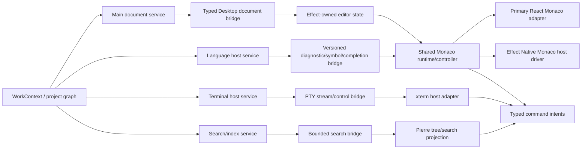

# VS Code TypeScript reuse analysis for the OpenAgents IDE

Date: 2026-07-18

Status: source-grounded package and architecture analysis. This document adds
specificity to the accepted IDE plan; it does not admit dependencies, modify a
ProductSpec, authorize implementation, or reorder IDE-00 through IDE-07.

## Decision

Use VS Code as OpenAgents' main **TypeScript package donor** and a detailed
**behavior/protocol reference**, with four hard boundaries:

1. Keep `monaco-editor@0.55.1`, `@pierre/trees@1.0.0-beta.5`, and
   `@pierre/diffs@1.2.12` as the accepted editor/tree/diff component choices.
2. Evaluate VS Code's published URI, LSP, language-service, terminal, search,
   parsing, and later DAP packages individually behind OpenAgents-owned Effect
   services and renderer host adapters.
3. Do not import unpublished `src/vs/*` code, `vscode-languageclient`, the
   Explorer/workbench, or the extension host into the product.
4. Keep Zed as the primary reference for one coherent agent IDE, Cursor as the
   product-breadth/fork comparison, and OpenAgents as the only authority for
   project identity, files, documents, Git, runtimes, placement, permissions,
   persistence, and receipts.

The practical outcome is a normal TypeScript/Electron application that uses
the best extracted VS Code kernels without becoming a VS Code distribution.

## What this analysis changes

The existing
[`OpenAgents Desktop basic IDE: VS Code outcomes with Monaco and Pierre`](./2026-07-18-openagents-desktop-basic-ide-vscode-pierre-plan.md)
already makes the correct first decision: Monaco for editing, Pierre for tree
and diff projection, Effect Native/main for authority. The
[`Zed adaptation analysis`](./2026-07-18-zed-agent-ide-adaptation-analysis.md)
then supplies the missing integrated project/agent architecture.

This analysis adds the exact third layer:

- which VS Code-associated npm packages are actually reusable;
- which apparently reusable TypeScript code assumes the VS Code runtime;
- how to wrap each admitted package;
- how the current VS Code Agent Host/session design should influence the
  OpenAgents harness/project/evidence graph;
- which concrete proofs belong in the existing IDE packets.

It does not reopen Pierre versus VS Code Explorer or Monaco versus Zed's
editor. Those choices remain settled.

## Evidence and reconciliation

### Source and target pins

| Corpus | Commit | Tree |
| --- | --- | --- |
| `microsoft/vscode` | `f4e18ff9f2d0f5dcea01d00ec73bed52be18f488` | `065a78b57b3fe4845a4ae22905b0df92848f9ac4` |
| `OpenAgentsInc/openagents` target before these docs | `b86850ed8bcf528f29a51e38b9167292ac2f608e` | `741f8a040a0d2bb7f1df540b6830dcb626107560` |

The focused VS Code corpus digest is
`14ee1bd16db9b86d198eb1fe1625ece9a7d5b747035ed9e964f6cf7aba7d2c53`.
The focused OpenAgents corpus digest is
`61e60ba29e86f2ac2a10eacfcc2ead54282aff5aaf5309cbbf065861432f668a`.
The exact teardown findings and source map live in
[`VS Code teardown`](../teardowns/2026-07-18-vscode-teardown.md).

VS Code is not currently a registered `FASTFOLLOW.md` source. This is an
owner-directed analysis using the same evidence discipline, not a source-graph
policy change.

### Prior OpenAgents decisions reconciled

The 2026-07-05 Khala Code audit correctly concluded:

- use Monaco;
- adapt Explorer behavior rather than porting its implementation;
- place a provider-neutral file service between UI and storage;
- load editor code/workers lazily.

It targeted a retired Khala surface and a read-only first slice. The current
Desktop has surpassed that substrate: it has typed create/rename/delete/reveal
contracts, bounded tree/search/watch, revisioned open/save/save-as, conflict
handling, recovery, Git status/diff, tabs, selection, and a replaceable
Effect Native `CodeEditor` host contract. The new plan therefore supersedes the
old target and preserves its architecture law.

The Cursor teardown adds a separate lesson. Cursor gained speed by retaining a
VS Code fork and adding first-party extensions, native sidecars, and a distinct
agent-first UI bundle. That validates a separable agent overlay but also shows
the cost: ongoing upstream merges, duplicated stores, startup/default
regressions, and an opaque local/remote inventory. OpenAgents should reproduce
the boundary with stock packages and owned services, not the fork.

The Zed analysis remains the integrating decision. VS Code supplies excellent
parts and behavior; Zed supplies the stronger public model of files, buffers,
language, Git, terminals, worktrees, remote placement, and agents sharing one
project graph.

## Current OpenAgents implementation truth

At the target pin:

| Surface | Current fact | Consequence |
| --- | --- | --- |
| Explorer projection | `@pierre/trees@1.0.0-beta.5` is an actual Desktop dependency and `pierre-tree-adapter.tsx` mounts it | Pierre tree adoption is no longer hypothetical |
| Primary React editor | `ReactWorkspaceEditor` renders a controlled `<textarea>` | ordinary Desktop launches still do not use Monaco |
| Effect Native editor | `CodeEditor` is a typed `Host(kind: "code-editor")` contract | the correct foreign-widget seam exists |
| DOM editor driver | Desktop installs `makeStubCodeEditorDriver()` only in the compatibility renderer | the Monaco driver remains unimplemented and the primary React path bypasses it |
| Monaco package | absent from the current Desktop manifest/lock | IDE-01/03 work is still real, not documentation cleanup |
| Pierre Diffs | absent from the current Desktop manifest | review still needs the accepted package adapter |
| LSP packages/process | absent | there is no Problems or project language-intelligence authority yet |
| Terminal emulator | no xterm dependency in Desktop | Terminal is a later package/host packet |
| Document authority | main-owned grant/path/revision contracts, 1 MB bounded UTF-8 documents, watch/conflict/recovery | keep and evolve; do not replace with Monaco or VS Code file service |
| Search | cancellable bounded path/content worker and typed results | benchmark before adding Ripgrep packaging |
| Command plane | typed Desktop command registry and Effect intents | project into Monaco/Pierre; never create a second registry |

The package work should therefore begin by completing the existing Monaco
adapter—not by adding a broad “VS Code dependencies” bundle.

## The package boundary rule

Every candidate falls into one of four categories:

```text
published focused package
  → may be admitted behind an owned adapter

published package coupled to the `vscode` extension runtime
  → not directly reusable

unpublished `src/vs/*` module
  → architecture/test corpus only

product/fork code
  → comparison only
```

Being TypeScript is not sufficient. The relevant questions are:

- Is the package intentionally published and versioned?
- Does it import or expect the `vscode` extension module?
- Does it assume VS Code service injection, URI schemes, settings, storage,
  commands, context keys, or extension activation?
- Does it ship native binaries, WASM, workers, CSS, or worker-relative assets?
- Can it remain a projection/helper while OpenAgents owns identity and state?
- Can it pass the existing Electron CSP, ASAR, signing, offline, and six-target
  release matrix?

## Recommended TypeScript package portfolio

Observed versions below are source-pin evidence. An implementation packet must
choose and lock a compatible stable set; it must not copy prerelease versions
merely because VS Code main is using them.

### Tier A — already decided or first admission candidates

| Package | Role | Wrapper/owner | Decision |
| --- | --- | --- | --- |
| `monaco-editor@0.55.1` | text models, code editor, local language workers, markers, diff fallback | app-local Monaco runtime/controller + Effect Native host driver + React adapter | **Adopt; accepted pin** |
| `vscode-uri` (observed `3.1.0`) | LSP-compatible URI parsing/serialization | main language-host boundary only | **Evaluate with LSP set** |
| `vscode-jsonrpc` (observed stable `8.2.0`, newer `9.0.0-next.12`) | JSON-RPC connection mechanics | main/utility-process language service | **Evaluate stable line** |
| `vscode-languageserver-protocol` (observed `3.17.5` and `3.17.6-next.18`) | LSP request/response/notification types | `LanguageProtocolAdapter` behind Effect schemas | **Evaluate stable line** |
| `vscode-languageserver-textdocument` (observed `1.0.12`/`1.0.13`) | versioned server-side text helper | per-server adapter, never canonical storage | **Evaluate** |

The first four LSP packages should be treated as one compatibility set. Mixing
the 8.x and 9.x JSON-RPC/protocol families without a matrix would create a
hard-to-debug wire and cancellation boundary.

### Tier B — focused language services

| Package | Observed pin | First use | Decision |
| --- | --- | --- | --- |
| `vscode-json-languageservice` | `6.0.0-next.2` | schemas, validation, completion, symbols, formatting in JSON/JSONC | worker spike; select stable compatible release |
| `vscode-html-languageservice` | `6.0.0-next.1` | HTML completion/hover/links/formatting | worker spike |
| `vscode-css-languageservice` | `7.0.0-next.1` | CSS/SCSS/LESS completion/validation | worker spike |
| `vscode-markdown-languageservice` | `0.5.0` | Markdown links, symbols, references | later; compare with existing Markdown/Shiki needs |

These libraries are more useful than porting the corresponding built-in
extensions. The JSON/CSS/HTML server code is isolated from the `vscode`
extension module; the extension clients are not.

### Tier C — strong later candidates

| Package | Observed pin | Why useful | Admission condition |
| --- | --- | --- | --- |
| `@xterm/xterm` | `6.1.0-beta.288` | mature terminal emulator | terminal ProductSpec/host contract, stable compatible pin, packaged accessibility/performance proof |
| `@xterm/addon-search` | `0.17.0-beta.288` | terminal find | only with xterm; command registry owns invocation |
| `@xterm/addon-serialize` | `0.15.0-beta.288` | bounded terminal restore/export | retention/redaction contract; never claim PTY recovery from screen text |
| `@xterm/addon-webgl` | `0.20.0-beta.287` | high-throughput rendering | renderer fallback, GPU/process crash, accessibility, ASAR/CSP proof |
| `@vscode/ripgrep-universal` | `1.18.0` | packaged cross-platform Ripgrep | benchmark beats current worker and all native artifacts pass release matrix |
| `@vscode/tree-sitter-wasm` | `0.3.1` | local parse/symbol/command structure | explicit parser role not duplicated by Monaco/LSP/Shiki |
| `@vscode/debugprotocol` | `1.68.0` | DAP schema | admitted debug rung |
| `@vscode/debugadapter` | `1.68.0` | adapter implementation helpers | only if authoring/hosting adapters, not needed for client-only DAP |

### Tier D — defer or reject

| Package/surface | Decision | Reason |
| --- | --- | --- |
| `vscode-languageclient` | **Reject as app dependency** | declares a VS Code engine and assumes the extension runtime |
| `vscode-textmate` + `vscode-oniguruma` | **Defer** | Monaco and Pierre/Shiki already tokenize; add only for a named grammar gap |
| `@vscode/vscode-languagedetection` | **Defer** | model/runtime cost and less explainable than extension/shebang/content rules |
| `@vscode/diff` | **Do not add now** | accepted Pierre/Monaco diff paths already cover presentation |
| `@vscode/codicons` | **Reject** | CC-BY attribution and VS Code product identity conflict with Effect Native/Lucide plane |
| `@vscode/sqlite3` | **Reject** | duplicates OpenAgents-owned SQLite runtime and native packaging |
| `vscode` extension API package | **Reject** | types/runtime contract for extension hosts, not an application SDK |
| internal `vs/base`, `vs/platform`, `vs/editor`, `vs/workbench`, `vs/sessions` imports | **Reject** | unpublished closure and service/runtime coupling |

## Exact adapter architecture

The target should preserve the existing authority chain and add package
controllers beneath it:



### One Monaco implementation, two renderer seams

The current app has two rendering paths:

- primary React workbench, which renders a direct `<textarea>`;
- compatibility Effect Native DOM renderer, which installs the stub
  `code-editor` host driver.

Do not implement Monaco twice. Add one app-local imperative controller that
owns:

- lazy module/CSS/worker loading;
- model registry keyed by opaque document identity;
- editor mount/update/dispose;
- theme projection;
- typed incremental edits, selection, save, focus, and open-link events;
- markers/decorations and command injection;
- performance and leak counters.

Wrap it with:

- a React component for `ReactWorkspaceEditor`;
- `makeDesktopMonacoCodeEditorDriver()` for the Effect Native Host seam.

Both wrappers must accept the same serializable contract and emit the same
typed event union. Monaco types end inside the controller module.

### Keep Monaco models stable and paths opaque

Use a synthetic renderer URI such as:

```text
oa-workspace://<workspace-session-ref>/<document-ref>
```

The URI is a model identity, not filesystem authority. Electron main retains
the translation among:

- project/worktree/root generation;
- opaque renderer document ref;
- current relative path binding;
- real filesystem URI/path;
- LSP document URI;
- Git repository/base/index/worktree revisions.

Rename changes the path binding and language without leaking or trusting an
absolute path from the renderer. If Monaco model URI immutability makes a new
model necessary, the adapter performs a version-checked migration and disposes
the old model only after state transfer.

### Incremental edits, not full-value storms

The current Effect Native `CodeEditorEvent` emits the full document value on
each change. That was appropriate for a bounded textarea and is wrong for
large/multi-cursor Monaco edits.

IDE-00/03 should admit an event resembling:

```ts
type EditorEditBatch = Readonly<{
  documentRef: string
  modelVersionBefore: number
  modelVersionAfter: number
  changes: ReadonlyArray<Readonly<{
    rangeOffset: number
    rangeLength: number
    text: string
  }>>
}>
```

The Effect reducer applies a deterministic order and rejects stale model
versions. Full snapshots remain bounded recovery/resync artifacts, not the hot
edit stream. Monaco owns its attached undo/redo mechanics; OpenAgents owns the
canonical bounded draft/revision/recovery state and can rebuild the model.

## Language architecture using VS Code packages without VS Code

### First rung: Monaco-local language workers

Use the accepted Monaco bundle for immediate JSON/CSS/HTML/TypeScript worker
features on open models. Lazy-load only the workers required by the opened
language. Report capabilities honestly:

```text
syntax: ready
file completions: ready
project references: unavailable
diagnostics: local-only
```

Do not label Monaco's isolated TypeScript defaults as full repository language
intelligence.

### Second rung: standalone language services

For JSON/HTML/CSS, evaluate the focused language-service packages in a browser
worker or utility process. Feed them versioned document snapshots and explicit
workspace/schema/resource callbacks. Do not let a service fetch arbitrary
network schemas or read arbitrary files.

The adapter translates results into OpenAgents types:

```ts
type DiagnosticProjection = Readonly<{
  documentRef: string
  documentGeneration: number
  source: string
  severity: "error" | "warning" | "information" | "hint"
  range: VersionedTextRange
  message: string
  code?: string
}>
```

### Third rung: real language-server host

Use `vscode-jsonrpc` and `vscode-languageserver-protocol` as low-level wire
helpers. OpenAgents must own:

- executable and argument allowlist;
- process/sandbox/placement lifecycle;
- initialization options and workspace folders;
- request IDs, cancellation, timeout, supersession, and restart;
- document version/range/encoding conversion;
- URI mapping and path disclosure;
- capability negotiation and degraded state;
- diagnostic/symbol/reference persistence policy;
- logs and receipts.

Do not install `vscode-languageclient`; it would bring VS Code extension-host
assumptions into the app. A small owned client is less code and a much cleaner
authority boundary.

### TypeScript specifically

Start with Monaco's TypeScript worker for the fast editor slice, then add a
main/utility-process tsserver bridge for project-aware navigation. The bridge
should translate tsserver protocol directly into the same OpenAgents language
projection used by LSP servers. This avoids claiming TypeScript is an LSP
server and avoids porting VS Code's TypeScript extension.

## Terminal architecture using xterm without VS Code Terminal

The Effect Native core already documents a typed Terminal Host pattern beside
CodeEditor. When Terminal becomes admitted:

- Electron main/utility owns PTY creation, cwd, environment, process group,
  resize, signal, exit, reconnect, and sandbox policy;
- xterm owns screen emulation, selection, accessibility projection, scrollback,
  and renderer mechanics;
- the app command registry owns open/split/clear/find/copy/paste actions;
- session/project/worktree identity binds every terminal;
- output and any serialized screen state have explicit bounds and retention;
- xterm serialize never substitutes for process/session recovery.

VS Code's 87 xterm call sites show the surrounding product is much larger than
the package. Do not copy its terminal contributions. Use them as a behavioral
checklist for shell integration, links, accessibility, quick fixes, command
detection, images, and GPU fallback.

## Search: use the benchmark, not the brand

OpenAgents already has cancellable path/content search with typed truncation.
`@vscode/ripgrep-universal` should be a main-process implementation candidate,
not an automatic replacement.

The spike must compare:

- cold and warm latency on small/medium/large repos;
- ignore, hidden, binary, symlink, and secret policy;
- Unicode/path edge cases;
- cancellation and process cleanup;
- maximum resident memory and output bounds;
- macOS/Windows/Linux x64+arm64 packaging and signing;
- ASAR-unpacked asset inventory;
- existing worker behavior and fallback.

Only adopt it if the result improves an admitted outcome without weakening the
current schema/authority boundary.

## Parsing and tokenization: assign one owner per job

The likely portfolio is:

| Job | Owner |
| --- | --- |
| interactive code editing/tokenization | Monaco |
| Pierre diff rendering | Pierre + its Shiki plane |
| project semantics | language server/tsserver |
| local structural fallback or shell-command parsing | optional Tree-sitter WASM |
| Markdown/product prose highlighting outside editor | existing Shiki |
| VS Code TextMate grammar compatibility | no owner unless an explicit gap is admitted |

This avoids loading Monaco, Shiki, TextMate/Oniguruma, and Tree-sitter for the
same file merely because VS Code uses all of them for different subsystems.

## Theme translation

Effect Native remains the theme authority. Add one validated editor theme
projection containing:

- Monaco base/theme/token rules;
- Pierre tree and diff variables;
- Shiki theme identity;
- xterm foreground/background/cursor/selection/ANSI palette;
- Problems/diff status tones;
- focus, high-contrast, reduced-motion, and font-scale values.

Do not load arbitrary VS Code theme, file-icon, or product-icon extensions.
Codicons should not become product chrome. The current Pierre/Effect/Lucide
identity stays intact.

## What VS Code's agent layer changes for OpenAgents

Current VS Code now contains a sessions-first shell and an Agent Host for
Copilot, Claude, and Codex. That source makes several OpenAgents proposals more
specific.

### Separate project, runtime session, and chat identity

OpenAgents should keep at least:

```ts
type CodingAttachment = Readonly<{
  projectRef: string
  projectGeneration: number
  worktreeRef: string
  runtimeRef: string
  providerSessionRef: string
  chatRef: string
}>
```

These identities must not collapse into a working directory or one URI. VS
Code's own Agent Host needs separate provider ID, logical session type, raw ID,
session ID, resource scheme, backend session URI, and chat-channel URI.

### Provider capability projection

Claude, Copilot, and Codex do not support the same multi-chat/fork semantics at
the pin. Shared OpenAgents UI should gate add-chat, fork, archive, restore,
permissions, models, skills, and remote controls from typed capabilities—not
agent-name conditions or optimistic parity.

### Shared isolation and review above adapters

VS Code moved worktree isolation, checkpoints, changesets, Git state, and
review above individual harnesses. OpenAgents should do the same:

```text
canonical project/worktree/evidence services
                ↑
     harness-neutral tool boundary
                ↑
 Claude / Codex / Pi / real ACP / emulation adapters
```

A harness adapter should not independently decide where to create a worktree,
how to identify a change, or which checkpoint can be deleted.

### Read-only historical chats

VS Code's Full/ReadOnly/Hidden interactivity is a clean projection rule. An
archived session, child trace, imported external transcript, or remote-only
history may be readable without displaying a composer or mutation controls.
OpenAgents should express this as capability and authority, not CSS hiding.

### Persist summaries separately, but declare the inventory

VS Code caches lightweight summaries for fast startup and keeps large edit
blobs/attachments in per-session storage. That is useful. Its split among SDK
stores, workbench storage, SQLite, Git refs, attachments, and OTel is also a
warning. OpenAgents should keep a documented data-class ledger for every IDE
and agent artifact and prove delete/export/retention across all stores.

## Reference stack: what each source is for

| Reference | Use it for | Do not use it for |
| --- | --- | --- |
| Zed | integrated project/document/language/Git/terminal/agent architecture | Rust/GPUI/editor implementation |
| VS Code | Monaco, focused TS packages, behavior/protocol/test depth, sessions overlay lessons | workbench/Explorer/extension-host import |
| Pierre | focused React tree/diff projection and theme adapter | workspace, Git, review, or state authority |
| Cursor | parity floor, agent-first UX, fork/sidecar/local-state lessons | closed graft, cloud custody, or fork strategy |
| OpenAgents | Effect services, project identity, runtime/placement, policy, persistence, receipts | delegating authority to renderers/packages |

## Concrete deltas to the accepted IDE packets

These additions refine existing packets; they do not create a parallel
roadmap.

### IDE-00 — contract and invariant admission

Add:

- the four package categories and no-internal-`vs/*` import invariant;
- one shared Monaco controller for React and Effect Native host-driver seams;
- versioned incremental editor events and stale rejection;
- renderer URI versus real path/LSP URI separation;
- language capability states and diagnostic generation identity;
- parser/tokenizer ownership table;
- a dependency admission record that includes license, native/WASM/worker/CSS
  assets, CSP, ASAR, offline, and release targets.

### IDE-01 — packaged adapter spike

In addition to Monaco/Pierre proof, add a small candidate matrix:

- `vscode-uri` + compatible stable JSON-RPC/LSP protocol/text-document set;
- one JSON language-service worker fixture;
- optional Ripgrep artifact enumeration, without product adoption;
- lazy chunk/worker verification proving a chat-only launch loads none;
- exact lock/integrity/license/asset inventory;
- explicit proof that no package imports the `vscode` runtime.

Do not add xterm, Tree-sitter, TextMate, or DAP to the first production bundle.
They can have isolated dev fixtures only when their later packet is admitted.

### IDE-02 — path index and Pierre Explorer

Retain Pierre. Add VS Code-derived behavioral tests for:

- merge after lazy refresh without losing expansion/selection;
- reveal through unloaded ancestors;
- stale/cancelled child-page rejection;
- deterministic case/collation behavior;
- rename identity transfer;
- watcher overflow/full invalidation;
- capability-gated context actions through the one command registry.

### IDE-03 — Monaco document lifecycle

Add:

- the shared runtime/controller plus React and Host wrappers;
- incremental change batches and model version checks;
- stable synthetic model URI and main-owned path translation;
- one Monaco model per document ref, multiple view support later;
- model/controller disposal counters;
- marker/decorations adapter seam even before LSP is ready;
- textarea/stub retained only as explicit fallback/test paths.

### IDE-04 — navigation and file operations

Add:

- VS Code-style single command graph projection into Monaco/Pierre;
- quick-open result identity tied to project/document generations;
- command preconditions derived from typed state, with no context-key-like
  hidden authority;
- back/forward/reveal/open-to-side tests across renamed files and worktrees.

### IDE-05 — Pierre review and conflict compare

Retain Pierre Diffs. Add:

- named branch/session/turn changeset identities;
- optional hidden-ref checkpoint study behind Git evidence services;
- terminal/unrecognized edit coverage in checkpoint diffs;
- exact cleanup ownership and retention refusal conditions;
- no `@vscode/diff` dependency unless a measured algorithm gap remains.

### IDE-06 — language intelligence and Problems

Specify the implementation split:

- Monaco worker rung;
- focused JSON/HTML/CSS language-service worker rung;
- main/utility-process LSP client using lower protocol packages;
- tsserver bridge for full TypeScript project intelligence;
- main-owned URI/range/version translation;
- diagnostics as generation-bound evidence;
- cancellation/supersession/restart tests;
- no `vscode-languageclient` and no extension-host compatibility layer.

### IDE-07 — theme, accessibility, performance, release

Add:

- one theme projection across Monaco/Pierre/Shiki and future xterm;
- dependency asset census in packaged archives;
- worker/native/WASM CSP and offline tests;
- no-editor startup proof for chat-only launch;
- Monaco model/worker disposal and heap checks;
- screen-reader proof through tree → tabs → Monaco → Problems;
- high-contrast and reduced-motion proof without importing VS Code themes.

### Later admitted Terminal packet

When Terminal moves from non-goal to work:

- evaluate stable xterm plus only search/serialize/WebGL add-ons that have a
  named requirement;
- implement the Effect Native Terminal host driver and primary React wrapper
  over one controller, mirroring Monaco;
- keep PTY/process/environment/placement in main/utility;
- test renderer fallback, resize races, reconnect, scrollback bounds, Unicode,
  paste authority, and packaged native PTY assets.

### Later admitted Debug packet

Use DAP protocol/types as a wire candidate, not VS Code's Debug workbench.
OpenAgents owns adapter launch, process policy, breakpoint persistence,
project/worktree binding, variable/memory disclosure, and receipts.

## Package admission checklist

No candidate enters a production manifest until its packet records:

- exact package name/version/integrity and transitive lock;
- license plus required notice/attribution;
- browser/Node/Electron runtime and minimum engine assumptions;
- import proof showing no VS Code extension-runtime dependency;
- worker, WASM, CSS, font, native binary, dictionary, grammar, and model assets;
- dynamic-import and CSP behavior;
- ASAR packed/unpacked requirements;
- macOS/Windows/Linux x64+arm64 availability;
- offline packaged behavior and network attempts;
- startup chunk and worker effect;
- memory/CPU/open-handle/disposal behavior;
- schema boundary and authority owner;
- fallback/degraded state;
- update and rollback compatibility;
- targeted tests and packaged acceptance journey.

This is especially important for packages observed on beta/next version lines.
VS Code main can coordinate them across one repository; OpenAgents must not
inherit that churn accidentally.

## Explicitly rejected architecture

Do not:

- fork Code-OSS;
- create an OpenAgents extension host to reuse built-in extensions;
- expose `vscode` API objects across the app;
- import `vs/base`, `vs/platform`, `vs/editor`, `vs/workbench`, or `vs/sessions`;
- use VS Code URI/file providers as renderer authority;
- let Monaco own save, recovery, project identity, or path access;
- let a language server read outside its project grant;
- let xterm own PTY/process/session truth;
- add Codicons/theme extensions as the product design system;
- duplicate SQLite, diff, tokenization, command, or search stacks without a
  measured requirement;
- equate a package list with VS Code or Cursor parity.

## Definition of success

This analysis has influenced the implementation correctly when:

1. the ordinary Desktop Editor mode mounts real Monaco through one shared
   app-local controller;
2. Pierre remains the Explorer/diff projection and the current typed workspace
   authority stays intact;
3. a compatible lower-level LSP package set powers an owned language host
   without `vscode-languageclient`;
4. JSON/HTML/CSS intelligence comes from focused services rather than copied
   extensions;
5. terminal and debug packages arrive only with admitted host contracts;
6. no internal VS Code source enters the product dependency graph;
7. every package is lazy, packaged, offline, licensed, bounded, disposable,
   and replaceable;
8. agent sessions, worktrees, changesets, and review bind to the same canonical
   OpenAgents project/document/evidence graph;
9. Cursor remains a parity ledger, not an architecture dependency;
10. product claims distinguish basic editor capability from full VS Code,
    Zed, or Cursor parity.

## Final recommendation

Finish Monaco first. Then admit the smallest compatible VS Code package sets
that prevent needless reinvention: URI/LSP primitives, focused language
services, xterm when Terminal is ready, Ripgrep only if it wins the benchmark,
and DAP only when debugging is real. Everything else in VS Code should remain
an exact behavior/test reference translated into OpenAgents' own typed
TypeScript architecture.
