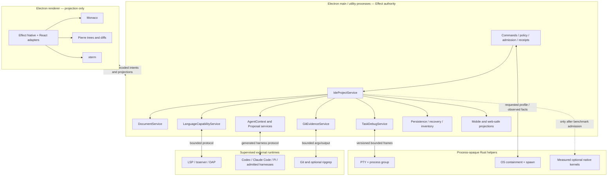

# Zed-quality OpenAgents IDE: Effect and Rust architecture

Date: 2026-07-18

Status: architecture decision and cross-surface gap analysis. `ROADMAP.md` is
the single current IDE build sequence. This document refines the accepted IDE
recommendations and ProductSpecs. It does not by itself admit a dependency, a
Rust crate, product implementation, release, or public claim.

## 2026-07-23 disposition

The owner selected the tracked Zed fork
[`Omega`](../sol/2026-07-23-omega-zed-primary-surface-accepted-plan.md) as the
primary Desktop and IDE destination.
The Omega plan supersedes this document's shell and GPUI rejection.
This document remains useful evidence for the Effect authority boundary,
process supervision, and measured native-workload gates.

## Decision

OpenAgents should build a Zed-quality integrated agent IDE with an
approximately 85–90% Effect/TypeScript application and control plane and a
small process-opaque Rust rind. “TypeScript frontend plus Rust backend” is the
wrong split. The authoritative IDE is Effect:

- project, worktree, file, document, language, Git, task, agent, session, and
  receipt identities.
- durable state machines, policy and admission, local/remote placement,
  command routing, persistence, recovery, projections, and public sharing.
- Monaco, Pierre tree/diff, xterm, React/Electron, and Effect Native adapters.
- harness, LSP, tsserver, Git, search, task, debug, and extension supervision.

Rust is allowed only for bounded native workloads whose correctness is mainly
OS enforcement or whose measured latency cannot be met reliably in the
JavaScript host:

- PTY ownership and process-group primitives.
- OS containment compilation and enforced spawn.
- optional local inference kernels.
- the already separately defined native update and media helpers.
- a future watcher/index/search helper only after the TypeScript implementation
  fails ratified scale and p99 budgets on the six-target release matrix.

The Rust helper never owns a project, document, conversation, policy, command,
credential, provider account, approval, persistence database, or receipt. It
returns observations and native-operation facts. The Effect host decides,
supervises, stores, projects, and signs.

This applies the bright-line test from
[`Effect vs. Rust architecture analysis`](../fable/2026-07-17-effect-vs-rust-architecture-analysis.md):

> typed coordination belongs in Effect. OS enforcement and hard real-time
> native mechanics belong in a supervised Rust helper.

## Why this is the Zed-quality boundary

Zed’s quality does not come from Rust by itself. It comes from treating the
IDE as one coherent project capability graph. Files, buffers, LSP, Git,
terminals, tasks, debug adapters, worktrees, agents, and persistence speak the
same identities and lifecycles. OpenAgents should port that semantic design,
not Zed’s GPUI/editor implementation or its language choice.

The practical stack remains:

| Concern | OpenAgents choice | Authority |
| --- | --- | --- |
| integrated IDE architecture | Zed as behavior and boundary reference | OpenAgents Effect services |
| editing | `monaco-editor` | adapter mechanics only |
| repository tree | `@pierre/trees` | projection only |
| review/diff | `@pierre/diffs` | projection only |
| terminal screen | xterm when admitted | projection/emulation only |
| TypeScript package reuse | focused VS Code URI/LSP/language/DAP packages | helper libraries behind Effect services |
| product breadth | Cursor capability ledger | ProductSpec and acceptance corpus |
| native enforcement | bounded Rust child processes | no application authority |

## Runtime topology



No FFI, N-API, or linked native module should place Rust in the Electron or
Effect memory space. Helpers use a boring, versioned stdio or local-socket
protocol with a generation handshake, bounded frames, bounded queues,
deadlines, cancellation, authenticated peers where applicable, crash
containment, and explicit capability negotiation.

## Exact ownership matrix

| Subsystem | Effect/TypeScript owns | Rust may own | Must never move into Rust |
| --- | --- | --- | --- |
| project graph | refs, roots, generations, capability lifecycle, placement | nothing | project DB, policy, worktree/session binding |
| files and index | grants, ignore/secret/symlink policy, snapshots, watcher reconciliation, path index, search API | optional scan/watch/search kernel after a measured gate | root grants, disclosure policy, canonical index metadata |
| documents | encoding/EOL, disk revision, dirty/recovery state, incremental edit journal, conflicts, saves | nothing | text/document authority, recovery database |
| editor | Monaco controller, models-to-document mapping, commands, decorations, theme | nothing | editor core or UI |
| language | capability catalog, executable allowlist, process supervision, URI/range translation, typed results | containment around server process if required | diagnostics/symbol truth, LSP client, server configuration policy |
| Git | repository identity, HEAD/index/worktree generations, mutation admission, post-image receipts | containment around Git process if required | staging/commit/push policy, delivery state |
| terminal | terminal session identity, environment admission, cwd ref, retention, command registry, renderer projection | PTY handle, process group, resize/signal/byte transport | terminal/session DB, environment policy, credentials, xterm state authority |
| tasks and debug | task definitions, DAP client, breakpoint policy, run/test/debug state, evidence | containment and PTY primitives | task/debug authority or results database |
| agents | harness adapters, context manifest, proposal lifecycle, tool broker, approvals, checkpoints, receipts | containment or local-inference primitive | session/history/policy/approval/tool authority |
| persistence | SQLite schemas, migrations, export/delete/tombstone, quotas, Sync policy | nothing | any authoritative IDE database |
| mobile/web/share | safe DTOs, authorization, audience, redaction, revocation, audit | nothing | projection or publication authority |
| themes/extensions | tokens, validation, provenance, capability grants, guest broker | optional isolated guest runtime only under a later contract | theme/UI authority, wildcard host effects |

An LSP server, DAP adapter, formatter, or harness can itself be implemented in
Rust, Go, Python, or JavaScript. That does not make it part of OpenAgents’ Rust
control plane. It remains an external runtime supervised through the same
Effect-owned project capability contract.

## Canonical Effect service graph

The minimum coherent service layer is:

```text
IdeProjectService
  ├─ ProjectIdentityService
  ├─ WorktreeSnapshotService
  ├─ DocumentService
  ├─ SearchAndIndexService
  ├─ LanguageCapabilityService
  ├─ GitEvidenceService
  ├─ TerminalTaskDebugService
  ├─ AgentContextService
  ├─ AgentEditProposalService
  ├─ ProjectPersistenceService
  ├─ ProjectPlacementService
  └─ ProjectProjectionService
```

All services are scoped to an exact `IdeProjectRef` and attachment generation.
Revocation or a generation change interrupts the scope, fences late results,
and disposes supervised children. Effect Schema owns the canonical contracts.
JSON Schema, TypeScript types, protocol fixtures, and any Rust types are
generated from that source. Cross-language drift is a build failure.

The essential identities are:

```text
IdeProjectRef
  └─ ProjectRootRef
       └─ ProjectFileRef
            └─ DocumentSnapshotRef
                 ├─ LanguageResultRef
                 ├─ GitEvidenceRef
                 ├─ ExcerptRef
                 └─ AgentEditProposalRef
```

Each range-bearing fact carries the project attachment, document generation,
and coordinate encoding. No tree, editor, LSP result, Git hunk, diagnostic,
agent proposal, mobile deep link, or web share object invents its own path or
line-number identity.

### Effect implementation discipline

“Effect-owned” has a concrete meaning throughout this architecture:

- records use `Schema.Struct` plus a same-name interface derived from
  `Schema.Schema.Type<typeof Value>`.
- boundary-crossing variants use `Schema.TaggedStruct` or
  `Schema.TaggedUnion`, and types are derived from `.Type`.
- scalar IDs, generations, digests, relative paths, and refs use constrained
  branded schemas rather than interchangeable strings/numbers.
- schemas consumed by JSON Schema, protocol, documentation, or diagnostic
  tooling carry stable `identifier` annotations.
- internal-only decision algebras may use `Data.TaggedEnum`, but they do not
  become persisted or wire contracts.
- expected Effect failures use `Schema.TaggedErrorClass`.
- unknown IPC, storage, helper, LSP/DAP, harness, mobile, and web inputs are
  decoded with Schema at ingress. Casts never substitute for validation.
- application capabilities are `Context.Service` definitions with explicit
  `Layer.effect` implementations and named `Effect.fn` operations.
- watchers, event streams, workers, and process supervisors are scoped to the
  owning project layer with `Effect.forkScoped`, `FiberSet`, `FiberMap`, or the
  appropriate scoped primitive. Layer acquisition never blocks on forever
  work.

Schema is also the only source for JSON Schema, fixtures, generated clients,
and Rust helper types. A handwritten TypeScript union beside a handwritten
Rust enum is an architecture failure even when their fields currently match.

## Desktop capability bar

A Zed-quality first-party IDE means the following outcomes are product
contracts, even when delivered in dependency-ordered packets.

### Project and workspace

- editor-first cold open from Finder, tree, quick open, search, Problems, Git,
  and agent backlinks.
- multi-root projects and distinct worktrees with stable identity.
- lazy and virtualized Explorer with honest incomplete/truncated/error states.
- watcher reconciliation, ignore/secret/symlink rules, create/rename/move/
  delete/reveal, keyboard completeness, and safe drag/drop only after a typed
  move/copy protocol.
- one project capability lifecycle for local, owner-remote, managed, degraded,
  incompatible, revoked, and unavailable states.

### Editing

- Monaco tabs, preview/pin, reorder, reopen, splits/groups, selection history,
  multi-cursor, find/replace, go-to-line, folding, breadcrumbs, outline, and
  settings/keymaps.
- encoding, BOM, EOL, large/binary/readonly truth, atomic save/save-all,
  external-change conflict, autosave only when explicit, and durable hot-exit
  recovery.
- one document model shared by multiple views without multiple save owners.
- stale range/edit/code-action/proposal refusal or an explicit rebase flow.

### Language and navigation

- honest Monaco-local versus project-language capability tiers.
- tsserver and LSP diagnostics, completion, hover, definitions, references,
  workspace/document symbols, rename, formatting, semantic tokens, inlay hints,
  folding, and code actions where supported.
- Problems, Outline, breadcrumbs, quick symbol, workspace search, references,
  and read-only excerpt views over the same result identities.
- cancellation, supersession, restart, placement, and version fencing.

### Git, review, terminal, tasks, test, and debug

- truthful HEAD/index/worktree state, branch and conflict state, blame/history,
  Pierre file/aggregate/conflict diffs, changesets, checkpoints, and comments.
- staging, partial staging, discard, commit, branch, merge, push, and PR actions
  only through separately admitted expected-version mutations and receipts.
- xterm projection over Rust PTY primitives supervised by Effect.
- named tasks, problem matchers, test discovery/runs/results, output/logs, and
  DAP breakpoints/launch/attach/stack/variables with disclosure policy.
- task, test, debug, terminal, and Git outcomes become agent-usable evidence,
  never tool-output prose reclassified by the renderer.

### Agent-native editing

- sessions attach to exact projects/worktrees without acquiring implicit tool
  authority.
- an inspectable context tray lists files, selections, symbols, diagnostics,
  changes, rules, skills, retrieval reasons, destination, byte/token cost, and
  omitted/truncated items.
- agents return version-bound single- or multi-file proposals, not direct
  Monaco mutations.
- proposal changes stream into Changes, review in Pierre, apply/reject per safe
  granularity, refuse stale bases, and retain independent undo/checkpoints.
- code and conversation backlink through exact snapshot/range identities.
- post-apply diagnostics, tests, formatting, Git, and delivery state attach as
  evidence. “Agent completed” never means saved, tested, committed, pushed, or
  accepted.
- native and external harnesses preserve their real capabilities while sharing
  project evidence, worktree isolation, approvals, and receipts above them.

### Product quality

- Tokyo Night as the one initial theme for everyone, projected from one Effect
  Native token authority across chrome, Monaco, Pierre, xterm, Problems, and
  debug. Light/high-contrast/system-following modes remain required at the
  later complete accessibility/Cursor-parity gate rather than blocking the
  first daily-use editor.
- keyboard-only use, VoiceOver/screen-reader semantics, high contrast, reduced
  motion, zoom, localization-ready labels, and non-color state cues.
- startup, open-file, input, tree, search, LSP, proposal, terminal, restore,
  memory, handle, cancellation, and disposal p50/p95/p99 budgets measured in
  packaged builds.
- every local store appears in the data inventory with purpose, location,
  sensitivity, encryption, quota, retention, export, deletion, Sync, runtime
  access, and crash behavior.

## Mobile contract

Mobile shares project vocabulary and evidence, not Desktop authority. It
should provide:

- a bounded multi-root tree using safe display names and relative refs.
- quick file/symbol/search navigation, Problems, changed files, proposal
  diffs, comments, test/task outcomes, artifacts, and bounded text excerpts.
- exact project/worktree/document/proposal generations and explicit stale or
  unavailable states.
- review, comment, approve, reject where policy allows, rerun, steer, queue,
  interrupt, and “Open on Desktop” through the exactly-once outbox.
- a clearly labeled small staged-edit path only where the mobile ProductSpec
  admits it, with the same base-generation checks and post-image receipt.

Mobile does not ship Monaco, an LSP host, PTY, Git CLI, Rust helper, raw root,
raw environment, or general repository editor. Terminal is a bounded remote
screen/log and control projection. The phone never becomes the process host.

## Web supervision and public share links

Signed-in web supervision may show the same safe tree, search, Problems,
changes, proposal, test, artifact, log, and agent evidence projections as
mobile. Public share links are narrower and need their own immutable manifest.
The initial public rendering should be a typed code-evidence variant of the
already retained `/trace/{uuid}` evidence grammar, not a new top-level product
route or a second transcript surface.

Every code-work share creates a `CodeShareBundle` with:

- stable bundle and revision IDs, creator, audience, created/expiry/revoked
  times, snapshot-versus-live mode, and exact project/session/run refs only in
  their public-safe forms.
- an allowlisted tree subset and bounded syntax-highlighted excerpts.
- exact diff/proposal/checkpoint/commit identities and content digests.
- diagnostics, test/task results, artifacts, bounded logs, agent causal links,
  effective runtime facts, and receipt refs selected for disclosure.
- source generation, evidence generation, staleness, omitted counts, and
  verifier metadata.
- an exportable manifest so a recipient can verify that viewed items belong to
  the same bundle revision.

Share policy is private by default. Named authenticated audiences, expiration,
revocation, access audit, and optional deliberate public publication are
separate states. Public publication warns that copies cannot be revoked,
defaults to `noindex` until explicitly discoverable, and never uses an
“unlisted means private” fiction.

The share compiler excludes absolute paths, environment variables, credentials,
secrets, hidden/ignored private files, raw terminals, raw prompts/transcripts,
provider-private events, embeddings, retrieval queries/scores, private context
manifests, and unselected repository content. A public page has no mutation,
tool, terminal, provider, Git, or workspace authority. “Open on Desktop” sends
opaque refs. Desktop reauthorizes and resolves them against the current project
generation.

## Rust helper admission and reversal tests

Every proposed Rust helper must answer five questions before implementation:

1. Which measurable OS-enforcement or hard-latency requirement cannot be met by
   the Effect/Node host?
2. What is the smallest authority-free process contract that meets it?
3. What happens when the helper is absent, incompatible, slow, compromised, or
   crashes?
4. Which conformance fixtures prove the Effect and Rust decoders agree?
5. What measured result permits deleting the helper and returning the work to
   TypeScript?

Default decisions:

| Candidate | Default | Reversal/admission rule |
| --- | --- | --- |
| PTY | Rust helper | move to Effect only after emulator-backed macOS/Windows/Linux p99, Unicode, resize, signal, process-group, teardown, and recovery gates pass |
| containment/spawn | Rust helper when profile requires native enforcement | absence or incompatible profile fails closed. Never emulate containment in prose |
| file watching/path index | Effect/Node worker | admit Rust only after representative 20k/100k/very-large fixtures miss ratified latency, memory, or reliability budgets after TypeScript optimization |
| content search | current Effect-owned worker/process adapter | package ripgrep or add a native helper only if the six-target benchmark wins without policy drift |
| LSP/tsserver/DAP client | Effect/TypeScript | external server language is irrelevant. Do not create a Rust client for aesthetic consistency |
| Git | Effect service over bounded Git process | do not create a Rust Git core unless a named correctness/performance gap survives the CLI design |
| parsing | Monaco/LSP first. Optional WASM worker | no Rust daemon without an uncovered measured job |
| local inference | optional Rust helper | only behind explicit model/data/budget policy and replaceable protocol |

The Effect host must survive helper replacement without changing canonical
project, terminal, run, or receipt identity. A helper crash cannot corrupt the
application database or grant a fallback danger mode.

## Delivery implications

The existing IDE-00 through IDE-07 sequence remains the basic IDE path.
Zed-quality completion requires the following explicit follow-ons:

- **IDE-08 — agent context and proposal loop:** project-bound sessions,
  disclosure manifest, code/turn backlinks, version-bound proposals,
  Pierre review, apply/reject/undo, and post-apply evidence.
- **IDE-09 — completion and next edit:** low-latency completion, next-edit,
  inline generation, candidate portfolio, provider/data disclosure, and
  generation-bound accept/reject.
- **IDE-10 — terminal, tasks, tests, and output:** Effect-owned session/task
  state, Rust PTY/containment helper, xterm projection, problem matchers, test
  evidence, retention, and six-target terminal conformance.
- **IDE-11 — debug:** Effect-owned DAP client, breakpoint and disclosure
  policy, adapter supervision, state projections, and receipts.
- **IDE-12 — safe SCM mutation and worktrees:** staging/commit/branch/conflict/
  push under expected versions, changesets/checkpoints, provenance, cleanup,
  and delivery receipts.
- **IDE-13 — local/remote project symmetry:** identical capability interface,
  exclusive generations, honest degradation, helper compatibility, and no
  silent upload/download/placement substitution.
- **IDE-14 — mobile/web review and share:** safe project projections, exact
  continuation refs, `CodeShareBundle`, audience/redaction/revocation, and
  public no-authority proof.
- **IDE-15 — extension/component ABI:** only after guest isolation, provenance,
  host-effect brokering, compatibility, rollback, data inventory, and signed
  distribution have independent contracts.

Packet numbers express dependency shape, not current roadmap admission.

## Release-blocking integrated journeys

1. Open a real file from Finder into an input-ready Monaco editor before chat,
   provider, index, Git, or LSP hydration.
2. Open the same file from tree, quick open, search, Problems, Git hunk, and
   agent backlink. Every route resolves the same current document identity.
3. Restart with dirty split editors and a pending proposal. Recover exact
   unsaved/saved/proposal states without overwrite.
4. Reject stale diagnostics, code actions, hunks, and proposals after a file or
   attachment generation changes.
5. Ask an agent to fix an exact diagnostic, inspect disclosure, review a
   version-bound proposal, apply it, rerun tests/diagnostics, and see causal
   evidence without equating provider completion with delivery.
6. Run two sessions against equal relative paths in distinct worktrees. No
   model, diagnostic, terminal, Git, proposal, or recovery state crosses.
7. Start a task in a Rust-backed PTY through Effect admission, restart the
   renderer, reconnect the projection, stop it, and verify helper/process facts
   never became application authority.
8. Lose a local or remote capability mid-operation. Late output is fenced and
   the UI shows degraded/unavailable truth without silent managed fallback.
9. Review the same proposal on mobile, open it on Desktop, and resolve the
   current authorized generation without a raw path.
10. Publish a bounded code share, verify its manifest, view tree/excerpt/diff/
    test/receipt evidence signed out, then revoke it. The page exposes no
    mutation path or excluded host/private state.
11. Delete a project’s knowledge and prove recovery snapshots, excerpts,
    proposals, lexical/semantic indexes, embeddings, shares, and remote
    derivatives are removed or tombstoned according to their declared policy.

## Explicit rejections

- No Zed/GPUI editor port and no second Rust application state graph.
- No Code-OSS fork, VS Code workbench, Explorer, or extension host.
- No Rust “core” that owns projects, documents, sessions, policy, or SQLite.
- No renderer filesystem, process, Git, PTY, credential, or raw-root authority.
- No direct agent mutation of Monaco or best-effort line-number patching.
- No embeddings requirement for repository intelligence and no persistence or
  upload without a declared inventory and deletion contract.
- No full editor on mobile or web and no public share link that doubles as a
  remote execution capability.
- No native helper added because Zed used Rust. Every helper must pass its own
  necessity and reversal test.

## Final recommendation

Build Zed’s coherence in Effect, use Monaco/Pierre/xterm and focused VS Code
packages as replaceable mechanics, and reserve Rust for the native rind. The
quality bar is one project and evidence graph that survives editor, agent,
worktree, runtime, placement, device, and restart changes. The trust bar is
that none of those shared identities silently widens authority.
