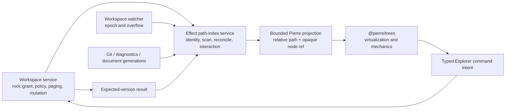

# IDE-02 delivery: complete generation-fenced Explorer over Pierre

Date: 2026-07-19  
Issue: `#9017`  
Roadmap packet: `IDE-02`  
Status: implemented and locally verified; this closes the Explorer packet, not
the Monaco editor or the daily-use/full-parity rungs

## Result

The production Desktop Files rail no longer derives Pierre's tree from the
small set of directory pages the user happened to expand. It now consumes a
bounded projection of a complete Effect-owned path index. The index scans all
admitted directory pages in chunks, reconciles watcher epochs, maintains
stable node and interaction identity, refuses stale project/worktree/index or
badge generations, and releases its state at scope closure.

Pierre remains a renderer and intent source. It receives relative paths,
opaque node refs, revisions, projected status labels, and bounded interaction
state. It receives no absolute root, grant, preload bridge, IPC handle,
watcher, persistence service, or mutation function.

This is a concrete prerequisite for Desktop AC-39/40 and Cursor CP-AC-19. It
does not satisfy those criteria by itself: IDE-03 still owns Monaco and
canonical document lifecycle, while IDE-04 through IDE-07 own the rest of the
integrated daily-editor corpus.

## Authority and data flow

The workspace service remains canonical for admission and effects. A pending
rename, move, copy, duplicate, create, or delete is only a visual pending fact.
The index changes it to confirmed or refused only after the workspace authority
returns a decoded result. Refresh after a confirmed effect re-reads canonical
workspace pages.

## Schema-first Effect design

`src/ide/path-index-contract.ts` owns the boundary graph. Types are derived
from Effect Schema rather than declared as parallel raw unions. The graph
contains:

- branded scan, node, and operation refs;
- exact project, root, worktree, attachment, attachment-generation, and
  path-index-generation identity;
- tagged scanning, partial, truncated, degraded, unavailable, error, empty,
  ready, and stopped states;
- tagged node policy, load, badge, pending-operation, interaction, filter, and
  command states;
- the bounded `IdePierreTreeProjectionSchema`, which intentionally omits
  authority fields.

`src/ide/path-index-service.ts` implements that graph with `Context.Service`,
`Layer.effect`, named `Effect.fn` boundaries, schema decoding, tagged expected
errors, refs, and a scoped finalizer. Expected failures distinguish invalid
input, stale generation, revoked grant, cancellation, unavailable source, and
stopped scope. There is no generic string-error control plane.

## Index behavior

### Complete and lazy scans

The same service supports two truthful modes:

- `root_and_expanded` returns a usable partial tree quickly and marks unloaded
  directories as unloaded; it never renders them as known-empty;
- `complete` breadth-first scans every admitted directory in bounded pages,
  yields between chunks, reports progress, and ends ready, empty, partial, or
  truncated as the facts require.

Every scan owns a sequence. A newer scan or explicit cancellation advances the
sequence; the older scan checks before and after every asynchronous read and
before publication. A blocked read therefore cannot publish into a newer
generation after it resumes.

### Watcher reconciliation

A one-step epoch change re-reads only affected indexed parent directories.
An overflow, refresh, unbounded change, or epoch gap runs a complete rescan.
This operates independently of mounted legacy pages: a deep indexed directory
updates even when the user never expanded it in the old browser state.

A mismatched grant changes lifecycle state to explicit `Unavailable /
grant_revoked`. Source failure changes it to `Degraded` with a rescan action.
Neither becomes an empty tree.

### Stable identity and interaction

Existing paths retain their opaque node ref. Expected-version rename and move
retain the source node ref at the destination where the authoritative result
permits it. The service owns expanded, selected, focused, scroll-anchor,
reveal, and sticky-ancestor refs and removes only references whose nodes truly
disappeared.

Equal relative paths cannot collide because every service snapshot is fenced
by exact project/root/worktree/attachment/index identity. Tests deliberately
send a right-worktree scan to a left-worktree service and require a stale
project refusal.

### Filtering, policy, and badges

Path filtering changes a typed filter projection while preserving canonical
nodes, so “no matches” does not mean “empty repository.” Search projections
carry query, mode, bounded path refs, and truncation separately.

Ignore, hidden, secret, binary, symlink, grant, and root-boundary decisions
remain workspace-service authority. The path index stores the resulting
admitted/withheld policy state and never re-opens a path itself. Git,
diagnostic, conflict, dirty, and unavailable badges carry their originating
generation. Stale Git/language generations refuse, and Pierre receives text
labels such as `Git modified`, `2 error diagnostics`, and `Unsaved changes`,
not color-only meaning.

## Explorer interaction

The production React Files rail now renders explicit index progress and every
terminal/incomplete lifecycle. The Pierre adapter supplies folded paths,
sticky folders, bounded overscan, controlled expansion/selection/focus/scroll,
search, rename, and drag/drop. A projection-update bug discovered during
verification was fixed: callbacks now dereference the current projection map,
so a file inserted after initial mount can be selected and opened.

The typed command graph covers open, reveal, create file/folder, rename, move,
copy, duplicate, delete, terminal, compare, refresh, retry, and rescan.
Move/drop always includes the current expected revision. Context-menu commands
use the same graph; no menu action calls a bridge directly.

The workspace host now has bounded expected-version move, copy, and duplicate
operations alongside create, rename, delete, and reveal. It enforces the
selected root, relative destinations, ignore policy, collisions, current
revision, move self/descendant refusal, file-only copy/duplicate, and
non-recursive delete.

## Accessibility

The adapter exposes a labeled tree, loading relationship, levels, selection,
and text badge descriptions. Its keyboard mechanics cover parent/child and
sibling traversal, Home/End, selection, search, rename, and keyboard context
menus. Pointer context and drag/drop actions have typed keyboard equivalents.
The Files rail keeps progress in a live status node. Targeted journeys cover
keyboard, screen-reader structure, reduced motion, 200% zoom, pointer context,
and drag/drop equivalence.

## Performance and resource receipt

The generated receipt is
`apps/openagents-desktop/benchmarks/ide/2026-07-19-ide-02-path-index.json`.
It runs the production service over 10,000 files in 100 directories and records
all percentiles rather than one favorable sample.

| Metric | Repetitions | p50 | p95 | p99 | Written p95 budget |
| --- | ---: | ---: | ---: | ---: | ---: |
| complete 10k scan | 7 | 112.035 ms | 126.366 ms | 127.347 ms | 1,500 ms |
| cached Pierre projection | 101 | 9.272 ms | 9.896 ms | 13.128 ms | 40 ms |
| keyboard target traversal | 101 | 9.221 ms | 9.524 ms | 9.746 ms | 40 ms |
| incremental watcher update | 31 | 25.924 ms | 32.271 ms | 33.319 ms | 150 ms |

The final snapshot contains 10,100 nodes and estimates 2,966,000 bytes of
index data. Forced-GC retained heap delta is 7,028,904 bytes. Active resource
count falls from six to two during the process, the service reports zero owned
source subscriptions after stop, and access after stop refuses.

These measurements keep the index in TypeScript/Effect. Rust remains rejected
for this packet until representative repositories repeatedly miss a written
budget after TypeScript batching, worker placement, projection bounds, and
cache work, and an authority-free native prototype wins end to end after
serialization, packaging, cancellation, observability, failure, and teardown.

The packaged large-repository receipt and screenshot are:

- `apps/openagents-desktop/benchmarks/ide/2026-07-19-ide-02-packaged-journey.json`;
- `apps/openagents-desktop/benchmarks/ide/2026-07-19-ide-02-packaged-explorer.png`.

That journey launches the packaged arm64 app against a disposable archive of
the tracked OpenAgents corpus, enters Files through the canonical shortcut,
waits for ready, traverses with pointer and Home/End, opens the keyboard context
menu, activates a file, checks screen-reader relationships, checks that the
absolute corpus root is absent, and captures the rendered result.

## Verification map

| Concern | Evidence |
| --- | --- |
| schema and service boundary | `src/ide/path-index-contract.ts`, `scripts/check-ide-boundaries.ts` |
| complete/lazy scan, identity, badges, filtering, revocation, cancellation, overflow, teardown | `src/ide/path-index-service.test.ts` |
| complete index independent of mounted pages | `src/renderer/workspace-browser.test.ts` |
| current-projection Pierre behavior and zero authority | `src/renderer/ide/pierre-tree-adapter.test.ts` |
| expected-version host operations | `tests/workspace-service.test.ts` |
| production Files route | `src/renderer/react-primitive-adapters.test.tsx` |
| keyboard, screen reader, reduced motion, zoom | `tests/ide-explorer-accessibility.test.tsx` |
| receipt schema | `src/ide/path-index-benchmark-contract.test.ts` |
| behavioral contract | `openagents_desktop.ide_complete_path_index.v1` in `packages/behavior-contracts` |

The canonical gate is `pnpm run verify:ide-02` from
`apps/openagents-desktop/`, followed by the packaged journey command against a
disposable tracked-source archive.

## Honest remaining boundaries

- IDE-03 still replaces the textarea with Monaco and makes Tokyo Night and
  built-in Vim real production behavior.
- IDE-04 owns quick open, richer navigation/groups/settings/keybindings, and
  the final user-facing terminal/compare routing beyond the typed Explorer
  command substrate landed here.
- IDE-05 owns the Pierre review plane, IDE-06 owns project language services,
  and IDE-07 owns the complete packaged daily-editor corpus.
- The path index is metadata, not semantic repository knowledge. It stores no
  file content or embeddings and performs no remote indexing.
- Mobile and web receive no Explorer authority from this packet.

Those gaps prevent a daily-editor, Zed-quality, or Cursor-parity claim even
though IDE-02 itself is complete.
