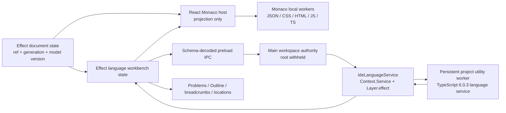

# IDE-06 generation-safe language intelligence

Date: 2026-07-19
Issue: [#9021](https://github.com/OpenAgentsInc/openagents/issues/9021)
Status: implemented. IDE-07 remains the daily-use release gate

## Outcome

Desktop now has two explicit, visible language tiers without giving Monaco or
a helper process project authority:

1. the lazy packaged Monaco JSON, CSS, HTML, JavaScript, and TypeScript workers
   remain document-local mechanics inside the replaceable editor island. And
2. a separate Effect-owned, project-local TypeScript 6.0.3 service owns
   project intelligence, lifecycle, cancellation, restart, and receipts.

The production workbench projects the same exact-generation result set into
Monaco markers, semantic styling, inlay hints, and folding. Problems. Outline.
breadcrumbs. Definitions. References. And rename, format, and code-action edit
previews. An edit preview can change the canonical draft only when its
document ref, document generation, Monaco model version, path, and expected
edit versions still match. Older results are stripped of items and never
decorate or navigate a newer model.

This is IDE-06, not a Zed-quality, basic-IDE, or Cursor-parity claim. IDE-07
still owns the integrated packaged daily-use gate. Cloud language service,
embeddings, DAP, tasks, tests, and AI editing remain out of scope.

## Architecture

### Authority and placement

| Concern | Owner | Renderer/helper boundary |
| --- | --- | --- |
| project/root/worktree/attachment identity | Effect project/path-index graph | opaque refs and positive generations only |
| absolute root and filesystem reads | main workspace service | never serialized to the renderer |
| document bytes, dirty state, undo/recovery, save conflict | Effect document reducer/workspace authority | Monaco and language results cannot claim a save |
| project language lifecycle | `IdeLanguageService` | renderer receives tagged snapshots and bounded receipts |
| TypeScript compiler/language mechanics | project-local utility worker | receives the root only from main. Emits relative paths |
| Monaco completion/syntax mechanics | lazy editor-island workers | explicitly labeled `document_local` |
| diagnostics/symbol/navigation presentation | shared workbench projection | exact receipt refs. No independent cache or inferred success |
| edit application | canonical document reducer | exact same-document `TextEdit` receipt only |

No Rust is used. The measured persistent TypeScript service has sub-2 ms p95
warm diagnostics and document-symbol latency on the admitted 151-file corpus.
there is no evidence that a native kernel is needed. TypeScript/Effect also
owns the policy and state-machine plane, so moving it to Rust would violate the
architecture boundary even if parsing were faster.

## Schema-first contract

`language-contract.ts` defines boundary values first and derives all
TypeScript types. It includes branded request/result/item/start refs, the full
capability vocabulary, positions/ranges, provider compatibility, tagged item
and result unions, tagged service lifecycle, rejection/cancel/stop responses,
the Monaco local-worker state, and the bounded project-to-Monaco projection.

Every project result carries:

- project, root, worktree, attachment, file, document, service, start, and
  placement refs.
- attachment, language, document, Monaco model, and service generations.
- provider executable and exact version.
- requested/observed timestamps and freshness.
- `project_local` evidence tier.
- capability availability.
- explicit complete, partial, truncated, degraded, unavailable, cancelled, or
  stale state. And
- at most 5,000 schema-decoded root-relative items.

The service uses `Context.Service`. Its implementation is constructed through
`Layer.effect`. Non-trivial operations use named `Effect.fn`. Failures are
`Schema.TaggedErrorClass` values. And IPC/provider data is decoded. The host is
the one intentional manual runtime perimeter for Electron IPC.

## Two language tiers

### Document-local Monaco tier

The private-scheme editor island retains separately packaged editor, JSON,
CSS, HTML, and TypeScript worker assets. A supported document publishes
`Loading`, then a generation-bound `Ready` projection containing document ref,
document generation, model version, `document_local` evidence, and the local
capability label. Unsupported modes publish `Unsupported` and start no
language worker.

This tier is deliberately not called “project TypeScript.” It can provide the
low-latency behavior Monaco owns, but it does not imply repository-aware
diagnostics or project lifecycle.

### Project-local Effect tier

The workspace constructs the language host with the admitted absolute root,
but only after a supported TypeScript/JavaScript request. The worker scans at
most 2,000 source files and 32 MiB, skips symlinks plus generated/VCS
directories, creates one persistent TypeScript language service, and updates
open-document content/version in place. It is disposed when its workspace is
replaced or closed.

The service owns:

- lazy startup with a five-second bound.
- executable/version/capability validation.
- a 64-request bound.
- per-document/per-capability supersession.
- cancellation propagation and late-result suppression.
- request timeouts.
- explicit active/queued counts.
- project-local placement and evidence.
- bounded restart backoff state.
- generation advance after provider failure.
- supervised worker replacement on the next admitted request. And
- zero-pending stop/teardown.

A provider crash is not hidden behind transparent worker recreation. The
first request after the crash receives typed provider-unavailable truth and
advances supervision to a new service generation. The next admitted request
starts the replacement. Results from the dead generation cannot commit.

## Capability corpus

The first TypeScript/JavaScript corpus implements all seventeen admitted
capabilities:

| Family | Capabilities |
| --- | --- |
| correctness | diagnostics |
| assistance | completion, completion resolve, hover |
| navigation | definition, declaration, type definition, references |
| symbols | document symbols, workspace symbols |
| edits | rename preview, document/range format, code actions |
| presentation | semantic tokens, inlay hints, folding ranges |

The current edit authority is intentionally narrower than the provider's
discovery breadth. Rename/format/code-action edits are previewed with their
receipt. Only edits for the current exact document generation/model version
can apply through the document reducer. Cross-file location results can open
an admitted relative file, but a range is selected only when it is bound to
the current document. No positional guess is applied to an unversioned target.

## Shared workbench behavior

- Problems exposes severity with text/non-color cues, filters, relative path,
  line, result state, freshness, and evidence tier.
- Outline reads current document-symbol items, supports bounded filtering,
  and selects the exact range through the canonical editor state.
- Breadcrumbs append the innermost current symbol only when the current
  selection is inside its exact range.
- Definition and reference actions share location item refs. Current-document
  locations navigate exactly, while other admitted relative paths open through
  workspace authority.
- Rename, format, and code-action results show a bounded edit count and require
  an explicit “Apply exact receipt” action.
- Monaco project markers, semantic decoration, inlays, and folding providers
  clear when the receipt is absent or its document generation/model version no
  longer matches.
- Both Monaco panes label the document-local tier and project-language
  evidence independently.

Loading, unsupported, empty, degraded, failed, stopped, rejected, partial, and
truncated states remain visible. The UI does not synthesize “ready” from an
empty response.

## Failure matrix

| Failure | Observable behavior | Fence/recovery |
| --- | --- | --- |
| unsupported document | document-local syntax label. Project controls disabled | no project worker starts |
| invalid request/path | typed rejected response | no provider result admitted |
| queue full | explicit `queue_full` rejection | caller can retry after pending work settles |
| startup timeout/malformed start | degraded service snapshot | bounded-backoff/manual retry truth |
| request timeout | typed timeout and provider cancel | late response has no active request ref |
| superseded request | cancel propagated. Result cancelled or stale | items removed. Only newest receipt may commit |
| document/model generation changes | no Monaco/workbench projection match | refresh produces a new request binding |
| malformed provider result | typed malformed rejection | no unvalidated item reaches renderer |
| provider crash | provider-unavailable and degraded state | service generation advances. Replacement is supervised |
| workspace close/replacement | stop and worker termination | zero active/queued requests and handles |

## Evidence and measurements

`pnpm --dir apps/openagents-desktop run verify:ide-06` rebuilds the application
and both worker tiers, executes the real-worker benchmark, typechecks, runs the
language/service/workbench/Monaco/editor/Electron/accessibility/behavior
corpus, and enforces IDE boundaries.

The checked receipt is
`apps/openagents-desktop/benchmarks/ide/2026-07-19-ide-06-language.json`:

- Node 24.13.1, Darwin arm64.
- TypeScript 6.0.3 via `typescript/lib/tsserverlibrary`.
- 151 files / 21,712 source bytes / 12 warm samples.
- first diagnostics: 209.05 ms in the latest gate run.
- warm diagnostics p50/p95/p99: 0.60 / 0.86 / 0.86 ms.
- document symbols p50/p95/p99: 0.66 / 1.76 / 1.76 ms.
- 100 scheduled superseding requests: 1 committed, 99 suppressed.
- forced worker crash recovered at service generation 2 in 198.41 ms. And
- 2 workers started across crash/recovery, 0 workers and 0 pending requests
  after stop.

Budgets are 4,000 ms first diagnostics, 750 ms warm p95 diagnostics/symbols,
and 4,000 ms restart. The receipt records zero remote requests.

The independent packaged macOS arm64 journey is recorded in
`apps/openagents-desktop/benchmarks/ide/2026-07-19-ide-06-packaged-language.json`
and its paired PNG. It launched the staged application through LaunchServices
at commit `2057aff838107df8c44965b8187cd3088d96a673` and proved the actual Monaco
TypeScript worker, project-local TypeScript 6.0.3 service generation, current
Problems receipt, populated Outline, offline private renderer scheme, and
root-redacted UI. The journey also caught and fixed a real startup race: the
TypeScript basic-language registration must be present before Monaco can
activate its richer contribution, and readiness is not published until the
worker answers for the current model.

## Honest remaining gaps

- IDE-07 must still run and ratify the integrated packaged Finder, Explorer,
  editor, review, language-burst, Vim, accessibility, offline, and teardown
  matrix before “basic IDE” language is allowed.
- The initial project provider is TypeScript/JavaScript only. JSON/CSS/HTML
  have document-local Monaco help, not a claimed project server.
- The worker snapshot is refreshed by current document requests. A future
  general LSP host needs explicit filesystem-change notifications and protocol
  version/range conversion rather than pretending this TypeScript service is
  universal.
- Cross-file edits require target-document version evidence before they can be
  applied. Current IDE-06 safely refuses that authority gap.
- Agent context may consume read-only language result refs/excerpts, but
  IDE-08 still owns the inspectable context manifest and proposal loop.
- No embeddings, remote semantic index, cloud fallback, DAP, task/test graph,
  or AI completion/edit capability was introduced.
