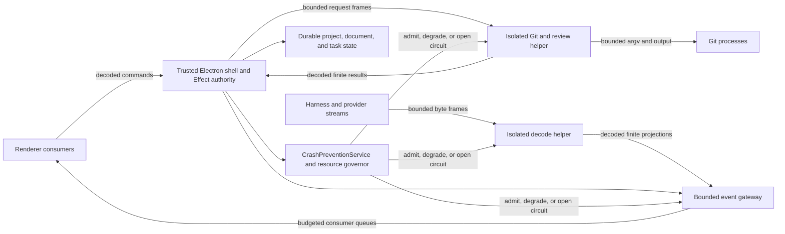

# OpenAgents IDE crash prevention implementation plan

Date: 2026-07-20

## Document control

| Field | Value |
| --- | --- |
| State | Owner-directed implementation plan |
| Product scope | OpenAgents Desktop IDE |
| Safety scope | Repository review OOM and main-process message SIGTRAP |
| Source incidents | Two recurrent Codex Desktop crash classes |
| Delivery model | Eight dependency-ordered packets |
| Recommendation coverage | 65 permanent-control IDs and 51 regression rows |
| Release effect | None until all closure gates pass |
| Canonical sequence | [OpenAgents IDE roadmap](./ROADMAP.md) |

## Decision

OpenAgents will implement every applicable product recommendation from both
incident reports. It will also give the operator safe controls and evidence for
the workspace recommendations that require owner review.

The implementation will use two independent safety barriers:

1. Fixed limits will stop work before repository expansion, message decode, or
   renderer fanout can create an unbounded workload.
2. Separate process-fate boundaries will keep Git, review, and risky decode
   defects outside the trusted Electron shell.

The program is a cross-cutting safety gate over IDE-00 through IDE-12. It does
not replace IDE-13. It does not change the dependency order for portable
project capabilities. No release can claim safe large-repository review or
safe unattended concurrent work until this program passes.

## Incident sources

This plan binds the recommendations in these two reports:

| Source | Failure class | Required control family |
| --- | --- | --- |
| [2026-07-19 Codex Desktop Git Review OOM Incident After-Action](../afteraction/2026-07-19-codex-desktop-git-review-oom-incident-afteraction.md) | A Git review worker entered `node::OOMErrorHandler`, and its process fate ended the app. | Exact scope, repository preflight, file and byte limits, command limits, queue and cancellation limits, worker isolation, recovery, diagnostics, and incident-scale tests. |
| [2026-07-20 Codex Desktop Main-Process SIGTRAP Incident After-Action](../afteraction/2026-07-20-codex-desktop-main-process-sigtrap-incident-afteraction.md) | The Electron main process executed `brk 0` in a V8 value-deserialization stack under concurrent task and renderer load. | Message and queue limits, fanout and hidden-consumer lifecycle, backpressure, stale fences, decode isolation, main-process memory gates, recovery, diagnostics, and combined soak tests. |

The first report defines `CDX-OOM-*`, `WS-OOM-*`, and `OA-IDE-OOM-*` controls.
The second report defines `CDX-TRAP-*` and `OA-IDE-TRAP-*` controls. This plan
keeps each source ID in the traceability tables below.

## Authority and claim boundary

The current owner instruction requests this plan and the implementation of all
recommendations. This document records the implementation sequence. It does not
grant release, spend, public-claim, or ProductSpec transition authority.

These sources retain their current authority:

- [Desktop ProductSpec](../../specs/desktop/desktop-trust-complete-workbench.product-spec.md)
  owns Desktop intent and acceptance criteria.
- [Cursor parity ProductSpec](../../specs/openagents/cursor-capability-parity.product-spec.md)
  owns the integrated IDE and parity intent.
- [IDE roadmap](./ROADMAP.md) owns the dependency-ordered IDE sequence.
- [IDE crosswalk](../../specs/IDE_ROADMAP_CROSSWALK.md) owns criterion and
  evidence traceability.
- The AssuranceSpecs own proposed proof design. They do not prove admission or
  release.

Packet `CP-00` must bind this plan to an authoritative ProductSpec revision or
an admitted owner work packet before product code changes begin. Each later
packet must use a live claim and a separate clean worktree.

## Scope

### In scope

- Git status, diff, hash, review, worktree, and repository preflight work.
- Agent proposal and review projections that consume Git or file data.
- Task, summary, run, debug, terminal, and other high-rate renderer events.
- Electron IPC, utility-process, and child-process message boundaries.
- Main-process, helper, renderer, queue, handle, stream, and subscription use.
- Durable task, project, document, proposal, and recovery state.
- User-visible limit, truncation, circuit, recovery, and support states.
- Redacted local support data, dSYM retention, and crash-signature identity.
- The complete incident-scale and combined regression corpus.

### Out of scope

- A claim that these controls prevent every possible application crash.
- Automatic deletion of user files or untracked trees.
- A Rust application core or a second IDE authority graph.
- Renderer, helper, Git, or package authority over project policy or state.
- Automatic crash-log upload or telemetry expansion without separate consent.
- A change to the independent Codex Desktop product.
- A release, parity, or product-promise transition from this plan alone.

## Safety outcome

The complete program must make these outcomes true:

1. A valid repository can change result completeness, but it cannot increase
   active work after a configured limit applies.
2. A valid task stream can change result completeness, but it cannot create an
   unlimited message, queue, fanout, or retention state.
3. A Git, review, or decode helper can fail, abort, or reach OOM without an exit
   of the trusted shell.
4. The app must show the exact limit, omission, circuit, or helper failure.
5. The app must preserve canonical project, document, and active-task state.
6. The app must recover through a new generation without stale publication or
   mutating-command replay.
7. A support bundle must identify the crash class and current budget state
   without private task data.

The release gate must prove both known classes. A fix for only one class is not
sufficient.

## Prevention invariant

Each admitted budget must contain a finite positive value. The product must
apply the budget before full content materialization or event fanout.

```text
admitted_files <= file_limit
review_bytes <= review_byte_limit
git_output_bytes <= git_output_limit
queued_git_operations <= git_queue_limit
active_git_operations <= git_concurrency_limit
git_operation_time <= git_time_limit
serialized_message_bytes <= message_byte_limit
queued_messages_per_consumer <= consumer_queue_limit
consumers_per_event <= fanout_limit
active_streams <= stream_limit
retained_completed_items <= retention_limit
helper_memory <= helper_memory_limit
main_memory <= main_memory_limit
```

No required budget field can use `null`, zero, a negative value, `Infinity`, or
a value inferred after a test completes. `CP-00` must freeze the first budget
revision from current measured receipts. A later budget change requires a new
revision, a semantic comparison, and a new acceptance receipt.

## Current baseline and explicit gaps

| Current IDE control | Current evidence | Gap that this plan closes |
| --- | --- | --- |
| Exact project, root, worktree, attachment, and generation identity | IDE-00, IDE-02, and IDE-08 | No one preflight contract measures repository risk before Git expansion. |
| Bounded path pages with partial and truncated truth | IDE-02 | The accepted corpus has 10,000 files, not the required 125,000-file shape. |
| Exact review sources and bounded renderer patches | IDE-05 | Git command output, queue, concurrency, time, and memory limits do not have one complete contract. |
| Supervised worker restart and stale refusal | IDE-06 | The pattern applies to language work, not Git review or risky decode. |
| Frozen resource envelopes | IDE-07 | The metric set does not contain the complete incident measurements. |
| Bounded agent context and durable proposal state | IDE-08 | It does not create a Git or decode process-fate boundary. |
| Main-owned Effect source-control graph | IDE-12 | Git aggregation can still share main-process memory, and the incident corpus is absent. |
| `latest-only-queue.ts` renderer utility | Current renderer code | The main process does not yet enforce one typed per-consumer budget for every high-rate event path. |
| Diagnostics and local recovery services | Current Desktop code | The support bundle lacks the two stable incident codes and the complete budget snapshot. |

No current `docs/ide` file references both reports, all `OA-IDE-OOM-*` IDs,
all `OA-IDE-TRAP-*` IDs, or the 125,000-file fixture. This plan is the first
complete implementation ledger for those requirements.

## Target architecture



Effect remains the only application authority. The helpers are replaceable
mechanics. They receive no session, credential, policy, database, approval,
receipt, or release authority.

The app must never send a raw provider object or an unbounded Git result through
Electron IPC. A helper must first enforce a byte frame, decode the value, apply
its schema, and create a finite projection.

## Service and file ownership

| Concern | Current owner or extension point | Planned owner |
| --- | --- | --- |
| Shared budget, support code, and circuit schemas | New contract | `src/ide/crash-prevention-contract.ts` |
| Budget evaluation and aggregate resource state | New Effect service | `src/ide/crash-prevention-service.ts` |
| Exact project and root scope | `src/ide/project-service.ts` | Extend current service. Do not create a second project graph. |
| Git commands and result decode | `src/ide/source-control-git-adapter.ts` | Move bulk mechanics behind an isolated helper. |
| Source-control lifecycle and receipts | `src/ide/source-control-service.ts` and `source-control-host.ts` | Keep authority in the current main-owned service. |
| Review sources and Pierre projection | `src/ide/review-contract.ts` and `pierre-diffs-adapter.tsx` | Keep finite projection and no-authority boundaries. |
| High-rate event delivery | Direct `webContents.send` paths and preload listeners | New `src/ide/event-gateway-*` contract, service, and host. |
| Renderer queue mechanics | `src/renderer/latest-only-queue.ts` | Reuse for latest-only classes after main-side admission. Add ordered finite queues for terminal classes. |
| Risky value decode | Main and helper adapters | New isolated decode helper with bounded frames. |
| Durable recovery | `desktop-session-recovery.ts`, `local-turn-recovery.ts`, project and proposal stores | Extend current canonical stores. Helpers get no storage authority. |
| Diagnostics | `diagnostics-contract.ts`, `diagnostics-host.ts`, and `diagnostics-report.ts` | Add budgets, circuits, process facts, support codes, and redacted crash context. |
| Boundary enforcement | `scripts/check-ide-boundaries.ts` | Reject direct high-rate fanout, unbounded helper frames, null required limits, and helper authority. |

## Event delivery classes

Each event schema must declare one delivery class:

| Class | Use | Queue rule |
| --- | --- | --- |
| `latest_only` | Progress, resource samples, summary snapshots, and replaceable state | Keep only the newest event for one task, generation, type, and consumer. |
| `ordered_bounded` | Terminal output, task events, debug events, and state transitions that require order | Keep a finite byte and item queue. Publish an explicit gap or truncation fact when the budget applies. |
| `terminal_must_deliver` | Completion, refusal, circuit, recovery, and durable transition facts | Persist the durable fact, then publish a bounded reference. Coalesce by durable version when the reference queue is full, and publish a gap before resync. |

A producer must not create an event without its task or operation reference,
generation, event sequence, encoded byte count, delivery class, and retention
policy. A consumer must not receive an event without its consumer reference,
generation, visibility state, and subscription state.

A hidden or closed consumer has no implicit subscription. A hidden view can keep
a subscription only when an explicit product need declares it. The diagnostics
record must name that need without private content.

## Budget lifecycle

The budget has these states:

| State | Meaning | Allowed action |
| --- | --- | --- |
| `available` | Use stays below the low threshold. | Admit work within all limits. |
| `pressure` | Use crosses the low threshold. | Coalesce, truncate, stop optional work, and show a notice. |
| `critical` | Use crosses the high threshold. | Refuse new bulk work and stop the affected generation. |
| `circuit_open` | Repeat timeout, abort, malformed data, OOM, or pressure crosses the policy threshold. | Require an explicit new generation, skip, or bounded retry. |
| `recovering` | A new helper starts and canonical state restores. | Refuse stale output and mutating-command replay. |

The main resource governor must sample main heap, external memory, RSS, active
handles, active helpers, active streams, and queue totals. Each helper must
publish its own heap, external memory, RSS, queue, operation, and generation
facts through a bounded control frame.

The governor must stop optional work before the main-process critical limit. A
critical state must not start a large diagnostic allocation. The support path
must use bounded preallocated or streaming output.

## Delivery packets

| Packet | Outcome | Depends on | Primary controls |
| --- | --- | --- | --- |
| CP-00 | Freeze schemas, budgets, failure codes, baseline, and authority binding. | IDE-12 and current ProductSpecs | Shared foundation |
| CP-01 | Add exact root preflight, repository choices, directory summaries, and workspace safeguards. | CP-00 | Scope and file admission |
| CP-02 | Bound Git and review bytes, output, queue, concurrency, time, cancellation, snapshots, and hash cache. | CP-00 and CP-01 | Git work limits |
| CP-03 | Move Git and review mechanics to an isolated process-fate boundary. | CP-00 and CP-02 | Git containment |
| CP-04 | Add the typed event gateway, consumer lifecycle, queue, fanout, backpressure, stale, and retention controls. | CP-00 | Message work limits |
| CP-05 | Add decode isolation, main memory gates, and cross-workload circuits. | CP-00, CP-03, and CP-04 | Shell containment |
| CP-06 | Add durable recovery, degradation UX, support codes, symbol data, and redacted evidence export. | CP-03, CP-04, and CP-05 | Recovery and diagnostics |
| CP-07 | Run the 51-row incident corpus, 18-hour soak, seven-session repeats, target matrix, and independent review. | CP-01 through CP-06 | Acceptance and release gate |

### CP-00 — Contract, budget, and baseline freeze

Outcomes:

1. Add one Effect Schema source for budgets, resource samples, circuits,
   degraded results, recovery, support codes, and receipt data.
2. Derive all TypeScript types from that source.
3. Add `Context.Service`, `Layer.effect`, named `Effect.fn` operations, scoped
   lifetimes, and `Schema.TaggedErrorClass` failures.
4. Freeze finite values for each field in the prevention invariant.
5. Record the source measurement, margin rule, supported target, and change
   authority for each value.
6. Record a current baseline for main, renderer, Git, review, task-stream, and
   combined workloads.
7. Add stable support codes for Git review OOM, risky decode refusal, main
   memory pressure, event queue limit, and circuit open.
8. Bind all `OA-IDE-OOM-*` and `OA-IDE-TRAP-*` controls to an authoritative
   ProductSpec revision or admitted owner packet.

Acceptance:

- Schema decode rejects a missing, null, zero, negative, or infinite required
  limit.
- A budget change cannot modify an old receipt.
- The boundary check rejects a parallel raw interface or handwritten union.
- The baseline records p50, p95, p99, peak, and post-stop values.
- The report records all open gaps and makes no prevention claim.

### CP-01 — Root preflight and workspace safeguards

Outcomes:

1. Bind every scan to one project, root, worktree, grant, and generation.
2. Read a bounded repository preflight before per-file diff or hash work.
3. Count tracked, untracked, ignored, withheld, and nested-repository classes
   without full content materialization.
4. Stop expansion at the configured file limit.
5. Convert excess paths to top-level directory counts and omission facts.
6. Offer `skip`, `tracked_only`, and `bounded_sample` choices for a large root.
7. Show a warning before 10,000 visible untracked files.
8. Explain the exact selected child repository and prevent silent root growth.
9. Show reviewed ignore-policy guidance and package-cache risk.
10. Never delete, move, or ignore a user path without an explicit owner action
    through current file authority.

Acceptance:

- The 125,000-file fixture does not create 125,000 per-file operations.
- At least 99 percent of fixture paths can exist in two dominant directories,
  and the app reports those directory counts.
- Nested child repositories do not widen scan authority.
- Ignored, secret, binary, symlink, and revoked paths stop before content load.
- Two worktrees with the same relative path never share state.

### CP-02 — Bounded Git and review execution

Outcomes:

1. Use one stable status snapshot for each review revision.
2. Stream Git output through a finite byte frame. Do not buffer unlimited
   stdout or stderr.
3. Apply file, review-byte, output-byte, queue, concurrency, and time limits.
4. Stop creation of new work as soon as a revision cancels or changes.
5. Check generation before and after each asynchronous boundary.
6. Cache untracked file hashes by repository, worktree, revision, path,
   metadata, and content identity. Do not rehash an unchanged path.
7. Avoid one `hash-object` or diff command per visible file when a bounded
   status or batch operation supplies the same fact.
8. Open a circuit after the configured repeat timeout, abort, or pressure
   threshold.
9. Keep Pierre inputs finite and make truncation visible.
10. Record command type, bytes, duration, cancellation, queue, concurrency,
    revision, and stopped-limit facts.

Acceptance:

- Every command receipt contains a finite `outputLimitMaxBytes` value.
- Queue and active-command counts never exceed the frozen limits.
- A canceled revision starts no new command and publishes no late result.
- A 5 GiB file never enters full memory or full command output.
- Five hundred tracked deletions do not create unbounded queue growth.
- A repeated timeout opens one circuit and one user notice.

### CP-03 — Git and review process-fate isolation

Outcomes:

1. Move repository enumeration, bulk hash orchestration, diff aggregation, and
   review-summary mechanics from the main process to an Electron utility
   process or equivalent isolated Node child.
2. Keep `source-control-service.ts` as the Effect authority owner.
3. Give the helper only an exact bounded request with root capability,
   expected generation, operation, argv allowlist, and budget revision.
4. Use length-prefixed finite frames and schema decode in both directions.
5. Start the helper with an explicit V8 heap limit below the app safety limit.
6. Terminate and replace the helper after OOM, malformed output, protocol
   breach, stale generation, or critical memory pressure.
7. Convert helper exit to a typed degraded result and an open circuit.
8. Require a new admitted generation before retry.
9. Preserve canonical state and do not replay a mutating Git command.
10. Add a reversal test that can replace the helper without a state migration.

Acceptance:

- An injected `node::OOMErrorHandler` ends only the helper.
- The main app remains interactive and the editor retains unsaved state.
- The helper has no credential, session, database, policy, approval, receipt,
  release, or renderer authority.
- Malformed or oversized helper output fails at the frame or schema boundary.
- Project close leaves zero helper processes, commands, queues, streams, and
  subscriptions.

### CP-04 — Bounded event gateway and consumer lifecycle

Outcomes:

1. Route every high-rate main-to-renderer event through one Effect-owned event
   gateway.
2. Bind every event to an operation or task, generation, sequence, delivery
   class, encoded byte count, and retention policy.
3. Bind every delivery to a consumer, consumer generation, visibility state,
   and explicit subscription.
4. Apply the message-byte limit before Electron structured-clone work.
5. Apply a finite item and byte limit to each consumer queue.
6. Apply a finite consumer count to each event.
7. Coalesce `latest_only` events before queue growth.
8. Apply backpressure or explicit truncation to slow ordered consumers.
9. Stop an unused hidden consumer and release its queue.
10. Refuse publication from a canceled task, closed renderer, stale generation,
    or stale sequence.
11. Expire completed summary and progress state at the retention limit.
12. Reserve bounded space for completion, refusal, circuit, and recovery facts.

Acceptance:

- Five streams and two consumers remain within byte, queue, fanout, and stream
  limits.
- A hidden consumer with no product need receives zero new events.
- A slow consumer cannot increase queue size after the limit applies.
- Renderer close and task cancel stop publication at the next boundary.
- Teardown leaves zero owned queues, subscriptions, streams, and retained
  completed items.
- The boundary check rejects direct high-rate `webContents.send` fanout.

### CP-05 — Decode isolation and shell resource governor

Outcomes:

1. Route raw provider, helper, or worker bytes directly to an isolated decode
   helper. No adapter can first deserialize or structured-clone the value in
   the main process.
2. Enforce a finite byte frame in the helper before full decode.
3. Decode and validate the value in the helper. Return a finite output frame.
   The main process must apply an independent schema decode before it accepts
   the finite projection.
4. Record decode type, input bytes, output bytes, refusal code, and helper
   generation without raw content.
5. Add low and high limits for main heap, external memory, RSS, handles,
   streams, helpers, and queued event bytes.
6. Stop optional background Git, review, summary, and projection work at the
   low threshold.
7. Refuse new bulk work and open the correct circuit at the high threshold.
8. Coordinate Git and event budgets so both workloads cannot consume their
   independent maximum at the same time.
9. Keep diagnostics allocation bounded under critical pressure.
10. Preserve app and Electron framework symbols, release dSYMs, and build IDs.
11. Update a crash-safe check reference before each risky product boundary.
    Record that exact check reference and the budget support code without a
    message body.

Acceptance:

- Oversized input refuses before full decode.
- Malformed input returns a typed error and does not terminate the shell.
- A fatal decode-helper injection ends only the helper.
- Main memory pressure degrades before the frozen cap.
- The combined 125,000-file and five-stream case stays inside the shared
  resource envelope.
- Support data identifies the exact crash-safe check, helper exit, and budget
  code without prompts or task content.
- An injected product fatal path always produces its exact check reference.
- A vendor fatal path uses archived symbols when available. The report must
  state `vendor_check_unavailable` when those symbols cannot identify it.

### CP-06 — Durable recovery, user states, and support evidence

Outcomes:

1. Persist the active task, project, document, proposal, operation intent, and
   latest durable sequence before risky work begins.
2. Distinguish read-only retry from a mutating operation that requires a new
   user or agent command.
3. Restore state after Git-helper or decode-helper replacement.
4. Refuse stale helper output after recovery.
5. Show the exact stopped limit, omitted count, circuit reason, support code,
   and safe actions.
6. Offer bounded actions such as `retry_bounded`, `tracked_only`, `skip_review`,
   `close_hidden_consumer`, and `restart_helper`.
7. Keep full-app restart as a recovery action, not a normal pressure control.
8. Extend the redacted diagnostics bundle with budgets, peaks, queue facts,
   active generations, helper exits, support codes, and symbol identifiers.
9. Add local signature classification for the OOM and SIGTRAP families.
10. Keep raw prompts, task IDs, file content, credentials, tokens, private
    paths, and raw process output outside the support projection.

Acceptance:

- A helper restart preserves unsaved documents and active-task state.
- No mutating command replays after an uncertain helper exit.
- The user sees one stable code and one set of recovery actions.
- The bundle explains which finite limit stopped work.
- An operator can compare a new local incident with both known signatures.
- Evidence remains local unless a separate consent and upload contract exists.

### CP-07 — Incident corpus and release gate

Outcomes:

1. Build the 31 canonical tests in this plan and preserve the source mapping
   for all 51 report rows.
2. Run the 125,000-file fixture with at least 99 percent of paths in two trees.
3. Run the combined 125,000-file and five-stream case.
4. Run an 18-hour combined soak.
5. Run seven repeated OOM-scale sessions and seven repeated combined sessions.
6. Inject Git-helper OOM and decode-helper fatal faults.
7. Record the complete measurement union and every configured limit.
8. Run normal IDE, chat, source-control, run, debug, terminal, and recovery
   regression corpora.
9. Run the corpus on each supported Desktop target before the broad prevention
   claim includes that target.
10. Require a distinct reviewer to reproduce both fault classes and confirm
    shell survival.

Acceptance:

- No known OOM or SIGTRAP signature appears.
- Repository size does not increase active work after limits apply.
- No message, queue, command, process, or memory metric exceeds its budget.
- Each fault creates typed degradation and preserves canonical state.
- Post-stop resource counts reach zero.
- Receipts bind exact candidate, app-tree, helper, budget, fixture, and evidence
  digests.
- The release statement names the exact IDE rung, supported targets, and open
  gaps.

## Complete permanent-control traceability

The following tables account for all 65 permanent-control IDs. A source ID can
share an implementation with another ID, but it keeps its own acceptance row.

### Original OOM product actions

| Source ID | Delivery | Plan closure |
| --- | --- | --- |
| `CDX-OOM-001` | CP-01 | Finite changed-file expansion and 125,000-file refusal. |
| `CDX-OOM-002` | CP-02 | Finite total review-byte budget with visible truncation. |
| `CDX-OOM-003` | CP-02 | Finite stdout and stderr byte frame for every Git command. |
| `CDX-OOM-004` | CP-02 | Finite Git queue item and byte limits. |
| `CDX-OOM-005` | CP-02 | Finite active Git process count. |
| `CDX-OOM-006` | CP-02 and CP-06 | Repeat failures open one circuit and one visible notice. |
| `CDX-OOM-007` | CP-02 | Cancellation stops new work for the old revision. |
| `CDX-OOM-008` | CP-03 | Git-helper OOM cannot end the shell. |
| `CDX-OOM-009` | CP-00, CP-03, and CP-06 | Heap, external memory, RSS, queue, and revision diagnostics. |
| `CDX-OOM-010` | CP-01 and CP-06 | `skip`, `tracked_only`, and `bounded_sample` choices. |
| `CDX-OOM-011` | CP-01 | Directory counts before file expansion. |
| `CDX-OOM-012` | CP-02 | One stable Git status snapshot per revision. |
| `CDX-OOM-013` | CP-02 | Metadata and revision-bound hash cache. |
| `CDX-OOM-014` | CP-06 | Support bundle records progress, limits, and stop reason. |
| `CDX-OOM-015` | CP-03 and CP-06 | Active task survives Git-helper replacement. |
| `CDX-OOM-016` | CP-00 and CP-06 | Stable Git review OOM support code. |

### OpenAgents OOM controls

| Source ID | Delivery | Plan closure |
| --- | --- | --- |
| `OA-IDE-OOM-001` | CP-01 | Scan binds project, root, worktree, grant, and generation. |
| `OA-IDE-OOM-002` | CP-01 | Root preflight runs before diff or hash expansion. |
| `OA-IDE-OOM-003` | CP-01 | File expansion stops at the frozen count. |
| `OA-IDE-OOM-004` | CP-02 | Patch materialization stops at the frozen byte count. |
| `OA-IDE-OOM-005` | CP-02 | Each Git command has a finite output limit. |
| `OA-IDE-OOM-006` | CP-02 | Queued Git work stays below the frozen depth. |
| `OA-IDE-OOM-007` | CP-02 | Active Git commands stay below the frozen count. |
| `OA-IDE-OOM-008` | CP-02 | Timeout cannot start an unlimited retry cycle. |
| `OA-IDE-OOM-009` | CP-02 | Canceled generation cannot create or publish work. |
| `OA-IDE-OOM-010` | CP-01 | Excess paths become counts and omission facts. |
| `OA-IDE-OOM-011` | CP-02 and CP-06 | Timeout, abort, or pressure opens the revision circuit. |
| `OA-IDE-OOM-012` | CP-03 and CP-05 | Helper stops before its memory cap. |
| `OA-IDE-OOM-013` | CP-03 | Git or review OOM has a separate process fate. |
| `OA-IDE-OOM-014` | CP-06 | App stays open and shows the limit and recovery action. |
| `OA-IDE-OOM-015` | CP-01 through CP-04 | Project close releases commands, queues, streams, and subscriptions. |
| `OA-IDE-OOM-016` | CP-06 | Helper replacement preserves task and document state. |

### Workspace OOM actions

| Source ID | Delivery | Plan closure |
| --- | --- | --- |
| `WS-OOM-001` | CP-01 and operator closeout | Detect and explain the `pnpm-khala-8845-baseline` bulk tree. The workspace owner decides removal or relocation. |
| `WS-OOM-002` | CP-01 and operator closeout | Detect and explain the `openagents-session-fix` bulk tree. The workspace owner decides removal or relocation. |
| `WS-OOM-003` | CP-01 | Show root ignore-policy status and require owner review for a change. |
| `WS-OOM-004` | CP-01 | Warn when a package cache enters the index or visible untracked set. Do not remove history automatically. |
| `WS-OOM-005` | CP-01 | Warn before 10,000 untracked files. |

The app cannot safely satisfy `WS-OOM-001` or `WS-OOM-002` through automatic
deletion. The product supplies exact evidence and safe choices. The workspace
owner supplies the destructive disposition.

### Original SIGTRAP product actions

| Source ID | Delivery | Plan closure |
| --- | --- | --- |
| `CDX-TRAP-001` | CP-05 and CP-06 | Support data names the exact crash-safe check. Preserve symbol identity and redacted fatal context. |
| `CDX-TRAP-002` | CP-04 and CP-05 | Finite message frame before full decode. |
| `CDX-TRAP-003` | CP-04 | Finite queue items and bytes for each consumer. |
| `CDX-TRAP-004` | CP-04 | Finite consumer count for each event. |
| `CDX-TRAP-005` | CP-04 | Slow consumer gets backpressure or explicit truncation. |
| `CDX-TRAP-006` | CP-04 | Closed task or renderer cannot receive or publish events. |
| `CDX-TRAP-007` | CP-05 | Main process degrades before the frozen cap. |
| `CDX-TRAP-008` | CP-05 | Risky decode failure cannot end the shell. |
| `CDX-TRAP-009` | CP-06 | Active task state restores after helper failure. |
| `CDX-TRAP-010` | CP-05 and CP-06 | Repeat fatal-risk signals stop fanout and open a circuit. |
| `CDX-TRAP-011` | CP-04 and CP-06 | Diagnostics include message bytes, type, queue, and consumers. |
| `CDX-TRAP-012` | CP-05 and CP-06 | Diagnostics include main and helper heap, external memory, and RSS. |
| `CDX-TRAP-013` | CP-04 and CP-07 | Hidden-consumer lifecycle tests stop unused delivery. |
| `CDX-TRAP-014` | CP-07 | The 18-hour test shows no unbounded resource trend. |
| `CDX-TRAP-015` | CP-04 and CP-07 | Stream stress survives the frozen task count. |
| `CDX-TRAP-016` | CP-00 and CP-06 | Stable main-process risk support code. |

### OpenAgents SIGTRAP controls

| Source ID | Delivery | Plan closure |
| --- | --- | --- |
| `OA-IDE-TRAP-001` | CP-04 | Each event binds one task, generation, and consumer. |
| `OA-IDE-TRAP-002` | CP-04 and CP-05 | Oversized value refuses before full decode. |
| `OA-IDE-TRAP-003` | CP-04 | Each consumer queue stays below its maximum. |
| `OA-IDE-TRAP-004` | CP-04 | One event has a finite consumer count. |
| `OA-IDE-TRAP-005` | CP-04 | Unused hidden consumer stops delivery. |
| `OA-IDE-TRAP-006` | CP-04 | Slow renderer cannot retain unlimited events. |
| `OA-IDE-TRAP-007` | CP-04 | Old tasks and consumers cannot publish. |
| `OA-IDE-TRAP-008` | CP-04 | Completed summary state has a finite lifetime. |
| `OA-IDE-TRAP-009` | CP-05 | Shell degrades before its memory cap. |
| `OA-IDE-TRAP-010` | CP-05 | Bad helper value cannot end the shell. |
| `OA-IDE-TRAP-011` | CP-06 | App shows stopped limit and recovery action. |
| `OA-IDE-TRAP-012` | CP-06 | Active task survives helper replacement. |

## Containment and operator actions

The app must project all immediate containment advice from both reports:

| Advice | Product implementation |
| --- | --- |
| Use the exact child repository. | Project picker and root preflight show the exact selected root and warn on an umbrella root. |
| Reduce the umbrella untracked set. | Workspace-risk view shows dominant trees, ignore-policy state, and owner-safe actions. |
| Restart after containment or a long high-load session. | Recovery view offers helper restart first and full-app restart as a last action. |
| Avoid umbrella review summaries. | Large-root circuit offers tracked-only, bounded sample, or skip. |
| Reduce simultaneous streams. | Stream admission shows the limit and refuses excess work. |
| Stop an unused hidden consumer. | Hidden consumer loses its subscription unless an explicit product need remains. |
| Keep crash evidence. | Diagnostics export creates a redacted local bundle and never deletes the source evidence. |

Workspace hygiene remains useful, but it cannot serve as the product safety
boundary. A valid repository can contain very many files. The app must remain
safe without user knowledge of internal memory values.

## Canonical regression corpus

The 31 canonical tests below cover all 51 source rows. The source mapping keeps
the original report identifiers auditable.

| Test | Fixture or fault | Required result |
| --- | --- | --- |
| `CP-T01` | 1,000 small untracked files | Full bounded summary completes. |
| `CP-T02` | 10,000 small untracked files | The warning and file threshold apply. |
| `CP-T03` | 125,000 small untracked files in two dominant trees | Scan truncates before full per-file work. |
| `CP-T04` | One 5 GiB or over-limit untracked file | No full materialization or unbounded output occurs. |
| `CP-T05` | 500 deleted tracked files | Deletions do not create queue growth. |
| `CP-T06` | Nested child repositories | Root and repository boundaries remain exact. |
| `CP-T07` | Rapid file changes | Old generations stop and cannot publish. |
| `CP-T08` | Repeated Git timeout | Circuit opens at the frozen threshold. |
| `CP-T09` | Git queue pressure above the limit | Admission refuses with a typed reason. |
| `CP-T10` | Git-helper OOM injection | Helper exits and shell remains available. |
| `CP-T11` | Malformed or oversized Git-helper output | Frame or schema refuses the result. |
| `CP-T12` | Project close in an active scan | Commands, queues, handles, and subscriptions reach zero. |
| `CP-T13` | Equal relative paths in two worktrees | Results remain in exact project scopes. |
| `CP-T14` | Ignored, secret, binary, symlink, revoked, package-store, and attachment paths | Policy and size rules apply before content load. |
| `CP-T15` | App restart in a review or after Git-helper failure | Project, task, document, and review recovery remain correct. |
| `CP-T16` | Seven repeated incident-scale repository sessions | No positive unbounded resource trend occurs. |
| `CP-T17` | One task and one visible renderer | Full event stream completes. |
| `CP-T18` | Five streams and one renderer | Stream concurrency limit applies. |
| `CP-T19` | Five streams and two consumers | Event bytes, queues, and fanout stay within limits. |
| `CP-T20` | Hidden consumer | Unneeded delivery stops. |
| `CP-T21` | Slow consumer | Backpressure keeps a finite queue. |
| `CP-T22` | Oversized serialized value | Decode refuses without shell death. |
| `CP-T23` | Malformed serialized value | Typed error replaces the event. |
| `CP-T24` | Renderer close in active fanout | Stale delivery stops. |
| `CP-T25` | Task cancel in active fanout | Stale publication stops. |
| `CP-T26` | Main or decode-helper memory pressure | App degrades before the cap. |
| `CP-T27` | 125,000-file Git fixture and five streams | Both work classes stay inside the shared envelope. |
| `CP-T28` | Decode-helper fatal injection | Helper exits and shell remains available. |
| `CP-T29` | 18-hour combined repository and stream soak | No unbounded memory, queue, handle, or stream trend occurs. |
| `CP-T30` | Helper replacement with active tasks | Durable task state restores without stale output or command replay. |
| `CP-T31` | Seven repeated combined sessions | Neither known crash signature appears. |

### OOM base-test mapping

| Source test | Canonical test |
| --- | --- |
| `OOM T1` | `CP-T01` |
| `OOM T2` | `CP-T02` |
| `OOM T3` | `CP-T03` |
| `OOM T4` | `CP-T04` |
| `OOM T5` | `CP-T05` |
| `OOM T6` | `CP-T06` |
| `OOM T7` | `CP-T07` |
| `OOM T8` | `CP-T08` |
| `OOM T9` | `CP-T10` |
| `OOM T10` | `CP-T15` |
| `OOM T11` | `CP-T14` |
| `OOM T12` | `CP-T14` |

### OOM addendum-test mapping

| Source test | Canonical test |
| --- | --- |
| `OA-OOM-T1` | `CP-T03` |
| `OA-OOM-T2` | `CP-T04` |
| `OA-OOM-T3` | `CP-T07` |
| `OA-OOM-T4` | `CP-T08` |
| `OA-OOM-T5` | `CP-T09` |
| `OA-OOM-T6` | `CP-T10` |
| `OA-OOM-T7` | `CP-T11` |
| `OA-OOM-T8` | `CP-T12` |
| `OA-OOM-T9` | `CP-T13` |
| `OA-OOM-T10` | `CP-T14` |
| `OA-OOM-T11` | `CP-T15` |
| `OA-OOM-T12` | `CP-T16` |

### SIGTRAP base-test mapping

| Source test | Canonical test |
| --- | --- |
| `TRAP T1` | `CP-T17` |
| `TRAP T2` | `CP-T18` |
| `TRAP T3` | `CP-T19` |
| `TRAP T4` | `CP-T20` |
| `TRAP T5` | `CP-T21` |
| `TRAP T6` | `CP-T22` |
| `TRAP T7` | `CP-T23` |
| `TRAP T8` | `CP-T24` |
| `TRAP T9` | `CP-T25` |
| `TRAP T10` | `CP-T26` |
| `TRAP T11` | `CP-T27` |
| `TRAP T12` | `CP-T03` and `CP-T27` |
| `TRAP T13` | `CP-T29` |
| `TRAP T14` | `CP-T28` |
| `TRAP T15` | `CP-T30` |

### SIGTRAP addendum-test mapping

| Source test | Canonical test |
| --- | --- |
| `OA-TRAP-T1` | `CP-T19` |
| `OA-TRAP-T2` | `CP-T20` |
| `OA-TRAP-T3` | `CP-T21` |
| `OA-TRAP-T4` | `CP-T22` |
| `OA-TRAP-T5` | `CP-T23` |
| `OA-TRAP-T6` | `CP-T24` |
| `OA-TRAP-T7` | `CP-T27` |
| `OA-TRAP-T8` | `CP-T10` |
| `OA-TRAP-T9` | `CP-T28` |
| `OA-TRAP-T10` | `CP-T29` |
| `OA-TRAP-T11` | `CP-T30` |
| `OA-TRAP-T12` | `CP-T31` |

## Required measurements

Each applicable test receipt must record:

- visible, admitted, omitted, and truncated file and directory counts.
- review input and output bytes before and after each limit.
- Git stdout and stderr bytes before and after truncation.
- Git command count by type, maximum queue depth, maximum active count,
  cancellation count, and cancellation latency.
- command time, circuit state, circuit reason, and retry count.
- maximum concurrent task and stream counts.
- message counts grouped by task and consumer.
- serialized input bytes grouped by message type.
- maximum queue item depth and byte depth for each consumer.
- stale refusal, truncation, coalescing, and backpressure counts.
- maximum and total backpressure duration.
- retained completed-item count and retention expiration count.
- helper heap used and limit, helper external memory, and helper RSS.
- main heap used and limit, main external memory, main RSS, and process count.
- active handles, processes, workers, streams, queues, and subscriptions before
  start, at peak, and after stop.
- app availability, input readiness, document state, and active-task recovery.
- user-visible degraded code, stopped limit, omitted count, and recovery action.
- exact source commit, candidate, app-tree, helper, fixture, budget, receipt,
  dSYM, and evidence digests.

The test must keep the configured limit beside the observed value. A later
evaluation must not derive or widen the limit from the observed peak.

## Required failure assertions

The gate fails if any of these facts occurs:

- `node::OOMErrorHandler` appears in the main-process path.
- The main process receives workload-triggered `SIGABRT` or `SIGTRAP`.
- The main process executes `brk 0` for an admitted workload input.
- A Git, review, or decode helper failure ends the shell.
- A required command has `outputLimitMaxBytes=null`.
- A file, byte, message, queue, fanout, stream, retention, time, concurrency, or
  memory value exceeds its configured limit.
- A canceled or stale generation creates a new command or publishes an event,
  tree, diff, context, or proposal.
- A hidden closed consumer receives an event.
- A malformed or oversized value reaches an unbounded decode or ends a process
  outside its helper.
- Repository size increases active work after all limits apply.
- A renderer or Pierre adapter receives root, Git, or process authority.
- A worker exits without a typed degraded result.
- The UI hides truncation, omission, timeout, pressure, circuit, or recovery
  truth.
- The app loses active task, canonical document, project, proposal, or review
  state.
- A mutating command replays after uncertain helper exit.
- Teardown leaves an owned process, worker, command, handle, queue, stream,
  retained item, or subscription.

## Diagnostics and evidence contract

The local support bundle must include public-safe forms of:

- app version, build, platform, architecture, and exact candidate digest.
- incident identifier, fatal thread, signal, termination reason, and ARM
  instruction when the source report supplies them.
- signature flags for `node::OOMErrorHandler`,
  `v8::ValueDeserializer::ReadValue`, and both known crash classes.
- budget revision and every effective finite limit.
- current and peak main, renderer, and helper resource values.
- repository, tracked, untracked, ignored, and dominant-directory counts plus
  the selected large-root action.
- command counts, bytes, queue, concurrency, time, and cancel facts.
- review-summary count and final-window task and consumer counts.
- event counts, bytes, queue, fanout, visibility, and stale-refusal facts.
- circuit transitions, helper exits, recovery transitions, and support codes.
- exact crash-safe check reference and dSYM or symbol archive identity.
- source evidence size and SHA-256 identity without source content.
- exact test and evidence receipt references.

The crash-safe ring must keep the final admitted operation, exact check
reference, event schema tag, encoded size, and a content digest. It must not
keep the message body.

The app must not create a heap snapshot in the critical-pressure path. The
support record must use `not_captured_critical_path` for that disposition. An
explicit owner command can create a local mode `0600` snapshot after recovery
through an isolated helper. The command needs a separate privacy notice.

The app must record the final allocation or serialized-value identity as a
public-safe schema tag, byte count, and digest when those facts exist. It must
use `identity_unavailable` when the failure occurs before safe identity capture.

The bundle must not include raw prompts, raw model events, raw terminal output,
private task identifiers, or file content. It must not include credentials,
tokens, secret values, private absolute roots, or raw crash evidence.

The app must keep source crash reports and private logs outside the public
repository. The operator decides if and where to share them.

## Operator recovery runbook

Use this runbook after a helper fault or a complete app crash:

1. Preserve the Apple report and applicable `t0` and `t1` logs.
2. Record the incident identifier, product build, platform, and architecture.
3. Keep prompts, task identifiers, credentials, and raw logs private.
4. Record the fatal thread, signal, termination reason, and ARM instruction.
5. Check for `node::OOMErrorHandler` and
   `v8::ValueDeserializer::ReadValue`.
6. Record the final-window task and consumer counts.
7. Record the review-summary count and Git command aggregate.
8. Record repository, untracked, ignored, and dominant-directory counts.
9. Create SHA-256 identities for each retained evidence file.
10. Open the exact child repository or select a bounded large-root action.
11. Restart the failed helper. Restart the app only when helper recovery is not
    available or the shell has already exited.
12. Review active task, document, proposal, Git, and recovery state.
13. Compare the support code and signature flags with both known crash classes.
14. Keep the evidence until the incident owner accepts its disposition.

## Rollout and rollback

Use this order:

1. Land CP-00 and freeze the first budget revision.
2. Land CP-01 and CP-04 as separate non-colliding lanes.
3. Land CP-02 after CP-01 and run Git limit tests.
4. Land CP-03 after CP-02 and run Git-helper fault tests.
5. Land CP-05 after CP-03 and CP-04.
6. Land CP-06 after both helper paths and the event gateway exist.
7. Land CP-07 only after all component receipts pass.

The implementation must support these reversible gates:

- Disable the new Git helper and fall back to a tracked-only bounded read path.
- Disable optional high-rate event classes while terminal durable facts remain.
- Disable bounded retry after a circuit and keep skip or close actions.
- Replace either helper without a database or product-state migration.
- Roll back a candidate without deleting a recovery record, worktree, document,
  task, or local crash artifact.

Rollback cannot restore an unbounded main-process Git or decode path.

## Claim and hot-file rules

Each CP packet needs one live claim or exact accepted work packet. The packet
owner must name its paths and verification command.

Serialize changes to these hot integration points:

- `apps/openagents-desktop/src/main.ts`
- `apps/openagents-desktop/src/preload.cts`
- shared IPC channel declarations.
- `src/ide/crash-prevention-contract.ts`
- source-control contract and host registration.
- the diagnostics contract.
- the combined acceptance evaluator and budget registry.

Read-only audits can run in parallel. Implementation packets must use separate
clean worktrees. The root coordinator owns final integration, current
`origin/main` reconciliation, full verification, and push to `main`.

## Release and closure gates

The implementation can support a prevention claim only when all these gates
pass:

1. An authoritative ProductSpec or admitted owner packet binds all 28
   `OA-IDE-*` controls.
2. All 32 original product actions and five workspace actions have an exact
   product or owner disposition.
3. Git and message limits apply before work expansion.
4. Git, review, and risky decode have separate process-fate boundaries.
5. Each injected fatal path produces its exact crash-safe check reference.
   A vendor-only gap must use `vendor_check_unavailable` and block an exact
   vendor-check claim.
6. The complete 31-test corpus passes and preserves all 51 source test rows.
7. The 18-hour soak and both seven-session repeat tests pass.
8. Each supported target has exact receipts and artifact digests.
9. A distinct reviewer reproduces both fault classes and confirms shell
   survival.
10. Normal IDE and chat regression corpora remain green.
11. The workspace owner removes, relocates, or explicitly disposes both named
    bulk trees so the root no longer exposes them by default. The owner must
    also review root ignore policy. The app must not delete them automatically.
12. The release statement names the exact IDE rung, supported targets, budget
    revision, and open gaps.
13. No report, receipt, screenshot, or agent statement promotes a broader claim
    by itself.

## Definition of done

This plan is complete when every packet has landed and every traceability row
has a final receipt. Each closure gate must pass. The accepted artifact must
survive both injected failure classes.

For the two observed classes, a very large repository and concurrent task
streams must produce only a bounded, visible, recoverable result. They must not
terminate the OpenAgents Desktop shell.
