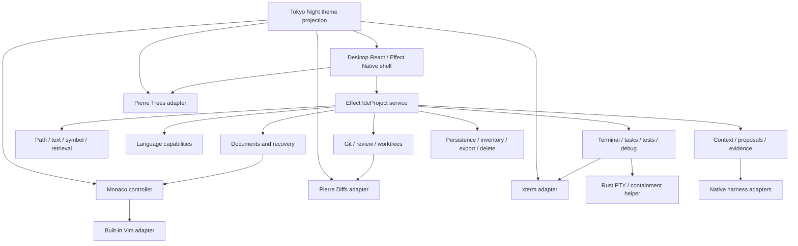

# OpenAgents IDE roadmap

Date: 2026-07-19
Status: canonical IDE build sequence
Baseline: OpenAgents `43b5dbc56e`; Cursor evidence through 3.11.13

## Purpose and authority

This is the single implementation roadmap for the OpenAgents IDE. It replaces
the overlapping packet sequences in the dated files in this directory. Those
files remain architecture, package, and reference evidence; they no longer
independently define order or completion.

The product contracts remain authoritative for intent:

- `specs/desktop/desktop-trust-complete-workbench.product-spec.md` revision 7;
- `specs/openagents/cursor-capability-parity.product-spec.md` revision 3;
- `specs/openagents/portable-coding-sessions.product-spec.md` revision 4;
- `specs/openagents/managed-agent-sandboxes.product-spec.md` revision 1;
- `specs/openagents/sarah-owner-orchestrator.product-spec.md` revision 4 as a
  brokered managed-sandbox consumer, not IDE authority;
- mobile revision 7 and web revision 7 for supervision and public sharing.

`specs/IDE_ROADMAP_CROSSWALK.md` is the exhaustive traceability index from
IDE-00..19 to those ProductSpec criteria, the unchanged Full Auto and Fast
Follow dependencies, and the exact-subject Desktop/Cursor AssuranceSpec
proposals. The proposals are structurally valid but remain `proposed` with
every obligation `needs_design`; they are not implementation, proof, release,
or parity evidence.

`docs/sol/MASTER_ROADMAP.md`, current code, live work packets, tests, and
receipts remain the status and dispatch authorities. A row here being next does
not claim that its dependencies, implementation, assurance, release, or public
promise have already been admitted.

The outcome is straightforward: a developer should be able to use OpenAgents
as their everyday editor and agent IDE without reopening Cursor, VS Code, or
Zed for a maintained workflow. OpenAgents should match Cursor's observable
breadth, achieve Zed-quality integration, reuse the useful TypeScript packages
instead of forking VS Code, and keep the better OpenAgents model, harness,
placement, authority, receipt, and data-custody architecture unbundled.

## Evidence reconciled

This roadmap reconciles the following local evidence rather than starting a
new design:

- the Monaco/Pierre basic IDE plan;
- the VS Code TypeScript package-reuse analysis;
- the Zed agent-IDE adaptation analysis;
- the Zed-quality Effect/Rust architecture decision;
- the Cursor product and full local-storage teardown;
- the Ascii Box/Optibox managed-sandbox teardown and OpenAgents GCP fit
  analysis;
- the owner-accepted managed-sandbox implementation plan and native SBX issue
  ledger;
- the Cursor parity and Desktop ProductSpecs;
- the current Desktop package graph, renderer, workspace services, command
  contracts, guarantees, and recent Editor-first commits.

The primary Cursor evidence is
[`2026-07-11-cursor-product-teardown.md`](../teardowns/2026-07-11-cursor-product-teardown.md),
including its 2026-07-18 full local-persistence audit. The parity contract is
[`cursor-capability-parity.product-spec.md`](../../specs/openagents/cursor-capability-parity.product-spec.md).

The sources have different jobs:

| Source     | What OpenAgents takes                                                                                                                                             | What OpenAgents does not take                                                                                     |
| ---------- | ----------------------------------------------------------------------------------------------------------------------------------------------------------------- | ----------------------------------------------------------------------------------------------------------------- |
| Zed        | one coherent project/document/language/Git/terminal/agent graph; agent context and code evidence as native IDE concepts                                           | GPUI, a Rust application core, or Zed's editor implementation                                                     |
| VS Code    | Monaco; focused URI, language, LSP, terminal, debug, and behavior-test lessons                                                                                    | a Code-OSS fork, Explorer/workbench internals, or trusted extension host                                          |
| Pierre     | focused React tree and diff kernels, theming seams, virtualized review UX                                                                                         | filesystem, Git, document, mutation, session, or policy authority                                                 |
| Cursor     | the complete capability breadth users now expect and the concrete local-data failure modes to avoid                                                               | closed custody, cloud-only inference, plaintext auth in a general state DB, hidden uploads, or fragmented erasure |
| OpenAgents | Effect-owned authority, existing workspace/document/Git/agent services, portable sessions, exact model identity, approvals, receipts, and public-safe projections | duplicated state graphs or UI claims unsupported by current evidence                                              |

## Where the product is now

The current Desktop is not an empty shell. Much of the difficult authority and
recovery substrate exists, while the visible editor mechanics remain narrow.

### Implemented substrate to preserve

- explicit workspace grants and root-private filesystem authority;
- root-relative path references in the renderer;
- lazy paged browsing with ignore, secret, binary, and symlink policy;
- cancellable bounded path and content search;
- recursive watcher invalidation and overflow handling;
- typed create, rename, non-recursive delete, reveal, open, save, save-as,
  external-change conflict, and grant-revocation flows;
- dirty tabs, close confirmation, revision-aware recovery drafts, selection,
  basic find, and undo/redo scaffolding;
- typed Git status and bounded, stale-checked, secret-aware diffs;
- typed terminal sessions with bounded/redacted output and process cleanup;
- one Desktop command registry and durable keybinding store;
- the existing agent-first workbench, sessions, providers, harnesses, Full Auto,
  approvals, MCP/skills/plugins substrate, and typed evidence systems;
- Command-E/Control-E Files mode, primary-rail composition, Finder document
  registration, editor-first cold-open ordering, and the shipped
  `@pierre/trees@1.0.0-beta.5` adapter.

### Current gaps that this roadmap must not euphemize

| Surface                     | Current truth                                                                                                                 | First packet that closes the core gap      |
| --------------------------- | ----------------------------------------------------------------------------------------------------------------------------- | ------------------------------------------ |
| source editor               | IDE-03/04 ship lazy packaged Monaco over the canonical Effect document/recovery service; IDE-06 adds exact-generation local language intelligence; IDE-07 accepts the integrated packaged daily journey; IDE-08 adds the exact agent proposal/apply graph | IDE-09+ adds inline AI/run/SCM/platform breadth |
| Effect Native editor seam   | production uses the app-local React Monaco host; `makeStubCodeEditorDriver()` is an explicitly selected compatibility renderer only | later renderer convergence                 |
| repository tree             | IDE-02/04 ship the complete Effect-owned, generation-fenced Pierre projection plus mouse/keyboard navigation, reveal, and durable workbench integration | IDE-02 and IDE-04 delivered                |
| review                      | IDE-05 ships one eight-variant versioned review source; IDE-08 routes real single/aggregate agent proposals through the same projection-only `@pierre/diffs@1.2.12` adapter | IDE-12 adds safe SCM mutation |
| themes                      | The owner-selected Khala editor projection now mounts from native window/first paint through chrome, Pierre, Monaco, and terminal; Tokyo Night remains the built-in fallback | IDE-18 adds broader user-selectable modes  |
| Vim                         | IDE-03/04 ship the persistent, off-by-default first-party controller with visible modes, durable keymap inspection, conflict reporting, scoped teardown, and IDE-07 packaged acceptance | later mapping breadth remains ledgered     |
| language intelligence       | IDE-06 ships visible document-local Monaco workers plus an Effect-supervised persistent project-local TypeScript 6.0.3 service, complete first capability corpus, shared Problems/Outline/breadcrumb/location/editor evidence, cancellation, restart, and stale-result refusal; IDE-07 accepts the integrated path | later languages remain explicit gaps       |
| terminal screen             | typed child-process terminal exists; no admitted xterm/PTY projection                                                         | IDE-10                                     |
| tasks/tests/debug           | useful substrate is fragmented; no one project evidence graph                                                                 | IDE-10/11                                  |
| integrated project identity | current workspace, document, Git, terminal, and agent surfaces do not yet share the full generation-fenced Zed-quality graph  | IDE-00 onward                              |
| agent-to-code loop          | IDE-08 ships exact attachment, eleven-source disclosure, proposal/Pierre review, canonical apply/rebase/undo, backlinks, and host-only post-image evidence; broader delivery remains explicit | IDE-08 delivered locally; IDE-12 adds delivery |
| inline AI editing           | no completion, next-edit, inline transform, or editor-native multi-file apply                                                 | IDE-09                                     |
| managed agent sandbox       | GCP, Agent Computer, Firecracker, workroom, and placement seams exist, but no one durable SandboxResource, admitted Box-compatible facade, or IDE/Sarah create-to-cleanup journey is proven | SBX-00..09, then IDE-13/17                 |
| full Cursor parity          | the ProductSpec ledger is a target, not a release fact                                                                        | IDE-19                                     |

The already-landed Files/Finder work is **foundation**, not IDE parity. It must
stay green while the temporary editor and partial projections are replaced.

## Product laws

Every packet follows these laws.

1. **The file is primary in Editor mode.** Finder, Explorer, quick open,
   search, Problems, symbols, Git, restore, and agent backlinks resolve the
   same document in the main region. Chat/provider/index/LSP hydration cannot
   hold the first editor paint hostage.
2. **One Effect project graph owns truth.** Project, root, worktree, file,
   document, language service, Git snapshot, terminal, task, debug session,
   agent attachment, proposal, and evidence have stable refs plus explicit
   generations. Widgets and helper processes are projections.
3. **Effect/TypeScript owns application authority.** It owns identities,
   commands, policies, grants, state machines, persistence, recovery, local and
   remote placement, export/delete, projections, and receipts.
4. **Rust is a narrow rind.** It may own process-opaque PTY/process-group and
   containment mechanics, optional local inference, or a benchmark-admitted
   native kernel. It never owns a project, document, session, credential,
   policy, database, approval, or receipt.
5. **Agents propose; the project service applies.** A harness never mutates
   Monaco or guesses current line numbers. Proposals bind exact base versions,
   review in the shared diff plane, and apply through current authority.
6. **Local and remote are placements, not separate products.** The same typed
   capability contract exposes effective placement, version, freshness,
   latency, custody, and availability. No silent upload or managed fallback.
7. **Mobile and web project evidence, not a full editor.** Desktop owns the
   complete editor; mobile supervises and reviews; web renders authenticated
   supervision and bounded, revocable `CodeShareBundle` projections.
8. **Parity is an acceptance result, not a package list.** Monaco plus Pierre
   is not Zed quality, and Zed quality alone is not Cursor feature parity.
9. **Effect Schema is the contract authority.** Every persisted, IPC, wire,
   helper, mobile/web, public-share, or otherwise boundary-crossing value is
   defined once with `Schema.Struct`, `Schema.TaggedStruct`, or
   `Schema.TaggedUnion`; TypeScript types are derived from the schema. Scalar
   refs are constrained branded schemas, and codegen-facing schemas carry
   stable identifiers. Raw interfaces/unions never become a parallel contract.
   Internal-only state machines may use `Data.TaggedEnum`.
10. **Effect services own lifecycle explicitly.** Application capabilities use
    `Context.Service`; real implementations use `Layer.effect`; public and
    non-trivial methods use named `Effect.fn`; errors use
    `Schema.TaggedErrorClass`; untrusted inputs use Schema decoders; and
    watchers, streams, and children are scoped and interrupted with their
    owning project layer.
11. **Compatibility adapters do not own the IDE.** The admitted Box v1 facade
    projects the canonical `SandboxResource`; its pinned SDK may prove wire
    compatibility but cannot own project identity, lifecycle, events,
    authority, placement, artifacts, or completion truth.

## Product shape and initial defaults

Desktop keeps the existing shell and adds one first-class **Editor** mode:

```text
+--------------------------------------------------------------------------+
| project / worktree | quick open | Editor actions | Agent / Review / Run  |
+----------------------+---------------------------------------------------+
| EXPLORER             | tabs / groups                                     |
| Pierre tree          +---------------------------------------------------+
| search / outline     |                                                   |
| Git / Problems       |                    MONACO                         |
|                      |                                                   |
|                      +---------------------------------------------------+
|                      | Problems | Output | Terminal | Review              |
+----------------------+---------------------------------------------------+
| branch | language | Vim: NORMAL | Ln/Col | spaces | UTF-8 | LF | trust  |
+--------------------------------------------------------------------------+
```

The initial opinionated defaults are:

- **Khala editor by default.** The owner-selected Khala blue-black projection
  is the fixed IDE/workbench default. Tokyo Night remains a built-in fallback.
  There is no user-facing theme picker before IDE-18.
- **Vim mode is built in and off by default.** A user can toggle it in
  Settings, the command palette, or the editor status control. The choice
  persists and applies to every Editor-mode Monaco view.
- Explorer on the left, source primary in the center, bottom panel collapsed,
  and the existing agent rail available without creating a second session.
- minimap and word wrap off initially but user-toggleable; line numbers,
  bracket matching, indentation guides, multi-cursor, find/replace, and
  accessibility support on.
- no remote semantic indexing, telemetry expansion, computer use, autosave,
  format-on-save, or agent mutation enabled merely because the UI exists.

Khala editor is the current product decision, with Tokyo Night retained as the
rollback/fallback projection. Light, high-contrast dark/light,
system-following, and user selection move to IDE-18 before any claim of
complete theme/accessibility parity. They do not block the first daily-use
editor.

## Built-in Vim contract

Vim mode is a first-party OpenAgents capability, not something the user must
discover and trust through an extension marketplace. A Monaco-compatible Vim
engine may supply key interpretation, but an app-owned `VimModeController`
owns its lifecycle and translates every authority-bearing action into the one
Desktop command/document graph.

### Required first release behavior

- persistent `editor.vim.enabled` boolean, default `false`;
- toggle commands in Settings, command palette, and status bar;
- visible `NORMAL`, `INSERT`, `VISUAL`, `VISUAL LINE`, `VISUAL BLOCK`,
  `REPLACE`, and operator-pending state where the selected engine supports it;
- core motions, counts, operators, text objects, marks, registers, repeat,
  search, character find, join, indent, case, paste, and undo/redo;
- system clipboard integration under explicit platform behavior;
- `/` search and supported `:` commands projected into Monaco or Desktop
  commands; `:write`, `:quit`, and variants use typed save/close guards rather
  than bypassing revision checks or dirty confirmation;
- `Escape` behavior that does not trap focus, break dialogs, or steal global
  approval/cancel commands;
- deterministic precedence between Vim mappings, Monaco commands, application
  keybindings, menu accelerators, input methods, and accessibility shortcuts;
- one mode/status projection shared across split views without leaking Vim
  state between unrelated documents, projects, or worktrees;
- packaged offline operation, restart persistence, and explicit teardown.

IDE-01 selects and pins the engine only after its license, maintenance,
Electron packaging, IME, accessibility, multi-cursor, and Monaco-version
compatibility are measured. The engine remains replaceable. If no package
passes, the fallback is a bounded first-party key-state adapter over Monaco's
public commands—not a dependency on VS Code's extension host.

### Vim acceptance journeys

1. Toggle Vim on, edit and save, restart Desktop, and remain in Vim mode.
2. Use Normal/Insert/Visual operations, counts, search, repeat, registers, and
   undo/redo without diverging from canonical dirty/document state.
3. Run `:write` during an external-change conflict and receive the same typed
   conflict flow as Command-S; no overwrite occurs.
4. Use Vim in two splits and two equal relative paths in separate worktrees;
   mode/view state and document authority remain correctly scoped.
5. Toggle Vim off without remounting the document, losing selection/draft, or
   leaving key handlers attached.
6. Complete tree, editor, Problems, diff, terminal, dialog, and agent-review
   journeys by keyboard with Vim on and off.

## Khala editor and Tokyo Night fallback contract

Khala editor and Tokyo Night are owned `DesktopThemeProjection` values in one
typed registry, not lookalike themes chosen independently by each library.
Khala editor is the fixed mounted default; Tokyo Night is the built-in
fallback. The projections map their reviewed semantic palettes into:

- Effect Native/app-chrome semantic tokens;
- Monaco base colors and syntax token rules;
- Pierre tree variables and Git/diagnostic/conflict decorations;
- Pierre/Shiki diff colors;
- xterm ANSI colors and cursor/selection state;
- Problems, Output, debug, review, agent proposal, browser, and status UI;
- focus, disabled, error, warning, success, selection, link, and non-color
  state cues.

The source palette, provenance, any accessibility adjustments, and exact token
mapping are checked in. Raw theme code, `unsafeCSS`, and executable VS Code
theme contributions are never admitted. Theme initialization happens before
the first Editor paint, causes no flash of the old palette, works offline, and
does not destroy models, selection, scroll, terminals, or diffs.

Acceptance requires WCAG contrast checks for both projections' semantic text
and focus roles, visual fixtures for chrome, tree, source, diff, Problems,
terminal, and agent states, and a packaged proof that Khala editor paints by
default while Tokyo Night remains locally registered. Broader theme import
remains an isolated extension capability, not part of the first editor.

## Target service and package architecture



Package choices are intentionally narrow:

- `monaco-editor` for editing and its initial JSON/CSS/HTML/TypeScript workers;
- the already shipped `@pierre/trees` for Explorer;
- `@pierre/diffs` after its package/packaging gate for all review classes;
- xterm packages only when the terminal packet owns lifecycle and packaging;
- focused public VS Code packages only where their dependency graph remains
  bounded and their types are hidden behind Effect-owned contracts;
- LSP, tsserver, DAP, Git, search, and harness executables supervised as
  project capabilities, regardless of their implementation language.

Do not import VS Code's workbench, Explorer, `vs/*` internals, extension host,
context-key universe, settings registry, or filesystem authority. Do not port
Zed's GPUI editor. Do not add a Rust IDE database or application service.

## Dependency-ordered delivery map

| Packet | Outcome                                                                     | Depends on              | Release rung       |
| ------ | --------------------------------------------------------------------------- | ----------------------- | ------------------ |
| IDE-00 | contracts, identities, baseline, behavior corpus                            | landed Files foundation | foundation         |
| IDE-01 | package, Tokyo Night, Vim, worker, packaging spikes                         | IDE-00                  | foundation         |
| IDE-02 | complete generation-fenced Pierre path index                                | IDE-00/01               | daily editor       |
| IDE-03 | real Monaco lifecycle, Tokyo Night, built-in Vim                            | IDE-00/01               | daily editor       |
| IDE-04 | navigation, groups/splits, settings, keymaps, file operations               | IDE-02/03               | daily editor       |
| IDE-05 | Pierre review, compare, conflicts, checkpoints                              | IDE-03/04               | daily editor       |
| IDE-06 | language intelligence, symbols, Problems                                    | IDE-03/04               | daily editor       |
| IDE-07 | packaged daily-editor quality gate                                          | IDE-02–06               | basic IDE accepted |
| IDE-08 | agent context, proposals, backlinks, post-apply evidence                    | IDE-05/06/07            | agent IDE          |
| IDE-09 | completion, next edit, inline/multi-file AI editing                         | IDE-06/08               | agent IDE          |
| IDE-10 | xterm, PTY, tasks, tests, Output                                            | IDE-07                  | integrated IDE     |
| IDE-11 | debug/DAP                                                                   | IDE-06/10               | integrated IDE     |
| IDE-12 | safe SCM mutation, worktrees, delivery                                      | IDE-05/07/10            | integrated IDE     |
| IDE-13 | local/remote project capability symmetry                                    | IDE-08/10/12            | portable IDE       |
| IDE-14 | mobile review, web supervision, public code share                           | IDE-08/12/13            | portable IDE       |
| IDE-15 | isolated extensions and component ABI                                       | IDE-07/10/11            | ecosystem          |
| IDE-16 | browser, preview, design, screenshot, computer use                          | IDE-08/10/15            | ecosystem          |
| IDE-17 | Agents Window, side chats, best-of-N, background agents, automations        | IDE-08/12/13/16         | agent platform     |
| IDE-18 | data lifecycle, migration, enterprise, distribution, complete accessibility | IDE-13–17               | parity candidate   |
| IDE-19 | maintained Cursor ledger closure and owner acceptance                       | every required packet   | full parity gate   |

Packets are small review and acceptance boundaries, not an instruction to land
the entire program in one change.

### Managed-sandbox dependency program

Owner direction on 2026-07-19 admits epic
[#9023](https://github.com/OpenAgentsInc/openagents/issues/9023) as a P1
parallel dependency program. It does not reorder IDE-08..12 or claim managed
execution is already live.

The post-basic-IDE implementation program is epic
[#9035](https://github.com/OpenAgentsInc/openagents/issues/9035): IDE-08..19 are
#9036..#9047 in packet order.

| SBX packet | IDE relationship |
| --- | --- |
| [SBX-00 #9029](https://github.com/OpenAgentsInc/openagents/issues/9029) | freezes sandbox, authority, event, receipt, and Box compatibility contracts before the IDE consumes them |
| [SBX-01 #9034](https://github.com/OpenAgentsInc/openagents/issues/9034) through [SBX-05 #9026](https://github.com/OpenAgentsInc/openagents/issues/9026) | supply durable lifecycle, real GCP execution, long-running turns, files, commands, artifacts, and hardening below the project graph |
| [SBX-06 #9027](https://github.com/OpenAgentsInc/openagents/issues/9027) | after IDE-08 #9036, IDE-10 #9038, and IDE-12 #9040, supplies the managed target consumed by IDE-13 #9041 and IDE-17 #9045 |
| [SBX-07 #9030](https://github.com/OpenAgentsInc/openagents/issues/9030) and [SBX-08 #9031](https://github.com/OpenAgentsInc/openagents/issues/9031) | make Sarah and mobile/web consumers of the same lifecycle authority; they do not create client-local runtime models |
| [SBX-09 #9033](https://github.com/OpenAgentsInc/openagents/issues/9033) | independently proves live GCP, SDK, Desktop, Sarah, isolation, cleanup, cost, and rollback before a release claim |
| [SBX-10 #9032](https://github.com/OpenAgentsInc/openagents/issues/9032) | defers checkpoint/fork/private desktop until Phase 1 is accepted and their distinct semantics pass |

The canonical intent and issue order are
[`managed-agent-sandboxes.product-spec.md`](../../specs/openagents/managed-agent-sandboxes.product-spec.md)
and
[`2026-07-19-managed-agent-sandboxes-accepted-plan.md`](../sol/2026-07-19-managed-agent-sandboxes-accepted-plan.md).

## Packet details

### IDE-00 — Admit the project graph and prove the baseline

Define or ratify `IdeProjectRef`, roots, worktrees, files, documents, service
generations, navigation targets, excerpts, proposals, and capability states.
Separate attachment, disk revision, document generation, language generation,
Git snapshot, and placement generation. Record current latency, memory, handle,
tree, textarea, terminal, recovery, and startup behavior before replacement.

Define boundary data in Effect Schema and derive every TypeScript type from
that source. Use constrained branded schemas for refs and generations,
`Schema.TaggedUnion` for projected lifecycle variants, `Data.TaggedEnum` only
for internal reducer decisions, and `Schema.TaggedErrorClass` for expected
service failures. Define application services with `Context.Service`, acquire
them through explicit `Layer.effect` graphs, name operations with `Effect.fn`,
and scope background work to the project layer. Generate helper fixtures/types
from the Schema source; never mirror the contract by hand in Rust.

Add behavior contracts for Editor entry/exit, editor-first Finder open, one
document through every navigation origin, tree selection, edit/save/conflict,
dirty restart, worktree isolation, grant revocation, and late-result fencing.
The existing Files journey remains a required regression fixture.

Exit: contracts and invariants are accepted; a schema/type drift check rejects
raw or hand-mirrored boundary contracts; no widget is an authority; current
gaps have explicit ledger rows and baseline measurements.

#### IDE-00 implementation receipt

Issue [#9015](https://github.com/OpenAgentsInc/openagents/issues/9015) is the
exact delivery receipt for this packet; its closing comment records the landed
`main` SHA and final command results. The implementation evidence is:

- `apps/openagents-desktop/src/ide/project-contract.ts`: the identified,
  schema-first project graph, branded refs/generations, tagged lifecycle and
  navigation variants, excerpts, proposals, and boundary decoders;
- `apps/openagents-desktop/src/ide/project-service.ts`: the scoped
  `Context.Service` / `Layer.effect` implementation with named operations,
  decoded inputs, typed expected failures, atomic generation changes,
  capability stop semantics, and late-result fencing;
- `apps/openagents-desktop/src/workspace-contract.ts` and the editor recovery
  schema: the shipped Files boundary types now derive from their schemas
  instead of mirroring them by hand;
- `apps/openagents-desktop/scripts/check-ide-boundaries.ts`: the mechanical
  guard against raw parallel contracts, unchecked IDE authority casts,
  widget/native authority, Rust schema mirrors, or removal of required Effect
  lifecycle primitives;
- `apps/openagents-desktop/benchmarks/ide/2026-07-19-ide-00-baseline.json`
  and its raw/startup companions: public-safe p50/p95/p99 observations plus
  explicit gaps for Finder, input-to-paint, real PTY, worker cancellation, and
  split Electron resource telemetry;
- behavior contract
  `openagents_desktop.ide_project_generation_fencing.v1` and the project,
  shell, workspace-editor, Files, search, Git, terminal, recovery, and launch
  regression corpus.

This receipt admits the shared graph and preserves the Files foundation. It
does not imply Monaco, complete Explorer, language intelligence, Zed quality,
the daily-use basic IDE rung, or Cursor parity. Those remain IDE-01 onward.

### IDE-01 — De-risk packages, Tokyo Night, Vim, and packaging

Pin Monaco from the already proven OpenAgents lineage, then prove worker URLs,
CSP, lazy chunks, offline packaging, disposal, and source maps in Electron.
Admit Pierre Diffs only after its public API and package assets work in the
same build. Evaluate the narrow Vim engines against the built-in Vim contract.
Create the Tokyo Night token/provenance file and render chrome, Monaco, Pierre
tree/diff, and terminal fixtures from one projection.

Run the focused VS Code package candidate matrix; admit only packages whose
transitive/runtime footprint and public API fit the adapter boundary. Measure
the TypeScript search/index/watch path before proposing any Rust replacement.

Exit: exact pins, licenses, bundle sizes, worker strategy, rollback plan,
compatibility matrix, and packaged fixtures are recorded. No package has gained
filesystem, document, process, Git, policy, or persistence authority.

#### IDE-01 implementation receipt

Issue [#9016](https://github.com/OpenAgentsInc/openagents/issues/9016) is the
exact delivery receipt. The full decision and measurement record is
[`2026-07-19-ide-01-package-admission.md`](2026-07-19-ide-01-package-admission.md).
The admitted result is intentionally narrow:

- exact `monaco-editor@0.55.1` and `@pierre/diffs@1.2.12` pins with immutable
  upstream/registry identity, licenses, transitive costs, compatibility,
  disposal, rollback, and explicit no-authority audits;
- real development and ASAR Electron probes for editor/JSON/CSS/HTML/TypeScript
  and Pierre workers, restrictive CSP/offline loading, three create/dispose
  cycles, injected worker failure, zero tracked leaks, both diff modes,
  controlled selection/annotation, and a 200-file virtualized review;
- an opt-in attribution fixture excluded from ordinary builds, with normal
  boot, lazy closure, worker, source-map, startup, and renderer-memory receipts;
- rejection of both evaluated Vim packages and selection of the 32-capability
  app-owned public-Monaco `VimModeController` contract, still unimplemented;
- one provenance-pinned, contrast-adjusted Tokyo Night projection plus a real
  Electron visual fixture, still not mounted in the production workbench;
- a 10,000-file TypeScript index/watch benchmark that meets every written p95
  gate and rejects speculative Rust placement.

Behavior contract `openagents_desktop.ide_package_admission.v1` and the
schema-decoded receipts under `apps/openagents-desktop/benchmarks/ide/` guard
the result. This is package/runtime foundation only. It does not satisfy the
Explorer, production Monaco/Vim/theme, review, language, daily-use basic-IDE,
Zed-quality, or Cursor-parity gates owned by IDE-02 onward.

### IDE-02 — Complete Explorer over the Pierre tree

Build an Effect-owned, chunked, generation-fenced path index from workspace
pages plus watcher reconciliation. It supports multi-root/worktree identity,
honest scan progress/truncation/errors, stable expansion/selection/focus/scroll,
incremental updates, ignore/symlink/secret rules, folded folders, sticky
ancestors, Git/diagnostic/conflict badges, reveal, and scale budgets.

All create/rename/move/copy/delete/reveal/terminal/compare actions dispatch
typed commands. Optimistic rename and drag/drop wait for expected-version move
contracts; Pierre receives no root, grant, bridge, or mutation authority.

Exit: a large real repository can be navigated entirely by mouse or keyboard,
and every incomplete state is visible rather than looking like an empty tree.

Delivered 2026-07-19 in `#9017`. The production Files rail now uses the
complete path-index projection rather than mounted pages. Schema-first Effect
contracts, worktree/index generation fences, chunked complete/lazy scans,
watcher reconcile/overflow rescan, cancellation, stable interaction, current-
generation badges, typed expected-version operations, accessibility journeys,
scope teardown, a 10,000-file percentile/resource receipt, and a packaged
large-repository pointer/keyboard journey are recorded in
`docs/ide/2026-07-19-ide-02-complete-pierre-explorer.md`. This delivery closes
the Explorer packet only; IDE-03 subsequently closed the editor-runtime
dependency, IDE-04 closed the daily workbench, IDE-05 closed the versioned
review plane, and IDE-06 is now the next release-rung blocker.

### IDE-03 — Replace the textarea with Monaco and ship Tokyo Night/Vim

Create one app-local Monaco runtime/controller used by the primary React view
and the Effect Native host-driver seam. Map stable opaque document refs to
models; keep paths mutable and root-private; translate incremental edits with
version/gap/resync semantics; preserve canonical dirty/recovery state outside
Monaco; and dispose models/workers/listeners exactly once.

This packet also makes Tokyo Night the fixed initial workbench/editor theme and
ships the built-in Vim toggle. It replaces app-owned find with Monaco
find/replace while preserving typed command entry; adds go-to-line, core
editing, multi-cursor, folding, bracket/indent behavior, selection history,
save/save-all, conflict, close, and restart paths.

Exit: Finder and every current Files route open an input-ready Tokyo Night
Monaco document first; Vim can be toggled and survives restart; textarea/stub
paths remain only named compatibility/test fallbacks.

Delivered 2026-07-19 in `#9018`. The production React document route now uses
one lazy packaged Monaco island keyed by opaque document refs, while Effect
retains draft/revision/conflict/recovery authority and generation/sequence-gap
fencing. Tokyo Night initializes at the native window and first HTML paint and
projects through chrome, Pierre, and Monaco. The persistent built-in Vim
controller is off by default, exposes modal status, shares document-scoped
register/mark/repeat state across split views, routes save/close through typed
authority, suspends during composition, and finalizes its handlers. Full
architecture, percentile/resource measurements, packaged LaunchServices
journey, and scope limits are recorded in
`docs/ide/2026-07-19-ide-03-monaco-vim-tokyo-night.md`. This closes IDE-03
only; IDE-04 through IDE-07 subsequently closed and accepted the narrow basic-
IDE rung while leaving every later capability gap visible.

### IDE-04 — Make the workbench navigable and configurable

Add quick open, workspace search results, one navigation history, tabs with
preview/pin/reorder/reopen, split groups over shared document models, Outline
placeholder states, breadcrumbs, recent restore, and typed file operations.
Extend the existing command registry rather than accepting a Monaco-only
command universe.

Add bounded editor settings and a keybinding UI with default/user/workspace
precedence, conflicts, reset, export, and import. Vim mappings remain a
separate scoped layer whose precedence is visible. Tokyo Night stays the only
selectable theme in this rung.

Exit: ordinary repository navigation and editing no longer requires another
editor, and all settings/keybindings are typed, durable, inspectable, and
reversible.

### IDE-05 — Use Pierre for every review class

Delivered on 2026-07-19 in [the IDE-05 implementation and verification
receipt](2026-07-19-ide-05-versioned-pierre-review.md). The shipped source
schema, production adapters, selected disclosure, staleness law, benchmark,
and packaged eight-source corpus satisfy this packet; IDE-08 and IDE-12 retain
proposal workflow and SCM mutation authority.

Replace the hand-rendered Git hunk view with Pierre Diffs through an app-owned
adapter. Represent HEAD/index/worktree, saved/draft, external conflict,
checkpoint, agent proposal, and candidate comparison as distinct versioned
diff sources. Support file/aggregate review, annotations, selection, context,
compare, accept/reject where authority exists, and independent undo.

Exit: review never confuses Git state, unsaved document state, agent proposal,
or applied result; stale bases refuse rather than patching by position.

### IDE-06 — Add honest language intelligence

Delivered on 2026-07-19 in [the IDE-06 implementation and verification
receipt](2026-07-19-ide-06-generation-safe-language.md). Desktop now keeps
document-local Monaco workers distinct from the persistent Effect-supervised
project TypeScript service; all seventeen initial capabilities, shared
Problems/Outline/breadcrumb/location/editor projections, exact generation
fences, cancellation, crash recovery, measurements, and zero-resource stop are
implemented. IDE-07 subsequently accepted the integrated packaged rung, while
the documented TypeScript-only/cross-file-edit limits remain honest gaps.

Start with Monaco-local workers for immediate syntax/JSON/CSS/HTML/TypeScript
help, clearly labeled as document-local. Add an Effect-owned tsserver/LSP host
for project diagnostics, completion, hover, definitions, references, symbols,
rename, formatting, code actions, semantic tokens, inlay hints, and folds.

Every result binds document and service generations, supports cancellation and
supersession, and carries effective placement and degraded/unavailable truth.
Problems, Outline, breadcrumbs, quick symbol, references, and agent context use
the same result refs and read-only excerpts.

Exit: the first admitted language corpus completes edit/navigation/Problems
journeys with stale-result rejection and process-restart recovery.

### IDE-07 — Accept the daily-use basic IDE

The schema-first exact-artifact gate, packaged editor/chat-only journeys,
frozen percentile/resource evaluator, custody audit, rollback binding, target
limits, and claim boundary are implemented in
[the IDE-07 acceptance dossier](2026-07-19-ide-07-basic-ide-acceptance.md).
Candidate `48c32a1d4c2f9ff84d8e92fe1c9ab074096b1fec` is accepted for the exact
macOS arm64 app-tree digest recorded there. All 15 matrix rows, 27 checked
metrics, the complete Desktop corpus, Effect boundary oracle, seven chat-only
launches, integrated packaged editor journey, rollback, target, and
no-overclaim gates pass. The admitted language is only “OpenAgents basic IDE”;
the epic's separate owner acceptance and every IDE-08..19 gap remain open.

Run packaged journeys for Finder cold open, large/multi-root Explorer, rapid
file switching, split dirty recovery, conflict, search, navigation, Git review,
language bursts, Vim on/off, keyboard-only use, VoiceOver/screen reader,
reduced motion, zoom, Tokyo Night contrast, offline launch, resource disposal,
and rollback.

Ratify p50/p95/p99 budgets from the IDE-00 baseline for startup, cached and
uncached tree, file open, input-to-paint, search, language results, save,
recovery, memory, handles, cancellation, and teardown. Chat-only launch must
remain Monaco/Pierre-worker free.

Exit: OpenAgents can claim a useful basic IDE rung, not Zed quality or full
Cursor parity. Every later gap remains visible.

### IDE-08 — Make agents native to the code graph

Delivered by #9036. The implementation and exact evidence contract are in
`docs/ide/2026-07-19-ide-08-agent-native-code-graph.md`. Closing the packet
does not create the “integrated OpenAgents agent IDE” rung; IDE-09 through
IDE-12 remain required for that group claim, and the ProductSpec AssuranceSpec
bindings remain proposed/unreviewed.

Bind a session to an exact project/worktree without granting implicit tools.
Add an inspectable context tray for files, ranges, symbols, diagnostics,
changes, rules, skills, retrieval reasons, destination, bytes/tokens, and
omissions. Agent output becomes a version-bound single- or multi-file proposal
reviewed in Pierre and applied through document/workspace authority.

Add code-to-turn and turn-to-code backlinks, proposal checkpoints, apply/
reject/undo receipts, stale-base rebase/refusal, and post-apply diagnostics,
tests, formatting, Git, commit, push, and acceptance facts. Harness completion
is never reclassified as delivery.

Exit: the diagnostic-to-agent-to-proposal-to-evidence journey works without a
harness acquiring editor authority.

### IDE-09 — Add Cursor-class AI editing

Ship low-latency single/multi-line completion, next-edit prediction, inline
ask/edit/generate, selection transforms, and fast multi-file apply using exact
document/proposal generations. Candidate context may combine explicit items,
parse/LSP facts, recent edits, diagnostics, Git/co-change, local lexical search,
and optional semantic retrieval.

Expose selected/effective model, provider, account, harness, placement,
retention, cost/usage, latency, and fallback. Accept/reject/partial-accept/undo
are canonical commands; quality and latency corpora are checked in.

Exit: the full AI-editing acceptance corpus passes without a hidden model,
silent upload, or direct Monaco mutation.

### IDE-10 — Integrate terminal, tasks, tests, and Output

Keep terminal/session/task/test identity and retention in Effect. Add xterm as
the screen projection and a bounded Rust PTY/process-group/containment helper
only for the admitted OS mechanics. Reuse the current typed terminal path and
redaction rather than creating a second shell authority.

Add profiles, splits, reconnect, resize, signals, links under policy, named
tasks, problem matchers, test discovery/run/result trees, Output/log channels,
artifacts, and agent-readable evidence. Six-target conformance governs PTY and
fallback behavior.

Exit: edit-run-test-fix and restart/reconnect journeys retain exact output gaps,
process facts, authority, and evidence.

### IDE-11 — Integrate debug

Add an Effect-owned DAP client and debug graph for configurations,
launch/attach disclosure, breakpoints, stack, scopes, variables, watch,
console, stepping, restart, termination, and late-event fencing. Adapter
processes are supervised capabilities; they do not own workspace policy or
persist credentials.

Exit: a checked-in language/debug corpus proves edit-build-break-inspect-fix
with clear unsupported/degraded states.

### IDE-12 — Complete Git, worktrees, and delivery

Extend truthful read-only Git/review into expected-version staging, partial
staging, discard, commit, branch, merge/rebase/conflict, fetch/pull/push, PR,
blame/history, and worktree create/archive/cleanup flows. Keep mutation,
delivery, verification, and owner acceptance distinct.

Parallel agents receive collision-safe claims and isolated worktrees; best-of-N
candidates remain separate until an explicit comparison and acceptance step.

Exit: a proposal can become a reviewed commit/push/PR with exact receipts, and
neither agent prose nor Git process exit alone can claim delivery.

### IDE-13 — Make project capabilities portable

Use one contract for local, owner-managed remote, OpenAgents-managed, and
admitted compatible-provider capabilities. Transport stable refs and bounded
events, not raw local roots. Expose effective placement, version, latency,
freshness, custody, attachment generation, and compatibility.

For `OpenAgents-managed`, consume the generation-fenced `SandboxResource`
admitted by SBX-00..09. Create, inspect, stop, resume, interrupt, and delete go
through the same main-owned project capability service used by the agent and
evidence graphs. Show the effective GCE VM or Firecracker microVM honestly;
do not relabel it an OCI container, install the Box SDK in production code, or
treat an SDK state label as readiness or cleanup proof.

Disconnect/revoke/reconnect/move tests reject late output and prevent double
attachment, silent upload, helper installation, credential movement, or
managed fallback.

Exit: a session and project can move across admitted hosts without forking
identity, history, authority, or receipts.

### IDE-14 — Project the IDE safely to mobile and web

Mobile gets bounded tree/excerpt/search/symbol/Problems/changes/proposal/test/
task/artifact views plus review, comment, steer, approve/reject, stop, and hand
back where policy allows. It never receives raw roots or full editor authority.

Web authenticated supervision uses the same project refs. Public or audience-
scoped links compile an allowlisted `CodeShareBundle` containing only selected
tree, excerpt, diff, proposal, Problem, test, artifact, bounded log, agent
causal, runtime, and receipt evidence with snapshot/live, omission, staleness,
expiry, access, revocation, and verification facts. Public pages have no
workspace, Git, terminal, model, or mutation authority.

Exit: Desktop/mobile/web continuation and publish/revoke journeys pass without
private-state leakage.

### IDE-15 — Add an isolated extension and component ABI

Support portable settings, keybindings, language packages, themes, commands,
skills, MCP, rules, hooks, plugins, subagents, and eventually UI components
through signed provenance, capability manifests, guest isolation, host-effect
brokering, compatibility, review, rollback, and data inventory.

There is no trusted in-process VS Code-compatible extension host and no binary
ABI parity promise. Khala editor remains the built-in default and Tokyo Night
the built-in fallback even after safe declarative themes are admitted.

Exit: discover/install/import/export/update/disable/remove/team-distribute
journeys work without untrusted code entering the shell or Effect engine.

### IDE-16 — Add browser, preview, design, and computer-use workflows

Integrate partitioned preview/browser sessions, explicit dev-server lifecycle,
DOM and screenshot context, responsive inspection, visual editing/design-to-
code, image workflows, and browser automation. Computer use stays
deny/ask-by-default with explicit OS/network authority, secret redaction, and
per-action receipts; it is never enabled merely by an automation trigger.

Exit: agent and human can inspect and test a change in the same project graph
without browser state becoming hidden workspace or credential authority.

### IDE-17 — Complete the agent platform around the IDE

Project the same canonical graph as classic Editor and a dedicated Agents
Window. Add side chats, searchable history, plan/ask/execute/review/debug/design
and custom modes, parallel sessions, subagents, background shells, best-of-N,
comparison, cloud/background continuation, schedules, repository/issue/PR/
webhook/manual triggers, budgets, pause/cancel/rerun, notifications, and
morning-review outcomes.

Startup restores the user's chosen surface; the flagship agent window never
force-opens. Every mode compiles to visible model, tools, permissions,
placement, memory, and instructions.

Managed long-running work uses the same sandbox, project, work-unit, turn,
agent, and receipt refs exposed by IDE-13. Sarah-started work remains visibly
attributed to `principal.sarah` while sharing that graph. This packet does not
silently bind a managed sandbox to `FullAutoRun`; cross-machine Full Auto
admission remains excluded until its own ProductSpec and AssuranceSpec are
revised and rebound.

Exit: classic IDE and Agents Window show the same sessions, worktrees,
proposals, terminals, checkpoints, evidence, and effective identities.

### IDE-18 — Close custody, migration, platform, and accessibility gaps

Build one typed data inventory and erasure coordinator covering every durable
local and remote representation:

- canonical chats, event/content objects, headers, summaries, and attachments;
- conversation FTS/read models and reconciliation state;
- document recovery, checkpoints, preimages, diffs, history, and attribution;
- path manifests, Merkle state, lexical/symbol indexes, chunk metadata,
  embeddings, remote handles, caches, and snapshots;
- terminal/task/test/debug/output history;
- browser cookies/storage/cache and screenshots;
- settings, keybindings, Vim state, rules, skills, MCP, hooks, plugins,
  extensions, and downloaded runtimes;
- credentials through an OS-backed vault reference, never plaintext in a
  general UI/chat database;
- logs, diagnostics, telemetry consent/state, crash reports, updater caches,
  backups, replicas, tombstones, and retention clocks.

For each class show purpose, logical and physical location, size, sensitivity,
encryption, authority, last write, quota, retention, sync/replicas, runtime
access, export, rebuild, selective deletion, and full deletion. Derived FTS,
indexes, backups, attribution, and remote embeddings must converge before a
delete report says complete. Cursor's fragmented local stores are the explicit
negative test.

Also add allowlisted Cursor migration for settings, keybindings, rules, skills,
and MCP configuration without credentials, telemetry IDs, proprietary bytes,
or opaque cloud state; organization policy/audit/SSO controls; signed update
and rollback; macOS/Windows/Linux x64/arm64 coverage; localization; and the
deferred light/high-contrast/system-following themes.

Exit: data, migration, enterprise, distribution, platform, accessibility, and
theme ledgers have passing evidence or explicit visible gaps.

### IDE-19 — Close and continuously maintain Cursor parity

For every family in the Cursor ProductSpec ledger, bind current Cursor evidence,
source version/date, target surface and owner, implementation, acceptance,
assurance, placement, local/remote data, network dependency, disposition, and
freshness. Run a clean Cursor-switcher corpus and prove that no maintained
daily workflow requires reopening Cursor.

A release may say **basic IDE**, **agent IDE**, or **parity candidate** when
the corresponding rung passes. It may say **Cursor parity**, **full parity**,
or **drop-in replacement** only when every required row is owner-accepted with
current evidence and the ProductSpec promise gate is satisfied.

Exit: owner acceptance and registered release evidence—not this roadmap—close
the full-parity gate. Continuous Fast Follow reopens only rows with new pinned
evidence.

## Cursor parity closure matrix

This matrix prevents the IDE packets from narrowing “parity” to editor widgets.
It maps every required Cursor family to its main closure packets.

| Cursor capability family    | Current OpenAgents footing                                                                       | Closure packets           |
| --------------------------- | ------------------------------------------------------------------------------------------------ | ------------------------- |
| product shells              | agent-first Desktop plus Monaco, complete navigation/configuration, versioned Pierre review, and the IDE-07 packaged basic-IDE gate exist | IDE-17                    |
| editor core                 | Effect documents/recovery, complete Pierre tree, Monaco, Khala editor default with Tokyo Night fallback, built-in Vim, daily workbench, eight-class review, TypeScript intelligence, and integrated IDE-07 acceptance exist; later run/SCM/theme breadth remains | IDE-10–12/18              |
| AI editing                  | IDE-08 provides the exact proposal/review/apply substrate; completion, next edit, inline transforms, and quality/latency evidence are still absent | IDE-09                    |
| repository intelligence     | bounded path/content search; no complete symbol/semantic custody stack                           | IDE-02/06/09/18           |
| conversations               | durable multi-provider/session substrate; parity search/branch/export lifecycle remains ledgered | IDE-17/18                 |
| agent modes                 | agent runtime/mode substrate exists; integrated policy/result UX incomplete                      | IDE-08/17                 |
| agent tools                 | broad typed tool substrate; IDE/browser/computer integration incomplete                          | IDE-08/10/12/16           |
| parallel agency             | Full Auto/subagent/worktree foundations exist; IDE comparison/fan-in incomplete                  | IDE-12/17                 |
| recovery and memory         | IDE-08 recovers pending/reviewed/partial/applied/undoable proposal state and expires private preimages; full inventory/export/deletion convergence remains absent | IDE-18                    |
| background and cloud agents | portable/fleet foundations exist; project-capability symmetry is incomplete                      | IDE-13/17                 |
| automations                 | Full Auto foundation exists; full trigger/review IDE integration is incomplete                   | IDE-17                    |
| remote control              | cross-surface contracts exist; complete project review/continuation is incomplete                | IDE-13/14/17              |
| CLI and protocols           | strong typed runtime/CLI substrate; one IDE command graph and project evidence remain            | IDE-08/10/13/17           |
| extensibility               | skills/MCP/plugins substrate exists; isolated editor ABI and marketplace lifecycle remain        | IDE-15/18                 |
| browser and design          | preview/browser substrate exists; integrated design/computer-use contract remains                | IDE-16                    |
| sharing and review links    | trust/share substrate exists; code-evidence bundle and review journeys remain                    | IDE-14                    |
| models and accounts         | multi-harness/provider/account system is a strength; editor intelligence disclosure remains      | IDE-09/17                 |
| teams and enterprise        | policy/receipt foundations exist; editor bundles/admin/platform proof remain                     | IDE-15/18                 |
| security and privacy        | explicit authority/sandbox/receipt laws are stronger; IDE-wide data-flow proof remains           | every packet, IDE-18 gate |
| distribution                | exact macOS arm64 basic-IDE package is accepted; complete platform/editor/update matrix remains  | IDE-18                    |
| data lifecycle              | typed stores exist but not one complete inspect/export/delete product                            | IDE-18                    |
| quality and accessibility   | IDE-07 integrated macOS arm64 gates pass; full platform/accessibility matrix and broader themes remain | IDE-18                |

## Release rungs and names

| Rung                  | Minimum completed packets                  | Honest release language                                   |
| --------------------- | ------------------------------------------ | --------------------------------------------------------- |
| Files foundation      | already landed                             | “Files mode” / “editor-first file open”                   |
| Daily-use basic IDE   | IDE-00–07                                  | “OpenAgents basic IDE”                                    |
| Agent IDE             | IDE-08–12                                  | “integrated OpenAgents agent IDE” after its journeys pass |
| Portable IDE platform | IDE-13–18                                  | “Cursor-parity candidate” only                            |
| Full parity           | IDE-19 plus ProductSpec owner/promise gate | “Cursor parity” / “full parity”                           |

No rung is allowed to hide the next rung's gaps.

## Cross-cutting verification

Every implementation packet supplies, in proportion to its boundary:

- pure state-transition and schema tests;
- main-process integration tests for grants, revisions, processes, storage,
  cancellation, restart, and revocation;
- renderer integration tests for command, focus, selection, model, tree, diff,
  terminal, agent, and stale-event behavior;
- packaged Electron proofs for worker/assets/CSP/offline/signing paths;
- fault tests for crash, update, network partition, provider failure, corrupt
  index/store, missing binary, late output, quota, and deletion convergence;
- accessibility, keyboard, Vim-on/Vim-off, reduced-motion, zoom, contrast, and
  screen-reader journeys;
- performance and leak budgets with exact p50/p95/p99, heap, handle, worker,
  and disposal evidence;
- six-target fixtures where the capability is platform-sensitive;
- rollback and substitution tests for every external library or native helper.

The release-blocking integrated corpus must eventually cover:

1. Finder-to-input-ready Monaco before secondary hydration.
2. One document opened from every navigation origin.
3. Khala editor across every default-mounted IDE projection, with Tokyo Night fallback registration intact.
4. Vim toggle, editing, conflict, splits, restart, and disable cleanup.
5. Dirty split recovery plus a pending proposal.
6. Diagnostic-to-agent-to-versioned-proposal-to-test evidence.
7. Two equal relative paths in separate worktrees with no state crossing.
8. Terminal/task/test/debug restart and late-event fencing.
9. Local-to-remote-to-mobile/web-to-local continuation with one identity.
10. Publish, verify, and revoke a bounded public code share.
11. Selectively delete one project's knowledge and prove all local/remote
    derivatives, indexes, checkpoints, backups, and shares converged.
12. Import the safe subset of a clean Cursor profile with a complete
    imported/skipped/rejected report.
13. Create one managed GCP sandbox, run and reconnect to a long-lived agent
    turn, interrupt or settle it, stop/resume, delete, and prove zero residue.
14. Start the same bounded managed work once through Desktop and once through
    Sarah while preserving one lifecycle authority and distinct actor
    receipts.

## Explicit non-goals and rejected shortcuts

- no Code-OSS/Cursor fork;
- no Zed/GPUI port;
- no VS Code workbench, Explorer, internal `vs/*`, or trusted extension host;
- no second Rust application core or database;
- no renderer filesystem, Git, terminal, credential, or raw-root authority;
- no direct harness mutation of Monaco;
- no embeddings requirement for useful repository intelligence;
- no undeclared persistence, upload, telemetry, or remote index;
- no computer use enabled by default for unattended work;
- no theme marketplace required before Tokyo Night ships;
- no dependency on an extension to obtain the built-in Vim experience;
- no full editor on mobile or public web;
- no parity claim from dependency presence, screenshots, or agent self-report.
- no Box SDK or compatibility response as project, runtime, authority,
  completion, cleanup, or public-parity truth.

## Immediate next work

IDE-00 through IDE-07 are implemented and closed with exact issue receipts.
IDE-07 accepted only the “OpenAgents basic IDE” rung for its exact macOS arm64
candidate; it preserved the TypeScript-only project-language limit, every
IDE-09..19 gap, and the epic's separate owner-acceptance boundary.

IDE-08 is implemented and closed with its exact evidence record. The next
packet is IDE-09: add Cursor-class completion, next-edit prediction, inline
ask/edit/generate, selection transforms, and fast multi-file editing on the
existing exact proposal graph, with selected/effective runtime, latency,
cost/usage, fallback, custody, and quality disclosure. IDE-10 may proceed only
at its documented dependency boundary; neither packet may smuggle project or
mutation authority into Monaco, xterm, a harness, or a native helper.

In parallel at P1, managed-sandbox epic
[#9023](https://github.com/OpenAgentsInc/openagents/issues/9023) has begun with
its contract freeze and durable lifecycle authority. Its runtime packets may
mature beneath the IDE, but SBX-06 cannot bypass IDE-08/10/12, and no managed
placement claim may bypass SBX-09 live acceptance.
