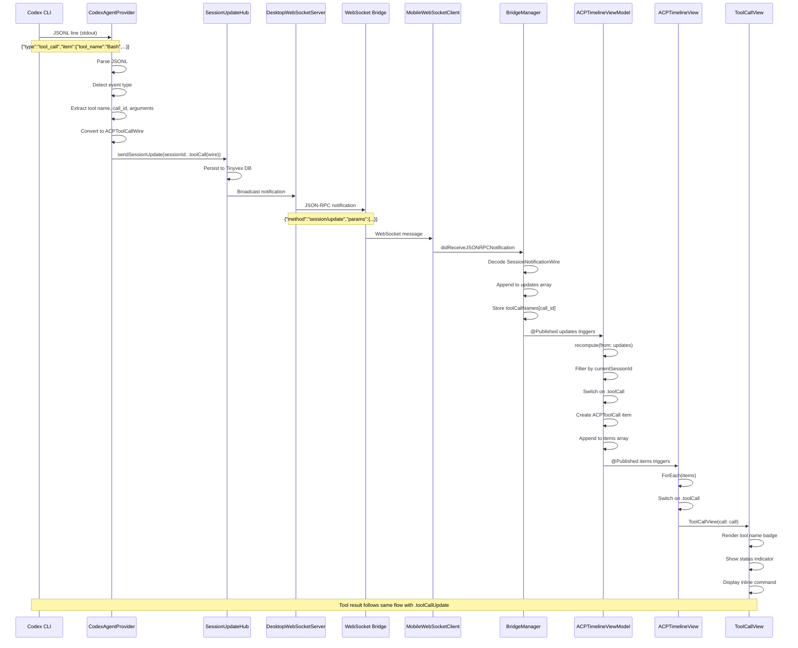

# Tool Call Data Flow: Codex → iOS Timeline

This document describes the complete data flow for tool call events from the Codex CLI through the WebSocket bridge to iOS timeline rendering.

## Overview Diagram



## Detailed Step-by-Step Flow

### 1. Codex CLI Output (JSONL)

**What happens:** Codex CLI executes a tool (e.g., Bash command) and outputs a JSONL event to stdout.

**Example output:**
```json
{"type":"tool_call","item":{"id":"tool_abc123","tool_name":"Bash","arguments":{"command":["ls","-la"]}}}
```

**Files involved:**
- External: Codex CLI binary (OpenAI's agent)

---

### 2. CodexAgentProvider Receives Line

**What happens:** The CLI agent provider reads the stdout line from the Codex process.

**File:** `ios/OpenAgentsCore/Sources/OpenAgentsCore/Agents/CodexAgentProvider.swift`
- **Line 87-91:** `processStdoutLine()` method signature
- **Line 93-96:** Parse JSONL to dictionary
- **Line 98-99:** Extract event type from `obj["type"]` or `obj["event"]`

**Code:**
```swift
public override func processStdoutLine(
    _ line: String,
    sessionId: ACPSessionId,
    updateHub: SessionUpdateHub
) async {
    guard let data = line.data(using: .utf8),
          let obj = try? JSONSerialization.jsonObject(with: data) as? [String: Any] else {
        return
    }
    let type = ((obj["type"] as? String) ?? (obj["event"] as? String) ?? "").lowercased()
```

---

### 3. Event Type Detection

**What happens:** CodexAgentProvider extracts the payload container and determines the specific event type.

**File:** `ios/OpenAgentsCore/Sources/OpenAgentsCore/Agents/CodexAgentProvider.swift`
- **Line 112-114:** Extract `item`, `msg`, or `payload` container
- **Line 117:** Check if `itemType == "tool_call"` or `type == "tool_call"`

**Code:**
```swift
let item = (obj["item"] as? [String: Any]) ?? (obj["msg"] as? [String: Any]) ?? (obj["payload"] as? [String: Any])
let itemType = ((item?["type"] as? String) ?? "").lowercased()

if itemType == "tool_call" || type == "tool_call" {
```

---

### 4. Extract Tool Call Data

**What happens:** Parse tool name, call ID, and arguments from the JSONL event.

**File:** `ios/OpenAgentsCore/Sources/OpenAgentsCore/Agents/CodexAgentProvider.swift`
- **Line 118-120:** Extract `tool_name`, `call_id`, `arguments`
- **Line 122-130:** Convert arguments dict to `AnyEncodable` dict via JSON round-trip

**Code:**
```swift
let toolName = (item?["tool_name"] as? String) ?? (item?["tool"] as? String) ?? "tool"
let callId = (item?["id"] as? String) ?? (item?["call_id"] as? String) ?? UUID().uuidString
let argsDict = (item?["arguments"] as? [String: Any]) ?? (item?["args"] as? [String: Any]) ?? [:]

var argsAEDict: [String: AnyEncodable]? = nil
if !argsDict.isEmpty {
    if let jsonData = try? JSONSerialization.data(withJSONObject: argsDict),
       let decoded = try? JSONDecoder().decode([String: AnyEncodable].self, from: jsonData) {
        argsAEDict = decoded
    }
}
```

**AnyEncodable type:** `ios/OpenAgentsCore/Sources/OpenAgentsCore/AgentClientProtocol/agent.swift:140`

---

### 5. Create ACPToolCallWire

**What happens:** Construct the ACP-compliant wire format for tool calls.

**File:** `ios/OpenAgentsCore/Sources/OpenAgentsCore/Agents/CodexAgentProvider.swift`
- **Line 132-136:** Create `ACPToolCallWire` instance

**Wire type definition:** `ios/OpenAgentsCore/Sources/OpenAgentsCore/AgentClientProtocol/tool_call.swift:7-18`

**Code:**
```swift
let wire = ACPToolCallWire(
    call_id: callId,
    name: toolName,
    arguments: argsAEDict
)
```

**Wire structure:**
```swift
public struct ACPToolCallWire: Codable {
    public var call_id: String
    public var name: String
    public var arguments: [String: AnyEncodable]?
    public var _meta: [String: AnyEncodable]? = nil
}
```

---

### 6. Send SessionUpdate to Hub

**What happens:** Send the tool call as a typed SessionUpdate to the SessionUpdateHub.

**File:** `ios/OpenAgentsCore/Sources/OpenAgentsCore/Agents/CodexAgentProvider.swift`
- **Line 137-140:** Call `sendSessionUpdate()` with `.toolCall(wire)`

**SessionUpdate enum:** `ios/OpenAgentsCore/Sources/OpenAgentsCore/AgentClientProtocol/client.swift:254-333`
- **Line 261:** `.toolCall(ACPToolCallWire)` case

**Code:**
```swift
await updateHub.sendSessionUpdate(
    sessionId: sessionId,
    update: .toolCall(wire)
)
```

---

### 7. SessionUpdateHub Persistence

**What happens:** The hub persists the update to Tinyvex DB and broadcasts to connected clients.

**File:** `ios/OpenAgentsCore/Sources/OpenAgentsCore/DesktopBridge/SessionUpdateHub.swift`
- **Line 48-79:** `sendSessionUpdate()` method
- **Line 60-61:** Encode update to JSON
- **Line 64-69:** Persist to Tinyvex if attached
- **Line 72-77:** Broadcast notification to all active clients

**Code:**
```swift
public func sendSessionUpdate(
    sessionId: ACPSessionId,
    update: ACP.Client.SessionUpdate
) async {
    // Encode update
    guard let updateData = try? JSONEncoder().encode(update),
          let updateJSON = String(data: updateData, encoding: .utf8) else { return }

    // Persist to Tinyvex
    if let db = tinyvexDb {
        try? await db.appendEvent(sessionId: sessionId.value, seq: nextSeq, ts: nowMs, updateJSON: updateJSON)
    }

    // Broadcast to clients
    let notification = ACP.Client.SessionNotificationWire(session_id: sessionId, update: update)
    await broadcast(notification: notification)
}
```

---

### 8. DesktopWebSocketServer Broadcast

**What happens:** Server receives notification from hub and sends JSON-RPC notification to iOS client.

**File:** `ios/OpenAgentsCore/Sources/OpenAgentsCore/DesktopBridge/DesktopWebSocketServer.swift`
- **Line 275-290:** `broadcast()` method (called by SessionUpdateHub)
- **Line 282-286:** Encode JSON-RPC notification
- **Line 288:** Send text to client via WebSocket

**JSON-RPC format:** `ios/OpenAgentsCore/Sources/OpenAgentsCore/Bridge/JSONRPC.swift:44-51`

**Code:**
```swift
private func broadcast(notification: ACP.Client.SessionNotificationWire) async {
    guard let client = activeClient else { return }

    if let out = try? JSONEncoder().encode(JSONRPC.Notification(method: ACPRPC.sessionUpdate, params: notification)),
       let jtext = String(data: out, encoding: .utf8) {
        client.send(text: jtext)
    }
}
```

**Wire format sent:**
```json
{
  "jsonrpc": "2.0",
  "method": "session/update",
  "params": {
    "session_id": "904F3D55...",
    "update": {
      "sessionUpdate": "tool_call",
      "tool_call": {
        "call_id": "tool_abc123",
        "name": "Bash",
        "arguments": {"command": ["ls", "-la"]}
      }
    }
  }
}
```

---

### 9. WebSocket Transport

**What happens:** JSON-RPC notification travels over WebSocket connection from macOS to iOS.

**Files involved:**
- Server: `ios/OpenAgentsCore/Sources/OpenAgentsCore/DesktopBridge/DesktopWebSocketServer.swift`
  - Uses `Network.framework` NWConnection
- Client: `ios/OpenAgentsCore/Sources/OpenAgentsCore/MobileBridge/MobileWebSocketClient.swift`
  - Uses `Network.framework` NWConnection

**Bridge config:** `ios/OpenAgentsCore/Sources/OpenAgentsCore/Bridge/BridgeConfig.swift`
- Default port: 9099
- Service type: `_openagents._tcp`

---

### 10. MobileWebSocketClient Receives Message

**What happens:** iOS WebSocket client receives and parses the JSON-RPC notification.

**File:** `ios/OpenAgentsCore/Sources/OpenAgentsCore/MobileBridge/MobileWebSocketClient.swift`
- **Line ~130-180:** `receiveLoop()` reads WebSocket messages
- **Line ~160-170:** Parses JSON-RPC envelope
- **Line ~175:** Detects `method == "session/update"`
- **Line ~180:** Calls delegate method `didReceiveJSONRPCNotification`

**Code:**
```swift
if let method = dict["method"] as? String, method == ACPRPC.sessionUpdate {
    self.delegate?.mobileWebSocketClient(self, didReceiveJSONRPCNotification: method, payload: dict)
}
```

---

### 11. BridgeManager Processes Notification

**What happens:** BridgeManager decodes the SessionNotificationWire and appends to updates array.

**File:** `ios/OpenAgents/Bridge/BridgeManager.swift`
- **Line 183-265:** `didReceiveJSONRPCNotification()` delegate method
- **Line 189-193:** Extract params and decode SessionNotificationWire
- **Line 206-211:** Handle `.toolCall` case
- **Line 241-246:** Handle `.toolCall` case (also appends to updates)
- **Line 207:** Store tool name in `toolCallNames[call_id]`

**Code:**
```swift
case .toolCall(let call):
    // Remember tool name for subsequent tool_call_update rows
    self.toolCallNames[call.call_id] = call.name
    // Also add to updates array so timeline views can render initial tool call
    if self.updates.count >= 200 { self.updates.removeFirst(); adjustIndicesAfterPopFront() }
    self.updates.append(note)
```

**Published property:** `@Published private(set) var updates: [ACP.Client.SessionNotificationWire] = []`

---

### 12. ACPTimelineViewModel Recomputes

**What happens:** ViewModel observes `@Published updates` and recomputes timeline items.

**File:** `ios/OpenAgents/Views/ACPTimelineViewModel.swift`
- **Line 40-45:** Combine sink on `bridge.$updates`
- **Line 44:** Calls `recompute(from: updates, currentSession: bridge.currentSessionId)`
- **Line 58-130:** `recompute()` method
- **Line 64-70:** Filter updates by current session
- **Line 91-107:** Handle `.toolCall` case

**Code:**
```swift
bridge.$updates
    .receive(on: DispatchQueue.main)
    .sink { [weak self] updates in
        guard let self = self else { return }
        self.recompute(from: updates, currentSession: bridge.currentSessionId)
    }
    .store(in: &cancellables)

// In recompute():
case .toolCall(let wire):
    if !seenCalls.contains(wire.call_id) {
        seenCalls.insert(wire.call_id)
        let argsJV: JSONValue = wire.arguments.map { dict in
            var out: [String: JSONValue] = [:]
            for (k, v) in dict {
                out[k] = v.toJSONValue()
            }
            return JSONValue.object(out)
        } ?? .object([:])
        let call = ACPToolCall(id: wire.call_id, tool_name: wire.name, arguments: argsJV, ts: monoMs)
        if wire.name.lowercased() != "todowrite" {
            out.append(.toolCall(call))
        }
    }
```

**Item type:** `enum Item` at line 9-26
- `.toolCall(ACPToolCall)` case at line 11

---

### 13. ACPTimelineView Renders

**What happens:** View observes `@Published items` and renders each item in a LazyVStack.

**File:** `ios/OpenAgents/Views/ACPTimelineView.swift`
- **Line 12-26:** ForEach loop over items
- **Line 14-20:** Switch on item type
- **Line 18-20:** Handle `.toolCall` case

**Code:**
```swift
ForEach(items) { item in
    switch item {
    case .message(let role, let text, _):
        MessageRow(role: role, text: text)
            .id(item.id)
    case .toolCall(let call):
        ToolCallView(call: call, result: findResult(for: call))
            .id(item.id)
    case .toolResult:
        EmptyView()
    }
}
```

**Helper:** Line 38-45 `findResult(for:)` - Matches tool results to tool calls by `call_id`

---

### 14. ToolCallView Renders UI

**What happens:** Dedicated tool call component renders the tool name, status, and expandable details.

**File:** `ios/OpenAgents/ACP/Renderers/ToolCallView.swift`
- **Line 1-250+:** Complete ToolCallView implementation
- **Line 50-80:** Badge with tool name
- **Line 85-120:** Status indicator (pending/completed/error)
- **Line 125-175:** Inline command display (for Bash tools)
- **Line 180-220:** Detail sheet with full output

**Visual components:**
- Tool name badge (e.g., "Bash", "Read", "Write")
- Status circle: ⏳ pending → ✅ completed / ❌ error
- Inline command preview for shell tools
- Tap to expand full output in sheet

**ACPToolCall type:** `ios/OpenAgents/ACP/ACPCommon.swift` (internal representation used by views)

---

## Tool Result Flow

Tool results follow the same flow with these differences:

**Step 2-5:** CodexAgentProvider detects `tool_result` event type
- **File:** `CodexAgentProvider.swift:141-171`
- Creates `ACPToolCallUpdateWire` instead of `ACPToolCallWire`
- Maps `ok: Bool` → `status: .completed` or `.error`
- Includes `output: AnyEncodable?` and `error: String?`

**Step 12:** ACPTimelineViewModel handles `.toolCallUpdate`
- **File:** `ACPTimelineViewModel.swift:108-121`
- Creates `ACPToolResult` item
- Appends to items array

**Step 13:** ACPTimelineView skips rendering `toolResult` items
- **File:** `ACPTimelineView.swift:22-24`
- Returns `EmptyView()` for tool results
- Results are shown via `findResult(for:)` helper that passes result to ToolCallView

**Step 14:** ToolCallView displays result in same card
- Status updates from pending → completed
- Output shown in detail sheet when tapped

---

## Key Files Reference

### Core Translation Layer
- **CodexAgentProvider:** `ios/OpenAgentsCore/Sources/OpenAgentsCore/Agents/CodexAgentProvider.swift`
- **CodexAcpTranslator:** `ios/OpenAgentsCore/Sources/OpenAgentsCore/Translators/CodexAcpTranslator.swift` (used for historical sessions)

### ACP Protocol Types
- **ACPToolCallWire:** `ios/OpenAgentsCore/Sources/OpenAgentsCore/AgentClientProtocol/tool_call.swift:7`
- **ACPToolCallUpdateWire:** `ios/OpenAgentsCore/Sources/OpenAgentsCore/AgentClientProtocol/tool_call.swift:20`
- **SessionUpdate enum:** `ios/OpenAgentsCore/Sources/OpenAgentsCore/AgentClientProtocol/client.swift:254`

### Bridge Infrastructure
- **SessionUpdateHub:** `ios/OpenAgentsCore/Sources/OpenAgentsCore/DesktopBridge/SessionUpdateHub.swift`
- **DesktopWebSocketServer:** `ios/OpenAgentsCore/Sources/OpenAgentsCore/DesktopBridge/DesktopWebSocketServer.swift`
- **MobileWebSocketClient:** `ios/OpenAgentsCore/Sources/OpenAgentsCore/MobileBridge/MobileWebSocketClient.swift`
- **BridgeManager:** `ios/OpenAgents/Bridge/BridgeManager.swift`

### iOS UI Layer
- **ACPTimelineViewModel:** `ios/OpenAgents/Views/ACPTimelineViewModel.swift`
- **ACPTimelineView:** `ios/OpenAgents/Views/ACPTimelineView.swift`
- **ToolCallView:** `ios/OpenAgents/ACP/Renderers/ToolCallView.swift`

---

## Related Documentation

- [Agent Client Protocol (ACP)](../adr/0002-agent-client-protocol.md) - ADR-0002
- [iOS ↔ Desktop WebSocket Bridge](../adr/0004-ios-desktop-bridge.md) - ADR-0004
- [Bridge Protocol Specification](./README.md) - JSON-RPC methods and pairing
- [Issue #1427](https://github.com/OpenAgentsInc/openagents/issues/1427) - ACP Timeline Implementation

---

## Debugging Tips

### Enable Verbose Logging

**macOS (Server):**
```swift
// CodexAgentProvider.swift:99
print("[Codex] Event: \(type)")  // Already present

// SessionUpdateHub.swift:73
print("[SessionUpdateHub] Broadcasting update for session \(sessionId.value)")
```

**iOS (Client):**
```swift
// BridgeManager.swift:241
print("[Bridge] Tool call received: \(call.name) id=\(call.call_id)")

// ACPTimelineViewModel.swift:94
print("[Timeline] Adding tool call: \(wire.name)")
```

### Common Issues

**Tool calls not appearing:**
1. Check Codex is outputting JSONL (look for `{"type":"tool_call",...}` in server logs)
2. Verify WebSocket connection active (`bridge.isConnected == true`)
3. Confirm session IDs match between macOS and iOS
4. Check `bridge.updates` array contains `.toolCall` events

**Tool calls appearing but not rendering:**
1. Verify `ACPTimelineViewModel.items` contains `.toolCall` entries
2. Check session filter in `recompute()` isn't excluding events
3. Ensure `ToolCallView` component is imported and available

---

**Last Updated:** 2025-11-08
**Commit:** 6e42b4d6
