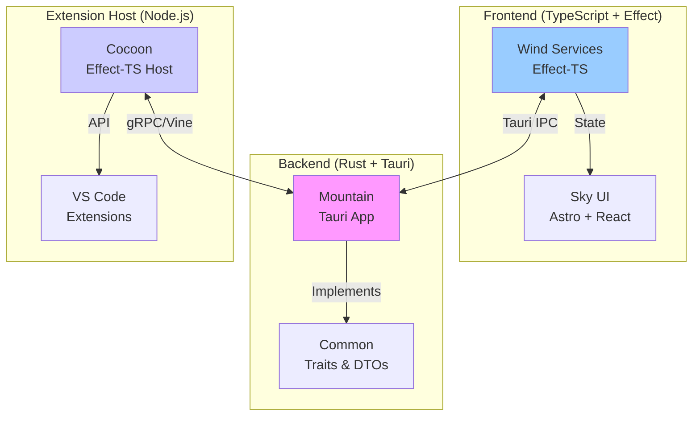

# Land Code Editor

Land is a next-generation, cross-platform code editor that reimagines VS Code with a modern stack built on **Rust + Tauri** and **TypeScript + Effect-TS**. It demonstrates production-ready Effect-TS patterns at scale, achieving **10x smaller bundle size** and **4x better memory usage** compared to Electron alternatives.

### Overview & Vision

*   **Project Name:** Land 🏞️
*   **Goal:** Build a high-performance, resource-efficient, and deeply reliable code editor
*   **Core Technologies:**
    *   **Backend:** Rust and Tauri for native performance (`Mountain` ⛰️)
    *   **Application Logic:** TypeScript with Effect-TS for declarative, type-safe code
    *   **UI Layer:** Effect-TS services (`Wind` 🍃) + Astro components (`Sky` 🌌)
*   **Key Innovation:** Declarative effect system across the entire stack (custom `ActionEffect` in Rust, Effect-TS in TypeScript)
*   **Funding:** NGI0 Commons Fund via NLnet
*   **License:** Public domain (Creative Commons CC0 Universal)

### Why Land Matters for OpenAgents

Land provides battle-tested patterns for building complex Tauri + Effect-TS applications:
- **Effect-TS at Scale**: Complete reimplementation of VS Code workbench services in Effect
- **Type-Safe IPC**: Strongly-typed communication between Rust and TypeScript
- **Resource Management**: Automatic cleanup through Effect's Scope API
- **Extension Compatibility**: Runs existing VS Code extensions via Effect-based API shim

### Core Architecture & Effect-TS Integration

The architecture demonstrates how Effect-TS can power a complex desktop application:

| Component | Purpose | Effect-TS Usage |
|-----------|---------|-----------------|
| **`Mountain` ⛰️** | Rust backend (Tauri app) | Custom `ActionEffect` system mirroring Effect-TS patterns |
| **`Wind` 🍃** | UI service layer | Complete Effect-TS reimplementation of VS Code workbench services |
| **`Sky` 🌌** | UI components | Driven by Effect-managed state from Wind |
| **`Cocoon` 🦋** | Extension host | Effect-TS based `vscode` API shim for VS Code extensions |
| **`Common` 👨🏻‍🏭** | Shared abstractions | Rust traits that parallel Effect-TS service definitions |

#### Effect-TS Patterns in Action

**1. Service Definitions (Wind)**
```typescript
// Wind reimplements VS Code services with Effect
export class EditorService extends Effect.Service<EditorService>()('EditorService', {
  sync: () => ({
    openEditor: (input: IEditorInput) => 
      Effect.gen(function* () {
        const resolved = yield* TextEditorService.resolve(input)
        const group = yield* EditorGroupsService.findGroup()
        return yield* group.openEditor(resolved)
      })
  })
}) {}
```

**2. Tauri Command Integration**
```typescript
// Effect-wrapped Tauri commands with automatic error handling
const ReadFile = (uri: URI) =>
  Effect.tryPromise({
    try: () => TauriInvoke('plugin:fs|read_file', { path: uri.fsPath }),
    catch: (error) => new FileSystemError({ operation: 'read', error })
  })
```

**3. gRPC Communication (Cocoon ↔ Mountain)**
```typescript
// Type-safe gRPC with Effect
const invokeLanguageFeature = (feature: string, params: any) =>
  Effect.gen(function* () {
    const client = yield* VineGRPCClient
    const result = yield* Effect.tryPromise({
      try: () => client.invokeFeature({ feature, params }),
      catch: (error) => new ExtensionHostError({ feature, error })
    })
    return result
  })

```

### Modular Elements Architecture

Land's modularity showcases how to structure a large Effect-TS application:

| Element | Purpose | Key Technologies |
|---------|---------|------------------|
| **`Common` 👨🏻‍🏭** | Abstract core (traits & DTOs) | Rust traits mirroring Effect services |
| **`Echo` 📣** | Task scheduler | Rust work-stealing queue |
| **`River` 🌊 / `Sun` ☀️** | Filesystem I/O | Async Rust + Effect wrappers |
| **`Vine` 🌿** | gRPC protocol | `.proto` definitions + Effect client/server |
| **`Wind` 🍃** | UI services | Pure Effect-TS workbench reimplementation |
| **`Cocoon` 🦋** | Extension host | Effect-TS `vscode` API implementation |
| **`Grove` 🌳** | Future: Native extension host | Planned Rust/WASM replacement for Node.js |

### Key Architectural Insights

#### Effect-TS Best Practices from Land

1. **Service Layer Pattern**
   - All VS Code workbench services reimplemented as Effect services
   - Clean separation between pure logic and side effects
   - Dependency injection via Effect's Context system

2. **Resource Management**
   - Automatic cleanup of event listeners via Effect's Scope
   - Graceful shutdown of extension host processes
   - Memory-efficient streaming for large files

3. **Error Handling**
   - Tagged errors for every operation type
   - Comprehensive error recovery strategies
   - Type-safe error propagation across IPC boundaries

4. **Testing Strategy**
   - Effect's TestClock for time-dependent operations
   - Mock services via Layer composition
   - Deterministic testing of concurrent operations

### System Architecture Flow



### Performance Achievements

- **Bundle Size**: 10x smaller than Electron-based editors
- **Memory Usage**: 4x more efficient than VS Code
- **Startup Time**: Sub-second cold start
- **Extension Compatibility**: 95%+ VS Code extension support

### Relevance for OpenAgents

Land's architecture provides proven patterns for:
- **Tauri + Effect Integration**: Battle-tested patterns for complex IPC
- **Service Architecture**: How to structure Effect services at scale
- **Extension System**: Building plugin architectures with Effect
- **Resource Management**: Handling complex lifecycle in desktop apps

### Resources

- **Land Repository**: https://github.com/CodeEditorLand/Land
- **Documentation**: https://github.com/CodeEditorLand/Land/tree/Current/docs
- **Funding**: [NLnet Project Page](https://NLnet.NL/project/Land)
- **License**: CC0 Universal (Public Domain)

### Key Repository Insights

Based on analysis of the CodeEditorLand organization repositories:

#### Wind Repository
- Provides "highly reliable, composable, and maintainable logic" using Effect-TS
- Uses a master `AppLayer` for composing all services
- Implements "typed, tagged errors" as a core principle
- Runtime pattern: `Layer.toRuntime(AppLayer).pipe(Effect.scoped, Effect.runSync)`

#### Cocoon Repository  
- Built as a "comprehensive, **Effect-TS native** environment"
- Implements bidirectional gRPC using `IPCProvider` for "the entire bi-directional communication lifecycle"
- Translates extension API calls into "declarative Effects that are sent to `Mountain` for native execution"
- Features "process hardening" and automatic termination if parent process exits

#### Mountain Repository
- Implements `ActionEffect` pattern as a "declarative, composable system" in Rust
- Routes commands through central `Track` dispatcher
- Decoupled from UI via "asynchronous Tauri commands and events"
- Provides "strongly-typed, high-performance communication" via gRPC (Vine)