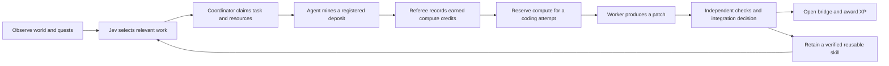

# Minecraft guilds

Status: proposed application specification, 2026-09-21. These documents do not
describe a shipped Minecraft integration. Research starts from remote `main` at
`4ccfb441909b1fe49bf682779a0e5a94d47d0d57`; the
[delivery review](delivery-and-sources.md) records the final upstream refresh.

Build a small Minecraft world where two guilds of agents mine resources, allocate
earned compute, coordinate over Nostr, and complete real coding quests. Jev helps
interpret requests, choose relevant skills, and match work to agents. Rust owns
execution, budgets, verification, and the game rules. Successful work changes
the world and earns attributable experience.

The first scene is a guild foundry: two camps, a nearby iron quarry, a more
valuable diamond deposit, a forge, and a broken bridge. Mining funds an attempt
to repair a small Rust program. A verified repair opens the bridge. A spectator
can inspect who requested the work, which agent performed it, what compute it
consumed, and why the result was accepted.

This makes Minecraft both an environment agents act in and a readable view of
their work. It supplies terrain, bodies, navigation, and multiplayer before we
build a custom 3D surface. The reusable product is the agent and protocol
integration beneath it.

## Read the specifications

| Document | Decision it makes |
| --- | --- |
| [Experience](experience.md) | What belongs in Minecraft, the guild loop, and what to leave out |
| [Architecture](architecture.md) | Rust components, world observations, authority, and recovery |
| [Protocol profile](protocols.md) | A concrete role for every OpenAgents NIP and selected official and Block NIPs |
| [Economy and reputation](economy.md) | Mining credits, compute reservations, XP, and resistance to reward farming |
| [Agents and learning](agents-and-learning.md) | Jev functions, the Voyager loop, skill reuse, and later optimization |
| [Coding quests](coding-quests.md) | Real code changes, independent verification, and world effects |
| [September 22 demo](demo-2026-09-22.md) | The critical path, recording sequence, acceptance evidence, and fallbacks |
| [Evaluation](evaluation.md) | Throughput, learning, economics, and failure experiments |
| [Delivery and sources](delivery-and-sources.md) | Implementation slices, current gaps, source inventory, and design provenance |

## The loop

Mining allocates a finite, operator-funded budget. It does not create provider
capacity or money. A compute credit is a game accounting unit; an LLM token is a
provider usage unit. Display them separately. Earn XP for accepted contributions,
not for spending tokens or generating events.

## First decisions

- Start with four agents in two guilds, a neutral verifier, and one spectator.
  Give each guild the same seed allowance, tools, model access, and quest base.
- Use signed Nostr messages for actual coordination. Guild chat alone is not a
  task lease, execution authorization, or settlement receipt.
- Keep detailed code, diffs, tests, and protocol inspection in a companion
  terminal. Put a small number of understandable objects and status cards in
  Minecraft.
- Use a curated arena and bounded skills before open-ended survival or an
  automatic curriculum. Preserve a clear path to the full Voyager experiment.
- Cover every new OpenAgents NIP in the architecture. Claim a NIP in a demo only
  when the exercised implementation and retained evidence support that claim.
- Keep credits nontransferable and nonredeemable in the first version. Defer
  payments, public admission, PvP, and a player-operated economy.

## Relationship to existing work

[Issue #9528](https://github.com/OpenAgentsInc/openagents/issues/9528) proposes a
Rust Voyager implementation. This profile adds multiplayer coordination,
resource allocation, and coding quests around that direction. It does not make
the issue's deferred multiplayer work a prerequisite for its single-agent
research baseline, or claim that baseline already exists.

The retained [episode 036](../transcripts/036.md) supplies the original Voyager
connection. [Episode 284](../transcripts/284.md) connects coding, games, and
earned progression. [Episode 286](../transcripts/286.md) motivates the newer
context, policy, coordination, evaluation, and optimization contracts. The
[source review](delivery-and-sources.md) explains what this design carries
forward from CoderQuest and what it deliberately leaves behind.

## Meaning of requirements

Requirements here apply to the proposed Minecraft profile. They do not extend
the normative wire schemas under [OpenAgents NIPs](../../nips/openagents/README.md).
New Minecraft records described below are application records, not newly
allocated Nostr kinds or already registered schemas. Implementations must add
versioned schemas and fixtures before claiming interoperability.

The September 22 recording is a target, not evidence of completion. No model
calls, Minecraft sessions, load tests, or monetary operations were performed to
write these specifications.
