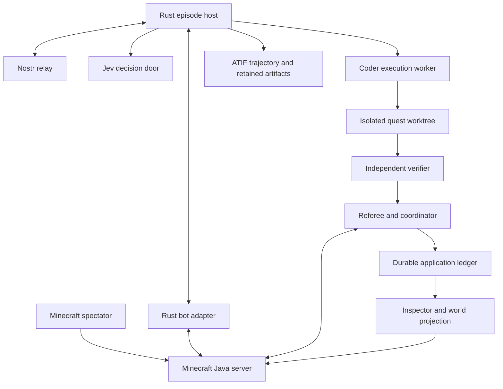

# Runtime and authority

Status: proposed. This is an application of the existing agent contracts, not a
second general-purpose agent runtime.

## Component boundary

The Minecraft server owns blocks, entities, inventories, and world time. The
referee owns application awards and coordinates claims. The inference service
owns its admission and usage receipts. The verifier owns test evidence. The
projection owns none of these facts.

One Rust process may host the referee, coordinator, and ledger initially. Keep
their interfaces separate and make their shared transaction boundary explicit.
There is one active coordinator per arena scope. Nostr distributes signed
records; it is not a consensus database or a substitute for that coordinator.

## Implementation shape

Follow the proposed `crates/voyager` split in
[issue #9528](https://github.com/OpenAgentsInc/openagents/issues/9528): environment,
primitives, state, interpretation, skills, curriculum, critic, and episode.
Add Minecraft-specific guild and quest adapters around shared Coder contracts.
Choose final crate boundaries in the first implementation slice; these names do
not assert that the files already exist.

Reuse `crates/nostr` for events and verification, `crates/jev` for decisions,
`crates/atif` for trajectories, `crates/capability` for trusted bindings,
`crates/supervise` for subprocesses, and Coder's execution boundary for code.
Use the existing gateway and tenancy admission where applicable. An application
credit balance must never bypass a service's own quota or door authorization.

Product code stays Rust. The externally supplied Java server is a supervised
dependency, not permission to write a second product runtime in Java or
JavaScript. Do not introduce Mineflayer, a Node bridge, or a TypeScript dashboard.
Map assets and server configuration are data. Any executable map scripting needs
an explicit implementation decision under the repository's language contract.

### Resolve compatibility first

The workspace pins Rust 1.97.1. The inspected
[Azalea revision](https://github.com/azalea-rs/azalea/tree/b65fa8cf1bb957976cefa926b9b500d44767d806)
uses nightly and describes Minecraft 26.2 support. This is a compatibility risk,
not a selected dependency or a claim that the current workspace can build it.

The first spike must select and record a working client revision, server version
and checksum, Java runtime, Rust toolchain, and host platform. Prefer a compatible
client revision that builds under the workspace pin. If none meets the required
protocol, propose a separately built Rust adapter with an independently pinned
toolchain and a bounded process interface. Do not silently change the whole
workspace to nightly. A feature flag alone does not prove dependency isolation.

Prove join, observation, walk, break, inventory update, disconnect, cancellation,
and clean process exit before promising the video. No exact jar/client pair is
selected by this documentation change.

## Identity and trust

The operator's arena manifest binds the season, world snapshot, relay and group
identities, referee key, verifier key, guild roster, agent pubkeys, and Minecraft
player UUIDs. Resolve the UUID assigned by the configured server; never use a
display name as authority. Bind owner attestations separately from agent keys.

The first arena is controlled: known bots, a spectator who cannot alter the
world, no public player admission, and no agent access to server administration.
Record whether Minecraft authentication is online or a local test arrangement.
Local offline identities are not proof of ownership on a public server.

Keep signing keys, model credentials, and server control credentials outside
quest worktrees and generated skill processes. A guild's public messages contain
only information cleared for public disclosure. NIP-29 membership does not grant
filesystem access, inference spend, artifact decryption, or a task claim.

## The arena manifest

Before a run, retain a versioned, digested application manifest containing:

- Build revision, protocol source pins, dependency pins, world epoch and snapshot.
- Identities and explicit role bindings; the coordinator's initial generation.
- Registered deposits with location, block type, quantity, and award rule.
- Quest definitions, immutable base commits, checker digests, and world effects.
- Credit issuance cap, price schedule, provider budget, concurrency, deadlines,
  maximum repair rounds, and messaging limits.
- Model and decision-function identities, program and extension lock digests,
  trusted capability bindings, and allowed disclosure destinations.
- Persistence location, restart policy, recording mode, and stop conditions.

An epoch is a logical world incarnation, not a wall-clock timestamp. Restoring a
world snapshot requires a new epoch or reconciliation against the existing
ledger. It must not restore already spent provider funds.

### Initial bounds

Use the following provisional application limits for the first implementation.
The effective limit is always the smaller of this profile and the admitted
host, relay, or service limit. Change limits through a new manifest.

| Resource | Initial limit |
| --- | --- |
| Round | 10 minutes, followed by bounded reconciliation |
| Agents | Four active bodies; two guilds |
| Generation | One active attempt per guild, two across the arena |
| Repair | Four total generation rounds per quest, subject to remaining funds |
| Decisions | One active batch per agent; at most eight questions per batch |
| Decision state | 32 KiB UTF-8 after serialization |
| Guild chat | 1 KiB content; one message per agent per second, burst of three |
| World action | One effectful primitive per bot at a time; 30-second deadline |
| Semantic decision | 10-second deadline; late answers cannot authorize effects |
| Coding attempt | 120-second deadline including supervised cleanup allowance |
| Diagnostics | 64 KiB per output stream, with explicit truncation status |

Treat these as starting bounds, not measured latency goals. Record a refusal or
timeout when the profile is too small; do not silently widen it. A path requiring
more than one action deadline is a sequence of newly admitted bounded actions.
The real provider budget and per-call token limits remain required operator
configuration because they depend on the selected door and price schedule.

## Observe before deciding

Build a bounded world snapshot from server-confirmed observations: position,
health, hunger, equipment, relevant inventory, nearby registered deposits,
reachable stations, active quest, and current claims. Mark unseen chests and
unloaded chunks unknown. A client cache can lag the server.

Use the shared `openagents.observation.v1` contract for provenance and consistency.
Record the resource, adapter identity, capture time, provider revision when one
exists, and exact content digest. A bundle of observations is not automatically
an atomic world snapshot. An observational read cannot claim a compare-and-set
precondition the provider does not support.

NIP-CTX task frames assemble the evidence a decision needs. Recheck a chosen
action's location, claim, inventory, budget, and worker generation at dispatch.
Missing or stale material causes refresh, abstention, or refusal. A model answer
does not make an old observation current.

## World effects and mining evidence

For the controlled demo, the Rust referee can use an authenticated, private
server control connection to read vanilla server state and issue allowlisted
commands. Bots never receive that connection. Freeze the exact command grammar
against the selected server version in the compatibility spike.

Mining attribution must combine a registered deposit, a durable action intent,
the authorized actor, and server-confirmed changes. A possible vanilla-only
implementation compares per-player mined-block statistics and the registered
block state before and after a serialized action. It also verifies that no
other admitted actor could mine that deposit during the interval. Count types
separately, including deepslate variants if the map contains them.

This is evidence under a controlled-host trust model. Vanilla statistics alone
do not prove which coordinate a player mined. Inventory changes alone do not
prove mining at all. Ambiguous observations must not mint credits. A public or
adversarial arena needs a proven server-side block-break attribution interface;
that integration is a later prerequisite, not an assumed existing plugin.

The referee records intent before any world effect. For an opening gate, use an
idempotent target state such as a named gate being open, rather than an
unbounded command string. After a timeout, inspect the target and reconcile.
Do not repeat a destructive action just because its response was lost.

## Coordination and recovery

Use NIP-COORD claims for deposits, quest attempts, and shared integration targets.
An all-resource claim and its game-budget hold commit in one coordinator
transaction. Provider admission is a separate transaction: persist the local
intent, dispatch with stable identity, and reconcile its outcome. There is no
distributed atomic commit across the world, application store, and provider.

The dispatcher and integrator enforce claim epochs. Lease expiration is not
proof that an old process stopped. Keep a resource unavailable until the old
attempt is fenced, stopped, or reconciled. Scope a quest lease to a guild's copy
when both guilds may solve the same challenge independently.

Record the run with NIP-RUN's predecessor chain and controller generation. Treat
forked histories as a conflict. A head announcement is a discovery hint, not
authority to discard contradictory records. On restart:

1. Load the arena manifest, ledger, durable run, and all unsettled intents.
2. Reestablish server identity and verify the expected world epoch.
3. Query workers and service receipts using existing request/attempt identities.
4. Reconcile world effects and provider reservations; retain unknown holds.
5. Restore projections from records, then admit new work under the valid generation.

## Persistence and presentation

Use a proposed directory under `~/.openagents/minecraft/<season>/` for the
manifest, transaction journal, trace references, evidence, and replay cursor.
Finalize the concrete on-disk schema with migration and corruption tests. World
saves, build outputs, secrets, and bulky run artifacts stay out of Git.

Every avatar, quest card, forge effect, and XP change carries a `source_ref`
identifying its authoritative record and revision. Display an unavailable
reference honestly. Read cached snapshots plus ordered updates, deduplicate by
record identity, and rebuild after a gap. Replaying a chat or reconnecting an
inspector must not run a task or increment a balance.

Subprocesses run through [supervise](../coder/runtime/subprocesses.md). Bound
output, process groups, cancellation, and deadlines. Minecraft server lifecycle
ownership is explicit: attach to an operator-owned server or supervise a
demo-owned child, and terminate only the child the run owns.
