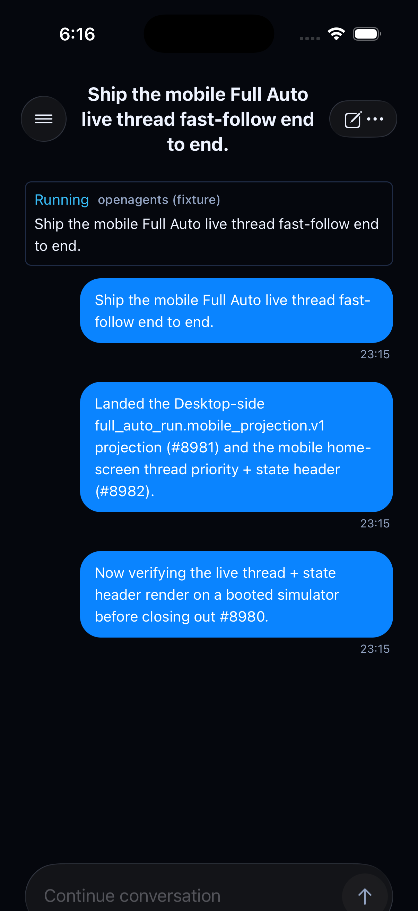

# OpenAgents mobile — Full Auto live thread first-screen verification (#8980, 2026-07-17)

Closeout observation evidence for the parent mobile epic **#8980**, covering
both landed halves of the feature: the Desktop-side
`full_auto_run.mobile_projection.v1` projection (#8981) and the mobile
home-screen thread priority + minimal state header (#8982,
`apps/openagents-mobile/src/screens/home-core.ts`,
`fullAutoRunHeaderForState`).

Prior to this, the feature was verified only at the unit-test level
(`apps/openagents-mobile/tests/full-auto-run-header.test.ts` and friends), not
on a booted app. This receipt is a real screenshot from a booted iOS
Simulator running the production `HomeScreen` / Effect Native render path.

## Simulator

- Xcode 26.5 toolchain, **iOS 26.5 Simulator, iPhone 17 Pro**
  (`2E5DFC26-DB79-4EE2-BF8E-2EB486A1AFBA`).
- Launched via this app's own established local-build path per
  `apps/openagents-mobile/README.md` ("Device / native builds" section):
  `expo prebuild --platform ios` (implicit via `expo run:ios`) + CocoaPods +
  `xcodebuild` — **not** `eas build`, per repo policy.

## Data source: fixture-seeded, NOT live cross-device sync

**This was fixture-seeded, not a live Desktop→server→mobile sync loop.**
Standing up a genuine live loop in this environment would have required a
signed-in GitHub OAuth session inside the iOS Simulator, a real Desktop Full
Auto run publishing to the production `openagents.com` API, and both
surfaces sharing one account's personal Sync scope — out of scope for a
same-session verification pass. Being explicit about this so the evidence is
not mistaken for more than it is.

Instead, the repo's own pre-existing, purpose-built fixture
(`apps/openagents-mobile/src/full-auto/full-auto-run-projection-fixture.ts`,
`fullAutoRunFixtureRunning` — written explicitly for "honestly-labeled manual
verification without needing a live Desktop Full Auto run") was used to drive
the **real, unmodified production `HomeScreen` component**
(`apps/openagents-mobile/src/screens/home-screen.tsx`) directly, bypassing
only the network/auth bootstrap in `src/app.tsx`. A temporary, uncommitted
harness (`src/dev-fixture-harness.tsx`, swapped in for one `index.tsx` line)
mounted `<HomeScreen>` with:

- `fullAutoRun`: the real fixture projection (`lifecycleState: "running"`,
  `objective`, `workspaceLabel: "openagents (fixture)"`), timestamps
  refreshed to "now" so it passes the real 10-minute
  `isFullAutoRunProjectionFresh` staleness gate honestly (same technique the
  unit test uses).
- `conversation`: a hand-built `{ mode: "sync", ... }` selection with an
  `activeThread` matching the fixture's `threadRef`, populated with 3
  messages, using the exact `ConfirmedChatThread` / `ConfirmedChatMessage`
  schemas from `packages/khala-sync-client/src/conversation.ts` — no invented
  shape.

No product code changed: `index.tsx` and `src/dev-fixture-harness.tsx` were
reverted/deleted after capture. `git status` on `apps/openagents-mobile` is
clean. This was verification-only.

## Result

The real Effect Native renderer produced the intended first-screen state:
the live-thread transcript (3 messages) with the state header rendered above
it, showing lifecycle label **"Running"** and workspace label
**"openagents (fixture)"**, plus the run objective, exactly matching
`fullAutoRunHeaderForState`'s contract.

## What this does and does not prove

- Proves: the real #8981/#8982 UI code renders correctly end-to-end against
  real-shaped projection + thread data on an actual booted simulator — not
  just a unit-test JSON assertion.
- Does not prove: a live Desktop→server→mobile sync loop, GitHub OAuth
  sign-in, or a physical-device network-gap receipt. Those remain open
  verification surfaces if the coordinator wants a fully live pass later.
