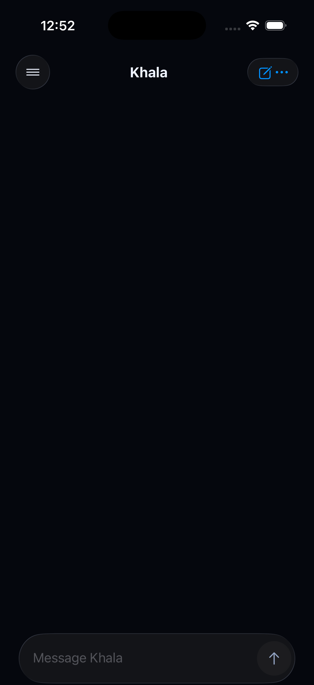

# OpenAgents mobile Sarah message voice OTA receipt

Date: 2026-07-19

## Outcome

The permanent `Listen · AI-generated voice` control is removed from Sarah's
conversation. Every eligible completed Sarah response now owns an exact
long-press action. The selected response alone shows a compact preparing,
playing, or failed row; long-pressing the active response stops it, and
selecting another response stops the prior clip before playback changes.

The same OTA explicitly restores native autocorrect in Sarah's composer.

## Publication identity

- Implementation commit: `2e4177fe643ccaeac734e1df2875bd2d043315e1`
- Changelog commit: `6133b9b747`
- Bundle tag: `2026-07-19.sarah-message-voice-11`
- Installed native target: OpenAgents iOS TestFlight `0.5.2 (123)`
- Runtime fingerprint: `68fd17c51f01bceaf5fc39bb7198db9c237e2bb4`
- Channel: `openagents-production`
- Cloud Run service/revision: `oa-updates` / `oa-updates-00119-kl8`
- Rollback revision: `oa-updates-00118-lz7`
- Update ID: `2787421e-be1b-4e2e-b4d9-4b9422b7dcbb`
- Launch asset: `index-ab075370da8c470a69438dabecdfe49e.hbc`
- Launch asset bytes: `6,516,608`
- Launch asset SHA-256 (base64url):
  `dLAMdJ95eJ3Mu8xV_EpfJ5ZmTroJYu57IJBiLXcmfwM`

Production routes 100% to the new ready revision. The signed Expo protocol v1
manifest returned HTTP 200 for the exact build-123 runtime and channel. The
launch asset returned HTTP 200 as `application/javascript`; its computed byte
length and SHA-256 matched the manifest. A deliberately mismatched runtime
returned `noUpdateAvailable`. The three Desktop RC compatibility documents
continued to return HTTP 200.

## Device evidence

The installed build-123 simulator fetched the production manifest and exact
launch asset, then recorded the new update with one successful launch and zero
failed launches in Expo Updates' native database. The record bound update ID
`2787421e-be1b-4e2e-b4d9-4b9422b7dcbb`, the exact runtime above, and the exact
launch asset above.

The simulator was signed out, so this screenshot proves deployed cold-launch
pixels and update health without manufacturing owner authentication. The
authenticated Sarah interaction is mechanically covered by the serializable
mobile view tree and React Native gesture tests; the owner's already
authenticated physical device is the production acceptance surface.

## Verification

- Mobile TypeScript check: passed
- Full mobile suite: 58 files, 290 tests passed
- React Native renderer TypeScript build: passed
- React Native renderer focused suite: 24 tests passed
- Root formatting/lint check: passed
- `oa-updates` strict test-typecheck coverage: passed (28 test roots)
- Pre-push policy and mobile release gate: passed
- OTA runtime fingerprint equality gate: passed
- Candidate and production launch-asset identity checks: passed
- Signed manifest and immutable asset verification: passed
- Runtime mismatch rejection: passed
- Desktop RC feed regression smoke: passed
- Installed simulator update download and successful launch: passed

The repository-wide test command that the `oa-updates` package script expands
to was not used as an admission gate: it surfaced existing unrelated spec/doc
snapshot failures, including the already-known AssuranceSpec golden mismatch.
The scoped update service typecheck, mobile release gates, exact candidate
verification, and production smokes are green.

## Attribution and authority

- Trigger kind: direct owner-requested production UX correction
- Trigger actor: authenticated owner
- Release actor role: operating agent and release operator
- Authority profile: `AUTHORITY.md` revision 5
- Program: `program.full_auto_release`
- Grant: `grant.autonomous_rc_release_and_communication`
- Issue: `#9013`
- Outcome: succeeded

This was a JavaScript-only, fingerprint-compatible mobile OTA. It did not
create a TestFlight binary, promote an App Store stable release, modify a
Desktop release, or move the signed Desktop update feed.
