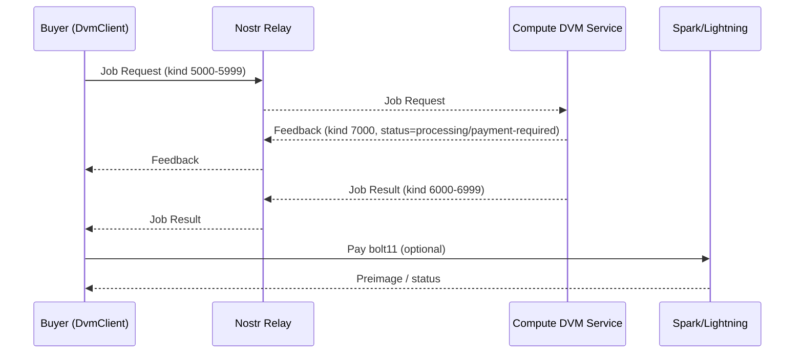
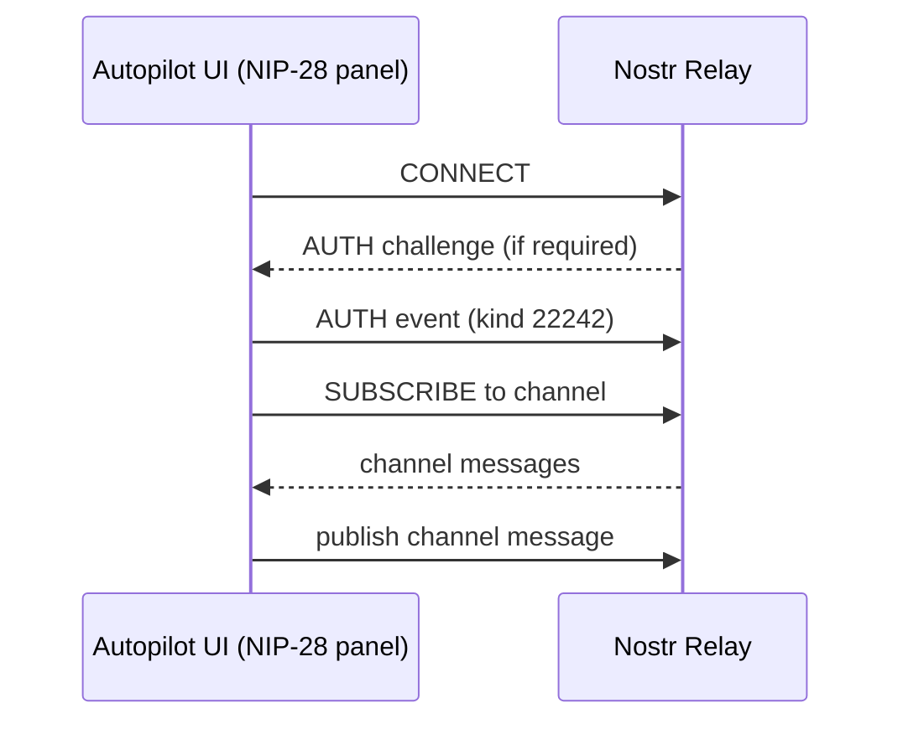
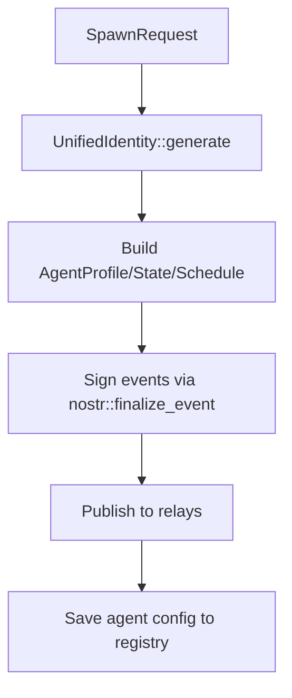

# Nostr Audit (OpenAgents)

- **Status:** Draft audit
- **Last verified:** 2026-01-27
- **Scope:** /Users/christopherdavid/code/openagents2 (this repo)
- **Source of truth:** code in `crates/*` (docs are secondary)
- **If this doc conflicts with code, code wins.**

## Why this doc exists

This is a deep inventory of all Nostr-related code, docs, and flows in this repo.
It is meant to support the upcoming Nostr UI work (keypair issuance, relay UX,
DVM flows, chat, and agent identity) and any CLI surface that needs to expose
Nostr commands.

## Other-branch context (for awareness)

There is a migration plan in a sibling repo:

- `/Users/christopherdavid/code/openagents/apps/autopilot-desktop/docs/migration/EFFUSE_TO_WGPUI_PLAN.md`
  currently points to `apps/autopilot-desktop/docs/migration/EFFUSE_TO_WGPUI_PLAN.md`.

This doc is not part of this repo, but it is relevant to ongoing UI work in main.

---

## Executive summary

- **Core Nostr protocol** lives in `crates/nostr/core/` with broad NIP coverage
  (files for NIP-01..NIP-99, NIP-C7, NIP-SA). It exposes event types, signing,
  NIP-06 key derivation, bech32 entities, encryption, chat, marketplace events,
  handler discovery, and NIP-90 DVM primitives.
- **Client-side networking** lives in `crates/nostr/client/` with relay pooling,
  reconnection, offline queueing, NIP-42 AUTH, NIP-65 outbox routing, and a
  dedicated DVM client for NIP-90 jobs.
- **NIP-90 DVM** is implemented end-to-end: protocol types in `nostr/core`,
  DVM client in `nostr/client`, DVM provider service in `crates/compute`,
  and product surfaces in `pylon`, `runtime`, `autopilot`, and `dsrs`.
- **NIP-SA** is specified and partially implemented: event kinds and helpers
  exist in `crates/nostr/core/src/nip_sa/`, spec in `crates/nostr/nips/SA.md`,
  and spawning logic lives in `crates/agent/src/spawner.rs`.
- **UI hooks** already exist in WGPUI and Autopilot for relay management,
  bech32 displays, NIP-28 chat, and NIP-90 job feeds.
- **CLI surfaces** today are primarily `pylon` (jobs, rlm, provider) and the
  Autopilot UI command palette (`/nip90`, `/nip28`). There is no single unified
  `openagents` CLI in this repo yet.
- **Gaps:** Nexus relay is referenced but not present in this repo, and
  NIP-SA lifecycle events are marked planned in protocol docs.

---

## Repo inventory by subsystem

### 1) Core Nostr protocol (`crates/nostr/core/`)

**Purpose:** canonical event types, NIP implementations, signing, crypto helpers.

Key files:
- Entry: `crates/nostr/core/src/lib.rs`
- NIP-01 events/signing: `crates/nostr/core/src/nip01.rs`
- NIP-06 keys/BIP39: `crates/nostr/core/src/nip06.rs`
- NIP-19 bech32 entities: `crates/nostr/core/src/nip19.rs`
- NIP-28 public chat: `crates/nostr/core/src/nip28.rs`
- NIP-34 Git primitives: `crates/nostr/core/src/nip34.rs`
- NIP-42 relay auth: `crates/nostr/core/src/nip42.rs`
- NIP-44 encryption: `crates/nostr/core/src/nip44.rs`
- NIP-57 zaps: `crates/nostr/core/src/nip57.rs`
- NIP-89 handler discovery: `crates/nostr/core/src/nip89.rs`
- NIP-90 DVM: `crates/nostr/core/src/nip90.rs`
- NIP-SA (Sovereign Agents): `crates/nostr/core/src/nip_sa/` (module root)
- Marketplace identity/payment types: `crates/nostr/core/src/identity.rs`,
  `crates/nostr/core/src/provider.rs`, `crates/nostr/core/src/payments.rs`
- Compute job types (marketplace): `crates/nostr/core/src/compute_job.rs`

**Coverage note:** there is a file per NIP for a wide range
(`nip01.rs` through `nip99.rs` plus `nipc7.rs` and `nip_sa/`).
These are not all used by the product surfaces yet.

**Features:**
- `full` (default): signing, crypto, BIP39, encryption.
- `minimal`: types/serialization only (relay/WASM).

---

### 2) Nostr client (`crates/nostr/client/`)

**Purpose:** relay networking, pool/queue, DVM client.

Key files:
- Relay connection + NIP-42 AUTH: `crates/nostr/client/src/relay.rs`
- Relay pool: `crates/nostr/client/src/pool.rs`
- Connection pool: `crates/nostr/client/src/connection_pool.rs`
- Outbox model (NIP-65): `crates/nostr/client/src/outbox.rs`
- Negentropy (NIP-77): `crates/nostr/client/src/negentropy.rs`
- Offline queue: `crates/nostr/client/src/queue.rs`
- DVM client (NIP-90): `crates/nostr/client/src/dvm.rs`

Important behavior:
- Relay queue defaults to `nostr_queue.db` in working directory unless
  `NOSTR_QUEUE_DB_PATH` is set. DVM client disables queue by default to avoid
  SQLite contention.
- NIP-42 AUTH is supported via `create_auth_event_template` and a relay AUTH
  handshake in `relay.rs`.

---

### 2.1) Non-Nostr relay crate (tunnel protocol)

`crates/relay/` is **not** a Nostr relay. It defines a tunnel protocol for
browser/worker/CLI communication (`openagents-relay`), distinct from Nostr.

---

### 3) Protocol schemas (`crates/protocol/`)

**Purpose:** typed OpenAgents job schemas (not direct Nostr, but what NIP-90
payloads represent in OpenAgents).

Key files:
- Job envelope traits + registry: `crates/protocol/src/jobs/mod.rs`
- Schemas: `crates/protocol/src/jobs/*.rs` (sandbox, rerank, embeddings, chunk analysis)
- Hashing/canonicalization: `crates/protocol/src/hash.rs`
- Verification modes: `crates/protocol/src/verification.rs`

These are the schema IDs referenced by `docs/protocol/PROTOCOL_SURFACE.md`.

---

### 4) Compute provider (DVM) (`crates/compute/`)

**Purpose:** NIP-90 provider implementation (sell compute), plus test harnesses.

Key files:
- DVM service: `crates/compute/src/services/dvm_service.rs`
- Relay adapter: `crates/compute/src/services/relay_service.rs`
- Domain jobs: `crates/compute/src/domain/*.rs` (patch_gen, sandbox_run, repo_index, code_review)
- UnifiedIdentity: `crates/compute/src/domain/identity.rs`

Notes:
- DVM service parses incoming NIP-90 job requests and emits JobResults, with
  optional payment gating.
- NIP-89 capability announcements are built in the DVM service.
- Tests cover end-to-end DVM flows (`crates/compute/tests/*`).

---

### 5) Pylon (node + CLI) (`crates/pylon/`)

**Purpose:** local node that can be provider and buyer of NIP-90 jobs.

Key files:
- Identity init (mnemonic -> npub): `crates/pylon/src/cli/init.rs`
- Job CLI (buyer): `crates/pylon/src/cli/job.rs`
- RLM job CLI: `crates/pylon/src/cli/rlm.rs`
- Provider orchestration: `crates/pylon/src/provider.rs`

Storage:
- `~/.openagents/pylon/identity.mnemonic` (plaintext, with 0600 perms on Unix)
- `~/.openagents/pylon/jobs.db` (NIP-90 job tracking)

---

### 6) Runtime (`crates/runtime/`)

**Purpose:** shared driver layer for Nostr inbox/outbox and DVM helpers.

Key files:
- Nostr driver (mentions + DMs): `crates/runtime/src/drivers/nostr.rs`
- DVM helpers + feedback parsing: `crates/runtime/src/dvm.rs`
- Signing service abstractions: `crates/runtime/src/identity.rs`
- NIP-90 compute provider (buyer side): `crates/runtime/src/compute/providers/dvm.rs`

Notes:
- Runtime driver subscribes to encrypted DMs and mentions and routes them
  into agent envelopes.
- Runtime compute provider maps internal `ComputeKind` to NIP-90 kinds and
  builds `JobRequest` tags before publishing.

---

### Nostr inbox routing (runtime driver)

File: `crates/runtime/src/drivers/nostr.rs`

- Subscribes to:
  - Encrypted DMs (`ENCRYPTED_DM_KIND`) for `#p` tag matches
  - Short text notes (`KIND_SHORT_TEXT_NOTE`) for mentions
- Routes inbound events into `RoutedEnvelope` payloads:
  - `nostr_dm` (decrypted if possible)
  - `nostr_mention`

---

### 7) Agent layer (`crates/agent/`)

**Purpose:** NIP-SA spawn + lifecycle management; agent registry by npub.

Key files:
- Spawner publishes NIP-SA events: `crates/agent/src/spawner.rs`
- Agent registry: `crates/agent/src/registry.rs`

NIP-SA docs:
- `crates/agent/docs/NIP-SA.md`
- `crates/agent/docs/SPAWNING.md`

---

### 8) DSPy / Swarm dispatch (`crates/dsrs/`)

**Purpose:** NIP-90 dispatch adapter used by Swarm/FRLM.

Key files:
- Swarm dispatcher: `crates/dsrs/src/adapter/swarm_dispatch.rs`
- Trace bridge: `crates/dsrs/src/trace/nostr_bridge.rs`

---

### 9) Autopilot UI (`crates/autopilot/`)

**Purpose:** surface NIP-90 jobs and NIP-28 chat in the UI.

Key files:
- NIP-90 panel: `crates/autopilot/src/app/nip90.rs`
- NIP-28 panel: `crates/autopilot/src/app/nip28.rs`
- DVM provider discovery: `crates/autopilot/src/app/dvm.rs`
- UI renderers: `crates/autopilot/src/app/ui/rendering/modals/nip90.rs`,
  `crates/autopilot/src/app/ui/rendering/modals/nip28.rs`,
  `crates/autopilot/src/app/ui/rendering/modals/dvm.rs`
- Command parsing: `crates/autopilot/src/commands.rs` (supports `/nip90`, `/nip28`)

---

### 10) WGPUI (Nostr-ready UI components) (`crates/wgpui/`)

UI primitives already exist for the Nostr UI:
- Bech32 entity display: `crates/wgpui/src/components/atoms/bech32_entity.rs`
- Relay status + rows: `crates/wgpui/src/components/atoms/relay_status.rs`,
  `crates/wgpui/src/components/molecules/relay_row.rs`
- Relay manager: `crates/wgpui/src/components/organisms/relay_manager.rs`
- Contact profile card: `crates/wgpui/src/components/molecules/contact_card.rs`
- DM thread UI: `crates/wgpui/src/components/organisms/dm_thread.rs`
- Zap UI: `crates/wgpui/src/components/molecules/zap_card.rs`,
  `crates/wgpui/src/components/organisms/zap_flow.rs`
- Agent profile card: `crates/wgpui/src/components/molecules/agent_profile_card.rs`

---

## Key flows (with diagrams)

### A) NIP-90 DVM flow (customer -> relay -> provider)

Implementation mapping:
- Job types + tags: `crates/nostr/core/src/nip90.rs`
- Client submission: `crates/nostr/client/src/dvm.rs`
- Provider handling: `crates/compute/src/services/dvm_service.rs`
- Buyer CLI: `crates/pylon/src/cli/job.rs`

---

### DVM provider service (compute) details

Highlights from `crates/compute/src/services/dvm_service.rs`:
- Subscribes broadly to NIP-90 job kinds and filters targeted jobs internally.
- Parses NIP-90 JobRequest tags (`JobRequest::from_event`).
- Supports OpenAgents job kinds (sandbox run, patch gen, code review, repo index).
- Emits JobFeedback (status, optional invoice) and JobResult events.
- Advertises capabilities via NIP-89 handler info (`KIND_HANDLER_INFO`).

---

### B) NIP-28 chat (Autopilot UI)

Implementation mapping:
- Chat types: `crates/nostr/core/src/nip28.rs`
- Relay connection: `crates/nostr/client/src/relay.rs`
- UI runtime loop: `crates/autopilot/src/app/nip28.rs`

---

### C) NIP-SA agent spawn + publish

Implementation mapping:
- Spawner: `crates/agent/src/spawner.rs`
- NIP-SA types: `crates/nostr/core/src/nip_sa/`

---

## Identity + keypair issuance

### UnifiedIdentity

The canonical identity model is `UnifiedIdentity` in:
- `crates/compute/src/domain/identity.rs`

It derives:
- Nostr keys via NIP-06 (BIP39 -> `m/44'/1237'/0'/0/0`)
- Spark wallet keys via BIP44

Bech32 helpers for display and export live in `crates/nostr/core/src/nip06.rs`
and `crates/nostr/core/src/nip19.rs` (npub/nsec encoding).

Surfaces:
- `pylon init`: `crates/pylon/src/cli/init.rs`
- Agent spawn: `crates/agent/src/spawner.rs`
- Runtime signer wrapper: `crates/runtime/src/identity.rs`

Security notes (current state):
- Mnemonics are stored in plaintext in several paths (with TODOs for encryption).
- Pylon uses file permissions `0600` on Unix.

---

## NIP-90 job kinds (current mapping)

Defined in `crates/nostr/core/src/nip90.rs`:

- Common kinds (NIP-90 spec)
  - 5000: text extraction/OCR
  - 5001: summarization
  - 5002: translation
  - 5050: text generation
  - 5100: image generation
  - 5250: speech-to-text

- OpenAgents extensions
  - 5930: sandbox run
  - 5931: repo index
  - 5932: patch generation
  - 5933: code review
  - 5940: RLM subquery (result kind 6940)

Result kinds are request kind + 1000, and feedback kind is 7000.

---

## NIP-90 tag schema (JobRequest / JobResult / JobFeedback)

**Implementation:** `crates/nostr/core/src/nip90.rs`

JobRequest tags:
- `["i", data, input_type, relay?, marker?]` for inputs (`text`, `url`, `event`, `job`)
- `["output", mime_type]` for expected output (optional)
- `["param", key, value]` for model parameters (optional, repeatable)
- `["bid", millisats]` for max bid (optional)
- `["relays", ...relay_urls]` for response relay hints
- `["p", provider_pubkey]` preferred providers (repeatable)
- `["encrypted"]` if params are encrypted in content

JobResult tags:
- `["request", json]` original request JSON (optional)
- `["e", request_event_id, relay?]` reference to request
- `["i", ...]` original inputs (optional)
- `["p", customer_pubkey]` request owner
- `["amount", millisats, bolt11?]` payment request (optional)
- `["status", "success"]` (default added by implementation)
- `["encrypted"]` if output is encrypted

JobFeedback tags:
- `["status", status, extra?]` where status is `payment-required|processing|error|success|partial`
- `["e", request_event_id, relay?]` reference to request
- `["p", customer_pubkey]` request owner
- `["amount", millisats, bolt11?]` optional payment request

Helpers:
- `create_job_request_event()` / `create_job_result_event()` /
  `create_job_feedback_event()` build `EventTemplate` for signing.
- `get_result_kind()` / `get_request_kind()` map request <-> result kinds.
- `JobRequest::from_event()` / `JobResult::from_event()` parse tags into structs.

---

## NIP-89 handler discovery

- Implementation: `crates/nostr/core/src/nip89.rs`
- DVM service announces capabilities such as `nip90-kind-5050` in
  `crates/compute/src/services/dvm_service.rs`
- Discovery helper: `nostr_client::dvm::discover_providers()`

Handler tags (kind 31990) as implemented:
- `["handler", "skill|agent|compute_provider"]`
- `["capability", "<capability>"]` (repeatable)
- `["price", "<amount_msats>", "<model?>", "<currency?>"]` (optional)
- custom tags (key/value pairs)

---

## Relay defaults + connectivity

Common defaults in code:
- `wss://nexus.openagents.com/` (Autopilot NIP-90 + NIP-28, Pylon config)
- `wss://relay.damus.io` and `wss://nos.lol` as common secondary relays
- Compute provider defaults: `crates/compute/src/services/relay_service.rs`
  includes `wss://nexus.openagents.com`, `wss://relay.damus.io`, `wss://nos.lol`

Relay connection stack:
- `nostr_client::RelayConnection` with reconnect, queue, and health metrics
- `nostr_client::RelayPool` for multi-relay publish/subscribe

---

## NIP-42 authentication

- NIP-42 helpers in `crates/nostr/core/src/nip42.rs`
- Relay side (client implementation): `crates/nostr/client/src/relay.rs`

Autopilot NIP-90/NIP-28 panels explicitly handle AUTH challenges.
Auth event details (kind 22242):
- Tags: `["relay", "<relay-url>"]`, `["challenge", "<challenge>"]`

---

## NIP-19 bech32 entities

Implemented in `crates/nostr/core/src/nip19.rs`:
- Simple entities: `npub`, `nsec`, `note`
- TLV entities: `nprofile`, `nevent`, `naddr`

UI display primitives live in `crates/wgpui/src/components/atoms/bech32_entity.rs`.

---

## NIP-34 GitAfter support

- Spec primitives in `crates/nostr/core/src/nip34.rs`
- Concept doc in `crates/nostr/GIT_AFTER.md`

No product integration in this repo yet; it is a protocol surface.

---

## UI readiness for the Nostr UX

Existing UI components (WGPUI) provide:
- relay list + status
- bech32 entity display (npub/nsec/nprofile/etc)
- contact cards and DM threads
- zap flow cards

These can be wired into the Autopilot Desktop/WGPUI shell for the new Nostr UI.

---

## Autopilot NIP-90/NIP-28 runtime notes

- NIP-90 event feed: `crates/autopilot/src/app/nip90.rs`
  - Uses `RelayConnection` directly (not a pool).
  - Subscribes to request kinds + result kinds + feedback.
  - Default relay: `wss://nexus.openagents.com/`.
- NIP-28 chat: `crates/autopilot/src/app/nip28.rs`
  - Default channel name: `openagents-providers`.
  - Handles `AUTH` challenges and subscribes to channel events.

---

## CLI surfaces (today)

- **Pylon CLI** (buyer + provider): `pylon init`, `pylon job`, `pylon rlm`
  - Buyer side uses `nostr_client::DvmClient` and `JobRequest`.
- **Autopilot UI commands**:
  - `/nip90`, `/nip90 connect <relay>`, `/nip90 refresh`
  - `/nip28`, `/nip28 connect <relay>`, `/nip28 channel <id>`, `/nip28 send <msg>`
- **Agent crate** is a library only (no binary in this repo).

---

## Tests (nostr-related)

Core and client:
- `crates/nostr/core/tests/nip89_integration.rs`
- `crates/nostr/core/src/nip90.rs` (inline unit tests for JobRequest/JobResult/JobFeedback)
- `crates/nostr/client/tests/agent_chat_e2e.rs`
- `crates/nostr/client/tests/compatibility.rs`
- `crates/nostr/client/tests/multi_relay_smoke.rs`

Compute/DVM:
- `crates/compute/tests/dvm_job_end_to_end.rs`
- `crates/compute/tests/e2e_provider_consumer.rs`
- `crates/compute/tests/payment_integration.rs`
- `crates/compute/tests/payment_stress.rs`

Autopilot command parsing:
- `crates/autopilot/src/tests/nip28_tests.rs`
- `crates/autopilot/src/tests/nip90_tests.rs`

Runtime:
- `crates/runtime/src/tests/mod.rs` (Nostr signer + driver routing)

---

## Docs inventory (nostr-relevant)

Repo docs:
- `docs/protocol/PROTOCOL_SURFACE.md` (canonical protocol surface; NIP-90/SA status)
- `SYNTHESIS_EXECUTION.md` (implementation status; Nexus marked planned)
- `GLOSSARY.md` (NIP-90/NIP-SA terminology)

Crate docs:
- `crates/nostr/core/README.md`
- `crates/nostr/client/README.md`
- `crates/nostr/client/docs/DVM_CLIENT.md`
- `crates/nostr/client/docs/RELAY_CONNECTION.md`
- `crates/agent/docs/NIP-SA.md`
- `crates/agent/docs/SPAWNING.md`
- `crates/compute/README.md`
- `crates/compute/NIP89-DISCOVERY.md`
- `crates/runtime/docs/IDENTITY.md`
- `crates/pylon/docs/*` (provider + CLI + config)

---

## Gaps / planned work (as of 2026-01-27)

- **Nexus relay** is referenced (`wss://nexus.openagents.com`) but its code is
  not present in this repo. `SYNTHESIS_EXECUTION.md` lists Nexus as planned.
- **NIP-SA lifecycle events** are marked planned in `docs/protocol/PROTOCOL_SURFACE.md`.
- **Mnemonic encryption** is still TODO in pylon and agent storage.

---

## Suggested next steps for Nostr UI work

1) **Keypair issuance UX**
   - Use `UnifiedIdentity` (BIP39) and surface npub/nsec safely.
   - Wire storage to `~/.openagents` and add encryption at rest.

2) **Relay manager UX**
   - Use WGPUI relay components; mirror `nostr_client::RelayPool` state.

3) **NIP-90 job panel**
   - Reuse existing Autopilot NIP-90 state machine, but unify with DVM
     provider discovery view from `crates/autopilot/src/app/dvm.rs`.

4) **NIP-28 chat**
   - Reuse existing chat runtime; surface channel selection + npub identity.

5) **CLI consolidation**
   - Decide whether Nostr commands live in `pylon`, `autopilot-cli`, or a new
     `openagents` CLI binary (ADR-0014 governs CLI surface ownership).
