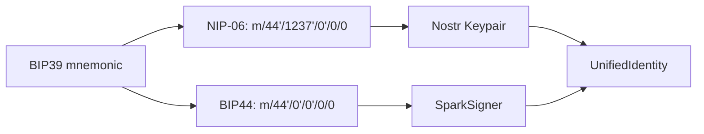
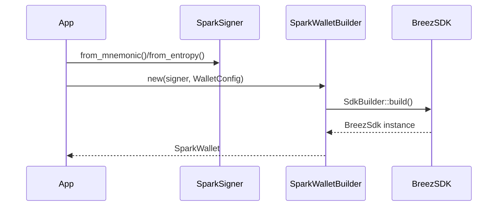
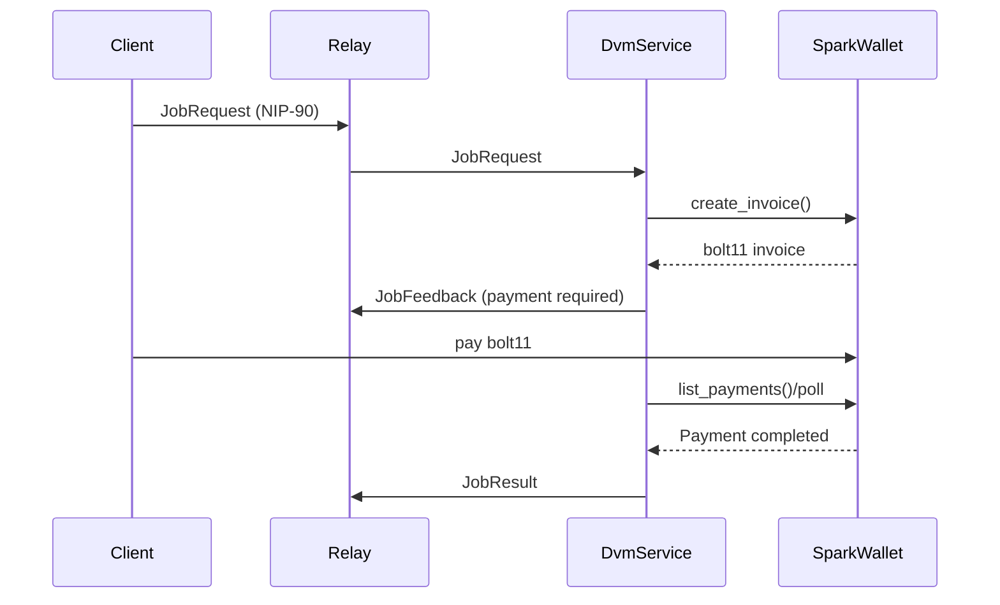
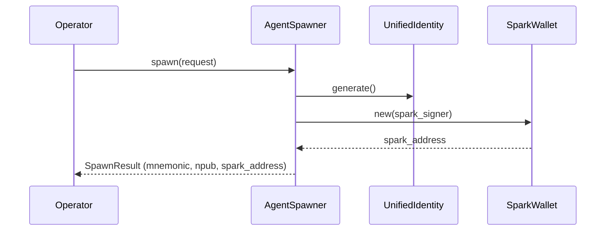

# Spark Audit (OpenAgents)

- **Status:** Draft audit
- **Last verified:** 2026-01-28
- **Scope:** /Users/christopherdavid/code/openagents2 (this repo)
- **Source of truth:** code in `crates/*` (docs are secondary)
- **If this doc conflicts with code, code wins.**

## Why this doc exists

This is a deep inventory of all Spark-related Bitcoin wallet code in this repo.
It is meant to support upcoming wallet UX, payment flows for NIP-90/DVM jobs,
agent funding, and any CLI/UI surfaces that need to expose Spark operations.

---

## Executive summary

- **Core Spark wallet integration** lives in `crates/spark/` and wraps the
  Breez Spark SDK (`breez-sdk-spark` Git tag `0.6.6`). It exposes a unified
  `SparkSigner` (BIP44) and `SparkWallet` for Spark L2 + Lightning + on-chain.
- **Unified identity** is implemented in `crates/compute/src/domain/identity.rs`:
  a single BIP39 mnemonic derives **Nostr (NIP-06)** and **Spark (BIP44)** keys.
  `openagents_runtime::UnifiedIdentity` re-exports this type.
- **Payments are wired into NIP-90 DVM flows**: `crates/compute/src/services/dvm_service.rs`
  can create invoices and poll SparkWallet for payment before completing a job.
- **Pylon** uses Spark for paid-provider mode and CLI wallet commands:
  `crates/pylon/src/provider.rs` + `crates/pylon/src/cli/wallet.rs`.
- **Agents** use Spark on spawn: `crates/agent/src/spawner.rs` creates a Spark
  wallet per agent and returns the funding address.
- **Runtime adapter** (`crates/runtime/src/wallet_spark.rs`) bridges SparkWallet
  into the generic `WalletService` trait (balance/pay/invoice + FX rates).
- **UI hooks** exist in Autopilot and WGPUI for Spark wallet display.
- **Gaps:** Spark CLI is only in `pylon` (no `openagents` CLI command yet).
  `spark/docs/REGTEST.md` references a `RegtestFaucet` helper that does not exist
  in the current codebase, and `pylon` config fields `spark_url`/`spark_token`
  are defined but not used by the SparkWallet wrapper.

---

## Repo inventory by subsystem

### 1) Spark core crate (`crates/spark/`)

**Purpose:** Spark wallet integration + Breez SDK wrapper + signer.

Key files:
- Entry + re-exports: `crates/spark/src/lib.rs`
- Signer (BIP44): `crates/spark/src/signer.rs`
- Wallet wrapper: `crates/spark/src/wallet.rs`
- Errors: `crates/spark/src/error.rs`
- WASM storage (in-memory): `crates/spark/src/wasm_storage.rs`

**Key behaviors:**
- **BIP44 derivation:** `m/44'/0'/0'/0/0` in `SparkSigner`.
- **Mnemonic / entropy:** `SparkSigner::from_mnemonic` and `from_entropy`.
- **Wallet builder:** `SparkWalletBuilder` supports custom SDK config, key sets,
  account index, and storage backend.
- **Network mapping:** `Network::Testnet` and `Network::Signet` map to SDK Regtest
  (Breez SDK supports Mainnet + Regtest only).
- **Default storage:** `dirs::data_local_dir()/openagents/spark` (native builds),
  `openagents/spark` (wasm, but in-memory unless overridden).
- **API coverage:** wrapper methods include Spark address, Bitcoin deposit address,
  balance, payments, LNURL, Lightning address management, deposits, token metadata,
  user settings, and optimization controls.

**Dependency note:** `breez-sdk-spark` is pulled from GitHub tag `0.6.6`
(`crates/spark/Cargo.toml`).

---

### 2) Unified identity (`crates/compute/src/domain/identity.rs`)

**Purpose:** single mnemonic -> Nostr + Spark keys.

- **Nostr:** NIP-06 path `m/44'/1237'/0'/0/0` via `nostr::derive_keypair_full`.
- **Spark:** BIP44 path `m/44'/0'/0'/0/0` via `SparkSigner::from_mnemonic`.
- **API:** `UnifiedIdentity::generate`, `generate_24_words`, `from_mnemonic`,
  `npub`, `nsec`, `spark_signer`, `spark_public_key_hex`.
- **Runtime re-export:** `openagents_runtime::UnifiedIdentity`.

---

### 3) Runtime wallet adapter (`crates/runtime/src/wallet_spark.rs`)

**Purpose:** bridge SparkWallet into `WalletService` for payment flows.

Implements:
- `balance_sats()` → total Spark + Lightning + on-chain.
- `pay_invoice()` → `send_payment_simple`.
- `create_invoice()` → `create_invoice`.
- `fx_rate()` → `list_fiat_rates` (USD → sats).

---

### 4) DVM payments (`crates/compute/src/services/dvm_service.rs`)

**Purpose:** Spark-backed payments for NIP-90 jobs.

- DVM service holds `Option<Arc<SparkWallet>>` for paid job execution.
- Creates invoices for jobs when `require_payment` is true.
- Polls Spark wallet for payment confirmation (`list_payments`), matches invoices
  from `PaymentDetails` (Lightning/Spark/Token paths).
- Emits domain events: `InvoiceCreated`, `PaymentReceived`, `BalanceUpdated`.

Related:
- `crates/compute/src/domain/events.rs` defines payment domain events.
- Payment tests: `crates/compute/tests/payment_integration.rs`,
  `crates/compute/tests/payment_stress.rs`.

---

### 5) Pylon (node + CLI) (`crates/pylon/`)

**Purpose:** paid provider/buyer node with Spark wallet support.

Key files:
- Provider integration: `crates/pylon/src/provider.rs`
- Wallet CLI: `crates/pylon/src/cli/wallet.rs`
- Payment flows in job/rlm commands: `crates/pylon/src/cli/job.rs`,
  `crates/pylon/src/cli/rlm.rs`
- Config fields: `crates/pylon/src/config.rs` (`spark_url`, `spark_token`,
  `enable_payments`, `network`)

Behavior:
- Provider initializes a SparkWallet from `UnifiedIdentity` and injects it into
  DVM service when payments are enabled.
- CLI provides: `balance`, `status`, `address`, `invoice`, `pay`, `history`,
  `fund` (regtest faucet), `whoami` (Nostr + Spark pubkeys).
- Wallet storage for pylon defaults to `~/.openagents/pylon/spark` (CLI paths).

Note: `spark_url`/`spark_token` exist in config but are not used by
`SparkWallet` today (Breez SDK connection is internal).

---

### 6) Agent spawn + lifecycle (`crates/agent/`)

**Purpose:** new agents get Spark wallet + funding address at spawn.

- `crates/agent/src/spawner.rs`:
  - Generates `UnifiedIdentity`.
  - Builds `SparkWallet` with per-agent storage path:
    `.../openagents/agents/<npub>`.
  - Returns Spark address in `SpawnResult`.
- `crates/agent/src/lib.rs` documents Spark wallet as part of agent sovereignty.

---

### 7) Autopilot UI (`crates/autopilot/`)

**Purpose:** display wallet state and Spark config.

Key files:
- Spark wallet runtime + snapshot: `crates/autopilot/src/app/spark_wallet.rs`
- Wallet config snapshot: `crates/autopilot/src/app/wallet.rs`
- Spark wallet modal rendering: `crates/autopilot/src/app/ui/rendering/modals/spark_wallet.rs`

Behavior:
- Reads `~/.openagents/pylon/config.toml` for `spark_url`, `spark_token`, network.
- Spawns background task to refresh balance, addresses, payments.

---

### 8) WGPUI components (`crates/wgpui/`)

UI primitives for wallet + payment display:
- Payment method icon for Spark: `components/atoms/payment_method_icon.rs`
- Balance card with Spark/Lightning/on-chain totals: `components/molecules/balance_card.rs`
- Invoice display supports Spark addresses: `components/molecules/invoice_display.rs`

---

### 9) Docs + directives

Docs:
- `crates/spark/README.md` (status + architecture)
- `crates/spark/docs/README.md`
- `crates/spark/docs/CONFIGURATION.md`
- `crates/spark/docs/API.md`
- `crates/spark/docs/REGTEST.md`

Directives:
- `.openagents/directives/d-001.md` (Breez Spark integration plan)
- `.openagents/directives/d-003.md`, `d-006.md`, `d-012.md`, `d-015.md` mention
  Spark as wallet layer, plus earlier mock/stub plans.

---

## Key flows (with diagrams)

### A) Unified identity derivation (Nostr + Spark)

### B) Spark wallet initialization (Breez SDK wrapper)

### C) Paid NIP-90 job flow (Spark-backed)

### D) Agent spawn + funding address

---

## Storage + configuration

**Default storage paths:**
- SparkWallet (native): `dirs::data_local_dir()/openagents/spark`
- Pylon CLI wallet: `~/.openagents/pylon/spark`
- Agent spawner: `.../openagents/agents/<npub>`

**WalletConfig:**
- `network`: `Mainnet | Testnet | Signet | Regtest`
- `api_key`: required for Mainnet, optional for Regtest
- `storage_dir`: wallet data path

**Network mapping:**
- Breez SDK supports Mainnet + Regtest only.
- `Testnet` and `Signet` map to Regtest in `Network::to_sdk_network()`.

**WASM builds:**
- Default to in-memory `MemoryStorage`.
- Use `SparkWalletBuilder::with_storage` to override.

---

## CLI surfaces

- **Pylon CLI** (`pylon wallet ...`) is the primary Spark CLI today.
- **OpenAgents CLI** (`oa`) does not yet expose Spark commands.

---

## Tests (Spark-related)

Spark crate:
- Unit tests in `crates/spark/src/signer.rs` and `error.rs`.
- Integration tests: `crates/spark/tests/integration.rs`.
  - Uses env vars `SPARK_E2E_*`, `FAUCET_*`, `BREEZ_API_KEY`.
  - References `testing::RegtestFaucet` (see gaps below).

Compute/DVM:
- `crates/compute/tests/payment_integration.rs`
- `crates/compute/tests/payment_stress.rs`

Nostr client integration tests also reference Spark addresses in flow output:
- `crates/nostr/client/tests/agent_chat_e2e.rs`

---

## Docs inventory (Spark-relevant)

- `crates/spark/README.md`
- `crates/spark/docs/README.md`
- `crates/spark/docs/CONFIGURATION.md`
- `crates/spark/docs/API.md`
- `crates/spark/docs/REGTEST.md`
- `.openagents/directives/d-001.md` (Breez SDK integration)

---

## Gaps / mismatches (as of 2026-01-28)

- `crates/spark/docs/REGTEST.md` references `openagents_testing::faucet::RegtestFaucet`,
  but there is no `RegtestFaucet` implementation in this repo. Tests refer to
  `testing::RegtestFaucet` (also missing). This is a doc/test mismatch.
- `crates/spark/src/lib.rs` docstring lists Phase 2 wallet operations as pending,
  but `SparkWallet` exposes a wide set of operations already. README and code do
  not fully align on status.
- `crates/pylon/src/config.rs` defines `spark_url` and `spark_token` fields, but
  they are not used by the SparkWallet wrapper (Breez SDK connection is internal).
- OpenAgents CLI (`oa`) does not expose Spark commands yet; only Pylon CLI does.

---

## Suggested next steps

1. **Implement RegtestFaucet helper** (or remove references) to fix doc/test drift.
2. **Expose Spark commands in `oa`** (mirror Pylon wallet CLI for consistency).
3. **Clarify Spark status** in `crates/spark/src/lib.rs` vs README.
4. **Decide on `spark_url`/`spark_token`** usage or remove from config.

