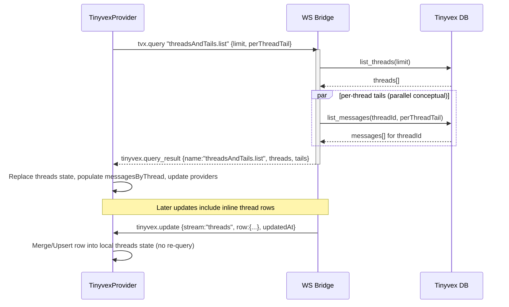

## Tinyvex — Threads + Tails Bootstrap (Sequence)

Notes
- Uses Mermaid `sequenceDiagram` syntax with participants, messages, a `par` block, and a `Note over` annotation.
- In-app rendering uses a dark theme and mono font; lines and borders use neutral greys from the app theme.

