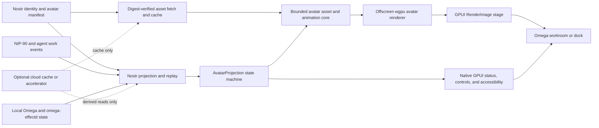

# Omega 3D avatar and Verse harvest audit

- Class: historical product audit and current native implementation plan
- Status: recommended program
- Date: 2026-07-24
- Audience: product, Omega, Nostr, graphics, and assurance teams
- OpenAgents snapshot:
  `420d051c6b21d919aef109fdae29d7ef7c25be43`
- Omega snapshot: `91491f0c7c68c2e854d8db9b55da1ccfcad9acfa`
- Ruins of Atlantis snapshot:
  `daeb5d0895270159ec8c18341b4adb84bf7a4346`
- `three-effect` snapshot:
  `714c37edf650258a767ae3fe0d98b6499acadd95`

## Decision

Build an **Omega Avatar Stage** now.

Aim for full parity with the valuable Verse avatar and spatial-work
capabilities over a sequence of native Omega slices.
Make that parity target a Nostr-native superset of Verse, not a literal revival
of the retired web application or its cloud world authority.

This week should ship the first complete vertical slice:

- one local and one remote agent appear as animated 3D avatars in a bounded
  native Omega stage.
- signed Nostr identity, avatar manifest, presence, and work evidence select
  what each avatar shows.
- the stage maps real agent states to idle, thinking, tool-use, approval,
  completion, and error animations.
- selecting an avatar focuses its real thread or run.
- native GPUI text and controls mirror every meaningful state.
- the experience survives relay replay, stale presence, missing assets, reduced
  motion, and offline operation.
- cloud services may cache assets or accelerate queries, but they do not become
  identity, work, or presence authority.

Do not make a walkable MMORPG the first acceptance target.
The Avatar Stage establishes the asset, animation, GPUI, Nostr, safety,
accessibility, and performance contracts that a later walkable Verse needs.
It creates visible product value inside the editor before Omega assumes the
cost of a world server, camera controller, terrain, economy, or game loop.

The recommendation is therefore ambitious in destination and narrow in
sequence:

> pursue full Verse capability parity, then exceed it with portable,
> relay-replayable Nostr avatars. Prove the native avatar and work-state spine
> this week.

## What full parity means

Full parity does not mean copying every old screen or dependency.
It means reproducing the user-facing capability with current authority,
current safety, and native Omega architecture.

| Capability | Historical Verse evidence | Omega parity target |
| --- | --- | --- |
| Avatar identity | per-account character slots and avatar refs | signed, portable Nostr avatar manifests with content digests and provenance |
| Animated local avatar | GLB model, animation state machine, third-person controller | native animated avatar driven by real local agent or owner state |
| Remote avatars | near and far presence feeds, interpolation, liveness, despawn | multi-relay presence projection with deduplication, expiry, interpolation, and replay |
| Agent state | movement, chat, training, and scene-specific effects | work-aware state derived from Omega and signed Nostr or NIP-90 evidence |
| Local interaction | proximity chat, bubbles, nameplates, avatar focus | Nostr-addressed local chat and actions with accessible native mirrors |
| World navigation | WASD, mouselook, camera, spawn points, regions | optional later workroom navigation after the bounded stage proves value |
| World information | HUD, hotbar, minimap, labels, Pylon stations | native GPUI roster, inspector, commands, and later spatial overlays |
| Rich scenes | Pylons, Khala effects, in-world screens, training scenes | signed workrooms, provider halls, proof theaters, and project-linked stages |
| Persistence | service-owned character and world rows | local materialization from signed events and content-addressed assets |
| Multiplayer | Cloudflare and SpacetimeDB experiments | Nostr-primary presence and commands with optional cache or fanout acceleration |
| Renderer lifecycle | `three-effect` frame clock, reconciler, scopes, pools | GPUI lifecycle plus a narrow retained avatar scene and explicit GPU ownership |
| Accessibility | DOM overlays around a canvas | native keyboard, focus, text status, reduced motion, and a disable-3D path |

Parity explicitly excludes retired product claims, stale payment theater,
Cloudflare or SpacetimeDB authority, hidden iframe mirroring, and a second React
application inside Omega.
It also excludes combat, fantasy content, inventory, crafting, and other Ruins
of Atlantis game systems unless a later product decision requests them.

## Audit boundary and source truth

This audit covered these sources:

- all of `/Users/christopherdavid/work/ruinsofatlantis`, including Rust crates,
  native and WebGPU rendering, assets, networking, client control, Bevy slice,
  model viewer, tests, issues, graphics notes, and game direction.
- all current OpenAgents paths and history that mention Verse, React Three
  Fiber, Three.js, 3D, avatars, worlds, spatial UI, MMORPGs, Pylons, and Khala.
- the current `world-contract`, `world-client`, and
  `effect-native-render-canvas` packages.
- deleted `apps/autopilot-desktop` and `apps/openagents-world` history.
- the adjacent `three-effect` repository that the historical desktop consumed.
- Sarah avatar documents, to separate interactive 3D from retired talking-video
  work.
- current Omega GPUI, platform renderers, image and video paths, agent states,
  and `omega-effectd` contracts.
- matching current and recently closed OpenAgents GitHub issues.

Current code wins when it differs from an old document.
The [historical Rust and WGPUI harvest](./2026-07-24-historical-rust-wgpui-gpui-harvest.md)
owns the broader native component and NIP-90 marketplace harvest.
This document owns the separate 3D avatar, Verse, Three.js, R3F, and MMORPG
harvest.

The main source snapshots are:

- [OpenAgents current source](https://github.com/OpenAgentsInc/openagents/tree/420d051c6b21d919aef109fdae29d7ef7c25be43).
- [Omega audited source](https://github.com/OpenAgentsInc/omega/tree/91491f0c7c68c2e854d8db9b55da1ccfcad9acfa).
- [Ruins of Atlantis audited source](https://github.com/OpenAgentsInc/ruinsofatlantis/tree/daeb5d0895270159ec8c18341b4adb84bf7a4346).
- [`three-effect` audited source](https://github.com/OpenAgentsInc/three-effect/tree/714c37edf650258a767ae3fe0d98b6499acadd95).

## Current status

No supported OpenAgents or Omega application currently renders a 3D avatar.

OpenAgents retains typed world contracts and a world client.
It no longer has the supported 3D desktop consumer.
Commit
[`cc0ff1e1514bff81bc34833fdba3b0f338fb3ee0`](https://github.com/OpenAgentsInc/openagents/commit/cc0ff1e1514bff81bc34833fdba3b0f338fb3ee0)
removed `apps/openagents-world` on 2026-07-14.
Commit
[`bbccd6ad47338fe919871e8848906438caa7d55c`](https://github.com/OpenAgentsInc/openagents/commit/bbccd6ad47338fe919871e8848906438caa7d55c)
removed `apps/autopilot-desktop` on the same date.

The surviving [`world-contract`](../../packages/world-contract/README.md) and
[`world-client`](../../packages/world-client/README.md) are useful historical
contract evidence.
They have no current supported application consumer.
Their README language and cloud assumptions are not current Omega authority.

The current
[`effect-native-render-canvas`](../../apps/openagents.com/packages/effect-native-render-canvas/src/index.ts)
is an active web rendering kernel.
It has a typed scene catalog, keyed reconciliation, scoped frame loop, headless
backend, and a live Three.js backend.
Its scene vocabulary supports groups, meshes, lines, points, labels, box,
sphere, plane, and basic or standard materials only.
It does not provide GLTF loading, skinning, animation, morph targets, avatar
instances, or native GPUI integration.

The issue history shows that the old programs reached meaningful milestones,
then closed:

- [#5730](https://github.com/OpenAgentsInc/openagents/issues/5730) tracked the
  Agent MMORPG epic.
- [#5731](https://github.com/OpenAgentsInc/openagents/issues/5731),
  [#5732](https://github.com/OpenAgentsInc/openagents/issues/5732), and
  [#5734](https://github.com/OpenAgentsInc/openagents/issues/5734) tracked the
  character spawner, agent avatar, registry, and spatial work.
- [#5887](https://github.com/OpenAgentsInc/openagents/issues/5887),
  [#5888](https://github.com/OpenAgentsInc/openagents/issues/5888),
  [#5889](https://github.com/OpenAgentsInc/openagents/issues/5889), and
  [#5892](https://github.com/OpenAgentsInc/openagents/issues/5892) tracked
  multiplayer, pose, remote animation, and near or far presence.
- [#5912](https://github.com/OpenAgentsInc/openagents/issues/5912),
  [#5914](https://github.com/OpenAgentsInc/openagents/issues/5914), and
  [#5915](https://github.com/OpenAgentsInc/openagents/issues/5915) tracked the
  frame clock, reconciler, and resource scope.
- [#5960](https://github.com/OpenAgentsInc/openagents/issues/5960),
  [#5961](https://github.com/OpenAgentsInc/openagents/issues/5961), and
  [#5969](https://github.com/OpenAgentsInc/openagents/issues/5969) tracked the
  world contract, service, and clients.
- [#7030](https://github.com/OpenAgentsInc/openagents/issues/7030) tracked the
  visual scene decision.
- [#8575](https://github.com/OpenAgentsInc/openagents/issues/8575) tracked the
  renderer-kernel fold into Effect Native canvas.

The audited searches found no open issue that currently owns native 3D avatars
in Omega.
Create a new Omega program instead of reopening the historical issue hierarchy
as though it still represented current architecture.

## Ruins of Atlantis audit

Ruins of Atlantis is a substantial Rust 2024 MMORPG experiment.
It contains a custom `wgpu` renderer, `winit` platform shell, WebGPU path,
server-authoritative simulation, loopback transport, and a 20 Hz network model.
It also contains client movement, GLTF and animation utilities, a native model
viewer, and a later Bevy vertical slice.

The repository contains about 1,543 relevant files outside vendor material.
The most relevant source areas contain this approximate scale:

| Area | Files | Lines | Relevance |
| --- | ---: | ---: | --- |
| `shared/assets` | 11 | 3,092 | GLTF, skinning, humanoid mapping, retargeting, textures, and mesh CPU types |
| `crates/render_wgpu` | 99 | 33,767 | custom renderer, skinning, materials, instancing, passes, and scene systems |
| `crates/platform_winit` | 9 | 2,746 | native event loop and window ownership |
| `crates/client_core` | 40 | 3,051 | replication, movement, camera, cursor, and action binding |
| `crates/server_core` | 88 | 7,609 | authoritative simulation and server state |
| `crates/net_core` | 17 | 1,657 | snapshots, sparse deltas, interest, transport, and commands |
| `crates/roa_domain` | 5 | 178 | small engine-independent character, input, NPC, and time model |
| `apps/roa_slice_bevy` | 5 | 1,559 | later Bevy GLTF and animation slice |
| `tools/model-viewer` | 9 | 2,526 | native model inspection and snapshot tooling |

The asset tree contains GLB, GLTF, FBX, PNG, and related binaries.
Those files are evidence that the pipeline ran.
They are not automatically approved Omega assets.
The repository-level license and notice do not establish provenance and reuse
rights for every model, texture, or animation file.
Omega must perform a per-asset source, license, attribution, redistribution,
and trademark review before copying any binary.

### High-value Rust harvest

The strongest Ruins harvest is renderer-independent asset and animation logic.

| Source | What it proves | Omega disposition |
| --- | --- | --- |
| [`shared/assets/src/types.rs`](https://github.com/OpenAgentsInc/ruinsofatlantis/blob/daeb5d0895270159ec8c18341b4adb84bf7a4346/shared/assets/src/types.rs) | CPU-side skinned vertices, tracks, clips, textures, submeshes, and meshes can remain independent from a renderer | adapt the data model into a small Omega avatar crate |
| [`shared/assets/src/skinning.rs`](https://github.com/OpenAgentsInc/ruinsofatlantis/blob/daeb5d0895270159ec8c18341b4adb84bf7a4346/shared/assets/src/skinning.rs) | a loader can select the dominant skin and aggregate all primitives that use it | port the behavior and fixtures, remove named embedded-WASM asset assumptions |
| [`shared/assets/src/humanoid.rs`](https://github.com/OpenAgentsInc/ruinsofatlantis/blob/daeb5d0895270159ec8c18341b4adb84bf7a4346/shared/assets/src/humanoid.rs) | rig prefixes and synonyms can map onto a canonical humanoid skeleton | adapt after defining Omega's supported rig profile |
| [`shared/assets/src/retarget.rs`](https://github.com/OpenAgentsInc/ruinsofatlantis/blob/daeb5d0895270159ec8c18341b4adb84bf7a4346/shared/assets/src/retarget.rs) | rest-pose correction, scale estimation, root motion, and clip retargeting work in Rust | adapt with deterministic fixture tests |
| [`crates/render_wgpu/src/gfx/anim.rs`](https://github.com/OpenAgentsInc/ruinsofatlantis/blob/daeb5d0895270159ec8c18341b4adb84bf7a4346/crates/render_wgpu/src/gfx/anim.rs) | palette sampling and upload can drive a working skinned renderer | use as an oracle, redesign for bounded updates and later crowd scaling |
| [`tools/model-viewer`](https://github.com/OpenAgentsInc/ruinsofatlantis/tree/daeb5d0895270159ec8c18341b4adb84bf7a4346/tools/model-viewer) | native GLTF inspection, orbit controls, merge behavior, and screenshots are practical development tools | build or adapt a small fixture viewer if avatar iteration needs it |
| [`crates/net_core`](https://github.com/OpenAgentsInc/ruinsofatlantis/tree/daeb5d0895270159ec8c18341b4adb84bf7a4346/crates/net_core) | sparse snapshots, sequence checks, quantization, and interest scopes support multiplayer motion | harvest semantics for presence projection, do not adopt its transport authority |
| [`crates/roa_domain`](https://github.com/OpenAgentsInc/ruinsofatlantis/tree/daeb5d0895270159ec8c18341b4adb84bf7a4346/crates/roa_domain) | a small domain model can stay independent from Bevy or `wgpu` | preserve the domain and presenter split |

The loader contains an important real-world fix.
Choosing a single visible primitive can produce a pair of eyes while dropping
the skinned body.
Omega should aggregate all primitives attached to the chosen skin and retain
submesh material boundaries.

The graphics notes record two other important failures:

- [`gltf-animations.md`](https://github.com/OpenAgentsInc/ruinsofatlantis/blob/daeb5d0895270159ec8c18341b4adb84bf7a4346/docs/graphics/gltf-animations.md)
  ties T-pose failures to missing joint or weight data and selection of an
  unskinned primitive.
- [`pc_animations.md`](https://github.com/OpenAgentsInc/ruinsofatlantis/blob/daeb5d0895270159ec8c18341b4adb84bf7a4346/docs/graphics/pc_animations.md)
  keeps animation client-side and gameplay authority independent, while mapping
  idle, walk, sprint, strafe, jump, and cast states.
- [`model-viewer.md`](https://github.com/OpenAgentsInc/ruinsofatlantis/blob/daeb5d0895270159ec8c18341b4adb84bf7a4346/docs/graphics/model-viewer.md)
  describes the useful viewer boundary and documents missing runtime Draco,
  PBR, alpha, and FBX completeness.

### What not to port from Ruins

Do not vendor the complete custom renderer into Omega.
It owns a window, event loop, pass graph, camera, terrain, sky, foliage,
post-processing, and game scene that conflict with GPUI's ownership model.
Its current animation path performs CPU palette work and uploads palettes each
frame.
That is adequate reference code, but it is not the desired crowd architecture.

Do not embed Bevy.
The Bevy slice is useful evidence for GLTF scenes and animation graphs.
A second application framework and renderer would create conflicts in the
event loop, surface, input, lifecycle, and package.

Do not port the server, combat, terrain, foliage, inventory, fantasy content,
or Dungeons and Dragons-derived direction.
The Omega product needs agent presence, not an unrelated game's authority or
content model.

Do not copy the special-cased WebAssembly loader that recognizes a fixed set of
embedded model names.
Omega needs a general, bounded, content-digest-verified asset path.

Do not accept the model binaries on repository location alone.
Clear asset-specific provenance first.

## Historical OpenAgents Verse audit

The deleted Autopilot desktop contained a materially complete Verse
experience.
The historical tree used `three-effect` and Three.js, not React Three Fiber, as
its main renderer.
It included:

- a default 3D Verse landing scene.
- Pylon stations and region layouts.
- a GLB player avatar and animated agent avatars.
- character creation, character slots, and per-account avatar references.
- WASD movement, mouselook, camera control, collision, and spawn handling.
- remote-avatar interpolation, liveness, and high or low presence feeds.
- local chat, proximity chatter, bubbles, labels, and nameplates.
- HUD, hotbar, minimap, focus, and interaction affordances.
- Khala effects, training scenes, and evidence-bound scene objects.
- in-world screens and code-related docks.
- isolated scene harnesses and capture-based visual proof.

The relevant historical source was not small.
The Verse category contained about 32 TypeScript files and 10,614 lines.
Chat-world material contained about 18 files and 7,678 lines.
Pylon material contained about 17 files and 3,664 lines.
Khala-specific material contained about 9 files and 3,040 lines.
The categories overlap, but the scale shows a product implementation rather
than a single demo component.

Historical scene mappers often produced pure descriptors before
`three-effect` rendered them.
Preserve that separation.
Omega should be able to test the projection from signed agent state to avatar
scene state without initializing a GPU.

### Historical failures worth preserving

The old code records several traps that a new implementation can avoid.

The spawned Verse scene mixed coordinate frames.
The avatar and camera used scene-world coordinates while items were children of
a transformed root and therefore used root-local coordinates.
Omega should define one canonical avatar-stage coordinate system and require
explicit conversions at every boundary.

One screen mirrored a hidden same-origin iframe into a canvas.
That design coupled security, focus, timing, rendering, input, and accessibility
to an invisible browser document.
Do not reproduce it.
Render real Omega content as native GPUI, and use a signed thumbnail or bounded
texture source when a 3D prop needs a preview.

The old work also attached money and work claims to animation.
Omega must reverse that authority.
Signed events and local runtime facts determine work, approval, delivery, and
settlement truth.
Animation only projects those facts.

### React Three Fiber findings

React Three Fiber was an experiment, not the stable Verse foundation.
Commit
[`392993a761`](https://github.com/OpenAgentsInc/openagents/commit/392993a761)
added an R3F node canvas on 2026-02-03.
Commit
[`00bca2749f`](https://github.com/OpenAgentsInc/openagents/commit/00bca2749f)
immediately replaced it with an SVG flow graph.

That replacement is a useful product lesson.
Do not use 3D for a relationship that a precise 2D graph communicates better.
Omega's editors, diffs, task trees, event inspectors, and dependency graphs
should remain native 2D interfaces.

The
[`Verse scene graph versus React Three Fiber audit`](../game/2026-06-21-verse-scene-graph-vs-react-three-fiber-audit.md)
identified valuable R3F concepts:

- declarative node descriptors.
- a node catalogue.
- keyed incremental reconciliation.
- property application.
- explicit attachment.
- on-demand frame scheduling.
- per-node disposal.
- shared resource caches.
- an interaction registry.

The current Effect Native canvas has implemented much of that web-side
direction.
Omega should borrow the lifecycle concepts, not React.
GPUI already supplies retained entities, rendering, input, focus, frame
requests, and application lifecycle.
Do not put a React tree or a general-purpose GPUI reconciler inside Omega.
The avatar renderer only needs a narrow retained scene for models, lights,
cameras, animation controllers, and instances.

### `three-effect` findings

The adjacent `three-effect` repository is the richest executable behavior
oracle for historical Verse.
Its current source includes about 24,157 implementation lines and 6,216 test
lines.
The useful modules cover:

- GLTF and Draco asset loading.
- skeleton cloning and model instances.
- animation state machines, crossfades, and phase preservation.
- local and remote character spawning.
- interpolation, liveness, and despawn.
- presence binding.
- entity registries, pools, and spatial queries.
- third-person, WASD, mouse, and camera control.
- keyed scene reconciliation, a managed frame clock, and resource scopes.

Use those modules as behavior specifications and test-scenario sources.
Do not paste their Three.js objects, DOM assumptions, browser loaders, or input
ownership into Omega.
Audit each behavior before reproducing it.
For example, the current character-spawn path appears to update the local
controller through the animation state machine and then update the controller
again.
The new implementation should derive its own tested ownership rather than copy
that sequence.

## Sarah avatar work is a separate product lane

The Sarah archive uses the word avatar for generated talking-head video.
The retired OAV and LiveAvatar material concerns video generation, lip sync,
WebRTC, GPU rendering, and produced media.
The current
[`Segmind talking avatar pipeline`](../sarah/2026-07-22-segmind-talking-avatar-pipeline.md)
concerns produced communication clips.

None of that is an interactive 3D avatar runtime.
Do not combine the video pipeline with the Omega Avatar Stage.

One lesson does transfer.
The renderer must never become identity or work authority.
Use an explicit state machine.
Mirror the current state in native status UI.
A media or rendering provider can then fail without loss of the agent task.

## Current contract gap

The surviving world contract describes avatar rows, position rows, regions,
commands, sparse deltas, interest, and safety.
Its avatar shape can identify a label and avatar kind.
Its position shape can carry position, yaw, a small animation enum, observation
time, and sequence.

It does not define what a portable 3D avatar requires:

- content digest and verified asset sources.
- file format and profile version.
- humanoid rig profile.
- animation capability map.
- materials, variants, and equipment slots.
- morph-target support.
- bounding volumes and scale.
- thumbnail and procedural fallback.
- level-of-detail assets.
- license, attribution, and provenance.
- author, signer, and manifest version.
- cache, expiry, and revocation semantics.

Do not extend the old cloud row until it becomes the new authority by accident.
Freeze a Nostr-first avatar contract and derive any local or cloud read model
from it.

## Recommended Omega architecture

Omega should separate signed truth, projection, renderer-independent avatar
state, GPU rendering, and native UI.

### Layer 1: signed truth

Nostr keys identify the owner, agent, or provider.
Signed events identify the avatar manifest, workroom membership, presence,
commands, NIP-90 job lifecycle, and other work evidence.
Omega treats cloud rows as caches or indexes of that truth.

### Layer 2: projection

A pure projection combines local Omega state and validated Nostr events into a
small `AvatarProjection` model.
It resolves conflicts, deduplicates relays, enforces sequence and expiry,
marks stale state, and provides causation references.

The projection should expose states such as:

- `idle`.
- `attentive` or `listening`.
- `thinking` or `generating`.
- `typing`.
- `tool_use`.
- `waiting_for_approval`.
- `blocked` or `error`.
- `complete`.

Those states can map from Omega's current thread and tool statuses and from the
`omega-effectd` run model.
Every mapping must name its source.
Unknown or stale evidence must render as unknown, stale, or idle.
It must not produce a false active-work animation.

### Layer 3: avatar core

Create a small renderer-independent Rust library only when implementation
begins.
Follow Omega's crate convention and use a descriptive library root such as
`src/omega_avatar.rs`.

The core should own:

- bounded decoded meshes, submeshes, textures, skins, joints, morphs, and
  clips.
- canonical humanoid mapping and optional retargeting.
- animation sampling, transitions, and deterministic time.
- avatar instances and projection-to-animation mapping.
- asset validation, digest verification, and fallback selection.
- pure tests that do not initialize GPUI or a GPU.

Adapt the Ruins CPU types and test cases where they meet current Rust quality
rules.
Do not inherit panic sites, broad renderer types, fixed embedded asset names, or
silent error handling.

### Layer 4: bounded renderer

The fastest safe native integration is an offscreen `wgpu` renderer that
produces a 256 to 512 pixel BGRA image for GPUI.
Omega can display it through `RenderImage` inside a custom element.
The implementation should request frames only when needed, release old GPUI
image assets, and stop when hidden.

This first bridge incurs GPU readback and image upload.
That cost is acceptable for a bounded avatar dock or card if measurement stays
within budget.
It is not the final architecture for a full-screen world or a crowd.

If the Avatar Stage proves valuable, add a deliberate GPUI external-texture or
custom-surface path per platform.
That later design must cover Metal on macOS, DirectX on Windows, and `wgpu` on
Linux or web.
Do not modify one platform renderer first and silently create a permanent
single-platform product.

### Layer 5: native product surface

GPUI owns layout, focus, keyboard actions, menus, tooltips, status, error
messages, permissions, and accessibility.
The 3D image is one visual child of a native Omega item or dock.

Selecting an avatar should focus the real thread, run, provider, job, or event
inspector.
The avatar should never replace those surfaces.

## Nostr-primary avatar contract

Omega should go deeper into Nostr than historical Verse.
The network model should make an avatar portable across installations and
relays without a cloud account row becoming its source of truth.

### Durable avatar manifest

Define a versioned `AvatarManifestV1` payload with at least:

- `avatarRef` and subject public key.
- manifest version and creation time.
- model content digest and one or more retrieval hints.
- format and supported profile.
- humanoid rig profile and bone-map version.
- animation role map, such as idle, think, tool, wait, complete, and error.
- material and variant declarations.
- bounds, canonical scale, and facing direction.
- level-of-detail and thumbnail digests.
- a procedural fallback descriptor.
- author, license identifier, attribution, provenance references, and allowed
  redistribution statement.
- optional equipment, morph, and capability declarations.
- supersession or revocation references.

Do not put raw GLB bytes in Nostr events.
Store large assets in content-addressed object storage with Blossom-compatible
or equivalent retrieval semantics.
Verify the digest after every fetch.
Allow multiple source hints so one host does not control avatar availability.

Do not assign a final custom event kind during the renderer spike.
First freeze the schema, fixtures, replacement rules, signatures, and threat
model.
Then coordinate the event-kind decision with canonical `nostr-effect` and
existing NIPs.

### Ephemeral presence and action

Define a separate, expiring `AvatarPresenceV1` projection for:

- workroom or region reference.
- coarse position and heading when a spatial room exists.
- high-level action or animation role.
- source event, run, thread, or NIP-90 job references.
- sequence, creation time, and expiry.
- optional interaction capability hints.

Do not publish frame-rate bone poses, morph values, or raw controller input to
relays.
Clients interpolate high-level state locally.
That keeps events small, makes replay useful, avoids relay abuse, and prevents a
renderer implementation from becoming a protocol requirement.

Use multi-relay ingestion, event-id deduplication, deterministic replacement,
offline replay, and visible stale-state handling from the first slice.
A stale remote avatar should fade to an inactive presentation and then despawn
according to policy.

### NIP-90 work projection

The current [`packages/nip90`](../../packages/nip90/README.md) surface re-exports
canonical `nostr-effect` NIP-90 support.
Use its signed request, feedback, and result lifecycle as work evidence.

A provider avatar can show:

- attentive when it observes a relevant request.
- thinking or tool-use when signed feedback or local provider truth says work
  is active.
- waiting when the job awaits an explicit approval or external input.
- complete only when result or closeout evidence supports completion.
- error or unavailable when signed failure or liveness evidence supports it.

The animation must link back to the source event in the inspector.
It must not infer settlement, delivery, quality, or success from visual motion.
Payment status remains separate signed or wallet evidence.

This design makes the 3D workroom a legible view of the open agent labor market
without turning it into a closed game backend.

### Cloud boundary

Cloud infrastructure may provide:

- content-addressed asset hosting and mirrors.
- thumbnail generation and safe asset transcoding.
- relay indexes and materialized read models.
- presence fanout acceleration.
- abuse scanning, cache warming, and observability.

It must not become the only holder of:

- avatar identity.
- manifest history.
- workroom membership.
- presence truth.
- NIP-90 job state.
- work, delivery, or settlement evidence.

Omega must continue to operate from signed events and local caches when the
optional cloud path is unavailable.

## Product shape

### First product: Avatar Stage

Place a compact Avatar Stage in an Omega dock or workroom surface.
Show the owner or local agent and the currently active remote agents.
The first version should support one to eight avatars, not a crowd.

Each avatar should expose:

- name, Nostr identity, and trust or verification state.
- current work state and the time or freshness of its evidence.
- click or keyboard activation that focuses the real thread or run.
- a contextual action to inspect signed events, manifest, relay sources, and
  asset provenance.
- a native fallback row for disabled or unavailable 3D.

The stage should feel alive, but it should not demand attention.
Use restrained idle motion, deliberate transitions, and no automatic camera
movement.
The standard Omega work surface remains primary.

### Second product: project workroom

After the stage is stable, let a project open a small spatial workroom.
Agents can gather around project artifacts, active runs, or task stations.
Selecting an object opens the native editor, diff, terminal, thread, or event
inspector.

The room is a spatial index into real work.
It is not a separate document model.

### Third product: NIP-90 provider hall

Represent provider availability, requests, feedback, and results as a
Nostr-native provider hall.
Agents can visibly accept and work jobs.
Every state remains inspectable as signed NIP-90 evidence.

Use the marketplace semantics in the historical Rust harvest.
Do not revive old static money effects or make payment claims without wallet and
event evidence.

### Fourth product: proof replay theater

Replay signed job and agent events on a deterministic clock.
Use avatars to show who acted, which event caused the transition, and where
evidence entered the run.
Keep the existing native inspector synchronized with the 3D replay.

### Later product: walkable Verse

Add optional movement and camera control after the first four surfaces prove
the value of spatial presentation.
Then add local chat, proximity, a minimap, stations, and larger rooms.

Full walkable Verse parity remains the destination.
It is not a prerequisite for shipping useful 3D avatars.

## Rendering options considered

| Option | Time to proof | Product fit | Main risk | Decision |
| --- | --- | --- | --- | --- |
| React Three Fiber in a WebView | very fast | poor | second runtime and native seams | use only for a disposable study |
| Embed historical Three.js desktop | fast | poor | retired app architecture and browser authority | reject |
| Embed Bevy | medium | poor | second event loop, renderer, input system, and application lifecycle | reject |
| Port the full Ruins renderer | slow | poor | broad game coupling and GPUI renderer conflict | reject |
| Modify GPUI platform renderers for native 3D immediately | slow | potentially excellent | Metal, DirectX, and `wgpu` rebase and portability cost before value proof | defer |
| Offscreen `wgpu` to GPUI `RenderImage` | fast | good for a bounded stage | GPU readback and upload | choose for the first vertical slice |
| GPUI external texture or custom surface | medium to slow | best long-term | cross-platform API and lifecycle design | pursue after measurements justify it |

Omega's macOS `surface` element is not a general portable answer.
It currently accepts a CoreVideo pixel buffer for the platform video path.
The non-macOS remote-video path already demonstrates a useful lifecycle
pattern: publish a `RenderImage` and remove old image assets instead of allowing
unbounded accumulation.

The first stage should copy that lifecycle discipline, not its video-specific
authority.

## Security and asset policy

Treat every remote avatar as hostile input.
A GLB or texture can exhaust CPU, memory, GPU memory, upload bandwidth, or frame
time without containing executable code.

The first loader must enforce explicit limits for:

- compressed and decoded file size.
- texture count, dimensions, format, and decoded bytes.
- node, mesh, primitive, vertex, and index counts.
- joint, skin, morph-target, and material counts.
- animation clip, track, keyframe, and duration counts.
- scene depth and transform validity.
- bounding volume and canonical scale.
- decode duration and memory allocation.
- supported extensions and compression modes.

Reject external URIs inside a model.
Reject unknown required extensions.
Allowlist materials and shader features.
Do not execute model-authored scripts or arbitrary shaders.
Decode away from the foreground thread and propagate meaningful failures to the
native UI.

Verify the declared content digest before decode.
Cache by digest rather than mutable URL.
Record the manifest signer, retrieval source, validation result, and asset
license in the inspector.

Always retain a low-cost procedural avatar or native icon fallback.
A broken remote asset must not break the workroom.

## Performance, accessibility, and interaction budgets

The first stage needs a budget before it needs visual ambition.

Use these provisional acceptance budgets on target hardware:

- no more than 2 ms average GPU time for the visible dock stage.
- no more than 1 ms average CPU time for projection, animation, and submission.
- 60 frames per second while the user directly interacts.
- 30 frames per second during visible active work.
- 15 frames per second or event-driven rendering during quiet idle states.
- zero requested animation frames while hidden, minimized, disabled, or fully
  occluded.
- one avatar first, then a measured four-to-eight-avatar fixture.
- shared models, rigs, textures, and materials across instances.
- lower update rates and levels of detail for inactive avatars.

Measure the offscreen readback and GPUI upload separately.
Do not hide that bridge cost inside a total frame number.
Open the zero-copy integration lane when the bridge prevents the stage from
meeting budget or when a larger scene becomes a committed product requirement.

Every meaningful 3D state must also appear in native text and the accessibility
tree.
Keyboard users must be able to focus and activate avatars.
Waiting for approval, failure, identity, freshness, and trust must not rely on
motion or color alone.

Honor reduced motion.
Provide a disable-3D mode that preserves the complete roster and action model.
Pause motion when appropriate.
Do not rotate the camera automatically.
Do not play audio automatically.

## What not to do

Do not:

- make the cloud account database the avatar identity or presence authority.
- design the protocol around one relay or one object host.
- invent a final Nostr event kind before schemas, fixtures, replacement rules,
  and compatibility review exist.
- publish frame-by-frame transforms, bones, or morph targets to relays.
- infer agent work, delivery, settlement, or quality from animation.
- import React or React Three Fiber into the native Omega runtime.
- embed the deleted Autopilot desktop in a WebView.
- revive Cloudflare or SpacetimeDB world service authority.
- fork GPUI's general entity or reconciliation model.
- port the complete Ruins renderer, Bevy application, ECS, game server, combat,
  terrain, or fantasy content.
- copy Ruins or old Verse model assets without per-file provenance clearance.
- accept arbitrary model URLs, external model resources, shaders, or scripts.
- use 3D for editors, graphs, diffs, permission dialogs, or information that 2D
  communicates more clearly.
- replace threads, jobs, event inspection, or standard navigation with forced
  movement.
- commit to a full-screen world before the bounded stage meets performance and
  accessibility budgets.
- combine Sarah's produced talking-head video pipeline with the interactive 3D
  runtime.

## Recommended one-week plan

### Day 1: freeze behavior and threat contracts

- define `AvatarManifestV1`, `AvatarPresenceV1`, and `AvatarProjection` as
  schemas and fixtures.
- define source precedence between local Omega state, signed Nostr evidence,
  NIP-90 events, and stale or conflicting presence.
- define the animation-role map and reduced-motion behavior.
- define asset limits and negative fixtures.
- select one OpenAgents-owned or newly created GLB with explicit provenance.
- avoid assigning a final custom Nostr kind during this spike.

### Day 2: build the renderer-independent avatar core

- create a focused Rust crate with decoded avatar, rig, clip, and instance
  types.
- adapt the Ruins dominant-skin, submesh, humanoid-map, and retargeting lessons.
- load the cleared GLB and validate one canonical rig.
- support idle, thinking, tool-use, waiting, complete, and error roles.
- add a procedural fallback and deterministic animation tests.
- add malicious and over-budget asset fixtures.

### Day 3: render inside native Omega

- implement an offscreen `wgpu` avatar renderer.
- present its output through a GPUI custom element and `RenderImage`.
- bound the image to 256 through 512 pixels for the first stage.
- request frames according to visibility and activity.
- release replaced image assets and stop fully when hidden.
- add mouse and keyboard focus that opens the real native thread or run.

### Day 4: connect signed Nostr state

- start with deterministic signed fixtures, then connect the canonical Nostr
  path.
- fetch avatar bytes through digest-verified content-addressed sources.
- project local and remote avatar state from multiple relays.
- implement deduplication, replacement, expiry, stale display, replay, and
  offline cache behavior.
- map NIP-90 request, feedback, result, and failure evidence to high-level work
  roles.
- expose causation and source events in a native inspector.

### Day 5: harden and prove

- exercise one local and one remote agent, then four-to-eight-avatar fixtures.
- capture CPU, GPU, readback, upload, memory, and frame-request measurements.
- verify reduced motion, disable-3D, keyboard navigation, text mirrors, stale
  presence, invalid signatures, missing assets, and malicious fixtures.
- add deterministic frame captures or visual fixtures for the supported states.
- open a measured follow-on issue for zero-copy GPUI integration if required.
- record a native proof that does not depend on cloud identity or work truth.

### Week-one exit criteria

The slice is complete only when:

- a local and a remote signed agent avatar render in native Omega.
- identity and manifest history survive multi-relay ingestion and offline
  replay.
- actual agent or NIP-90 state drives the documented animations.
- selecting either avatar focuses the correct thread, run, job, or inspector.
- approval, error, trust, and stale states appear in native accessible text.
- asset fetch and decode failures fall back safely.
- the loader rejects untrusted assets that exceed bounds, and negative fixtures
  pass.
- hidden or disabled stages request no frames.
- measured performance meets the provisional budget or records the exact bridge
  that prevents it.
- Omega resolves identity, work, and presence without a cloud service.

Do not lower these criteria to count a looping GLB in an isolated window as the
week's success.
The point is the complete Nostr-to-native-product slice.

## Follow-on parity roadmap

### Phase A: avatar foundation

Ship the week-one stage, manifests, presence, projection, loader limits,
animation roles, and native fallbacks.

### Phase B: workroom parity

Add more remote avatars, project rooms, local chat, bubbles, labels, roster,
selection, deterministic placement, and artifact stations.
Use standard Omega panes and actions for every real operation.

### Phase C: NIP-90 provider world

Add provider availability, job requests, feedback, results, proof, and explicit
payment evidence.
Make relay and event causation inspectable from every animation.

### Phase D: Verse interaction parity

Add optional movement, camera, spawn points, interest scopes, minimap,
proximity, emotes, character variants, and larger workrooms.
Keep signed Nostr presence primary.

### Phase E: proof and replay parity

Add deterministic replay, timeline scrubbing, camera tracks, proof gates, and
exportable receipts.

### Phase F: Nostr-native superset

Support portable avatar manifests across clients and user-selected relay sets.
Support multiple content mirrors, revocation, and supersession.
Add cross-workroom presence, provider discovery, and agent spatial interaction
without a required OpenAgents cloud account.

At that point Omega has exceeded historical Verse where it matters.
Its avatars represent sovereign agent identity and verifiable work, not merely
characters attached to a proprietary world row.

## Proposed issue structure

Create one current Omega epic and keep the first children narrow:

1. freeze the avatar manifest, presence, projection, and threat contracts.
2. build the bounded GLB, rig, animation, and fallback core.
3. build the offscreen `wgpu` and GPUI image bridge.
4. build the native Avatar Stage surface and accessibility mirror.
5. connect signed multi-relay Nostr presence and content-addressed assets.
6. connect local Omega, `omega-effectd`, and NIP-90 work projection.
7. prove security, performance, reduced motion, and offline replay.
8. decide the measured zero-copy GPUI renderer lane.
9. add project workrooms and local interaction.
10. add walkable Verse parity after the earlier gates pass.

Do not create an issue per historical module.
Organize the work around current vertical outcomes and contract boundaries.

## Final recommendation

Pursue full parity.

Use Ruins of Atlantis to accelerate the Rust GLTF, rig, retargeting, animation,
and sparse-presence parts.
Use historical Verse and `three-effect` to recover the product behavior,
failure cases, and acceptance scenarios.
Use the R3F audit to preserve incremental lifecycle ideas without importing
React.
Use Sarah only for the shared rule that rendering projects state and does not
own it.

Build the result as native Omega GPUI with a bounded renderer seam.
Make Nostr more central than it was in Buzz or Verse.
Signed identity, signed work, relay replay, content digests, and NIP-90 evidence
should drive the experience.
Let cloud infrastructure help, but never let it become the only place the
avatar or its work is real.

The correct push for this week is not a toy GLB and not an entire MMORPG.
It is the smallest complete native Nostr avatar system from signed event to
accessible Omega interaction.
That spine makes full parity fast to pursue and safe to prune later.
