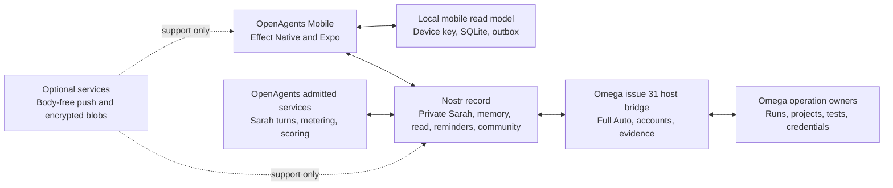

# OpenAgents Mobile adaptation audit for Omega

- Status: recommendation
- Date: 2026-07-24
- Owner: OpenAgents
- Audience: product, mobile, Omega, protocol, release, and assurance teams
- Decision: keep one OpenAgents mobile app and make Omega issue `#31` its first
  complete Omega surface

## 1. Decision

Keep the store product named **OpenAgents**.
Do not make a second app named **Omega Mobile** now.
Do not rename the current mobile app to Omega.

Make Omega a first-class host inside OpenAgents Mobile.
The app can show an **Omega** destination, connection, and workbench.
The bundle identity stays `com.openagents.app`.

Use Nostr as the primary cross-device protocol.
The phone must pair with Omega without an OpenAgents cloud account.
An owned service can help with push, relay access, blobs, and compute.
It must not become the identity or command authority.

Aim for full controller parity as the destination.
Do not define parity as a source-code copy or a small desktop layout.
Define it as the complete safe control of Omega from a phone or tablet.

Start with the complete user-facing scope of Omega issue `#31`.
Do not start with a generic ACP thread, Git control, or a terminal.
Give each issue `#31` capability a mobile location and an honest source state.
Connect every permitted action to its current Nostr or Omega owner.

Use a thin-whole implementation before you add visual depth.
The next seven days must make the owner-private room, the community room,
Full Auto work, provider accounts, and evidence chain available on mobile.
The proof must use real Nostr records, a real Omega host, and physical devices.
It must not use a fixture as the host authority.

## 2. Short recommendation

The recommended product shape is:

> OpenAgents Mobile is the owner application. The Sarah workroom from Omega
> issue `#31` is its first complete Omega surface.

This shape keeps one mobile identity and one release path.
It also lets the app control other OpenAgents targets later.
Examples include managed Agent Computers and NIP-90 services.

Use **Connect Omega** as the pairing action.
Use **Omega** as a destination label in the app.
Use **Workroom** as the first route after the connection.
Use **OpenAgents** in the store, bundle, push, and update identity.

Do not build the phone application with GPUI now.
Keep Effect Native and Expo for the mobile client.
Keep GPUI for the Omega desktop application.
Share protocols, fixtures, and behavior instead of view code.

## 3. Audit basis

This audit used these exact source states:

| Source                            | Revision                                   | Audit use                                                                |
| --------------------------------- | ------------------------------------------ | ------------------------------------------------------------------------ |
| `OpenAgentsInc/openagents`        | `3c7cf346cbcc6f7a250de67c71fd017669009834` | Current mobile source, Sarah records, plans, receipts, and release rules |
| `OpenAgentsInc/omega`             | `9ba3791d61173b4f5facda2785f23119f87fb6b5` | Current Omega, GPUI, agent, Nostr, workroom, and Full Auto source        |
| `pingdotgg/t3code` teardown pin   | `8b5469863ae1dd696e696de30240ec3da607962d` | The existing T3 Code teardown baseline                                   |
| `pingdotgg/t3code` current source | `38cfc25e5422e468303f2010f639cf3de9ad89ba` | Upstream changes after the teardown                                      |

The primary OpenAgents records were:

- `docs/teardowns/2026-07-13-t3-code-teardown.md`
- `docs/teardowns/2026-07-17-t3-code-mobile-app-teardown.md`
- `docs/teardowns/2026-07-17-t3-code-openagents-mobile-component-gap-analysis.md`
- `docs/teardowns/2026-07-17-t3-code-openagents-mobile-controller-gap-analysis.md`
- `docs/sol/2026-07-17-t3-code-mobile-full-parity-accepted-plan.md`
- `docs/sol/2026-07-10-khala-code-mvp-to-openagents-mobile-port-plan.md`
- `docs/sol/issues/app-mobile.md`
- `docs/deploy/openagents-mobile-production-release.md`
- `docs/mobile/2026-07-22-openagents-testflight-build-124-release-evidence.md`

The audit also checked the live OpenAgents and Omega GitHub issue state.
GitHub reports `#8597` and its named mobile children as closed.
The final `#8597` comment calls mobile a dormant follow-on substrate.
Omega issue [`#31`](https://github.com/OpenAgentsInc/omega/issues/31) is open.
GitHub closed its named Omega, OpenAgents, and `nostr-effect` child issues.
The source audit below shows that some child results are still projection
skeletons or local-only implementations.

This conflicts with `docs/sol/issues/app-mobile.md`.
That file still calls the old track active.
Use the live issue state and current source as implementation truth.
Treat the issue document as historical plan data until it gets a new status.

## 4. What the T3 plan contributed

The T3 Code audit found a good controller model.
The mobile application is not an execution host.
It controls one or more execution environments.

The useful T3 model includes:

- an environment directory and a pairing flow
- thread lists and project groups
- complete agent transcripts and work groups
- approvals, questions, and plan decisions
- queue, steer, stop, and retry controls
- repository files, search, and path context
- changed files, diffs, and review comments
- Git status and explicit Git mutations
- terminal sessions with replay and reconnect
- offline command storage and idempotent replay
- push notifications and exact deep links
- phone and tablet layouts
- physical-device screenshot and release checks

T3 uses a shared client runtime for snapshots, deltas, and commands.
It also uses native mobile modules for high-value controls.
These modules include the composer, Markdown, diffs, and terminal.

The T3 license is MIT.
Direct code copies can be compatible with Omega and OpenAgents.
Keep the license notice for substantial copied source.
Prefer behavior ports when the local architecture is different.

### 4.1 The teardown is already old

The current T3 source is 165 commits after the teardown pin.
Its mobile and client-runtime paths changed in 83 files.
The diff has 5,574 additions and 724 deletions.

Important new work includes:

- a flat thread list
- server-backed settled state
- thread snooze and wake behavior
- stronger shell snapshot convergence
- project grouping changes
- an `Auto` runtime mode
- more connection and Git progress detail

Do not treat the July 17 component list as a permanent parity target.
Track upstream behavior by capability and test.
Do not chase file-for-file equality.

## 5. Current OpenAgents Mobile truth

The current app is not a mock shell.
It has a real release and service foundation.

The audited TypeScript source has:

- 68 source files and 20,522 lines under `src`
- 62 test files and 12,842 lines under `tests`
- Expo 57 and React Native 0.86
- one Effect Native application tree
- SecureStore credential custody
- SQLite local state and an offline queue
- owned OTA updates
- notification and deep-link code
- an iOS TestFlight release path
- a production Sarah and Khala Sync lane

The release team uploaded build 124 for TestFlight on July 22.
Its receipt does not record a later `VALID` result.
Earlier build 123 has a `VALID` receipt.
The latest production proof is for Sarah conversation and voice.
It is not proof of Omega or T3 workbench parity.

### 5.1 The T3-derived surface is broad

The source contains a 43-row T3 component census.
It marks 41 rows complete and two rows adapted.
The implemented modules cover these areas:

- adaptive shell and workspace navigation
- transcript, history, attachments, and work groups
- approval and input cards
- composer tools and run controls
- attention and portable session controls
- files, changes, Git, terminal, and settings
- controller directory and environment connection views

The app already depends on `@openagentsinc/sarah`.
It also has a Full Auto run projection and mobile run controls.
Thus, issue `#31` needs new record adapters and joined views, not a new shell.

This is useful source and design work.
It is not complete product integration.

### 5.2 The main integration gap

The repository workbench uses 15 HTTPS client routes.
They include these route families:

- `/api/mobile/coding/repository/*`
- `/api/mobile/environments*`

The audit found no matching server handler outside the mobile client.
The client always points these calls at `https://openagents.com`.
It does not connect them to an Omega host.

The files, changes, Git, terminal, and environment screens have real state.
They also have bounded decoders and failure states.
However, they do not have an audited production owner for their data.

Call this **surface and contract parity**.
Do not call it **host parity**.

### 5.3 The terminal is not T3 terminal parity

T3 has native iOS and Android terminal modules.
Its Android module includes a Ghostty bridge.

OpenAgents Mobile uses an Effect Native host driver.
The driver shows the last 100,000 output characters in a text view.
It sends one input line when the user presses Return.
It also has a `Ctrl-C` button and a simple grid estimate.

This is a useful bounded console.
It is not a VT terminal and is not Ghostty parity.

### 5.4 Honest implementation matrix

| Area                     | Current state                    | Omega need                                            |
| ------------------------ | -------------------------------- | ----------------------------------------------------- |
| Store identity and OTA   | Real                             | Keep unchanged                                        |
| Secure local session     | Real for OpenAuth                | Add Nostr device identity and grants                  |
| SQLite and offline queue | Real                             | Reuse for Omega events and commands                   |
| Sarah conversation       | Real Khala Sync mobile lane      | Replace its record with the issue `#31` Nostr record  |
| T3 mobile shell          | Source and tests exist           | Reuse                                                 |
| Transcript and work log  | Real for Sync data               | Bind to Sarah Nostr messages and activity             |
| Attention and controls   | Strong contracts                 | Bind to NIP-RS and Omega outcomes                     |
| Full Auto                | Live mobile projection exists    | Bind to the Omega run registry and controls           |
| Community workroom       | No mobile route                  | Add NIP-29, NIP-LBR, membership, and experience views |
| Files and search         | Client contract only             | Add bounded Omega adapter                             |
| Changes and review       | Client contract only             | Add Omega diff adapter                                |
| Git                      | Client contract only             | Add Omega Git admission and receipts                  |
| Terminal                 | Text console and client contract | Add Omega session owner, then assess native VT        |
| Environment directory    | Client contract only             | Replace with Nostr host discovery and pairing         |
| Physical parity          | Partial                          | Prove iOS and Android Omega journeys                  |

## 6. Current Omega truth

Omega already has the correct execution owners.
It does not need a second mobile execution stack.

Current owner crates include:

- `agent` for native agent threads and persisted thread data
- `acp_thread` for ACP sessions, events, and agent interaction
- `agent_ui` for agent actions and host integration
- `project` for worktrees, files, buffers, and project state
- `git` and `git_ui` for repository state and operations
- `terminal` and `terminal_view` for PTYs and terminal presentation
- `sandbox` for bounded process authority
- `omega_effectd` for Full Auto supervision and sidecar control
- `workroom_ui` and `workroom_receipts` for workroom state and receipts

These crates must remain the operation owners.
The mobile bridge must project their state.
It must not read GPUI widget state as product authority.

### 6.1 Omega has no mobile application target

GPUI now defines mobile lifecycle, inset, back, and keyboard interfaces.
This is useful future framework work.

The current `gpui_platform` crate has back ends for:

- macOS
- Windows
- Linux and FreeBSD
- WebAssembly

It has no iOS or Android platform dependency.
There is no Omega mobile binary target.

The GPUI mobile interfaces are a research seam.
They are not a reason to restart the current mobile app.

### 6.2 The Nostr path is not ready for a parity claim

Omega includes `nostr` with NIP-44 support.
It has a Sarah Nostr conversation client in `omega_effectd`.
It also has NIP-42 authentication tests and signed event construction.

The default conversation client uses `MockRelayAdapter`.
The source says that production needs a real WebSocket relay client.
The workroom mark-read action is local-only and does not publish NIP-RS.
The community room is an in-memory projection skeleton.
The workroom disables its composer because no source admits community publish.

Omega now shows Full Auto runs in the Sarah workroom.
The separate Full Auto panel also shows provider accounts and an evidence
chain. These results do not yet form one headless workroom contract.

Build the thin mobile surface and the real transport together.
An unavailable source must appear as unavailable in the mobile surface.
Do not let a fixture, an empty projection, or a closed issue appear complete.

### 6.3 Issue `#31` is the first mobile parity target

Issue `#31` has three product parts and three Full Auto extensions.
GitHub shows the child issues as closed and the epic as open.
For mobile, a closed child means that there is source to reuse.
It does not mean that a physical phone has parity.

| Issue `#31` area                                     | Audited source state                             | First mobile result                                                                                        |
| ---------------------------------------------------- | ------------------------------------------------ | ---------------------------------------------------------------------------------------------------------- |
| Identity binding (`#32`)                             | Omega binding source exists                      | Show the owner key, host key, binding state, grant scope, and revocation state                             |
| Private Sarah room (`#33`-`#37`)                     | Client source exists                             | Show signed messages, activity, controls, receipts, attention, and gaps                                    |
| Memory, read state, and reminders (`#9221`, `#9232`) | Nostr contracts exist                            | Decrypt memory, search locally, publish read state, and manage reminders                                   |
| Full Auto in the workroom (`#41`)                    | Run rows are present in `workroom_ui`            | Show objective, lane, state, exact unattended time, live activity, terminal reason, and permitted controls |
| Provider accounts (`#42`)                            | Roster parsing is present in `full_auto_ui`      | Show provider accounts, readiness, quota, lane mapping, and an honest isolated-login handoff               |
| Evidence chain (`#43`)                               | A public-safe inspector exists in `full_auto_ui` | Open objective, turn, change, test, host verification, authority decision, and receipt as one object       |
| Community room (`#38`, `#9224`-`#9231`)              | Omega shows a skeleton                           | Separate both rooms. Add membership, work, disputes, experience, and badges                                |

The mobile route must show all these areas in its first product slice.
Each action must use the role and grant from the source record.
The app can show a record without an action.
A blocked action must show its exact blocker and its required handoff.

Provider login is the important example.
The phone can request a connection and show its progress.
The Omega host must own the isolated device-login flow and token custody.
The phone must never receive a provider token or change the default agent home.

The community room has a second important boundary.
An owner, a member, and a verifier have different controls.
The mobile app must derive those controls from signed membership and grants.
It must not show an owner action to an untrusted member.

## 7. Product options

| Option                                 | Decision          | Reason                                                                |
| -------------------------------------- | ----------------- | --------------------------------------------------------------------- |
| OpenAgents Mobile with Omega as a host | Choose            | One identity, release, cache, push path, and target directory         |
| Rename OpenAgents Mobile to Omega      | Do not choose     | It hides Sarah, NIP-90, managed compute, and future non-Omega targets |
| Ship a second Omega Mobile app         | Do not choose now | It duplicates keys, push, OTA, store work, and session state          |
| Port Omega GPUI to iOS and Android     | Research only     | GPUI has mobile contracts but no mobile platform back end             |
| Make a thin web wrapper                | Do not choose     | It loses the existing native release, storage, and device work        |

Reconsider a second mobile app later only with clear product evidence.
Examples are a different customer, legal boundary, or store entitlement.
A wish for a different icon is not sufficient evidence.

## 8. Target architecture

### 8.1 Protocol boundary

Reuse the issue `#31` Nostr record contracts.
Do not put them in a second mobile REST contract.
Do not make one new aggregate event that copies the full record.

Build an `Issue31WorkroomReadModel` in the app.
It is a local projection and not durable authority.
It joins these inputs by stable reference:

- the owner-private Sarah record
- NIP-AE memory, NIP-RS read state, and NIP-ER reminders
- the NIP-29 community record and NIP-LBR work lifecycle
- membership, attestation, revocation, experience, rank, and badges
- the small Omega host projection for Full Auto, accounts, and evidence

Add one versioned host adjunct contract only where Nostr has no source.
A candidate name is `openagents.omega.issue31.host.v1`.
It must define host identity, pairing, grants, Full Auto state and controls,
provider handoff state, evidence references, admission, outcomes, and gaps.

Rust and TypeScript must decode the same canonical and negative fixtures.
The GPUI pane and the mobile route must consume headless projections.
Neither view can be the source of a record.

### 8.2 Nostr must be deeper than T3

T3 uses account identity and environment connections.
Omega must use Nostr for more of the real boundary.

Nostr must own these issue `#31` cross-device facts:

- device identity
- Omega host identity
- host announcements
- pairing grants and revocations
- the encrypted owner-private conversation
- owner-decryptable memory
- read state and reminders
- the community group, membership, and attestations
- work requests, quotes, results, disputes, and appeals
- experience awards, rank assertions, and badges
- encrypted host command intents and signed outcomes

Use NIP-44 for private payloads.
Use a separate device key on each phone or tablet.
Keep the owner key out of the mobile view tree.

Full Auto execution, provider credentials, local changes, tests, and host
verification stay on the Omega host.
The host publishes only bounded projections and public-safe references.
The phone sends typed intents and waits for the host-owned outcome.

The relay is transport and storage.
It is not identity admission, execution, scoring, or settlement authority.

### 8.3 Cloud boundary

The Nostr record must not become a REST mirror in `openagents.com`.
The user must be able to read confirmed records when the application service
is unavailable and the relays are reachable.

Some issue `#31` actions still need an admitted OpenAgents service.
Sarah turn admission, exact metering, scorer assertions, and service-key
custody do not move to a relay or to the phone.
If that service is unavailable, the app must show the exact unavailable state.
It must not hide the existing record or invent a successful turn.

Pairing and local Omega run control must not require an OpenAuth session.
The one-time OpenAuth binding can identify a metering relationship.
It must not become the Nostr identity or the command session.

Optional OpenAgents services can provide:

- APNs and FCM delivery
- an owned Nostr relay
- encrypted content-addressed blobs
- managed Agent Computers
- later NIP-90 discovery and payment support
- account recovery that does not replace device keys

Push payloads must contain only opaque references.
They must not contain prompts, source, diffs, or terminal output.

Cloud sign-in can add services.
It must not be a gate for pairing one phone with one Omega host.

## 9. What to reuse

### 9.1 OpenAgents Mobile reuse map

| Mobile asset                        | Omega owner                       | Adaptation                                                           |
| ----------------------------------- | --------------------------------- | -------------------------------------------------------------------- |
| Adaptive shell and navigation       | Mobile                            | Keep the current Effect Native view                                  |
| Controller directory                | Omega host directory              | Replace cloud environment rows with signed host records              |
| Existing Sarah route                | Sarah Nostr record                | Replace the Khala Sync source and keep the conversation-first layout |
| Conversation and work log           | Sarah record and `workroom_ui`    | Show messages, activity, pending state, terminal state, and gaps     |
| Approval and input cards            | Sarah authority and receipts      | Use the receipt inspector grammar for decisions and refusals         |
| Composer and run controls           | Sarah service and `omega_effectd` | Route send, interrupt, pause, resume, and stop as typed intents      |
| Attention inbox                     | NIP-RS and NIP-ER                 | Deep-link to the exact room, message, reminder, run, or receipt      |
| Portable session controls           | Omega and `omega_effectd`         | Bind to the real host, grant, run, and generation                    |
| Current mobile Full Auto projection | `omega_effectd`                   | Replace the OpenAgents run source with the Omega run registry        |
| Changes and review view             | Full Auto evidence owner          | Use it first for bounded issue `#43` change and test evidence        |
| Settings and environment rows       | Omega host and provider roster    | Show the host, account state, lane mapping, and connect handoff      |
| Two-pane tablet layout              | Sarah and community records       | Show both room selectors without merging history or membership       |
| SQLite outbox                       | Mobile                            | Reuse for Nostr publish and receipt convergence                      |

The generic files, Git, and terminal components remain useful.
They start after issue `#31` reaches its physical-device gate.

### 9.2 T3 behavior to continue harvesting

Continue to harvest these T3 behaviors:

- environment health and reconnect language
- snapshot plus delta convergence
- settled, snoozed, and raised-hand thread behavior
- bounded command wrappers
- offline replay tests
- native composer details
- native Markdown selection and actions
- high-density native diff rendering
- Ghostty terminal behavior if a true terminal becomes necessary
- physical screenshot and accessibility harnesses

Do not copy the T3 server architecture into Omega.
Do not make the phone depend on the T3 Node event store.
Omega already has stronger local owners for project and agent state.

## 10. What not to do

### 10.1 Do not make a second source of truth

Do not make Nostr events a second local project database.
Do not let the mobile cache become run authority.
Do not let GPUI view state become protocol authority.

Project, Git, terminal, and agent owners produce projections.
Only those owners can confirm an operation result.

### 10.2 Do not expose raw desktop authority

Do not send these values to the phone by default:

- raw local root paths
- provider credentials
- environment variables
- arbitrary process handles
- unrestricted PTY streams
- hidden or ignored file content
- arbitrary shell commands

Use opaque references and explicit capability grants.
Bind every mutation to an expected version.

### 10.3 Do not claim parity from file presence

A screen, decoder, or fixture is not an integrated capability.
A simulator is not a physical-device result.
An uploaded build is not a `VALID` build.
A queued command is not a completed command.

Each parity row needs these proofs:

1. the Omega owner produced the state
2. the phone decoded and showed the state
3. the phone issued the permitted intent
4. Omega admitted or rejected it
5. the owner produced a durable outcome
6. the phone converged after restart and replay

### 10.4 Do not start with terminal and Git writes

These are high-authority surfaces.
They also create the most expensive physical test matrix.

Start with the complete issue `#31` workroom.
Add generic files, changes, ACP threads, and Git after that gate.
Add Git writes and terminal input after grant and receipt tests pass.

### 10.5 Do not replace NIP-LBR with generic NIP-90

Issue `#31` includes the narrow NIP-LBR request and quote lane.
Implement that lane now because it is part of the community room.
Do not add a generic job kind or a payment path.

Generic NIP-90 target discovery remains a later target.
It is not a replacement for the issue `#31` record or host bridge.

### 10.6 Do not make an interactive skeleton

Do not enable a button until its source owner can admit the intent.
Do not make an empty community projection look like an empty community.
Do not make a queued provider handoff look like a connected account.
Do not make an allowed authority decision look like completed work.

Keep source, freshness, gap, pending, refusal, and terminal state visible.
Use an explicit **Continue on Omega** handoff when the host must do the work.

## 11. Ordered parity target

Full parity remains the destination.
The first gate is issue `#31` parity.
The second gate is generic Omega controller parity.

### 11.1 Issue `#31` parity

The first gate has this user-visible contract:

| Capability               | The owner can see                                                                             | The permitted user can do                                                                    |
| ------------------------ | --------------------------------------------------------------------------------------------- | -------------------------------------------------------------------------------------------- |
| Connection and identity  | Device key, Omega key, owner binding, grant, relay, freshness, and revocation                 | Pair, renew, and revoke a device without a cloud login gate                                  |
| Owner-private Sarah      | Signed transcript, activity, state, and gaps                                                  | Send, interrupt, retry a safe failure, and open its receipt                                  |
| Memory                   | Owner-decryptable NIP-AE engrams and local search results                                     | Inspect what Sarah remembers and remove local search data without deleting the signed record |
| Read state and reminders | NIP-RS cursor state and NIP-ER reminder state                                                 | Mark read, create, change, dismiss, and expire reminders                                     |
| Attention and receipts   | Exact message, run, decision, and result targets                                              | Open the exact target and inspect allowed, refused, pending, or completed state              |
| Full Auto                | Objective, lane, exact time, state, and reason                                                | Pause, resume, stop, and ask Sarah about a run                                               |
| Provider accounts        | Provider, account label, readiness, quota, and lane mapping                                   | Request a safe connect handoff and follow its host-owned progress                            |
| Evidence chain           | Objective, turn, change, test, host verification, decision, and receipt                       | Open each bounded hop and reject a broken or mismatched chain                                |
| Community membership     | Group, member, agent, operator attestation, persona, grant, and revocation                    | Invite, join, attach an agent, or revoke when the signed role permits it                     |
| Community work           | Work unit, quote, one accepted provider, result, verification, rejection, dispute, and appeal | Take the role-scoped action for each lifecycle state                                         |
| Experience               | Accepted award events, recomputed total, scorer rank, and badges                              | Inspect the source for an award and detect a rank mismatch                                   |

The owner-private room and the community room must never share history,
membership, a thread reference, or an optimistic state.
The community room must always say that v1 awards experience and pays no money.

### 11.2 The minimum useful implementation is a thin whole

The first mobile version does not need final animation or dense desktop layout.
It needs a real source and an honest state for every row in section 11.1.

Each row must have one of these results:

- a real read and a real permitted action
- a real read and an explicit role-based read-only state
- an unavailable state with the exact missing source
- an Omega handoff with a tracked outcome

An absent route, a fixture-backed success, and an enabled dead control do not
meet the minimum.

### 11.3 Generic Omega controller parity follows issue `#31`

After the first gate, add the remaining T3 controller breadth:

- admitted projects, sessions, agent threads, and child-agent state
- approvals, questions, queue, steer, retry, and generic stop controls
- bounded files, search, changes, diffs, and review instructions
- admitted Git operations
- bounded terminal sessions
- portable movement across Omega and managed Agent Computers
- later generic NIP-90 target discovery

This order makes the first mobile result more Nostr-centric than T3.
It also stops generic workbench work from delaying the current Omega product.

### 11.4 Parity claim rule

Do not claim issue `#31` parity until every section 11.1 row passes with:

- a current Omega host and the current OpenAgents record contract
- a signed iOS build on a physical device
- a signed Android build on a physical device
- fresh install, upgrade, foreground, background, and process death
- offline outbox, relay replay, duplicates, reordering, and gaps
- device, member, and agent revocation
- stale and unauthorized command refusal
- accessibility traversal
- no private data in push, logs, public events, or receipts

### 11.5 `OMEGA-MOB-31-00` coverage map

Omega issue `#44` freezes the first mobile coverage map.
The map has these eleven rows.

| Capability               | Durable authority                                                 | Host adjunct                                     | First route state                                       |
| ------------------------ | ----------------------------------------------------------------- | ------------------------------------------------ | ------------------------------------------------------- |
| Connection and identity  | Signed Nostr device, host, binding, grant, and revocation records | `connection_identity` is a host observation only | unavailable until the signed Nostr source connects      |
| Owner-private Sarah      | NIP-17, NIP-44, NIP-59, and the Sarah turn record                 | none                                             | unavailable until the signed turn source connects       |
| Memory                   | NIP-AE and `openagents.sarah.nip_ae_companion.v1`                 | none                                             | unavailable until the signed memory source connects     |
| Read state and reminders | NIP-RS and NIP-ER                                                 | none                                             | unavailable until the signed state source connects      |
| Attention and receipts   | Signed Sarah turn, read-state, and reminder targets               | none                                             | unavailable until the signed target source connects     |
| Full Auto                | Omega run owner                                                   | `full_auto_runs`                                 | unavailable until the Omega adjunct connects            |
| Provider accounts        | Omega provider roster owner                                       | `provider_accounts`                              | unavailable until the Omega adjunct connects            |
| Evidence chain           | Omega evidence owner                                              | `evidence_chain`                                 | unavailable until the Omega adjunct connects            |
| Community membership     | NIP-29, NIP-OA, NIP-AP, and the Sarah membership record           | none                                             | unavailable until the signed membership source connects |
| Community work           | NIP-29, NIP-LBR, and the Sarah work lifecycle                     | none                                             | unavailable until the signed work source connects       |
| Experience               | NIP-32, NIP-58, NIP-85, and the Sarah experience record           | none                                             | unavailable until the signed experience source connects |

The local read model is `openagents.mobile.issue31_workroom_read_model.v1`.
It is a projection and is not durable authority.
Each row shows its source, freshness, gap, reason, and role state.
Each row also shows an idle, pending, refused, or terminal action state.
An absent source becomes an explicit `unavailable` row.

The Workroom route has an owner-private selector and a community selector.
The route is available before an OpenAuth session exists.
The selectors do not share a history or a membership set.
The shared host rows can appear in both route sections.

The host adjunct is `openagents.omega.issue31.host.v1`.
Rust and TypeScript use the same four fixture files.
Their SHA-256 values are:

| Fixture                                                        | SHA-256                                                            |
| -------------------------------------------------------------- | ------------------------------------------------------------------ |
| `openagents.omega.issue31.host.v1.canonical.json`              | `c5ef757ef8787e7626cdad98ef50a83a763d90067c2b7bb4972783b032bb825d` |
| `openagents.omega.issue31.host.v1.negative-invalid-state.json` | `b5c89c27529c76ea95c2dcd6549c5664f3f1c852e1c8ad98ff09b9e85c6bdba1` |
| `openagents.omega.issue31.host.v1.negative-private-field.json` | `107654b87ef310c20f2431d3e020949f1322dee239bb43f0b4888e72a81c8b86` |
| `openagents.omega.issue31.host.v1.negative-unsafe-ref.json`    | `ec41e1b35c375270e2debc96125adc75ff0d773d764851b9005e2c7f6e0b5f4e` |

The decoder rejects an unknown field, an unsafe reference, an invalid state,
an unbounded list, a duplicate reference, and a duplicate capability.
It also rejects a private path, a token, `nsec1`, and `ncryptsec1`.
It limits a timestamp so that a mobile date conversion cannot fail.

This packet does not claim issue `#31` parity.
It makes all missing sources visible before the transport work starts.

## 12. Recommended next-seven-day plan

This audit does not admit a packet in this section.
These candidate names identify proposed work units.

### `OMEGA-MOB-31-00` — Freeze the issue `#31` mobile coverage map

Deliver:

- one row for every issue `#31` capability in section 11.1
- the local `Issue31WorkroomReadModel`
- the minimal `openagents.omega.issue31.host.v1` adjunct
- stable references, bounds, source, freshness, gap, and role state
- shared canonical and negative fixtures
- a Workroom route with owner-private and community room selectors
- visible unavailable states for every source that is not connected yet

Exit:

- Rust and TypeScript decoders pass the same fixture set
- no issue `#31` capability is absent from the route or coverage map
- no existing Nostr record gets a duplicate mobile event kind
- no exact local path or credential can enter a public projection

### `OMEGA-MOB-31-01` — Connect mobile and Omega to the real Nostr record

Deliver:

- a production WebSocket relay adapter for the Omega conversation client
- the mobile Nostr client with device-key custody
- NIP-42 support where the relay requires it
- NIP-17, NIP-44, and NIP-59 owner-private records
- NIP-AE, NIP-RS, NIP-ER, NIP-29, and NIP-LBR subscriptions
- reconnect, backoff, replay, and relay failover
- Omega host discovery, pairing, scoped grants, and revocation

Exit:

- the physical-device proof does not use `MockRelayAdapter`
- a phone and Omega converge on the same confirmed event references
- a relay outage does not create false completion
- confirmed records remain readable during an application-service outage

Implementation state on 2026-07-24:

- The Sarah package defines the shared discovery, pairing, grant, revocation,
  command intent, and terminal command result records.
- The public host record uses NIP-89 kind `31990` and the
  `openagents.omega.issue31.host_discovery.v1` schema.
- The signed host record binds a distinct `sarahPublicKeyHex`. Mobile admits
  that key only after the owner admits and selects the host. A current
  host-signed device grant must repeat the same Sarah key. Mobile authenticates
  structured pairing and command records against the selected admitted host.
- In this contract, `hostPublicKeyHex` also names the selected owner recipient.
  Direct owner-private subscriptions include that exact `#p` filter. Admission
  requires one `p` tag, the selected owner key, and the bound Sarah author.
- A self-signed relay announcement is not host admission. The mobile build
  admits only host keys configured out of band in
  `EXPO_PUBLIC_OMEGA_HOST_PUBLIC_KEYS`, and the owner confirms the visible
  fingerprint before pairing.
- Pairing and command records use NIP-17 kind `14` rumors, NIP-44 seals, and
  NIP-59 kind `1059` gift wraps.
- The mobile host keeps a separate device key in this-device-only storage.
  The application receives signer operations and public identity data only.
- Mobile imports Sarah principal schemas and transcript sanitization from the
  Node-free `@openagentsinc/sarah/mobile-principal` leaf export. The Sarah root
  re-exports that contract for compatibility, but Metro never traverses the
  Node-only relay load-proof barrel.
- The mobile relay client supports NIP-42, bounded relay failover, separate
  room cursors, replay, duplicate removal, and replaceable event selection.
- A host can renew an announcement without advancing its generation only when
  the host, Sarah, display, protocol, and relay binding stays identical. The
  renewal must advance `issuedAt`. Exact logical copies select the newer signed
  event deterministically. A changed binding or same-time record fork creates
  `discovery_conflict`, and only a higher generation clears that gap.
- Relay URLs use `ws` or `wss` and have no credentials, query, or fragment.
- The mobile client accepts generic device-addressed NIP-17 content only from
  the bound Sarah key. Both the selected host announcement and current active
  device grant must bind that key. Before grant, after revocation, and on a
  Sarah-key mismatch, the subscription stays pairing-only. A valid wrap alone
  grants no authority.
- The mobile client rejects a structured private record unless its embedded
  host key is both admitted out of band and currently selected. The read model
  applies the same boundary before it folds grants or projects capabilities.
- SQLite stores the exact signed outbound event before publish. A restart
  reloads the same bytes, and a relay refusal does not remove the event.
- The client retains a refused publish until the owner explicitly retries or
  discards it. Retry clears that event's bounded relay refusal and republishes
  the exact signed bytes. Discard removes the persisted outbound event.
- Pairing requests and responses also survive a restart. The app restores the
  selected host, requeues the exact persisted signed gift wrap, and continues
  the signed challenge flow. This closes a crash between pairing persistence
  and insertion into the general outbound queue.
- The client waits for EOSE from each active subscription. It shows an exact
  gap when a replay cannot finish.
- A subscription replacement sends `CLOSE` for every prior subscription before
  it sends the new `REQ` frames. A bounded retired-subscription set ignores late
  `EVENT`, `EOSE`, and `CLOSED` frames from the prior epoch, including a NIP-42
  authentication refresh.
- A relay `OK` message confirms storage only. A terminal command result is the
  only record that can complete a command intent.
- The mobile runtime exposes a command-intent publisher. It derives the
  `grantRef` and `expectedGeneration` from the current active grant.
  It requires the requested scope and a caller-supplied idempotency reference.
  It signs a device-to-host NIP-59 envelope and persists it before transport.
- When the selected host announcement disappears or expires, mobile clears the
  Sarah author, owner recipient, selected host admission, and active grant.
  It replaces the subscriptions with a gift-wrap-only fail-closed scope and
  refuses commands until a current signed announcement restores admission.
- Scoped grants, renewals, and revocations carry the host-bound
  `sarahPublicKeyHex`. The shared grant fold rejects any lifecycle record that
  changes it. The mobile read model reports a gap when discovery and grant
  name different Sarah keys.
- Grant revocation is terminal for one `grantRef`. A new pairing operation must
  use a new `grantRef`.
- The client removes duplicate device copies by the inner rumor identifier.
  The outer gift-wrap identifiers can be different.
- The effectd host bridge exposes bounded, generation-fenced renewal and
  revocation operations. Renewal keeps the same `grantRef`. Re-pairing after
  revocation creates a new `grantRef`.

The device key is not the owner key. It cannot decrypt an owner-addressed
NIP-17 record or an owner-encrypted NIP-AE, NIP-RS, or NIP-ER record.
The mobile client stores the exact signed source event reference.
It shows `reason.issue31.device_projection_missing` until a projection exists.

Packet `OMEGA-MOB-31-02` must add the narrow projection flow.
The device sends a grant-scoped NIP-59 request that names one source event.
Omega must check the event kind, author, tags, source reference, and grant.
Omega can then return a device-addressed projection for that event.
The projection is not the source authority.
This flow must not export the owner key or add a REST copy.

A revocation stops new commands and new projection copies.
It does not erase plaintext that a device received before the revocation.
The physical-device exit is still open until the device proof records a real
phone, a real Omega host, and the same confirmed Nostr references.

Production Expo exports for iOS and Android pass with one admitted host key.
This proves the native Metro bundle boundary. It does not prove the open
physical-device exit.

The issue `#45` Workroom view bounds displayed source references to eight and
shows the remaining count. Host selection and pairing controls have explicit
screen-reader labels, including both host and bound Sarah fingerprints.
Polite live-region announcements remain in `OMEGA-MOB-31-02`: the current
Effect Native generic text accessibility contract has labels and roles but no
portable live-region field. That packet owns the pending, refused, failed, and
terminal owner-private interaction states that need the announcement policy.

### `OMEGA-MOB-31-02` — Complete the owner-private mobile room

Deliver:

- the signed Sarah transcript and bounded activity ladder
- send, pending, confirmed, refused, failed, and interrupted states
- the authority receipt inspector
- proactive attention and exact deep links
- owner-decryptable NIP-AE memory with an on-device search index
- cross-device NIP-RS read state
- NIP-ER reminder create, change, dismiss, and expiration controls

Exit:

- a physical phone sends to Sarah and receives a confirmed reply
- interrupt remains pending until the terminal record arrives
- Omega and mobile agree on read state after restart and replay
- the owner can inspect every memory item that Sarah can use

Implementation state on 2026-07-24:

- Discovery v2 adds the exact owner-private Sarah conversation reference and
  advertises command v2 while preserving the v1 pairing and command protocols.
- Command v2 carries typed arguments for send, interrupt, read-state advance,
  and reminder create, change, complete, and cancel. Its signed result reports
  host handling only. An accepted result is not target completion. Mobile waits
  for the exact matching projected source record.
- `openagents.omega.issue31.owner_projection.v1` binds each device-addressed
  projection to the active grant generation, original source event identifier,
  source author, source role, source kind, and source timestamp. The projection
  transports a bounded owner-private view and never becomes source authority.
- Mobile admits owner-authored source records only from the selected Omega host
  identity and Sarah-authored records only from the Sarah key bound by the
  active grant. Conflicting copies poison the source or idempotency reference
  instead of selecting one by arrival order.
- The Workroom renders bounded transcript paging, live turn activity, authority
  receipts, local memory search, merged read state, reminder lifecycle controls,
  and command reconciliation. Exact source identifiers back its deep links.
- Confirmed decrypted records use the bounded local SQLite store. The local
  clear action deletes stored projections. It also suppresses received copies
  for the current relay session. It does not revoke relay records or the device
  grant.
- The admitted Sarah service loads one identity from the Secret Manager mount.
  It binds the signer and owner NIP-44 cipher to that key. Missing, malformed,
  or mismatched production custody now fails closed.
- Sarah publishes through an authenticated WebSocket relay session. The relay
  contract requires a NIP-42 challenge on connection and an affirmative `OK`
  for the exact event identifier. A timeout, negative receipt, or closed relay
  becomes `service_unavailable` and never becomes a successful answer.
- Sarah answers use a kind `14` rumor inside a Sarah-authored kind `13` seal and
  an ephemeral kind `1059` gift wrap. The plaintext rumor is never published.
- `turn.started` claims can retry only when the start event was not confirmed.
  Once confirmed, later publication loss preserves the claim and the visible
  gap. Interrupt remains pending until the relay confirms the signed terminal
  record.

Canonical contract fixture hashes:

| Fixture | SHA-256 |
| --- | --- |
| `openagents.omega.issue31.host_discovery.v2.canonical.json` | `a5604d4c792a5ed556f023e150f01b371c5cf702b95b72786e0c7a9adbbdcb1c` |
| `openagents.omega.issue31.command.v2.canonical-intent.json` | `7bb7b23680be10756184668ae7722c09c634a1941b086f66d0425da4e8371bbe` |
| `openagents.omega.issue31.command.v2.canonical-result.json` | `51bca57e14c3d45518c342c2d1f848972281de848f809c34566ed183c7e4e387` |
| `openagents.omega.issue31.owner_projection.v1.canonical.json` | `8515d1108617807aca2692ba5faca4b4adcc155e8e42197c1d0b4ce89ef5d79c` |

The physical-device exit remains open until Omega implements and signs the
matching v2 host records and a real phone completes the relay journey.

### `OMEGA-MOB-31-03` — Join Full Auto, accounts, and evidence

Deliver:

- Full Auto rows with objective, lane, state, live work, terminal reason, and
  exact unattended duration
- pause, resume, and stop intents through the Omega host bridge
- provider-account roster, readiness, quota, and account-to-lane mapping
- a phone-initiated and host-owned isolated login handoff
- the issue `#43` objective-to-receipt evidence chain
- public-safe bounded change, test, and host-verification data

Exit:

- one mobile workroom contains the conversation, run, account, and evidence
- a control completes only from an Omega-owned terminal result
- a provider token and the default agent home never enter the mobile path
- a broken evidence hop fails closed

### `OMEGA-MOB-31-04` — Complete the community mobile room

Deliver:

- the isolated NIP-29 group transcript and membership roster
- human-to-agent attestation, persona, grant, and revocation state
- work-unit list, request, quote, one-provider acceptance, result, and refusal
- independent verification with a distinct operator
- typed rejection, dispute, and appeal state
- award events, recomputed total, scorer rank, and NIP-58 badges
- role-scoped controls for owner, member, agent operator, and verifier
- experience-only copy in the room, invitation, and first-run view

Exit:

- the owner-private and community stores have no shared history or membership
- an authorized mobile role can complete each non-payment lifecycle action
- replayed, self-verified, expired, and revoked results are visibly refused
- no screen calls experience an earning or offers a settlement action

### `OMEGA-MOB-31-05` — Prove the thin whole on physical devices

Deliver:

- one complete physical iOS journey
- one complete physical Android journey
- the owner-private journey from send through receipt
- the Full Auto journey from run through evidence
- the community journey from membership through award or typed appeal
- background and restart recovery
- relay duplicate, reorder, gap, outage, and failover tests
- device, member, and agent revocation tests
- the section 11.1 coverage receipt

Exit:

- every section 11.1 row has a physical-device result
- a public-safe receipt binds the mobile build, Omega commit, record contract,
  relay result, host result, and test result

### Recommended sequence for this week

Day 1 freezes `OMEGA-MOB-31-00` and opens all source sections in the route.
Day 2 finishes the real relay path and the owner-private room.
Day 3 joins the three Omega host extensions from issues `#41` through `#43`.
Day 4 connects the community record and all role-scoped actions.
Day 5 runs the full integration journey and fixes false-success states.
Days 6 and 7 run physical-device, restart, relay-failure, revocation,
accessibility, and redaction proofs.

After the shared fixtures land, use three independent work lanes:

- mobile Nostr record and workroom UI
- Omega host adjunct and the real relay adapter
- end-to-end fixtures, failures, and physical proof

Do not use generic ACP, Git writes, or interactive terminal input as stretch
work. If a lane finishes early, it must close a missing issue `#31` row or add
a failure proof.

## 13. Work after the first week

### Wave 2 — Issue `#31` depth

Add:

- large-history pagination and local encrypted search controls
- richer reminder, memory, group, and evidence navigation
- multi-relay health, failover, and recovery controls
- community moderation and abuse-report views
- native performance work for long transcripts and work-unit lists
- a scheduled physical-device regression matrix

### Wave 3 — Generic workbench breadth

Add:

- bounded file tree and search
- source and Markdown previews
- exact changed-file and diff projection
- review instructions
- artifacts and receipts
- project and thread filters
- settled and snoozed thread behavior

### Wave 4 — High-authority controls

Add:

- Git branch, commit, push, and conflict handling
- terminal create, replay, resize, input, and interrupt
- explicit per-session grants
- approval renewal and revocation
- stronger native diff and terminal rendering

### Wave 5 — OpenAgents network advantage

Add:

- portable movement across Omega and managed Agent Computers
- generic NIP-90 jobs in the target directory
- paid-job status and receipts
- optional encrypted blob transfer
- body-free push references
- portable grants across admitted targets

## 14. Risks and controls

| Risk                                       | Control                                                                          |
| ------------------------------------------ | -------------------------------------------------------------------------------- |
| Relay events arrive twice or out of order  | Event ID, sequence, cursor, expected version, and idempotency reference          |
| A stolen phone controls Omega              | Device key, scoped grant, expiration, local revoke, and remote revoke            |
| Cloud becomes the conversation record      | Direct Nostr reads, no REST mirror, and cloud-independent pairing                |
| A relay sees private work                  | NIP-44 payloads and opaque tags                                                  |
| A closed child issue hides a skeleton      | Source, freshness, gap, interaction, and physical-proof rows for each capability |
| Community and private rooms merge          | Separate stores, keys, membership, history, cursors, and negative tests          |
| Member content changes Sarah instructions  | Quote it as untrusted data and keep the work-unit grant narrow                   |
| Community controls amplify authority       | Signed roles, operator attestation, explicit grants, and immediate revocation    |
| Experience looks like compensation         | Fixed no-payment copy and no settlement controls in v1                           |
| Provider login damages a live account      | Host-owned isolated homes, explicit handoff, and no token projection             |
| Evidence exposes private work              | Public-safe refs, bounded summaries, and host-owned content fetch                |
| Mobile state invents success               | Outcome only from the Omega operation owner                                      |
| GPUI thread state leaks into protocol      | A headless projection layer with stable schemas                                  |
| T3 upstream keeps moving                   | Capability ledger and scheduled behavior review                                  |
| Two app brands confuse users               | One OpenAgents store app and one Omega destination label                         |
| Current parity census overstates readiness | Replace source-path evidence with end-to-end proof rows                          |

## 15. Final advice

Aim for full parity, and use issue `#31` as the first complete object.

The object is not “T3 Code on a phone.”
The first object is “the complete Nostr-first Sarah workroom on a phone.”

Keep the current mobile application.
Reuse its T3-derived components and offline state.
Reuse the issue `#31` Nostr record instead of making a mobile record.
Add only the host adjunct for Full Auto, accounts, and evidence.

The best result for the next seven days is one undeniable thin-whole journey:

> A physical phone connects to Omega through Nostr and opens the two-room Sarah
> workroom. The owner talks to Sarah, interrupts a turn, reads memory and
> attention state, controls a Full Auto run, follows its provider and evidence,
> and performs every permitted community action. The app survives replay and
> restart, and it loses authority after revocation.

Do not spend this week on a generic ACP controller, Git writes, or a terminal.
After issue `#31` reaches this gate, the remaining T3 controller breadth can
use the same identity, transport, grants, receipts, and physical test harness.
