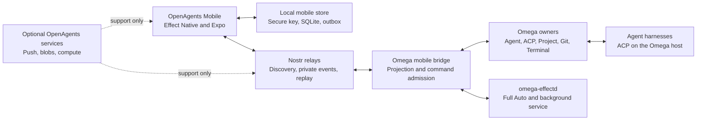

# OpenAgents Mobile adaptation audit for Omega

- Status: recommendation
- Date: 2026-07-24
- Owner: OpenAgents
- Audience: product, mobile, Omega, protocol, release, and assurance teams
- Decision: keep one OpenAgents mobile app and add an Omega connection

## 1. Decision

Keep the store product named **OpenAgents**.
Do not make a second app named **Omega Mobile** now.
Do not rename the current mobile app to Omega.

Make Omega a first-class host inside OpenAgents Mobile.
The app can show an **Omega** destination, connection, and workbench.
The bundle identity stays `com.openagents.app`.

Use Nostr as the primary cross-device protocol.
The phone must pair with Omega without an OpenAgents cloud account.
An owned service can help with push, relay access, blobs, and compute.
It must not become the identity or command authority.

Aim for full controller parity as the destination.
Do not define parity as a source-code copy or a small desktop layout.
Define it as the complete safe control of Omega from a phone or tablet.

The next seven days must prove one real Nostr control path.
The proof must use a real Omega host and a physical mobile device.
It must not use a fixture as the host authority.

## 2. Short recommendation

The recommended product shape is:

> OpenAgents Mobile is the owner application. Omega is its native coding host.

This shape keeps one mobile identity and one release path.
It also lets the app control other OpenAgents targets later.
Examples include managed Agent Computers and NIP-90 services.

Use **Connect Omega** as the pairing action.
Use **Omega** as a destination label in the app.
Use **OpenAgents** in the store, bundle, push, and update identity.

Do not build the phone application with GPUI now.
Keep Effect Native and Expo for the mobile client.
Keep GPUI for the Omega desktop application.
Share protocols, fixtures, and behavior instead of view code.

## 3. Audit basis

This audit used these exact source states:

| Source | Revision | Audit use |
| --- | --- | --- |
| `OpenAgentsInc/openagents` | `3124d72c63ac9f497431fd961ac63bfc0ac31b4a` | Current mobile source, plans, receipts, and release rules |
| `OpenAgentsInc/omega` | `3949e4529179a7adcc75b19d80c4115d9e9fa4ea` | Current Omega, GPUI, agent, Nostr, and workroom source |
| `pingdotgg/t3code` teardown pin | `8b5469863ae1dd696e696de30240ec3da607962d` | The existing T3 Code teardown baseline |
| `pingdotgg/t3code` current source | `38cfc25e5422e468303f2010f639cf3de9ad89ba` | Upstream changes after the teardown |

The primary OpenAgents records were:

- `docs/teardowns/2026-07-13-t3-code-teardown.md`
- `docs/teardowns/2026-07-17-t3-code-mobile-app-teardown.md`
- `docs/teardowns/2026-07-17-t3-code-openagents-mobile-component-gap-analysis.md`
- `docs/teardowns/2026-07-17-t3-code-openagents-mobile-controller-gap-analysis.md`
- `docs/sol/2026-07-17-t3-code-mobile-full-parity-accepted-plan.md`
- `docs/sol/2026-07-10-khala-code-mvp-to-openagents-mobile-port-plan.md`
- `docs/sol/issues/app-mobile.md`
- `docs/deploy/openagents-mobile-production-release.md`
- `docs/mobile/2026-07-22-openagents-testflight-build-124-release-evidence.md`

The audit also checked the live OpenAgents GitHub issue state.
GitHub reports `#8597` and its named mobile children as closed.
The final `#8597` comment calls mobile a dormant follow-on substrate.
No open issue had `mobile` in its title at audit time.

This conflicts with `docs/sol/issues/app-mobile.md`.
That file still calls the old track active.
Use the live issue state and current source as implementation truth.
Treat the issue document as historical plan data until it gets a new status.

## 4. What the T3 plan contributed

The T3 Code audit found a good controller model.
The mobile application is not an execution host.
It controls one or more execution environments.

The useful T3 model includes:

- an environment directory and a pairing flow
- thread lists and project groups
- complete agent transcripts and work groups
- approvals, questions, and plan decisions
- queue, steer, stop, and retry controls
- repository files, search, and path context
- changed files, diffs, and review comments
- Git status and explicit Git mutations
- terminal sessions with replay and reconnect
- offline command storage and idempotent replay
- push notifications and exact deep links
- phone and tablet layouts
- physical-device screenshot and release checks

T3 uses a shared client runtime for snapshots, deltas, and commands.
It also uses native mobile modules for high-value controls.
These modules include the composer, Markdown, diffs, and terminal.

The T3 license is MIT.
Direct code copies can be compatible with Omega and OpenAgents.
Keep the license notice for substantial copied source.
Prefer behavior ports when the local architecture is different.

### 4.1 The teardown is already old

The current T3 source is 165 commits after the teardown pin.
Its mobile and client-runtime paths changed in 83 files.
The diff has 5,574 additions and 724 deletions.

Important new work includes:

- a flat thread list
- server-backed settled state
- thread snooze and wake behavior
- stronger shell snapshot convergence
- project grouping changes
- an `Auto` runtime mode
- more connection and Git progress detail

Do not treat the July 17 component list as a permanent parity target.
Track upstream behavior by capability and test.
Do not chase file-for-file equality.

## 5. Current OpenAgents Mobile truth

The current app is not a mock shell.
It has a real release and service foundation.

The audited TypeScript source has:

- 68 source files and 20,522 lines under `src`
- 62 test files and 12,842 lines under `tests`
- Expo 57 and React Native 0.86
- one Effect Native application tree
- SecureStore credential custody
- SQLite local state and an offline queue
- owned OTA updates
- notification and deep-link code
- an iOS TestFlight release path
- a production Sarah and Khala Sync lane

The release team uploaded build 124 for TestFlight on July 22.
Its receipt does not record a later `VALID` result.
Earlier build 123 has a `VALID` receipt.
The latest production proof is for Sarah conversation and voice.
It is not proof of Omega or T3 workbench parity.

### 5.1 The T3-derived surface is broad

The source contains a 43-row T3 component census.
It marks 41 rows complete and two rows adapted.
The implemented modules cover these areas:

- adaptive shell and workspace navigation
- transcript, history, attachments, and work groups
- approval and input cards
- composer tools and run controls
- attention and portable session controls
- files, changes, Git, terminal, and settings
- controller directory and environment connection views

This is useful source and design work.
It is not complete product integration.

### 5.2 The main integration gap

The repository workbench uses 15 HTTPS client routes.
They include these route families:

- `/api/mobile/coding/repository/*`
- `/api/mobile/environments*`

The audit found no matching server handler outside the mobile client.
The client always points these calls at `https://openagents.com`.
It does not connect them to an Omega host.

The files, changes, Git, terminal, and environment screens have real state.
They also have bounded decoders and failure states.
However, they do not have an audited production owner for their data.

Call this **surface and contract parity**.
Do not call it **host parity**.

### 5.3 The terminal is not T3 terminal parity

T3 has native iOS and Android terminal modules.
Its Android module includes a Ghostty bridge.

OpenAgents Mobile uses an Effect Native host driver.
The driver shows the last 100,000 output characters in a text view.
It sends one input line when the user presses Return.
It also has a `Ctrl-C` button and a simple grid estimate.

This is a useful bounded console.
It is not a VT terminal and is not Ghostty parity.

### 5.4 Honest implementation matrix

| Area | Current state | Omega need |
| --- | --- | --- |
| Store identity and OTA | Real | Keep unchanged |
| Secure local session | Real for OpenAuth | Add Nostr device identity and grants |
| SQLite and offline queue | Real | Reuse for Omega events and commands |
| Sarah and Khala Sync | Real cloud lane | Keep during migration, not Omega authority |
| T3 mobile shell | Source and tests exist | Reuse |
| Agent transcript | Real for Sync data | Add Omega ACP projection |
| Attention and controls | Strong contracts | Bind to Omega outcomes |
| Files and search | Client contract only | Add bounded Omega adapter |
| Changes and review | Client contract only | Add Omega diff adapter |
| Git | Client contract only | Add Omega Git admission and receipts |
| Terminal | Text console and client contract | Add Omega session owner, then assess native VT |
| Environment directory | Client contract only | Replace with Nostr host discovery and pairing |
| Physical parity | Partial | Prove iOS and Android Omega journeys |

## 6. Current Omega truth

Omega already has the correct execution owners.
It does not need a second mobile execution stack.

Current owner crates include:

- `agent` for native agent threads and persisted thread data
- `acp_thread` for ACP sessions, events, and agent interaction
- `agent_ui` for agent actions and host integration
- `project` for worktrees, files, buffers, and project state
- `git` and `git_ui` for repository state and operations
- `terminal` and `terminal_view` for PTYs and terminal presentation
- `sandbox` for bounded process authority
- `omega_effectd` for Full Auto supervision and sidecar control
- `workroom_ui` and `workroom_receipts` for workroom state and receipts

These crates must remain the operation owners.
The mobile bridge must project their state.
It must not read GPUI widget state as product authority.

### 6.1 Omega has no mobile application target

GPUI now defines mobile lifecycle, inset, back, and keyboard interfaces.
This is useful future framework work.

The current `gpui_platform` crate has back ends for:

- macOS
- Windows
- Linux and FreeBSD
- WebAssembly

It has no iOS or Android platform dependency.
There is no Omega mobile binary target.

The GPUI mobile interfaces are a research seam.
They are not a reason to restart the current mobile app.

### 6.2 Omega Nostr is early and Sarah-specific

Omega includes `nostr` with NIP-44 support.
It has a Sarah Nostr conversation client in `omega_effectd`.
It also has NIP-42 authentication tests and signed event construction.

The default conversation client uses `MockRelayAdapter`.
The source says that production needs a real WebSocket relay client.
No general Omega coding-session Nostr bridge exists.

This is the most important current Omega gap.
Do not build the mobile UI ahead of this transport and admission path.

## 7. Product options

| Option | Decision | Reason |
| --- | --- | --- |
| OpenAgents Mobile with Omega as a host | Choose | One identity, release, cache, push path, and target directory |
| Rename OpenAgents Mobile to Omega | Do not choose | It hides Sarah, NIP-90, managed compute, and future non-Omega targets |
| Ship a second Omega Mobile app | Do not choose now | It duplicates keys, push, OTA, store work, and session state |
| Port Omega GPUI to iOS and Android | Research only | GPUI has mobile contracts but no mobile platform back end |
| Make a thin web wrapper | Do not choose | It loses the existing native release, storage, and device work |

Reconsider a second mobile app later only with clear product evidence.
Examples are a different customer, legal boundary, or store entitlement.
A wish for a different icon is not sufficient evidence.

## 8. Target architecture

### 8.1 Protocol boundary

Use a versioned protocol such as `openagents.omega.mobile.v1`.
The exact name is a candidate, not a frozen value.

The first contract must define:

- device and Omega host identity
- host discovery and relay hints
- pairing challenge, grant, renewal, and revocation
- session and thread stable references
- snapshot, delta, cursor, sequence, and gap state
- attention state and exact return target
- command intent, expected version, and idempotency reference
- command admission, durable outcome, and receipt
- capability scope and expiration
- artifact and content references
- bounded error and unavailable states

Freeze event kinds only in the contract packet.
Do not reuse Sarah kinds for coding control by accident.

### 8.2 Nostr must be deeper than T3

T3 uses account identity and environment connections.
Omega must use Nostr for more of the real boundary.

Nostr must own these cross-device facts:

- device identity
- Omega host identity
- host announcements
- pairing grants and revocations
- encrypted controller events
- command intents
- signed admission and outcome receipts
- attention references
- portable target discovery

Use NIP-44 for private payloads.
Use a separate device key on each phone or tablet.
Keep the owner key out of the mobile view tree.

ACP stays local to the Omega host.
The phone must not open ACP connections to each agent process.
Omega converts admitted mobile intents into existing local operations.

The relay is transport and storage.
The relay is not execution authority.
Omega remains the authority for local files, Git, terminals, and agent runs.

### 8.3 Cloud boundary

Direct Omega control must work when `openagents.com` is unavailable.
The user can still need reachable Nostr relays.

Optional OpenAgents services can provide:

- APNs and FCM delivery
- an owned Nostr relay
- encrypted content-addressed blobs
- managed Agent Computers
- NIP-90 discovery and payment support
- account recovery that does not replace device keys

Push payloads must contain only opaque references.
They must not contain prompts, source, diffs, or terminal output.

Cloud sign-in can add services.
It must not be a gate for pairing one phone with one Omega host.

## 9. What to reuse

### 9.1 OpenAgents Mobile reuse map

| Mobile asset | Omega owner | Adaptation |
| --- | --- | --- |
| Adaptive shell and navigation | Mobile | Keep the current Effect Native view |
| Controller directory | Omega host directory | Replace cloud environment rows with signed host records |
| Conversation and work log | `agent` and `acp_thread` | Add a bounded projection adapter |
| Approval and input cards | `acp_thread` | Map ACP elicitations and permission state |
| Composer and run controls | `agent_ui` and `acp_thread` | Route typed intents through Omega admission |
| Runtime queue | Agent thread owner | Preserve idempotency and show durable outcomes |
| Attention inbox | Agent and workroom state | Publish exact signed targets |
| Portable session controls | Omega and `omega_effectd` | Bind to real host and run generations |
| Files and path context | `project` | Expose bounded tree, read, and search projections |
| Changes and review | `project`, diff owners, and receipts | Bind exact versions and line references |
| Git view | `git` | Add scoped operations and confirmed receipts |
| Terminal view | `terminal` | Start read-only, then add an explicit session grant |
| Full Auto header and controls | `omega_effectd` | Use its run generation and durable outcomes |
| Sarah workroom | `workroom_ui` and Nostr | Keep one identity and one app navigation model |
| SQLite outbox | Mobile | Reuse for Nostr publish and receipt convergence |

### 9.2 T3 behavior to continue harvesting

Continue to harvest these T3 behaviors:

- environment health and reconnect language
- snapshot plus delta convergence
- settled, snoozed, and raised-hand thread behavior
- bounded command wrappers
- offline replay tests
- native composer details
- native Markdown selection and actions
- high-density native diff rendering
- Ghostty terminal behavior if a true terminal becomes necessary
- physical screenshot and accessibility harnesses

Do not copy the T3 server architecture into Omega.
Do not make the phone depend on the T3 Node event store.
Omega already has stronger local owners for project and agent state.

## 10. What not to do

### 10.1 Do not make a second source of truth

Do not make Nostr events a second local project database.
Do not let the mobile cache become run authority.
Do not let GPUI view state become protocol authority.

Project, Git, terminal, and agent owners produce projections.
Only those owners can confirm an operation result.

### 10.2 Do not expose raw desktop authority

Do not send these values to the phone by default:

- raw local root paths
- provider credentials
- environment variables
- arbitrary process handles
- unrestricted PTY streams
- hidden or ignored file content
- arbitrary shell commands

Use opaque references and explicit capability grants.
Bind every mutation to an expected version.

### 10.3 Do not claim parity from file presence

A screen, decoder, or fixture is not an integrated capability.
A simulator is not a physical-device result.
An uploaded build is not a `VALID` build.
A queued command is not a completed command.

Each parity row needs these proofs:

1. the Omega owner produced the state
2. the phone decoded and showed the state
3. the phone issued the permitted intent
4. Omega admitted or rejected it
5. the owner produced a durable outcome
6. the phone converged after restart and replay

### 10.4 Do not start with terminal and Git writes

These are high-authority surfaces.
They also create the most expensive physical test matrix.

Start with transcript, attention, queue, steer, and stop.
Add read-only files and changes next.
Add Git writes and terminal input after grant and receipt tests pass.

### 10.5 Do not make NIP-90 the first control path

NIP-90 is an important later target.
It is not a replacement for the owned Omega host bridge.

First prove the owner device and owner Omega relationship.
Then add NIP-90 services to the same target directory.

## 11. Full-parity target

Full parity should mean **T3 controller breadth plus OpenAgents advantages**.

### 11.1 T3 breadth

The mobile app can:

- find and pair with Omega hosts
- see all admitted projects and sessions
- start and continue agent work
- inspect complete thread and child-agent state
- answer approvals and questions
- queue, steer, pause, resume, stop, and retry
- browse bounded files and search results
- inspect changes and submit review instructions
- perform admitted Git operations
- open bounded terminal sessions
- receive push and return to the exact target
- recover after offline, restart, duplicates, and gaps

### 11.2 OpenAgents advantage

The parity target must also include:

- Nostr device and host identity
- cloud-independent pairing
- portable signed grants
- relay-independent event verification
- signed command and outcome receipts
- portable sessions across Omega and managed targets
- NIP-90 target discovery in a later wave
- Sarah and workroom continuity in the same application

This is deeper integration than T3.
It is also more work than a route adapter.

### 11.3 Parity claim rule

Do not claim full parity until all required rows pass:

- a current Omega host
- a signed iOS build on a physical device
- a signed Android build on a physical device
- fresh install and upgrade
- foreground, background, and process death
- offline outbox and relay replay
- duplicate, reordered, and missing events
- device revocation
- stale command rejection
- accessibility traversal
- no private data in push, logs, or receipts

## 12. Recommended next-seven-day plan

This audit does not admit a packet in this section.
These candidate names identify proposed work units.

### `OMEGA-MOB-00` — Freeze the product and protocol boundary

Deliver:

- the OpenAgents product-name decision
- the first threat model
- stable references and projection budgets
- Nostr event classes and encryption rules
- grant, revocation, sequence, gap, and receipt rules
- shared canonical and negative fixtures

Exit:

- Rust and TypeScript decoders pass the same fixture set
- no exact local path or credential can enter a public projection

### `OMEGA-MOB-01` — Add a real Omega relay transport

Deliver:

- a production WebSocket relay adapter
- NIP-42 support where the relay requires it
- NIP-44 private controller payloads
- reconnect, backoff, replay, and relay failover
- device and host key custody

Exit:

- the test does not use `MockRelayAdapter`
- a relay outage does not create false completion

### `OMEGA-MOB-02` — Project one real Omega session

Deliver:

- one signed Omega host announcement
- one bounded session directory row
- one live ACP thread projection
- transcript, work-group, run, and attention state
- exact freshness and gap state

Exit:

- the phone shows a real Omega agent event
- the proof blocks all traffic to `openagents.com` and still passes

### `OMEGA-MOB-03` — Admit queue, steer, and stop

Deliver:

- typed mobile intents
- expected version and idempotency references
- local Omega admission
- durable outcome receipts
- offline retry without duplicate action

Exit:

- each action completes only from an Omega-owned result
- duplicate delivery produces one operation

### `OMEGA-MOB-04` — Pair and revoke a physical device

Deliver:

- **Connect Omega** in the existing app
- a QR or short pairing challenge
- a signed, scoped, expiring device grant
- local revoke and remote revoke
- honest lost-host and revoked states

Exit:

- a revoked device cannot issue a new accepted command
- old relay events cannot restore the grant

### `OMEGA-MOB-05` — Prove the vertical slice

Deliver:

- one physical iOS journey
- one physical Android journey
- background and restart recovery
- relay duplicate, reorder, gap, and outage tests
- a public-safe receipt

Exit:

- pair, list, inspect, steer, stop, restart, and revoke all pass

### Stretch work

If the first six cuts finish early, add read-only files and changes.
Do not use Git writes or interactive terminal input as stretch work.

## 13. Work after the first week

### Wave 2 — Workbench breadth

Add:

- bounded file tree and search
- source and Markdown previews
- exact changed-file and diff projection
- review instructions
- artifacts and receipts
- project and thread filters
- settled and snoozed thread behavior

### Wave 3 — High-authority controls

Add:

- Git branch, commit, push, and conflict handling
- terminal create, replay, resize, input, and interrupt
- explicit per-session grants
- approval renewal and revocation
- stronger native diff and terminal rendering

### Wave 4 — OpenAgents network advantage

Add:

- portable movement across Omega and managed Agent Computers
- NIP-90 jobs in the target directory
- paid-job status and receipts
- optional encrypted blob transfer
- body-free push references
- multi-relay health and recovery

## 14. Risks and controls

| Risk | Control |
| --- | --- |
| Relay events arrive twice or out of order | Event ID, sequence, cursor, expected version, and idempotency reference |
| A stolen phone controls Omega | Device key, scoped grant, expiration, local revoke, and remote revoke |
| Cloud becomes an authority gate | Direct Nostr pairing and cloud-independent control proof |
| A relay sees private work | NIP-44 payloads and opaque tags |
| Large files or diffs exhaust the phone | Bounded pages, truncation, content references, and explicit fetch |
| Mobile state invents success | Outcome only from the Omega operation owner |
| GPUI thread state leaks into protocol | A headless projection layer with stable schemas |
| T3 upstream keeps moving | Capability ledger and scheduled behavior review |
| Two app brands confuse users | One OpenAgents store app and one Omega destination label |
| Current parity census overstates readiness | Replace source-path evidence with end-to-end proof rows |

## 15. Final advice

Aim for full parity, but aim at the correct object.

The object is not “T3 Code on a phone.”
The object is “OpenAgents Mobile can safely operate Omega.”

Keep the current mobile application.
Reuse its T3-derived components and offline state.
Build a new Omega host bridge behind them.
Make that bridge Nostr-primary from its first real packet.

The best result for the next seven days is not 43 green source rows.
It is one undeniable end-to-end journey:

> A physical phone pairs with Omega through Nostr, sees a real ACP thread,
> steers or stops it, receives a signed durable receipt, survives restart,
> and loses authority when the owner revokes the device.

After that proof, full controller breadth is a fast and credible port.
Before that proof, more mobile screens only increase the parity illusion.
