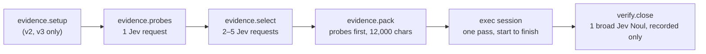
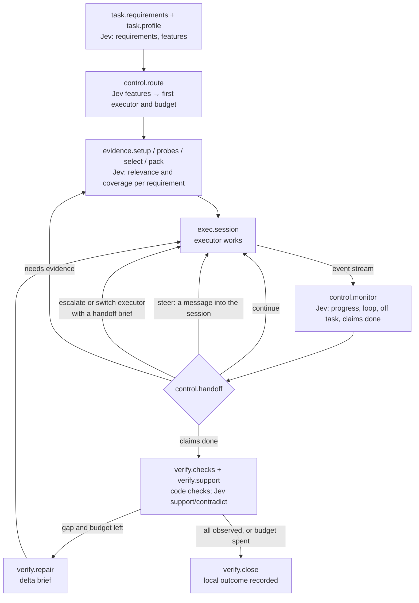

# Coder as a tunable system

Status: design, 2026-09-22. It specializes the
[optimization design](README.md) for Coder One on Terminal-Bench, using the
measurements on [the results page](../terminal-bench/README.md). No new
trial ran for this document. The only new numbers are the oracle portfolio
figures below, computed from retained trials.

## The goal

**Coder, as a system, is the cheapest and the best on every task.** The
agent, model, reasoning effort, prompt, and workflow that achieve that may
differ from task to task and may change within a task. Coder succeeds when
it chooses and composes them well, not when one fixed configuration wins
everywhere.

Today we choose a configuration by hand, run it once from start to finish,
and compare arms afterward. We have no model of which configuration a task
needs, no way to change course mid-task, and no systematic way to measure,
compare, or improve the pieces. This document breaks the process into
separately tunable components, shows how today's flow composes a few of
them, describes the composition we want, and defines the measurement and
hill-climbing loop that moves it toward 100% of tasks at the lowest cost and
time.

## What today's evidence already says

Three findings from the 2026-09-22 trials set the direction.

**A per-task choice already beats every single configuration.** For each of
the eight tasks, take the cheapest configuration that passed all three of
its trials. That portfolio passes every task with every trial, for $0.0716
and 430 seconds of summed mean agent time. No single arm comes close on both
measures:

| Policy over the same eight tasks | Trials passed | Summed mean cost | Summed mean agent time |
| --- | --- | ---: | ---: |
| Jev-probe v3 → Luna, the cheapest single arm | 19/24 | $0.0285 | 420.2 s |
| Jev-probe v2 → lean Opus, five-minute cache, the best Opus arm | 24/24 | $0.4282 | 191.6 s |
| Claude Code on Opus 5.5 alone | 24/24 | $1.0863 | 306.4 s |
| **Oracle: the cheapest arm with 3 of 3 on each task** | **24/24** | **$0.0716** | 430.1 s |
| **Oracle: the fastest arm with 3 of 3 on each task** | **24/24** | $0.5137 | **174.5 s** |

The cheapest reliable choice is a Luna configuration on seven tasks (Luna
direct on two of them) and lean Opus on `cancel-async-tasks`, where no Luna
configuration passed all three trials. The oracle is an upper bound on routing over today's arms;
it is not a result anyone can run yet. It shows where the headroom is:
**choosing the configuration per task is worth more than any single change
we made today.**

**The executor dominates cost and time; Jev is nearly free by comparison.**
The delegate takes about 95% of agent time. A Jev request costs about
$0.0001 and takes 0.2 to 0.8 seconds. One Luna turn costs about $0.0004
and takes about 7 seconds; one low-effort Opus turn costs about $0.016 and
takes about 10 seconds. A Jev question that saves a single Luna turn pays
for itself about four times over, and one that saves an Opus turn, about 160
times. Today an episode makes four to seven Jev requests, all before or
after the executor runs. **We use Jev at the two ends of the process and
nowhere in the middle.**

**The wins came from code and structure, not wording.** Today's gains came
from removing the Gemini explorer, running probes, the tool list, reasoning
effort, the cache lifetime, and the setup step. The one text change with a
clear effect, v3's check directions, fixed Luna on one task and made Opus
50% slower on the same task. That matches the workspace's history in
[text optimization](../text-optimization.md): code transfers, prompts often
do not. Text stays a tunable surface, measured like everything else, but not
the first lever.

## First principles

1. **Optimize the policy, not one configuration.** The product is a policy
   that maps a task, and what Coder has observed so far, to the next action.
   A fixed configuration is a degenerate policy.
2. **Price every action in the same units.** Cost, agent time, wall time,
   and the probability of passing. A failed attempt still costs what it
   spent, plus whatever it costs to finish the task another way.
3. **Spend Jev wherever it's likely to save an executor turn or prevent a
   failure.** A Jev request is worth making when its expected saving is
   larger than its cost, and that's true at almost every decision point.
4. **Information beats instruction.** Luna failed `log-summary-date-ranges`
   because the briefing omitted the log lines Jev had selected, not because
   it lacked a direction to be careful. Give an executor the evidence a
   requirement needs before telling it how to behave.
5. **A completion claim needs an observation.** A final report, a delegate's
   exit code, and a broad "is it done?" probability don't show that a
   requirement holds. Check what exists: the files, the outputs, the tests.
6. **Plans are hypotheses; revise them.** Choose a first configuration from
   what the task looks like, and change course when the evidence says the
   choice was wrong: stalls, repeated errors, a failed check.
7. **Every component is swappable and measured on its own.** A reward per
   trial is too coarse to credit a component. Record what each component
   received, returned, cost, and changed, in the trace.
8. **Pin everything, change one thing at a time, and state the noise.**
   Three trials per task can't tell 3/3 from 2/3 apart with confidence.
   Report the denominator and the interval, and keep a held-out task set for
   confirmation.
9. **Measure the whole wait.** Agent setup averaged 273 seconds against 52.5
   seconds of agent work for v3 Luna. Setup is part of the time a user waits
   and part of every experiment's wall time.
10. **Code owns control; Jev judges; executors generate.** A Jev probability
    informs a decision that code makes. It never grants authority, runs a
    command, or declares a task done by itself.
11. **Run before building.** Nine optimizer programs were built here, and
    one ran. Each step below runs on today's harness and data before any new
    framework exists.

## Vocabulary

This document uses the terms of the [optimization concepts](concepts.md) and
[NIP-OPT](../../nips/openagents/NIP-OPT.md):

- A **component** is one step of an episode with a **signature**: typed
  inputs, typed outputs, and a meaning that stays fixed.
- An **implementation** of a component is one concrete way to perform it,
  with its **parameters**: numbers, choices, text, and question sets.
  Changing a parameter makes a new implementation with a new digest.
- A **policy** is the composition: which components run, in what order or
  concurrently, under which conditions, and which implementation each uses.
  A policy is written in a **policy manifest**, a digested file.
- A **study** searches admitted parameters of a policy against an objective
  on a fixed task set, and a **promotion** adopts a measured candidate.

Components fall into four kinds by what performs them:

| Kind | Performed by | Cost scale | Examples |
| --- | --- | --- | --- |
| Operation | Deterministic Rust code | Milliseconds, no inference | Probes, packing, file checks |
| Judgment | Jev (Noul, Choice, Score) | About $0.0001 and under 1 s a request | Routing, relevance, progress, support |
| Session | An executor (Claude Code, Codex) | $0.0004 to $0.02 and 5 to 10 s a turn | Implementation, repair |
| Controller | The policy, in code | Free | Choosing the next component |

## The components

Each component below lists its signature, its tunable parameters, today's
setting, where Jev takes part, and the measurement that credits it. The IDs
are the names the manifest, the trace, and the Gym dashboard use.

### Understand the task

**`task.requirements` — requirement extractor.**

- **Signature:** task text → requirement map. Each entry holds a stable ID,
  the verbatim source span, a kind (deliverable, behavior, constraint,
  check), any exact path or command, and a state (`unobserved`, `observed`,
  `contradicted`, `unverifiable`).
- **Parameters:** span splitting rules, Jev questions per span ("does this
  span state a binding deliverable?", "is this example exhaustive?"),
  keep thresholds, and the cap on entries.
- **Today:** `judge::criteria` reads Markdown checkbox lines only, so all 24
  v3 Luna episodes had no requirements.
- **Measured by:** recall and precision against hand-labeled requirements on
  public task text, which can be scored offline with Jev only.

**`task.profile` — task profiler.**

- **Signature:** task text plus probe outputs → a feature vector of Jev
  answers.
- **Parameters:** the question battery. Candidates: does the task build or
  compile code; install packages; parse data files; recover git state; edit
  an existing file or create new ones; name its own test; involve
  concurrency. Also a Score for expected difficulty and a Choice for the
  cheapest executor likely to succeed.
- **Today:** absent.
- **Measured by:** how well the features predict the per-task outcome
  matrix, scored as the router's regret.

### Gather evidence

**`evidence.setup` — setup planner.**

- **Signature:** requirement map → setup operations run, with results.
- **Parameters:** extraction patterns, the Jev gate question and threshold,
  the time limit, and ordering.
- **Today:** v2 and v3 extract up to three `git clone` and `pip install`
  commands from code spans, gate them with one Jev request, and run them.
  It worked on `build-cython-ext` (p = 0.91). It runs command strings; a
  typed operation with enforced scope should replace that.
- **Measured by:** turns saved, setup errors, and evidence the clone makes
  visible.

**`evidence.probes` — probe battery.**

- **Signature:** workspace → typed captures, each with its command, exit
  code, content digest, truncation, and time.
- **Parameters:** the probe set, per-probe caps, conditional probes (git in
  named repositories, samples of data files), and the Jev keep question and
  threshold.
- **Today:** up to twelve read-only probes, one Jev request, and a 0.5 keep
  threshold.
- **Measured by:** evidence recall: whether the captures the executor went
  on to read or use were in the briefing.

**`evidence.select` — evidence selector.**

- **Signature:** requirement map, captures, and candidate files → a ranked
  set of evidence items, each tied to the requirements it informs.
- **Parameters:** pool size, batch size, relevance and edit questions,
  thresholds, per-item span size, and duplicate removal.
- **Today:** a 40-file pool judged in batches of 20 with two Nouls each, 0.5
  and 0.8 thresholds, ranked apart from the probes.
- **Measured by:** selection recall (needed evidence selected) and Jev cost.

**`evidence.pack` — briefing packer.**

- **Signature:** requirement map plus ranked evidence → a briefing within a
  character budget, with every omission named.
- **Parameters:** the budget, the section order, joint ranking across probes
  and files, space reserved for task text and data samples, and span
  trimming.
- **Today:** probes first, then files, whole sections until 12,000
  characters. In all three failed v3 `log-summary-date-ranges` runs, three
  directory listings filled the budget and every log excerpt Jev selected
  was dropped. A 16,038-character `bottle.py` was selected for a
  12,000-character briefing and dropped every time.
- **Measured by:** delivered recall (needed evidence that reached the
  executor), omitted Jev-selected items, and duplicate bytes. All three can
  be computed offline from retained manifests.

### Execute

**`exec.profile` — executor profile.**

- **Signature:** a briefing → an executor session's configuration.
- **Parameters:** agent (Claude Code or Codex), model, reasoning effort,
  tool list, cache lifetime (`CLAUDE_CODE_PROMPT_CACHE_TTL`), deadline, and
  turn limit.
- **Today:** fixed per arm by hand. Measured options include Luna, Opus,
  Sonnet 5, and Haiku 4.5; low or default effort; six tools or all; one-hour
  or five-minute cache.
- **Measured by:** the per-task outcome matrix, which is the router's
  training data.

**`exec.system` — system prompt.** A separate component because it's large,
sent on every call, and never tuned.

- **Signature:** executor profile plus task profile → the system prompt text.
- **Parameters:** which sections to include, their wording, and the
  replacement mode (`--system-prompt-file` or `--append-system-prompt-file`
  for Claude Code; `model_instructions_file` or `developer_instructions` for
  Codex, which the pinned 0.155.1 binary recognizes but we haven't
  captured).
- **Today:** the default. [The captured request](../terminal-bench/claude-code-delegate-prompt/README.md)
  shows about 5,500 characters of system prompt plus 10,000 characters of
  tool definitions, cached for an hour on a subscription token.
- **Measured by:** first-call input tokens, cache-write cost, turns, and pass
  rate.

The default prompt, section by section:

| Section | Headless task relevance | Proposed status |
| --- | --- | --- |
| Identity line, role line | Needed | Keep; tunable wording |
| Security policy ("Assist with authorized security testing…") | A safety boundary | Protected: never removed or edited by a study |
| Harness notes: Markdown display, `<pasted_content>`, `file_path:line_number` | No reader, no paste, no links | Remove |
| Permission modes, system reminders, hooks | Partly relevant under `bypassPermissions` | Tune |
| Code style ("match its comment density…") | Relevant to edits | Keep; tunable |
| Pronoun guidance | No reader | Remove |
| Confirm hard-to-reverse actions | Conflicts with headless work, where nobody answers | Replace with the episode's own authority statement |
| Report outcomes faithfully | Relevant to the final report | Keep |
| Memory (writes memory files, about a third of the prompt) | Harmful: files outside the task | Remove |
| Model catalog, Claude Code surfaces, fast mode | Irrelevant | Remove |
| Context management | Rarely relevant to a short task | Tune |
| Commit-attribution reminder (a user message) | No commits | Remove |
| Environment block: working directory, platform, model, date, bypass-mode tool guidance | Needed | Keep; generated by code |

The system prompt then becomes a section library: protected sections, a
minimal headless core, and optional sections Jev selects per task ("does
this task need guidance on long builds?", "on data parsing?"). The five-minute
cache already showed that this surface has a measurable cost: one-hour cache
writes were more than half of the Opus arm's cost. A replaced prompt can
change behavior in ways nobody predicts, so it is measured, never assumed.

**`exec.directions` — task framing.**

- **Signature:** briefing → the directions paragraph the executor reads
  first.
- **Parameters:** the text, chosen per executor.
- **Today:** three fixed variants (standard, v2 batch, v3 checked).
  Measured: v3 fixed Luna's `build-cython-ext` and slowed Opus on it. That
  interaction is why directions must be per executor.

**`exec.session` — session control.**

- **Signature:** a running session → start, resume, steer, interrupt, fork,
  or stop.
- **Parameters:** checkpoint interval, steering-message templates, and
  interrupt rules.
- **Today:** one session per episode, start to finish.
- **Available now:** Claude Code 2.1.280 has `--session-id`, `--resume`,
  `--fork-session`, and `--input-format stream-json`, which accepts
  messages into a running print-mode session. Codex 0.155.1 has
  `codex exec resume`. Both stream every event as JSON, which the episode
  already records. Both accept MCP servers (`--mcp-config`; Codex's `mcp`),
  so a host server could expose Jev-backed evidence lookups inside a
  session. Each needs a capture test before a policy relies on it.

### Control the episode

**`control.route` — router.**

- **Signature:** task profile → an initial executor profile and a budget.
- **Parameters:** the decision rule. Start with a lookup keyed by Jev
  features; move to a fitted model once there are enough tasks.
- **Today:** a person picks the arm.
- **Measured by:** regret, meaning the chosen configuration's effective cost
  (defined in [The objective](#the-objective)) minus the oracle's, per task.

**`control.monitor` — concurrent monitor.**

- **Signature:** the executor's event stream so far, plus the requirement
  map → typed judgments: making progress, repeating a failing approach,
  reading evidence the briefing already holds, claiming completion, gone
  off task.
- **Parameters:** trigger (every N events, every T seconds, on specific
  event types), the question set, and thresholds.
- **Today:** absent. The streams exist: Codex's `--json` items and Claude
  Code's `stream-json` events are already written to disk.
- **Measured by:** replaying retained streams offline and scoring when the
  monitor would have fired against what happened next. That costs only Jev.

**`control.handoff` — handoff policy.**

- **Signature:** monitor judgments, check results, and the budget → one
  action: continue, steer, escalate to another executor, split the work, or
  stop.
- **Parameters:** escalation thresholds, the target executor, what the
  handoff brief carries (requirement states, diff, last errors), and caps on
  the number of handoffs.
- **Today:** absent.

**`control.budget` — budget controller.**

- **Signature:** spend and time so far → remaining allowance per component.
- **Parameters:** cost and time ceilings, and the value of time (λ in [The
  objective](#the-objective)).

### Verify and finish

**`verify.checks` — artifact checker.**

- **Signature:** requirement map plus workspace → observations per
  requirement: file exists, parses, has the named rows or keys; the named
  test passes.
- **Parameters:** the check catalog and how checks are chosen for each
  requirement.
- **Today:** absent. The close step sees `git diff` or a note that changes
  aren't listed.
- **Measured by:** false accepts and false rejects against the verifier's
  reward on retained attempts.

**`verify.support` — Jev support judge.**

- **Signature:** requirement, artifact excerpt, and check output → separate
  Nouls for "supports" and "contradicts".
- **Today:** one broad "done" Noul. On v3's 24 trials, a 0.5 cutoff on that
  judgment would have accepted all five failures and rejected four passes.

**`verify.repair` — repair.**

- **Signature:** unresolved requirements, their evidence, and the budget → a
  delta brief and one more executor session, then a recheck.
- **Parameters:** repair count, the brief's contents, and which executor
  repairs.

**`verify.close` — closer.** Records the local outcome beside, and never in
place of, Harbor's reward.

### Infrastructure inside the objective

**`infra.setup` — agent installation.** Not an agent decision, but 77% of a
v3 Luna trial's elapsed time and the cause of every setup timeout. Prebuilt
install layers reused across fresh task environments would cut both.

**`infra.record` — evidence retention.** Every component writes one trace
step with its component ID, implementation digest, input digest, output,
cost, and latency. The executor's native stream is retained with the
episode.

## How today's flow composes these

The two best configurations use the same straight line with different
settings:

| Component | v3 → Luna | v2 → lean Opus, five-minute cache |
| --- | --- | --- |
| `task.requirements` | Checkbox lines (none found) | Same |
| `task.profile`, `control.route` | None; a person picked the arm | Same |
| `evidence.setup` | Jev-gated clone and install | Same |
| `evidence.probes`, `evidence.select` | Probe battery, 40-file survey | Same |
| `evidence.pack` | Probes first, 12,000 characters | Same |
| `exec.profile` | Codex 0.155.1, GPT-6 Luna, default effort | Claude Code 2.1.280, Opus 5.5, low effort, six tools, five-minute cache |
| `exec.system` | Codex default | Claude Code default |
| `exec.directions` | v3 checked | v2 batch |
| `exec.session`, `control.monitor`, `control.handoff` | One session; no monitor; no handoff | Same |
| `verify.checks`, `verify.repair` | None | None |
| `verify.close` | One broad Noul, recorded only | Same |

Jev answers four to seven requests per episode, all before or after the
session. Nothing observes the session while it runs, nothing can change the
choice of executor, and nothing checks the files the task asked for.

## The composition we want

An episode becomes an event loop over shared state rather than a straight
line. The state holds the requirement map, the evidence store, the
workspace's artifacts, open sessions, and the budget. Events come from
probes, the executor's stream, checks, and timers. After each event, the
controller picks the next action from the components above.

The loop allows many compositions without new code for each. Every pattern
is a policy manifest, so each can be measured against the others:

| Pattern | What happens | Where it should win |
| --- | --- | --- |
| Single pass | Today's line. | Tasks the router is sure about |
| Escalate on stall | Luna starts. When the monitor judges no progress or a repeated failure, Opus continues from a handoff brief of requirement states, the diff, and the last errors. | `cancel-async-tasks`, where Luna is cheap but unreliable |
| Planner and worker | Opus writes a plan and the checks in one short session; Luna implements; code runs the checks. | Build-heavy tasks where Luna takes 19 turns |
| Race | Two cheap sessions start; the first to pass the checks wins and the other stops. | Unreliable cheap tasks where time matters |
| Implement, check, repair | One session, host checks, and at most one targeted repair. | Missed deliverables like `/app/vim.txt` |
| Evidence on demand | Sessions call a host MCP tool that asks Jev for evidence, or the monitor spots a missing capture and the host adds it with a steering message. | Data-parsing tasks like `log-summary-date-ranges` |
| Steer in place | A message streamed into the running session, for example "the briefing's log sample shows the severity is the third field", without restarting. | Early drift the monitor catches |

Two rules keep this safe. Every handoff and repair spends from the one
episode budget; nothing gets a fresh allowance. And Harbor's verifier stays
outside the loop: local checks guide repairs, and the protected grade never
feeds back into an episode.

### Jev throughout, not at the ends

Every arrow above is a place for a typed judgment. A starting question
battery, each question with a consumer in code:

| Component | Question | Type | Consumer |
| --- | --- | --- | --- |
| `task.requirements` | Does this span state a binding deliverable, behavior, or constraint? | Noul per span | Keep the span in the requirement map |
| `task.profile` | Does the task build or compile code? Parse data files? Recover git state? | Noul each | Router features |
| `task.profile` | Which is the cheapest executor likely to finish this task? | Choice: Luna, Sonnet, Opus | Router feature, checked against the outcome matrix |
| `task.profile` | How hard is this task? | Score | Budget and escalation thresholds |
| `evidence.select` | Does this capture help decide requirement r? | Noul per pair | Pack for coverage |
| `evidence.pack` | Does this trimmed view keep the distinction requirement r needs? | Noul | Choose span size |
| `control.monitor` | Is the agent making progress on an open requirement? | Noul | Handoff |
| `control.monitor` | Is it repeating a failing approach? | Noul | Steer or escalate |
| `control.monitor` | Is it re-reading evidence the briefing holds? | Noul | Steering message |
| `control.monitor` | Does it claim the task is done? | Noul | Trigger checks early |
| `verify.support` | Does this artifact support requirement r? Does it contradict it? | Two Nouls | Repair or close |
| `exec.system` | Does this task need optional section s? | Noul per section | Assemble the prompt |

At about $0.0001 a request, a monitor asking four questions after every
event of a 20-turn Luna session adds about $0.002. That is worth it if it
saves two Luna turns or one failed attempt.

## The objective

A single number per task lets the router, the handoff policy, and the
optimizer agree. For a policy π on task t:

- p(π, t) is the probability of passing, estimated from trials.
- c(π, t) and w(π, t) are the mean cost and mean wall time per attempt,
  including failures, handoffs, and Jev.
- F is the fallback: the most reliable known policy for t, with its own cost
  and time.
- λ is the operator's price of a second, a setting, not a measurement.

**Effective cost:** J(π, t) = c + λ·w + (1 − p)·(c_F + λ·w_F).

A failure is charged the cost of finishing the task another way, so a cheap
unreliable policy doesn't look better than it is. With λ = 0, J ranks by
money alone; raising λ moves the choice toward faster executors. The goal
"cheapest and best" becomes: minimize the sum of J over tasks, subject to
the pass rate staying at the best any policy achieves on each task.

Report p with its denominator and Wilson interval, and J with its spread.
Three trials can't separate 3/3 from 2/3 with confidence, so a promotion
needs more trials than a screen.

## The hill-climbing system

A study proposes candidate policies, measures them, keeps the useful ones,
and compiles what it learns into the router. It builds on the harness,
Gym, and the [experiment rules](experiments.md) that already exist.

### The search space

The policy manifest names each component's implementation and parameters:
numbers (thresholds, caps, budgets), choices (executor, effort, tools, cache,
packer version), text (system prompt sections, directions, Jev question
sets), and the router table. The manifest's digest identifies the candidate
in every trace and every Gym row. Environment variables such as
`CODER_ONE_PROBE_V2` become manifest fields, so arm names stop carrying the
configuration.

### Four tiers of evaluation, cheapest first

| Tier | What runs | Cost per candidate | What it can score |
| --- | --- | --- | --- |
| 0. Replay | Jev and code over retained traces; no executor | Cents | Requirement recall, evidence and delivered recall, monitor timing on retained streams, check accuracy on retained artifacts, router regret on the outcome matrix |
| 1. Screen | One trial per task, cheap executors, hardest tasks first | About $0.01–0.10 | Gross failures and large gains |
| 2. Measure | Three trials per task on the development tasks | $0.09 for Luna, about $1.30 for Opus | J and pass rate with intervals |
| 3. Confirm | Frozen candidate on held-out tasks | Same scale | The only evidence for promotion |

Most search happens in tier 0, which exists because every episode keeps its
trace. A candidate reaches tier 2 only after it earns it lower down
(successive halving). Wall time, not money, limits tiers 1 to 3: at 273
seconds of setup per trial, fixing `infra.setup` is the first speedup for
the optimizer itself.

### How candidates are proposed

- **Parameter search** for numbers and choices: grid or Bayesian search,
  one component at a time.
- **Component swaps**: a new packer, a new check catalog, measured against
  the incumbent with everything else fixed.
- **Reflective text edits** for text parameters, in the style of GEPA: a
  strong model reads failing traces and per-component metrics and proposes
  an edited section. It never sees the verifier's tests.
- **Router refits** from the growing outcome matrix.

### A per-task frontier becomes the router

Keep an archive of candidates, and for each task keep every candidate that
is not beaten on pass rate, cost, and time at once: the task's Pareto
frontier. This is GEPA's selection rule applied across tasks, and it has a
direct product meaning. The union of the frontiers is the portfolio, and
**the router's job is to index it**: predict, from Jev's task features,
which frontier entry has the lowest J for a new task. Router training data
is the outcome matrix; its evaluation is leave-one-task-out regret. Once
there are enough labeled tasks, the same labels can train a tenant decision
model through `tenancy::training`, so routing becomes a single Jev-style
call.

### Guardrails from nine earlier attempts

- Measure the baseline's headroom before writing a candidate.
- Report development and held-out results separately; a win found on
  development tasks is not a win.
- Call an algorithm by its real name. A hand edit is not GEPA.
- Keep the security policy, the verifier, the budget, and the acceptance
  rule outside every candidate's writable set.
- Record every candidate, including losers and their spend.

## Is DSPy the tool?

DSPy's ideas fit; its runtime doesn't. The [optimization
design](concepts.md) already adopted the ideas, and this is how they map
onto Coder:

| DSPy | Coder |
| --- | --- |
| Signature | A component's signature |
| Module | A component's implementation |
| Program | A policy manifest, run by the episode's controller |
| Metric | Effective cost J, with Harbor's reward as the pass signal |
| Optimizer | The study: parameter search, swaps, reflective edits, router fits |
| GEPA's Pareto frontier over examples | The per-task frontier that becomes the router |

What doesn't transfer:

- **DSPy assumes it makes the model calls.** Our expensive steps are
  black-box executors that run for minutes, not prompts DSPy can rewrite.
- **Most of our parameters aren't prompts.** Executor, effort, tools, cache,
  thresholds, packing, and control flow carried today's gains.
- **Jev isn't prompted by free text.** Its "prompt" is a question set and
  state, which the Gym already versions separately (`crates/gym/questions/`).
- **Product code is Rust.** DSPy and GEPA can run as pinned, offline Python
  tooling that proposes text candidates and hands them to the Rust runner,
  as [OPT-03](proposed-issues.md#opt-03-build-a-bounded-dspy-and-gepa-authoring-bridge)
  plans. They don't run inside an episode.

So: borrow signatures, composition, metric-driven search, and GEPA's
frontier. Use GEPA itself only for the text surfaces, the system prompt
sections and directions, and only after the structural levers are measured.

## What the Gym dashboard needs to show

Issues [#9533](https://github.com/OpenAgentsInc/openagents/issues/9533) and
[#9534](https://github.com/OpenAgentsInc/openagents/issues/9534) built the
read-only Terminal-Bench area of the Gym TUI and the matching `gym
terminal-bench` CLI: overview, comparison, attempt, evidence, history, and
runbooks. They already read the retained traces, Coder One's component
costs, and evidence digests. To follow the work above, the Gym needs views
keyed by policy and component rather than by arm name:

| View | Shows | Needs from the episode |
| --- | --- | --- |
| **Outcome matrix** | Task × policy: passes over trials with a Wilson interval, mean cost, mean time, J. Each task's frontier marked; oracle rows for cheapest and fastest. | The policy manifest digest on every attempt |
| **Router** | Per task: Jev's feature answers, the router's pick, the oracle's pick, and regret. | `task.profile` answers in the trace |
| **Episode timeline** | One attempt as a timeline: setup, every Jev request, each executor turn, monitor judgments, handoffs, checks, repairs, and cost accumulating. | Component ID, start, end, and cost on every trace step |
| **Components** | Per component across attempts: calls, cost, latency, and its own metric (delivered recall, omitted items, check false accepts, monitor precision). | The same step records |
| **Live** | In-progress attempts, refreshed: the current component, the executor's latest events, the monitor's latest judgments, spend so far. | The bundle the episode already rewrites before every step |
| **Study** | Candidates by generation: tier reached, development and held-out results, frontier membership, promotions, and total study spend. | Study records per [NIP-OPT](../../nips/openagents/NIP-OPT.md) |

The live view needs no new data source: Coder One rewrites its episode
bundle before every step so a killed episode keeps its evidence, and the Gym
can read that bundle while the trial runs.

## Plan

Each phase runs on today's harness and ends in a measurement.

1. **Record components and fix setup.** Give every trace step a component ID
   and implementation digest; retain executor streams; replace the arm's
   environment variables with a policy manifest that reproduces v3 → Luna
   and v2 → lean Opus exactly. Prebuild agent installation layers and report
   setup time separately. Add the outcome-matrix and timeline views.
2. **Replay studies, Jev only.** Build `task.requirements`, the joint packer,
   and `task.profile`. Score requirement recall, delivered recall, and
   router regret on the 216 retained trials. Screen the winners live on
   Luna.
3. **Close the loop on one task family.** Add `verify.checks`,
   `verify.support`, and one repair. Measure on the failures we have:
   `log-summary-date-ranges`, `cancel-async-tasks`, `headless-terminal`.
4. **Interleave.** Add `control.monitor` (replayed on retained streams
   first), then escalate-on-stall and planner-worker. Compare them against
   single-pass policies in the outcome matrix.
5. **Tune the system prompt.** Capture both executors' requests, build the
   minimal headless core and the section library, and measure it against
   the default on both executors.
6. **Route.** Expand the task pool beyond the eight development tasks with
   Terminal-Bench tasks we haven't used, keep a frozen held-out set, fit the
   router on the frontier, and confirm on held-out tasks. The target is the
   oracle's pass rate at a cost near the oracle's.

Phase 1's manifest and component records are prerequisites for everything
after it; phases 2 to 5 can run in parallel once they exist.

## Related documents

- [Winning-runs analysis](../terminal-bench/winning-runs-analysis.md) and
  the v2, v3, and five-minute-cache results.
- [Luna Jev-probe upgrade assessment](../terminal-bench/2026-09-22-luna-jevprobe-upgrade.md):
  the requirement, evidence, check, and repair findings that phases 2 and 3
  build on.
- [Optimization concepts](concepts.md), [architecture](architecture.md),
  [experiments](experiments.md), and the [unfiled OPT backlog](proposed-issues.md).
- [Text optimization history](../text-optimization.md): why the plan runs
  before it builds.
- [Gym Terminal-Bench views](../gym/terminal-bench-tui.md) and
  [CLI](../gym/terminal-bench-cli.md).
