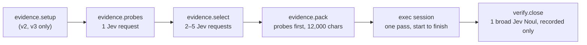
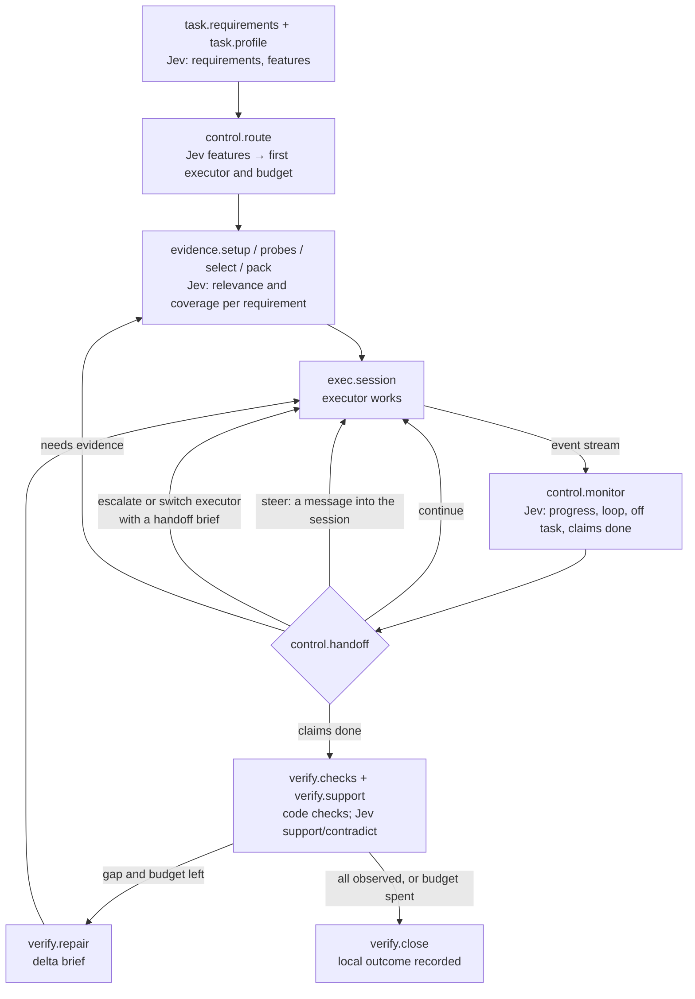

# Coder as a tunable system

Status: design, 2026-09-22. It specializes the
[optimization design](README.md) for Coder One on Terminal-Bench, using the
measurements on [the results page](../terminal-bench/README.md). No new
trial ran for this document. The only new numbers are the oracle portfolio
figures below, computed from retained trials.

## The goal

**Coder, as a system, is the cheapest and the best on every task.** The
agent, model, reasoning effort, prompt, and workflow that achieve that may
differ from task to task and may change within a task. Coder succeeds when
it chooses and composes them well, not when one fixed configuration wins
everywhere.

Today we choose a configuration by hand, run it once from start to finish,
and compare arms afterward. We have no model of which configuration a task
needs, no way to change course mid-task, and no systematic way to measure,
compare, or improve the pieces. This document breaks the process into
separately tunable components, shows how today's flow composes a few of
them, describes the composition we want, and defines the measurement and
hill-climbing loop that moves it toward 100% of tasks at the lowest cost and
time.

## What today's evidence already says

Three findings from the 2026-09-22 trials set the direction.

**A per-task choice already beats every single configuration.** For each of
the eight tasks, take the cheapest configuration that passed all three of
its trials. That portfolio passes every task with every trial, for $0.0716
and 430 seconds of summed mean agent time. No single arm comes close on both
measures:

| Policy over the same eight tasks | Trials passed | Summed mean cost | Summed mean agent time |
| --- | --- | ---: | ---: |
| Jev-probe v3 → Luna, the cheapest single arm | 19/24 | $0.0285 | 420.2 s |
| Jev-probe v2 → lean Opus, five-minute cache, the best Opus arm | 24/24 | $0.4282 | 191.6 s |
| Claude Code on Opus 5.5 alone | 24/24 | $1.0863 | 306.4 s |
| **Oracle: the cheapest arm with 3 of 3 on each task** | **24/24** | **$0.0716** | 430.1 s |
| **Oracle: the fastest arm with 3 of 3 on each task** | **24/24** | $0.5137 | **174.5 s** |

The cheapest reliable choice is a Luna configuration on seven tasks (Luna
direct on two of them) and lean Opus on `cancel-async-tasks`, where no Luna
configuration passed all three trials. The oracle is an upper bound on routing over today's arms;
it is not a result anyone can run yet. It shows where the headroom is:
**choosing the configuration per task is worth more than any single change
we made today.**

**The executor dominates cost and time; Jev is nearly free by comparison.**
The delegate takes about 95% of agent time. A Jev request costs about
$0.0001 and takes 0.2 to 0.8 seconds. One Luna turn costs about $0.0004
and takes about 7 seconds; one low-effort Opus turn costs about $0.016 and
takes about 10 seconds. A Jev question that saves a single Luna turn pays
for itself about four times over, and one that saves an Opus turn, about 160
times. Today an episode makes four to seven Jev requests, all before or
after the executor runs. **We use Jev at the two ends of the process and
nowhere in the middle.**

**The wins came from code and structure, not wording.** Today's gains came
from removing the Gemini explorer, running probes, the tool list, reasoning
effort, the cache lifetime, and the setup step. The one text change with a
clear effect, v3's check directions, fixed Luna on one task and made Opus
50% slower on the same task. That matches the workspace's history in
[text optimization](../text-optimization.md): code transfers, prompts often
do not. Text stays a tunable surface, measured like everything else, but not
the first lever.

## First principles

1. **Optimize the policy, not one configuration.** The product is a policy
   that maps a task, and what Coder has observed so far, to the next action.
   A fixed configuration is a degenerate policy.
2. **Price every action in the same units.** Cost, agent time, wall time,
   and the probability of passing. A failed attempt still costs what it
   spent, plus whatever it costs to finish the task another way.
3. **Spend Jev wherever it's likely to save an executor turn or prevent a
   failure.** A Jev request is worth making when its expected saving is
   larger than its cost, and that's true at almost every decision point.
4. **Information beats instruction.** Luna failed `log-summary-date-ranges`
   because the briefing omitted the log lines Jev had selected, not because
   it lacked a direction to be careful. Give an executor the evidence a
   requirement needs before telling it how to behave.
5. **A completion claim needs an observation.** A final report, a delegate's
   exit code, and a broad "is it done?" probability don't show that a
   requirement holds. Check what exists: the files, the outputs, the tests.
6. **Plans are hypotheses; revise them.** Choose a first configuration from
   what the task looks like, and change course when the evidence says the
   choice was wrong: stalls, repeated errors, a failed check.
7. **Every component is swappable and measured on its own.** A reward per
   trial is too coarse to credit a component. Record what each component
   received, returned, cost, and changed, in the trace.
8. **Pin everything, change one thing at a time, and state the noise.**
   Three trials per task can't tell 3/3 from 2/3 apart with confidence.
   Report the denominator and the interval, and keep a held-out task set for
   confirmation.
9. **Measure the whole wait.** Agent setup averaged 273 seconds against 52.5
   seconds of agent work for v3 Luna. Setup is part of the time a user waits
   and part of every experiment's wall time.
10. **Code owns control; Jev judges; executors generate.** A Jev probability
    informs a decision that code makes. It never grants authority, runs a
    command, or declares a task done by itself.
11. **Run before building.** Nine optimizer programs were built here, and
    one ran. Each step below runs on today's harness and data before any new
    framework exists.

## Vocabulary

This document uses the terms of the [optimization concepts](concepts.md) and
[NIP-OPT](../../nips/openagents/NIP-OPT.md):

- A **component** is one step of an episode with a **signature**: typed
  inputs, typed outputs, and a meaning that stays fixed.
- An **implementation** of a component is one concrete way to perform it,
  with its **parameters**: numbers, choices, text, and question sets.
  Changing a parameter makes a new implementation with a new digest.
- A **policy** is the composition: which components run, in what order or
  concurrently, under which conditions, and which implementation each uses.
  A policy is written in a **policy manifest**, a digested file.
- A **study** searches admitted parameters of a policy against an objective
  on a fixed task set, and a **promotion** adopts a measured candidate.

Components fall into four kinds by what performs them:

| Kind | Performed by | Cost scale | Examples |
| --- | --- | --- | --- |
| Operation | Deterministic Rust code | Milliseconds, no inference | Probes, packing, file checks |
| Judgment | Jev (Noul, Choice, Score) | About $0.0001 and under 1 s a request | Routing, relevance, progress, support |
| Session | An executor (Claude Code, Codex) | $0.0004 to $0.02 and 5 to 10 s a turn | Implementation, repair |
| Controller | The policy, in code | Free | Choosing the next component |

## The components

Each component below lists its signature, its tunable parameters, today's
setting, where Jev takes part, and the measurement that credits it. The IDs
are the names the manifest, the trace, and the Gym dashboard use.

### Understand the task

**`task.requirements` — requirement extractor.**

- **Signature:** task text → requirement map. Each entry holds a stable ID,
  the verbatim source span, a kind (deliverable, behavior, constraint,
  check), any exact path or command, and a state (`unobserved`, `observed`,
  `contradicted`, `unverifiable`).
- **Parameters:** span splitting rules, Jev questions per span ("does this
  span state a binding deliverable?", "is this example exhaustive?"),
  keep thresholds, and the cap on entries.
- **Today:** `judge::criteria` reads Markdown checkbox lines only, so all 24
  v3 Luna episodes had no requirements.
- **Measured by:** recall and precision against hand-labeled requirements on
  public task text, which can be scored offline with Jev only.

**`task.profile` — task profiler.**

- **Signature:** task text plus probe outputs → a feature vector of Jev
  answers.
- **Parameters:** the question battery. Candidates: does the task build or
  compile code; install packages; parse data files; recover git state; edit
  an existing file or create new ones; name its own test; involve
  concurrency. Also a Score for expected difficulty and a Choice for the
  cheapest executor likely to succeed.
- **Today:** absent.
- **Measured by:** how well the features predict the per-task outcome
  matrix, scored as the router's regret.

### Gather evidence

**`evidence.setup` — setup planner.**

- **Signature:** requirement map → setup operations run, with results.
- **Parameters:** extraction patterns, the Jev gate question and threshold,
  the time limit, and ordering.
- **Today:** v2 and v3 extract up to three `git clone` and `pip install`
  commands from code spans, gate them with one Jev request, and run them.
  It worked on `build-cython-ext` (p = 0.91). It runs command strings; a
  typed operation with enforced scope should replace that.
- **Measured by:** turns saved, setup errors, and evidence the clone makes
  visible.

**`evidence.probes` — probe battery.**

- **Signature:** workspace → typed captures, each with its command, exit
  code, content digest, truncation, and time.
- **Parameters:** the probe set, per-probe caps, conditional probes (git in
  named repositories, samples of data files), and the Jev keep question and
  threshold.
- **Today:** up to twelve read-only probes, one Jev request, and a 0.5 keep
  threshold.
- **Measured by:** evidence recall: whether the captures the executor went
  on to read or use were in the briefing.

**`evidence.select` — evidence selector.**

- **Signature:** requirement map, captures, and candidate files → a ranked
  set of evidence items, each tied to the requirements it informs.
- **Parameters:** pool size, batch size, relevance and edit questions,
  thresholds, per-item span size, and duplicate removal.
- **Today:** a 40-file pool judged in batches of 20 with two Nouls each, 0.5
  and 0.8 thresholds, ranked apart from the probes.
- **Measured by:** selection recall (needed evidence selected) and Jev cost.

**`evidence.pack` — briefing packer.**

- **Signature:** requirement map plus ranked evidence → a briefing within a
  character budget, with every omission named.
- **Parameters:** the budget, the section order, joint ranking across probes
  and files, space reserved for task text and data samples, and span
  trimming.
- **Today:** probes first, then files, whole sections until 12,000
  characters. In all three failed v3 `log-summary-date-ranges` runs, three
  directory listings filled the budget and every log excerpt Jev selected
  was dropped. A 16,038-character `bottle.py` was selected for a
  12,000-character briefing and dropped every time.
- **Measured by:** delivered recall (needed evidence that reached the
  executor), omitted Jev-selected items, and duplicate bytes. All three can
  be computed offline from retained manifests.

### Execute

**`exec.profile` — executor profile.**

- **Signature:** a briefing → an executor session's configuration.
- **Parameters:** agent (Claude Code or Codex), model, reasoning effort,
  tool list, cache lifetime (`CLAUDE_CODE_PROMPT_CACHE_TTL`), deadline, and
  turn limit.
- **Today:** fixed per arm by hand. Measured options include Luna, Opus,
  Sonnet 5, and Haiku 4.5; low or default effort; six tools or all; one-hour
  or five-minute cache.
- **Measured by:** the per-task outcome matrix, which is the router's
  training data.

**`exec.system` — system prompt.** A separate component because it's large,
sent on every call, and never tuned.

- **Signature:** executor profile plus task profile → the system prompt text.
- **Parameters:** which sections to include, their wording, and the
  replacement mode (`--system-prompt-file` or `--append-system-prompt-file`
  for Claude Code; `model_instructions_file` or `developer_instructions` for
  Codex, which the pinned 0.155.1 binary recognizes but we haven't
  captured).
- **Today:** the default. [The captured request](../terminal-bench/claude-code-delegate-prompt/README.md)
  shows about 5,500 characters of system prompt plus 10,000 characters of
  tool definitions, cached for an hour on a subscription token.
- **Measured by:** first-call input tokens, cache-write cost, turns, and pass
  rate.

The default prompt, section by section:

| Section | Headless task relevance | Proposed status |
| --- | --- | --- |
| Identity line, role line | Needed | Keep; tunable wording |
| Security policy ("Assist with authorized security testing…") | A safety boundary | Protected: never removed or edited by a study |
| Harness notes: Markdown display, `<pasted_content>`, `file_path:line_number` | No reader, no paste, no links | Remove |
| Permission modes, system reminders, hooks | Partly relevant under `bypassPermissions` | Tune |
| Code style ("match its comment density…") | Relevant to edits | Keep; tunable |
| Pronoun guidance | No reader | Remove |
| Confirm hard-to-reverse actions | Conflicts with headless work, where nobody answers | Replace with the episode's own authority statement |
| Report outcomes faithfully | Relevant to the final report | Keep |
| Memory (writes memory files, about a third of the prompt) | Harmful: files outside the task | Remove |
| Model catalog, Claude Code surfaces, fast mode | Irrelevant | Remove |
| Context management | Rarely relevant to a short task | Tune |
| Commit-attribution reminder (a user message) | No commits | Remove |
| Environment block: working directory, platform, model, date, bypass-mode tool guidance | Needed | Keep; generated by code |

The system prompt then becomes a section library: protected sections, a
minimal headless core, and optional sections Jev selects per task ("does
this task need guidance on long builds?", "on data parsing?"). The five-minute
cache already showed that this surface has a measurable cost: one-hour cache
writes were more than half of the Opus arm's cost. A replaced prompt can
change behavior in ways nobody predicts, so it is measured, never assumed.

**`exec.directions` — task framing.**

- **Signature:** briefing → the directions paragraph the executor reads
  first.
- **Parameters:** the text, chosen per executor.
- **Today:** three fixed variants (standard, v2 batch, v3 checked).
  Measured: v3 fixed Luna's `build-cython-ext` and slowed Opus on it. That
  interaction is why directions must be per executor.

**`exec.session` — session control.**

- **Signature:** a running session → start, resume, steer, interrupt, fork,
  or stop.
- **Parameters:** checkpoint interval, steering-message templates, and
  interrupt rules.
- **Today:** one session per episode, start to finish.
- **Available now:** Claude Code 2.1.280 has `--session-id`, `--resume`,
  `--fork-session`, and `--input-format stream-json`, which accepts
  messages into a running print-mode session. Codex 0.155.1 has
  `codex exec resume`. Both stream every event as JSON, which the episode
  already records. Both accept MCP servers (`--mcp-config`; Codex's `mcp`),
  so a host server could expose Jev-backed evidence lookups inside a
  session. Each needs a capture test before a policy relies on it.

### Control the episode

**`control.route` — router.**

- **Signature:** task profile → an initial executor profile and a budget.
- **Parameters:** the decision rule. Start with a lookup keyed by Jev
  features; move to a fitted model once there are enough tasks.
- **Today:** a person picks the arm.
- **Measured by:** regret, meaning the chosen configuration's effective cost
  (defined in [The objective](#the-objective)) minus the oracle's, per task.

**`control.monitor` — concurrent monitor.**

- **Signature:** the executor's event stream so far, plus the requirement
  map → typed judgments: making progress, repeating a failing approach,
  reading evidence the briefing already holds, claiming completion, gone
  off task.
- **Parameters:** trigger (every N events, every T seconds, on specific
  event types), the question set, and thresholds.
- **Today:** absent. The streams exist: Codex's `--json` items and Claude
  Code's `stream-json` events are already written to disk.
- **Measured by:** replaying retained streams offline and scoring when the
  monitor would have fired against what happened next. That costs only Jev.

**`control.handoff` — handoff policy.**

- **Signature:** monitor judgments, check results, and the budget → one
  action: continue, steer, escalate to another executor, split the work, or
  stop.
- **Parameters:** escalation thresholds, the target executor, what the
  handoff brief carries (requirement states, diff, last errors), and caps on
  the number of handoffs.
- **Today:** absent.

**`control.budget` — budget controller.**

- **Signature:** spend and time so far → remaining allowance per component.
- **Parameters:** cost and time ceilings, and the value of time (λ in [The
  objective](#the-objective)).

### Verify and finish

**`verify.checks` — artifact checker.**

- **Signature:** requirement map plus workspace → observations per
  requirement: file exists, parses, has the named rows or keys; the named
  test passes.
- **Parameters:** the check catalog and how checks are chosen for each
  requirement.
- **Today:** absent. The close step sees `git diff` or a note that changes
  aren't listed.
- **Measured by:** false accepts and false rejects against the verifier's
  reward on retained attempts.

**`verify.support` — Jev support judge.**

- **Signature:** requirement, artifact excerpt, and check output → separate
  Nouls for "supports" and "contradicts".
- **Today:** one broad "done" Noul. On v3's 24 trials, a 0.5 cutoff on that
  judgment would have accepted all five failures and rejected four passes.

**`verify.repair` — repair.**

- **Signature:** unresolved requirements, their evidence, and the budget → a
  delta brief and one more executor session, then a recheck.
- **Parameters:** repair count, the brief's contents, and which executor
  repairs.

**`verify.close` — closer.** Records the local outcome beside, and never in
place of, Harbor's reward.

### Infrastructure inside the objective

**`infra.setup` — agent installation.** Not an agent decision, but 77% of a
v3 Luna trial's elapsed time and the cause of every setup timeout. Prebuilt
install layers reused across fresh task environments would cut both.

**`infra.record` — evidence retention.** Every component writes one trace
step with its component ID, implementation digest, input digest, output,
cost, and latency. The executor's native stream is retained with the
episode.

## How today's flow composes these

The two best configurations use the same straight line with different
settings:



| Component | v3 → Luna | v2 → lean Opus, five-minute cache |
| --- | --- | --- |
| `task.requirements` | Checkbox lines (none found) | Same |
| `task.profile`, `control.route` | None; a person picked the arm | Same |
| `evidence.setup` | Jev-gated clone and install | Same |
| `evidence.probes`, `evidence.select` | Probe battery, 40-file survey | Same |
| `evidence.pack` | Probes first, 12,000 characters | Same |
| `exec.profile` | Codex 0.155.1, GPT-6 Luna, default effort | Claude Code 2.1.280, Opus 5.5, low effort, six tools, five-minute cache |
| `exec.system` | Codex default | Claude Code default |
| `exec.directions` | v3 checked | v2 batch |
| `exec.session`, `control.monitor`, `control.handoff` | One session; no monitor; no handoff | Same |
| `verify.checks`, `verify.repair` | None | None |
| `verify.close` | One broad Noul, recorded only | Same |

Jev answers four to seven requests per episode, all before or after the
session. Nothing observes the session while it runs, nothing can change the
choice of executor, and nothing checks the files the task asked for.

## The composition we want

An episode becomes an event loop over shared state rather than a straight
line. The state holds the requirement map, the evidence store, the
workspace's artifacts, open sessions, and the budget. Events come from
probes, the executor's stream, checks, and timers. After each event, the
controller picks the next action from the components above.



The loop allows many compositions without new code for each. Every pattern
is a policy manifest, so each can be measured against the others:

| Pattern | What happens | Where it should win |
| --- | --- | --- |
| Single pass | Today's line. | Tasks the router is sure about |
| Escalate on stall | Luna starts. When the monitor judges no progress or a repeated failure, Opus continues from a handoff brief of requirement states, the diff, and the last errors. | `cancel-async-tasks`, where Luna is cheap but unreliable |
| Planner and worker | Opus writes a plan and the checks in one short session; Luna implements; code runs the checks. | Build-heavy tasks where Luna takes 19 turns |
| Race | Two cheap sessions start; the first to pass the checks wins and the other stops. | Unreliable cheap tasks where time matters |
| Implement, check, repair | One session, host checks, and at most one targeted repair. | Missed deliverables like `/app/vim.txt` |
| Evidence on demand | Sessions call a host MCP tool that asks Jev for evidence, or the monitor spots a missing capture and the host adds it with a steering message. | Data-parsing tasks like `log-summary-date-ranges` |
| Steer in place | A message streamed into the running session, for example "the briefing's log sample shows the severity is the third field", without restarting. | Early drift the monitor catches |

Two rules keep this safe. Every handoff and repair spends from the one
episode budget; nothing gets a fresh allowance. And Harbor's verifier stays
outside the loop: local checks guide repairs, and the protected grade never
feeds back into an episode.

### Jev throughout, not at the ends

Every arrow above is a place for a typed judgment. A starting question
battery, each question with a consumer in code:

| Component | Question | Type | Consumer |
| --- | --- | --- | --- |
| `task.requirements` | Does this span state a binding deliverable, behavior, or constraint? | Noul per span | Keep the span in the requirement map |
| `task.profile` | Does the task build or compile code? Parse data files? Recover git state? | Noul each | Router features |
| `task.profile` | Which is the cheapest executor likely to finish this task? | Choice: Luna, Sonnet, Opus | Router feature, checked against the outcome matrix |
| `task.profile` | How hard is this task? | Score | Budget and escalation thresholds |
| `evidence.select` | Does this capture help decide requirement r? | Noul per pair | Pack for coverage |
| `evidence.pack` | Does this trimmed view keep the distinction requirement r needs? | Noul | Choose span size |
| `control.monitor` | Is the agent making progress on an open requirement? | Noul | Handoff |
| `control.monitor` | Is it repeating a failing approach? | Noul | Steer or escalate |
| `control.monitor` | Is it re-reading evidence the briefing holds? | Noul | Steering message |
| `control.monitor` | Does it claim the task is done? | Noul | Trigger checks early |
| `verify.support` | Does this artifact support requirement r? Does it contradict it? | Two Nouls | Repair or close |
| `exec.system` | Does this task need optional section s? | Noul per section | Assemble the prompt |

At about $0.0001 a request, a monitor asking four questions after every
event of a 20-turn Luna session adds about $0.002. That is worth it if it
saves two Luna turns or one failed attempt.

## The objective

A single number per task lets the router, the handoff policy, and the
optimizer agree. For a policy π on task t:

- p(π, t) is the probability of passing, estimated from trials.
- c(π, t) and w(π, t) are the mean cost and mean wall time per attempt,
  including failures, handoffs, and Jev.
- F is the fallback: the most reliable known policy for t, with its own cost
  and time.
- λ is the operator's price of a second, a setting, not a measurement.

**Effective cost:** J(π, t) = c + λ·w + (1 − p)·(c_F + λ·w_F).

A failure is charged the cost of finishing the task another way, so a cheap
unreliable policy doesn't look better than it is. With λ = 0, J ranks by
money alone; raising λ moves the choice toward faster executors. The goal
"cheapest and best" becomes: minimize the sum of J over tasks, subject to
the pass rate staying at the best any policy achieves on each task.

Report p with its denominator and Wilson interval, and J with its spread.
Three trials can't separate 3/3 from 2/3 with confidence, so a promotion
needs more trials than a screen.

## The hill-climbing system

A study proposes candidate policies, measures them, keeps the useful ones,
and compiles what it learns into the router. It builds on the harness,
Gym, and the [experiment rules](experiments.md) that already exist.

### The search space

The policy manifest names each component's implementation and parameters:
numbers (thresholds, caps, budgets), choices (executor, effort, tools, cache,
packer version), text (system prompt sections, directions, Jev question
sets), and the router table. The manifest's digest identifies the candidate
in every trace and every Gym row. Environment variables such as
`CODER_ONE_PROBE_V2` become manifest fields, so arm names stop carrying the
configuration.

### Four tiers of evaluation, cheapest first

| Tier | What runs | Cost per candidate | What it can score |
| --- | --- | --- | --- |
| 0. Replay | Jev and code over retained traces; no executor | Cents | Requirement recall, evidence and delivered recall, monitor timing on retained streams, check accuracy on retained artifacts, router regret on the outcome matrix |
| 1. Screen | One trial per task, cheap executors, hardest tasks first | About $0.01–0.10 | Gross failures and large gains |
| 2. Measure | Three trials per task on the development tasks | $0.09 for Luna, about $1.30 for Opus | J and pass rate with intervals |
| 3. Confirm | Frozen candidate on held-out tasks | Same scale | The only evidence for promotion |

Most search happens in tier 0, which exists because every episode keeps its
trace. A candidate reaches tier 2 only after it earns it lower down
(successive halving). Wall time, not money, limits tiers 1 to 3: at 273
seconds of setup per trial, fixing `infra.setup` is the first speedup for
the optimizer itself.

### How candidates are proposed

- **Parameter search** for numbers and choices: grid or Bayesian search,
  one component at a time.
- **Component swaps**: a new packer, a new check catalog, measured against
  the incumbent with everything else fixed.
- **Reflective text edits** for text parameters, in the style of GEPA: a
  strong model reads failing traces and per-component metrics and proposes
  an edited section. It never sees the verifier's tests.
- **Router refits** from the growing outcome matrix.

### A per-task frontier becomes the router

Keep an archive of candidates, and for each task keep every candidate that
is not beaten on pass rate, cost, and time at once: the task's Pareto
frontier. This is GEPA's selection rule applied across tasks, and it has a
direct product meaning. The union of the frontiers is the portfolio, and
**the router's job is to index it**: predict, from Jev's task features,
which frontier entry has the lowest J for a new task. Router training data
is the outcome matrix; its evaluation is leave-one-task-out regret. Once
there are enough labeled tasks, the same labels can train a tenant decision
model through `tenancy::training`, so routing becomes a single Jev-style
call.

### Guardrails from nine earlier attempts

- Measure the baseline's headroom before writing a candidate.
- Report development and held-out results separately; a win found on
  development tasks is not a win.
- Call an algorithm by its real name. A hand edit is not GEPA.
- Keep the security policy, the verifier, the budget, and the acceptance
  rule outside every candidate's writable set.
- Record every candidate, including losers and their spend.

## Is DSPy the tool?

DSPy's ideas fit; its runtime doesn't. The [optimization
design](concepts.md) already adopted the ideas, and this is how they map
onto Coder:

| DSPy | Coder |
| --- | --- |
| Signature | A component's signature |
| Module | A component's implementation |
| Program | A policy manifest, run by the episode's controller |
| Metric | Effective cost J, with Harbor's reward as the pass signal |
| Optimizer | The study: parameter search, swaps, reflective edits, router fits |
| GEPA's Pareto frontier over examples | The per-task frontier that becomes the router |

What doesn't transfer:

- **DSPy assumes it makes the model calls.** Our expensive steps are
  black-box executors that run for minutes, not prompts DSPy can rewrite.
- **Most of our parameters aren't prompts.** Executor, effort, tools, cache,
  thresholds, packing, and control flow carried today's gains.
- **Jev isn't prompted by free text.** Its "prompt" is a question set and
  state, which the Gym already versions separately (`crates/gym/questions/`).
- **Product code is Rust.** DSPy and GEPA can run as pinned, offline Python
  tooling that proposes text candidates and hands them to the Rust runner,
  as [OPT-03](proposed-issues.md#opt-03-build-a-bounded-dspy-and-gepa-authoring-bridge)
  plans. They don't run inside an episode.

So: borrow signatures, composition, metric-driven search, and GEPA's
frontier. Use GEPA itself only for the text surfaces, the system prompt
sections and directions, and only after the structural levers are measured.

## What the Gym dashboard needs to show

Issues [#9533](https://github.com/OpenAgentsInc/openagents/issues/9533) and
[#9534](https://github.com/OpenAgentsInc/openagents/issues/9534) built the
read-only Terminal-Bench area of the Gym TUI and the matching `gym
terminal-bench` CLI: overview, comparison, attempt, evidence, history, and
runbooks. They already read the retained traces, Coder One's component
costs, and evidence digests. To follow the work above, the Gym needs views
keyed by policy and component rather than by arm name:

| View | Shows | Needs from the episode |
| --- | --- | --- |
| **Outcome matrix** | Task × policy: passes over trials with a Wilson interval, mean cost, mean time, J. Each task's frontier marked; oracle rows for cheapest and fastest. | The policy manifest digest on every attempt |
| **Router** | Per task: Jev's feature answers, the router's pick, the oracle's pick, and regret. | `task.profile` answers in the trace |
| **Episode timeline** | One attempt as a timeline: setup, every Jev request, each executor turn, monitor judgments, handoffs, checks, repairs, and cost accumulating. | Component ID, start, end, and cost on every trace step |
| **Components** | Per component across attempts: calls, cost, latency, and its own metric (delivered recall, omitted items, check false accepts, monitor precision). | The same step records |
| **Live** | In-progress attempts, refreshed: the current component, the executor's latest events, the monitor's latest judgments, spend so far. | The bundle the episode already rewrites before every step |
| **Study** | Candidates by generation: tier reached, development and held-out results, frontier membership, promotions, and total study spend. | Study records per [NIP-OPT](../../nips/openagents/NIP-OPT.md) |

The live view needs no new data source: Coder One rewrites its episode
bundle before every step so a killed episode keeps its evidence, and the Gym
can read that bundle while the trial runs.

## Plan

Each phase runs on today's harness and ends in a measurement.

1. **Record components and fix setup.** Give every trace step a component ID
   and implementation digest; retain executor streams; replace the arm's
   environment variables with a policy manifest that reproduces v3 → Luna
   and v2 → lean Opus exactly. Prebuild agent installation layers and report
   setup time separately. Add the outcome-matrix and timeline views.
2. **Replay studies, Jev only.** Build `task.requirements`, the joint packer,
   and `task.profile`. Score requirement recall, delivered recall, and
   router regret on the 216 retained trials. Screen the winners live on
   Luna.
3. **Close the loop on one task family.** Add `verify.checks`,
   `verify.support`, and one repair. Measure on the failures we have:
   `log-summary-date-ranges`, `cancel-async-tasks`, `headless-terminal`.
4. **Interleave.** Add `control.monitor` (replayed on retained streams
   first), then escalate-on-stall and planner-worker. Compare them against
   single-pass policies in the outcome matrix.
5. **Tune the system prompt.** Capture both executors' requests, build the
   minimal headless core and the section library, and measure it against
   the default on both executors.
6. **Route.** Expand the task pool beyond the eight development tasks with
   Terminal-Bench tasks we haven't used, keep a frozen held-out set, fit the
   router on the frontier, and confirm on held-out tasks. The target is the
   oracle's pass rate at a cost near the oracle's.

Phase 1's manifest and component records are prerequisites for everything
after it; phases 2 to 5 can run in parallel once they exist.

## Related documents

- [Winning-runs analysis](../terminal-bench/winning-runs-analysis.md) and
  the v2, v3, and five-minute-cache results.
- [Luna Jev-probe upgrade assessment](../terminal-bench/2026-09-22-luna-jevprobe-upgrade.md):
  the requirement, evidence, check, and repair findings that phases 2 and 3
  build on.
- [Optimization concepts](concepts.md), [architecture](architecture.md),
  [experiments](experiments.md), and the [unfiled OPT backlog](proposed-issues.md).
- [Text optimization history](../text-optimization.md): why the plan runs
  before it builds.
- [Gym Terminal-Bench views](../gym/terminal-bench-tui.md) and
  [CLI](../gym/terminal-bench-cli.md).

## Additional implementation analysis (2026-09-22)

This appendix reviews the design against commit `284197072c`, including the
new detailed analysis of all five v3 Luna failures pulled from `main`.
It follows the [Luna upgrade assessment](../terminal-bench/2026-09-22-luna-jevprobe-upgrade.md)
and examines Coder One, the Harbor adapter, Gym's readers, ATIF, subprocess
supervision, and related implementations in `crates/coder`. No model inference
or Terminal-Bench trial ran for this review. The oracle calculations below
are recomputations of retained results.

**The component decomposition is useful, but its first implementation needs
durable observations, explicit execution capabilities, and an objective that
prices the controller's mistakes.** Several proposed facilities have working
precedents elsewhere in the repository. Other facilities, especially live
monitoring and replay of executor behavior, need more plumbing and evidence
than the main design currently allows for.

### Make failure diagnosis and recovery tunable components

The [updated failure analysis](../terminal-bench/2026-09-22-luna-jevprobe-upgrade.md#detailed-analysis-of-the-five-v3-luna-failures)
changes which intervention each failure supports. The log briefings omit
record examples; the failed terminal and async briefings fit in full. More
packing work cannot explain or fix every failure. All five delegates answered,
and all five closing calls lacked artifact observations. Separate evidence
delivery, implementation behavior, check coverage, and recovery when assigning
the failure to a component.

**Correction to the earlier example in this document:** `/app/vim.txt` is an
artifact produced by the verifier's editor interaction, not a deliverable in
the public task. The requested deliverable is `/app/headless_terminal.py` with
interactive-program support. A policy that creates or checks `vim.txt` would
target a verifier symptom. The local check must exercise the public interface
and observe the requested behavior using its own scratch artifact.

These are three reusable failure families, not three task-ID branches:

| Failure family and strength of evidence | Tunable surfaces | Discriminating local observation | What the repair must change |
| --- | --- | --- | --- |
| **Field meaning lost in data processing.** Omitted records are observed. The postmortem reconstructs the reported whole-line severity-counting error, but does not recover each original parser. | `evidence.select` and `evidence.pack`: sample diversity, complementary evidence, span size, and omission directions. `verify.checks`: semantic counterexamples and date-boundary cases. | Preserve a record's severity field while changing only its message to include another severity word; counts should not change. Separately test boundaries derived from the public date rule. | Repair the parsing rule, regenerate the full requested output, and check the current output. Passing only the miniature parser case leaves a previously wrong CSV unresolved. |
| **Interactive behavior lacks supporting observations.** The terminal briefing is complete. Missing editor output is reported, while the underlying PTY defect remains unknown. | `verify.checks`: an interactive application scenario, readiness observation, input staging, output capture, and cleanup. `exec.profile` and `verify.repair`: effort, repair executor, and diagnostic content. | Through the submitted interface, start an available interactive application, send staged input, observe the transition, and verify a scratch result. Separately interrupt a foreground process and establish that the shell remains usable. | Repair the observed input, terminal initialization, timing, output, or cleanup behavior. Select among those hypotheses only after collecting the relevant transcript and process state. |
| **Cancellation cleanup is claimed without sufficient lifecycle evidence.** The async briefing is complete; the exact failed behavior remains unresolved. | `verify.checks`: real signal versus internal cancellation, work below/at/above the concurrency bound, readiness synchronization, and awaited cleanup. `verify.support`: whether observations cover the requested lifecycle. | Run a child process with recorded worker-start and cleanup events. After a real interrupt, require started workers to finish awaited cleanup before return; observe queued work and the concurrency limit independently. | Repair the lifecycle transition contradicted by the event sequence. Do not choose a blanket `shield`, `gather`, or `TaskGroup` rewrite from a binary reward alone. |

Keep the existing component IDs, but split `verify.checks` into inspectable
suboperations: build eligible scenarios, select scenarios, execute them, and
record their coverage. This permits a deterministic selector, Jev selector,
or stronger-model planner to compete over the same admitted scenario catalog.
The execution adapter and the independently stated expectation stay explicit.
A new catalog or expectation is a versioned candidate surface evaluated
against fixed external acceptance, not an unrecorded adjustment after failure.

Each scenario should carry the following information:

- The public requirement and source spans that justify the behavior checked.
- Its applicability conditions, required interface, effects, and bounds.
- The candidate and input identities it runs against, its seed where used,
  and the observation sequence it records.
- Its expected relation and how that expectation was derived: for example,
  message-only changes preserve severity, or cleanup finishes before return.
- Its verdict and coverage limits, including unavailable programs, incomplete
  output, ambiguous timing, or a candidate that has changed since the check.

The host owns process creation, clocks, event ordering, parsing, arithmetic,
and scope. Jev can judge whether the eligible scenario exercises the stated
requirement and which unresolved distinction deserves another observation.
A planner can propose a scenario within the same contract, with its cost and
provenance recorded. This keeps the approach tunable across Luna, another
executor, or a different reasoning effort without making the model its own
unobserved verifier. For Python task artifacts, a host-authored task-language
driver can exercise their public interfaces; the product controller and
scenario admission remain Rust.

Make a failed check's output a reusable diagnostic packet: requirement,
candidate digest, admitted scenario, expected relation, actual observations,
and unresolved hypotheses. `verify.repair` consumes that packet rather than
a generic instruction to check more. `control.handoff` can then compare
continuing with Luna, increasing effort, or switching executors on the same
kind of evidence. A timeout, unsupported check, and observed contradiction
are different inputs; none should silently become the same escalation reason.

Use a staged study to determine which component actually helps:

| Comparison | What it isolates | Required measurement |
| --- | --- | --- |
| Original briefing; honest omission directions; compact representative evidence | Instruction effect versus evidence-delivery effect | Delivered distinctions, expansions, reward, cost, and time with executor settings fixed |
| Format/existence checks; deterministic behavioral scenarios; the same scenarios selected with Jev | Check coverage and Jev's added selection value | Requirement-level detection, false alarms, unavailable scenarios, and checking overhead, with repair disabled |
| No repair; a fresh session without the diagnostic packet; diagnostic repair by the same Luna profile, under the same additional allowance | Extra sampling versus the value of a concrete counterexample | Final reward, failures recovered, passing candidates damaged, and all dispatch costs |
| The same diagnostic packet given to alternative efforts or executors | Execution capability after evidence and detection are held fixed | Conditional recovery and incremental cost/time for each repair profile |

For repair comparisons, preserve a failed candidate and the complete relevant
task state, then give each repair arm an isolated copy of that same state.
This is a conditional recovery study, not a fresh end-to-end trial. If the
original candidate cannot be recovered, collect new failures with complete
bundles and label them as new evidence. After selecting a repair policy,
measure the complete episode from a fresh task environment, including the
cost of finding and checking the failure. A rescue result alone does not
establish that paying for the detector on every task is worthwhile.
Include passing candidates as controls when measuring detector false alarms
and regressions from unnecessary repair.

The hypothesis catalog is development knowledge. Protected aggregate counts,
test filenames, exact interaction scripts, and hidden fixture timings do not
enter episode state, repair briefs, or tuned runtime prompts. Derive scenario
parameters from public requirements and observed inputs. Confirm the frozen
policy on new record formats, interactive applications, and cancellation
tasks; all three analyzed families have already informed development.

### Reuse the existing contracts without importing the whole agent

Coder One's [dependencies](../../crates/coder-one/Cargo.toml) already include
`atif`, `jev`, and `supervise`, but not `coder`. Preserve that separation.
These are concrete reuse opportunities, with different integration costs:

| Need | Existing implementation | Application to this design |
| --- | --- | --- |
| Durable observations | [`atif::log::Log`](../../crates/atif/src/log.rs) | Already available to Coder One. Appends and syncs steps; the recovery reader retains a valid prefix, while the whole-record reader rejects incomplete evidence. |
| Evidence identity and omission | [`coder::evidence`](../../crates/coder/src/evidence.rs) | Reference for source spans, content digests, bounded reads, and explicit full, truncated, or refused observations. Its repository-relative read set needs adaptation for Terminal-Bench's absolute paths and non-Git tasks. |
| Independent checks | [`coder::verification`](../../crates/coder/src/verification.rs) | Reference for host-owned check plans, bounded commands, input-bound suite results, and `passed`, `failed`, or `unverifiable` verdicts. It also detects a check that changes the candidate. |
| Process ownership | [`supervise::Job`](../../crates/supervise/src/job.rs) | Already used. Preserve termination, reaping, and resource lifetime when adding interrupts or concurrent sessions. It currently replaces stdin with null and has no interactive input handle. |
| Recovery after interruption | [`coder::runstate`](../../crates/coder/src/runstate.rs) and [`coder::reconcile`](../../crates/coder/src/reconcile.rs) | Reference for recording dispatch before effects and retaining ambiguous outcomes as unknown. Restarting a controller must not silently repeat a setup operation or delegation. |
| Spend guarantees | [`coder::spend`](../../crates/coder/src/spend.rs) | Reference for distinguishing enforceable hard ceilings, soft reporting bounds, and unknown charges. This is not a ready-made concurrent reservation ledger. |
| Confirmation exposure | [`gym::suite::LockedLedger`](../../crates/gym/src/suite.rs) | Reference for recording access to reserved evidence. The Terminal-Bench reader does not automatically give a new policy study this protection. |

Extract a small shared type only when both consumers need it. The first
requirement-and-repair experiment does not need the larger agent's program
runtime, capability registry, or project scheduler.

### The live view needs a durable event path through the container

The claim that the live view can read the existing bundle needs qualification:

- [`Recorder`](../../crates/coder-one/src/record.rs) is an in-memory
  `Rc<RefCell<Vec<Step>>>`. Appending a step does not persist it.
- [`run_episode`](../../crates/coder-one/src/episode.rs) runs the initial
  survey before installing the snapshot wrapper. Setup and survey can
  therefore perform work before the first bundle checkpoint.
- `explore_then_delegate` checkpoints before dispatch, awaits the entire
  executor run, and then asks the closing question. There is no bundle
  update for each native executor event during that wait.
- `Bundle::put` uses `std::fs::write`. A reader can encounter a partial file
  or files from different checkpoint generations; writing the manifest last
  does not make the collection an atomic snapshot.
- The [Harbor adapter](../../bench/terminal-bench/tbench/coder_v05.py)
  downloads the bundle in `finally`, after the episode exec returns or
  raises. The host-side Gym does not receive a live copy through that path.
- [Gym's local-job reader](../../crates/gym/src/terminal_bench.rs) starts
  from `tbench/attempts/*.json`, then attaches episode files. The
  [terminal entry point](../../crates/gym/src/bin/gym_terminal.rs) loads
  those records once. It needs active-attempt discovery and refresh as well
  as new timeline rendering.

Start recording before setup. Give each invocation a durable start and end,
an invocation ID, its parent invocation, and the evidence revision it reads.
A component ID alone cannot distinguish two repairs or concurrent probes.
Derive the bundle and timeline from that event history, and publish snapshots
with a generation identifier and atomic replacement. Arrange an explicit
container-to-host tail or bounded incremental collection path. A live view
should show its last received event and whether its data is stale.

ATIF's log is a useful persistence primitive, but an observation log alone
does not make effects restartable. Record intent before dispatch and reconcile
unfinished invocations against the retained process, session, and workspace
identities before deciding whether another attempt may run.

### Observation must not change the workspace it measures

`Bundle::diff` in [`episode.rs`](../../crates/coder-one/src/episode.rs) runs
`git add -N .` before collecting `git diff --binary`. This changes the index
to expose untracked files. Calling the existing checkpoint more often would
therefore change task state more often, which matters especially on Git
recovery tasks and while an executor is writing.

Make collection nonmutating before using it as the live monitor's input.
Read tracked differences and capture untracked files separately under explicit
bounds. Associate observations with a workspace revision; a concurrent file
change makes the affected capture stale or incomplete, not an observation of
one consistent candidate. Reuse the completeness discipline of
[`coder-boundary` snapshots](../../crates/coder-boundary/src/snapshot.rs).
Do not run a full recursive snapshot after every token or stream event.

The operation contract also needs more than the label “read-only.” In
[`JevJudge::probe`](../../crates/coder-one/src/judge.rs), task-derived paths
are interpolated into strings such as `head -200 {token}` and executed through
`bash -c`. The setup pack likewise executes extracted command strings. Use
typed read, list, Git, clone, and install operations with validated arguments
and explicit effects. Jev's relevance answer does not validate those arguments.

There is a useful decomposition here: today's probe battery runs before Jev
selects its outputs. A new **probe planner** would choose which operations
to run; the existing **capture selector** chooses which completed observations
to retain in the briefing. Measure those separately. An improved selector
cannot retroactively save the cost of probes that already ran.

### Session control is an adapter contract, not just a CLI flag

[`Executor::execute`](../../crates/coder-one/src/delegate.rs) returns one
`Report` after completion. The CLI reads its briefing from a file redirected
to stdin and redirects its native events to another file. The host parses
that file only after `supervise::Job::run` returns. Resume, steer, fork, and
interrupt are therefore new host capabilities even if the pinned CLI offers
related commands.

Define a capability matrix for each tested executor adapter: start, observe,
stop with cleanup acknowledgement, resume, and steer. A policy can use only
the capabilities demonstrated by that adapter. A fresh repair session with a
delta brief is a valid first implementation; it must remain distinguishable
from resuming an existing session.

Normalize a small set of events before calling Jev: command started,
command completed, artifact changed, assistant claim, usage update, and
session ended. Preserve native event references beside the normalized events.
Include session ID, invocation ID, event sequence, and workspace revision so
a late monitor answer cannot steer a replacement session or certify an
artifact that has since changed. Keep one controller responsible for state
transitions; concurrent observers can submit versioned observations to it.

There is also an output-bound issue: the native stream bypasses the
supervisor's captured stdout cap. `Cli::execute` reads the whole file into
memory before `retain` reduces it to the first and last portions under the
8 MiB retention limit. That is a retention limit, not a live disk or memory
limit. Incremental parsing needs bounded records, explicit gaps, and a
declared retention policy while the process runs.

For a race, two sessions cannot safely write the same task directory.
[`coder::worktree`](../../crates/coder/src/worktree.rs) is a useful Git
precedent, but Terminal-Bench can require `/app` files, databases, repository
metadata, or installed dependencies outside one worktree. Race only when the
adapter can isolate the complete relevant task state and materialize the
winning state for grading. Stop and reap the losing writer before selecting
the final candidate, and charge both branches. Two trials started in separate
containers are not automatically one valid raced episode.

### Budget enforcement and accounting need separate contracts

Today's episode reports its overall deadline as “owned by the harness's exec
timeout.” Setup commands receive individual 240-second limits, the delegate
receives its configured limit, and the Jev client uses the SDK defaults.
[`RetryPolicy`](../../crates/jev/src/retry.rs) already supports a whole-call
budget, including retries and waits, but its default is `None`, and
[Coder One's client constructor](../../crates/coder-one/src/credentials.rs)
does not set it.

Give the controller one monotonic episode deadline and pass the remaining
allowance to each dispatch, retry, wait, and check. Reserve time for final
checks, process cleanup, and recording. The harness deadline remains an outer
limit; it should not be the normal mechanism for interrupting a repair before
the host records what happened.

A dollar ceiling needs a different assurance. Claude's parser reads total
cost from the final result event. Codex's parser estimates cost from reported
usage. Neither current adapter reserves a known maximum charge before each
model call. A timer and a final cost field cannot enforce a strict spend cap.
Expose hard and soft bounds honestly, following `coder::spend`; require a
demonstrated reservation or executor-enforced ceiling before promising a hard
cap. Concurrent branches also need one owner of the outstanding reservations.

Before using costs as the optimizer's objective, address these concrete
accounting cases in [`episode::usage`](../../crates/coder-one/src/episode.rs):

- Failed Jev steps have no `jev_usage` extension. The aggregation filters for
  that extension before summing, so a failed request can disappear from the
  priced coverage while still appearing in the failed-call count. Distinguish
  known zero work, a priced response, and a request with unknown charge.
- `delegate_usage` already sums multiple dispatches, but its displayed model,
  agent, credential, and cost provenance come from the first dispatch. A
  Luna-to-Opus episode needs per-dispatch identities and mixed provenance.
- A cancelled session without final usage leaves outstanding work whose cost
  is unknown. Do not make a policy look cheaper because it interrupts the
  event that would have reported the charge.

### Price monitoring by actual work and measure its added value

The unit called a “turn” is not currently comparable across executors.
[`Summary::parse_codex`](../../crates/coder-one/src/delegate.rs) assigns
completed items to `num_turns`; it keeps native completed-turn counts under
`usage.codex_turns` and leaves API-call count unknown. Claude's parser reads
`num_turns` and separately counts unique assistant message IDs. The generic
[trajectory counter](../../bench/terminal-bench/tbench/counts.py) also labels
agent steps with a model name or message as `model_invocations`; that is not
proof of a provider request.

Consequently, use measured episode deltas to value the monitor. The arithmetic
in the main proposal also needs correction: at its illustrative rates,
20 requests cost $0.002, while two Luna turns cost $0.0008. Saving two would
not repay that monitor in money alone. Time savings or prevented failures
could repay it, but that needs measurement with correctly named units.

Monitor cost is not a fixed fee per event. It depends on the state and
questions sent. Repeatedly resending an expanding transcript can make total
input grow quadratically with session length. Start with deterministic
triggers at completed operations, material artifact changes, or prolonged
inactivity. Send bounded recent evidence plus unresolved requirements, batch
independent judgments, and retain an expansion route. Measure total monitor
tokens, waits, trigger precision, stale answers, unnecessary interventions,
and changes in task completion.

The [TypeSafe state contract](https://docs.typesafe.ai/concepts/state)
supports independent questions over shared state. Its
[confidence guidance](https://docs.typesafe.ai/confidence) requires thresholds
to be evaluated for the application. Neither establishes that an added
judgment saves work here. Compare no monitor, deterministic triggers alone,
and those triggers with Jev. Include a shadow mode that records judgments
without intervening before measuring interventions live.

### Requirements need coverage and freshness, not only a status word

The requirement map's `observed` state needs a precise meaning. Observing that
a CSV exists does not establish its totals; a passing check against revision A
does not establish the same claim after revision B. Record the observation,
what it establishes, which requirement it covers, the checker identity, and
the candidate identity separately. Define local completion from that coverage.

Likewise, two Nouls for support and contradiction are not complementary by
construction. Low support and low contradiction can mean insufficient
evidence. High values for both can identify conflicting excerpts or a
compound requirement. Preserve both answers and their evidence instead of
averaging them into “done.” A refusal, missing answer, or clipped source span
must leave the requirement unresolved. Jev's span judgment indexes the public
instruction; it cannot authorize dropping the unselected text.

Keep the three decision layers distinct: requirements derived from the public
task, local checks selected by the controller, and protected Harbor grading.
An artifact check's agreement with whole-task reward is only a coarse metric:
a correct file-existence check can pass while a different requirement fails.
Label check accuracy at the requirement level, then measure how its trigger
affects repair and whole-task outcomes. Record repairs that damage a candidate
which would otherwise have passed.

### Replay has useful but narrower coverage than tier 0 implies

The checked-in trace tree at the reviewed commit contains **300 Harbor result
sidecars, 252 episode manifests, and zero `*.stream.jsonl` native delegate
files**. Those are inventory counts, not one homogeneous trial cohort. The
existing [retention procedure](../terminal-bench/runbook.md#retain-the-evidence)
copies trajectories, manifests, usage, and trimmed results; it does not copy
the full artifact closure named by the manifests. Some direct-agent
trajectories contain their own tool history, but that does not restore the
missing Coder One delegate streams.

| Replay target | What the retained evidence permits |
| --- | --- |
| Requirement extraction | Replay public instructions and compare with newly authored source-span labels. The labels must be retained separately. |
| Briefing packing | Recompute from captured candidates; establish selected-versus-delivered items and size omissions. “Needed evidence” recall still needs independent labels. |
| Executor rereads and monitor timing | Use only trajectories with the required event sequence. A final report or an aggregate item count cannot reconstruct the missing stream. |
| Artifact checks | Score only where the candidate bytes and required inputs were retained. A path, digest, or final summary cannot be parsed as the artifact. |
| Steering, escalation, or repair | Replay whether a trigger would fire. Its effect on later behavior, cost, and reward requires a live intervention. |

Name the exact 216-trial subset used by phase 2, its exclusions, and which
evidence each replay metric requires. Report missing coverage rather than
silently shrinking the denominator. A monitor replay must see only the prefix
available at its trigger; later outcomes can supply labels, not monitor input.
Unchosen actions have no observed outcome, so offline trigger accuracy is not
an estimate of the new policy's success rate.

The omitted log examples are strong evidence of a packing defect. They are
still a causal hypothesis for the parser failure, as the earlier assessment
states. Supplying them and holding the rest of the arm fixed is the experiment
that can strengthen that attribution.

### The oracle totals reproduce, but routing has eight task examples

Recomputing the cheapest oracle reproduces **$0.071615749 and 430.0735 seconds**.
The fastest oracle reproduces **$0.513684957 and 174.5200 seconds**. The
calculation groups retained results by task and arm, requires exactly three
graded successes and known cost and agent time, and selects the lowest mean
cost or mean agent time. It uses episode usage where available and the
retained operator-supplied Luna rates for direct Codex trials. It does not
measure current prices or include setup in agent time.

For reproducibility, these are the cheapest oracle's selections:

| Task | Selected arm | Mean cost | Mean agent time |
| --- | --- | ---: | ---: |
| `build-cython-ext` | `coder-one-jevprobe-luna` | $0.011939 | 185.8 s |
| `cancel-async-tasks` | `coder-one-jevprobe2-opus-lean-low-5m` | $0.045266 | 16.6 s |
| `fix-code-vulnerability` | `coder-one-jevprobe2-luna` | $0.003013 | 25.1 s |
| `fix-git` | `coder-one-jevprobe2-luna` | $0.002762 | 30.9 s |
| `git-leak-recovery` | `coder-one-jevprobe3-luna` | $0.001454 | 26.6 s |
| `headless-terminal` | `coder-one-jevprobe2-luna` | $0.002092 | 51.0 s |
| `log-summary-date-ranges` | `codex-gpt-6-luna` | $0.001582 | 26.3 s |
| `sqlite-db-truncate` | `codex-gpt-6-luna` | $0.003507 | 67.9 s |

This is an empirical portfolio selected after seeing the outcomes, not a
reliability bound for future tasks. Choosing among many 3/3 cells introduces
selection optimism. Repeated trials improve estimates for those eight tasks;
they do not create 216 independent task descriptions for training a router.

Keep all repetitions and near-duplicate task variants in the same evaluation
group. Leave-one-task-out evaluation must also exclude that task from feature
question selection, threshold tuning, and portfolio selection within the
fold. Otherwise only the final router fit is held out. An independently
reserved task-family confirmation remains necessary after all eight tasks
have informed the design.

Use semantic task features and empirical arm outcomes to route. A Choice that
asks for the cheapest capable model by name needs evidence about the admitted
profiles, their cost, and their measured behavior; task text alone does not
supply it. Include an uncertainty path and compare the router with fixed Luna,
fixed Opus, and a small deterministic feature rule. Charge profiling and
evidence gathering even when the chosen route is “direct Luna.”

[`tenancy::training`](../../crates/tenancy/src/training.rs) can validate corpus
provenance, partition groups, recipes, and sealed candidates. It does not
itself fit this router or serve a trained door. Training and admission would
be later integrations, after routing headroom is demonstrated.

### The objective must price an imperfect fallback trigger

The proposed `J` is a useful offline accounting scenario, but `(1 − p)` uses
the protected outcome to decide when fallback runs. The deployed controller
does not observe that outcome. Its local checks can accept failures or send
already successful work for unnecessary repair. Fallback behavior also
depends on the particular failures and partial workspace it receives.

For a policy with at most one fallback, define `R` as the actual host trigger,
`c₀` and `w₀` as cost and elapsed time through that decision, and `c_F` and
`w_F` as the additional cost and time if fallback runs. Its expected resource
objective is:

```text
J_runtime = E[c₀ + λ·w₀] + Pr(R) · E[c_F + λ·w_F | R]
```

Measure final pass rate separately and constrain it with a frozen acceptance
rule, or add an explicit penalty for unresolved final failure. In either
case, measure false accepts, unnecessary fallback, conditional fallback
success, and regressions caused by repair. Do not substitute standalone
Opus's mean for its cost or reliability after a failed Luna attempt without
measuring that handoff. The original formula is recovered as a special
resource-accounting case when failure detection is perfect and the stated
fallback means apply to the triggered cases.

State the time boundary as part of the metric: agent elapsed time, complete
trial time, or campaign makespan. They answer different questions. Concurrent
component durations sum to work, not elapsed time. Installation caching
affects trial time, while a faster delegate affects only part of it. Report
scheduled setup failures and their overhead beside graded attempts. Freeze
task weights as well: summing task means gives each task equal weight, not
the workload frequency a deployed router necessarily encounters.

### Resolve the policy once, then measure one small composition

The policy manifest should bind the configuration actually consumed, not just
rename environment variables. `delegate_tools` and `delegate_effort` read the
environment at dispatch; probe switches and direction switches are resolved
in separate paths; cache TTL is inherited by the child. Resolve these once
into an immutable episode configuration and record the rendered briefing,
question sets, executor version and digest, and effective settings. Reject
unsupported combinations. A canary must demonstrate that changing a manifest
field reaches the invoked executor before that field becomes searchable.

Keep admitted resource ceilings, effect policy, and the external acceptance
rule outside the candidate's writable fields. Candidates can allocate within
those ceilings and tune a local repair trigger under a fixed evaluation.
The architecture's [protected transitions](architecture.md#stable-meaning-and-replaceable-implementation)
already provide this distinction. System-prompt replacement needs the same
separation: required instructions and host enforcement are fixed; optional
guidance is the experimental surface.

For installation reuse, cache a pinned toolchain layer by platform, base
image, and executor identity. The [current installer](../../bench/terminal-bench/tbench/coder_one.py)
pins the Codex package but selects Node with `nvm install 22`; the resolved
Node build is another environment input. Keep credentials and mutated task
state out of reusable layers, and compare cold and warm installation as a
separate infrastructure intervention.

The first measured slice can stay smaller than the full event loop:

1. Resolve and record the current two reference configurations, preserving
   their behavior. Persist invocation events and collect one complete,
   sanitized diagnostic bundle per failure family.
2. Fix nonmutating evidence collection and task coverage. Compare
   deterministic compact packing with the same packer plus Jev selection,
   using the unchanged Luna executor.
3. Add source-bound local checks and one fresh Luna repair session under
   the remaining episode allowance. Record unknown cost and evidence
   explicitly, and retain every dispatch.
4. Run monitor judgments in shadow mode on newly retained native streams.
   Add active steering or escalation only after demonstrating event freshness,
   adapter control, cleanup, and measurable improvement over deterministic
   triggers.

This sequence makes the proposed components measurable while keeping the
first quality experiment focused on evidence delivery and behavioral coverage.
Routing, racing, and prompt search can then compete against a baseline whose
control decisions and costs are inspectable.
