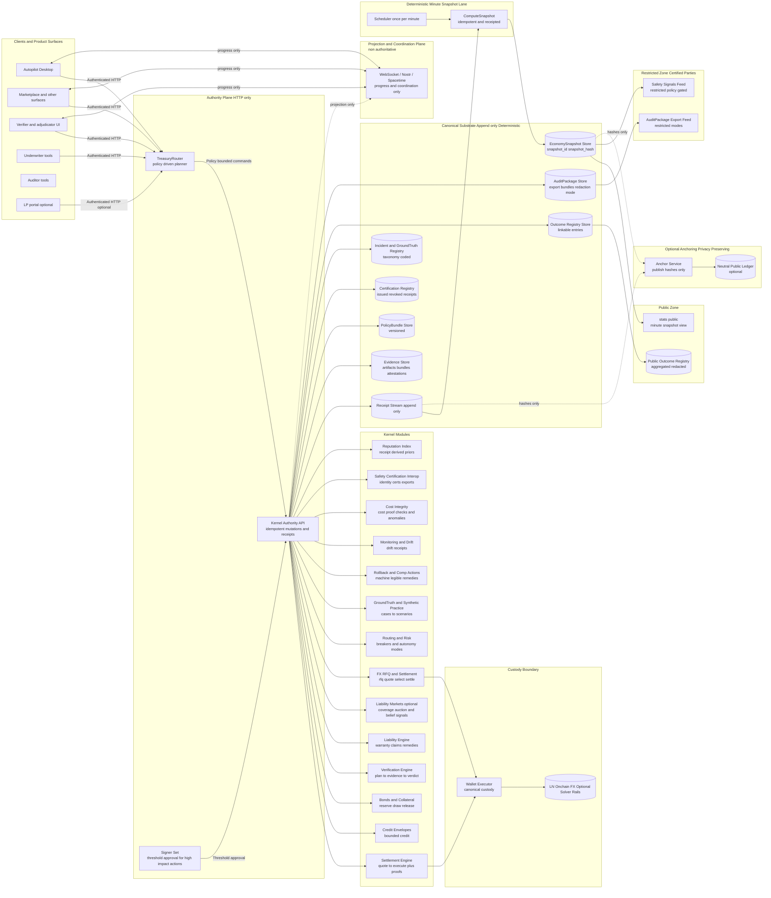
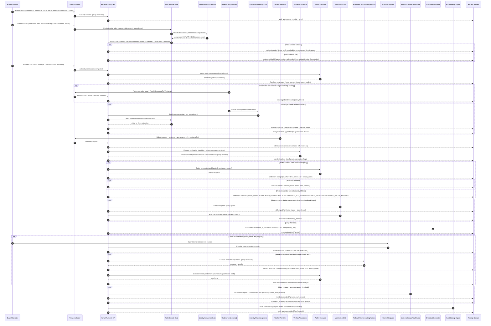
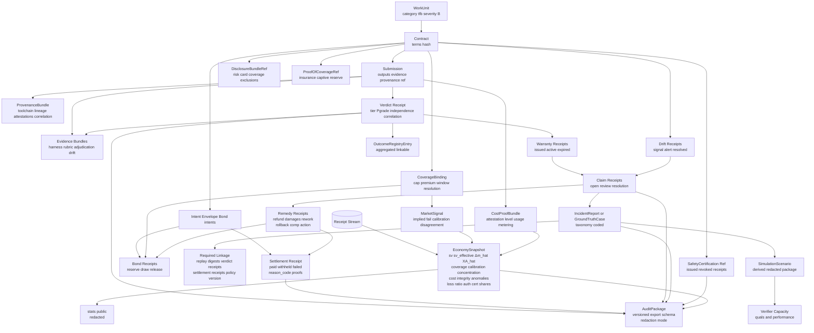
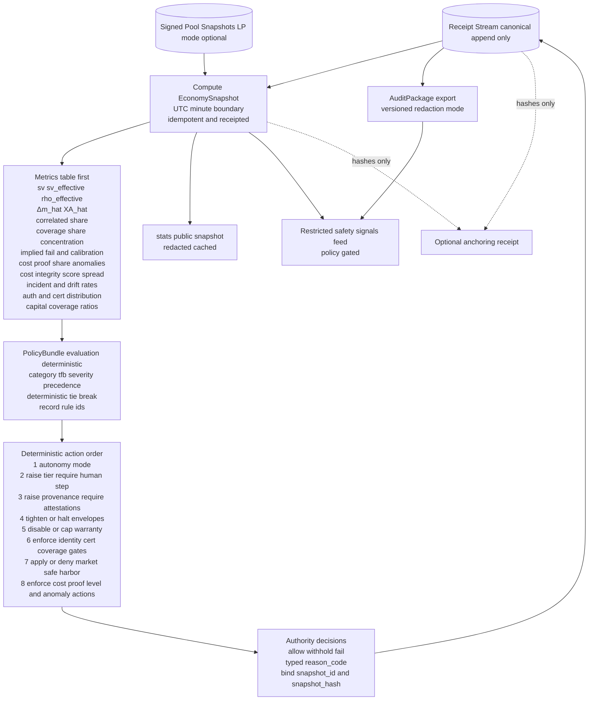
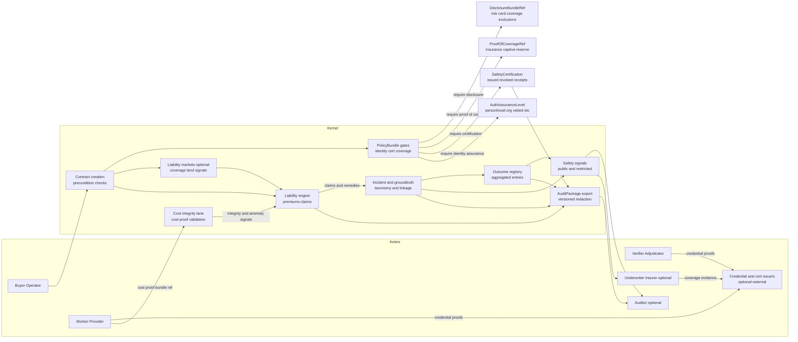
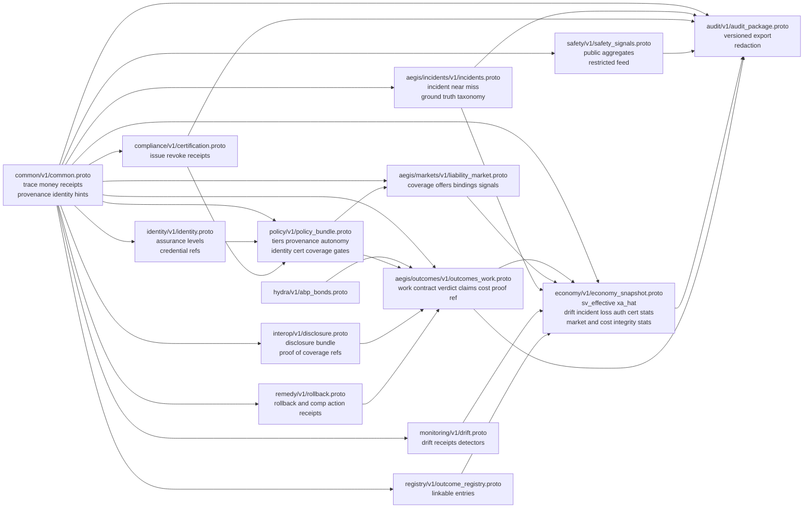
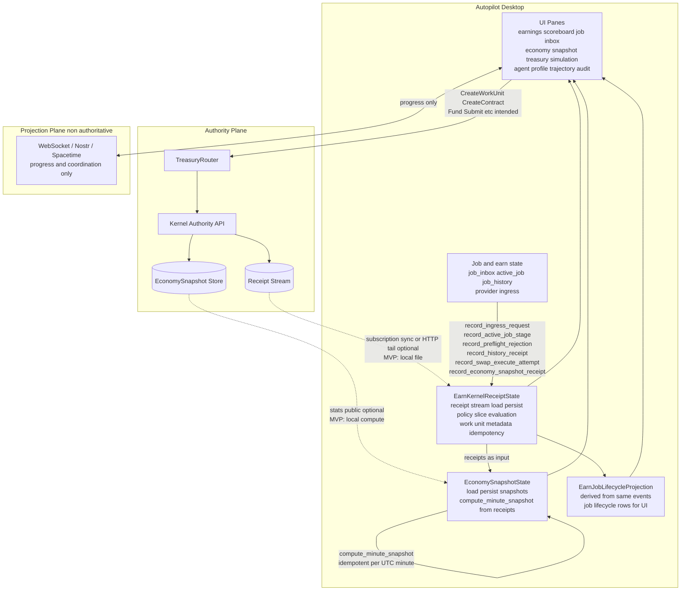

# OpenAgents Economy Kernel — System Diagrams

These diagrams are intended to be **comprehensive** and to cover:

* The **normative kernel spec** (Sections 1–7) + proto-first posture
* The **proto plan** (common/outcomes/policy/snapshot) plus the **missing-but-required ecosystem primitives** from the arXiv recommendations and the gap analysis:

  * insurability preconditions (incident reporting, disclosure, proof-of-coverage hooks)
  * interoperable audit/incident formats + outcome registries
  * privacy-preserving safety signals (public aggregate + restricted feed)
  * identity assurance levels + credential references (incl. personhood where required)
  * certification + safe-harbor / “digital borders” policy gates
  * white-hat audit / bounty workflows as kernel-native WorkUnit lanes
  * explicit rollback / compensating-action semantics
  * exportable synthetic practice packages
  * correlation-adjusted “effective verified share” metrics
  * continuous monitoring + drift detection as a policy input
  * prediction markets as bounded liability coverage instruments
  * proof-of-cost signals for compute integrity and underwriting inputs

Where a lane is *optional*, it is labeled as such; the diagrams still show how it plugs into the same receipts/snapshot/policy substrate.

---

## 1) System Architecture and Trust Boundaries

---

## 2) Canonical Lifecycle with Preconditions, Verification, Liability, Monitoring, and Remedies

This is the “full-fidelity” lifecycle including the paper’s recommended primitives: disclosure/coverage hooks, identity assurance gates, incident reporting, drift, rollback/compensation, and exportability.

---

## 3) Canonical Receipt & Evidence Graph (Navigability + Interop Exports)

This diagram is the “what happened / why / evidence” graph your spec requires, plus the missing interoperability objects (incident reports, outcome registry entries, certifications, audit packages).

---

## 4) Normative State Machines Overview (Extended)

This expands beyond the base spec state machines to include: warranty, rollback, drift, incidents, snapshots, and certification.

```mermaid
flowchart TB
  subgraph Settlement_SM[Settlement]
    S_QUOTED[QUOTED] --> S_PAID[PAID]
    S_QUOTED --> S_WITHHELD[WITHHELD]
    S_QUOTED --> S_FAILED[FAILED]
  end

  subgraph Envelope_SM[Credit Envelope]
    E_INTENT[INTENT_CREATED] --> E_OFFERED[OFFERED]
    E_OFFERED --> E_ISSUED[ENVELOPE_ISSUED]
    E_ISSUED --> E_COMMITTED[COMMITTED]
    E_COMMITTED --> E_SETTLED[SETTLED]
    E_ISSUED --> E_EXPIRED[EXPIRED]
    E_COMMITTED --> E_REVOKED[REVOKED]
  end

  subgraph Contract_SM[Contract]
    C_CREATED[CREATED] --> C_FUNDED[FUNDED]
    C_FUNDED --> C_BONDED[BONDED]
    C_BONDED --> C_SUBMITTED[SUBMITTED]
    C_SUBMITTED --> C_VERIFYING[VERIFYING]
    C_VERIFYING --> C_PASS[VERDICT_PASS]
    C_VERIFYING --> C_FAIL[VERDICT_FAIL]
    C_PASS --> C_SETTLED[SETTLED]
    C_FAIL --> C_SETTLED
    C_SETTLED --> C_WARRANTY[WARRANTY_ACTIVE optional]
    C_SETTLED --> C_FINAL[FINALIZED]
    C_WARRANTY --> C_FINAL
    C_CREATED --> C_CANCEL[CANCELLED policy gated]
  end

  subgraph Claims_SM[Claims]
    CL_OPEN[OPEN] --> CL_REVIEW[UNDER_REVIEW]
    CL_REVIEW --> CL_APP[APPROVED]
    CL_REVIEW --> CL_DEN[DENIED]
    CL_REVIEW --> CL_PART[PARTIALLY_APPROVED]
    CL_APP --> CL_PAID[PAID]
    CL_PART --> CL_PAID
    CL_DEN --> CL_CLOSED[CLOSED]
    CL_PAID --> CL_CLOSED
  end

  subgraph Solver_SM[Optional Solver Cross Rail]
    X_INTENT[INTENT_CREATED] --> X_MATCH[MATCHED]
    X_MATCH --> X_INIT[INITIATED]
    X_INIT --> X_RED[REDEEMED]
    X_INIT --> X_REF[REFUNDED]
    X_INIT --> X_EXP[EXPIRED]
    X_INIT --> X_FAIL[FAILED]
  end

  subgraph MarketCoverage_SM[Optional Markets Coverage Binding]
    M_OPEN[OFFERING_OPEN] --> M_PROP[BINDING_PROPOSED]
    M_PROP --> M_BOUND[BOUND]
    M_BOUND --> M_ACTIVE[ACTIVE]
    M_ACTIVE --> M_CLAIM[CLAIM_TRIGGERED]
    M_ACTIVE --> M_EXP[EXPIRED]
    M_CLAIM --> M_SET[SETTLED]
    M_EXP --> M_SET
  end

  subgraph BeliefPos_SM[Optional Markets Belief Position]
    BP_OPEN[OPEN] --> BP_LOCK[MARGIN_LOCKED]
    BP_LOCK --> BP_REDUCED[REDUCED]
    BP_LOCK --> BP_CLOSED[CLOSED]
    BP_REDUCED --> BP_CLOSED
    BP_CLOSED --> BP_SETTLED[SETTLED]
  end

  %% Warranty
  subgraph Warranty_SM[Warranty]
    W_ISSUED[ISSUED] --> W_ACTIVE[ACTIVE]
    W_ACTIVE --> W_EXPIRED[EXPIRED]
    W_ACTIVE --> W_CLAIMED[CLAIM_OPEN]
    W_CLAIMED --> W_ACTIVE
    W_CLAIMED --> W_CLOSED[CLOSED]
  end

  subgraph Remedy_SM[Rollback Comp Action]
    R_PLANNED[PLANNED] --> R_INIT[INITIATED]
    R_INIT --> R_OK[EXECUTED]
    R_INIT --> R_BAD[FAILED]
    R_OK --> R_DONE[COMPLETE]
    R_BAD --> R_DONE
  end

  subgraph Drift_SM[Monitoring Drift]
    D_BASE[BASELINE] --> D_MON[MONITORING]
    D_MON --> D_ALERT[ALERT_RAISED]
    D_ALERT --> D_ACK[ACKNOWLEDGED]
    D_ACK --> D_RES[RESOLVED]
    D_RES --> D_MON
  end

  subgraph CostProof_SM[Cost Integrity]
    CP_SUB[SUBMITTED] --> CP_VER[VERIFIED]
    CP_VER --> CP_OK[ACCEPTED]
    CP_VER --> CP_FLAG[ANOMALY_FLAGGED]
  end

  subgraph Incident_SM[Incident GroundTruth]
    I_OPEN[OPEN] --> I_TRIAGE[TRIAGED]
    I_TRIAGE --> I_CONF[CONFIRMED]
    I_CONF --> I_ROOT[ROOT_CAUSED]
    I_ROOT --> I_CASE[GROUND_TRUTH_CASE]
    I_CASE --> I_SCEN[SIMULATION_DERIVED]
    I_SCEN --> I_CLOSED[CLOSED]
  end

  subgraph Snapshot_SM[EconomySnapshot Compute]
    N_SCHED[SCHEDULED] --> N_COMP[COMPUTED]
    N_COMP --> N_PUB[PUBLISHED]
    N_COMP --> N_WITHH[WITHHELD_INPUT_MISSING]
  end

  subgraph Cert_SM[Safety Certification]
    C_REQ[REQUESTED] --> C_REVIEW[EVIDENCE_REVIEW]
    C_REVIEW --> C_ISS[ISSUED]
    C_ISS --> C_SUSP[SUSPENDED]
    C_ISS --> C_REV[REVOKED]
    C_ISS --> C_EXP[EXPIRED]
  end
```

---

## 5) Control Loop: Receipts → Snapshot → Deterministic Policy → Actions → Receipts

This is the core “governor” loop, extended to include: identity/cert/coverage gates, incident & drift signals, and effective verified scale.

---

## 6) Insurability, Certification, and “Digital Borders” (Kernel-Addressable Primitives)

This diagram makes explicit the “insurance boundary” and certification gates as first-class kernel behaviors, without requiring any specific external regulator.

---

## 7) Proto Package Dependency Map (Expanded for Interop + Safety)

This extends your proto plan with the minimal additional packages required by the paper/gap analysis. You can treat these as **recommended** additions even if you implement them incrementally.

---

## 8) Autopilot Desktop ↔ Economy Kernel

How the Autopilot desktop app connects to and uses the economy kernel: authority path (commands and canonical data), projection path (progress only), and local state (receipt stream, snapshot derivation, job lifecycle).

**In plain English:**

- **Autopilot’s local state**
  The app keeps an **earn kernel receipt stream** (load/save from a local file), an **economy snapshot** state (snapshots loaded/saved and/or **computed from receipts** at UTC minute boundaries), and an **earn job lifecycle projection** (derived from the same events for the job/earnings UI). Job inbox, active job, job history, and provider ingress feed into both the projection and the receipt state.

- **Authority path (intended)**
  User actions (create work, create contract, fund, submit, etc.) are sent over **authenticated HTTP to TreasuryRouter**, which talks to the Kernel Authority API. The kernel writes to the canonical **Receipt Stream** and **EconomySnapshot Store**. The app does not mutate kernel state except via these commands.

- **How the app gets kernel data**
  In the full design the app can use **subscription-driven sync** and/or a receipt-stream HTTP tail, and consume the **stats public** snapshot (redacted) without polling loops. In the **current MVP** the receipt stream is a **local file** (same schema as the kernel’s); the app **computes** economy snapshots locally from that receipt stream and persists them, and may later replace this with kernel-published stats or receipt tail.

- **Local receipt recording**
  The app **records receipts locally** for job-lifecycle events (ingress request, active job stage, preflight rejection, history receipt, swap execute attempt, economy snapshot receipt). That keeps a single receipt stream and projection consistent on the client; when the kernel is authoritative, those events would be produced by the kernel after the app sends commands, and the app would consume kernel receipts instead of (or in addition to) writing its own.

- **Projection path**
  Autopilot and the kernel (or other services) can use **WebSocket, Nostr, or Spacetime** for **progress and coordination only**—no authority for money, verdicts, or state. (Nostr = protocol for relays/identity/job coordination; Spacetime = sync/presence/projection backend.) The diagram shows the desktop app and this projection plane as separate from the authority path.

---

### Notes for maintainers (diagram intent)

* **Authority plane is HTTP-only**: everything that mutates money/credit/liability/verdict/breakers/snapshots is idempotent + receipted.
* **Projection plane is non-authoritative**: progress streams only.
* **Public vs restricted publication**: `/stats` is public and redacted; safety/audit feeds can have restricted modes for certified parties; *all* derived from receipts/snapshots.
* **Interop is a first-class output**: AuditPackage, incident taxonomy objects, outcome registry entries, and (optional) anchoring are all receipts-first and exportable.

If you want, I can also add two more diagram pages that are sometimes useful in implementation:

1. a “Reason Code + Receipt Type Registry” diagram (who emits what, and how it links), and
2. a “Privacy/Redaction Transform” diagram (what can be public vs restricted vs internal evidence).
