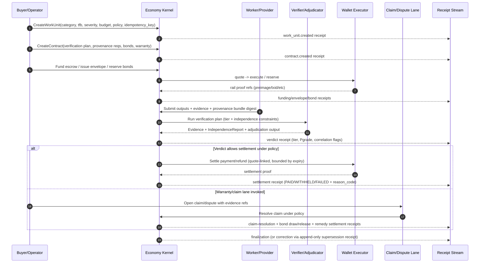
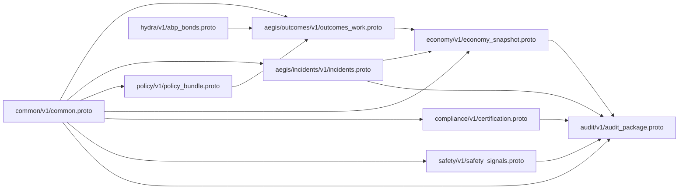

# OpenAgents Economy Kernel - System Diagrams

These diagrams are derived from:
- `docs/plans/economy-kernel.md`
- `docs/plans/economy-kernel-proto.md`
- All currently open Economy Kernel issues (`#2955`, `#2958`-`#2972`)

## 1) System Architecture and Trust Boundaries

```mermaid
flowchart LR
  subgraph Clients
    AP[Autopilot Desktop]
    MP[Marketplace / Other Product Surfaces]
  end

  AP -->|Authenticated HTTP authority requests| TR[TreasuryRouter]
  MP -->|Authenticated HTTP authority requests| TR

  AP <-->|Server-pushed subscriptions| STATSAPI[/stats API (public snapshot contract)]

  TR -->|Policy-bounded commands| K[Economy Kernel Authority Layer]

  subgraph KERNEL[Kernel Modules]
    SE[6.1 Settlement Engine]
    CE[6.3 Credit Envelopes]
    ABP[6.4 Bonds and Collateral]
    VE[6.5 Verification Engine]
    LE[6.6 Liability Engine]
    FX[6.7 FX RFQ and Settlement]
    RR[6.8 Routing and Risk]
    GT[6.10 Ground Truth and Synthetic Practice]
    RB[6.11 Rollback and Compensating Actions]
    MD[6.12 Monitoring and Drift Detection]
    SI[6.13 Safety, Certification, and Interop]
    RI[6.14 Reputation Index]
  end

  K --> SE
  K --> CE
  K --> ABP
  K --> VE
  K --> LE
  K --> FX
  K --> RR
  K --> GT
  K --> RB
  K --> MD
  K --> SI
  K --> RI

  SE --> WE[Wallet Executor (custody boundary)]
  FX --> WE
  WE --> RAILS[(LN / Onchain / FX / Optional Solver Rails)]

  K --> RS[(Append-only Receipt Stream)]
  RS --> SNAP[Deterministic Snapshot Compute (1-minute)]
  SNAP --> SS[(EconomySnapshot Store)]
  SS --> STATSAPI

  K -. Non-authoritative projection only .-> WS[WS/Nostr/Spacetime lanes]
  AP <-->|Progress/coordination only| WS
```

## 2) Canonical Economic Lifecycle (Work -> Verify -> Settle -> Liability)



## 3) Normative State Machines Overview

```mermaid
flowchart TB
  subgraph Settlement_4_1[Settlement 4.1]
    S_QUOTED[QUOTED] --> S_PAID[PAID]
    S_QUOTED --> S_WITHHELD[WITHHELD]
    S_QUOTED --> S_FAILED[FAILED]
  end

  subgraph Envelope_4_2[Credit Envelope 4.2]
    E_INTENT[INTENT_CREATED] --> E_OFFERED[OFFERED]
    E_OFFERED --> E_ISSUED[ENVELOPE_ISSUED]
    E_ISSUED --> E_COMMITTED[COMMITTED]
    E_COMMITTED --> E_SETTLED[SETTLED]
    E_ISSUED --> E_EXPIRED[EXPIRED]
    E_COMMITTED --> E_REVOKED[REVOKED]
  end

  subgraph Contract_4_3[Contract 4.3]
    C_CREATED[CREATED] --> C_FUNDED[FUNDED]
    C_FUNDED --> C_BONDED[BONDED]
    C_BONDED --> C_SUBMITTED[SUBMITTED]
    C_SUBMITTED --> C_VERIFYING[VERIFYING]
    C_VERIFYING --> C_PASS[VERDICT_PASS]
    C_VERIFYING --> C_FAIL[VERDICT_FAIL]
    C_PASS --> C_SETTLED[SETTLED]
    C_FAIL --> C_SETTLED
    C_SETTLED --> C_WARRANTY[WARRANTY_ACTIVE optional]
    C_SETTLED --> C_FINAL[FINALIZED]
    C_WARRANTY --> C_FINAL
    C_SETTLED --> C_CLAIMOPEN[CLAIM_OPEN derived]
    C_CREATED --> C_CANCEL[CANCELLED policy-gated]
  end

  subgraph Claims_4_4[Claims 4.4]
    CL_OPEN[OPEN] --> CL_REVIEW[UNDER_REVIEW]
    CL_REVIEW --> CL_APP[APPROVED]
    CL_REVIEW --> CL_DEN[DENIED]
    CL_REVIEW --> CL_PART[PARTIALLY_APPROVED]
    CL_APP --> CL_PAID[PAID]
    CL_DEN --> CL_CLOSED[CLOSED]
    CL_PART --> CL_PAID
    CL_PAID --> CL_CLOSED
  end

  subgraph Solver_4_6_Optional[Optional Solver/Cross-Rail 4.6]
    X_INTENT[INTENT_CREATED] --> X_MATCH[MATCHED]
    X_MATCH --> X_INIT[INITIATED]
    X_INIT --> X_RED[REDEEMED]
    X_INIT --> X_REF[REFUNDED]
    X_INIT --> X_EXP[EXPIRED]
    X_INIT --> X_FAIL[FAILED]
  end
```



## 4) Control Loop: Receipts -> Snapshot -> Policy -> Actions

```mermaid
flowchart TD
  R[(Canonical Receipt Stream)] --> SNAP[Compute EconomySnapshot\n(as_of_ms minute boundary UTC)]
  P[(Signed Pool Snapshots where applicable)] --> SNAP

  SNAP --> M[Metrics\nsv, sv_effective/rho_effective\ndelta_m_hat, xa_hat\ncorrelated share, drift, incidents\nliability, auth, certification]

  M --> POL[Deterministic PolicyBundle Evaluation\n(category x tfb x severity precedence\n+ deterministic tie-break)]
  POL --> ACT[Deterministic Action Order\n1 mode\n2 raise tier/human step\n3 raise provenance\n4 tighten/halt envelopes\n5 disable/cap warranty]

  ACT --> DEC[Authority Decisions\nALLOW / WITHHOLD / FAIL\nTyped reason_code\nSnapshot binding snapshot_id/hash]
  DEC --> R

  SNAP --> PUB[/stats public snapshot]
  SNAP --> AUD[AuditPackage + optional anchoring refs]
  R --> AUD

  subgraph OPEN_ISSUES[Open issues that complete this loop (#2958-#2972)]
    ID[Identity assurance gates]
    DR[Monitoring/drift receipts]
    IR[Incident + GroundTruthCase + taxonomy]
    RBK[Rollback receipts]
    ORG[Outcome registry]
    SIG[Safety signals]
    CERT[Certification and safe harbor]
    EXP[Interop AuditPackage export]
    METRIC[Deterministic sv_effective, delta_m_hat, xa_hat]
  end

  ID -.extends policy + receipt hints.-> POL
  DR -.feeds.-> M
  IR -.feeds.-> M
  RBK -.feeds xa_hat + exports.-> M
  ORG -.feeds aggregated outcomes.-> M
  SIG -.derived export path.-> AUD
  CERT -.gates high-severity actions.-> POL
  EXP -.export surface.-> AUD
  METRIC -.stabilizes snapshot estimators.-> SNAP
```

## 5) Proto Package Dependency Map


