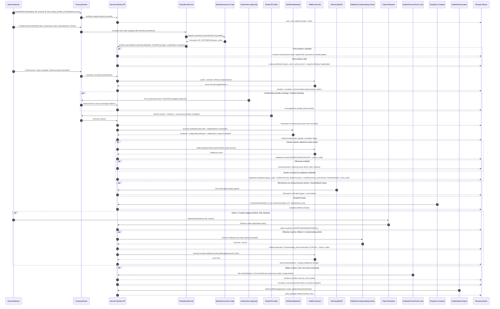

# OpenAgents Economy Kernel — System Diagrams

These diagrams are intended to be **comprehensive** and to cover:

* The **normative kernel spec** (Sections 1–7) + proto-first posture
* The **proto plan** (common/outcomes/policy/snapshot) plus the **missing-but-required ecosystem primitives** from the arXiv recommendations and the gap analysis:

  * insurability preconditions (incident reporting, disclosure, proof-of-coverage hooks)
  * interoperable audit/incident formats + outcome registries
  * privacy-preserving safety signals (public aggregate + restricted feed)
  * identity assurance levels + credential references (incl. personhood where required)
  * certification + safe-harbor / “digital borders” policy gates
  * white-hat audit / bounty workflows as kernel-native WorkUnit lanes
  * explicit rollback / compensating-action semantics
  * exportable synthetic practice packages
  * correlation-adjusted “effective verified share” metrics
  * continuous monitoring + drift detection as a policy input

Where a lane is *optional*, it is labeled as such; the diagrams still show how it plugs into the same receipts/snapshot/policy substrate.

---

## 1) System Architecture and Trust Boundaries

```mermaid
flowchart LR
  %% -----------------------------
  %% TRUST ZONES
  %% -----------------------------

  subgraph Z0_PUBLIC[Public Zone]
    STATS[/stats (public)\nminute snapshot view/]
    OUTREG[(Public Outcome Registry\n(aggregated, redacted))]
  end

  subgraph Z1_RESTRICTED[Restricted Zone (Certified Parties)]
    SAFEF[Safety Signals Feed\n(restricted, policy-gated)]
    AUDITDL[AuditPackage Export Feed\n(restricted modes)]
  end

  subgraph Z2_CLIENTS[Clients / Product Surfaces]
    AP[Autopilot Desktop]
    MP[Marketplace / Other Surfaces]
    VUI[Verifier / Adjudicator UI]
    UWI[Underwriter Tools]
    AUI[Auditor Tools]
    LPU[LP Portal (optional)]
  end

  subgraph Z3_PROJ[Projection / Coordination Plane\n(non-authoritative)]
    WS[WS/Nostr/Spacetime lanes\nprogress + coordination only]
  end

  subgraph Z4_AUTH[Authority Plane (HTTP-only)]
    TR[TreasuryRouter\n(policy-driven planner)]
    K[Economy Kernel Authority API\n(idempotent mutations + receipts)]
    SIG[Signer Set\n(threshold approval for high-impact actions)]
  end

  %% -----------------------------
  %% KERNEL MODULES (NORMATIVE + EXTENSIONS)
  %% -----------------------------
  subgraph MODS[Kernel Modules]
    SE[Settlement Engine\nquote→execute + proofs]
    CE[Credit Envelopes\nbounded credit]
    ABP[Bonds & Collateral\nreserve/draw/release]
    VE[Verification Engine\nplan→evidence→verdict]
    LE[Liability Engine\nwarranty/claims/remedies]
    FX[FX RFQ & Settlement\nrfq→quote→select→settle]
    RR[Routing & Risk\nbreakers + autonomy modes]
    GT[GroundTruth + Synthetic Practice\ncases→scenarios]
    RB[Rollback + Compensating Actions\n(machine-legible remedies)]
    MD[Monitoring + Drift Detection\n(drift receipts)]
    SI[Safety / Certification / Interop\n(identity, certs, exports)]
    RI[Reputation Index\n(receipt-derived priors)]
  end

  %% -----------------------------
  %% DATA / STORAGE SUBSTRATE
  %% -----------------------------
  subgraph DATA[Canonical Substrate (Append-only + Deterministic)]
    RS[(Append-only Receipt Stream)]
    EV[(Evidence Store\n(artifacts, bundles, attestations))]
    PB[(PolicyBundle Store\n(versioned))]
    CR[(Certification Registry\n(issued/revoked receipts))]
    IR[(Incident / GroundTruth Registry\n(taxonomy-coded))]
    OR[(Outcome Registry Store\n(linkable entries))]
    SS[(EconomySnapshot Store\n(snapshot_id + snapshot_hash))]
    EXP[(AuditPackage Store\n(export bundles + redaction mode))]
  end

  subgraph SNAPLANE[Deterministic Minute Snapshot Lane]
    SCH[Scheduler\n(once/min)]
    SNAP[ComputeSnapshot\n(idempotent + receipted)]
  end

  subgraph CUSTODY[Custody Boundary]
    WE[Wallet Executor\n(canonical custody)]
    RAILS[(LN / Onchain / FX / Optional Solver Rails)]
  end

  subgraph ANCHOR[Optional Anchoring (Privacy-Preserving)]
    ANC[Anchor Service\n(publish hashes only)]
    CHAIN[(Neutral Public Ledger\n(optional))]
  end

  %% -----------------------------
  %% FLOWS
  %% -----------------------------

  %% Authority requests
  AP -->|Authenticated HTTP\n(idempotency_key + policy_bundle_id + trace)| TR
  MP -->|Authenticated HTTP| TR
  VUI -->|Authenticated HTTP| TR
  UWI -->|Authenticated HTTP| TR
  LPU -->|Authenticated HTTP (optional)| TR

  TR -->|Policy-bounded commands| K

  %% Signer set for high-impact actions
  SIG -->|Threshold approval\n(high-impact treasury actions)| K

  %% Kernel to modules
  K --> SE
  K --> CE
  K --> ABP
  K --> VE
  K --> LE
  K --> FX
  K --> RR
  K --> GT
  K --> RB
  K --> MD
  K --> SI
  K --> RI

  %% Custody
  SE --> WE
  FX --> WE
  WE --> RAILS

  %% Canonical substrate
  K --> RS
  K --> EV
  K --> PB
  K --> CR
  K --> IR
  K --> OR
  K --> EXP

  %% Snapshots
  SCH --> SNAP
  RS --> SNAP
  SNAP --> SS

  %% Public / restricted publication (subscription-driven)
  SS --> STATS
  OR --> OUTREG
  SS --> SAFEF
  EXP --> AUDITDL

  %% Projection/coordination only (non-authoritative)
  K -. progress + coordination only .-> WS
  AP <-->|subscriptions / progress| WS
  MP <-->|subscriptions / progress| WS
  VUI <-->|subscriptions / progress| WS

  %% Optional anchoring
  SS -. snapshot_hash / merkle roots only .-> ANC
  RS -. receipt merkle roots only .-> ANC
  ANC --> CHAIN
```

---

## 2) Canonical Lifecycle with Preconditions, Verification, Liability, Monitoring, and Remedies

This is the “full-fidelity” lifecycle including the paper’s recommended primitives: disclosure/coverage hooks, identity assurance gates, incident reporting, drift, rollback/compensation, and exportability.



---

## 3) Canonical Receipt & Evidence Graph (Navigability + Interop Exports)

This diagram is the “what happened / why / evidence” graph your spec requires, plus the missing interoperability objects (incident reports, outcome registry entries, certifications, audit packages).

```mermaid
flowchart TB
  %% Core objects
  WU[WorkUnit\n(category, tfb, severity, B)] --> CT[Contract\n(terms hash)]
  CT --> SUB[Submission\n(outputs + evidence + provenance ref)]

  %% Evidence/provenance
  SUB --> PBNDL[ProvenanceBundle\n(toolchain, model lineage,\nattestations, correlation groups)]
  SUB --> EVD[Evidence Bundles\n(harness output, rubric,\nadjudication notes, drift proofs)]

  %% Verification
  SUB --> VR[Verdict Receipt\n(achieved tier, Pgrade,\nIndependenceReport,\ncorrelation flags)]
  VR --> EVD

  %% Settlement / bonds
  CT --> INT[Intent/Envelope/Bond Intents]
  INT --> SET[Settlement Receipt\n(PAID/WITHHELD/FAILED\n+ reason_code + proofs)]
  INT --> BOND[Bond Receipts\n(reserve/draw/release)]

  %% Warranty / claims
  VR --> WRY[Warranty Receipts\n(issued/active/expired)]
  WRY --> CLM[Claim Receipts\n(open/review/resolution)]
  CLM --> REM[Remedy Receipts\n(refund/damages/rework\n+ rollback/comp-action)]
  REM --> SET
  REM --> BOND

  %% Monitoring / drift
  CT --> DR[Drift Receipts\n(signal/alert/resolved)]
  DR --> CLM

  %% Incidents / ground truth / synthetic practice
  CLM --> IRPT[IncidentReport / GroundTruthCase\n(taxonomy-coded)]
  IRPT --> GTLINK[Required Linkage:\nreplay bundle digests\nverdict receipts\nsettlement receipts\npolicy bundle version]
  IRPT --> SIM[SimulationScenario\n(derived, redacted package)]
  SIM --> VCAP[Verifier Capacity\n(quals + performance)]

  %% Outcome registry / certification / identity
  VR --> ORG[OutcomeRegistryEntry\n(aggregated + linkable)]
  CT --> DISC[DisclosureBundleRef\n(risk/system card,\ncoverage/exclusions)]
  CT --> POC[ProofOfCoverageRef\n(insurance/captive reserve)]
  CT --> CERT[SafetyCertification Ref\n(issued/revoked receipts)]

  %% Snapshots and /stats
  RS[(Receipt Stream)] --> SNAP[EconomySnapshot\n(sv, sv_effective,\nΔm_hat, XA_hat,\nloss ratio, auth/cert shares)]
  SNAP --> STATS[/stats public\n(redacted)]

  %% Interop export
  VR --> APKG[AuditPackage\n(versioned export schema\n+ redaction mode)]
  SET --> APKG
  CLM --> APKG
  IRPT --> APKG
  CERT --> APKG
  SNAP --> APKG
```

---

## 4) Normative State Machines Overview (Extended)

This expands beyond the base spec state machines to include: warranty, rollback, drift, incidents, snapshots, and certification.

```mermaid
flowchart TB
  %% Settlement
  subgraph Settlement_4_1[Settlement]
    S_QUOTED[QUOTED] --> S_PAID[PAID]
    S_QUOTED --> S_WITHHELD[WITHHELD]
    S_QUOTED --> S_FAILED[FAILED]
  end

  %% Envelope
  subgraph Envelope_4_2[Credit Envelope]
    E_INTENT[INTENT_CREATED] --> E_OFFERED[OFFERED]
    E_OFFERED --> E_ISSUED[ENVELOPE_ISSUED]
    E_ISSUED --> E_COMMITTED[COMMITTED]
    E_COMMITTED --> E_SETTLED[SETTLED]
    E_ISSUED --> E_EXPIRED[EXPIRED]
    E_COMMITTED --> E_REVOKED[REVOKED]
  end

  %% Contract
  subgraph Contract_4_3[Contract]
    C_CREATED[CREATED] --> C_FUNDED[FUNDED]
    C_FUNDED --> C_BONDED[BONDED]
    C_BONDED --> C_SUBMITTED[SUBMITTED]
    C_SUBMITTED --> C_VERIFYING[VERIFYING]
    C_VERIFYING --> C_PASS[VERDICT_PASS]
    C_VERIFYING --> C_FAIL[VERDICT_FAIL]
    C_PASS --> C_SETTLED[SETTLED]
    C_FAIL --> C_SETTLED
    C_SETTLED --> C_WARRANTY[WARRANTY_ACTIVE optional]
    C_SETTLED --> C_FINAL[FINALIZED]
    C_WARRANTY --> C_FINAL
    C_CREATED --> C_CANCEL[CANCELLED policy-gated]
  end

  %% Claims
  subgraph Claims_4_4[Claims]
    CL_OPEN[OPEN] --> CL_REVIEW[UNDER_REVIEW]
    CL_REVIEW --> CL_APP[APPROVED]
    CL_REVIEW --> CL_DEN[DENIED]
    CL_REVIEW --> CL_PART[PARTIALLY_APPROVED]
    CL_APP --> CL_PAID[PAID]
    CL_PART --> CL_PAID
    CL_DEN --> CL_CLOSED[CLOSED]
    CL_PAID --> CL_CLOSED
  end

  %% Optional Solver/Cross-rail
  subgraph Solver_4_6_Optional[Optional Solver / Cross-Rail]
    X_INTENT[INTENT_CREATED] --> X_MATCH[MATCHED]
    X_MATCH --> X_INIT[INITIATED]
    X_INIT --> X_RED[REDEEMED]
    X_INIT --> X_REF[REFUNDED]
    X_INIT --> X_EXP[EXPIRED]
    X_INIT --> X_FAIL[FAILED]
  end

  %% Warranty
  subgraph Warranty_SM[Warranty]
    W_ISSUED[ISSUED] --> W_ACTIVE[ACTIVE]
    W_ACTIVE --> W_EXPIRED[EXPIRED]
    W_ACTIVE --> W_CLAIMED[CLAIM_OPEN]
    W_CLAIMED --> W_ACTIVE
    W_CLAIMED --> W_CLOSED[CLOSED]
  end

  %% Rollback / compensating actions
  subgraph Remedy_SM[Rollback / Compensating Action]
    R_PLANNED[PLANNED] --> R_INIT[INITIATED]
    R_INIT --> R_OK[EXECUTED]
    R_INIT --> R_BAD[FAILED]
    R_OK --> R_DONE[COMPLETE]
    R_BAD --> R_DONE
  end

  %% Monitoring / drift
  subgraph Drift_SM[Monitoring / Drift]
    D_BASE[BASELINE] --> D_MON[MONITORING]
    D_MON --> D_ALERT[ALERT_RAISED]
    D_ALERT --> D_ACK[ACKNOWLEDGED]
    D_ACK --> D_RES[RESOLVED]
    D_RES --> D_MON
  end

  %% Incidents / ground truth
  subgraph Incident_SM[Incident / GroundTruth]
    I_OPEN[OPEN] --> I_TRIAGE[TRIAGED]
    I_TRIAGE --> I_CONF[CONFIRMED]
    I_CONF --> I_ROOT[ROOT_CAUSED]
    I_ROOT --> I_CASE[GROUND_TRUTH_CASE]
    I_CASE --> I_SCEN[SIMULATION_DERIVED]
    I_SCEN --> I_CLOSED[CLOSED]
  end

  %% Snapshot compute
  subgraph Snapshot_SM[EconomySnapshot Compute]
    N_SCHED[SCHEDULED] --> N_COMP[COMPUTED]
    N_COMP --> N_PUB[PUBLISHED]
    N_COMP --> N_WITHH[WITHHELD (input missing)]
  end

  %% Certification
  subgraph Cert_SM[Safety Certification]
    C_REQ[REQUESTED] --> C_REVIEW[EVIDENCE_REVIEW]
    C_REVIEW --> C_ISS[ISSUED]
    C_ISS --> C_SUSP[SUSPENDED]
    C_ISS --> C_REV[REVOKED]
    C_ISS --> C_EXP[EXPIRED]
  end
```

---

## 5) Control Loop: Receipts → Snapshot → Deterministic Policy → Actions → Receipts

This is the core “governor” loop, extended to include: identity/cert/coverage gates, incident & drift signals, and effective verified scale.

```mermaid
flowchart TD
  %% Inputs
  R[(Canonical Receipt Stream\n(append-only, hash-stable))] --> SNAP[Compute EconomySnapshot\n(as_of_ms UTC minute boundary)\n(idempotent + receipted)]
  P[(Signed Pool Snapshots\n(LP mode optional))] --> SNAP

  %% Snapshot outputs
  SNAP --> M[Metrics (table-first)\nsv, sv_effective/rho_effective\nΔm_hat, XA_hat\ncorrelated share\nloss ratio / claims rate\nincident rate (taxonomy)\ndrift alerts\nauth assurance distribution\ncertified/covered share\ncapital coverage ratios]

  %% Deterministic policy eval
  M --> POL[Deterministic PolicyBundle Evaluation\n(category×tfb×severity precedence)\n+ deterministic tie-break\n+ record rule ids]
  POL --> ACT[Deterministic Action Order\n1 autonomy mode\n2 raise tier / require human step\n3 raise provenance / attestations\n4 tighten/halt envelopes\n5 disable/cap warranty\n6 require identity/cert/coverage gates]

  %% Authority decisions
  ACT --> DEC[Authority Decisions\nALLOW / WITHHOLD / FAIL\nTyped reason_code\nBind snapshot_id/hash\nRecord identity/cert/coverage gates]
  DEC --> R

  %% Publication
  SNAP --> PUB[/stats public snapshot\n(redacted, cached)]
  SNAP --> RESTR[Restricted Safety Signals Feed\n(policy-gated)]
  R --> AUD[AuditPackage Export\n(versioned + redaction mode)]
  AUD --> RESTR

  %% Optional anchoring
  SNAP -. snapshot_hash only .-> ANC[Optional Anchoring Receipt]
  R -. receipt merkle root only .-> ANC
```

---

## 6) Insurability, Certification, and “Digital Borders” (Kernel-Addressable Primitives)

This diagram makes explicit the “insurance boundary” and certification gates as first-class kernel behaviors, without requiring any specific external regulator.

```mermaid
flowchart LR
  %% Actors
  subgraph Actors
    BUY[Buyer/Operator]
    WRK[Worker/Provider]
    VER[Verifier/Adjudicator]
    UW[Underwriter/Insurer (optional)]
    AUDR[Auditor (optional)]
    ISS[Credential/Cert Issuers\n(optional external)]
  end

  subgraph Kernel
    POL[PolicyBundle\n(identity/cert/coverage gates)]
    CT[Contract Creation\n(precondition checks)]
    LE[Liability Engine\n(premiums/claims)]
    IR[Incident/GroundTruth\n(taxonomy + linkage)]
    OR[Outcome Registry\n(aggregated entries)]
    SF[Safety Signals\n(public + restricted)]
    EXP[AuditPackage Export\n(versioned + redaction)]
  end

  %% Preconditions / gates
  WRK -->|Credential proofs| ISS
  VER -->|Credential proofs| ISS
  UW -->|Coverage evidence| ISS

  BUY --> CT
  CT --> POL

  POL -->|require disclosure| DISC[DisclosureBundleRef\n(risk/system card,\ncoverage/exclusions)]
  POL -->|require proof-of-coverage| POC[ProofOfCoverageRef\n(insurance/captive reserve)]
  POL -->|require certification| CERT[SafetyCertification\n(issued/revoked receipts)]
  POL -->|require identity assurance| IDG[AuthAssuranceLevel\n(personhood/org-vetted/etc.)]

  %% Outcomes and actuarial substrate
  CT --> LE
  LE -->|claims/remedies| IR
  IR --> OR
  IR --> SF
  OR --> SF

  %% Export / interop
  IR --> EXP
  OR --> EXP
  CERT --> EXP
  LE --> EXP
  EXP --> AUDR
  SF --> AUDR
  SF --> UW
```

---

## 7) Proto Package Dependency Map (Expanded for Interop + Safety)

This extends your proto plan with the minimal additional packages required by the paper/gap analysis. You can treat these as **recommended** additions even if you implement them incrementally.

```mermaid
flowchart LR
  COMMON[common/v1/common.proto\n(trace, money, receipts,\nprovenance, identity hints)]
  OUT[aegis/outcomes/v1/outcomes_work.proto\n(work/contract/verdict/claims)]
  INC[aegis/incidents/v1/incidents.proto\n(incident, near-miss,\nground truth, taxonomy)]
  POL[policy/v1/policy_bundle.proto\n(tiers/provenance/autonomy\n+ identity/cert/coverage gates)]
  SNAP[economy/v1/economy_snapshot.proto\n(sv_effective, xa_hat,\ndrift/incident/loss/auth/cert stats)]
  HYDRA[hydra/v1/abp_bonds.proto]

  ID[identity/v1/identity.proto\n(assurance levels,\ncredential refs)]
  CERT[compliance/v1/certification.proto\n(issue/revoke receipts)]
  SAFE[safety/v1/safety_signals.proto\n(public aggregates + restricted feed)]
  AUD[audit/v1/audit_package.proto\n(versioned export + redaction)]
  REG[registry/v1/outcome_registry.proto\n(linkable entries)]
  MON[monitoring/v1/drift.proto\n(drift receipts + detectors)]
  DISC[interop/v1/disclosure.proto\n(disclosure bundle,\nproof-of-coverage refs)]
  RBK[remedy/v1/rollback.proto\n(rollback/comp-action receipts)]

  %% Dependencies
  COMMON --> OUT
  COMMON --> INC
  COMMON --> POL
  COMMON --> SNAP
  COMMON --> ID
  COMMON --> CERT
  COMMON --> SAFE
  COMMON --> AUD
  COMMON --> REG
  COMMON --> MON
  COMMON --> DISC
  COMMON --> RBK

  HYDRA --> OUT
  POL --> OUT
  OUT --> SNAP
  INC --> SNAP
  MON --> SNAP
  REG --> SNAP

  INC --> AUD
  CERT --> AUD
  SAFE --> AUD
  SNAP --> AUD
  OUT --> AUD
  DISC --> OUT
  ID --> POL
  CERT --> POL
  RBK --> OUT
```

---

### Notes for maintainers (diagram intent)

* **Authority plane is HTTP-only**: everything that mutates money/credit/liability/verdict/breakers/snapshots is idempotent + receipted.
* **Projection plane is non-authoritative**: progress streams only.
* **Public vs restricted publication**: `/stats` is public and redacted; safety/audit feeds can have restricted modes for certified parties; *all* derived from receipts/snapshots.
* **Interop is a first-class output**: AuditPackage, incident taxonomy objects, outcome registry entries, and (optional) anchoring are all receipts-first and exportable.

If you want, I can also add two more diagram pages that are sometimes useful in implementation:

1. a “Reason Code + Receipt Type Registry” diagram (who emits what, and how it links), and
2. a “Privacy/Redaction Transform” diagram (what can be public vs restricted vs internal evidence).
