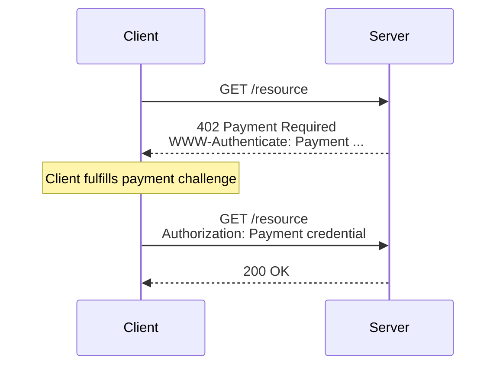

# Machine Payments Protocol (MPP)

The open protocol for machine-to-machine payments.

* **[IETF Draft](https://datatracker.ietf.org/doc/draft-ryan-httpauth-payment/)** — the core specification submitted to the IETF
* **[Full Rendered Spec](https://tempoxyz.github.io/payment-auth-spec/)** — all specs including methods and extensions
* **[Learn more](https://mpp.dev)**

## Overview

MPP lets businesses offer services to agents, apps, and humans via a standard HTTP control flow. The protocol defines a payment-method agnostic core alongside extensions for specific payment method flows, discovery, and identity.

1. **Client** requests a protected resource
2. **Server** responds with `402 Payment Required` and a `WWW-Authenticate: Payment` challenge describing what payment is needed
3. **Client** fulfills the payment (off-band, via the specified payment method)
4. **Client** retries the request with an `Authorization: Payment` credential proving payment
5. **Server** validates the credential and grants access

## Design Principles

MPP is designed to be simple, secure, and performant, holding the following design principles as guides:

* **Extensible core**: Minimal protocol designed for safe extension.
* **Network agnostic and multi-rail**: Designed to support a number of payment networks and settlement layers, including bank rails, credit cards, and stablecoins.
* **Currency agnostic**: No implicit advantages for any currency or asset.
* **Durable by design**: All designs follow web standards and are designed for security and replay protection as first class concerns.

See [STYLE.md](STYLE.md) for the full design principles and RFC writing conventions.

## Architecture

The specification is modular, separating stable protocol mechanics from evolving payment ecosystems:

* **[Core](specs/core/)**: HTTP 402 semantics, headers, IANA registries.
* **[Intents](specs/intents/)**: Abstract payment patterns—charge, authorize, subscription. Define *what* kind of payment without specifying *how*.
* **[Methods](specs/methods/)**: Concrete implementations for specific networks (Tempo, Stripe, ACH).
* **[Extensions](specs/extensions/)**: Optional protocol additions, such as discovery and identity.

## Contributing

The Machine Payments Protocol specification is currently maintained by the following organizations:

* [Tempo Labs](https://tempo.xyz)
* [Stripe](https://stripe.com)

We welcome contributions from a wide variety of individuals and organizations.

See [CONTRIBUTING.md](CONTRIBUTING.md) for building instructions and contribution guidelines.

## License

Specifications: [CC0 1.0 Universal](https://creativecommons.org/publicdomain/zero/1.0/) (Public Domain)

Tooling: [Apache 2.0](LICENSE-APACHE) or [MIT](LICENSE-MIT), at your option
