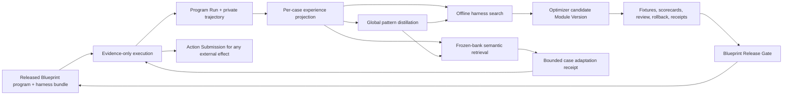

# MemoHarness and OpenAgents Blueprint: integration analysis

Date: 2026-07-18

Status: codebase research and architecture recommendation; not implementation or
runtime authority

Companion paper summary:
[`2026-07-18-memoharness-paper-summary.md`](./2026-07-18-memoharness-paper-summary.md)

## Executive answer

OpenAgents should combine MemoHarness with the active, TypeScript Blueprint
kernel, but it should not turn Blueprint back into a self-directing “company
brain.” The current Blueprint-derived system is strongest where MemoHarness is
weak: typed contracts, evidence boundaries, privacy-safe projections,
approval-gated effects, release gates, and explicit denial of self-promotion.
MemoHarness is strongest where the current Blueprint implementation is thin:
learning from both successful and failed trajectories, representing a harness
as a multidimensional policy bundle, distilling cross-case patterns, and doing
bounded one-shot adaptation from a frozen experience bank.

The right synthesis is therefore:

1. Keep Blueprint as the **governance, provenance, evidence, and promotion
   spine**.
2. Add a separate **harness optimization plane** that emits evidence-only
   Blueprint optimizer candidates.
3. Add a private **dual-layer experience store** whose safe projections contain
   refs and digests, not raw prompts, logs, source, or customer data.
4. Permit test-time adaptation only through pre-admitted, typed patches within
   a released policy envelope. Adaptation may select or compose; it may not
   promote itself or gain write authority.
5. Keep every external effect behind the existing Action Submission and
   reviewed executor boundary.

This is an extension of the active OpenAgents kernel, not a revival of the
deprecated standalone Blueprint workspace, the removed Sarah map, or the
closed Blueprint-as-company-brain direction. The current roadmap explicitly
lists broad Blueprint-as-company-brain maturation as a non-goal without a new
bounded owner decision
([`MASTER_ROADMAP.md`](../sol/MASTER_ROADMAP.md)).

## What “Blueprint” means in the current codebase

There are several things named Blueprint. They should not be treated as one
runtime.

| Surface                                                                                                                     | Current status                                                                                                           | Relevance to MemoHarness                                                                                    |
| --------------------------------------------------------------------------------------------------------------------------- | ------------------------------------------------------------------------------------------------------------------------ | ----------------------------------------------------------------------------------------------------------- |
| OpenAgents Worker kernel under [`workers/api/src/blueprint`](../../apps/openagents.com/workers/api/src/blueprint/README.md) | Active product-owned schemas, services, repositories, projections, fixtures, and exports                                 | Primary home for harness optimization records and private/safe projections                                  |
| [`packages/blueprint-contracts`](../../packages/blueprint-contracts/README.md)                                              | Active, deliberately narrow cross-consumer security and gate package                                                     | Home for stable cross-runtime safety predicates and state machines, not every experimental optimizer schema |
| Pylon runtime adapters under [`packages/runtime/src/blueprint`](../../apps/pylon/packages/runtime/src/blueprint/)           | Active typed registry lookup, bounded tool-menu construction, run evidence, Action Submission, and contribution adapters | Natural consumer for approved harness bundles and case-adaptation receipts                                  |
| Worker chat program runtime                                                                                                 | Implemented and tested                                                                                                   | Useful typed execution shell, but not proof that live Khala traffic is Blueprint-controlled                 |
| Khala-to-Blueprint adapter                                                                                                  | Implemented and tested, but no production call site was found in this audit                                              | Candidate integration seam, not a currently mounted learning loop                                           |
| QA/Khala failure-to-GEPA feedback                                                                                           | Implemented, evidence-only, negative-feedback oriented                                                                   | A small seed for failure learning, not a MemoHarness experience bank                                        |
| Deprecated Rust Blueprint workspace and historical Sarah/Blueprint-map documents                                            | Reference material only                                                                                                  | Do not restore as an execution dependency or product direction                                              |

The kernel README states the boundary directly: the OpenAgents product surface
owns the Effect-first Blueprint kernel, while the deprecated Rust workspace is
reference material only. The repository-wide invariant is stronger still:
Blueprint, Khala, semantic planners, StudyPackets, and DSPy/GEPA-class
optimizers may propose typed candidates, but may not self-admit, self-verify,
self-promote, dispatch, merge, release, spend, settle, or change a public claim
([`INVARIANTS.md`](../../INVARIANTS.md)).

## What already maps well

### 1. A harness is already close to a Blueprint program bundle

MemoHarness optimizes six dimensions: context, tools, generation,
orchestration, memory, and output. The active Blueprint schemas already provide
much of the surrounding structure:

| MemoHarness dimension | Existing Blueprint/OpenAgents primitive                                                                                                                                                                                                          | What is still missing                                                                                                 |
| --------------------- | ------------------------------------------------------------------------------------------------------------------------------------------------------------------------------------------------------------------------------------------------ | --------------------------------------------------------------------------------------------------------------------- |
| D1 Context            | [`SourceAuthority` and `ContextPack`](../../apps/openagents.com/workers/api/src/blueprint/schemas/source-context.ts), Program Type instruction refs                                                                                              | Explicit context-selection/compression policy and its candidate delta                                                 |
| D2 Tools              | Program Signature tool scopes, Pylon [`signature-lookup`](../../apps/pylon/packages/runtime/src/blueprint/signature-lookup.ts), bounded [`tool-menu`](../../apps/pylon/packages/runtime/src/blueprint/tool-menu.ts), command-source verification | Versioned tool descriptions, tool-selection policy, per-tool budgets, and exact before/after diff                     |
| D3 Generation         | `model_prompt` Module Versions and Program Signature decode policy                                                                                                                                                                               | Explicit model/sampling/retry/token policy; current decode policy mainly governs schema validation and unknown fields |
| D4 Orchestration      | Program Type/Signature, continuation decisions, chat program runtime, replay and simulation                                                                                                                                                      | Typed topology, turn budget, controller policy, stop policy, and their deltas                                         |
| D5 Memory             | Context Packs, retained-failure refs, Program Run repository                                                                                                                                                                                     | A scoped experience bank, retrieval contract, retention/deletion rules, and success-side memory                       |
| D6 Output             | Output schema refs, decode validation, proof projections, receipts, Action Submissions                                                                                                                                                           | Output-format candidate deltas and harness-specific verifier policy                                                   |

The existing [`ProgramType` and `ProgramSignature`](../../apps/openagents.com/workers/api/src/blueprint/schemas/program.ts)
contracts already bind risk class, evidence and receipt requirements, tool
scopes, input/output/context refs, release gates, and Module Versions. A
MemoHarness-style policy bundle should reference these records rather than
introduce a parallel untyped agent configuration format.

### 2. Program Runs are the right evidence anchor

[`BlueprintProgramRunRecord`](../../apps/openagents.com/workers/api/src/blueprint/schemas/program-run.ts)
already records the actor, Program Type, Program Signature, Module Version,
input snapshot hash, typed output, confidence, cost ref, latency, evidence refs,
receipt refs, and route. It is hard-coded as `evidence_only` and carries explicit
no-deploy, no-email, no-spend, no-source-mutation, and direct-mutation-disabled
flags.

That is the correct authority model for MemoHarness executions. A harness
optimizer may learn from a Program Run; the run itself must never become
permission to mutate a repository, send an email, deploy, spend, or publish a
claim. The current Worker invariant also rejects raw prompts, provider payloads,
private source, customer data, raw run logs, secrets, and source archives from
Program Run intake
([`apps/openagents.com/INVARIANTS.md`](../../apps/openagents.com/INVARIANTS.md)).

Program Run should remain the stable execution anchor, but it should not be
inflated with a full raw trajectory. A new private experience record can point
to the Program Run and private trace object while exposing only safe refs,
digests, metrics, and diagnoses through Blueprint projections.

### 3. Module Versions and Optimizer Runs already deny self-promotion

[`BlueprintModuleVersion`](../../apps/openagents.com/workers/api/src/blueprint/schemas/module.ts)
supports deterministic reducers, Effect agent modules, human-review modules,
model prompts, optimizer candidates, and runtime adapters. Its provenance can
carry an optimizer-run ref, retained-failure refs, and training-data refs.
Scorecards, release decisions, rollback anchors, and deprecation anchors are
already modeled.

[`BlueprintOptimizerRun`](../../apps/openagents.com/workers/api/src/blueprint/schemas/optimizer-run.ts)
already recognizes ablation, GEPA-style reflection, retained-failure replay,
scorecard search, and human curation. It emits candidate module refs and
scorecard/release-gate evidence. Its predicate requires candidates to remain
non-production and operator-promoted.

This is almost exactly the authority envelope needed for MemoHarness’s global
optimization loop. The missing part is the experiment model: parent bundle,
six-dimensional delta, per-case execution set, verifier results, exact resource
metrics, case diagnoses, and statistically defensible comparison.

### 4. Release Gates are stronger than the paper’s promotion rule

MemoHarness chooses configurations primarily by correctness and then token
cost. OpenAgents should preserve that ordering inside a harness scorecard, but
correctness and cost are not sufficient release authority.

[`BlueprintReleaseGate`](../../apps/openagents.com/workers/api/src/blueprint/schemas/release-gate.ts)
also requires fixtures, policy state, review state, rollback posture, receipts,
scorecards, an explicit decision, and a decider. Module candidates cannot
self-promote. MemoHarness candidates should pass through this existing gate,
with a harness-specific scorecard attached; they should not introduce a second,
weaker promotion system.

### 5. Action Submissions cleanly isolate external effects

[`BlueprintActionSubmission`](../../apps/openagents.com/workers/api/src/blueprint/schemas/action-submission.ts)
is the proposal boundary for PR creation, deployment, source writeback, email,
payment, legal submission, and public claims. It requires review/approval state
and receipts and explicitly denies direct Program Run execution or
model-confidence bypass.

MemoHarness adaptation therefore does not need new write authority. Even an
adapted write-capable coding session should produce the same typed Action
Submission as a static session. Harness choice affects how a proposal is
formed; it cannot affect who may authorize or execute it.

## What is present but not yet MemoHarness

### The routes are real, but the learning loop is not

The Worker mounts Blueprint routes for the program registry, Program Runs,
Action Submissions, contributions, contract exports, and Tassadar modules
([`blueprint-routes.ts`](../../apps/openagents.com/workers/api/src/blueprint-routes.ts),
[`index.ts`](../../apps/openagents.com/workers/api/src/index.ts)). D1 migrations
exist for Program Runs, Action Submissions, and Probe contributions. The Pylon
registry client can consume static fixtures, inline assignments, or the
OpenAgents HTTP registry.

This is meaningful infrastructure, but it is not a dual-layer experience bank.
The current system has:

- retained failure refs, but no unified success-and-failure experience object;
- Program Run evidence, but no normalized full-trajectory diagnosis by harness
  dimension;
- GEPA-style negative candidate feedback, but no global pattern store with
  supporting execution refs and applicability bounds;
- a typed registry selector, but no semantic nearest-neighbor retrieval over
  cases;
- release-gated candidates, but no first-class six-dimension harness delta;
- replay and simulation primitives, but no frozen-bank, label-free test-time
  adaptation protocol.

The Worker’s
[`chat-program-runtime-khala.ts`](../../apps/openagents.com/workers/api/src/blueprint/services/chat-program-runtime-khala.ts)
adapts a typed Khala request into the Blueprint chat runtime and can emit GEPA
feedback. However, this audit found no non-test production caller outside the
module/export boundary. Its offered session runtime is deterministic and
evidence-only; it does not invoke the live inference lane. The production
Khala route therefore must not be described as already governed or optimized
by this adapter.

Similarly,
[`chat-program-failure-gepa.ts`](../../apps/openagents.com/workers/api/src/blueprint/services/chat-program-failure-gepa.ts)
and the QA runner’s
[`failure-learning-gepa.ts`](../../apps/qa-runner/src/failure-learning-gepa.ts)
convert contradicted or failed evidence into small negative candidate feedback.
They require release-gate review and cannot change live behavior. That is a
useful seed, but MemoHarness depends equally on retrieving similar successful
executions and on distilling patterns across both outcomes.

## Recommended combined architecture

There are two deliberately independent loops:

- **Global learning:** executions become evidence; an optimizer proposes a new
  Module Version; normal Blueprint release gates decide whether it is admitted.
- **Case adaptation:** a released policy retrieves safe experience projections
  from a frozen bank and selects only admitted patches. It records what it used
  and why, but gets no current-case label or promotion authority.

Keeping these loops separate prevents a single successful or adversarial run
from rewriting the production harness.

## New records that should be added

The names below are recommendations, not current schemas.

### `HarnessPolicyBundle`

A versioned bundle should point to the exact Program Type, Program Signature,
Module Versions, evaluator, and six policies:

- `contextPolicyRef`
- `toolPolicyRef`
- `generationPolicyRef`
- `orchestrationPolicyRef`
- `memoryPolicyRef`
- `outputPolicyRef`
- `bundleDigest`
- `parentBundleRef`
- `targetModelFamilyRefs`
- `releaseGateRef`

Each candidate must include a typed `HarnessPolicyDelta` listing changed
dimensions and immutable before/after refs. Free-form optimizer analysis can
explain a delta, but may not be the executable representation of the delta.

### `HarnessExecutionExperience`

This should reference, rather than replace, a Program Run:

- Program Run ref and harness bundle digest;
- objective/task family and privacy/tenant scope;
- verifier verdict and reward components;
- exact uncached/cached input tokens, output tokens, tool calls, model calls,
  latency, retry count, and cost receipt refs;
- success flag, primary failure dimension, secondary dimensions, and structured
  diagnosis;
- private trajectory ref and content digest;
- public/operator-safe evidence refs;
- retention policy, correction/tombstone state, and creation provenance.

Raw prompts, terminal logs, source snapshots, customer content, and provider
payloads belong in a private, access-controlled trace store if they are retained
at all. They must not cross the current Program Registry or contract-export
projection boundary.

### `HarnessPatternCandidate`

Global patterns should be claims backed by evidence, not instructions with
implicit authority:

- pattern statement ref or structured rule;
- affected harness dimensions;
- supporting success and failure experience refs;
- applicability and exclusion predicates;
- model/tool/evaluator scope;
- confidence and counterexample refs;
- source Optimizer Run and release state.

A pattern may inform a candidate or an adaptation decision. It cannot edit a
live Program Signature or Module Version directly.

### `HarnessAdaptationReceipt`

Every case-specific policy should be reproducible:

- base harness bundle digest;
- retrieved experience and pattern refs with similarity scores;
- approved patch refs selected or composed;
- typed resulting delta and resulting digest;
- bank snapshot/version and retrieval-policy ref;
- reason/evidence refs;
- explicit no-label/no-feedback flags for the current case;
- allowed surfaces, risk ceiling, and expiration;
- token/cache/cost receipt refs.

This receipt should join the resulting Program Run evidence. It should not be
an Action Submission and should never grant external-effect authority.

## Exact integration points

### Worker kernel

Add experimental schemas in a focused Worker module such as
`workers/api/src/blueprint/schemas/harness-optimization.ts`. Keep private
experience repositories and public/operator projection logic beside the
existing Program Run repositories. Only move stable, genuinely cross-consumer
security contracts into `packages/blueprint-contracts`; that package is
currently intentionally narrow and should not become a dumping ground for
every research record.

Extend the Program Registry projection with safe bundle, pattern, and
adaptation-policy refs only after private-data and authority predicates cover
the new surface. Preserve the existing rule that raw typed output and metadata
stay repository-private unless a separately tested projection admits them.

### Pylon

Pylon’s typed signature lookup should remain the deterministic selection stage
after a semantic route is chosen. MemoHarness-style case retrieval is a
different problem: it needs a central embedding/similarity service over scoped
experience projections. Do not implement it as prompt keyword matching.

The sequence should be:

1. select the Program family/risk/surfaces with the central semantic planner;
2. apply exact typed Blueprint registry constraints;
3. retrieve scoped experiences and patterns semantically;
4. choose only compatible, released adaptation patches;
5. construct the bounded tool menu;
6. record an adaptation receipt and Program Run.

The current selector accepts both `draft` and `active` registry entries. That
is reasonable for candidate dogfood, but production and candidate modes need an
explicit caller-visible distinction before adaptive selection. A production
request should not select a draft merely because its other release-gate fields
look usable.

### Khala

The existing Khala adapter is the right typed seam to test, but it should first
be wired into an offline replay or shadow path, not silently inserted into the
live inference route. Its deterministic offered-session runtime needs to be
replaced or wrapped by an actual bounded inference session before it can measure
MemoHarness-style behavior.

The first target should be a low-risk, evidence-only continuation signature
with fixed fixtures and no external effects. Compare:

1. released static harness;
2. globally optimized candidate without case adaptation;
3. the same candidate with frozen-bank case adaptation.

That three-way comparison supplies the static-versus-adapted ablation missing
from the paper and exercises current continuation fixtures, Program Runs,
scorecards, and release gates. General chat and write-capable coding sessions
should come later.

### QA runner and GEPA

Expand failure-only candidate feedback into an execution-evidence compiler that
can emit normalized success and failure diagnoses. GEPA can remain one
optimizer kind, but the evidence schema should not assume GEPA; ablation,
scorecard search, retained-failure replay, and human-curated candidates already
exist as Blueprint optimizer kinds.

## Security, privacy, and authority constraints

The combined system should preserve the following non-negotiable rules:

1. **Experience is evidence, not authority.** A trajectory, diagnosis,
   similarity score, reward, or model confidence cannot authorize an effect.
2. **Optimization is proposal-only.** Optimizers emit non-production Module
   Versions with parent/delta provenance and independent release gates.
3. **Adaptation is bounded.** Test-time composition uses released knobs or
   patches, respects the selected Program’s risk and tool scopes, and expires
   with the case.
4. **Effects remain approval-gated.** PR, deploy, email, payment, public-claim,
   legal, and source-write effects remain Action Submissions.
5. **Source authority only narrows.** Retrieved context and patterns may not
   widen a Context Pack, tenant boundary, allowed surface, or consent scope.
6. **Private traces stay private.** Public and operator registries use refs,
   digests, redacted metrics, and tested projections. Raw content never rides in
   contract exports.
7. **Memory is correctable and deletable.** Before accumulating online
   experience, define retention, tenant deletion, source revocation,
   correction/tombstone propagation, and pattern invalidation.
8. **Evaluation is separate from promotion.** The optimizer must not own the
   only verifier or decide its own release. Counterexamples become retained
   fixtures and regression tests.

The ordered Blueprint gate machines in
[`packages/blueprint-contracts`](../../packages/blueprint-contracts/src/)
demonstrate the right implementation style: narrow production contracts,
bounded state spaces, terminal predicates, and explicit evidence requirements.
Harness candidate, experience, and adaptation lifecycles should receive the
same treatment where state-space modeling is practical.

## Current gaps and codebase debt

| Gap                                                                                                            | Consequence                                                              | Recommendation                                                                |
| -------------------------------------------------------------------------------------------------------------- | ------------------------------------------------------------------------ | ----------------------------------------------------------------------------- |
| No unified success/failure experience bank                                                                     | The system cannot reproduce MemoHarness retrieval or cross-case learning | Add private execution experiences plus safe projections                       |
| Failure feedback is mainly negative and claim-oriented                                                         | Successful strategies and operational patterns are lost                  | Normalize both outcomes with dimension diagnoses                              |
| No six-dimensional harness bundle/delta                                                                        | Candidate changes are hard to attribute or ablate                        | Add immutable bundle and typed per-dimension diff contracts                   |
| No semantic case retrieval                                                                                     | Typed lookup routes programs but does not find analogous cases           | Add central embedding retrieval; never ad hoc intent keywords                 |
| No frozen-bank adaptation receipt                                                                              | Case specialization cannot be reproduced or audited                      | Record bank snapshot, retrieval refs, selected patches, and resulting digest  |
| Khala adapter has no production caller found                                                                   | Architecture documents can overstate live integration                    | Treat it as an isolated seam until shadow/live wiring and receipts exist      |
| Registry selection accepts `draft` and `active`                                                                | Candidate dogfood and production selection can blur                      | Add explicit runtime mode and require promoted production refs in production  |
| Active boundary still says `omega.blueprint.kernel.v1`, owner `omega`; Pylon calls its HTTP source `omegaHttp` | Stale ownership vocabulary obscures the active OpenAgents boundary       | Reconcile names and tests in a separate behavior-preserving cleanup           |
| Generation and orchestration policy are implicit                                                               | The paper’s D3/D4 changes cannot be represented exactly                  | Add explicit generation, topology, budget, retry, and stop-policy schemas     |
| No correction/deletion lifecycle for learned experience                                                        | Bad or revoked data can continue influencing retrieval and patterns      | Add tombstone propagation and pattern revalidation before online accumulation |

The stale Omega refs are naming debt, not evidence that Omega owns the active
kernel. [`boundary.ts`](../../apps/openagents.com/workers/api/src/blueprint/boundary.ts)
sets `deprecatedDependencyAllowed: false`, and the kernel README names the
OpenAgents product surface as owner. The cleanup should preserve that boundary
and update dependent tests rather than introduce a dependency on an archived or
maintenance-only repo.

## Evaluation and release requirements

The paper’s point estimates are promising but its sample sizes, ablations, cost
method, and controller specification are not strong enough to become an
OpenAgents release policy unchanged. A Blueprint harness gate should require:

- immutable base and candidate bundle digests;
- correctness-first lexicographic scoring with cost as a tiebreak, not an
  authorization signal;
- separate training, validation, and held-out task sets;
- repeated runs or uncertainty estimates for stochastic programs;
- static released versus globally optimized versus case-adapted ablations;
- per-dimension and interaction ablations;
- warm-cache and cold-cache token/cost receipts;
- exact model, provider, toolset, evaluator, and environment version refs;
- cross-model and cross-task-family transfer tests;
- adversarial retrieval, stale-memory, privacy, and tenant-isolation tests;
- rollback anchors and explicit operator promotion.

Every performance claim should identify the tuple
`(model, harness bundle, toolset, evaluator, environment)`. “Model score” is
misleading when harness policy can materially change the result.

## Proposed delivery sequence

### BP-MH0 — reconcile the boundary

- Normalize stale Omega/OpenAgents naming in the active Worker and Pylon
  contracts.
- Make production versus candidate/dogfood selection explicit.
- Update current architecture docs so “implemented adapter” is not described as
  “mounted live runtime.”

### BP-MH1 — model the evidence

- Add `HarnessPolicyBundle`, `HarnessPolicyDelta`,
  `HarnessExecutionExperience`, and safe projection schemas.
- Define private trace storage, tenant scope, retention, correction, deletion,
  and tombstone propagation.
- Add property/state-machine tests for authority, projection safety, bundle
  compatibility, and lifecycle counterexamples.

### BP-MH2 — compile offline executions

- Convert existing Program Runs and QA outcomes into normalized experiences.
- Record exact calls, tokens, cache state, latency, verifier outcome, and
  six-dimension diagnosis.
- Preserve both successful and failed evidence.

### BP-MH3 — propose global candidates

- Extend Optimizer Runs with parent bundle, typed delta, experiment split, and
  scorecard refs.
- Produce non-production Module Versions only.
- Evaluate and promote exclusively through existing Blueprint Release Gates.

### BP-MH4 — add frozen-bank case adaptation

- Add tenant-safe semantic retrieval over safe experience/pattern projections.
- Restrict adaptation to released patch catalogs and compatibility predicates.
- Record adaptation receipts with no-label/no-feedback guarantees.
- Start in offline replay, then shadow, then candidate dogfood.

### BP-MH5 — controlled production evaluation

- Begin with a low-risk evidence-only continuation program.
- Run the three-way static/global/adapted ablation.
- Require privacy, transfer, variance, cost, rollback, and operator review gates
  before any broader runtime use.

Each packet is independently reviewable. None requires reopening the closed
Blueprint-as-company-brain program.

## What the overall OpenAgents system should factor in

MemoHarness changes the unit of analysis. OpenAgents should stop treating agent
quality as a property of model weights or prompts alone. The relevant product
artifact is the released combination of model, Program Signature, Module
Versions, tool policy, context authority, memory policy, output contract,
evaluator, and environment.

That has several system-wide implications:

- Product and assurance specs should name harness bundle refs and accepted
  outcome refs, not only model/provider names.
- Receipts should make harness choice and case adaptation auditable without
  exposing private traces.
- Provider or model failover must declare whether a bundle is validated for the
  replacement model; MemoHarness’s transfer result is encouraging, not a
  universal compatibility proof.
- Learning from workrooms must be tenant-scoped and consent-aware. A global
  pattern cannot inherit access to the private cases that supported it.
- Online evidence can create candidates, fixtures, and counterexamples, but it
  cannot silently mutate the product contract.
- Public benchmark and product claims need harness/evaluator provenance and
  should distinguish warm-cache from cold-cache economics.
- Candidate dogfood, shadow evaluation, production runtime, and external-effect
  execution should remain four distinct states.

The central lesson is not “let Blueprint optimize everything.” It is: make the
agent harness a first-class, versioned, evidence-bearing product artifact, then
use Blueprint’s existing authority boundaries to ensure learning remains
auditable and promotion remains independent.

## Conclusion

Blueprint and MemoHarness are complementary, not competing designs. Blueprint
defines what a program is allowed to read, propose, record, expose, and promote.
MemoHarness supplies a method for learning which bounded harness configuration
works better and how to specialize it for a new case. Combining them can give
OpenAgents an adaptive harness without creating an adaptive authority system.

The shortest honest path is an offline, low-risk continuation experiment built
on Program Runs, private experience records, typed harness deltas, and existing
Release Gates. If that experiment demonstrates a reproducible advantage over
both the current static harness and a globally optimized static candidate, the
same contracts can graduate through shadow and dogfood. Until then, the paper
should guide the experiment design—not be treated as justification for wiring
self-modifying behavior into live Khala, Pylon, or action execution.
