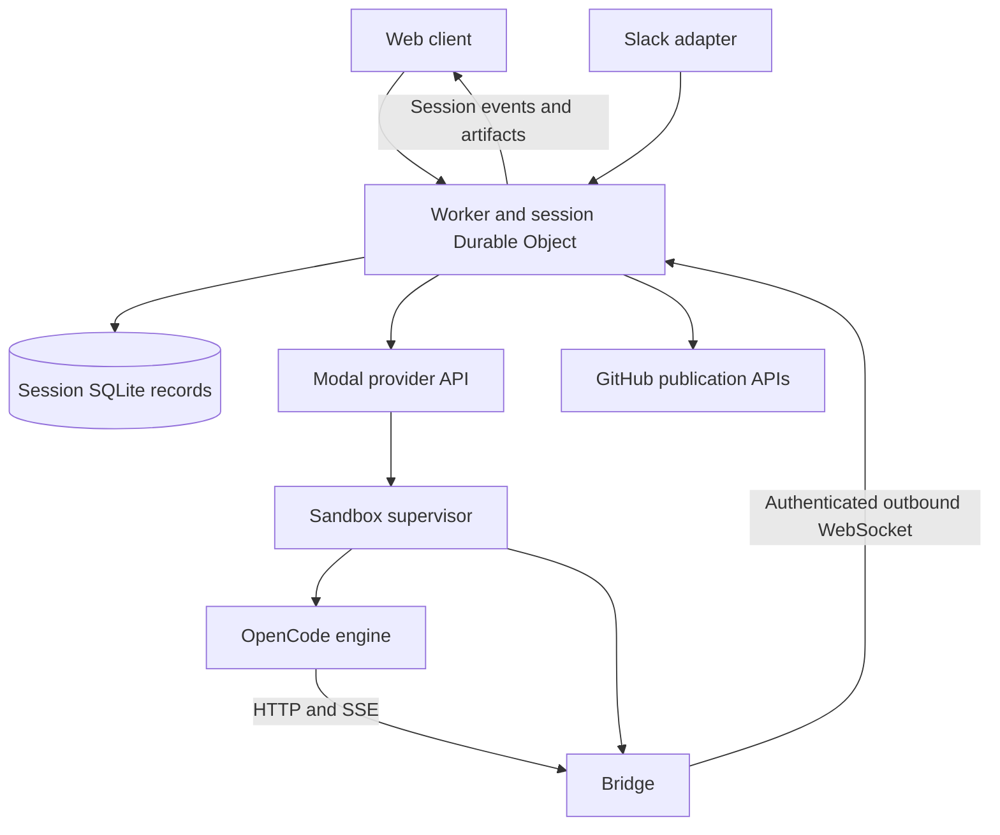

# OpenInspect: architecture and lessons for OpenAgents

Reviewed on October 8, 2026. This document studies the public
[`appsumo/openinspect` repository](https://github.com/appsumo/openinspect), a fork
of `ColeMurray/background-agents`, at commit
[`bd76f8d1ffee3fe2d7afb86bd385930ccab5828e`](https://github.com/appsumo/openinspect/tree/bd76f8d1ffee3fe2d7afb86bd385930ccab5828e).
That commit is dated February 3, 2026 and reverts live text streaming in the web
client. Findings describe this revision, not another fork, pending pull requests,
or a running deployment.

This is a source review. The review did not install dependencies, run OpenInspect
or its tests, provision cloud resources, or exercise suspected vulnerabilities.
Implementation observations are separated from recommendations and inferences.
The project uses the [MIT license](https://github.com/appsumo/openinspect/blob/bd76f8d1ffee3fe2d7afb86bd385930ccab5828e/LICENSE).
This document carries design lessons; it does not vendor its implementation.

## Recommended direction

OpenInspect is useful as a reference for durable session ownership, a retained
prompt queue, compute lifecycle decisions, and a product that lets several
clients observe the same work. Its strongest contribution is the division
between the conversation owner, provider resource, coding engine, and client
connection.

Use those ideas within the [Cloud computer plan](../cloud/managed-computers.md)
and [Cursor onboarding contract](../cloud/example-cursor-cloud-agent-onboarding/environment-onboarding.md).
Keep the vocabulary and implementation status in the [glossary](../glossary.md).
The existing Rust/Axum/Maud/HTTP/SSE stack can implement these behaviors without
adopting OpenInspect's TypeScript, Next.js, Cloudflare, Python bridge, or Modal
deployment.

The next priorities should be:

1. Qualify durable custody for hosted native commands and recovery.
2. Complete original tool evidence and portable conversation export.
3. Implement the existing environment recipe → clean build → fresh verification
   → reviewed Save sequence.
4. Add working-computer persistence, declared services, and admitted previews.
5. Add scoped collaboration and publication, then optional paid warming and
   customer compute under explicit contracts.

OpenInspect does not establish a complete tool archive, reproducible repository
prebuilds, fresh environment verification, customer tenancy, or settled compute
cleanup. Preserve the stronger boundaries already specified in OpenAgents.

## System structure

| Component | Responsibility in the inspected code | What to learn |
| --- | --- | --- |
| Web client | Next.js UI, GitHub sign-in, repository/model choices, chat sidebar, session socket, tool cards, and artifact links. | A small composer can lead into a complete workspace without becoming the workspace itself. |
| Control plane | Cloudflare Worker routing, one Durable Object per session, SQLite records, socket fan-out, queue dispatch, GitHub operations, and lifecycle alarms. | Give each conversation and execution lifecycle an authoritative owner outside the browser. |
| Modal API | Authenticated provider operations for creating, inspecting, snapshotting, and restoring sandboxes. | Keep provider operations behind an adapter and retain provider identities separately. |
| Sandbox supervisor | Source synchronization, Git identity, OpenCode startup/health, bridge monitoring, and child shutdown. | Report boot stages and own child processes explicitly. |
| Bridge | Connects outbound to the control plane and translates OpenCode HTTP/SSE into session events. | Correlate engine events with the exact originating prompt; transport is a projection. |
| Shared package | Message shapes, Git identity helpers, and service authentication. | Share typed contracts rather than duplicating protocol assumptions across clients. |
| Slack bot | Signed event ingestion, repository suggestions, thread/session links, and completion callbacks. | Reuse the same durable job from another channel; channel identity still needs admission. |
| Terraform | Cloudflare, Modal, and Vercel deployment configuration. | Make configuration and component ownership explicit without requiring those vendors. |

Sources: [control-plane schema](https://github.com/appsumo/openinspect/blob/bd76f8d1ffee3fe2d7afb86bd385930ccab5828e/packages/control-plane/src/session/schema.ts),
[provider interface](https://github.com/appsumo/openinspect/blob/bd76f8d1ffee3fe2d7afb86bd385930ccab5828e/packages/control-plane/src/sandbox/provider.ts),
[sandbox supervisor](https://github.com/appsumo/openinspect/blob/bd76f8d1ffee3fe2d7afb86bd385930ccab5828e/packages/modal-infra/src/sandbox/entrypoint.py),
[web session](https://github.com/appsumo/openinspect/blob/bd76f8d1ffee3fe2d7afb86bd385930ccab5828e/packages/web/src/app/session/%5Bid%5D/page.tsx),
[Slack entry point](https://github.com/appsumo/openinspect/blob/bd76f8d1ffee3fe2d7afb86bd385930ccab5828e/packages/slack-bot/src/index.ts),
and [infrastructure modules](https://github.com/appsumo/openinspect/tree/bd76f8d1ffee3fe2d7afb86bd385930ccab5828e/terraform/modules).

The diagram describes the source architecture. It does not imply that each
documented capability is deployed or qualified. The README mentions a Chrome
extension, but this revision has no extension package in its package tree.
[Package tree](https://github.com/appsumo/openinspect/tree/bd76f8d1ffee3fe2d7afb86bd385930ccab5828e/packages).

## What happens, in order

### 1. Choose a repository and begin a session

The homepage selects a repository and model. The first transition from an empty
prompt to nonempty text sends a session-creation request before submission.
Repository/model changes abort the pending browser request and discard its local
reference. Submission reuses the pending session, sends the prompt, and navigates
to `/session/{id}`. The session initializer begins warming asynchronously.
[Homepage flow](https://github.com/appsumo/openinspect/blob/bd76f8d1ffee3fe2d7afb86bd385930ccab5828e/packages/web/src/app/page.tsx#L80-L209),
[session initialization](https://github.com/appsumo/openinspect/blob/bd76f8d1ffee3fe2d7afb86bd385930ccab5828e/packages/control-plane/src/session/durable-object.ts#L1723-L1781).

This hides some startup latency, but aborting a browser request does not prove
that the server never created a session or started compute. For OpenAgents,
typing should initially remain local. Any later warm reservation needs current
admission, a stable request identity, source compatibility, concurrency and spend
bounds, expiry, cancellation, and cleanup. A repository selection or typing
signal grants no compute authority.

### 2. Retain the prompt and serialize execution

SQLite separates session metadata, participants, messages, events, artifacts,
sandbox state, and socket mappings. Queued messages retain author, content,
model, source, attachments, status, and timestamps. A processing message blocks
later dispatch; pending messages are selected in creation order.
[Schema](https://github.com/appsumo/openinspect/blob/bd76f8d1ffee3fe2d7afb86bd385930ccab5828e/packages/control-plane/src/session/schema.ts#L8-L163),
[message repository](https://github.com/appsumo/openinspect/blob/bd76f8d1ffee3fe2d7afb86bd385930ccab5828e/packages/control-plane/src/session/repository.ts#L423-L487).

Keep this separation in our native owners. A durable queued command, engine
turn, tool call, browser subscription, and provider resource are different
records. A queue must recover interrupted dispatch, not wait indefinitely on a
processing flag whose completion was lost.

### 3. Decide whether to create or restore compute

Lifecycle decisions use retained sandbox status, creation time, saved image,
socket standing, circuit state, and an in-memory guard. Pure decision functions
choose wait, skip, create, or restore; injected provider/storage/socket/alarm
interfaces perform effects. Creation records the expected sandbox identity,
authentication token, and spawning status before calling Modal. The actual
provider object ID is recorded separately after the response.
[Decision functions](https://github.com/appsumo/openinspect/blob/bd76f8d1ffee3fe2d7afb86bd385930ccab5828e/packages/control-plane/src/sandbox/lifecycle/decisions.ts#L184-L240),
[create ordering](https://github.com/appsumo/openinspect/blob/bd76f8d1ffee3fe2d7afb86bd385930ccab5828e/packages/control-plane/src/sandbox/lifecycle/manager.ts#L273-L323).

That distinction helps reject stale workers. It does not by itself reconcile a
successful remote create whose response was lost. Our provider adapter must
retain the operation identity and reconcile the original resource before
allowing replacement work or reporting cost settlement.

### 4. Create an isolated runtime and apply credentials

The Modal function obtains a GitHub installation token using an App private
key, then passes the installation token into the sandbox environment. Model
credentials arrive through a named Modal secret. Fresh creation uses a common
base image; the dedicated restore path uses a retained Modal image identity.
The default sandbox timeout is two hours.
[GitHub App exchange](https://github.com/appsumo/openinspect/blob/bd76f8d1ffee3fe2d7afb86bd385930ccab5828e/packages/modal-infra/src/auth/github_app.py#L18-L90),
[create and restore](https://github.com/appsumo/openinspect/blob/bd76f8d1ffee3fe2d7afb86bd385930ccab5828e/packages/modal-infra/src/sandbox/manager.py#L98-L164),
[restore implementation](https://github.com/appsumo/openinspect/blob/bd76f8d1ffee3fe2d7afb86bd385930ccab5828e/packages/modal-infra/src/sandbox/manager.py#L313-L377).

The private App signing key staying outside compute is useful. Sandbox
environment variables remain visible to the engine and repository processes,
however. OpenAgents should retain explicit credential admission, isolated engine
homes, redaction, artifact refusal, and post-restore credential application.

### 5. Materialize source and start the engine

Fresh startup shallow-clones the repository, fetches, and attempts to rebase onto
the configured branch, which defaults to `main`. Restored startup preserves the
working checkout and fetches to report drift. The supervisor configures Git,
starts OpenCode on port 4096, waits up to 30 seconds for its health endpoint,
then starts the bridge.
[Source synchronization](https://github.com/appsumo/openinspect/blob/bd76f8d1ffee3fe2d7afb86bd385930ccab5828e/packages/modal-infra/src/sandbox/entrypoint.py#L79-L219),
[health and boot order](https://github.com/appsumo/openinspect/blob/bd76f8d1ffee3fe2d7afb86bd385930ccab5828e/packages/modal-infra/src/sandbox/entrypoint.py#L307-L328),
[boot phases](https://github.com/appsumo/openinspect/blob/bd76f8d1ffee3fe2d7afb86bd385930ccab5828e/packages/modal-infra/src/sandbox/entrypoint.py#L636-L673).

There are important limits: a failed source-sync result does not prevent engine
startup; a failed rebase starts an abort attempt when rebase state exists before
the sync helper reports success; and
the generated engine configuration allows every permission. Engine HTTP health
does not prove exact source materialization, dependency installation, application
readiness, or successful checks. Our source revision/digest, admitted runtime,
permit, and verification requirements must remain authoritative.
[Sync and permission handling](https://github.com/appsumo/openinspect/blob/bd76f8d1ffee3fe2d7afb86bd385930ccab5828e/packages/modal-infra/src/sandbox/entrypoint.py#L108-L235).

### 6. Authenticate the bridge and dispatch the retained prompt

The bridge restores an OpenCode session reference from a file and validates it
through the engine API. It connects outbound using the expected sandbox ID and
bearer token, announces readiness, and sends heartbeats every 30 seconds.
Transient connection failures retry; specified authorization/not-found/gone
responses terminate the bridge. The control plane validates the expected worker,
replaces an older socket, records activity, and drains the queue.
[Bridge connection](https://github.com/appsumo/openinspect/blob/bd76f8d1ffee3fe2d7afb86bd385930ccab5828e/packages/modal-infra/src/sandbox/bridge.py#L190-L361),
[engine session recovery](https://github.com/appsumo/openinspect/blob/bd76f8d1ffee3fe2d7afb86bd385930ccab5828e/packages/modal-infra/src/sandbox/bridge.py#L1179-L1214),
[worker handshake](https://github.com/appsumo/openinspect/blob/bd76f8d1ffee3fe2d7afb86bd385930ccab5828e/packages/control-plane/src/session/durable-object.ts#L399-L482).

Dispatch changes the message to processing before sending it. A failed send is
logged, without a retained execution acknowledgment or repair of that status.
The browser sends no stable command request ID, and acceptance creates a new
server message ID. OpenAgents should retain the original reviewed command and
result on retry, with changed-content refusal and explicit unknown outcomes.
[Dispatch](https://github.com/appsumo/openinspect/blob/bd76f8d1ffee3fe2d7afb86bd385930ccab5828e/packages/control-plane/src/session/durable-object.ts#L1277-L1353),
[browser command](https://github.com/appsumo/openinspect/blob/bd76f8d1ffee3fe2d7afb86bd385930ccab5828e/packages/web/src/hooks/use-session-socket.ts#L461-L466),
[new message identity](https://github.com/appsumo/openinspect/blob/bd76f8d1ffee3fe2d7afb86bd385930ccab5828e/packages/control-plane/src/session/durable-object.ts#L929-L958).

### 7. Translate engine events into retained session events

The bridge subscribes to engine SSE before submitting the asynchronous prompt.
It correlates assistant records through their parent message, buffers some parts
that arrive before parent metadata, and projects text, tools, execution stages,
and usage. The control plane retains accepted events before broadcasting them.
An explicit message ID prevents a late event from being attributed to a later
processing prompt. On completion, the bridge fetches final assistant text to
recover trailing text missed by stream ordering.
[Correlation](https://github.com/appsumo/openinspect/blob/bd76f8d1ffee3fe2d7afb86bd385930ccab5828e/packages/modal-infra/src/sandbox/bridge.py#L653-L861),
[retain before broadcast](https://github.com/appsumo/openinspect/blob/bd76f8d1ffee3fe2d7afb86bd385930ccab5828e/packages/control-plane/src/session/durable-object.ts#L1030-L1044),
[text reconciliation](https://github.com/appsumo/openinspect/blob/bd76f8d1ffee3fe2d7afb86bd385930ccab5828e/packages/modal-infra/src/sandbox/bridge.py#L949-L1027).

This is a useful normalization boundary. Keep raw source records and original
tool bytes independently of UI events, so a display grouping or adapter change
does not erase evidence.

### 8. Checkpoint, idle, and resume

Completion launches an asynchronous filesystem snapshot and advances the next
queued prompt. Modal returns an image ID that the session retains; a later
restore uses it with a new worker identity and token. Defaults include ten
minutes of inactivity, five-minute extensions while clients remain connected,
and stale standing after 90 seconds without a heartbeat. Idle shutdown marks
the sandbox stopped, attempts a snapshot, sends cooperative shutdown, and closes
the socket. The supervisor terminates the bridge and engine with kill fallbacks.
[Completion](https://github.com/appsumo/openinspect/blob/bd76f8d1ffee3fe2d7afb86bd385930ccab5828e/packages/control-plane/src/session/durable-object.ts#L1027-L1098),
[snapshot provider call](https://github.com/appsumo/openinspect/blob/bd76f8d1ffee3fe2d7afb86bd385930ccab5828e/packages/modal-infra/src/sandbox/manager.py#L201-L246),
[idle decisions](https://github.com/appsumo/openinspect/blob/bd76f8d1ffee3fe2d7afb86bd385930ccab5828e/packages/control-plane/src/sandbox/lifecycle/decisions.ts#L271-L425),
[shutdown](https://github.com/appsumo/openinspect/blob/bd76f8d1ffee3fe2d7afb86bd385930ccab5828e/packages/control-plane/src/sandbox/lifecycle/manager.ts#L553-L637).

Treat this as a working-computer checkpoint, not a verified reusable environment.
A filesystem restore needs process restart. The next prompt can mutate files
while the asynchronous checkpoint runs; no explicit quiescence or generation
fence establishes a checkpoint for exactly one completed turn. The lifecycle
provider interface also has no explicit termination operation in these paths,
so a stopped label does not independently establish provider deletion or meter
stop. Retain checkpoint, process shutdown, resource stop, meter stop, deletion,
and settlement as separate facts.

## Repository prebuilds are incomplete in this revision

The README describes frequently rebuilt repository images and fast startup.
The actual repository builder clones a branch, records a source SHA, attempts
dependency installation and a build, and marks metadata ready. It does not
capture or retain a provider image in that function. Explicit setup commands are
ignored, automatic installers can fall back to unlocked installs, and failures
can still lead to ready metadata. The scheduled rebuild declaration is disabled
because the latest repository snapshot is not consumed by the control plane.
The base tooling also uses moving versions and installation scripts.
[Repository builder](https://github.com/appsumo/openinspect/blob/bd76f8d1ffee3fe2d7afb86bd385930ccab5828e/packages/modal-infra/src/scheduler/image_builder.py#L120-L299),
[disabled schedule](https://github.com/appsumo/openinspect/blob/bd76f8d1ffee3fe2d7afb86bd385930ccab5828e/packages/modal-infra/src/scheduler/image_builder.py#L311-L328),
[base image](https://github.com/appsumo/openinspect/blob/bd76f8d1ffee3fe2d7afb86bd385930ccab5828e/packages/modal-infra/src/images/base.py#L22-L125).

The implemented per-session snapshot/restore API and this unfinished repository
prebuild path are distinct. Do not copy a ready flag as an environment guarantee.
Our existing ENV-04/05/06 slices require a clean builder, exact image identity,
independent fresh verifier, retained results, and reviewed immutable promotion.
An engine health endpoint or dependency install attempt cannot satisfy them.

## Tool completeness and reconnect behavior

| Observation | Consequence | Required OpenAgents behavior |
| --- | --- | --- |
| Bridge send returns when its socket is absent and logs failures without a durable outbox or acknowledgment. | The database retains events that arrived; missing producer events are not recovered by that fact. | Persist originals before delivery; sequence and acknowledge delivery, replay duplicates safely, and disclose unrecoverable gaps. |
| Tool updates deduplicate by call ID and status. | Repeated updates at the same status do not establish final or complete output. | Pair arguments and results with exact call identity, stream offsets, lengths, digests, and explicit completion. |
| Final engine reconciliation fetches assistant text, not missing tools. | A complete-looking final answer does not prove complete command evidence. | Reconcile original tool records and nested work as well as text. |
| Subscription resets browser events, then replays the oldest 100 messages and oldest 500 events. | A long chat can replace newer visible work with only its oldest retained window. | Use bounded latest/history windows with resumable source-bound cursors and visible gaps. |
| HTTP paging uses only a timestamp and strict less-than comparison. | Equal timestamps can omit records across pages. | Use ordered sequence identities or a stable tie breaker, bound to source and revision. |
| The live persistence path bypasses heartbeat filtering and token aggregation helpers. | Heartbeats and cumulative text revisions can increase archive volume unnecessarily. | Keep display batching separate from canonical evidence and budget both explicitly. |

Sources: [bridge delivery](https://github.com/appsumo/openinspect/blob/bd76f8d1ffee3fe2d7afb86bd385930ccab5828e/packages/modal-infra/src/sandbox/bridge.py#L363-L384),
[tool deduplication](https://github.com/appsumo/openinspect/blob/bd76f8d1ffee3fe2d7afb86bd385930ccab5828e/packages/modal-infra/src/sandbox/bridge.py#L726-L736),
[replay selection](https://github.com/appsumo/openinspect/blob/bd76f8d1ffee3fe2d7afb86bd385930ccab5828e/packages/control-plane/src/session/durable-object.ts#L806-L826),
[pagination](https://github.com/appsumo/openinspect/blob/bd76f8d1ffee3fe2d7afb86bd385930ccab5828e/packages/control-plane/src/session/repository.ts#L501-L576),
[browser reset](https://github.com/appsumo/openinspect/blob/bd76f8d1ffee3fe2d7afb86bd385930ccab5828e/packages/web/src/hooks/use-session-socket.ts#L129-L135),
and [unused retention/aggregation policy](https://github.com/appsumo/openinspect/blob/bd76f8d1ffee3fe2d7afb86bd385930ccab5828e/packages/control-plane/src/realtime/events.ts#L56-L113).

OpenAgents already has ATIF, original-output reads, bounded projections, source
cursors, and gap disclosure. Those boundaries still have capture limits. Native
ATIF lifecycle validity does not prove that an upstream engine supplied every
stdout/stderr byte; real visitor-owned web chats also still lack portable ATIF
export. Implement ENV-02 and record coverage rather than claiming total capture
from a completion marker or a synthetic demo export. An evidence budget
exhaustion must leave an explicit incomplete result and block any promotion that
requires complete evidence.

## Authority and credential custody

OpenInspect explicitly supports one trusted organization. Its shared GitHub App
installation defines repository access, and its documentation discloses the
absence of per-user repository validation. That is a declared scope; it cannot
serve as our customer tenancy model.
[Declared security model](https://github.com/appsumo/openinspect/blob/bd76f8d1ffee3fe2d7afb86bd385930ccab5828e/README.md#L16-L59).

| Credential or authority | Inspected behavior | OpenAgents lesson |
| --- | --- | --- |
| GitHub App installation | Used for source clone and push across installed repositories. | Separate integration identity from the requesting principal; validate current tenant, repository, and publication authority. |
| User OAuth | Used for PR creation and encrypted at rest in the control plane. The NextAuth session callback also exposes it to client session consumers. | Keep provider credentials server-side; encryption at rest does not establish custody throughout the request path. |
| Browser socket token | Random token stored by digest; issuance replaces its hash. Subscription checks the hash without an age expiry in that path. | Retain bounded standing and active revocation, including already connected observers. |
| Session membership | Signed-in callers can obtain a token and are automatically added to the selected session. Session listing uses a global index. | Presence and a known URL are not membership or an observe/operate/review/publish grant. |
| Internal service HMAC | Signs a timestamp with a five-minute validity window, without binding method, path, body, or operation identity. | Retain exact native command identity, current grants, CSRF, and replay/reconciliation contracts. |
| Callback URL | Modal validates an exact allowed network location and rejects nonempty callback URLs when allowlist configuration is missing. | Reuse explicit recipient admission and fail-closed configuration. |

Sources: [OAuth encryption](https://github.com/appsumo/openinspect/blob/bd76f8d1ffee3fe2d7afb86bd385930ccab5828e/packages/control-plane/src/auth/crypto.ts#L13-L67),
[browser OAuth session](https://github.com/appsumo/openinspect/blob/bd76f8d1ffee3fe2d7afb86bd385930ccab5828e/packages/web/src/lib/auth.ts#L84-L92),
[token issuance](https://github.com/appsumo/openinspect/blob/bd76f8d1ffee3fe2d7afb86bd385930ccab5828e/packages/control-plane/src/session/durable-object.ts#L2153-L2214),
[subscription validation](https://github.com/appsumo/openinspect/blob/bd76f8d1ffee3fe2d7afb86bd385930ccab5828e/packages/control-plane/src/session/durable-object.ts#L700-L729),
[global listing](https://github.com/appsumo/openinspect/blob/bd76f8d1ffee3fe2d7afb86bd385930ccab5828e/packages/control-plane/src/router.ts#L451-L478),
[service HMAC](https://github.com/appsumo/openinspect/blob/bd76f8d1ffee3fe2d7afb86bd385930ccab5828e/packages/shared/src/auth.ts#L28-L102),
and [callback admission](https://github.com/appsumo/openinspect/blob/bd76f8d1ffee3fe2d7afb86bd385930ccab5828e/packages/modal-infra/src/app.py#L71-L110).

Sign-in can be restricted by email or domain, but empty allowlists admit any
GitHub sign-in. Require explicit tenant enrollment and admission on our hosted
surface rather than inheriting an unrestricted configuration default.
[Sign-in access policy](https://github.com/appsumo/openinspect/blob/bd76f8d1ffee3fe2d7afb86bd385930ccab5828e/packages/web/src/lib/access-control.ts#L32-L57).

Two additional source-level concerns require care:

- Browser sockets are accepted before subscription authentication. General
  broadcast includes every nonsandbox socket; stop and typing handlers do not
  perform the participant lookup used by prompts. Combined with upgrade routing
  outside HTTP HMAC, these paths suggest possible disclosure or control before
  authentication. This is an inference from code, not a demonstrated exploit.
  Authenticate before observation or effects and recheck current authority.
  [Upgrade routing](https://github.com/appsumo/openinspect/blob/bd76f8d1ffee3fe2d7afb86bd385930ccab5828e/packages/control-plane/src/index.ts#L23-L58),
  [socket acceptance](https://github.com/appsumo/openinspect/blob/bd76f8d1ffee3fe2d7afb86bd385930ccab5828e/packages/control-plane/src/session/durable-object.ts#L429-L488),
  [command dispatch](https://github.com/appsumo/openinspect/blob/bd76f8d1ffee3fe2d7afb86bd385930ccab5828e/packages/control-plane/src/session/durable-object.ts#L660-L683),
  [broadcast](https://github.com/appsumo/openinspect/blob/bd76f8d1ffee3fe2d7afb86bd385930ccab5828e/packages/control-plane/src/session/durable-object.ts#L1375-L1383).
- Git authentication is embedded in clone and remote URLs. Because `.git/config`
  can retain those URLs, the source does not establish credential-free filesystem
  snapshots. Whether a particular provider capture retained them was not tested.
  Use ephemeral Git authentication, remove private mounts and token-bearing
  configuration before reusable capture, and apply current credentials after
  restore. [Git token use](https://github.com/appsumo/openinspect/blob/bd76f8d1ffee3fe2d7afb86bd385930ccab5828e/packages/modal-infra/src/sandbox/entrypoint.py#L108-L180).

## Publication and attribution

The control plane attaches prompt-author identity to execution and separates App
credentials for push from user OAuth for PR creation. A successful PR becomes an
artifact with its URL, number, head, and base. This is a useful product flow.
[Author dispatch](https://github.com/appsumo/openinspect/blob/bd76f8d1ffee3fe2d7afb86bd385930ccab5828e/packages/control-plane/src/session/durable-object.ts#L1325-L1335),
[PR and artifact flow](https://github.com/appsumo/openinspect/blob/bd76f8d1ffee3fe2d7afb86bd385930ccab5828e/packages/control-plane/src/session/durable-object.ts#L2038-L2125).

The guarantees are narrower than they first appear. The bridge updates local Git
identity only when both name and email exist; otherwise the previous identity
can remain. Configuration failure only logs. PR actor selection uses the
currently processing message rather than an explicit causal message reference.
Pending push waiters are in memory, and PR creation does not use the existing
lookup-by-head helper for retry recovery.
[Conditional attribution](https://github.com/appsumo/openinspect/blob/bd76f8d1ffee3fe2d7afb86bd385930ccab5828e/packages/modal-infra/src/sandbox/bridge.py#L456-L464),
[actor resolution](https://github.com/appsumo/openinspect/blob/bd76f8d1ffee3fe2d7afb86bd385930ccab5828e/packages/control-plane/src/session/durable-object.ts#L1656-L1695),
[push waiters](https://github.com/appsumo/openinspect/blob/bd76f8d1ffee3fe2d7afb86bd385930ccab5828e/packages/control-plane/src/session/durable-object.ts#L1130-L1157),
[PR lookup helper](https://github.com/appsumo/openinspect/blob/bd76f8d1ffee3fe2d7afb86bd385930ccab5828e/packages/control-plane/src/auth/pr.ts#L84-L128).

Our publication should bind principal → exact command → reviewed candidate →
checks → publication attempt → original remote result. Require validated author
metadata or an explicit bot/anonymous fallback, with no stale identity carryover.
Git author text is an attribution claim, not proof of authority or remote
attestation. Keep integrated, pushed, PR-created, and deployed outcomes distinct.

## Product behavior worth carrying over

- **One chat workspace:** a chat list, current conversation, compute/connection
  status, and a details sidebar with participants, tasks, changed files, and
  artifacts. Reuse our `/chat/{uuid}` workspace and server fragments; keep the
  message field stable during updates.
- **Readable tool groups:** adjacent calls of the same tool collapse together,
  with expanded arguments and output. OpenAgents already has shared typed tool
  grouping; reuse it instead of parsing tool names differently in each client.
- **Useful completion artifacts:** link exact work, PRs, previews, and outputs.
  A preview link alone does not prove a service is ready or access is current.
- **Sanitized rendering:** their Markdown view uses an allowlist and constrained
  links. Keep our escaped raw output and restricted Markdown/CSP; model text is
  untrusted content, never a command or evaluated fragment.
- **A second channel observes the same job:** Slack routes a thread to a retained
  session and posts completion links. Our channel adapter should submit or
  observe the same canonical native work with current principal mapping.

Sources: [details sidebar](https://github.com/appsumo/openinspect/blob/bd76f8d1ffee3fe2d7afb86bd385930ccab5828e/packages/web/src/components/session-right-sidebar.tsx),
[tool groups](https://github.com/appsumo/openinspect/blob/bd76f8d1ffee3fe2d7afb86bd385930ccab5828e/packages/web/src/components/tool-call-group.tsx),
[tool details](https://github.com/appsumo/openinspect/blob/bd76f8d1ffee3fe2d7afb86bd385930ccab5828e/packages/web/src/components/tool-call-item.tsx#L107-L172),
[Markdown allowlist](https://github.com/appsumo/openinspect/blob/bd76f8d1ffee3fe2d7afb86bd385930ccab5828e/packages/web/src/components/safe-markdown.tsx#L8-L80),
and [Slack session reuse](https://github.com/appsumo/openinspect/blob/bd76f8d1ffee3fe2d7afb86bd385930ccab5828e/packages/slack-bot/src/index.ts#L754-L820).

Do not copy three browser shortcuts. The inspected client buffers assistant text
until completion rather than displaying each live token; its event effect always
scrolls to the bottom; and optimistic prompt display lacks a stable retry
identity. Preserve our active reading position, drafts, causal IDs, and truthful
pending/result status. Their UI tasks derive from `TodoWrite` events, which is a
presentation aid, not our canonical task journal or project authority.
[Text buffering](https://github.com/appsumo/openinspect/blob/bd76f8d1ffee3fe2d7afb86bd385930ccab5828e/packages/web/src/hooks/use-session-socket.ts#L149-L177),
[automatic scrolling](https://github.com/appsumo/openinspect/blob/bd76f8d1ffee3fe2d7afb86bd385930ccab5828e/packages/web/src/app/session/%5Bid%5D/page.tsx#L175-L177),
[task extraction](https://github.com/appsumo/openinspect/blob/bd76f8d1ffee3fe2d7afb86bd385930ccab5828e/packages/web/src/lib/tasks.ts#L23-L49).

Slack verifies inbound signatures, marks an event ID seen in KV with a one-hour
TTL, acknowledges, and processes through `waitUntil`. A crash after marking seen
can suppress a retried event without a durable processing outcome; concurrent
read-then-write deduplication also lacks an atomic claim. Completion callbacks
likewise need retained delivery and reconciliation. Reuse the quick acknowledgment
pattern with a durable inbox/outbox and channel-specific disclosure, rather than
treating acknowledgment as execution or delivery.
[Slack ingestion](https://github.com/appsumo/openinspect/blob/bd76f8d1ffee3fe2d7afb86bd385930ccab5828e/packages/slack-bot/src/index.ts#L566-L629),
[completion callback](https://github.com/appsumo/openinspect/blob/bd76f8d1ffee3fe2d7afb86bd385930ccab5828e/packages/slack-bot/src/callbacks.ts#L63-L125).

## How this maps to OpenAgents

The status column describes the OpenAgents boundary today. It does not mark
OpenInspect behavior as delivered in our system.

| Concern | Existing owner or plan | Status and next action |
| --- | --- | --- |
| Conversation custody | `openagents-chat`, native task owners, web `chat_store.rs`. | Existing distinct native/web records; unify evidence references without relabeling a public record as a native ATIF thread. |
| Hosted native command journal | Web `cloud/effects.rs`, canonical resident work. | Existing file journal; qualify persistent custody or an admitted shared journal before Cloud Run native activation. Public GCS chat storage does not solve this. |
| HTTP/SSE presentation | `openagents-web`, `coder-chat-web`, `coder-cloud-web`. | Implemented first staging slice; retain small browser interaction state, semantic HTML, resumable projections, and private retirement. |
| Authority | `tenancy::accounts`, `tenancy::sessions`, `coder-access`, `coder-host`. | Existing admission boundaries; all new sharing and channel commands must pass them. |
| Source/runtime choices | Web composer and `coder-cloud::operator`. | Existing frozen selections and admitted native profiles; public metadata grants no execution, and a profile is not a verified environment. |
| Engine execution | Coder turn/permit, resident host, provider adapters. | Existing execution owner; add no parallel OpenCode-only loop or browser executor. |
| Complete evidence | `atif`, retained original reads, ENV-02. | Existing formats and bounded reads; full source coverage, large outputs, nested work, and real web export require the remaining evidence slice. |
| Prepared environment | ENV-01/03/04/05/06 in the onboarding contract. | Designed lifecycle: recipe records, isolated setup, clean build, fresh verification, reviewed Save, and immutable later selection. |
| Working computer/checkpoint | `coder-working-computer` over `boat` (CMP-01). | Owner implemented with per-turn fenced checkpoints, restore, credential re-application, declared services, bounds, and separate stop facts against a fake provider; real Boat qualification and chat wiring remain. |
| Stop and metering | Native Boat cleanup and resource owners. | Retain independent stop/meter evidence and unknown costs; do not derive cleanup from disconnect or archive. |
| Declared services/previews | Managed computer plan; Cloud web roadmap. | Designed service ownership/readiness/access; restart declared processes after filesystem restore. |
| Attribution/publication | Native candidate, review, publication, and reconciliation. | Existing boundaries; a future GitHub broker should preserve actor/candidate/attempt identity and separate App/user custody. |
| Collaboration | Tenancy membership plus host grants; optional presence. | Share admitted observation first; presence must not expand execution or publication rights. |
| Warming | Existing resource leases and admitted Cloud placement; future policy. | Optional later optimization with measured benefit and funded reservations, not a default effect of typing. |
| Customer compute | Retail contracts and WEB-09/10/12. | Separate entitlement, funding, metering, and recovery; operator admission is not a customer compute launch. |

Local source references: [web effects](../../crates/openagents-web/src/cloud/effects.rs),
[operator](../../crates/coder-cloud/src/operator.rs),
[operator adapters](../../crates/coder-cloud/src/operator_adapters.rs),
[runtime credentials](../../crates/coder-cloud/src/runtime.rs),
[Boat cleanup](../../crates/coder-cloud/src/boat_backend.rs),
[traces](../coder/runtime/traces.md), and the
[Cloud web roadmap](https://github.com/OpenAgentsInc/openagents/issues/10964).

## Implementation order and acceptance

This research refines existing work. It creates no new issue, changes no
availability claim, and does not replace the ENV or WEB dependency order.

| Order | Deliverable | Acceptance evidence |
| --- | --- | --- |
| 1 | Durable hosted native custody and recovery, following the existing activation requirement. | Restart and replica changes recover the same reviewed request/result; lost provider or resident replies remain unknown until reconciled; no duplicate work. |
| 2 | ENV-01/02 records and complete evidence, plus portable real web conversation export. | Original argument/stdout/stderr paging, stream pairing, stable IDs, byte/digest coverage, nested work, replay, explicit missing ranges, redaction before persistence, and evidence-budget failure. |
| 3 | ENV-03–06 setup, clean builder, independent verifier, and reviewed Save. | Failed install/repair, stale recipe rejection, exact source/base/image identity, credential exclusion, fresh restore, selected application checks, lost snapshot/Save replies, and unchanged old-job version pins. |
| 4 | Persistent computer and service owner. | Checkpoint fencing, restart of declared services, readiness and preview grants, idle/absolute bounds, resource/meter/settlement reconciliation, and cleanup after failed boot. |
| 5 | Scoped collaboration, artifact navigation, publication, and optional channel adapters. | Membership revocation retires observers; observation cannot publish; queued actors remain correct across follow-ups; repeated publication or callbacks recover original results. |
| 6 | Optional warming and funded customer capabilities. | Measured cold/warm benefit, abandoned-draft cleanup, stable warm identity, current source/grants, concurrency caps, reservations, stop evidence, and a separately approved retail contract. |

A durable owner should retain at least these identities separately: account
workspace and principal, chat, project/source pin, native request, task/run,
computer/provider operation, environment recipe/version, checkpoint generation,
tool call/stream, reviewed candidate, and publication attempt. Transport
connections are replaceable observers of those records. An ATIF trajectory is
evidence; it is not the provider-operation recovery journal.

Useful source test cases include out-of-order engine parts, stale prior-message
events, final text catch-up, fatal versus transient reconnects, inactivity and
duration bounds, and supervisor restart/shutdown. Reimplement the relevant
scenarios at our Rust boundaries. Their presence in the repository is not a test
pass or a qualified Modal deployment.
[Bridge SSE tests](https://github.com/appsumo/openinspect/blob/bd76f8d1ffee3fe2d7afb86bd385930ccab5828e/packages/modal-infra/tests/test_bridge_sse.py),
[reconnect tests](https://github.com/appsumo/openinspect/blob/bd76f8d1ffee3fe2d7afb86bd385930ccab5828e/packages/modal-infra/tests/test_bridge_reconnection.py),
[supervisor tests](https://github.com/appsumo/openinspect/blob/bd76f8d1ffee3fe2d7afb86bd385930ccab5828e/packages/modal-infra/tests/test_supervisor_monitor.py),
[lifecycle tests](https://github.com/appsumo/openinspect/blob/bd76f8d1ffee3fe2d7afb86bd385930ccab5828e/packages/control-plane/src/sandbox/lifecycle/manager.test.ts).

Before qualification, include failure cases the source review exposed:
disconnect during dispatch/completion, duplicate prompt delivery, same-timestamp
history, more than the replay limit, missing tool output despite a final answer,
engine error followed by apparent success, checkpoint racing a queued prompt,
expired observer standing, token-bearing Git config, and unknown provider stop.
Use isolated fixtures first, then separately authorized provider resources and
staging. Never use the owner's personal checkout or ambient login as the test
environment. Record owner-only activation in [NEEDS_OWNER](../../NEEDS_OWNER.md).

## GitHub handling compared with background-agents

Added on October 9, 2026, after `/projects` told a real person "GitHub isn't
answering". The cause was not GitHub being down. Our API reader refused any
body over 256 KB, and a real page of 100 repositories is about 600 KB
(fixed in `f5e93e06b5`). The tests missed it because the fake GitHub answered
with tiny objects.

This section compares the upstream, `ColeMurray/background-agents` (local
read-only clone at `~/work/projects/repos/background-agents`), with our
code, flow by flow. It looks for the kind of bug that only real data
exposes.

| Flow | background-agents | OpenAgents before | OpenAgents now |
| --- | --- | --- | --- |
| Repository access | GitHub App, per-repository installs, 1-hour installation tokens cached in memory and KV (reused under 50 minutes old with 5 minutes left), refresh de-duplicated, one forced refresh on 401 (`control-plane/src/auth/github-app.ts`) | OAuth App with `repo read:org`, long-lived token sealed per account | Unchanged; plan in [#11056](https://github.com/OpenAgentsInc/openagents/issues/11056) |
| Listing | `/installation/repositories`, reads `total_count`, then fetches every page at once with no limit; a failed later page fails the whole list | Page counting; "more" guessed from a full page | One GitHub page of 30 per request (Show more loads the next); "more" from GitHub's `Link: rel="next"`, followed only on the same API origin; a 2xx that isn't a list is an error, never an empty list |
| Rate limits | Not handled: 403 counts as permanent, 429/5xx as transient, and nothing reads `x-ratelimit-*` or `Retry-After` | Every non-2xx except 401/404 said "GitHub isn't answering" | `github_rate_limited` for 429, or 403 with `remaining: 0`, `Retry-After`, or a rate-limit message |
| Single sign-on and organization policy | 403 means "no access" (`null`) | "isn't answering" | `github_sso_required` (`X-GitHub-SSO: required`), `github_forbidden` (OAuth App restrictions, disabled repositories), and a note when `X-GitHub-SSO: partial-results` hid repositories |
| Bodies, timeouts, retries | 60-second fetch timeout; a byte-budget reader for blobs; zod parsing that names drifted fields | 256 KB cap (now 8 MB), 10-second timeout, no retry | 8 MB, checked against `Content-Length` first; 15 seconds per read; one retry of a dropped connection or a 502/503/504; a 2xx that isn't JSON is `github_bad_answer` |
| Archived and disabled | Archived dropped, `disabled` never read | Both listed as normal | Disabled left out and refused as a project; archived marked and badged |
| Environment commits | — | `/commits/{branch}` read the whole commit, every changed file and patch | `Accept: application/vnd.github.sha`, 40 bytes |
| Clone auth | Host-scoped credential helper backed by a broker (refreshes with 5 minutes left; never uses a stale token); token kept out of the sandbox environment | Per-process helper answered **any** host, so a setup command's Git dependency on another host received the GitHub token | Answers only `https://github.com` |
| Clone shape | `--depth 100 --branch`; 300 s clone / 120 s fetch limits with a separate `TIMED_OUT` outcome; no retries, no submodules, no LFS | `--depth=1` fetch of the exact pin, no retry | One retry; 300 s fresh / 120 s existing-checkout bound per attempt, reported as `timed-out`; submodules recursive at depth 1 through the GitHub-only helper; LFS pulled when `git-lfs` is present, else reported as pointers; credential values re-read per command step (GCE) or per boot (Boat), from `OA_CREDENTIAL_DIR` when a minter keeps it ([#11058](https://github.com/OpenAgentsInc/openagents/issues/11058)) |
| Sandbox liveness | Heartbeat every 30 s, stale at 90 s; spawn circuit breaker (3 failures in 5 minutes); idle 10 minutes with one 5-minute extension for viewers | Idle and absolute bounds; a silent turn holds the computer until the absolute bound | Planned in [#11059](https://github.com/OpenAgentsInc/openagents/issues/11059) |
| Shared budget | Stale-while-revalidate repository-list cache (fresh 5 minutes, kept 1 hour) | Composer reads `api.github.com` anonymously (60 per hour per server IP, shared by every visitor) | Composer reads with the person's connected GitHub, anonymously only without one, and says when the shared limit is spent; repository pages and branch lists cached the same way (fresh 5 minutes, kept 1 hour, stale served while refreshing); one API version everywhere ([#11057](https://github.com/OpenAgentsInc/openagents/issues/11057)) |
| Tests | Token parsing, nullable fields, archived exclusion. No multi-page, 401-retry or rate-limit tests | Tiny objects, one page, no `Link`, no failures | See below |

**The fake GitHub now behaves like github.com.** `crates/oa-auth/src/fake.rs`:

- answers with whole repository objects, about 6 KB each with synthetic values (`fake::repository`);
- pages `/user/repos` with `per_page` and `page` and sends GitHub's `Link` header;
- sends `x-ratelimit-*` headers on every API answer;
- fails on request (`Fake::fail`, `Fake::fail_later`, `fake::Fault`) the ways GitHub does: hourly and secondary rate limits, 429, 5xx, an HTML page, single sign-on, and organization restrictions;
- includes `fake::busy(n)`, a person with `n` repositories across two organizations, some private, archived or disabled.

The new end-to-end tests in `crates/oa-auth/tests/repos.rs` cover:

- a 250-repository account paged by GitHub's `Link` headers;
- every refusal code;
- a retried 502, and two 502s in a row;
- organizations hidden by single sign-on.

**Worth adopting from them:**

- the installation-token cache rules and the host-scoped credential broker (#11056);
- stale-while-revalidate repository lists (#11057);
- clone and fetch timeouts with their own outcome (#11058);
- heartbeat staleness and a spawn circuit breaker (#11059).

**Not worth copying:**

- unbounded parallel page fetches;
- treating 403 as "no access";
- having no rate-limit handling;
- tokens in clone URLs;
- untested pagination.

## What to avoid

- Do not adopt the single-organization trust model for public Cloud customers.
- Do not introduce TypeScript or a second Python product runtime. Carry useful
  decisions and provider contracts into the existing Rust owners.
- Do not equate a snapshot with a verified environment, or a health response
  with successful source/setup/application verification.
- Do not equate persisted received events with a complete original tool archive.
- Do not treat browser presence as unlimited authorization to spend compute.
- Do not announce saved checkpoints, stopped resources, or successful execution
  when the corresponding operation is failed or unknown. In the inspected bridge,
  a streamed engine error can return normally and subsequently emit successful
  completion; typed outcomes must prevent that transition.
  [Error branch](https://github.com/appsumo/openinspect/blob/bd76f8d1ffee3fe2d7afb86bd385930ccab5828e/packages/modal-infra/src/sandbox/bridge.py#L885-L900),
  [completion emission](https://github.com/appsumo/openinspect/blob/bd76f8d1ffee3fe2d7afb86bd385930ccab5828e/packages/modal-infra/src/sandbox/bridge.py#L469-L479).
- Do not treat removing a list entry as deletion, credential revocation, or
  resource cleanup. Their delete route removes the session index entry; those
  other effects are not established by that route.
  [Delete route](https://github.com/appsumo/openinspect/blob/bd76f8d1ffee3fe2d7afb86bd385930ccab5828e/packages/control-plane/src/router.ts#L608-L623).
- Do not adopt the repository's GitHub workflow deployment approach. OpenAgents
  uses contributor machines or non-GitHub infrastructure and keeps staging and
  production promotion explicit.

OpenInspect gives useful examples of how to organize background coding work.
The practical next step is to strengthen durable ownership and complete evidence
in the plan already adopted, then build and qualify saved environments and
persistent computers with those records underneath them.
