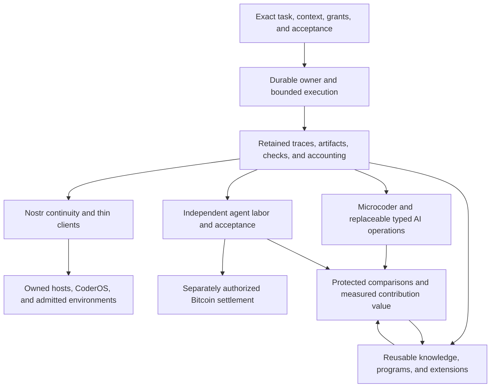

# OpenAgents master roadmap

Updated September 26, 2026. This is the single cross-project roadmap for what
OpenAgents is building and considering. Detailed designs define contracts;
runbooks describe shipped behavior; dated reports preserve measured outcomes.
The [documentation index](README.md), [complete catalog](catalog.md), and
[glossary](glossary.md) separate those roles.

The direction is one reliable, economical coding agent that people can embed
in their workflows, use across their devices, extend with reusable components,
and hire through an open network. Coder is the anchor product. Agent labor is
a high-priority parallel track. Shared knowledge and reusable programs should
improve accepted work across operators; their existence alone is not a network
effect or proof of better coding performance.

The earlier [transcript-derived roadmap](history/2026-09-25-transcript-roadmap.md)
is retained as historical analysis. Its issue statuses, model results, and
calendar estimates are not current commitments. The transcript archive itself
is unchanged by this documentation pass.

## Status and authority

| Label | Meaning |
| --- | --- |
| Implemented | The described code path exists; its evidence and support boundaries still apply. |
| Partial | An implemented slice exists, while the larger named outcome remains incomplete. |
| Active | An issue is claimed and work is underway; this is not a completion claim. |
| Planned | A specific desired outcome with dependencies and acceptance; no implied active owner. |
| Research | A hypothesis or experiment that can be rejected. |
| Deferred | An explicit optional direction outside the current product milestone. |
| Historical | Retained evidence or a superseded proposal; not an instruction to recreate an old stack. |

An issue can close after a scoped implementation, a negative experiment, or a
recorded deferral. Read its closing result before interpreting closure as a
successful capability. A parser, example, simulator run, or service template
is evidence for that specific layer only. Production readiness and comparative
model claims need their own evidence.

The [suite delivery tracker](coder/migration-status.md) owns the M0–M20 package
ledger, including M6a, and live issue ownership. The [benchmark status](terminal-bench/README.md)
owns comparison results. The [protocol coverage review](protocol/2026-09-26-nip-implementation-coverage.md)
owns implemented NIP roles. This page links those sources instead of copying
changing scores, inventories, or every issue checkbox.

## Priorities and dependencies

1. Make each local task controllable and inspectable: exact admission, one
   execution owner, bounded effects, complete evidence, and independent checks.
2. Finish the Microcoder repository adapter and client continuity over that
   owner. Ship useful local and cross-client slices as their acceptance passes.
3. Improve the economical coding loop and shared knowledge through frozen,
   source-separated comparisons. Keep implementation work moving while
   independent studies run.
4. Deliver useful agent labor alongside the core: free bounded orders first,
   independently operated providers next, then explicitly authorized Bitcoin
   settlement and demonstrated buyer demand.
5. Expand host packaging, native clients, environments, component distribution,
   and optional managed capacity without duplicating the agent or its authority.

This graph describes product dependencies. It does not require every research
result, platform release, or full verification matrix before independent work
can proceed. [Development verification](verification.md) is targeted; the full
manual matrix is release-only.

### Shared native interfaces

[Rust Native](../crates/rust-native/README.md), tracked in
[#9693](https://github.com/OpenAgentsInc/openagents/issues/9693), is the shared
UI foundation for progressive Coder client adoption. Its initial implementation
provides serializable `Stack`, `Text`, and `Button` elements, typed application
intents bound to the current view instance/revision/node, deterministic style
composition, and generic colors. Coder's palette belongs to `coder-ui`;
the existing terminal consumes it through compatibility reexports. Native renderers are still planned.

The [specification](coder/rust-native/architecture.md),
[build order](coder/rust-native/build-order.md), and
[adoption map](coder/rust-native/adoption.md) keep this work incremental:
preserve current terminal behavior, add small native and web adapters, and
migrate one consumer at a time. The Apple target uses a thin SwiftUI bridge
with state and domain logic in Rust. The earlier UIKit feasibility probe
remains UIKit evidence; it does not establish SwiftUI support. UI activation
does not replace task grants, and framework completion is not a prerequisite
for unrelated runtime, host, knowledge, or labor work.

## Complete outcome map

Stable R identifiers group the vision across documents. They are navigation
labels, not new protocols or a second issue tracker.

| Track | Current basis | Next desired outcome and completion evidence | Detailed owner documents |
| --- | --- | --- | --- |
| **R1 — Economical coding** | Coder, Coder One, Microluna, and Microcoder implement different recorded execution paths. Selected task wins and historical losses exist. | Repeated useful repository and benchmark completions under exact model, effort, tool, and budget controls. Count all attempts, latency distributions, known costs, and unknown totals; demonstrate transfer before broad superiority claims. | [Thesis](coder/design/thesis.md), [networked Coder plan](coder/design/networked-coder-plan.md), [Microcoder guide](coder/guides/microcoder.md), [current results](terminal-bench/README.md) |
| **R2 — One durable task** | Local inbox, explicit execution owner, recovery, ATIF views, retained artifacts, frozen context, and protected checks are implemented. | Complete the common local/container model adapter, detached control, recovery, and exact candidate verification. Keep completion, verification, acceptance, and integration separate. | [Task owner](coder/runtime/task-owner.md), [repository adapter](coder/runtime/microcoder-repository.md), [frozen context](coder/runtime/frozen-task-context.md), M2–M6 in the [migration tracker](coder/migration-status.md) |
| **R3 — Clients and continuity** | Terminal/headless and Gym inspection work; Rust mobile feasibility has target-specific prototype evidence. Rust Native supplies the generic semantic/style core; `coder-ui` owns the application theme consumed by the terminal. A scoped CTRL host/client bridge supplies private task control; the [iOS reader](coder/guides/mobile-readonly.md) supplies SwiftUI lists/transcripts and encrypted retained-harness observation. Full task control and other client adapters remain planned. | One computer-started task is observed, corrected, disconnected, reconnected, and checked through an authorized mobile client without duplicated effects. Deliver iOS, Android, desktop, and Rust web slices with separate input, accessibility, lifecycle, credential, and revocation evidence. | [Product suite](coder/design/typesafe-product-suite.md), [Rust Native adoption](coder/rust-native/adoption.md), [mobile feasibility](coder/design/rust-mobile-feasibility.md), [CTRL host](coder/runtime/nostr-task-control.md), [CTRL contract](../nips/openagents/NIP-CTRL.md), M1/M7–M10/M13 |
| **R4 — Hosts, CoderOS, and environments** | Local execution boundaries, process supervision, worktrees, and verified bundle/one-shot service packaging exist. | Accept clean Linux and macOS hosts; support exact resource admission, restart recovery, update/rollback, and state compatibility. Build a pinned generic CoderOS profile and admitted environment leases with materialization, cleanup, and uncertain-resource accounting. | [Portable host](coder/runtime/portable-host.md), [migration assessment](coder/design/coder-suite-migration.md), [ENV](../nips/openagents/NIP-ENV.md), M11/M12/M15 |
| **R5 — Context and operation discovery** | Scoped local instruction capture, exact frozen knowledge, evidence programs, and bounded context selection exist in specific paths. | Share versioned source captures, workspace views, requirement coverage, and recipient-specific context. Discover a small eligible operation set, expand schemas/manuals on demand, and measure missing evidence and false activation. | [TypeSafe analysis](coder/design/typesafe-agent-analysis.md), [decision-function inventory](coder/design/decision-function-inventory.md), [CTX](../nips/openagents/NIP-CTX.md), [WS](../nips/openagents/NIP-WS.md), [POL](../nips/openagents/NIP-POL.md) |
| **R6 — Programs, plugins, and packages** | Rust registries, six runnable program step kinds (generic `invoke` remains refused), a bounded Wasm host, evidence guests, local locks, client plugins, and skill-directory components exist. | Distribute compatible, exact components over Nostr; keep installation inert; admit host bindings separately; scope skills and roll back activation. Prove useful reuse by another operator and compare components with their absence. | [Extensions](extensions/README.md), [programs](programs.md), [CAP](../nips/openagents/NIP-CAP.md), [PRG](../nips/openagents/NIP-PRG.md), [EXT](../nips/openagents/NIP-EXT.md), M16 |
| **R7 — Shared knowledge and contribution** | Local retrieval/contribution, NIP-KB publication, immutable snapshots, private bundles, exact evidence intake, and study bookkeeping exist. | Demonstrate source-separated benefit on unseen work with retained failures, exact entry versions, lawful disclosure, and uncertainty. Support curation, withdrawal, attribution, and rewarded useful contributions without treating retrieval or authorship as proof of value. | [Knowledge guide](coder/guides/knowledge-base.md), [evidence](coder/runtime/knowledge-evidence.md), [bundles](coder/runtime/knowledge-bundles.md), [study rules](coder/runtime/knowledge-studies.md), [Beat Fable initiative](coder/beat-fable-together.md), M6a/M19 |
| **R8 — Agent labor** | A bounded zero-price buyer/provider host completes an authenticated order, real execution, delivery, separate checking, and buyer acceptance. | Let independent operators offer explicit capacity and complete useful coding jobs. Add discovery, commercial rights, rework and dispute handling under fixed terms, recovery, and paid acceptance. Measure repeat buyers, accepted jobs, provider earnings, and all-in cost. | [Market infrastructure](agents/market-infrastructure.md), [free labor](coder/runtime/free-labor.md), [MKT](../nips/openagents/NIP-MKT.md), [LAB](../nips/openagents/NIP-LAB.md), M18 |
| **R9 — Bitcoin and operation payments** | Monetary ledgers and payment-related protocol validation exist; they do not constitute a live Lightning labor or x402 payment service. | Add bounded wallet/facilitator adapters, exact purchase authorization, invoice/payment binding, fee limits, recovery, and unknown-state handling. Distinguish pre-execution x402 operations, post-acceptance labor settlement, zaps, and optional author royalties. | [Lightning x402 assessment](coder/design/x402-lightning-nostr-integration.md), [X402](../nips/openagents/NIP-X402.md), [NWC](../nips/official/47.md), [zaps](../nips/official/57.md), [market plan](agents/market-infrastructure.md) |
| **R10 — Open coordination protocols** | Pinned official/Block NIPs, relay behavior, signatures/encryption, CJ decisions/execution, and selected OpenAgents validators and hosts exist. | Finish admitted host roles for SESS, CTRL, WS, WORK, AUTO, ENV, LIVE, RUN, and related contracts. Test replay, expiry, ownership generations, disclosure, revocation, and finite catch-up; advertise only proven roles. | [NIP index](../nips/README.md), [protocol implementation plan](protocol/implementation-plan.md), [teardown integration](coder/design/teardown-nostr-integration.md), [coverage](protocol/2026-09-26-nip-implementation-coverage.md) |
| **R11 — Decision API and services** | Native decisions, classification, batch/jobs, review policies, accounts, workspaces, usage, billing, discovery, MCP, Rust clients, skills, recipes, and training/admission components are implemented in bounded forms. | Qualify deployments and customer workflows on real permitted workloads, declare operational commitments, support portable installs and upgrades, and retain honest capacity, privacy, identity, and billing evidence. Additional SDK languages require their own accepted language boundary. | [Decision API](decision-models/api/decision-api.md), [service contracts](decision-models/service/README.md), [clients](decision-models/guides/clients.md), [caller pilot](gym/measurements/2026-09-24-caller-pilot/plan.md) |
| **R12 — Decision models and placement** | Jev client plus local Kev, Laya, and Lev serving paths; hardware-specific measurements and artifact identity exist. | Choose doors by workload evidence, latency, error costs, support, and actual economics. Qualify trained artifacts and placement/mesh proposals independently. Keep image decisions and confidential inference deferred until their separate feasibility and threat-model gates pass. | [Decision models](decision-models/README.md), [Kev](kev/README.md), [Laya](laya/README.md), [Lev](lev/README.md), [image decisions](decision-models/service/image-decisions.md), [confidential inference](decision-models/service/confidential-inference.md) |
| **R13 — Measurement and optimization** | Gym evaluates decision models and reads coding runs; Terminal-Bench harnesses, replay, component studies, and retained negative results exist. | Make every proposed replacement reproducibly comparable. Bound search and costs, protect confirmation, retain exposure, and promote only under declared criteria. OPT contracts and optimization machinery do not prove improved behavior by themselves. | [Gym](gym/README.md), [Terminal-Bench](terminal-bench/README.md), [optimization](optimization/README.md), [NIP-OPT](../nips/openagents/NIP-OPT.md), [NIP-EVAL](../nips/openagents/NIP-EVAL.md) |
| **R14 — Device actions, media, and automation** | Specific terminal/world/device probes and subprocess boundaries exist; broad device and automation host contracts are designed. | Admit observation, transmission, recording, speaking, browser/computer input, schedules, and continuations separately. Prove target freshness, exact authority, human override, missed-occurrence handling, and cleanup on each supported platform. | [LIVE](../nips/openagents/NIP-LIVE.md), [AUTO](../nips/openagents/NIP-AUTO.md), [teardown plan](coder/design/teardown-nostr-integration.md), M10/M14/M17 |
| **R15 — Optional managed hosting** | Gateway tenancy/accounting and worker primitives supply pieces, not a complete Coder Cloud product. | Offer managed task capacity beside owned hosts and labor providers, with explicit tenant isolation, execution placement, export/deletion, recovery, access plans, and measured service economics. Local use remains independent. | [Suite plan](coder/design/typesafe-product-suite.md), [service specification](coder/design/service-spec.md), [tenancy/gateway](decision-models/service/gateway.md), M20 |
| **R16 — Verse, games, and broader agents** | Verse's shared desktop/iOS world, desktop chat, and Voyager/Minecraft research paths exist; XP and knowledge quests implement narrower contribution mechanics. | Use worlds and progression to make useful work visible, without equating activity or awards with transfer. Keep open-ended game research and future noncoding domain profiles independently evaluated. | [Verse](verse/README.md), [Voyager](voyager/README.md), [Minecraft](minecraft/README.md), [general agents](agents/README.md), [XP](../nips/openagents/NIP-XP.md) |
| **R17 — Operations, discovery, and documentation** | Public discovery/docs, install/runbook infrastructure, focused manual verification, and release checks exist. | Keep one current entry point per domain, exact version/support statements, working examples, compatibility windows, dependencies/licenses, incident and recovery procedures, and release evidence. | [Documentation policy](documentation.md), [verification](verification.md), [dependencies](dependencies.md), [deployment](deployment/README.md), [service operations](decision-models/service/operations.md) |

## The first suite milestone

The M-package tracker defines the complete migration backlog. The first product
slice is narrower: a repository task starts on a computer, exposes its actual
transcript and artifacts, accepts an authorized correction from a mobile
client, survives disconnect/reconnect, and returns one independently checked
result. Duplicate delivery must not duplicate execution. Revoked or stale
clients must lose authority before they receive new content or cause effects.

Each platform supplies its own evidence. A simulator proves that simulator
path, a physical device proves that device path, and neither proves clean-host
installation, production deployment, or every platform's accessibility. A
bounded service package is useful before a complete CoderOS distribution.

Paid labor has its own parallel milestone: an independent provider completes
a real buyer's bounded coding job, the buyer accepts it under frozen terms,
and the agreed Bitcoin payment is confirmed. An unresolved payment stays
explicitly unresolved and leaves this milestone incomplete. A free synthetic
order establishes part of this path, not the commercial milestone.

## What establishes improvement

The unit of value is a useful accepted outcome under known requirements.
Preserve the original task/source, model and effort, tool and component set,
context/knowledge identities, execution budget, checker authority, attempts,
trace gaps, and cost completeness. Report unsuccessful and ungraded attempts.

Same-task harvested knowledge is development evidence. Repetition on the same
task does not establish transfer. A run that costs less than a public leader's
run is a real configuration comparison when its evidence supports that claim;
it does not isolate Coder's causal contribution. That requires the same
executor configuration with and without the changed Coder component.

Truthful checks remain an empirical problem. Earlier studies and their
negative or inconclusive results stay visible in the benchmark index. Frozen
independent checks strengthen the product's acceptance boundary; they do not
retroactively turn earlier model-written checks into trustworthy labels.

Network value must survive this same scrutiny: useful knowledge transfers,
components get reused, independent providers fulfill jobs, and contributors
receive the agreed credit or payment. More agents, tokens, protocol documents,
or possible group combinations do not establish that result.

## The legacy map

| Historical direction | Current disposition |
| --- | --- |
| MechSuit, Autopilot, Khala/Khala Code, Omega, Sarah, and earlier OpenAgents Desktop brands | Preserve their useful designs and history; implement the selected behavior as Coder suite capabilities. The names do not denote current supported products. |
| Earlier TypeScript/Effect/Bun, Elixir/Phoenix, private service APIs, and backend-specific clients | Reference designs only. Reimplement in public Rust under the repository contract. The existing Lev bridge and planned thin SwiftUI adapter have narrow explicit scopes; infrastructure tooling remains separate. |
| Extism-era marketplace and prior evidence plugins | Current Wasm/program/skill systems supply the implementation direction. Measure use and benefit; do not revive an unused registry as a success metric. |
| Historical author revenue shares and developer bounties | Record an explicit disposition when terms are settled. Labor settlement is high priority; automatic royalties or historical payout completion are not claimed. |
| Nostr markets and earlier swap infrastructure | Reuse bilateral negotiation, provider independence, exact obligations, and recovery. Swaps, liquidity markets, and financial risk products are not prerequisites for Coder or labor. |
| GPUtopia, Pylon, Psionic, distributed inference, and broader compute markets | Optional infrastructure/research directions. Pull in only an admitted capability with demand and measurements; do not make the current coding milestone depend on them. |
| Agent Forge/GetAfter and a GitHub replacement | Deferred product direction. Current collaboration stays on the repository's chosen issue/source host; durable evidence and open protocols can improve continuity independently. |
| General notes/calendar, forums/social products, experimental input, broad hardware markets, and optional compositor parity | Deferred unless a bounded component demonstrably serves the current task/client or labor path. Generic agent contracts permit later domains without promising their applications now. |

The [historical roadmap](history/2026-09-25-transcript-roadmap.md),
[transcript index](transcripts/README.md), and [teardown coverage ledger](protocol/2026-09-26-teardown-coverage.md)
retain the detailed source history. Reading a historical instruction is not
permission to resurrect its stack, prices, secrets, or operational settings.

## Maintaining this roadmap

When a slice lands, update its owning runtime guide and evidence index, then
change this page only if the track's status, priority, dependency, or acceptance
boundary changes. Keep issue ownership in the migration/feature tracker and
results in dated measurement reports. Link superseded proposals to their
successors; preserve failed evidence. New ideas belong under an existing R
track or need an explicit new disposition here.

This roadmap does not assign dates without an accepted delivery plan. It does
not turn a design into a release promise or a full release check into a daily
issue blocker.
