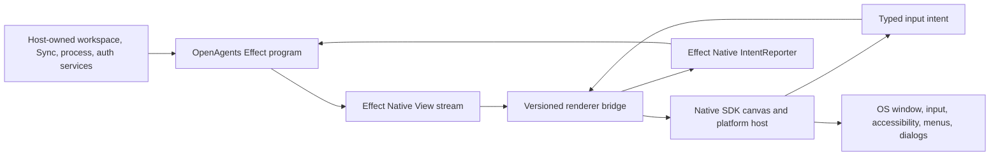

# Vercel Native SDK, Effect Native, and OpenAgents Desktop audit

- Date: 2026-07-14
- Snapshot: OpenAgents `843668fd3784ca0901dfd835af5c860a1c6504dc`; Native SDK `f7aa92af6dcece250feba852af4d22e7f5429312` (`v0.5.1`); vendored Effect Native `412640adbe2979926c64c7aaf29721677638d4ec` (`effect-native/v39`)
- Class: architecture and dependency audit
- Status: recommendation; no implementation, migration, or release authority
- Dispatch: no; any experiment needs a bounded issue and claim after the
  current Desktop release path is protected
- Owner: OpenAgents Desktop and Effect Native architecture
- Final disposition: retain until Native SDK is adopted, rejected, or superseded by a later renderer/host decision
- Decision: retain Electron as the shipping OpenAgents Desktop host; treat
  Native SDK as a promising pre-1.0 renderer/platform reference and permit
  only a disposable Effect Native renderer spike against a small catalog
  slice

## Executive decision

[Native SDK](https://github.com/vercel-labs/native) is technically serious and
architecturally relevant to OpenAgents. It is no longer merely the small
WebView shell described by early `zero-native` coverage. At the audited
`v0.5.1` tag it is a roughly 270,000-line Zig/TypeScript/C++/Objective-C
implementation-and-test source tree with its own retained canvas UI,
declarative `.native` markup,
Model/Msg/update runtime, TypeScript-to-Zig compiler, desktop hosts, experimental
mobile hosts, guarded OS capabilities, deterministic automation, packaging,
and optional WebViews.

It is **not** a viable drop-in replacement for Electron in the current
OpenAgents Desktop application. The blocker is not whether Native SDK can draw
buttons or open windows. The blocker is that OpenAgents Desktop is a large
Effect program with npm dependencies, Effect fibers, streams, schemas,
SQLite, process supervision, workspace services, PTYs, Git/GitHub, encrypted
session custody, Codex and Claude runtimes, and a mature schema-checked host
boundary. Native SDK's TypeScript core deliberately cannot run that program:
it has no npm ecosystem, Promise, `async`/`await`, `JSON`, `Map`/`Set`, or
general JavaScript runtime. It compiles a closed pure subset to Zig.

Effect Native **could target Native SDK**, but only if the integration keeps
the responsibilities straight:

- Effect Native remains the one application, state, intent, component, and
  theme authority.
- Native SDK becomes a renderer and selected platform-services host beneath
  that authority.
- The Effect runtime remains real Effect TypeScript in a JavaScript runtime,
  initially a bundled Node sidecar if the browser renderer is removed.
- A generated, versioned, bounded protocol carries resolved Effect Native
  `View` frames or reconciliation operations to a Zig renderer and carries
  typed intents back.
- Native SDK's Model/Msg/update loop is not allowed to become a second product
  state machine, and product screens are not authored a second time in
  `.native`.

That architecture is viable enough to prototype. It is not production-viable
enough to displace Electron today. The rational near-term action is to learn
from Native SDK's deterministic rendering, accessibility snapshots, automation,
source provenance, explicit capability policy, and headless `NullPlatform`,
while shipping the existing Electron + Effect Native design. A future spike
should prove a small `@effect-native/render-native-sdk` adapter, not begin an
OpenAgents Desktop rewrite.

## Direct answers

### What is Native SDK?

Native SDK is a Vercel Labs, Apache-2.0 toolkit for native desktop applications,
with experimental iOS and Android support. The audited default application is
three authored files:

```text
src/core.ts     pure Model / Msg / update logic
src/app.native  declarative native UI
app.zon         app, capability, security, window, and packaging manifest
```

The TypeScript core is checked and transpiled to arena-backed Zig. Release
binaries carry no JavaScript engine, browser, or WebView unless the application
explicitly opts into web content. The runtime rebuilds a retained widget tree,
preserves structural/keyed identity, lays it out, produces accessibility state,
and presents pixels through the platform host. WebViews, native controls, and
native chrome remain available as composable surfaces around the canvas.

### Could OpenAgents use it?

Yes, in three bounded ways:

1. **Reference implementation now.** Borrow its testing, deterministic
   automation, accessibility-audit, capability-manifest, source-provenance,
   and canvas lifecycle ideas into Effect Native.
2. **Small standalone native utility later.** A status, diagnostics, or focused
   utility application with modest service needs could be a better first
   production candidate than the full coding workroom.
3. **Effect Native renderer experiment.** Implement a small Native SDK-backed
   renderer for the existing Effect Native `View` contract, with the current
   application runtime outside Native SDK's restricted TypeScript core.

It should not be used to fork the OpenAgents UI catalog, rewrite the Desktop
app in `.native`, or replace Electron before host-service and release parity
exist.

### Can Effect Native target it?

Yes at the renderer boundary; no at the Native SDK TypeScript-core boundary.

Effect Native already exposes the right abstraction:

```ts
interface RendererAdapter<Container, Surface> {
  mount(
    container: Container,
    viewStream: Stream<View>,
    report: IntentReporter,
  ): Effect<Surface, never, Scope>
}
```

A Native SDK adapter can subscribe to that `viewStream`, lower catalog nodes to
Native SDK widget descriptions, and report user actions through the existing
typed `IntentReporter`. Nothing about that contract requires DOM, React, React
Native, Electron, SwiftUI, or a browser.

The existing Effect program cannot be sent through Native SDK's TypeScript
transpiler. Effect v4 and OpenAgents rely on npm modules, higher-order runtime
behavior, asynchronous effects, fibers, streams, schemas, service layers, and
dynamic JavaScript facilities that the Native SDK subset excludes by design.
An adapter therefore needs a runtime/renderer bridge or a future in-process JS
embedding layer; it is not a compiler flag.

### Should it replace Electron now?

No. Electron remains the lower-risk shipping host for the current OpenAgents
Desktop capability set and release program. Native SDK should be revisited
after a renderer spike and a measured host-parity proof, not selected on the
strength of small-binary or native-pixel expectations alone.

## Evidence basis

The upstream reference was cloned at the requested
`projects/repos/native` path and audited at exact tag `v0.5.1`. The Git remote
`vercel-labs/native` and the older `vercel-labs/zero-native` URL resolve to the
same repository. The audit covered source, tests, current documentation,
history, tags, releases, and open upstream issues.

Pinned Native SDK sources:

- [README and quick start](https://github.com/vercel-labs/native/blob/f7aa92af6dcece250feba852af4d22e7f5429312/README.md)
- [v0.5.1 changelog](https://github.com/vercel-labs/native/blob/f7aa92af6dcece250feba852af4d22e7f5429312/CHANGELOG.md)
- [TypeScript core contract](https://github.com/vercel-labs/native/blob/f7aa92af6dcece250feba852af4d22e7f5429312/docs/src/app/typescript/page.mdx)
- [where npm packages go](https://github.com/vercel-labs/native/blob/f7aa92af6dcece250feba852af4d22e7f5429312/docs/src/app/typescript/packages/page.mdx)
- [app model](https://github.com/vercel-labs/native/blob/f7aa92af6dcece250feba852af4d22e7f5429312/docs/src/app/app-model/page.mdx)
- [native UI and accessibility contract](https://github.com/vercel-labs/native/blob/f7aa92af6dcece250feba852af4d22e7f5429312/docs/src/app/native-ui/page.mdx)
- [native surfaces](https://github.com/vercel-labs/native/blob/f7aa92af6dcece250feba852af4d22e7f5429312/docs/src/app/native-surfaces/page.mdx)
- [platform matrix](https://github.com/vercel-labs/native/blob/f7aa92af6dcece250feba852af4d22e7f5429312/docs/src/app/platform-support/page.mdx)
- [security model](https://github.com/vercel-labs/native/blob/f7aa92af6dcece250feba852af4d22e7f5429312/docs/src/app/security/page.mdx)
- [capabilities](https://github.com/vercel-labs/native/blob/f7aa92af6dcece250feba852af4d22e7f5429312/docs/src/app/capabilities/page.mdx)
- [automation](https://github.com/vercel-labs/native/blob/f7aa92af6dcece250feba852af4d22e7f5429312/docs/src/app/automation/page.mdx)
- [packaging](https://github.com/vercel-labs/native/blob/f7aa92af6dcece250feba852af4d22e7f5429312/docs/src/app/packaging/page.mdx)
- [signing](https://github.com/vercel-labs/native/blob/f7aa92af6dcece250feba852af4d22e7f5429312/docs/src/app/packaging/signing/page.mdx)
- [update placeholder](https://github.com/vercel-labs/native/blob/f7aa92af6dcece250feba852af4d22e7f5429312/docs/src/app/updates/page.mdx)
- [extension registry and experimental JS seam](https://github.com/vercel-labs/native/blob/f7aa92af6dcece250feba852af4d22e7f5429312/docs/src/app/extensions/page.mdx)
- [embed C ABI](https://github.com/vercel-labs/native/blob/f7aa92af6dcece250feba852af4d22e7f5429312/docs/src/app/embed/page.mdx)

OpenAgents sources inspected:

- [Desktop architecture and capability ledger](../../apps/openagents-desktop/README.md)
- [Desktop package and Electron version](../../apps/openagents-desktop/package.json)
- [Electron main process](../../apps/openagents-desktop/src/main.ts)
- [Forge release configuration](../../apps/openagents-desktop/forge.config.ts)
- [Effect Native renderer boot](../../apps/openagents-desktop/src/renderer/boot.ts)
- [mechanical Electron/Effect Native boundary oracle](../../apps/openagents-desktop/tests/electron-boundary.test.ts)
- [vendored Effect Native pin](../../apps/openagents.com/packages/effect-native-vendor.json)
- [vendored Effect Native core and renderer adapter](../../apps/openagents.com/packages/effect-native-core/src/index.ts)
- [mobile Effect Native host](../../apps/openagents-mobile/src/effect-native/effect-native-host.tsx)
- [Effect Native framework dossier](../effect-native/README.md)
- [one-UI substrate and EN-5/EN-6 plan](../effect-native/2026-07-08-effect-native-one-ui-substrate-analysis.md)
- [SwiftUI renderer audit](../effect-native/2026-07-09-effect-native-swiftui-renderer-audit.md)
- [current component-demand register](../effect-native/DEMAND_REGISTER.md)

The upstream Native SDK repository had 270 commits from 2026-05-08 through the
audited 2026-07-13 release, 268 authored by one contributor and one each by two
others on the audited branch. GitHub reported 6,254 stars, 254 forks, 30 open
issues, and 40 open pull requests at review time. These are maturity signals,
not quality verdicts:
the project has real momentum and unusually broad implementation, but still
has concentrated stewardship, very high API churn, and no stable 1.0 contract.

Verification run on the pinned source:

```text
zig 0.16.0
zig build test  -> exit 0
```

The run emitted expected negative-test diagnostics for invalid signing,
manifest, replay, font, and effect cases. It also reported that the Android
toolchain was unavailable on this Mac, so Android project generation was
exercised but APK assembly was not local proof. No upstream source was changed.

## How Native SDK works

### One toolkit with three application modes

The current repository has three meaningful modes, not one:

| Mode | UI | Application logic | Runtime cost and purpose |
| --- | --- | --- | --- |
| Native-first default | `.native` markup or Zig widget builder | restricted TypeScript compiled to Zig, or Zig | no browser or JS engine; smallest and most deterministic shape |
| Hybrid | canvas/native chrome plus selected WebViews | Zig/compiled core plus web application where needed | specialist web content without making the entire app a WebView |
| Web frontend | Next, Vite, React, Svelte, Vue, or static assets in system WebView/CEF | JavaScript in WebView plus guarded native bridge | easiest compatibility path; much closer to a web shell |

The first mode is the strategically interesting one for Effect Native. The
third mode could host today's DOM renderer but would mostly exchange Electron's
Chromium/Node integration for system-WebView variability and a new native host.
It would prove shell portability, not a native Effect Native renderer.

### TypeScript is an authoring language, not a JavaScript runtime

Native SDK's `core.ts` contract is unusually explicit:

- `Model` is readonly application data.
- `Msg` is a discriminated union of every event.
- `update(model, msg)` is pure and synchronous.
- asynchronous work is returned as inert `Cmd` data and recurring work as
  `Sub` data;
- dynamic text is UTF-8 `Uint8Array`, with byte-oriented semantics;
- frame and committed-model arenas default to fixed 1 MiB capacities and panic
  loudly on overflow;
- the emitted release code is Zig, with no JavaScript engine or garbage
  collector.

The subset is broad as a language but intentionally closed as an ecosystem.
It excludes npm packages, `JSON`, Promise, `async`/`await`, regular expressions,
`Map`, `Set`, `eval`, module-level mutable state, and ambient time/randomness in
`update`. This is the source of its deterministic replay and small runtime. It
is also why OpenAgents cannot compile Effect into it.

The built-in command vocabulary is useful but bounded: time, delay, whole-file
read/write, buffered fetch, clipboard, subprocess streaming or collection,
audio, host requests, cancellation, and batching. Persistence in the
TypeScript tier is currently file read/write, not an application database.

Node libraries are supported as explicit child-process sidecars. The default
line stream limit is 4 KiB, raisable per spawn to a hard 256 KiB ceiling;
collected stdout is bounded to 512 KiB. That mechanism is appropriate for
bounded commands and agent-event lines, but it is not by itself a production
renderer transport for arbitrary Effect Native trees. A renderer adapter needs
an owned framed protocol with backpressure, version negotiation, bounded
payloads, crash recovery, and lifecycle receipts.

### Rendering is native-hosted retained canvas, not an OS widget tree

The default UI is native in the important binary and presentation sense: it is
compiled code in a real OS window, with no browser engine, and the toolkit owns
input, layout, accessibility, reconciliation, and pixels. Most catalog controls
are retained canvas widgets, not direct AppKit, WinUI, GTK, SwiftUI, or Compose
controls. Native chrome, menus, controls, dialogs, tray items, and WebViews are
separate host surfaces that can be composed around the canvas.

This distinction matters for architecture and product claims:

- Native SDK can deliver consistent, deterministic visuals and screenshots.
- It does not automatically inherit every platform control's behavior or
  visual fidelity.
- Accessibility requires a correct semantic bridge from retained widgets to
  each OS, which the project implements and tests but must be accepted on real
  assistive technologies.
- Input method, font shaping, text selection, focus, drag/drop, large lists,
  and specialist editor/terminal behavior remain renderer work.

After each update, the toolkit rebuilds the view and preserves runtime-owned
state through structural identity, sibling keys, and global keys. Release
markup is compiled at Zig comptime; debug mode can parse and hot-reload markup
while keeping the model and widget identity.

### Platform reality at v0.5.1

| Area | macOS | Windows | Linux | Mobile |
| --- | --- | --- | --- | --- |
| Window host | full desktop | full desktop | full desktop | toolkit-owned single-window host or embed, experimental |
| Canvas presentation | Metal-backed | deterministic software renderer, GDI blit | deterministic software renderer, cairo blit | CPU renderer presented by UIKit/Android host |
| Web engine | WKWebView; optional bundled CEF | system WebView2 | system WebKitGTK | system WebView in host/embed paths |
| Native app menus | supported | supported | supported | unsupported |
| Tray | supported | supported | unsupported | unsupported |
| Packaging | `.app`, DMG, icons | directory artifact; installer future work | install tree; packages/AppImage future work | generated projects; manual store signing |
| Signing | identity/ad-hoc; manual notarization step | no SDK signing tooling | no SDK signing tooling | no SDK signing tooling |
| Multi-window | supported | supported | supported | desktop only |
| Automation | full file protocol | full | full under Xvfb | experimental file/embed protocol |

Mac is clearly the lead platform. OpenAgents Desktop currently ships a macOS
release lane, so that is not fatal for a spike. It is fatal to any claim that a
host replacement already improves cross-platform delivery.

### Security posture

Native SDK has a good security direction:

- `app.zon` declares capabilities and runtime permissions;
- bridge commands are default-deny and require registration, policy, matching
  permission, and allowed origin;
- navigation is origin-allowlisted;
- external links are denied unless action and URL patterns are explicit;
- child WebViews receive a bridge only when created with `bridge: true`;
- dialog, clipboard, credential, and OS commands always require explicit
  builtin bridge policy;
- bridge payloads are capped at 16 KiB;
- native-only builds can exclude WebView libraries entirely.

This is compatible with OpenAgents' tokenless-renderer discipline. It does not
automatically reproduce it. The current Electron boundary is enforced by
schema checks and source oracles around `contextIsolation`, sandboxing, fixed
IPC channels, sender validation, CSP, navigation denial, and host-owned
credentials. A Native SDK adoption would need equivalent OpenAgents-specific
oracles over the new renderer protocol and every native extension. Moving away
from Chromium removes one attack surface but introduces a new sidecar/native
ABI and protocol surface.

Credential storage is implemented through Keychain on macOS, Credential
Manager on Windows, and Secret Service/libsecret where available on Linux.
This is a promising replacement for Electron `safeStorage`, but parity is not
just “can store a secret.” OpenAgents must preserve refusal when secure storage
is unavailable, atomic encrypted-record lifecycle, rotation validation,
sign-out/revocation semantics, and the guarantee that credentials never cross
the renderer protocol.

### Automation and agent-facing ergonomics

Native SDK's strongest immediately reusable ideas are in automation:

- a file-based command queue with consumption acknowledgements;
- accessibility snapshots with roles, names, bounds, state, and focus;
- deterministic screenshots through the CPU reference renderer;
- input, focus, menu, shortcut, tray, drag, wheel, resize, and bridge actions;
- rolling p50/p90/max timing by render-pipeline stage;
- record/replay against state fingerprints;
- source provenance from a live widget to file/span/template/iteration keys;
- guarded minimal-diff source write-back followed by hot reload;
- `NullPlatform` and headless application harnesses.

This aligns exceptionally well with an agent-authored Effect Native product.
Effect Native already treats UI as validated serializable data and tests
renderer conformance. Adopting comparable provenance and deterministic
headless rendering may deliver value even if Native SDK never becomes a
shipping host.

### Packaging and updates are not yet Electron Forge parity

Native SDK packages a compelling macOS native-only app and has explicit
WebView-layer audits, generated icons, signing, and a DMG path. The broader
release story is incomplete:

- notarization submission and stapling remain manual documented steps;
- Windows has a directory artifact, no installer or signing tooling;
- Linux has an install tree, no AppImage/deb/rpm tooling;
- iOS and Android are experimental generated hosts with manual production
  signing;
- the `updates` manifest fields reserve a feed URL, public key, and
  check-on-start flag, but the runtime does not provide a silent or complete
  update installer.

OpenAgents' Forge configuration already assembles a hardened Electron package,
unpacks required runtime executables/workers, includes the native audio helper,
applies fuses, signs/notarizes, and makes macOS artifacts. A migration would
have to reproduce that exact payload and acceptance lane before it could be a
release simplification.

## The current OpenAgents architecture

### Effect Native is the application contract

The vendored `effect-native/v39` snapshot defines a large serializable `View`
union, typed `IntentRef` values, an `IntentRegistry`, `SubscriptionRef` state,
`Stream<View>` output, Effect services, and a generic renderer adapter. The
catalog contains far more than basic controls: workbench/navigation structures,
composer, transcript, Markdown, code block, diff, graph, timeline, command
palette, overlays, forms, feedback, marketing, mobile, glass, avatar, copy, and
loading components, plus a typed `Host` escape hatch for editor, terminal,
media, voice, and other specialist widgets.

The current product has two real renderer receipts:

- OpenAgents web/Desktop uses the direct DOM renderer.
- OpenAgents mobile mounts the React Native renderer through an explicit
  React/React Native host binding; application screens remain Effect Native
  data and do not author a second React component system.

The framework dossier deliberately makes renderer replacement possible. It
also makes the component set, intents, services, and Effect runtime—not any
particular renderer—the source of truth.

### Electron is a host, not the UI model

OpenAgents Desktop `0.1.0-rc.12` uses Electron `43.1.0` and Electron Forge.
The renderer boot mounts the Effect Native DOM renderer over a `View` stream;
the Electron main process owns runtime and OS authority. The hardened window
uses `contextIsolation: true`, `nodeIntegration: false`, `sandbox: true`,
`webviewTag: false`, `webSecurity: true`, deny-by-default navigation and window
creation, a restrictive CSP, and a fixed preload bridge.

The host currently owns or coordinates capabilities that matter to any
replacement decision:

- Khala Sync SQLite and device-local tables;
- encrypted native-session custody through `safeStorage`;
- OpenAuth loopback/PKCE and token rotation/revocation;
- Codex and Claude executables and provider account probes;
- agent process lifecycle, event streaming, interruption, and teardown;
- selected workspace filesystem, watching, paged search, edit, and save;
- bounded Git and GitHub operations;
- workspace-scoped PTYs and terminal lifecycle;
- audio helper/runtime assets;
- application protocol, deep-link, command, menu, and single-instance paths;
- diagnostics, preferences, updates, and release acceptance;
- closed, schema-decoded renderer projection and intent channels.

Native SDK covers meaningful pieces—windows, menus, shortcuts, dialogs,
clipboard, credentials, file drops, notifications, URL schemes, files, fetch,
subprocesses, audio, and native extensions—but not this combined contract.
The comparison unit must be the complete workroom host, not a counter app.

### Effect Native has already invested in Electron

The upstream Effect Native source at the pinned commit contains an
`@effect-native/platform-electron` package in addition to the generic desktop
contracts. It models hardened preferences, CSP, deny-by-default security,
typed IPC envelopes, sender policy, window/menu/deep-link/single-instance
services, lifecycle, and the DOM mount while depending only on structural
Electron interfaces. The monorepo does not yet vendor that package, and the
Desktop app still carries its larger application-specific host locally, but
the direction is deliberate rather than accidental.

A host replacement therefore has an opportunity cost: it pauses convergence
on a reusable, already-tested Electron platform adapter and opens a second
platform program during a shipping release sequence.

## Where Native SDK and Effect Native align

The two projects independently make several compatible architectural choices:

| Concern | Effect Native | Native SDK | Fit |
| --- | --- | --- | --- |
| UI representation | closed, serializable typed `View` union | closed markup/builder widget tree | strong |
| User actions | typed intent references | typed Msg/command dispatch | strong |
| State | `SubscriptionRef`/Effect program | Model/Msg/update | conceptually strong, but only one may own product state |
| Effects | Effect values, Layers, Scope, Stream | inert commands and recurring subscriptions | conceptually strong; runtimes are not interchangeable |
| Renderer lifecycle | scoped `RendererAdapter.mount` | runtime-owned window/canvas lifecycle | strong adapter seam |
| Identity | catalog keys and renderer reconciliation | structural, keyed, global-key identity | strong |
| Headless proof | renderer conformance/test harnesses | `NullPlatform`, record/replay, deterministic screenshots | excellent |
| Accessibility | typed props and per-renderer lowering | semantic tree plus validation and OS bridges | strong goal; needs platform acceptance |
| Styling | typed tokens and per-renderer lowering | named theme packs and tokens | mappable, not identical |
| Foreign widgets | typed `Host` nodes with scoped drivers | Zig custom widgets/modules, native surfaces, WebViews | viable explicit boundary |

This is enough common ground for a renderer. It is also a warning: the systems
overlap at the catalog, state, event, token, effect, and lifecycle layers. A
careless integration would have two frameworks trying to own the same app.

## The non-negotiable source-of-truth rule

If OpenAgents uses Native SDK under Effect Native, the authority split must be:



Rules:

1. Effect Native `View` and token schemas remain canonical.
2. Native SDK widget descriptions are generated/lowered implementation data,
   not product authoring APIs.
3. Native SDK `Model` may hold renderer-local ephemeral state only—focus,
   hover, selection, layout caches—not application truth.
4. Every native event maps to an existing typed intent or an explicit catalog
   evolution.
5. Unsupported catalog nodes fail conformance or lower through a registered
   `Host`; they never disappear silently.
6. The renderer process receives no access/provider/Pylon credentials, raw
   database handle, arbitrary process command, or unbounded filesystem path.
7. Product screens are never maintained both as Effect Native trees and
   `.native` markup.

The `.native` language remains valuable for upstream examples, isolated native
widgets, or generated fixtures. It should not become a second OpenAgents screen
language.

## Integration options

### Option A: host the current DOM renderer in a Native SDK WebView

Native SDK can package the current browser output and load it in WKWebView,
WebView2, or WebKitGTK; macOS can optionally bundle CEF.

Advantages:

- lowest UI conversion cost;
- Effect and the entire Effect Native DOM renderer continue unchanged;
- Native SDK can own native windows, menus, dialogs, credentials, and selected
  capabilities.

Costs:

- a JavaScript runtime still exists in the WebView;
- system-engine behavior differs by OS, while bundled Chromium is macOS-only;
- current Node/Electron main capabilities still need a sidecar or rewrite;
- the result gains little from Native SDK's retained native UI;
- it replaces a mature Electron security/release boundary with a younger one.

Verdict: technically straightforward, strategically weak. Use only as a shell
portability experiment, not as evidence that Effect Native has a native
renderer.

### Option B: run Effect in Node and Native SDK as an out-of-process renderer

This is the recommended spike architecture.

The Node process owns the existing Effect program, state, intent registry, and
most current host services. A Native SDK Zig process owns windows, input,
accessibility, canvas rendering, and selected OS capabilities. A generated
protocol carries bounded tree snapshots or keyed reconciliation operations and
typed input events.

Advantages:

- preserves Effect Native instead of reimplementing it;
- reaches Native SDK's native-only canvas path;
- isolates renderer crashes and keeps the renderer tokenless;
- permits incremental catalog coverage and headless protocol tests;
- reuses the existing `RendererAdapter` abstraction.

Costs:

- Node must be bundled and lifecycle-managed after Electron no longer supplies
  it;
- every frame crosses a process boundary unless diffing/coalescing is good;
- protocol versioning, backpressure, crash recovery, focus/IME ordering, asset
  transfer, and shutdown become new correctness work;
- Electron's integrated Node/Chromium packaging is replaced by two-runtime
  packaging;
- specialist WebViews and native `Host` drivers still need explicit ownership.

Verdict: best technical route to a real Native SDK renderer; not automatically
smaller or simpler than Electron for this product.

### Option C: embed a JavaScript engine inside Native SDK

Native SDK has an experimental JS abstraction and `NullEngine`, but not a
shipping embedded engine capable of running the OpenAgents Effect graph. Adding
QuickJS, JavaScriptCore, V8, or another engine could place Effect and the
renderer in one native process.

This conflicts with Native SDK's principal “no JS engine in the binary” value,
creates a large integration/security/GC/debugging program, and risks rebuilding
what Electron or a WebView already supplies. It may become attractive only if
Native SDK upstream adopts a stable engine/module contract with the semantics
Effect needs.

Verdict: reject for a first spike.

### Option D: compile Effect Native views into `.native` or Zig

Static code generation can lower a fixed Effect Native tree or component
fixture into Native SDK markup/Zig. It cannot compile the current live Effect
runtime, services, streams, or arbitrary state transitions into the Native SDK
TypeScript subset. Dynamic applications would still need a runtime bridge.

Code generation is useful for:

- native catalog type definitions;
- exhaustive tag decoders;
- token tables;
- static golden/conformance fixtures;
- accessibility snapshots;
- small renderer-owned composites.

Verdict: use code generation inside Option B, not as an application compiler.

### Option E: rewrite OpenAgents in Native SDK's Model/Msg/update

This would discard Effect Native's whole-app premise and fork the application,
services, catalog, behavior contracts, mobile/web sharing, and current host
proofs. Superficial Elm/MVU similarity does not make the runtimes equivalent.

Verdict: reject.

## Proposed `@effect-native/render-native-sdk` shape

The renderer package should remain conceptually parallel to DOM, RN, and a
future SwiftUI renderer:

```text
@effect-native/core
  View v39 + IntentRef + tokens + RendererAdapter
          |
@effect-native/render-native-sdk
  compatibility matrix
  resolved-style lowering
  keyed reconciliation
  asset registry
  protocol client
          |
native-sdk-renderer
  protocol decoder
  widget/catalog lowering
  Native SDK Runtime + platform host
  accessibility/input/automation bridge
```

### Bridge contract

The first protocol should include:

- protocol and Effect Native catalog versions;
- renderer platform/capability handshake;
- full initial tree plus bounded keyed patches or coalesced latest-tree frames;
- resolved theme tokens and platform appearance;
- stable node keys and host-kind identifiers;
- asset registration by digest, never repeated base64 in every frame;
- intent reports with node ref, intent ref, validated runtime payload, and
  monotonic sequence;
- focus, text-edit, IME composition, selection, scroll, resize, and
  accessibility actions with ordering guarantees;
- renderer-ready, frame-presented, backpressure, unsupported-node, crash, and
  unmount receipts;
- payload/queue ceilings and explicit loss/coalescing counters.

Use an actual framed IPC transport. Do not overload Native SDK's application
`Cmd.spawn` NDJSON line channel for full view trees, and do not expose its
generic WebView bridge to the product renderer.

### Initial catalog slice

Start with a deliberately uninteresting slice:

- `Stack`
- `Text`
- `Button`
- `Card`
- `Spacer`
- `Icon`
- `Divider`
- one controlled `TextField`
- one keyed/virtualized `List`

That slice proves recursion, tokens, intent dispatch, focus, text/IME,
identity, list behavior, accessibility, and asset/icon handling. Do not begin
with Composer, Transcript, Workbench, terminal, diff, graph, Markdown, or
command palette; those hide protocol flaws behind component-specific work.

### Catalog parity risks

Native SDK has a broad component library, but similar names are not semantic
parity. Effect Native v39 contains product-level nodes and behavior contracts
that have no one-to-one Native SDK equivalent. The renderer needs an explicit
matrix for:

- `Composer` and its attachment/voice/send/focus behavior;
- `Transcript`, streaming content, and follow-tail policy;
- `CodeBlock` and `DiffView` selection/copy/virtualization;
- `GraphFigure` and the canvas/Three.js ownership boundary;
- `Workbench`, `SplitPane`, and `NavRail` desktop semantics;
- overlays, sheets, modal focus traps, and command palette;
- responsive/platform/state style variants;
- `Host` kinds such as terminal and editor;
- reduced motion, contrast, keyboard, and assistive behavior;
- secure/redacted fields and automation snapshots.

A renderer is conformant when these contracts match, not when screenshots
roughly resemble each other.

### Host services

Keep product services outside the UI renderer. Native SDK platform capabilities
may implement Effect service Layers over time, for example:

- clipboard;
- safe external URL opening;
- dialogs;
- credential storage;
- notifications;
- menus, tray, windows, and deep links;
- file-drop events.

The existing Node host should initially retain:

- SQLite/Khala Sync;
- OpenAuth/network session lifecycle;
- workspace service, watcher, paged search, and bounded edit;
- PTY and terminal process lifecycle;
- Codex/Claude execution and provider integrations;
- Git/GitHub operations;
- updater/release logic;
- zstd history and worker topology.

Moving a service into Zig is a later independent decision with its own parity
tests. Renderer adoption must not force an all-at-once host rewrite.

## Viability matrix

Scores are decision aids for this snapshot, not evergreen benchmarks.

| Use | Technical viability | Product viability now | Assessment |
| --- | ---: | ---: | --- |
| Keep Electron + Effect Native | 9/10 | 9/10 | shipping path; preserve |
| Learn from Native SDK without adopting runtime | 10/10 | 10/10 | immediate value |
| Small standalone macOS native utility | 8/10 | 6/10 | good first production candidate if demanded |
| Current Effect Native DOM app in Native SDK WebView | 8/10 | 4/10 | possible, low payoff |
| Native SDK-backed Effect Native renderer spike | 7/10 | 3/10 | worthwhile bounded research |
| Full OpenAgents Desktop on renderer + Node sidecar | 6/10 | 2/10 | possible after substantial proof |
| Compile current Effect program with Native SDK TS | 1/10 | 0/10 | incompatible runtime contract |
| Rewrite product in `.native`/Model-Msg-update | 5/10 | 0/10 | violates one-catalog/Effect direction |
| Replace RN mobile host | 3/10 | 1/10 | mobile support experimental; RN is mature |

## Risks and counterevidence

### Pre-1.0 churn and stewardship concentration

Native SDK moved from `v0.4.0` to `v0.5.1` in five days around this audit, and
the TypeScript authoring tier arrived in `v0.5.0` less than a day before
`v0.5.1`.
Fast progress is attractive, but any integration must exact-pin a commit,
vendor/generate its protocol bindings, and budget for breaking changes. The
branch history is overwhelmingly single-author, which raises bus-factor and
review-depth risk for a security- and accessibility-bearing desktop host.

### International text and font coverage

The native UI checker rejects literal characters absent from the bundled font,
and dynamic misses become debug diagnostics/tofu on reference/mobile paths.
The open upstream
[Chinese rendering issue](https://github.com/vercel-labs/native/issues/109)
is direct counterevidence to assuming international text is solved. OpenAgents
must prove shaping, fallback fonts, Unicode scripts, emoji, bidi, selection,
and IME on its actual transcripts before any production decision.

### Canvas performance is workload-dependent

The retained renderer avoids frames while idle and exposes excellent stage
profiling. It also has a documented open issue where unchanged registered
images are replanned at roughly 1.35 ms per drawn 512px image per produced
frame in the reporter's workload:
[image-plan issue](https://github.com/vercel-labs/native/issues/101).
OpenAgents' streaming transcript, avatars, previews, graph surfaces, and editor
islands need measurement; “native” is not itself a performance result.

### Cross-platform fidelity is uneven

Windows and Linux use software presentation, mobile is experimental, several
native affordances vary by host, and signing/install/update support is
macOS-led. The current product should not exchange Chromium consistency for
system-WebView and custom-canvas variability without screen-by-screen,
input-by-input acceptance.

### Two runtimes may erase the size/simplicity win

A pure Native SDK app can be compact because it has no JS/browser runtime. An
Effect Native product still needs Effect TypeScript. If the practical design
bundles Node plus Native SDK—and retains WebViews for editor, auth, preview, or
specialist content—the final artifact and process topology may be different
from Electron rather than simpler. Measure signed package size, installed size,
RSS, process count, cold/warm launch, and first interactive frame.

### Accessibility needs real-host acceptance

Native SDK's semantic model, machine checks, snapshots, and macOS bridge are
substantial. OpenAgents still needs VoiceOver, Windows UI Automation/Narrator,
Linux assistive technology, keyboard-only, focus restoration, zoom, contrast,
and reduced-motion acceptance. Deterministic accessibility text files are
excellent tests but are not the final user-facing proof.

## Bounded proof plan

This plan is deliberately non-dispatching. If owner direction and a claimed
issue authorize a spike, use these phases and stop gates.

### NS-0: pin and contract

- exact-pin Native SDK and Zig, never float a tag range;
- write an Effect Native renderer RFC in the owned `effect-native` repo;
- freeze which side owns state, services, focus, assets, and lifecycle;
- define the protocol threat model and renderer authority ceiling;
- record all upstream patches required by the spike.

Exit: no application code or `.native` product screen exists until the
source-of-truth and protocol contracts are reviewable.

### NS-1: headless protocol proof

- generate protocol types from the Effect Native catalog version;
- drive the nine-node initial slice through a fake/NullPlatform renderer;
- prove identical intent logs and stable keyed identity against headless/DOM;
- fuzz decoders, unknown tags, payload ceilings, reordered/duplicate events,
  cancellation, and renderer restart;
- prove Scope close terminates transport and native resources exactly once.

Exit: one catalog tree and one intent transcript match; malformed renderer or
runtime input fails closed.

### NS-2: real macOS renderer

- render the initial slice in a Native SDK window;
- prove theme/token parity and deterministic screenshots;
- test real keyboard, pointer, focus, VoiceOver, text selection, paste, IME,
  Unicode fallback, drag/drop, and high-DPI resize;
- profile full-tree and patch/coalesced updates under streaming state.

Exit: behavior and accessibility contracts pass, not only visual comparison.

### NS-3: one product-shaped screen

Use a read-only, privacy-safe transcript/workbench fixture. Add only the
minimum components required. Keep execution, workspace mutation, credentials,
and live Sync out of this phase.

Exit: a realistic screen survives 30 minutes of streaming updates, resize,
focus changes, renderer restart, and deterministic teardown with no loss that
is not counted.

### NS-4: one specialist Host

Choose one hard boundary, preferably terminal or code/diff, and decide whether
it is a native widget, WebView, or separately rendered surface. Prove typed
props/events, layout, focus traversal, accessibility, disposal, and crash
containment.

Exit: the foreign-host mechanism is real; the main catalog remains unpolluted.

### NS-5: host and release parity matrix

Prove or explicitly defer every current Desktop capability: SQLite, session
custody, auth, process runtime, workspace, PTY, Git/GitHub, history, audio,
protocol/deep links, single instance, menus, diagnostics, updates, signing,
notarization, smoke, and release acceptance.

Exit: no missing capability is hidden by a demo-only route.

### NS-6: measured decision

Compare the signed products on the same Mac and fixtures:

- compressed and installed size;
- cold and warm process-to-first-present and process-to-first-input;
- idle and active RSS/CPU/process count;
- streaming transcript latency and dropped/coalesced frame counts;
- 100,000-row keyed/virtual list behavior;
- resize, focus, text/IME, and accessibility latency;
- renderer and host crash recovery;
- CI, packaging, signing, notarization, and release time.

Proceed beyond research only if the Native SDK path wins a named product goal
and reaches capability/security/accessibility parity without forking the
Effect Native source of truth. “Native,” “Zig,” or smaller hello-world output
are not sufficient goals.

## Adoption gates

A production host decision requires all of the following:

1. Native SDK is exact-pinned and the required upstream surface is stable
   enough to maintain.
2. Effect Native v39-or-later catalog compatibility is machine-checked and
   unsupported nodes fail loudly.
3. The Effect runtime remains authoritative and no product screen is duplicated
   in `.native`.
4. The renderer is tokenless and its protocol is schema-decoded, bounded,
   sender-authenticated, backpressured, and fuzzed.
5. Unicode/font/IME and assistive-technology acceptance passes on target OSes.
6. The real workroom screen meets measured latency, memory, and stability
   budgets.
7. Every current Desktop host capability has parity, an accepted replacement,
   or an explicit product deletion decision.
8. Signed/notarized install, update, rollback, and release acceptance are
   independent of a developer workstation.
9. The migration can land incrementally without stopping the current Electron
   release lane.
10. A named product benefit exceeds the ongoing cost of a Zig renderer, Node
    sidecar, native host patches, and one more cross-platform acceptance matrix.

## What to borrow even if we never adopt it

Native SDK is useful even under a final “stay on Electron” decision. The best
ideas to carry into Effect Native are:

- provenance from live nodes to authored source spans and iteration keys;
- deterministic cross-host screenshot rendering for catalog fixtures;
- file/ack-based automation that fails loudly when the app is frozen;
- render-stage p50/p90/max profiling in the standard snapshot;
- compile-time and runtime accessibility audits as authoring errors;
- explicit renderer capability handshakes and unsupported-operation errors;
- native-only/WebView-layer binary audits;
- one `NullPlatform` contract for windows, services, input, and lifecycle;
- record/replay with state fingerprints and platform identity;
- minimal-diff guarded source write-back for agent-authored UI;
- fixed resource budgets and visible headroom counters instead of silent
  unbounded growth.

These fit Effect Native's agent-safe, serializable, typed-data premise and can
improve today's DOM/RN/Electron product without waiting for a new renderer.

## Final recommendation

Keep OpenAgents Desktop on Electron + Effect Native through the current release
and capability program. Continue upstreaming the hardened Electron platform
adapter and use the current boundary oracles as the shipping contract.

Record Native SDK as a serious candidate for a future native/canvas renderer,
not as a new application framework for OpenAgents. If capacity and owner
priority permit, authorize one disposable `@effect-native/render-native-sdk`
spike after the release lane is protected. Run Effect in Node, use Native SDK
for renderer/platform work, generate a versioned bounded bridge, and stop after
a small catalog and one product-shaped read-only screen until the measurements
justify more.

The strategic answer is therefore:

- **Native SDK itself:** promising, unusually ambitious, and worth tracking;
- **OpenAgents host replacement today:** no;
- **Effect Native renderer target:** yes, technically viable through an
  out-of-process renderer bridge;
- **compile Effect into Native SDK TypeScript:** no;
- **rewrite product screens in `.native`:** no;
- **best immediate return:** borrow its deterministic automation,
  accessibility, provenance, capability, and headless-renderer patterns.
