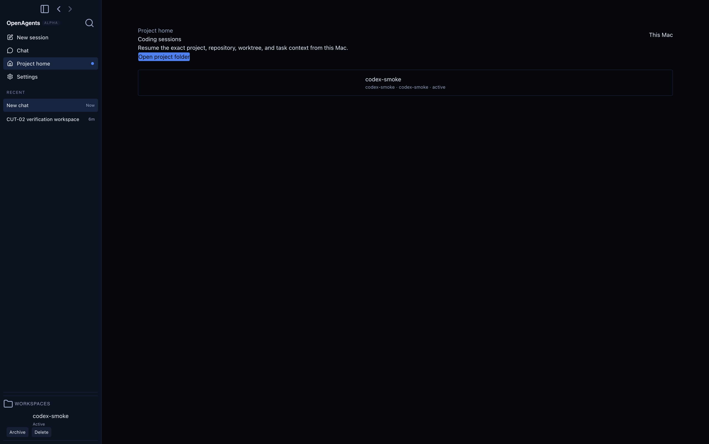
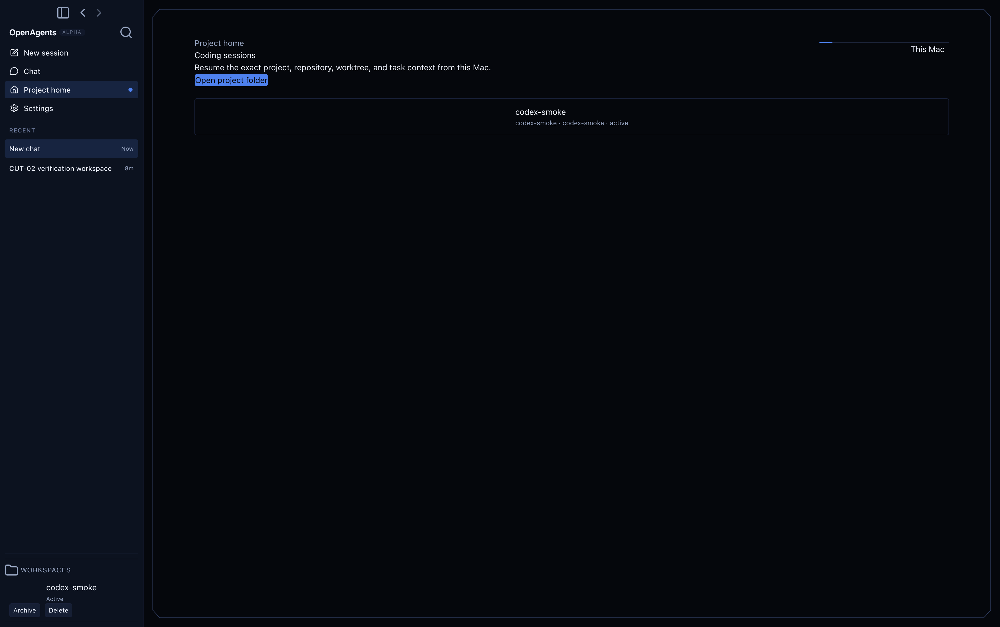

# Khala UI Desktop Project Home pilot receipt

- Class: receipt
- Date: 2026-07-15
- Status: implementation and deterministic proof complete; owner visual
  acceptance is the remaining gate before the second Desktop pilot
- Dispatch: no; use [#8845](https://github.com/OpenAgentsInc/openagents/issues/8845)
- Parent: [#8844](https://github.com/OpenAgentsInc/openagents/issues/8844)
- Owner: Khala UI product pilots
- Base: `1c0c6f7ee9260fbabecf33809b367f462d66ad84`
- Effect Native source: `712c112fa2f0176cfe2d45dc50bc5bbeb9ea60b7`
  (`effect-native/v42`)

## Result

The first Khala UI product proof is bounded to the OpenAgents Desktop Project
Home coding-session surface. It consumes Effect Native's typed `Frame` Khala
descriptor and React DOM static lowering to add exactly two inert decorations:

- a `cut-corner-surface` perimeter frame; and
- a compact `header-line` accent behind the existing authority label.

Owner review caught two shared-geometry defects before acceptance. First,
effect-native#95 made the signal and structural header strokes meet at one
logical point. Second, effect-native#96 removed a duplicate full-width top
stroke that crossed beneath the cut-corner polygon and made both top corners
read as gaps. The delivered v42 frame is one closed polygon: top-left diagonal,
top edge, and top-right diagonal share the same path. The product carries no
compensating CSS offset or app-local geometry fork.

The existing React 19 components remain semantic owners of the heading,
description, buttons, and coding-session list. The existing Effect state stream,
intent reporter, navigation, and Electron process model are unchanged. The
decoration reporter is a no-op, both SVGs are `aria-hidden` and non-focusable,
and the wrapper is pointer-inert. There is no animation, timer, observer,
listener, Canvas, raw HTML, IPC, preload, main-process, protocol, CSP, or audio
change.

## Visual evidence

The deterministic Electron React smoke fixture used the same 2000 by 1280
viewport and coding-session state for both captures.

### Before

### After

The after image contains the v42 continuous-corner fix and is the owner-review
artifact. Visual acceptance must be recorded on #8845 before #8846 begins.

## Startup A/B

The checked base and pilot were measured on the same `darwin-arm64` host with
the deterministic `startup-marks` fixture, one discarded warmup, and seven
measured launches. Values are milliseconds from process start.

| Milestone            | Base median / p95 | Pilot median / p95 |     Median delta |
| -------------------- | ----------------: | -----------------: | ---------------: |
| first paint          |   611.46 / 626.62 |       602 / 649.44 |  -9.46 (-1.55%) |
| shell mounted        |   658.92 / 675.40 |    646.60 / 692.51 | -12.32 (-1.87%) |
| window ready to show |   634.92 / 657.30 |    623.60 / 671.61 | -11.32 (-1.78%) |

The pilot does not regress any median. The p95 movement is retained as machine
noise to watch in the second Desktop pilot. Both guarded milestones remain far
inside the existing 1,500 ms window-ready and 2,500 ms shell-mounted budgets.

## Renderer bundle A/B

Both renderer builds used Vite `8.1.3` from the same clean worktree with the
same v42 vendor tree; byte counts are exact production artifacts.

| Artifact  |     Base raw / gzip |    Pilot raw / gzip |      Raw delta |   Gzip delta |
| --------- | ------------------: | ------------------: | -------------: | -----------: |
| `boot.js` | 1,143,442 / 328,716 | 1,144,253 / 329,009 |  +811 (+0.07%) | +293 (+0.09%) |
| `app.css` |   214,642 / 115,843 |   215,466 / 116,009 |  +824 (+0.38%) | +166 (+0.14%) |
| combined  | 1,358,084 / 444,559 | 1,359,719 / 445,018 | +1,635 (+0.12%) | +459 (+0.10%) |

This remains comfortably within the pilot's one-percent renderer-growth
budget. The upstream static vocabulary is consumed directly; no app-local
geometry engine or parallel theme is introduced.

## Accessibility and lifecycle proof

- React Strict Mode rerender proof finds exactly the same two stable Khala IDs,
  no duplicate SVG or decoration node, and no tabbable descendant.
- The existing Project Home `main`, heading, action buttons, and coding-session
  region remain present and keyboard-owned by React.
- The motif resolver's upstream golden gallery proves deterministic zoom and
  narrow-container collapse; the Desktop layer adds no fixed text geometry.
- Forced colors maps decorative strokes to `CanvasText`; reduced motion is
  identical because the pilot schedules no work and defines no transition.
- Design conformance continues to reject raw product colors, raw geometry,
  accidental animation, and app-local SVG construction.

## Verification

Completed locally:

- Effect Native v42 atomic vendor tests and package `tsc -b` checks;
- focused vendor, adapter, Strict Mode, accessibility, and Desktop design tests;
- Desktop typecheck, all 158 Desktop test files (1,487 passing tests and 39
  skips), production build, startup benchmark, and built-Electron screenshot
  smoke; and
- Sol manifest and documentation policy checks plus `git diff --check`.

The repository-wide `pnpm run check` was also attempted. Its Vite Plus
format/lint processes could not load the installed `oxfmt` and `oxlint` native
bindings because this Mac's code-policy service returned `library load mig
callout failed`; no formatter or lint diagnostic ran. The focused compile,
test, build, and documentation gates above remain successful, and the host
failure is recorded as an execution-environment exception rather than a false
pass.

No production command uses the temporary screenshot navigation used to expose
Project Home to the smoke capture. The before/after fixture instrumentation was
removed before validation and is absent from the delivered diff.

## Remaining gate

Owner visual acceptance is deliberately not inferred from automated tests.
Record the decision on #8845. Only then may the ordered pilot move to Desktop
Settings in #8846.
