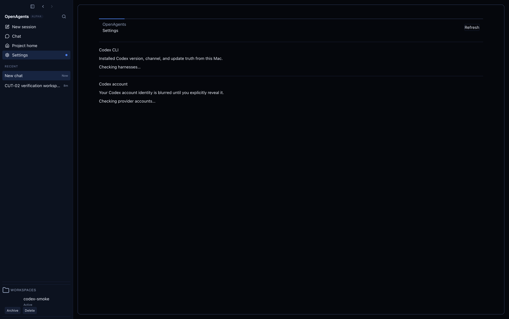

# Khala UI Desktop Settings pilot receipt

- Class: receipt
- Date: 2026-07-15
- Status: implementation and deterministic visual proof complete
- Dispatch: no; use [#8846](https://github.com/OpenAgentsInc/openagents/issues/8846)
- Parent: [#8844](https://github.com/OpenAgentsInc/openagents/issues/8844)
- Dependency: [#8845](https://github.com/OpenAgentsInc/openagents/issues/8845)
- Base: `269574234dd5b072fdf39d6352a9ea21fc236a84`

## Result

The second ordered Khala UI pilot extends the accepted static Project Home
grammar to the React Desktop Settings surface without changing Settings
behavior. The surface has exactly one `cut-corner-surface` perimeter and one
`header-line` accent. Its dense status articles remain ordinary semantic HTML
with one restrained leading status rule; paragraphs, controls, and individual
rows do not receive nested Khala frames or glow.

Internal maintenance codes are now rendered as explicit state text: `current`
becomes “Up to date”, `behind_latest` becomes “Update available”, and `unknown`
becomes “Version unknown”. Provider readiness remains present as text. Color is
therefore supplementary, not the only status signal. Existing headings,
`status` and `alert` roles, buttons, sensitive-text reveal behavior, keyboard
order, Effect-owned state, and typed intents are unchanged.

There is no motion, timer, observer, Canvas, pointer illumination, text
decipher, audio, IPC, preload, protocol, CSP, or Electron lifecycle change.

## Visual evidence

The built Electron React smoke fixture captured the real Settings route at a
2000 by 1280 viewport. The perimeter is continuous at both top corners, the
single header accent stays behind the semantic header, and ordinary content is
separated with quiet rules rather than nested frames.

Temporary capture sequencing used to pause on Settings was removed before the
delivered diff. The permanent Strict Mode test proves two decorations on the
Settings surface and zero decoration descendants inside status articles.

## Responsive and accessibility proof

- The Settings root remains the existing scroll owner with stable scrollbar
  space. At widths up to 720 CSS pixels, the header and status rows collapse to
  a single column and actions stay left-aligned.
- Decorative wrappers are `aria-hidden`, pointer-inert, non-focusable, and
  below all semantic content. Focus rings therefore remain above decoration
  and are not clipped by a nested frame.
- At 200% zoom the narrow-width layout is selected without fixed text geometry.
  Text can wrap instead of overlapping the status/action columns.
- Forced-colors mode maps decorative paths and semantic separators to
  `CanvasText`. Explicit status text remains present when author colors are
  replaced.
- React Strict Mode replay retains one stable Settings frame ID and one stable
  header ID, with no duplicate SVG or listener lifecycle.

## Renderer bundle A/B

Both builds used Vite `8.1.3` from clean worktrees at the same base and with the
same lockfile. Byte counts are exact production artifacts.

| Artifact | Base raw / gzip | Pilot raw / gzip | Raw delta | Gzip delta |
| --- | ---: | ---: | ---: | ---: |
| `boot.js` | 1,135,723 / 326,999 | 1,136,671 / 327,196 | +948 (+0.08%) | +197 (+0.06%) |
| `app.css` | 216,059 / 116,043 | 217,489 / 116,246 | +1,430 (+0.66%) | +203 (+0.17%) |
| combined | 1,351,782 / 443,042 | 1,354,160 / 443,442 | +2,378 (+0.18%) | +400 (+0.09%) |

The combined renderer remains well inside the program's one-percent growth
budget.

## Startup A/B

The same `darwin-arm64` host measured one discarded warmup and seven fixture
launches for each build. Values are milliseconds from process start.

| Milestone | Base median / p95 | Pilot median / p95 | Median delta |
| --- | ---: | ---: | ---: |
| first paint | 601.80 / 637.80 | 610.09 / 632.37 | +8.29 (+1.38%) |
| shell mounted | 643.27 / 686.38 | 654.09 / 684.50 | +10.82 (+1.68%) |
| window ready to show | 621.90 / 665.98 | 632.52 / 659.40 | +10.62 (+1.71%) |

All guarded medians remain far inside the existing 1,500 ms window-ready and
2,500 ms shell-mounted budgets. The small median movement is retained as host
noise to watch in later pilots; both relevant p95 values improved.

## Verification

Completed locally:

- focused React adapter and Desktop design-conformance suites: 44 passing;
- full Desktop suite: 163 files, 1,519 passing and 39 skipped;
- Desktop TypeScript check and production build;
- seven-run startup A/B and exact production renderer byte A/B;
- built-Electron Settings screenshot and structural proof of exactly two
  decorations with none nested in status articles; and
- `git diff --check` plus Sol documentation manifest/policy checks.

`smoke:react` reaches and validates the React Settings route, then fails later
in the untouched image-attachment fixture because the scripted approval never
appears (`approved: false`, `previewCleared: false`). The same failure reproduces
after the temporary screenshot sequencing is removed and is unrelated to the
Settings presentation diff. It is recorded as an existing downstream smoke
failure rather than reported as a pass.

## Next ordered pilot

The next non-deferred product pilot is Forum in
[#8847](https://github.com/OpenAgentsInc/openagents/issues/8847). Motion,
Canvas, and broader product rollout remain outside this receipt.
