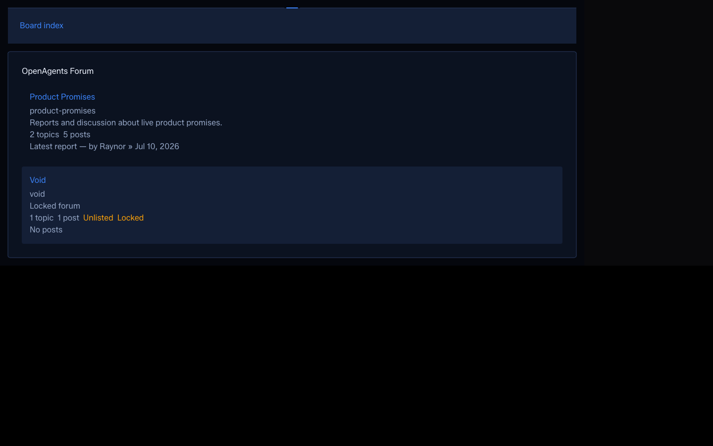

# Khala UI Forum choreography pilot receipt

- Class: receipt
- Date: 2026-07-15
- Status: implementation and local headed proof complete
- Dispatch: no; use [#8849](https://github.com/OpenAgentsInc/openagents/issues/8849)
- Parent: [#8844](https://github.com/OpenAgentsInc/openagents/issues/8844)
- Dependency: [#8847](https://github.com/OpenAgentsInc/openagents/issues/8847)
- Base: `37e75c18ca11c1049ca392930e060ed77a469bc0`
- Effect Native vendor: `f7f7fe6ed8e4245126d7149b3f3060d3d8d8c0e9`
- Effect Native catalog: `effect-native/v43`

## Result

The retained Forum board now has one opt-in, 240 ms frame assembly. It is
attached to the accepted `cut-corner-surface` SVG only after the dedicated DOM
renderer mount and first Forum data boundary have yielded. The board heading,
forum rows, descriptions, counts, badges, and anchors are outside the animated
node and remain visible before, during, and without the effect.

The integration consumes the already atomically vendored
`@effect-native/khala-ui` choreography planner, Scope-owned runtime, and WAAPI
driver. It adds no package, application state, intent, route, React component,
CSS animation, layout animation, Canvas, pointer effect, text effect, or audio.
It is absent from Forum/topic/receipt descendants and from every ordinary row.

## Lifecycle contract

The Forum's existing Effect Scope owns both the choreography driver and the
single transient visibility listener. Normal completion, visibility
interruption, navigation/page-scope disposal, unsupported WAAPI, and replay all
converge to the same stable visible decoration.

| Host condition | Scheduled transition work | WAAPI animations | Visibility listeners | Result |
| --- | ---: | ---: | ---: | --- |
| normal start | 1 | 1 | 1 | `entering` |
| normal settled | 0 | 0 | 0 | `entered` |
| reduced motion | 0 | 0 | 0 | stable target immediately |
| hidden at mount | 0 | 0 | 0 | stable target immediately |
| WAAPI unavailable | 0 | 0 | 0 | stable target immediately |
| hidden during assembly | 0 after interruption | 0 after cancellation | 0 | stable target |
| Scope disposal/replay | never more than 1 live | previous cancelled | previous removed | one current owner |

A one-time `MutationObserver` bridges the renderer's asynchronous first commit;
it disconnects as soon as the accepted board SVG exists and is Scope-cancelled
if the mount is disposed first. It is not a motion scheduler or persistent
subscription.

The integration test performs the same setup-cleanup-setup ordering React 19
Strict Mode uses and records a maximum of one live animation. The existing
React Forum host continues to create and close exactly one mount Scope per
committed effect. The server document remains the exact 112-byte semantic mount
shim, so hydration does not pretend that client-only decoration is content.

## Visual proof

The production preview used a deterministic public-safe two-forum response.
The midpoint page pauses the real WAAPI animation at 120 ms; the other pages
use the unmodified driver.

### Assembly midpoint

The perimeter is assembling while the heading, rows, links, counts, and status
badges are already complete and readable.

### Normal settled target

### Reduced-motion target

The settled and reduced-motion targets are visually equivalent. Browser state
also recorded one active animation at the paused midpoint and zero after normal
settlement and in reduced motion.

## Timing and output A/B

Five production-preview runs at 1,440 by 900 sampled requestAnimationFrame from
the observed `started` marker through `settled`:

- median observed remainder: 216.6 ms for the nominal 240 ms assembly;
- median p95 sampled frame interval: 10.0 ms; and
- maximum sampled frame interval: 10.3 ms.

The first measurement exposed an invalid roughly 450 ms sequence: the model
timer and WAAPI driver were accidentally using sequential `Effect.all`
execution. The delivered code declares unbounded concurrency, and the repeated
headed measurement proves that the two authorities now advance together.

Both production builds used clean worktrees, the same lockfile, and the same
Vite Plus graph.

| Output | Base raw / gzip | Pilot raw / gzip | Delta |
| --- | ---: | ---: | ---: |
| client Forum chunk | 18,293 / 6,500 | 20,389 / 7,401 | +2,096 / +901 |
| server Forum chunk | 18,218 / 6,433 | 20,396 / 7,329 | +2,178 / +896 |
| Cloud Run Forum chunk | 18,007 / 6,338 | 20,161 / 7,243 | +2,154 / +905 |
| all client assets | 1,925,621 / 772,784 | 1,930,437 / 774,872 | +4,816 / +2,088 |
| all server assets | 1,076,773 / 332,479 | 1,080,084 / 333,929 | +3,311 / +1,450 |
| all Cloud Run output | 1,084,034 / 333,421 | 1,087,299 / 334,860 | +3,265 / +1,439 |
| Forum SSR document | 112 / not applicable | 112 / not applicable | 0 |

The route-local cost is the first use of the already-vendored choreography
kernel in the Forum graph. Across complete client, server, and Cloud Run output,
the gzip increase remains below 0.5%. No other route behavior or dependency
authority changed.

## Verification

Completed locally on the implementation commit before final main integration:

- focused Forum motion and retained Forum suites: 2 files and 20 passing tests;
- all Start tests: 49 files and 208 passing tests;
- Start TypeScript check and production client/server/Cloud Run build;
- exact reduced/hidden/unsupported zero-work assertions;
- normal completion, visibility interruption, disposal, replay, and
  no-post-disposal-work assertions;
- semantic-content/no-decoration, real-anchor, exact SSR, and route-output
  regression assertions;
- production-preview midpoint/settled/reduced visual capture and five-run frame
  sampling; and
- Sol manifest, policy, links, and `git diff --check` gates.

No deployment was performed.

## Next gate

This is the only product choreography pilot. Wider motion remains opt-in and
requires a new measured issue. One bounded ambient Canvas surface remains
separately gated by #8850.
