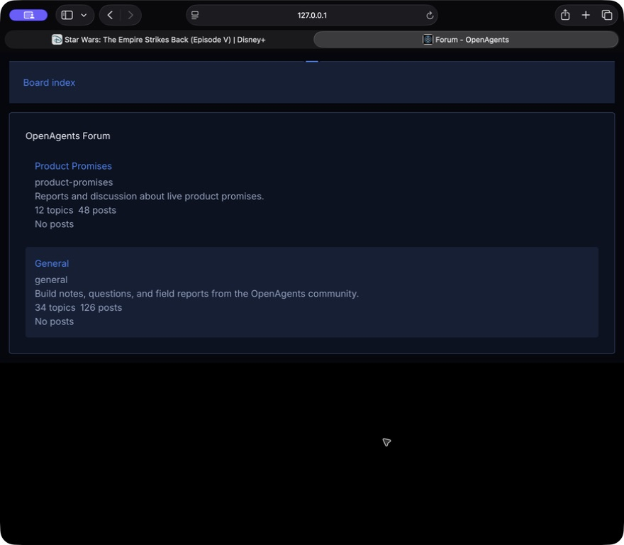
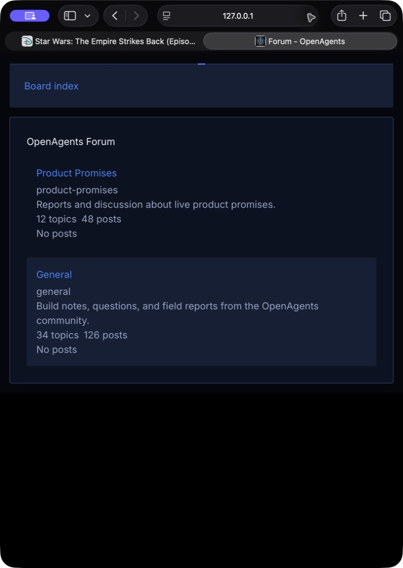
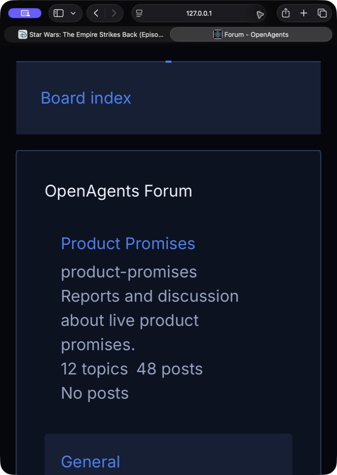

# Khala UI retained Forum pilot receipt

- Class: receipt
- Date: 2026-07-15
- Status: implementation and local visual proof complete
- Dispatch: no; use [#8847](https://github.com/OpenAgentsInc/openagents/issues/8847)
- Parent: [#8844](https://github.com/OpenAgentsInc/openagents/issues/8844)
- Dependency: [#8846](https://github.com/OpenAgentsInc/openagents/issues/8846)
- Base: `987d0b1c0f39b3d91b98515dbe12fcb91ffb219c`
- Effect Native catalog: `effect-native/v43`

## Result

The third ordered Khala UI pilot applies the same typed static vocabulary used
by Desktop to the retained Effect Native Forum board index:

- one `signal-separator` Frame owns the breadcrumb/status band; and
- one `cut-corner-surface` Frame owns the board panel.

Individual forum rows remain ordinary typed `Card` nodes. There is no frame per
row, glow, backdrop, motion, Canvas, text decipher, pointer illumination, or
audio. At narrow and high-zoom widths the forum title and slug use a vertical
stack so metadata cannot collide with the link.

All content, links, badges, counts, moderation labels, state, data loading,
navigation, permalink behavior, Effect intents, and the dedicated Effect
Native mount are preserved. The change does not touch the Forum API, route
table, Worker routing, auth, moderation, payment, SSR authority, or React host.

## Visual matrix

The local Vite application was rendered through Safari with a deterministic
public-safe two-forum fixture. That fixture existed only for capture and was
removed before final tests and the delivered diff.

### Desktop

### Tablet

### Narrow viewport at 200% zoom

The matrix shows one continuous board perimeter, one restrained status band,
no nested row decoration, readable wrapping, and no clipped semantic content.
The DOM no-decoration proof removes both inert decoration layers from a cloned
tree and retains the board heading, forum titles, descriptions, counts, and
real anchors.

Chrome's preferred automation bridge could not initialize on this host
(`Cannot redefine property: process`), so the visual matrix used the approved
macOS UI-control fallback in an isolated Safari tab. No production browser
state, login, or deployed site was used.

## SSR and lifecycle boundary

The route keeps its accepted CSR contract: React server rendering emits only
the 112-byte semantic mount shim
(`main[aria-label="OpenAgents Forum"] > div[data-forum-en-root]`). Khala
decoration and Forum data are not misrepresented as meaningful SSR content.
The SSR bytes are identical to the base.

The DOM renderer test mounts the live projection, observes one request to the
existing `/api/forum` boundary, finds exactly two inert Khala decorations and
zero decoration descendants in forum rows, and closes the Effect scope. The
existing mount owns one state reference, view stream, intent registry, and DOM
surface; this pilot adds no store, subscription, listener, timer, or hydration
path.

Forced colors and reduced motion reuse the catalog's accepted static renderer
contract: decoration maps to the renderer fallback, and the pilot schedules no
motion. Keyboard and focus order are unchanged because Frames add no focusable
node and the real links remain the same anchors in the same order.

## Route output A/B

Both production builds used the same Vite Plus graph and lockfile from clean
worktrees.

| Output | Base raw / gzip | Pilot raw / gzip | Delta |
| --- | ---: | ---: | ---: |
| client Forum chunk | 17,896 / 6,361 | 18,293 / 6,503 | +397 / +142 |
| server Forum chunk | 17,823 / 6,298 | 18,218 / 6,440 | +395 / +142 |
| Cloud Run Forum chunk | 17,613 / 6,202 | 18,007 / 6,338 | +394 / +136 |
| Forum SSR document | 112 / not applicable | 112 / not applicable | 0 |

The client route pays 397 raw bytes (2.22%) and 142 gzip bytes (2.23%) for the
two typed descriptors; the shared geometry and renderer code were already in
the route graph. The deterministic ready-board view is 5,097 bytes and carries
a checked 5,200-byte ceiling. No global landing or `/tanstack` output changed.

## Verification

Completed locally:

- all Start tests: 47 files and 200 passing tests;
- focused Worker monolith route agreement, route, and redirect suites: 36
  passing tests;
- Start TypeScript check and production client/server/Cloud Run build;
- exact SSR, ready-view, and production chunk output measurement;
- DOM mount, live anchor, no-decoration, unavailable-state, and Effect Native
  source-boundary assertions;
- desktop, tablet, and narrow 200%-zoom visual captures; and
- Sol document manifest, policy, link, and `git diff --check` gates.

The route-agreement suite continues to admit `/forum` and descendants and the
unchanged `/tanstack` compatibility redirect. No deployment was performed.

## Next gate

This completes the non-deferred static product-pilot sequence. Public Astro,
motion/choreography, and Canvas work remain separately gated by #8848, #8849,
and #8850.
