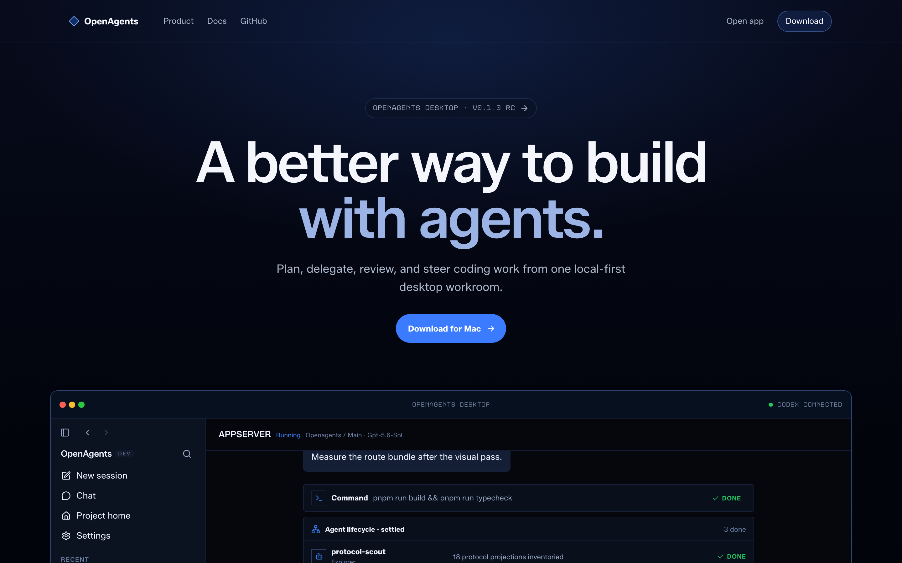
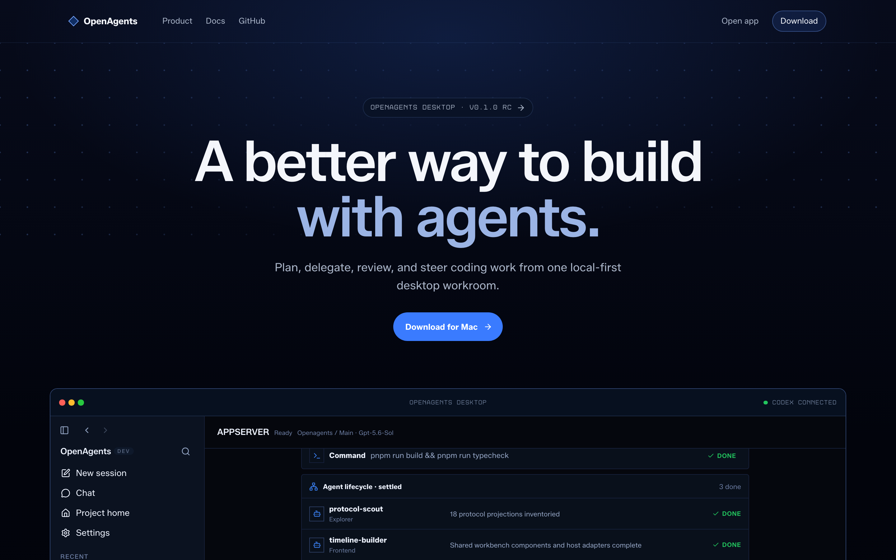

# Khala UI splash Canvas pilot receipt

- Class: receipt
- Date: 2026-07-16
- Status: implementation and local headed proof complete
- Dispatch: no; use [#8850](https://github.com/OpenAgentsInc/openagents/issues/8850)
- Parent: [#8844](https://github.com/OpenAgentsInc/openagents/issues/8844)
- Dependency: [#8849](https://github.com/OpenAgentsInc/openagents/issues/8849)
- Base: `7ed34252c4`
- Effect Native vendor: `f7f7fe6ed8e4245126d7149b3f3060d3d8d8c0e9`
- Effect Native catalog: `effect-native/v43`

## Result

The spacious `/splash` hero now hosts the program's only product ambient
Canvas. It renders one deterministic cross-point Dots field behind the hero
copy, finishes its radial assembly within 1,200 ms, and then has no scheduled
frame work. The dense interactive workroom below it has no Canvas.

The pre-pilot CSS supplied one broad radial glow. It could not express a
radially assembled field of individually resolved cross points without either
many DOM/SVG children or a large encoded SVG. The accepted Canvas adds that
depth with one inert element and at most 256 bounded primitives. The existing
CSS glow remains the complete static fallback and all heading, description,
navigation, call-to-action, and workroom semantics remain outside the Canvas.

This consumes the complete atomically vendored `@effect-native/render-canvas`
commit already recorded by the vendor manifest. It adds no new package,
renderer fork, route, API, state authority, pointer effect, text effect, audio,
Electron boundary, or global background.

## Runtime budgets

The pilot treats the following thresholds as admission gates, not descriptive
targets:

| Budget                         |                         Limit |    Observed / enforced result |
| ------------------------------ | ----------------------------: | ----------------------------: |
| active product Canvas surfaces |                             1 |                             1 |
| pending frame callbacks        |                             1 |                     maximum 1 |
| reveal duration                |                      1,200 ms |      hard-stopped at 1,200 ms |
| frame callback cost            | 8 ms; stop after 2 violations | headed p95 0.3 ms, max 0.7 ms |
| steady frame interval          |                       16.7 ms | headed p95 9.2 ms, max 9.4 ms |
| balanced DPR                   |                       1.5 cap |    DPR 2 host resolved to 1.5 |
| balanced backing pixels        |                     6,000,000 |              1,799,280 pixels |
| balanced backing allocation    |        derived from pixel cap |            about 6.9 MiB RGBA |
| complete route transfer delta  |              80,000 raw bytes |             +70,901 raw bytes |
| median local load delta        |                         15 ms |                       +3.2 ms |

Two callbacks above the 8 ms frame-cost threshold force the same stable static
target as the duration stop. The quality policy also chooses constrained static
output for Save-Data or devices reporting at most 4 GiB memory. The vendored
renderer enforces the DPR, backing-pixel, and primitive limits; this host pins
`maxActiveSurfaces` to one.

The headed heap sample was 10.84 MB mid-sequence, 11.56 MB at settlement, and
11.58 MB after the idle observation. The 26.6 KB post-settlement movement is
within browser measurement noise and, importantly, occurred with the Canvas
draw count unchanged.

## Lifecycle matrix

| Condition                     |             Frames after transition | Host listeners/observers           | Stable result           |
| ----------------------------- | ----------------------------------: | ---------------------------------- | ----------------------- |
| normal                        |                 zero after 1,200 ms | Scope-owned and disposable         | assembled Dots field    |
| reduced motion                |         zero; one synchronous paint | none installed by renderer         | complete static field   |
| constrained quality           |         zero; one synchronous paint | none installed by renderer         | complete static field   |
| low power                     |         zero; one synchronous paint | Scope-owned and disposable         | complete static field   |
| hidden                        | zero after one reconciliation paint | retained only until Scope disposal | current stable field    |
| offscreen                     | zero after one reconciliation paint | observer remains for resume        | current stable field    |
| unsupported Canvas 2D         |                                zero | none                               | existing CSS hero       |
| resize / DPR change           |            one reconciliation paint | one resize path                    | correctly resized field |
| Scope disposal / React replay |                                zero | all removed                        | existing CSS hero       |

The headed hidden proof held at 80 draws for a further 300 ms. The corrected
offscreen proof forced the Canvas fully out of layout and held at 17 draws for
a further 300 ms. Reduced motion painted exactly once. Normal settlement held
at 133 draws over the idle window. The setup-cleanup-setup test never exceeded
one pending callback and verified observer disconnection.

## Visual proof

### Early assembly

The semantic hero and call to action are complete before the field reaches its
edges.

### Settled target

### Reduced-motion target

The settled and reduced-motion PNGs are byte-identical. Forced-colors hides the
Canvas while retaining the existing hero background and all semantic content.

## Production output A/B

Both builds used clean worktrees, the same lockfile, and the same Vite Plus
graph.

| Output                 |     Base raw / gzip |    Pilot raw / gzip |           Delta |
| ---------------------- | ------------------: | ------------------: | --------------: |
| client splash JS + CSS |     84,819 / 19,291 |     87,497 / 20,385 | +2,678 / +1,094 |
| server splash chunk    |     34,001 / 10,660 |     36,322 / 11,634 |   +2,321 / +974 |
| Cloud Run splash chunk |     33,772 / 10,566 |     36,079 / 11,540 |   +2,307 / +974 |
| all client assets      | 1,938,083 / 777,199 | 1,940,426 / 777,863 |   +2,343 / +664 |
| all server assets      | 1,106,463 / 343,384 | 1,108,253 / 343,878 |   +1,790 / +494 |
| all Cloud Run output   | 1,089,731 / 335,775 | 1,091,566 / 336,462 |   +1,835 / +687 |

Seven fresh headed contexts produced median `loadEventEnd` of 72.6 ms for the
base and 75.8 ms for the pilot. The first base run was a 410.2 ms outlier; the
median comparison keeps it from distorting the admission decision.

## Verification

Completed locally before final main integration:

- focused splash and Canvas suites: 2 files and 12 passing tests;
- DPR 1, 1.5, and 2, resize, reduced, constrained, low-power, hidden,
  offscreen, unsupported, frame-cost stop, duration stop, teardown, and replay;
- Start TypeScript check and production client/server/Cloud Run build;
- headed midpoint/settled/reduced visual capture and callback/heap sampling;
- fresh-context startup A/B and production output A/B; and
- complete semantic server markup with an inert no-JavaScript Canvas.

No deployment was performed.

## Rollout boundary

This receipt authorizes only the `/splash` hero. A second Canvas, a continuous
loop, MovingLines/Puffs, or ambience behind a transcript/editor/workbench needs
a separate measured issue and owner acceptance.
