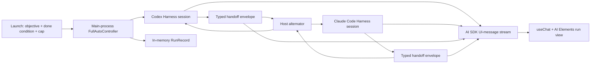

# Electron AI SDK Codex-Claude Full Auto rewrite roadmap

- Class: authority
- Status: accepted owner-directed experimental roadmap
- Snapshot: 2026-07-18
- Dispatch: no; this is a bounded implementation sequence, not the canonical
  Sol queue
- Owner: Electron AI SDK Full Auto experiment
- Target: `apps/electron-ai-sdk-test/`

## Decision

Rewrite `apps/electron-ai-sdk-test/` into one owner-local Full Auto experiment
with exactly two coding lanes:

1. Codex acts first;
2. the host accepts one typed handoff from Codex;
3. Claude Code acts from that handoff in the same workspace;
4. the host accepts one typed handoff from Claude Code;
5. the host alternates until a lane declares completion, declares a block, the
   operator stops the run, or the turn cap is reached.

Use the installed Vercel AI SDK Harness adapters as the runtime boundary, AI
SDK UI-message streaming and `@ai-sdk/react` as the renderer transport, and a
small selected set of Vercel AI Elements as the transcript UI.

Nothing else belongs in this rewrite.

## Authority and non-authority boundary

The owner's instruction in this roadmap is the target authority for this
experiment. It does not replace or amend:

- [`MASTER_ROADMAP.md`](./MASTER_ROADMAP.md);
- the production Desktop Full Auto ProductSpec;
- the production rule that does not yet admit loop-decided provider selection;
- the repository-wide Effect Native UI destination; or
- the production sandbox, release, mobile, Sync, fleet, account-rotation, or
  evidence-reporting programs.

This is a narrow Vercel AI SDK and AI Elements exception inside the existing
Electron test app. It may prove a Codex-Claude handoff mechanism. It must not be
described as production Full Auto, a second product authority, or production
containment.

## Definition of done

This rewrite is done only when one live owner-local run proves all of the
following:

- the operator supplies an objective, a done condition, and a bounded turn cap;
- Codex starts the run;
- Codex and Claude Code alternate deterministically;
- both lanes work in the exact same filesystem directory;
- each lane keeps its own native Harness session and conversation history;
- the host, rather than either provider, owns the run state and next-provider
  decision;
- every completed turn ends with exactly one schema-valid handoff tool call;
- the next lane receives a bounded host-compiled handoff envelope;
- either lane can complete or block the run through that typed handoff;
- Stop prevents another provider turn from starting;
- the renderer visibly distinguishes provider output, handoffs, current lane,
  turn count, and terminal outcome;
- the UI is built from AI SDK messages plus selected AI Elements rather than a
  new transcript component system; and
- an acceptance run proves that one lane writes a workspace fact, the other
  reads and changes it, and the first lane verifies the change.

The experiment is app-open durable only. Process restart recovery, remote
reconnect, and crash-resume are explicitly outside this focused rewrite.

## Current baseline and the exact gaps

The current app is a useful single-provider Harness test, not a Full Auto run.

| Current behavior | Required rewrite |
| --- | --- |
| The renderer exposes a Codex/Claude picker. | Remove the picker. A run always starts with Codex and alternates. |
| Switching providers remounts `useChat` with a different chat ID. | One host-owned run contains two provider-native lane sessions. |
| Codex and Claude use separate sandbox roots. | One shared sandbox session and one fixed shared working directory serve both lanes. |
| `/api/chat` executes one user turn. | A bounded Full Auto controller executes repeated turns until one terminal condition. |
| The user composer remains the primary surface. | A launch form becomes a read-only run view after Start. |
| Provider prose is the only implied handoff. | A typed host tool creates the sole accepted handoff envelope. |
| Session resume state is keyed by chat and provider. | Resume state is keyed by run and lane. Native state never crosses lanes. |
| Generic message/tool rendering is hand-built. | AI SDK UI messages feed selected AI Elements transcript components. |

## Cut line

### In scope

- one active run;
- Codex and Claude Code only;
- Codex first, then strict alternation;
- one shared owner-local workspace;
- one native Harness session per provider lane;
- a typed handoff tool;
- explicit complete, blocked, failed, stopped, and turn-cap outcomes;
- a hard turn cap, default `6`, minimum `2`, maximum `12`;
- one Stop action;
- an in-memory run record while the app is open;
- AI SDK stream projection, `useChat`, and selected AI Elements;
- deterministic fixture tests and one live acceptance proof.

### Out of scope

- choosing which provider should act next;
- starting with Claude;
- parallel agents, subagents, swarms, or fan-out;
- provider account rotation or failover;
- an ordinary chat composer during a run;
- Pause, approval inboxes, plan editing, follow-up chat, or run mutation;
- process restart recovery or cross-device continuation;
- cloud persistence, Sync, mobile, web, or production Desktop integration;
- release signing, distribution, telemetry, usage billing, or public claims;
- new Rust services, Effect orchestration, or Effect Native components;
- arbitrary MCP/tool routing beyond the Harness built-ins and the one handoff
  tool;
- semantic routing or parsing completion from model prose.

If an implementation packet needs one of these items, stop and seek a new owner
decision rather than growing this roadmap.

## Runtime design



### 1. Host-owned run contract

Add a small typed contract in the app rather than scattering booleans through
`main.ts`:

```ts
type FullAutoProvider = "codex" | "claude"

type FullAutoStatus =
  | "running-codex"
  | "handing-off-to-claude"
  | "running-claude"
  | "handing-off-to-codex"
  | "completed"
  | "blocked"
  | "failed"
  | "stopped"
  | "turn-cap-reached"

type FullAutoRunSpec = {
  objective: string
  doneCondition: string
  maxTurns: number
}

type FullAutoHandoff = {
  disposition: "continue" | "complete" | "blocked"
  summary: string
  nextInstruction?: string
  evidence: ReadonlyArray<string>
}
```

The run record additionally owns `runRef`, `turnIndex`, `currentProvider`, the
last accepted handoff, per-lane Harness resume state, streamed UI messages, a
stop flag, and a terminal error if present.

There is exactly one active controller. A second Start request returns a typed
conflict. State transitions are serialized; Codex and Claude never execute at
the same time.

### 2. One shared sandbox, two native sessions

Replace the two provider-specific `LocalAiSdkSandboxProvider` instances with one
shared provider configured with both local CLI paths and both account-home
requirements.

Both `HarnessAgent` instances receive:

- the same sandbox provider object;
- the same stable run session ID; and
- `sandboxConfig.workDir: "workspace"`.

This matters because the local provider reuses the same network sandbox for a
stable session ID, while `workDir` prevents the Harness default from placing
Codex and Claude in different harness-specific subdirectories.

The controller opens only the current lane session. At the end of the turn it
calls `detach()`, stores that lane's resume payload, and then opens the other
lane against the same run session ID. Sequential detach/resume also keeps the
single ephemeral bridge-port path simple.

Never pass Codex resume state to Claude or Claude resume state to Codex. The
filesystem and typed envelope cross the boundary; provider-private state does
not.

### 3. One typed handoff tool

Register one host tool, `full_auto_handoff`, on both Harness agents. Its input
schema is the `FullAutoHandoff` shape above with bounded string and array
lengths.

The controller creates a fresh turn-scoped handoff latch before each provider
call. The first valid invocation fills it. A duplicate invocation, a missing
invocation at stream completion, invalid input, or an execution error fails the
run visibly. Do not infer disposition from ordinary assistant text.

The provider cannot name the next provider. `continue` always means “the other
lane,” and the controller alone calculates that transition.

For `continue`, `nextInstruction` is required. For `complete` and `blocked`, it
is optional. `summary` and `evidence` remain required so the terminal result is
inspectable.

### 4. Bounded handoff prompt

For every turn, send the active native session exactly one new user prompt. The
host compiles it from:

- run reference;
- current turn and cap;
- objective;
- done condition;
- shared workspace path;
- prior provider;
- prior typed summary;
- prior next instruction; and
- bounded evidence strings.

The first Codex turn has no prior handoff. When a lane acts again later, its
native Harness session supplies its own earlier conversation history and the
new host prompt supplies the other lane's latest handoff. Do not replay the
renderer transcript into either Harness session.

Both agent instruction strings must say that the lane is one half of a bounded
Full Auto run, works only in the shared workspace, and must call
`full_auto_handoff` exactly once before ending its turn.

### 5. AI SDK stream projection

Keep the loopback server and Electron privilege denials. Replace the generic
chat route with a minimal run transport:

- Start validates the run spec, launches the controller, and returns an AI SDK
  UI-message stream;
- Stop sets the controller's stop flag and aborts the active Harness turn;
- a small current-run read returns the in-memory snapshot needed to re-render
  during the same app process.

For each provider turn, project the Harness stream through AI SDK
`toUIMessageStream()` and merge its text, reasoning, and tool parts into the
run stream. Add host-owned message metadata for provider, turn index, and run
reference. Emit the accepted handoff and terminal outcome as explicit host
events rather than fake assistant prose.

Use a custom `ChatTransport` with `useChat` so the renderer stays on the AI SDK
message model while the main process remains the canonical run authority.

## Front-end contract

Use the official AI Elements registry as source-owned UI components in this
app. Install only the components needed for this run:

- `Conversation`, `ConversationContent`, and
  `ConversationScrollButton`;
- `Message`, `MessageContent`, and `MessageResponse`;
- `Reasoning`;
- `Tool`; and
- `Loader`.

Do not install a broad component catalog. Do not use `PromptInput`: the launch
surface is a run contract, not an ongoing chat composer.

The renderer has two modes.

### Launch mode

- objective textarea;
- done-condition textarea;
- bounded turn-cap input;
- one `Start Full Auto` action;
- a short local-experiment warning.

There is no provider selector. Codex-first is part of the contract.

### Run mode

- compact run header with status, current provider, and turn count;
- one Stop action while running;
- read-only AI Elements conversation;
- provider labels on assistant messages;
- a visible `Codex -> Claude` or `Claude -> Codex` handoff divider containing
  the accepted summary and next instruction;
- streamed reasoning and tool state through AI Elements;
- a distinct completed, blocked, failed, stopped, or cap-reached terminal card.

After Start, hide the launcher and do not expose a composer. A Full Auto run is
not a chat with an automatic checkbox.

Follow the app's existing dark, dense, state-rich visual direction. The UI work
is assembly and state clarity, not a redesign program.

## Rewrite map

Keep the implementation compact.

| Path | Change |
| --- | --- |
| `src/main.ts` | Retain Electron hardening and local bridge patches; replace chat routing and provider-specific runtime maps with the controller and shared sandbox wiring. |
| `src/full-auto-contract.ts` | Add the bounded run, lifecycle, handoff, lane, and event schemas. |
| `src/full-auto-controller.ts` | Add the serialized Codex-Claude loop, turn latch, detach/resume, stop, cap, and terminal transitions. |
| `src/full-auto-controller.test.ts` | Prove alternation, handoff validation, completion, failure, Stop, and cap with fixture lanes. |
| `src/app.tsx` | Replace provider-switching chat with launch and run modes backed by `useChat`. |
| `src/components/ai-elements/*` | Add only the selected registry components. |
| `src/styles.css` | Reduce styles to layout, run-state treatment, and any tokens the selected components need. |
| `README.md` | Replace the single-provider chat instructions with the Full Auto experiment contract and live proof steps. |
| `WORK_PACKET.md` | Reconcile the accepted scope and record final evidence; do not retain the old provider-toggle acceptance contract. |

Avoid adding a framework-sized service layer. The controller, contract, and
fixture test are the only new runtime modules required.

## Ordered implementation packets

### EAFA-1 — Runtime vertical slice

Outcome: a fixture-backed controller and the real Harness wiring can execute
Codex, accept a typed handoff, execute Claude in the same workspace, and stop at
a terminal disposition or cap.

Required work:

1. add the run and handoff schemas;
2. instantiate one shared local sandbox provider;
3. configure both agents with the same fixed work directory and the handoff
   tool;
4. implement the serialized alternator;
5. detach and retain per-lane native resume state after each turn;
6. implement Stop and turn-cap checks before every dispatch; and
7. add deterministic controller tests with fake lane streams.

Gate: fixture tests prove exact provider order, exactly-once handoff acceptance,
no dispatch after terminal state, and no dispatch after Stop or cap.

### EAFA-2 — AI SDK and AI Elements run surface

Outcome: the operator can launch and observe the vertical slice without a
provider toggle or chat composer.

Required work:

1. replace `/api/chat` with the run transport;
2. attach Harness `UIMessage` streams and host handoff events to one run stream;
3. implement the custom `ChatTransport` and `useChat` projection;
4. add only the selected AI Elements;
5. replace `HarnessChat` with launch and run modes; and
6. render provider, turn, handoff, tool, reasoning, Stop, and terminal state.

Gate: a fixture-driven renderer run shows Codex, a Codex-to-Claude receipt,
Claude, and an honest terminal outcome with no ordinary input surface after
Start.

### EAFA-3 — Live two-provider proof and cleanup

Outcome: the owner-local Electron app proves a real Codex-Claude-Codex handoff
through both the typed envelope and the shared filesystem.

Use this bounded mission:

> Create `handoff-proof.txt`. Codex writes a nonce and asks Claude to append the
> SHA-256 of that nonce. Claude reads the file, appends the digest, and asks
> Codex to verify it. Codex verifies the digest and completes the run.

Required evidence:

- provider sequence is exactly Codex, Claude, Codex;
- all three turns report the same shared work directory;
- two accepted handoff receipts are visible;
- Claude reads Codex's nonce from disk rather than receiving it only in prose;
- Codex reads Claude's digest from disk and verifies it;
- the terminal state is completed;
- no fourth provider turn starts; and
- the app still denies browser privileges and external navigation.

Gate: focused tests and repository checks pass, the live run succeeds once,
and `README.md` clearly labels the app an owner-local experiment rather than
production containment or product Full Auto.

## Test and proof matrix

| Case | Required result |
| --- | --- |
| Alternation | Starting at turn 1 yields Codex, Claude, Codex, Claude with no model-selected routing. |
| Continue handoff | A valid `continue` handoff dispatches exactly one turn to the other lane. |
| Duplicate handoff | A second handoff call in one turn fails the run; it is never silently ignored. |
| Missing handoff | A lane ending without the tool fails visibly and does not dispatch the other lane. |
| Completion | `complete` records evidence and prevents all later dispatch. |
| Block | `blocked` records evidence and prevents all later dispatch. |
| Turn cap | The controller reaches `turn-cap-reached` without starting turn `maxTurns + 1`. |
| Stop | Stop aborts the active turn and no later lane starts. |
| Lane isolation | Codex and Claude resume only their own native session state. |
| Workspace sharing | Both lanes receive the same fixed working directory and see each other's file changes. |
| Stream projection | Text, reasoning, tools, handoffs, provider labels, and terminal status render without becoming provider input history. |
| UI cut line | No provider picker or composer is reachable after launch. |
| Security regression | Browser permissions, new windows, and external navigation remain denied. |

Minimum validation commands:

```bash
pnpm --dir apps/electron-ai-sdk-test typecheck
pnpm --dir apps/electron-ai-sdk-test test
pnpm run check
```

Add the focused `test` script as part of EAFA-1. The live provider proof is a
bounded manual acceptance run and must not become an unattended repository
test that depends on local subscriptions or credentials.

## Fastest completion rule

EAFA-1, EAFA-2, and EAFA-3 are one critical path. Do them in that order and do
not open adjacent work.

The first successful three-turn live mission is the finish line for this
roadmap. Do not delay it for restart recovery, production architecture, a more
general workflow engine, additional providers, or UI polish beyond clear and
correct state rendering.

## Source basis

This decision was derived from:

- the complete current `apps/electron-ai-sdk-test/` implementation;
- [`../fable/2026-07-17-surface-vision-gap-analysis-and-roadmap.md`](../fable/2026-07-17-surface-vision-gap-analysis-and-roadmap.md);
- [`../fable/2026-07-17-full-auto-implementation-audit.md`](../fable/2026-07-17-full-auto-implementation-audit.md);
- [`../fable/2026-07-17-effect-vs-rust-architecture-analysis.md`](../fable/2026-07-17-effect-vs-rust-architecture-analysis.md);
- [`2026-07-17-t3-code-mobile-full-parity-accepted-plan.md`](./2026-07-17-t3-code-mobile-full-parity-accepted-plan.md);
- [`2026-07-17-t3-code-ui-full-harvest-accepted-plan.md`](./2026-07-17-t3-code-ui-full-harvest-accepted-plan.md);
- [`../teardowns/2026-07-17-ai-sdk-v7-harnesses-teardown.md`](../teardowns/2026-07-17-ai-sdk-v7-harnesses-teardown.md);
- the installed Harness and local-sandbox source used by the app;
- [Vercel AI Elements documentation](https://elements.ai-sdk.dev/docs); and
- [Vercel's AI Elements component registry](https://github.com/vercel/ai-elements).
