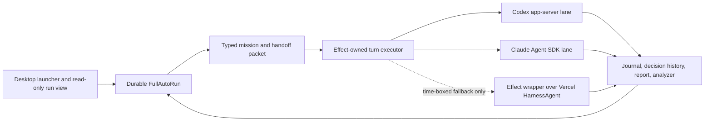
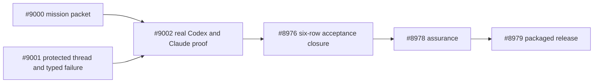

# Full Auto ASAP Effect/Harness sprint recommendation

- Class: authority
- Status: implemented. Owner-real development acceptance complete
- Snapshot: 2026-07-18
- Dispatch: no. #9000, #9001, #9002, And #8976 are completed by the linked
  implementation receipt. #8978 And #8979 retain assurance/release authority
- Owner: OpenAgents Desktop Full Auto / epic #8967
- Product authority:
  [`../../specs/desktop/full-auto.product-spec.md`](../../specs/desktop/full-auto.product-spec.md)
- Transcript basis: [`../transcripts/257.md`](../transcripts/257.md)

## Implemented outcome

The selected path succeeded without invoking the Vercel Harness fallback. At
development candidate `3123d926a3`, the real owner-profile Electron batch
completed all six named Codex/Claude rows plus a fresh-process automatic
same-pass `fable-local` to `codex-local` rotation. The public-safe evidence and
UI-first operator procedure are in the
[`Full Auto real owner acceptance receipt`](./receipts/2026-07-18-full-auto-real-owner-acceptance.md).

The conclusion is now empirical rather than prospective: retaining the
Effect-owned `FullAutoRun` and repairing its mission, host-thread, provider
settlement, restart, and projection seams was the fastest route to a working
system. No AI SDK chat runtime, AI Elements renderer, duplicate scheduler, or
source-derived Effect Harness package was required for this sprint.

Independent AssuranceSpec admission and a signed packaged release remain
separate work under #8978 and #8979. This development receipt does not claim
either gate.

## Decision

Get Full Auto working by repairing the existing OpenAgents Desktop runtime,
not by rewriting the product on Vercel AI SDK and not by first building a new
general Effect AI SDK.

The current Desktop already owns the hard parts needed for an unattended run:
the durable `FullAutoRun`, leases and restart reconciliation, provider-lane
admission, owner-bounded routing, guardrails, handoff receipts, liveness,
reports, analyzer, launcher, and read-only run view. The shortest path is:

1. deliver the durable objective and done condition to every real provider
   turn.
2. keep an active run's host thread addressable under ordinary chat pressure
   and classify host-store failures truthfully.
3. prove Codex and Claude in both directions through the real Desktop UI. And
4. use the already-working Vercel Harness experiment only as a time-boxed
   provider adapter fallback if a native coding-agent lane still fails.

Effect remains the owning application runtime. Effect AI is selectively
reused where it already solves a generic problem. Vercel Harness is used only
where it solves the different problem of running Codex or Claude Code as a
coding agent with native sessions and tools.

## Why this is faster than either rewrite

Transcript 257 asks for a walk-away result, not another architecture demo. A
successful sprint must survive ordinary failures, visibly continue between
providers, retain the user's mission, and return an inspectable result.

The two proposed rewrites both start behind the current product:

- `apps/electron-ai-sdk-test/` proves that current Codex and Claude Harness
  adapters can run with the operator's local sessions, but it has no durable
  Full Auto run model, restart reconciliation, routing record, guardrails,
  report, analyzer, or release-grade UI proof.
- A broad source-to-Effect conversion would rebuild generic prompt, tool,
  response, error, chat, and provider-plan machinery that Effect v4 already
  supplies under `effect/unstable/ai` and `ExecutionPlan`.

The existing Desktop is therefore the only path that begins one bug-fix sprint
away from the requested product outcome.

## What is actually broken

| Gap                                                                                 | Current evidence                                                                                                                                                                                               | Required correction                                                                                                                                                |
| ----------------------------------------------------------------------------------- | -------------------------------------------------------------------------------------------------------------------------------------------------------------------------------------------------------------- | ------------------------------------------------------------------------------------------------------------------------------------------------------------------ |
| The mission is not dispatched.                                                      | The launcher persists `objective` and `doneCondition` on `FullAutoRun`, but reconciliation sends the constant `FULL_AUTO_CONTINUE_MESSAGE`. The real Codex/Claude prompt does not contain the durable mission. | Compile a typed mission packet from the run and handoff for every first, continued, rotated, resumed, and restart-recovered turn.                                  |
| The active run thread can be evicted.                                               | `ThreadStore` is a five-entry composer cache. Opening six chats while the Full Auto turn is in flight can evict its `threadRef` before the run re-touches it.                                                  | Protect every nonterminal run thread or resolve it from a separate durable authority until terminal settlement.                                                    |
| The July 18 failure was misclassified.                                              | `provider-lane.ts` returns `That conversation no longer exists.` on a host thread-store miss. Liveness maps that literal to `provider_session_missing`. Codex was never invoked on this path.                  | Carry a typed host-thread failure through lane, liveness, report, IPC, and UI. Reserve `provider_session_missing` for evidence returned after provider invocation. |
| Real Claude proof is blocked by the proof environment, not by the product contract. | The isolated Desktop harness forbids Keychain access, while the small Harness app succeeds by letting the pinned SDK use the operator's already-authenticated configuration.                                   | Add an explicit double-gated proof seam that never reads or copies credentials and lets the SDK return typed auth evidence.                                        |
| The six real rows are incomplete.                                                   | Fixture coverage is broad, but #8976 has not produced successful real receipts for both directions, objective retention, three Codex turns, Claude restart, and in-flight six-chat pressure.                   | Execute those exact rows after the two correctness fixes and close only on real public-safe receipts.                                                              |

This changes the interpretation of the July 18 receipt. The first observed
`provider_session_missing` was a host cache-residency bug and a taxonomy bug.
it was not evidence that Codex bootstrap or conversation resume failed.

## Selected architecture



The authority boundaries are strict:

- `FullAutoRun` owns mission, lifecycle, cap, routing policy, guardrails, and
  terminal disposition.
- The durable host thread and handoff projection own cross-provider history.
- Codex, Claude, or a Harness adapter owns only its provider-native session and
  tool execution.
- The renderer projects the run. It does not schedule turns or own canonical
  chat state.
- The Vercel AI SDK front-end stack is not introduced into production Desktop
  during this sprint.

## Effect AI re-baseline

The official [Effect AI documentation](https://effect.website/docs/ai/introduction/)
describes an experimental provider-independent model and tool layer with
Effect-native retries, timeouts, streaming, testing, and observability. The
workspace's Effect v4 reference checkout, commit
`266cb90bb2c17aabc40563c32db334f09ba3d74b`, materially narrows what OpenAgents
needs to build.

### Reuse from Effect v4

| Existing capability                                                               | Sprint use                                                                                                                                                               |
| --------------------------------------------------------------------------------- | ------------------------------------------------------------------------------------------------------------------------------------------------------------------------ |
| `Prompt`, `Response`, `AiError`, `Tool`, and `Toolkit`                            | Reuse selectively for any new generic prompt/tool/error boundary instead of creating duplicate `effect-ai-schema` and `effect-ai-core` packages.                         |
| `LanguageModel.generateText`, `generateObject`, and `streamText`                  | Use for direct model-provider work, evaluators, or classifiers. These APIs are not Codex/Claude Code coding-agent sessions.                                              |
| Schema-typed tool parameters, success/failure, `failureMode`, and `needsApproval` | Useful for host-owned tools and typed adapter translation when semantics match.                                                                                          |
| `Chat` with serialized turns and JSON/persisted history                           | Useful for ordinary Effect model chats. Do not make it canonical history for a Codex or Claude Code session.                                                             |
| `ExecutionPlan` ordered Layers, attempts, schedules, and conditions               | Reuse as a design reference or inside a stateless model call. Do not replace Full Auto's durable owner-admitted routing policy, leases, rotation history, or guardrails. |
| `ResponseIdTracker`                                                               | Useful for response-ID continuation on compatible model APIs. It is not a coding-agent resume handle.                                                                    |

All of this surface is unstable. Any production import must use the exact
workspace Effect v4 pin and sit behind an owned OpenAgents service boundary.

### What Effect AI does not provide

Effect AI does not run the Codex app server or Claude Code Agent SDK, inherit
their subscription login, manage their native tool loop, bind a coding
workspace and sandbox, replay their native event logs, or resume their private
coding-agent sessions. It is a model-call SDK, not a coding-agent harness.

That missing harness layer is the only plausible source-derived package after
the sprint:

```text
@openagentsinc/effect-harness
  Effect service and scoped-session facade
  Vercel Harness contract/event/error translation
  Codex and Claude Code adapters
  existing OpenAgents sandbox Layers
  differential tests against pinned Vercel packages
```

Do not build new generic `effect-ai-schema`, `effect-ai-core`, or Effect chat
runtime packages unless a demonstrated gap remains after evaluating
`effect/unstable/ai`.

## Sprint issue graph



### #9000 — dispatch the durable mission

Compile one schema-decoded `FullAutoMissionPacket` per provider turn. It must
contain the run reference, objective, done condition, workspace binding, turn
and cap, provider/lane identity, prior accepted outcome, bounded handoff, and
required response obligations. The first turn, same-provider continuation,
automatic owner-admitted rotation, Pause/switch/Resume, and restart recovery
must use the same compiler.

This is the highest-priority fix. Until it lands, a green provider receipt can
still prove that the wrong task ran successfully.

### #9001 — protect the active thread and fix taxonomy

Make a nonterminal run thread ineligible for ordinary composer-cache eviction,
including while a turn is in flight. Release that protection at terminal
settlement and reconcile it after restart. Add a typed host-thread failure and
prove that it cannot be reported as a provider-session failure.

The regression must reproduce the exact sequence that escaped #8970: start a
turn, open six chats before any run-thread re-touch, then continue the run.

### #9002 — execute the real matrix, with one bounded fallback gate

After #9000 and #9001, run all six #8976 rows through real Electron UI clicks
and actual provider lanes. Require one automatic same-pass cross-provider
rotation in addition to manual handoff coverage.

Timebox the native providers to one working day for one successful Codex turn
and one successful Claude turn. If either still fails for a coding-agent
session reason, wrap the working `apps/electron-ai-sdk-test/` `HarnessAgent`
path as an Effect service behind the existing `ProviderLane` /
`AcceptanceLaneExecutor`. Preserve the run, journal, mission, routing,
handoff, report, guardrail, and UI contracts. Do not import `useChat`, create a
second scheduler, or replace the Desktop application.

## Real acceptance matrix

| Row                  | Required proof                                                                                                                                             |
| -------------------- | ---------------------------------------------------------------------------------------------------------------------------------------------------------- |
| Codex to Claude      | Claude receives the same objective and bounded accepted Codex history, acts usefully, and records the provider transition.                                 |
| Claude to Codex      | Codex receives the same objective and bounded accepted Claude history, acts usefully, and records the provider transition.                                 |
| Objective retention  | Every provider invocation contains the durable objective/done condition. The receipt proves hashes/refs and bounded summaries without leaking raw prompts. |
| Three Codex turns    | One run survives three actual Codex continuations without losing host or provider session identity.                                                        |
| Claude restart       | A restarted Desktop reconciles and resumes or fails with a truthful typed recovery disposition.                                                            |
| More than five chats | Six ordinary chats opened while a run turn is in flight cannot evict or orphan the run thread.                                                             |

Completion requires evidence that the provider was actually invoked and that
the run reached a useful accepted result or a truthful typed terminal/retry
state. Fixture replay, a checklist, or a single-provider chat demo is not
completion.

## Explicitly not in this sprint

- no production Desktop renderer rewrite to AI SDK UI or AI Elements.
- no second Full Auto implementation in `apps/electron-ai-sdk-test/`.
- no broad Vercel AI SDK source conversion.
- no duplicate Effect prompt/tool/chat SDK.
- no autonomous provider choice outside the owner-admitted ordered routing
  policy.
- no credential copying, Keychain scraping, or weaker sandbox policy.
- no release claim before #8976, #8978, and #8979 close with exact evidence.

## Source basis and pinned facts

- [`../transcripts/257.md`](../transcripts/257.md) — owner outcome, failure,
  and six real-test priority.
- [`../../specs/desktop/full-auto.product-spec.md`](../../specs/desktop/full-auto.product-spec.md)
  — rev-12 run, routing, guardrail, handoff, and evidence contract.
- [`../fable/2026-07-17-full-auto-implementation-audit.md`](../fable/2026-07-17-full-auto-implementation-audit.md)
  — original overnight failure and corrected run model.
- [`2026-07-18-electron-ai-sdk-codex-claude-full-auto-rewrite-roadmap.md`](./2026-07-18-electron-ai-sdk-codex-claude-full-auto-rewrite-roadmap.md)
  — bounded Vercel Harness experiment retained as an oracle/fallback.
- [`2026-07-18-openagents-desktop-vercel-ai-sdk-in-place-reset-audit.md`](./2026-07-18-openagents-desktop-vercel-ai-sdk-in-place-reset-audit.md)
  — rejected in-place reset alternative.
- [`2026-07-18-vercel-ai-sdk-source-derived-effect-conversion-audit.md`](./2026-07-18-vercel-ai-sdk-source-derived-effect-conversion-audit.md)
  — source-conversion option re-baselined against existing Effect AI.
- [Effect AI documentation](https://effect-ts.github.io/effect/docs/ai/ai) and
  [current Effect AI introduction](https://effect.website/docs/ai/introduction/)
  — official experimental model/tool SDK boundary.
- Local Effect v4 source checkout
  `/Users/christopherdavid/work/projects/repos/effect-smol` at
  `266cb90bb2c17aabc40563c32db334f09ba3d74b` and Effect v3 source checkout
  `/Users/christopherdavid/work/projects/repos/effect` at
  `d24511fee929d4cb98ab2a86387de4ea290f11ff` — inspected `LanguageModel`,
  `Prompt`, `Response`, `Tool`, `Toolkit`, `Chat`, `ResponseIdTracker`, AI
  errors, provider packages, docs, and `ExecutionPlan` examples.

## Final recommendation

Start #9000 and #9001 immediately and in parallel where their files do not
collide. Then execute #9002 against the real providers. Keep Vercel Harness as
a one-day fallback adapter and differential oracle. Revisit an owned
Effect-Harness package only after a real native-lane failure proves that the
adapter seam—not the mission packet, host-thread durability, or proof
environment—is still the blocker.

This is the smallest change set that can honestly produce the walk-away
Codex/Claude Full Auto outcome requested in transcript 257.
