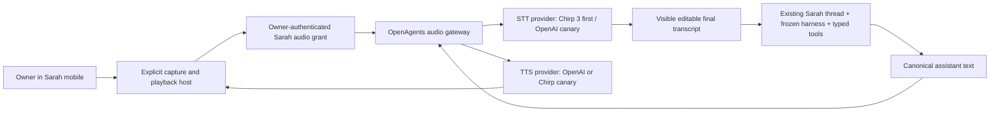

# Sarah OpenAI voice API architecture audit

- Class: historical-analysis
- Status: current point-in-time architecture recommendation
- Snapshot: 2026-07-18
- Dispatch: no; this audit does not authorize provider spend, production
  credentials, mobile microphone release, raw-audio retention, or a Sarah
  runtime replacement
- Owner: OpenAgents Sarah voice architecture
- Product authority:
  [`2026-07-18-sarah-owner-orchestrator-reboot-accepted-plan.md`](./2026-07-18-sarah-owner-orchestrator-reboot-accepted-plan.md)
- Current Sarah harness:
  [`2026-07-18-sarah-terminal-history-harness-implementation.md`](./2026-07-18-sarah-terminal-history-harness-implementation.md)
- Existing audio architecture:
  [`../voice/2026-07-12-persistent-desktop-voice-mode-audit-and-plan.md`](../voice/2026-07-12-persistent-desktop-voice-mode-audit-and-plan.md)

## 2026-07-18 implementation update

The first owner proof deliberately takes a smaller TTS-only bridge than the
full duplex gateway roadmap below:

- `POST /api/mobile/sarah/speech` reuses the existing authenticated owner and
  `hasSarahThreadAuthority` checks, then calls OpenAI `/v1/audio/speech` with
  server-fixed `gpt-4o-mini-tts`, `marin`, and MP3;
- the mobile Sarah surface exposes `Listen · AI-generated voice` only for the
  latest completed reply in the admitted Sarah thread, with creating, playing,
  stop, retry, and typed failure states;
- the OpenAI key is the existing Google Cloud Secret Manager secret
  `autopilot-voice-openai-api-key`, mounted into the monolith as
  `OPENAI_API_KEY`; it never enters the app;
- one request is bounded to 4,096 characters and fails rather than truncating;
  bracketed internal citations are removed by the same deterministic Sarah
  conversation sanitizer used by the visible transcript before synthesis;
- MP3 bytes are `no-store`, written to a uniquely named device cache file,
  played through `expo-audio`, and deleted on completion, stop, thread switch,
  or host teardown; and
- this path is delivery-only. It does not replace Sarah's Gemma reasoning,
  create messages, mutate her harness, expose provider choice, grant tools, or
  add microphone/input authority.

This is the shortest path to working Sarah speech on the phone. It does not
claim the full gateway acceptance gates for streaming PCM, barge-in,
microphone capture, raw-audio policy receipts, or Android parity. Those remain
the follow-on VOICE-SARAH-1/2 work below; once needed, the direct route should
be folded behind `apps/openagents-audio` without changing the mobile contract.

## Executive recommendation

Sarah should gain voice as a **chained, owner-authenticated input/output
adapter around her existing durable text turn**, not by replacing her current
Gemma 4 reasoning, thread memory, harness, tools, or authority loop with an
OpenAI Realtime voice agent.

The recommended order is:

1. add an OpenAI `gpt-4o-mini-tts` adapter behind the existing
   `apps/openagents-audio` `TtsAdapter` and canary `marin` and `cedar` against
   the current Google Chirp 3 HD voice;
2. connect the OpenAgents mobile Sarah screen to the existing audio grant,
   capture, transcript, playback, cancellation, and barge-in contract;
3. keep the current Google Chirp 3 streaming transcription for the first real
   owner proof, because it is already implemented and the missing product work
   is mobile capture/playback rather than another ASR service;
4. add OpenAI transcription as a provider canary—bounded
   `gpt-4o-transcribe` for press-to-talk first, then Realtime transcription
   only if live partials materially improve the experience; and
5. run speech-to-speech `gpt-realtime-2.1` as a separate experiment only after
   it can preserve Sarah's exact transcript, authority, tool, memory, stop,
   and receipt semantics.

This is also the architecture OpenAI recommends for extending an existing text
agent: its [Voice agents guide](https://developers.openai.com/api/docs/guides/voice-agents)
describes the chained pipeline as the better fit when the application needs
explicit control over transcription, text reasoning, speech output, durable
transcripts, deterministic workflow, or approvals. Those are all defining
properties of Sarah.

The most important product rule is:

> OpenAI may hear or speak a Sarah turn. It must not silently become Sarah.

## What exists now

The repository is not starting from a text-only backend or a generic React
Native recorder.

### Sarah

- `principal.sarah` is available only through the authenticated owner-private
  mobile path.
- One stable Khala Sync thread owns her durable conversation history.
- The hosted Sarah runtime currently reasons with `gemma-4-31b-it`, binds an
  immutable harness bundle before inference, and can use only typed,
  receipt-producing brokers.
- The terminal-history harness can improve bounded conversational instructions
  for later turns, but it cannot change providers, tools, authority, approval
  policy, evaluation, or release state.
- Mobile currently renders Sarah as an ordinary conversation. It has no active
  microphone capture or playback wiring.

Voice must preserve that identity. A voice turn should enter the same Sarah
thread as a text turn, compile through the same prompt and tool loop, and
produce the same canonical assistant text before any speech is synthesized.

### OpenAgents audio

[`apps/openagents-audio/README.md`](../../apps/openagents-audio/README.md)
describes an existing private Cloud Run gateway with substantially more of the
required voice system than a new OpenAI demo would provide:

- short-lived HMAC grants bound to exact owner, device, thread, session, and
  generation;
- a binary WebSocket media protocol with bounded chunks, monotonic sequence,
  ACK/gap handling, replay fencing, and backpressure;
- Google Chirp 3 streaming STT with interim/final transcript and VAD events;
- Google Chirp 3 HD streaming TTS;
- assistant text before speech, TTS lifecycle receipts, cancellation, and
  qualified barge-in;
- explicit disclosure and separately modeled capture, egress, retention, and
  playback state; and
- optional encrypted raw-audio retention behind exact disclosure/policy
  receipts, with no raw media or transcript in logs or public projections.

The current provider seams are already narrow:

- [`src/stt.ts`](../../apps/openagents-audio/src/stt.ts) defines a streaming
  `SttAdapter` that emits speech begin/end, interim/final text, and typed
  provider failures.
- [`src/tts.ts`](../../apps/openagents-audio/src/tts.ts) defines a cancellable
  `TtsAdapter` that returns an `AsyncIterable<Uint8Array>`.
- [`src/session.ts`](../../apps/openagents-audio/src/session.ts) owns text-first
  delivery, 24 kHz PCM chunking, playback cancellation, barge-in, and receipt
  production independently of the provider.

The active Desktop capture helper currently resamples microphone audio to
16 kHz PCM. The shared audio contract permits 16, 24, or 48 kHz mono input and
24 or 48 kHz mono output. Mobile has not yet selected or implemented its native
capture rate.

The existing grant issuer is Desktop-specific at
`/api/desktop/audio/grant`. Sarah mobile needs an owner-authenticated mobile
grant path that binds the admitted Sarah thread; it must not reuse the Desktop
route by changing only a user-agent string or presenting a Sarah-shaped thread
ref.

## Current OpenAI voice surface

This table reflects the official OpenAI documentation available on the
snapshot date. Model names and limits are external mutable facts and must be
revalidated before implementation or release.

| Surface | Current documented use | Sarah fit |
| --- | --- | --- |
| `/v1/audio/speech` | Request/streaming TTS with `gpt-4o-mini-tts`, style instructions, built-in or eligible custom voices, and PCM/WAV/compressed output | **Excellent drop-in TTS adapter** |
| `/v1/audio/transcriptions` | Bounded files or completed utterances with `gpt-4o-transcribe`, `gpt-4o-mini-transcribe`, or diarization | **Good press-to-talk candidate** |
| Realtime transcription | Live microphone transcript deltas, noise reduction, VAD, and configurable latency | Good later STT canary; transport conversion required |
| Realtime voice-agent session | Direct speech-to-speech, low latency, barge-in, tools, and session state with `gpt-realtime-2.1` | Strong prototype; wrong first authority boundary for Sarah |
| Audio-capable chat | Audio input/output through an audio model such as `gpt-audio-1.5` | Duplicates Sarah reasoning and transcript authority; do not select |
| Custom voices | Eligible-customer voice creation from a consent recording and a matching sample | Possible later brand feature, not an MVP dependency |

The [Realtime and audio overview](https://developers.openai.com/api/docs/guides/realtime)
distinguishes request-based audio APIs from open Realtime sessions. It names
`gpt-realtime-2.1` for live voice-agent sessions and
`gpt-realtime-whisper` for live transcription. The
[speech-to-text guide](https://developers.openai.com/api/docs/guides/speech-to-text)
documents the request models and says microphone/live-media transcript deltas
should use Realtime transcription rather than the file-oriented path.

## Option audit

### Option A — OpenAI speech synthesis behind the existing gateway

This is the smallest, highest-confidence OpenAI integration.

OpenAI's [Text to speech guide](https://developers.openai.com/api/docs/guides/text-to-speech)
documents chunk-transfer streaming and recommends PCM or WAV for fastest
response. Its PCM format is raw 24 kHz, signed 16-bit, little-endian audio with
no header. That exactly matches the current OpenAgents server TTS media
contract and playback helper. No transcoder, container parser, new wire format,
or renderer-visible provider SDK is required.

The adapter would:

- call `/v1/audio/speech` server-side with `gpt-4o-mini-tts`;
- request `pcm` output;
- expose response body chunks through the existing cancellable async iterable;
- abort the HTTP request when the current `TtsChunkStream.cancel()` fires;
- identify itself in the private TTS receipt with an exact provider, model,
  and voice ref; and
- preserve the existing rule that visible assistant text is authoritative and
  arrives before synthesis succeeds or fails.

OpenAI's current create-speech API limits one input to 4,096 characters while
the OpenAgents TTS seam accepts 16,384. The adapter therefore needs a
Unicode-safe, sentence-aware chunker with one cancellation epoch and one
aggregate receipt. It may not truncate silently, split inside a grapheme, play
later chunks after cancellation, or call a long Sarah response “completed”
when only the first chunk played.

The current [voice options](https://developers.openai.com/api/docs/guides/text-to-speech#voice-options)
list 13 built-ins and recommend `marin` or `cedar` for best quality. Start with
those two in an owner-only canary. Keep the selected voice in server-owned
configuration, not as an unconstrained model-selected field. Use TTS
instructions to make delivery warm, direct, conversational, and concise; do
not make the prompt claim a human identity.

**Disposition: recommended first provider slice.**

### Option B — bounded OpenAI transcription for press-to-talk

The request transcription API is the cleanest OpenAI input path for an
explicit press/hold/release interaction:

1. mobile captures one bounded utterance;
2. release ends the recording;
3. the owner-authenticated media gateway uploads it to
   `/v1/audio/transcriptions`;
4. the final transcript is displayed as editable text;
5. the owner sends or cancels it; and
6. the accepted text enters the ordinary Sarah turn.

`gpt-4o-transcribe` should be the first quality candidate and
`gpt-4o-mini-transcribe` the latency/cost candidate. A context prompt may name
OpenAgents, Sarah, Khala, Pylon, Full Auto, Codex, Claude, and current internal
product terms to reduce proper-noun errors. Prompt content remains a bounded
lexicon, not private conversation history.

The API can stream deltas for a completed recording and expose token
log-probabilities. Low-confidence or materially edited text should remain a
visible draft; it must not trigger Sarah tools before the owner sends it.
Diarization adds no value to a single-owner mobile push-to-talk turn and should
stay out of the first implementation.

This option needs a new bounded-upload endpoint or a turn-finalization message
inside the audio gateway. Sending recordings directly from mobile to OpenAI is
not recommended: it would put an external ephemeral credential and a second
media authority on the phone while bypassing the existing generation,
retention, stop, and receipt boundary.

**Disposition: recommended second OpenAI provider slice, after TTS and mobile
media wiring.**

### Option C — OpenAI Realtime transcription behind OpenAgents audio

Realtime transcription can provide partial words while the owner is speaking,
server VAD, noise reduction, and earlier finalization. It fits the existing
`SttAdapter` event shape conceptually.

It is not a direct adapter today:

- OpenAI Realtime PCM input is documented as 24 kHz mono signed 16-bit
  little-endian; current Desktop capture emits 16 kHz;
- the gateway must translate OpenAgents binary frames to Realtime client
  events and Realtime server events back to `SttEvent`;
- its socket lifetime, reconnect, rate limits, usage, errors, and finalization
  need to remain subordinate to the OpenAgents session generation; and
- it must preserve the existing durable ACK rule instead of treating an
  OpenAI socket write as durable acceptance.

The clean choices are either to capture Sarah mobile at 24 kHz from the start
or add one owned, tested 16-to-24 kHz resampler in the media gateway. Provider
configuration must never cause a client to lie about sample rate.

This option should be evaluated only after a real-device baseline exists. The
test is whether live partials, end-of-turn latency, and recognition quality are
materially better in the owner's actual acoustic environments than the current
Chirp 3 stream.

**Disposition: viable canary, not the shortest path to the first Sarah voice
turn.**

### Option D — direct OpenAI Realtime speech-to-speech

This is the most natural conversational option and the most consequential
architecture change.

OpenAI recommends WebRTC rather than WebSocket for browser or mobile clients
because it provides more consistent client media performance. The normal flow
is for the application server to create a short-lived Realtime client secret,
then the client connects over WebRTC. The
[client-secret API](https://developers.openai.com/api/reference/resources/realtime/subresources/client_secrets/methods/create)
is specifically designed to avoid exposing the standard API key to a web or
mobile client.

That does not make the path automatically safe for Sarah:

- the Realtime model, rather than the existing Gemma 4 Sarah turn, generates
  the spoken response;
- Realtime input transcription is asynchronous “rough guidance,” not the
  representation the speech-to-speech model actually understood;
- the Realtime session has its own mutable conversation context and truncation
  behavior rather than Sarah's durable Khala Sync thread and frozen harness
  binding;
- direct phone-to-OpenAI WebRTC bypasses the existing OpenAgents media gateway,
  raw-media retention fence, provider receipt, and server-owned stop path;
- Realtime tools would need to delegate into Sarah's typed authority brokers
  without treating model prose or a function call as permission or outcome;
  and
- OpenAI documents mobile WebRTC transport, but that is not proof that the
  TypeScript Agents SDK, browser APIs, audio focus, interruption, and background
  behavior work in the current React Native/Effect Native host.

A legitimate Realtime spike must therefore use a separate owner-only
experimental mode with:

- a server-minted short-lived secret bound to the current authenticated owner
  and a privacy-preserving safety identifier;
- no standard OpenAI key in the app bundle, JavaScript runtime, logs, or
  diagnostics;
- no mutation tools in the first experiment;
- a host-owned transcript and exact disclosure that it may differ from what
  the audio model understood;
- synchronous stop/revoke and app-background teardown;
- a bridge that writes only final accepted owner/assistant text into the Sarah
  thread; and
- a differential evaluation against the chained path for latency, barge-in,
  task correctness, authority, transcript fidelity, and cost.

If a later Realtime lane cannot pass those gates, it remains a disposable
voice-demo mode and cannot replace Sarah.

**Disposition: research spike after the chained production path, not the
recommended Sarah architecture today.**

### Option E — audio-capable chat model

OpenAI documents `gpt-audio-1.5` for adding audio input/output to an existing
Chat Completions application. Sarah is not an OpenAI Chat Completions text
agent. Selecting this path would create a second reasoning model, transcript,
tool loop, and memory boundary while providing neither the Realtime latency
advantage nor the chained pipeline's explicit control.

**Disposition: reject for Sarah.**

### Option F — a custom Sarah voice

OpenAI supports custom voices for eligible customers. The official flow
requires a voice actor's consent recording and a matching sample, and includes
additional terms. It is technically usable from both TTS and Realtime once an
organization has access.

The first release should use a built-in voice. A custom Sarah voice is a later
brand decision that requires:

- confirmed organization eligibility;
- an owner-selected and consenting voice actor;
- exact consent and sample custody;
- a revocation/deletion path;
- explicit AI-voice disclosure; and
- review of the applicable supplemental agreement.

No agent may generate a consent recording, clone an incidental speaker,
present a synthetic voice as a natural person, or infer authorization from a
recording already available in OpenAgents data.

**Disposition: possible later, separately authorized.**

## Recommended target architecture

The audio provider never sees or owns Sarah's entire thread by default. STT
receives the current utterance plus a bounded pronunciation lexicon. TTS
receives only the already-final assistant text plus bounded delivery
instructions. Sarah's reasoning provider, harness, business context, tool
authority, and durable memory remain unchanged.

### Mobile session sequence

1. The owner opens the exact Sarah thread and taps the microphone.
2. Mobile presents the versioned AI-voice/microphone disclosure and asks for
   OS permission if needed.
3. Mobile calls a new owner-authenticated Sarah audio-grant endpoint with an
   opaque device ref, exact Sarah thread ref, new session ref, generation, and
   disclosure ref.
4. The backend revalidates the current active owner identity and Sarah thread
   authority before minting a short-lived OpenAgents audio grant.
5. Press-and-hold begins capture and shows `Listening` with a visible stop
   affordance. Release ends the utterance.
6. Interim text may be shown as provisional. Only a final transcript becomes
   the composer draft.
7. The owner can edit, send, or discard the draft. An optional hands-free mode
   is a later explicit preference; it is never inferred from microphone
   permission.
8. The existing Sarah runtime runs the accepted text turn and streams its
   normal host-owned progress.
9. Canonical assistant text renders immediately. If playback is enabled, the
   same text is synthesized and streamed as speech.
10. Owner speech during playback cancels synthesis/playback through the
    existing qualified barge-in path. It does not erase the already-visible
    assistant text.
11. Stop, mute, sign-out, app background, thread change, session expiry, or
    authority revocation closes capture and egress synchronously.

### Honest phase attribution

The UI must not ask Sarah's model which model is “powering” her. That produced
incorrect claims in the existing conversation because a language model cannot
inspect host configuration reliably.

Host-owned status should expose the exact phase:

- `Listening` — local capture;
- `Transcribing · Google Chirp 3` or
  `Transcribing · OpenAI gpt-4o-transcribe`;
- `Thinking · Sarah · Gemma 4`;
- `Using <tool>` — existing Sarah activity event;
- `Speaking · OpenAI gpt-4o-mini-tts · marin`; and
- terminal `Stopped`, `Canceled`, or a typed provider failure.

Keep the main header simply `Sarah`, consistent with the current mobile
contract. Put exact provider/model/voice refs in a compact activity row,
overflow diagnostics, and private turn receipt—not in the permanent title and
not in generated prose.

## Security, privacy, and data controls

### Credential boundary

For the recommended chained path, the OpenAI API key belongs only in Google
Secret Manager and is injected into `openagents-audio` through its Cloud Run
service identity/runtime configuration. Do not reuse a Codex ChatGPT login,
Codex OAuth token, Khala `oa_agent_` key, or a key compiled into mobile.

If the Realtime WebRTC experiment is admitted, the monolith creates a
short-lived client secret only after current owner and Sarah-thread
revalidation. Session configuration, model allowlist, voice, tool absence,
maximum lifetime, and a hashed owner safety identifier are fixed server-side.
Client-overridable session fields must be reviewed rather than assumed safe.

### OpenAI data handling

OpenAI's current
[data-controls table](https://developers.openai.com/api/docs/guides/your-data#storage-requirements-and-retention-controls-per-endpoint)
states:

- API data for `/v1/audio/transcriptions`, `/v1/audio/speech`, and
  `/v1/realtime` is not used for training;
- transcription has no listed abuse-monitoring or application-state
  retention;
- speech and Realtime have 30-day abuse-monitoring retention and no listed
  application-state retention; and
- all three endpoints are Zero Data Retention eligible.

Eligibility is not enrollment. Before production Sarah audio uses OpenAI, the
operator must verify the exact organization/project data-control setting and
record it in the deployment receipt. The application must not claim ZDR from
the endpoint table alone.

OpenAgents should still minimize provider disclosure:

- send one utterance to STT, not the conversation history;
- send one final assistant response to TTS, not Sarah's prompt, tools, sources,
  or business context;
- retain raw audio off by default;
- keep raw audio, transcript content, provider bodies, and ephemeral secrets
  out of logs, analytics, public receipts, Forum, GitHub issues, and support
  bundles; and
- store only bounded provider/model/voice refs, timing, duration/character
  counts, byte counts, outcomes, and private evidence pointers in operational
  receipts.

### Voice disclosure and consent

OpenAI's TTS documentation states that users must receive clear disclosure
that the heard voice is AI-generated rather than human. OpenAgents should show
that disclosure before first playback, keep an `AI voice` label discoverable
in voice settings, version the accepted disclosure ref, and repeat it when the
voice provider or consent contract materially changes.

Microphone permission, capture consent, network egress, raw-audio retention,
and playback are separate choices. Enabling playback does not enable capture;
granting microphone permission does not enable retention; accepting one
session's disclosure does not authorize ambient capture or another device.

### Authority

Speech is untrusted user input until it becomes an accepted text turn. ASR
hypotheses, a final transcript, TTS audio, a Realtime tool call, or Sarah's
spoken prose never proves approval, execution, or outcome.

For consequential Sarah actions, the existing typed broker and confirmation
policy still applies. Voice may phrase the confirmation and capture the
owner's response, but the application must present the exact typed action,
target, consequence, and durable result in text. Ambiguous or low-confidence
confirmations fail closed.

## Provider and voice selection

Use explicit server configuration and canary receipts rather than a model
choosing its own audio provider.

Recommended initial candidates:

| Stage | Primary for first proof | Canary | Reason |
| --- | --- | --- | --- |
| STT | Existing Google Chirp 3 | OpenAI `gpt-4o-transcribe` | Avoid delaying mobile voice on a provider rewrite |
| Sarah reasoning | Existing `gemma-4-31b-it` harness | None in this project | Voice does not change Sarah's brain |
| TTS | OpenAI `gpt-4o-mini-tts` with `marin` | `cedar`, then current Chirp 3 HD | Exact PCM fit and promptable delivery |
| Realtime experiment | None | `gpt-realtime-2.1` | Separate post-baseline evaluation only |

The chosen TTS instructions should be versioned with the Sarah harness but
remain a separate delivery dimension. A useful starting contract is:

> Speak warmly and directly at a natural pace. Sound conversational, not like
> a report. Keep headings, source refs, markdown, and machine identifiers out
> of speech. Pronounce OpenAgents as “open agents.”

The spoken rendition may omit citation syntax, URLs, markdown punctuation, and
machine refs for listenability, but the visible canonical text remains
complete. It may not omit risk, approval, failure, money, deadline, or action
consequences. Any speech-specific normalization must be deterministic and
tested rather than delegated to an unconstrained summarization call.

## Delivery sequence

### VOICE-SARAH-0 — freeze the mobile voice contract

- Define the Effect Schema for mobile grant request/response, microphone and
  playback lifecycle, final-transcript-to-composer transition, provider
  attribution, and terminal errors.
- Decide whether raw retention is absent for the first Sarah release. The
  recommendation is **absent** even though Desktop owner-dogfood retention
  infrastructure exists.
- Add behavior-contract and invariant coverage before adding a visible mic.

### VOICE-SARAH-1 — OpenAI TTS adapter

- Implement the adapter inside `apps/openagents-audio`, not mobile.
- Add exact model/voice configuration, 4,096-character chunking, streaming
  PCM, abort/cancel, timeout, retry refusal after audible output, and aggregate
  receipts.
- Run provider-free fixture tests first; use an explicitly armed owner-only
  live smoke for real spend.
- Canary `marin` and `cedar` without changing the default until real latency
  and listenability evidence exists.

### VOICE-SARAH-2 — Sarah mobile host

- Add native microphone capture and 24 kHz PCM playback under the Effect Native
  host boundary.
- Add the owner-authenticated Sarah audio grant and exact-thread validation.
- Render Listening, Transcribing, Thinking, Speaking, Canceled, and typed
  failure states with a working Stop control.
- Keep text input fully usable when microphone permission, provider, network,
  or playback is unavailable.
- Prove sign-out, app background, phone-call/audio-focus interruption,
  Bluetooth route change, reconnect, and thread-switch teardown on a real iOS
  device; add Android parity before claiming cross-platform voice.

### VOICE-SARAH-3 — OpenAI STT canary

- Start with one bounded press-to-talk upload and editable final transcript.
- Evaluate `gpt-4o-transcribe` and `gpt-4o-mini-transcribe` against Chirp 3 on
  the same consented, non-sensitive, owner-private corpus.
- Measure word error on OpenAgents vocabulary, end-of-turn latency, refusal,
  provider error, cost, and false action-confirmation rate.
- Adopt OpenAI as primary only if the measured result wins; keep provider
  choice host-owned and reversible.

### VOICE-SARAH-4 — Realtime differential spike

- Use WebRTC and a server-minted client secret in an owner-only experimental
  mode.
- Run with no mutation tools first.
- Compare first-audio latency, interruption, naturalness, transcript fidelity,
  durable-history reconstruction, cost, and authority behavior against the
  chained system.
- Promote only through a new accepted product/assurance change. Do not replace
  the chained path inside this audit.

## Acceptance gates

The first claimed Sarah voice release should prove all of the following:

1. Only the currently authenticated admitted owner can mint a grant for the
   exact current Sarah thread.
2. No standard provider key or reusable OpenAgents audio grant is recoverable
   from the mobile bundle, JavaScript state, logs, screenshots, or support
   bundle.
3. Capture never starts on screen load, thread open, reconnect, app restart, or
   permission grant; it starts only from an explicit action.
4. Stop, mute, sign-out, background, thread switch, and revocation stop capture
   and egress synchronously and prevent stale-generation playback.
5. Interim transcript is visually provisional and cannot dispatch a Sarah
   turn or tool.
6. The accepted transcript is the exact user message stored in the existing
   Sarah thread; a separate voice transcript store is absent.
7. The canonical assistant text renders even when TTS fails, is canceled, or
   returns empty audio.
8. Barge-in cancels only the active speech generation/playback and produces a
   typed outcome; it does not delete the assistant message or falsely mark the
   Sarah turn failed.
9. Provider/model/voice attribution comes from host receipts and is visible on
   demand; generated model self-description is never used as runtime truth.
10. Raw audio and transcript content are absent from logs, analytics, public
    receipts, Khala Sync media fields, GitHub/Forum communication, and crash
    reports.
11. OpenAI data-control configuration, model availability, model snapshot,
    pricing, TTS disclosure, and any custom-voice eligibility are reverified at
    release time.
12. Text-only Sarah remains fully functional when voice is denied, offline,
    rate-limited, over budget, or provider-disabled.

## Cost and observability

Do not hard-code a cost estimate from this dated audit. Before each provider
promotion, record current official pricing and measure real usage.

Private operational receipts should include:

- provider, endpoint class, model snapshot, and voice ref;
- input audio duration or TTS character count;
- time to first transcript/audio, final latency, played bytes, and total time;
- cancellation point and outcome;
- retry count before any audible output;
- provider usage fields when returned; and
- exact app/audio-contract/harness versions.

They must exclude raw audio, transcript/assistant text, API keys, ephemeral
secrets, owner identifiers, and provider response bodies. Budget exhaustion
should turn voice off for the turn while leaving Sarah text available.

## Rejected shortcuts

- Do not put an OpenAI standard API key in React Native.
- Do not create a second Sarah thread or memory store for voice.
- Do not let a Realtime model call business tools directly around Sarah's
  authority broker.
- Do not equate an ASR final with an owner confirmation or an API 200 with a
  business outcome.
- Do not ship ambient listening, wake-word capture, or auto-resume after app
  restart.
- Do not enable raw-audio retention merely because the Desktop retention
  service exists.
- Do not add provider/model text back to the `Sarah` header.
- Do not ask Sarah to report her model from generated prose; use host-owned
  receipts.
- Do not make a custom or cloned human voice part of the critical path.
- Do not replace the proven Google audio provider before a measured OpenAI
  canary wins.

## Official sources reviewed

- [Voice agents](https://developers.openai.com/api/docs/guides/voice-agents)
- [Realtime and audio](https://developers.openai.com/api/docs/guides/realtime)
- [Realtime API with WebRTC](https://developers.openai.com/api/docs/guides/realtime-webrtc)
- [Realtime conversations](https://developers.openai.com/api/docs/guides/realtime-conversations)
- [Speech to text](https://developers.openai.com/api/docs/guides/speech-to-text)
- [Text to speech](https://developers.openai.com/api/docs/guides/text-to-speech)
- [Create speech API reference](https://developers.openai.com/api/reference/resources/audio/subresources/speech/methods/create)
- [Create Realtime client secret API reference](https://developers.openai.com/api/reference/resources/realtime/subresources/client_secrets/methods/create)
- [Data controls in the OpenAI platform](https://developers.openai.com/api/docs/guides/your-data)

## Bottom line

OpenAI can improve Sarah's voice quickly, especially on synthesis. It does not
remove the need for OpenAgents' existing audio gateway, owner-only mobile
grant, native capture/playback, durable Sarah thread, or authority receipts.

The quickest honest route to a real Sarah voice is:

> existing Sarah + existing OpenAgents audio contract + current streaming STT
> + OpenAI TTS + mobile capture/playback.

Once that works on the owner's phone, OpenAI transcription can compete on
measured quality and latency. Realtime speech-to-speech remains valuable, but
only as a later differential experiment whose burden is to preserve Sarah—not
as a reason to rebuild her.
