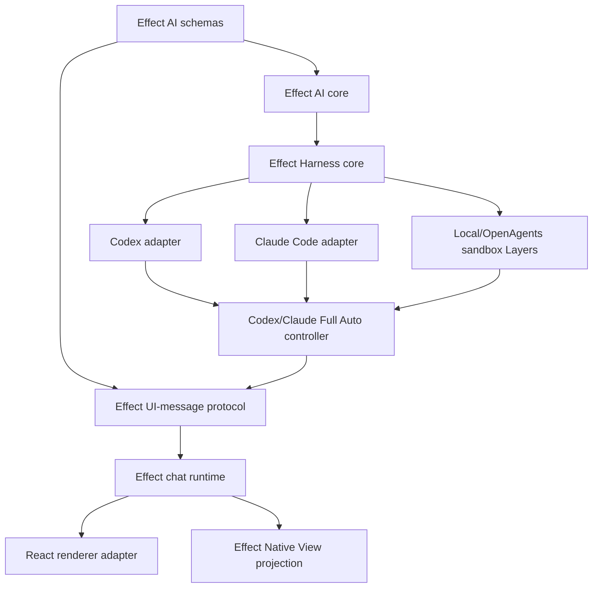
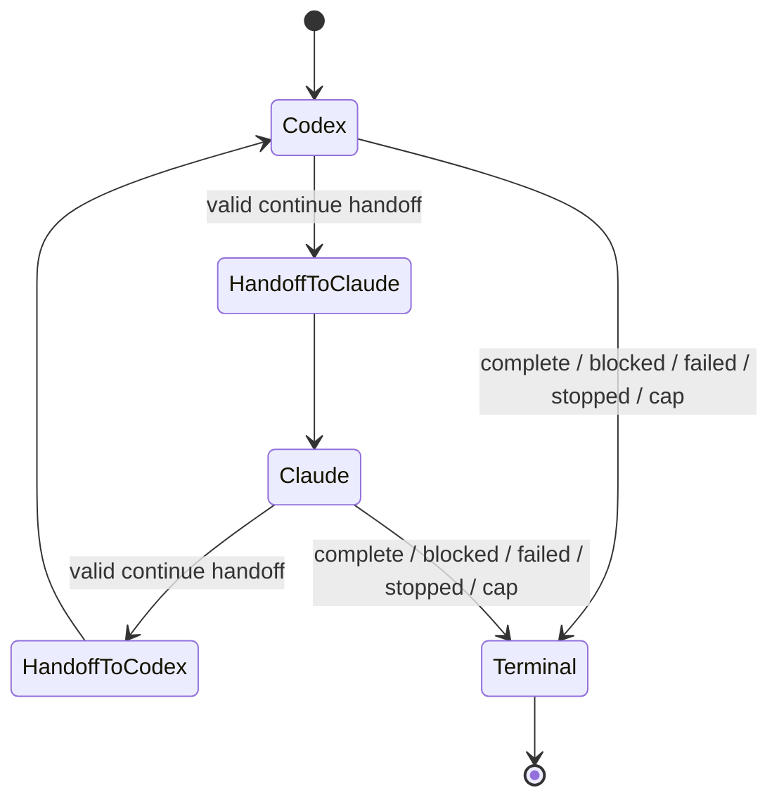

# Vercel AI SDK source-derived Effect conversion audit

- Class: historical-analysis
- Status: current point-in-time architecture and source-conversion analysis
- Snapshot: 2026-07-18
- Dispatch: no; this audit does not authorize package creation, source
  ingestion, application replacement, or production Full Auto changes
- Owner: OpenAgents Effect AI SDK conversion analysis
- Initial proving target: `apps/electron-ai-sdk-test/`
- Potential package target: `packages/`
- Companion experiment roadmap:
  [`2026-07-18-electron-ai-sdk-codex-claude-full-auto-rewrite-roadmap.md`](./2026-07-18-electron-ai-sdk-codex-claude-full-auto-rewrite-roadmap.md)
- Companion in-place reset audit:
  [`2026-07-18-openagents-desktop-vercel-ai-sdk-in-place-reset-audit.md`](./2026-07-18-openagents-desktop-vercel-ai-sdk-in-place-reset-audit.md)

## Question

Vercel publishes AI SDK, its experimental Harness system, the Codex and Claude
Code adapters, React bindings, and AI Elements as open source. Instead of
choosing only between direct dependency and a thin wrapper, should OpenAgents
use that source aggressively and convert the useful runtime, contracts, types,
stream protocol, adapters, and UI behavior into an owned Effect-native SDK?

The target would be more than “AI SDK with Effect around the edges.” It would
make Effect Schema, `Effect`, `Stream`, `Layer`, `Scope`, typed errors, and
Effect Native the owning model while retaining Vercel-compatible inputs,
outputs, and fixtures wherever compatibility is valuable.

The immediate product purpose remains narrow: get the two-lane Codex/Claude
Full Auto experiment working quickly, then replace upstream authority from the
inside out without rebuilding unrelated AI SDK breadth.

## Executive conclusion

Yes, this is legally and technically plausible, and it is a better long-term
fit than making Vercel AI SDK the permanent application authority. It should
be pursued as a **source-derived, attribution-preserving Effect
implementation**, not as a line-for-line fork and not as a clean-room rewrite.

The fastest credible route is a ratchet:

1. prove the Codex/Claude Full Auto loop with the installed upstream packages;
2. put one Effect-native session and stream facade in front of that proof;
3. port the versioned harness contracts, lifecycle, stream translation, and
   typed errors from a pinned upstream snapshot;
4. port Codex to parity, then Claude Code, using differential tests against the
   pinned upstream implementation;
5. move UI-message state and reduction into an Effect-owned runtime while
   keeping React as a thin renderer adapter; and
6. selectively port AI Elements behavior and accessibility into shared
   OpenAgents UI/Effect Native components.

This produces useful ownership after every phase. The experiment does not wait
for a replacement of all 50,000-plus relevant upstream lines, and the new SDK
does not need image, audio, video, realtime, every model provider, every UI
hook, Workflow DevKit, TUI, or Vercel platform integration before Codex and
Claude can alternate.

The central decision is therefore:

> Use Vercel source as a high-quality specification, fixture corpus, and
> implementation donor. Own the narrower Effect semantics OpenAgents needs.
> Preserve compatibility at explicit edges; do not preserve upstream
> architecture merely because its code is available.

## What “take as much code as we want” actually permits

The audited AI SDK packages and AI Elements repository declare the Apache
License 2.0:

- [Vercel AI SDK repository](https://github.com/vercel/ai)
- [Vercel AI SDK license](https://raw.githubusercontent.com/vercel/ai/main/LICENSE)
- [Vercel AI Elements repository](https://github.com/vercel/ai-elements)
- [Vercel AI Elements license](https://raw.githubusercontent.com/vercel/ai-elements/main/LICENSE)

Apache-2.0 permits use, reproduction, modification, and distribution, including
inside a differently structured implementation, subject to its conditions. In
practical repository terms, a source-derived package must at least:

- preserve the applicable copyright and license notices;
- include a copy of Apache-2.0 with distributed source or artifacts as
  required;
- state prominently which copied files were modified;
- carry forward any applicable upstream `NOTICE` content if the selected
  source distribution contains it;
- avoid implying Vercel sponsorship, endorsement, or package ownership; and
- retain enough provenance to answer exactly which upstream code entered each
  OpenAgents file.

Apache-2.0 also contains an express patent license and termination conditions.
This audit is engineering analysis, not legal advice; the exact distribution
and trademark posture should receive owner/legal review before public package
release.

Legal permission is not an instruction to copy indiscriminately. Every copied
line becomes local maintenance surface. The engineering question is which
parts are cheaper and safer to own than to follow upstream.

## Point-in-time source scale

The installed workspace snapshot provides a concrete lower bound:

| Package | Installed version | Source scale in installed package |
| --- | --- | ---: |
| `ai` | `7.0.31` | 36,596 TypeScript lines |
| `@ai-sdk/harness` | `1.0.36` | 58 source files / 9,612 TypeScript lines |
| `@ai-sdk/harness-codex` | `1.0.38` | 2,727 TypeScript lines |
| `@ai-sdk/harness-claude-code` | `1.0.37` | 2,734 TypeScript lines |
| `@ai-sdk/react` | `4.0.34` | 2,271 TypeScript/TSX lines |

That is already about 54,000 lines. It excludes provider utilities, provider
contracts, WebSocket and schema dependencies, sandbox implementations, model
providers, AI Elements, and upstream tests not shipped in npm packages.

The source-grounded Harness teardown found a larger harness family of roughly
40,791 lines across core, adapters, sandboxes, and workflow integration, with
115 harness-area commits during its first five weeks. Vercel also describes
Harness as experimental and warns that breaking changes should be expected.
This velocity favors pinning and selective ownership; it makes an unbounded
tracking fork especially expensive.

## Four implementation choices

| Choice | Time to first Full Auto | Effect ownership | Upstream churn exposure | Long-term fit |
| --- | ---: | ---: | ---: | --- |
| Direct Vercel dependency | Fastest | Low | High | Good experiment, weak destination |
| Thin Effect wrapper over Vercel | Fast | Medium at call boundary | High inside semantics | Useful bridge; current OpenAgents precedent |
| Source-derived Effect compatibility kernel | Incremental | High | Controlled by explicit intake | **Recommended target** |
| Wholesale line-by-line Effect transliteration | Slowest | Superficially high | Maximum | Reject |

A wholesale fork would copy provider breadth, framework-specific decisions,
and compatibility debt before proving any product value. A source-derived
kernel instead takes contracts, tests, algorithms, and state machines only
when they serve the bounded target.

## Existing OpenAgents precedents

### Thin boundary precedent: `khala-ai-sdk-core`

`@openagentsinc/khala-ai-sdk-core` already treats AI SDK as provider-call
transport only. It invokes `streamText`, converts parts into the owned
`openagents.khala_runtime_event.v1` event plane, and routes tools through the
OpenAgents dispatcher. Its README explicitly says AI SDK parts do not become
the canonical product transcript.

That is the correct minimum adapter. It is not the proposed destination
because AI SDK still owns async execution, stream assembly, tool-loop behavior,
errors, and lifecycle beneath the wrapper.

### Source-ingestion precedent: `agent-client-protocol`

`@openagentsinc/agent-client-protocol` is the stronger procedural precedent.
It vendors exact upstream schema artifacts, pins release and commit identity,
records SHA-256 digests and npm integrity, carries the complete upstream
license and third-party notice, generates local types, and runs offline drift
checks. Networked upstream updates are explicit rather than part of normal
generation.

The Effect SDK should reuse that discipline for source files and fixtures, not
invent an informal copy/paste lane.

### Runtime and UI precedents

- `@openagentsinc/ai-sdk-sandbox-local` and
  `@openagentsinc/ai-sdk-sandbox-openagents` already implement the Harness
  sandbox-provider seam.
- `@openagentsinc/effect-boundary` already centralizes Effect Schema boundary
  decoding and typed failures.
- `@openagentsinc/harness-conformance` already gives provider/harness behavior
  a shared test home.
- `packages/ui/src/workbench/` already contains owned message, reasoning,
  tool-call, approval, plan, file-change, timeline, and composer components.
- Effect Native already defines the intended whole-application model: Effect
  owns services, state, concurrency, data, resource lifetimes, and typed UI;
  React is a renderer implementation, not application authority.

These pieces mean the conversion begins from working seams, not a blank repo.

## Proposed package architecture

The names below are architectural placeholders. Public naming must avoid
confusion with Vercel's packages and receive a separate package-release review.



### 1. `@openagentsinc/effect-ai-schema`

Browser-safe, dependency-minimal canonical schemas for:

- messages and content parts;
- model and harness stream parts;
- tools, tool calls, results, approvals, and execution origin;
- usage, finish reasons, warnings, provider metadata, and loss metadata;
- harness identity and capability declarations;
- sandbox identity and restricted capabilities;
- separate resume and active-turn continuation state;
- UI messages and UI message chunks; and
- a closed tagged error algebra.

Effect Schema is the source of truth. TypeScript types and JSON Schema are
derived artifacts. A Vercel-compatibility export may expose structurally
compatible types without making Vercel types canonical.

### 2. `@openagentsinc/effect-ai-core`

The model-call layer expressed as Effect services:

- `generate` returns `Effect<Result, AiError, Model>`;
- `stream` returns `Stream<AiPart, AiError, Model>`;
- tool execution is a typed registry and capability Layer;
- retries, timeout, clock, telemetry, and interruption are explicit services;
  and
- provider-specific Promise/`AsyncIterable` SDKs terminate at adapter
  boundaries.

This package should not port every `ai` feature initially. Text streaming,
structured tool calls, usage, finish semantics, and the small UI projection
needed by Harness are the first closure.

### 3. `@openagentsinc/effect-ai-harness`

The owned harness plane:

- versioned adapter contract;
- stateless harness definition plus explicit scoped session;
- sandbox provider and session services;
- bootstrap recipe and exact source identity;
- bridge protocol and authenticated channel;
- permission/filtering declarations;
- turn sequencing and stale-completion fencing;
- tool approval obligations;
- detach, stop, suspend, resume, continue, and destroy semantics;
- native-event plus compatibility-projection streams; and
- typed recovery and loss classification.

A session should be acquired and released with `Scope`, not represented as a
class whose cleanup callers may forget:

```ts
interface EffectHarnessSession {
  readonly stream: (
    prompt: HarnessPrompt,
  ) => Stream.Stream<HarnessPart, HarnessError>
  readonly detach: Effect.Effect<ResumeSessionState, HarnessError>
  readonly suspendTurn: Effect.Effect<ContinueTurnState, HarnessError>
  readonly stop: Effect.Effect<ResumeSessionState, HarnessError>
}

declare const openSession: Effect.Effect<
  EffectHarnessSession,
  HarnessOpenError,
  HarnessAdapter | SandboxProvider | Scope.Scope
>
```

The exact type syntax will follow the pinned Effect v4 API. The durable rule is
that session lifetime, interruption, finalization, and dependencies are visible
in the type and service graph.

### 4. Codex and Claude Code adapter packages

Port one adapter to closure before adding the second:

- Codex: bridge process, thread identity, relay authentication, tool relay,
  step tracking, replay/resume/rerun classification, credentials, and
  automatic compaction behavior;
- Claude Code: SDK/bridge process, session identity, permissions/filtering,
  thinking modes, manual compaction, skills, replay/resume, and continuation.

The common `HarnessAdapter` contract must not erase their different guarantees.
Each adapter reports exact placement, built-in tool origin, approval support,
filter support, compaction mode, resume class, continuation class, and known
loss.

### 5. `@openagentsinc/effect-ai-ui`

Port the useful AI SDK UI protocol rather than the React hook model:

- Effect Schema definitions for `UIMessage` and chunk variants;
- `Stream` encoders/decoders for the wire protocol;
- a pure, deterministic message reducer;
- stable part identity and start/delta/end rules;
- continuation and stream-merge semantics;
- typed custom data parts for provider, handoff, run state, and evidence; and
- explicit translation from native harness events with recorded loss.

Vercel's UI message protocol is valuable interoperability. It is still a
projection, not execution authority, diff authority, authorization proof, or
durability proof.

### 6. `@openagentsinc/effect-ai-react`

Do not mechanically rewrite `useChat` internals into fibers hidden behind
hooks. Build an Effect-owned `ChatRuntime` with observable state, then expose a
thin React adapter through `useSyncExternalStore` or the repository's Effect
reactivity binding.

React may own mounting and painting. It must not become the canonical run,
message, session, retry, or tool state store.

### 7. Shared UI / Effect Native components

AI Elements is source-installed React/shadcn code, not a runtime SDK. Selective
porting should extract:

- component roles and prop contracts;
- keyboard and screen-reader behavior;
- disclosure, auto-scroll, copy, branch, tool-state, and loading behavior;
- visual composition and useful empty/error states; and
- fixtures and interaction tests.

Owned component definitions belong in shared `packages/ui` and the Effect
Native component/view contract, with React DOM as one renderer. Do not turn
presentational components into Effect services, and do not copy the entire AI
Elements registry merely to claim parity.

## The mechanical Effect conversion map

| Upstream construct | Effect-owned construct | Boundary rule |
| --- | --- | --- |
| `Promise<A>` | `Effect<A, E, R>` | Promise exists only inside a foreign SDK adapter. |
| `AsyncIterable<A>` / `ReadableStream<A>` | `Stream<A, E, R>` | Web streams are encoded/decoded at transport edges. |
| `AbortSignal` | fiber interruption + `Scope` finalizer | Derive an abort signal only when calling a foreign API. |
| class with `destroy()` | scoped service + `acquireRelease` | Cleanup is guaranteed on all exits. |
| event emitter | `PubSub`, `Queue`, or `Stream` | Backpressure and shutdown are explicit. |
| mutable session map | `Ref`, `SynchronizedRef`, or `FiberMap` | State transitions remain serialized and testable. |
| callbacks for retry/timeout | `Schedule` + `Clock` | Tests use `TestClock`; no wall-clock sleeps. |
| thrown/opaque error | `Schema.TaggedErrorClass` algebra | Defects are distinguished from expected failures. |
| Zod/hand-written TS types | Effect Schema | Generate JSON Schema and compatibility types. |
| tool object map | schema-indexed tool registry Layer | Execution capability is separate from display shape. |
| telemetry callback tree | Effect spans, metrics, and logger | Redaction occurs before export. |
| environment reads | `Config` + `Redacted` | Credentials never enter event or UI schemas. |
| hook-owned chat state | Effect runtime + observable snapshot | Hook is renderer glue only. |

Conversion is semantic, not syntactic. Replacing `await` with `Effect.promise`
while retaining ambient maps, callbacks, nullable lifecycle state, and manual
cleanup would preserve upstream failure modes without gaining the Effect
architecture.

## What should be copied, wrapped, or omitted

### Strong candidates for source-derived conversion

- `HarnessV1` contracts and discriminated stream-part unions;
- explicit session lifecycle and turn-sequence fencing;
- separate resume versus continue state validation;
- sandbox provider/session and restricted tool contracts;
- bridge protocol, authentication handshake, cursor/replay classification,
  and bootstrap identity algorithm;
- tool filtering, approval obligation, and execution-origin semantics;
- harness-to-model and harness-to-UI translation rules;
- UI message chunk algebra, reducer, merge, and continuation rules;
- Codex and Claude adapter protocol mappings; and
- upstream fixtures and tests that specify observable behavior.

### Wrap first; port only when pressure justifies ownership

- provider-specific model SDK calls;
- low-level JSON Schema conversion edge cases;
- provider utility normalization;
- WebSocket implementation;
- Codex and Claude native SDK/CLI clients; and
- compatibility encoders for public AI SDK consumers.

Effect should own their lifecycle and error boundary without reimplementing a
vendor protocol unnecessarily.

### Omit from the first Effect SDK

- image, video, speech, transcription, realtime, reranking, and file upload;
- the broad model-provider catalog and AI Gateway default;
- `useCompletion`, `useObject`, realtime hooks, MCP app frames, and every
  framework binding;
- Workflow DevKit/serverless slicing until a real deployment target requires
  it;
- TUI packages, broad telemetry reporters, examples, templates, and docs app;
- Vercel Sandbox as an authority where OpenAgents sandbox Layers already exist;
- every AI Elements component; and
- compatibility behavior with no Codex/Claude Full Auto consumer.

This cut is what makes the conversion a fast product path rather than a new
general-purpose foundation project.

## Source intake and provenance contract

Create one explicit upstream intake area per adopted snapshot, modeled on
`agent-client-protocol`:

```text
packages/effect-ai-source/
  upstream/vercel-ai-<commit>/
    LICENSE
    NOTICE                 # only when present upstream
    SOURCE.json
    files/                 # exact unmodified donor files or patch inputs
    fixtures/              # exact upstream behavior fixtures
  THIRD_PARTY_NOTICES.md
  scripts/update-upstream.ts
  scripts/check-upstream.ts
```

`SOURCE.json` should record for every file:

- repository URL;
- exact commit and package version;
- original path;
- SHA-256;
- license identity;
- whether stored verbatim, modified, translated, or used only as a fixture;
- destination file(s);
- local semantic divergence; and
- the test that protects the adopted behavior.

Normal build, test, and generation must be offline. Only
`update-upstream.ts` may fetch, and it must require an explicit new commit.
`check-upstream.ts` verifies digests, licenses, generated outputs, modified-file
markers, and the compatibility matrix. An upgrade is a reviewed source event,
not a floating package update.

For copied-and-modified files, retain the upstream header where one exists and
add a concise modification notice. For translated files, retain provenance in
the file or an adjacent generated manifest so refactors do not erase origin.

## Differential conformance is the migration engine

The upstream implementation should remain installed as an oracle until each
owned slice reaches closure.

For each adopted behavior:

1. run the pinned Vercel implementation against a deterministic fake adapter
   or fixture;
2. run the Effect implementation against the same inputs;
3. normalize IDs, timestamps, and intentionally opaque provider metadata;
4. compare ordered stream parts, terminal result, errors, lifecycle state,
   and cleanup events; and
5. record any intentional divergence as an explicit OpenAgents contract.

The conformance suite must cover more than happy-path text:

- cancellation before and after first output;
- session finalization on success, typed failure, interruption, and defect;
- duplicate or stale completion callbacks;
- missing, duplicated, or out-of-order text/reasoning/tool chunks;
- tool input streaming, validation failure, approval, denial, and result;
- detach/resume versus suspend/continue mismatch;
- bridge loss before connect, during a turn, and after terminal output;
- cursor replay, disk replay, corrupt log, and lossy rerun;
- restricted sandbox capability escape attempts;
- adapter capability differences;
- stream merge and UI part identity across continuation; and
- browser-safe imports for schema/UI packages.

Effect-specific tests then add what upstream parity cannot prove:

- `TestClock` control of retry, lease, timeout, and stall behavior;
- Layer replacement and dependency-graph checks;
- finalizer execution under fiber interruption;
- model-based session-state transition coverage;
- no secret-bearing type in events or UI messages; and
- no Promise, ambient singleton, or uncontrolled wall clock below declared
  foreign boundaries.

Parity is a ratchet, not permanent subordination. Once a behavior is promoted
into an OpenAgents contract, deliberate divergence is allowed and upstream
output is retained only as historical compatibility evidence.

## Full Auto on the Effect kernel

The two-provider product becomes a small consumer of the packages above:



The Full Auto controller owns:

- objective, done condition, shared workspace, and turn cap;
- one scoped Codex session and one scoped Claude session;
- strict serialized alternation;
- a schema-valid `full_auto_handoff` obligation per completed turn;
- stop and interruption;
- native event retention plus UI projection; and
- terminal outcome.

The Harness adapters own native history and provider-specific lifecycle. The
sandbox Layer owns files/processes/ports/egress. The UI runtime owns the
read-only projection. Neither provider, renderer, nor compatibility protocol
chooses the next lane.

The Effect rewrite does not automatically supply production durability or
exactly-once effects. Those require the existing OpenAgents admission log,
leases, fences, idempotency keys, effect ledger, receipts, and restart
reconciliation if this experiment is ever promoted. An opaque resume handle or
replayed Harness event is not that proof.

## Fastest staged conversion

### E0 — Pin and prove upstream Full Auto

Use the companion experiment roadmap unchanged to land the smallest live
Codex-first alternation on the installed packages. Freeze exact package
versions, upstream commits, live acceptance fixture, and normalized event
transcript.

**Exit:** Codex and Claude alternate in one workspace with typed handoffs and a
bounded terminal outcome.

### E1 — Introduce the Effect facade without changing providers

Create schemas for the Full Auto run, handoff, adapter capability, stream part,
and error surface. Wrap upstream `HarnessAgentSession` in a scoped Effect
service and convert its `AsyncIterable` once into `Stream`.

**Exit:** the Full Auto controller contains no direct Promise lifecycle,
`AsyncIterable`, or upstream session class; behavior remains differentially
identical.

### E2 — Own the harness contract and lifecycle

Ingest the pinned Harness source. Port `HarnessV1`, sandbox/session contracts,
lifecycle-state validation, turn sequencing, permission/filtering, approval
obligations, stream translation, and error algebra. Keep upstream Codex and
Claude adapters behind a compatibility bridge temporarily.

**Exit:** Effect owns harness state transitions and finalization; upstream
adapters pass the owned conformance contract.

### E3 — Port Codex to closure

Convert the Codex adapter, bridge protocol, relay authentication, tool relay,
step tracking, and recovery classification. Preserve the native Codex CLI/SDK
as the foreign runtime.

**Exit:** the live Full Auto Codex lane has no runtime dependency on
`@ai-sdk/harness` or `@ai-sdk/harness-codex` and matches the pinned oracle or a
recorded intentional divergence.

### E4 — Port Claude Code to closure

Convert the Claude adapter, permissions/filtering, compaction, thinking,
skills, bridge, and recovery behavior.

**Exit:** both live lanes run on the owned Effect Harness core and adapters.

### E5 — Own the UI-message runtime

Port the bounded UI message schemas, chunk reducer, merge/continuation logic,
and transport codec. Replace `useChat` authority with the Effect `ChatRuntime`;
retain a thin React adapter.

**Exit:** removing `ai` and `@ai-sdk/react` from the experiment does not change
the visible acceptance transcript or run controls.

### E6 — Selectively absorb AI Elements

Port only components used by the run transcript—message, response, reasoning,
tool/handoff, loader, conversation/scroll, and terminal result—into shared
OpenAgents UI/Effect Native contracts and renderer components.

**Exit:** no AI Elements source is application-local, component behavior has
accessibility and interaction tests, and React remains a renderer.

### E7 — Remove compatibility dependencies or freeze them as test-only

Move Vercel packages out of production dependencies once both adapters, core
streaming, and UI pass live and differential closure. Keep pinned source and
oracles in the provenance/conformance lane as needed.

**Exit:** the experiment runs solely on the owned Effect stack; upstream
packages are either test-only or absent.

## Decision gates

Proceed beyond the thin facade only if all are true:

- the upstream Full Auto proof works and exposes a real ownership pain;
- a pinned source snapshot and Apache-2.0 provenance ledger exist;
- the proposed package owns a narrower documented surface than upstream;
- differential fixtures can exercise the adopted behavior without live model
  nondeterminism;
- the Effect conversion removes manual lifetime/error/state authority rather
  than merely wrapping it; and
- one application consumes the package immediately.

Stop or defer a slice when:

- its only rationale is “we may need it later”;
- upstream churn is cheaper than local maintenance;
- the code is a provider-native SDK that Effect can safely adapt;
- no deterministic oracle exists;
- the port would create a second canonical message or tool type; or
- UI work would move product state back into React.

## Risks and controls

| Risk | Consequence | Control |
| --- | --- | --- |
| Tracking-fork treadmill | Continuous low-value merge work | Pin commits; intake only demanded slices; never mirror `main`. |
| False parity | Same type names hide different lifecycle behavior | Differential streams, state models, live adapter proofs, divergence ledger. |
| License/provenance erosion | Distribution or attribution failure | Vendored license, notices, per-file digests/origin, offline checker. |
| Effect v4 beta churn | Framework and upstream churn compound | Exact Effect pin, small stable package seams, no unstable module without a demand. |
| Compatibility becomes authority | Vercel projections displace native truth | Preserve native events and translator version/loss beside UI projection. |
| Port scope explosion | Full Auto waits on general SDK parity | Codex-first closure, Claude second, bounded text/tool/UI surface only. |
| Security claims outpace placement | “Sandboxed” host tools or permissive Codex are misrepresented | Exact placement/capability facts; enforce policy below adapters; no public claim from fixture proof. |
| React hook state reappears | Effect Native architecture is bypassed | Effect `ChatRuntime`; renderer-only hook; state authority tests. |
| Copied UI becomes a design fork | Two component systems drift | Extract behavior into shared UI/Effect Native; React implementation remains one renderer. |

## Recommendation

Adopt the source-derived Effect kernel as the destination, but do not make it a
prerequisite for the first Full Auto proof.

The correct sequence is:

1. **upstream proof now**;
2. **Effect facade immediately after proof**;
3. **harness lifecycle ownership before provider breadth**;
4. **Codex adapter to closure**;
5. **Claude adapter to closure**;
6. **UI protocol ownership**; and
7. **selective shared-component absorption**.

This answers the ownership concern without sacrificing speed. Vercel's source
can be used liberally where it contains hard-won state machines, protocols,
fixtures, and compatibility behavior. Effect supplies the architecture Vercel
does not try to supply: typed service requirements, structured concurrency,
scoped sessions, interruption-safe cleanup, deterministic clocks, one schema
authority, renderer-independent state, and a test-replaceable application
graph.

The intended outcome is not “Vercel AI SDK, rewritten for branding.” It is a
small OpenAgents Effect AI and Harness stack whose Vercel compatibility is
provable, whose provenance is auditable, and whose first real consumer is the
focused Codex/Claude Full Auto loop.

## Evidence and reading order

1. [`2026-07-18-electron-ai-sdk-codex-claude-full-auto-rewrite-roadmap.md`](./2026-07-18-electron-ai-sdk-codex-claude-full-auto-rewrite-roadmap.md)
   — bounded first proof and acceptance target.
2. [`../teardowns/2026-07-17-ai-sdk-v7-harnesses-teardown.md`](../teardowns/2026-07-17-ai-sdk-v7-harnesses-teardown.md)
   — exact upstream Harness architecture, lifecycle, adapter, sandbox, replay,
   and risk analysis.
3. [`../fable/2026-07-17-effect-vs-rust-architecture-analysis.md`](../fable/2026-07-17-effect-vs-rust-architecture-analysis.md)
   — Effect ownership rationale for schemas, provider adapters, orchestration,
   Full Auto, and tests.
4. [`../effect-native/README.md`](../effect-native/README.md)
   — whole-application Effect and renderer-authority destination.
5. [`../../packages/khala-ai-sdk-core/README.md`](../../packages/khala-ai-sdk-core/README.md)
   — current thin AI SDK boundary precedent.
6. [`../../packages/agent-client-protocol/README.md`](../../packages/agent-client-protocol/README.md)
   and
   [`../../packages/agent-client-protocol/THIRD_PARTY_NOTICES.md`](../../packages/agent-client-protocol/THIRD_PARTY_NOTICES.md)
   — pinned source/schema intake, license, generation, and offline drift-check
   precedent.
7. [Vercel's Harness announcement](https://vercel.com/changelog/program-agent-harnesses-with-ai-sdk),
   [AI SDK transport documentation](https://ai-sdk.dev/docs/ai-sdk-ui/transport),
   [UI message stream reference](https://ai-sdk.dev/docs/reference/ai-sdk-ui/create-ui-message-stream),
   and [AI Elements setup](https://elements.ai-sdk.dev/docs/setup) — official
   upstream compatibility and UI boundaries at this snapshot.

## Final disposition

- **Direct upstream packages:** retain for the first proof and as pinned
  differential oracles.
- **Thin Effect wrapper:** build first as the migration facade, not the final
  architecture.
- **Source-derived Effect Harness and bounded SDK:** recommended destination.
- **Codex then Claude adapters:** first production-shaped conversion order.
- **Effect UI-message runtime plus thin React adapter:** recommended UI state
  destination.
- **Selective AI Elements port:** recommended; wholesale component import is
  not.
- **Whole AI SDK transliteration:** rejected.
- **Production Desktop reset or production Full Auto promotion:** not
  authorized by this audit.
