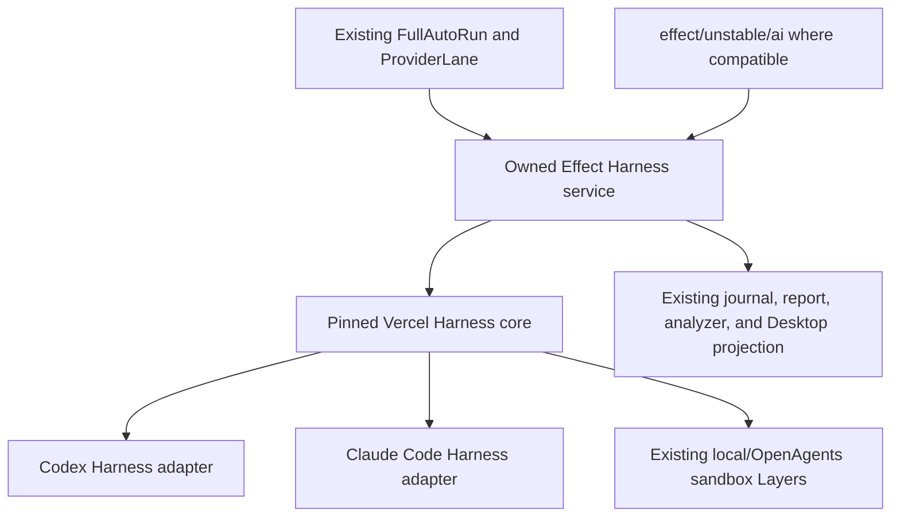

# Vercel AI SDK source-derived Effect conversion audit

- Class: historical-analysis
- Status: re-baselined point-in-time source-conversion analysis
- Snapshot: 2026-07-18
- Dispatch: no; this audit does not authorize package creation, source
  ingestion, application replacement, or production Full Auto changes
- Owner: OpenAgents Effect AI SDK conversion analysis
- Initial proving target: `apps/electron-ai-sdk-test/`
- Potential package target: `packages/`
- Companion experiment roadmap:
  [`2026-07-18-electron-ai-sdk-codex-claude-full-auto-rewrite-roadmap.md`](./2026-07-18-electron-ai-sdk-codex-claude-full-auto-rewrite-roadmap.md)
- Companion in-place reset audit:
  [`2026-07-18-openagents-desktop-vercel-ai-sdk-in-place-reset-audit.md`](./2026-07-18-openagents-desktop-vercel-ai-sdk-in-place-reset-audit.md)
- Current sprint recommendation:
  [`2026-07-18-full-auto-asap-effect-harness-sprint-recommendation.md`](./2026-07-18-full-auto-asap-effect-harness-sprint-recommendation.md)

## Outcome update

The source-conversion gate was not reached. The existing native Desktop lanes
completed the full owner-real matrix and automatic same-pass Claude-to-Codex
rotation at candidate `3123d926a3`; see the
[`acceptance receipt`](./receipts/2026-07-18-full-auto-real-owner-acceptance.md).
An Effect Harness adapter remains a conditional future maintenance option, not
a prerequisite or active sprint. Effect AI continues to be the preferred
generic model/tool layer where it fits; coding-agent session authority remains
inside the proven owned provider seams.

## Question

Vercel publishes AI SDK, its experimental Harness system, the Codex and Claude
Code adapters, React bindings, and AI Elements as open source. Instead of
choosing only between direct dependency and a thin wrapper, should OpenAgents
use that source aggressively and convert the useful runtime, contracts, types,
stream protocol, adapters, and UI behavior into an owned Effect-native SDK?

The target would be more than “AI SDK with Effect around the edges.” It would
make Effect Schema, `Effect`, `Stream`, `Layer`, `Scope`, typed errors, and
Effect Native the owning model while retaining Vercel-compatible inputs,
outputs, and fixtures wherever compatibility is valuable.

The immediate product purpose remains narrow: get the existing Desktop
Codex/Claude Full Auto run working. Source conversion is now conditional on a
post-fix native provider lane still failing its bounded proof timebox.

## Executive conclusion

Source-derived conversion remains legally and technically plausible, but the
original broad destination in this audit was too large. The omitted fact was
that current Effect v4 already supplies a substantial generic AI SDK under
`effect/unstable/ai`, including typed prompts, responses, errors, tools,
streaming model calls, persisted serialized chat, and ordered cross-provider
execution plans.

OpenAgents should therefore **not** create parallel `effect-ai-schema`,
`effect-ai-core`, or generic Effect chat packages as the path to Full Auto.
The only source-derived Vercel slice that fills a demonstrated Effect gap is
the coding-agent Harness layer: Codex/Claude native sessions, bridge and
sandbox lifecycle, coding tools, replay/resume, and event translation.

The corrected ratchet is:

1. repair and prove the existing Effect-owned Desktop Full Auto state machine;
2. keep the native Codex app-server and Claude Agent SDK lanes on the critical
   path;
3. retain the Vercel Harness experiment as a differential oracle and a
   one-working-day fallback for a failing native provider lane;
4. if that fallback is exercised, wrap `HarnessAgent` behind the existing
   `ProviderLane` / `AcceptanceLaneExecutor` as a scoped Effect service; and
5. port or source-ingest only Harness behavior for which the wrapper proves an
   ongoing ownership, stability, or observability need.

The central corrected decision is:

> Reuse Effect AI for generic model/tool/chat semantics. Use Vercel source as
> a specification and donor only for the missing coding-agent Harness seam.
> Do not make either a prerequisite for fixing the current mission, host-thread
> durability, and real-provider proof gaps.

## What “take as much code as we want” actually permits

The audited AI SDK packages and AI Elements repository declare the Apache
License 2.0:

- [Vercel AI SDK repository](https://github.com/vercel/ai)
- [Vercel AI SDK license](https://raw.githubusercontent.com/vercel/ai/main/LICENSE)
- [Vercel AI Elements repository](https://github.com/vercel/ai-elements)
- [Vercel AI Elements license](https://raw.githubusercontent.com/vercel/ai-elements/main/LICENSE)

Apache-2.0 permits use, reproduction, modification, and distribution, including
inside a differently structured implementation, subject to its conditions. In
practical repository terms, a source-derived package must at least:

- preserve the applicable copyright and license notices;
- include a copy of Apache-2.0 with distributed source or artifacts as
  required;
- state prominently which copied files were modified;
- carry forward any applicable upstream `NOTICE` content if the selected
  source distribution contains it;
- avoid implying Vercel sponsorship, endorsement, or package ownership; and
- retain enough provenance to answer exactly which upstream code entered each
  OpenAgents file.

Apache-2.0 also contains an express patent license and termination conditions.
This audit is engineering analysis, not legal advice; the exact distribution
and trademark posture should receive owner/legal review before public package
release.

Legal permission is not an instruction to copy indiscriminately. Every copied
line becomes local maintenance surface. The engineering question is which
parts are cheaper and safer to own than to follow upstream.

## Point-in-time source scale

The installed workspace snapshot provides a concrete lower bound:

| Package                       | Installed version |        Source scale in installed package |
| ----------------------------- | ----------------- | ---------------------------------------: |
| `ai`                          | `7.0.31`          |                  36,596 TypeScript lines |
| `@ai-sdk/harness`             | `1.0.36`          | 58 source files / 9,612 TypeScript lines |
| `@ai-sdk/harness-codex`       | `1.0.38`          |                   2,727 TypeScript lines |
| `@ai-sdk/harness-claude-code` | `1.0.37`          |                   2,734 TypeScript lines |
| `@ai-sdk/react`               | `4.0.34`          |               2,271 TypeScript/TSX lines |

That is already about 54,000 lines. It excludes provider utilities, provider
contracts, WebSocket and schema dependencies, sandbox implementations, model
providers, AI Elements, and upstream tests not shipped in npm packages.

The source-grounded Harness teardown found a larger harness family of roughly
40,791 lines across core, adapters, sandboxes, and workflow integration, with
115 harness-area commits during its first five weeks. Vercel also describes
Harness as experimental and warns that breaking changes should be expected.
This velocity favors pinning and selective ownership; it makes an unbounded
tracking fork especially expensive.

## Five implementation choices

| Choice                                        |        Time to first Full Auto |        Effect ownership |       Upstream churn exposure | Long-term fit                               |
| --------------------------------------------- | -----------------------------: | ----------------------: | ----------------------------: | ------------------------------------------- |
| Repair current Desktop/native lanes           | **Fastest from current state** |            Already high |                           Low | **Recommended immediate path**              |
| Direct Vercel dependency                      |             Fast greenfield path |                     Low |                          High | Good experiment, weak destination           |
| Thin Effect wrapper over Vercel               |                           Fast | Medium at call boundary |         High inside semantics | Useful bridge; current OpenAgents precedent |
| Source-derived Effect Harness kernel          |                    Incremental |                    High | Controlled by explicit intake | Conditional post-proof target               |
| Wholesale line-by-line Effect transliteration |                        Slowest |      Superficially high |                       Maximum | Reject                                      |

A wholesale fork would copy provider breadth, framework-specific decisions,
and compatibility debt before proving any product value. A source-derived
kernel instead takes contracts, tests, algorithms, and state machines only
when they serve the bounded target.

## Existing OpenAgents precedents

### Thin boundary precedent: `khala-ai-sdk-core`

`@openagentsinc/khala-ai-sdk-core` already treats AI SDK as provider-call
transport only. It invokes `streamText`, converts parts into the owned
`openagents.khala_runtime_event.v1` event plane, and routes tools through the
OpenAgents dispatcher. Its README explicitly says AI SDK parts do not become
the canonical product transcript.

That is the correct minimum foreign boundary. A Harness wrapper should follow
the same rule: upstream may own native coding-agent mechanics beneath the
boundary while OpenAgents continues to own product state and evidence.

### Source-ingestion precedent: `agent-client-protocol`

`@openagentsinc/agent-client-protocol` is the stronger procedural precedent.
It vendors exact upstream schema artifacts, pins release and commit identity,
records SHA-256 digests and npm integrity, carries the complete upstream
license and third-party notice, generates local types, and runs offline drift
checks. Networked upstream updates are explicit rather than part of normal
generation.

Any later Effect Harness source intake should reuse that discipline for source
files and fixtures, not invent an informal copy/paste lane.

### Runtime and UI precedents

- `@openagentsinc/ai-sdk-sandbox-local` and
  `@openagentsinc/ai-sdk-sandbox-openagents` already implement the Harness
  sandbox-provider seam.
- `@openagentsinc/effect-boundary` already centralizes Effect Schema boundary
  decoding and typed failures.
- `@openagentsinc/harness-conformance` already gives provider/harness behavior
  a shared test home.
- `packages/ui/src/workbench/` already contains owned message, reasoning,
  tool-call, approval, plan, file-change, timeline, and composer components.
- Effect Native already defines the intended whole-application model: Effect
  owns services, state, concurrency, data, resource lifetimes, and typed UI;
  React is a renderer implementation, not application authority.

These pieces mean the conversion begins from working seams, not a blank repo.

## Corrected package architecture

The current sprint creates no new SDK package. If the native-lane timebox in
#9002 fails, the narrow fallback architecture is:



### Reuse `effect/unstable/ai`; do not duplicate it

The Effect v4 checkout at
`266cb90bb2c17aabc40563c32db334f09ba3d74b` already contains:

- `Prompt` and `Response` parts for text, reasoning, files, tool calls,
  results, and approvals;
- `AiError` and schema-typed `Tool` / `Toolkit` contracts;
- `LanguageModel.generateText`, `generateObject`, and `streamText`;
- `Chat` with serialized turns, JSON import/export, and persisted history;
- `ResponseIdTracker`; and
- ordered, scheduled, conditional `ExecutionPlan` fallback across provider
  Layers.

Those modules are unstable and must be exactly pinned behind an owned boundary,
but their existence removes the case for a new generic OpenAgents Effect AI
SDK. Use them where semantics match; retain existing OpenAgents contracts where
they carry stronger product guarantees.

### Conditional `@openagentsinc/effect-harness`

The only justified new package would own the coding-agent plane:

- a scoped Effect service over `HarnessAgent` / `HarnessV1`;
- separate resume and active-turn continuation state;
- sandbox provider and session services;
- bridge identity and authenticated channel;
- permission, filtering, approval, and execution-origin facts;
- turn sequencing and stale-completion fencing;
- detach, stop, suspend, resume, continue, and destroy semantics;
- native-event to existing ProviderLane result translation; and
- typed recovery and loss classification.

A session should be acquired and released with `Scope`; Promise,
`AsyncIterable`, and class cleanup terminate at this foreign boundary. The
package must not own `FullAutoRun`, scheduling, routing policy, canonical host
history, reports, or renderer state.

### Codex and Claude adapters

Wrap the pinned upstream adapters first. Port one only if dependency churn,
missing observability, or a contract gap is proven:

- Codex: bridge process, thread identity, relay authentication, tool relay,
  step tracking, replay/resume/rerun classification, and compaction behavior;
- Claude Code: SDK/bridge process, session identity, permissions/filtering,
  thinking modes, compaction, skills, replay/resume, and continuation.

The common service must preserve their different guarantees and report exact
placement, tool origin, approval support, filter support, compaction mode,
resume class, continuation class, and known loss.

### UI disposition

Keep the existing Desktop Full Auto view and Effect-owned application state.
AI SDK UI messages and AI Elements remain useful experiment references, but
they are not on the production proof path. A later UI harvest may extract
bounded component behavior into shared UI / Effect Native through its own
admitted issue; it must not introduce a second canonical chat or run store.

## The mechanical Effect conversion map

| Upstream construct                       | Effect-owned construct                  | Boundary rule                                           |
| ---------------------------------------- | --------------------------------------- | ------------------------------------------------------- |
| `Promise<A>`                             | `Effect<A, E, R>`                       | Promise exists only inside a foreign SDK adapter.       |
| `AsyncIterable<A>` / `ReadableStream<A>` | `Stream<A, E, R>`                       | Web streams are encoded/decoded at transport edges.     |
| `AbortSignal`                            | fiber interruption + `Scope` finalizer  | Derive an abort signal only when calling a foreign API. |
| class with `destroy()`                   | scoped service + `acquireRelease`       | Cleanup is guaranteed on all exits.                     |
| event emitter                            | `PubSub`, `Queue`, or `Stream`          | Backpressure and shutdown are explicit.                 |
| mutable session map                      | `Ref`, `SynchronizedRef`, or `FiberMap` | State transitions remain serialized and testable.       |
| callbacks for retry/timeout              | `Schedule` + `Clock`                    | Tests use `TestClock`; no wall-clock sleeps.            |
| thrown/opaque error                      | `Schema.TaggedErrorClass` algebra       | Defects are distinguished from expected failures.       |
| Zod/hand-written TS types                | Effect Schema                           | Generate JSON Schema and compatibility types.           |
| tool object map                          | schema-indexed tool registry Layer      | Execution capability is separate from display shape.    |
| telemetry callback tree                  | Effect spans, metrics, and logger       | Redaction occurs before export.                         |
| environment reads                        | `Config` + `Redacted`                   | Credentials never enter event or UI schemas.            |
| hook-owned chat state                    | Effect runtime + observable snapshot    | Hook is renderer glue only.                             |

Conversion is semantic, not syntactic. Replacing `await` with `Effect.promise`
while retaining ambient maps, callbacks, nullable lifecycle state, and manual
cleanup would preserve upstream failure modes without gaining the Effect
architecture.

## What should be copied, wrapped, or omitted

### Strong candidates for source-derived conversion

- `HarnessV1` contracts and discriminated stream-part unions;
- explicit session lifecycle and turn-sequence fencing;
- separate resume versus continue state validation;
- sandbox provider/session and restricted tool contracts;
- bridge protocol, authentication handshake, cursor/replay classification,
  and bootstrap identity algorithm;
- tool filtering, approval obligation, and execution-origin semantics;
- harness-to-existing-`ProviderLane` translation rules;
- Codex and Claude adapter protocol mappings; and
- upstream fixtures and tests that specify observable behavior.

### Wrap first; port only when pressure justifies ownership

- WebSocket implementation;
- Codex and Claude native SDK/CLI clients; and
- the pinned Vercel Harness packages themselves.

Effect should own their lifecycle and error boundary without reimplementing a
vendor protocol unnecessarily.

### Omit from the first Effect Harness package

- generic prompt, response, error, model, embedding, and tool APIs already
  supplied by `effect/unstable/ai`;
- AI SDK model-provider breadth and AI Gateway;
- AI SDK UI-message authority, `useChat`, `useCompletion`, `useObject`, and
  other framework bindings;
- Workflow DevKit/serverless slicing until a real deployment target requires
  it;
- TUI packages, broad telemetry reporters, examples, templates, and docs app;
- Vercel Sandbox as an authority where OpenAgents sandbox Layers already exist;
- AI Elements and renderer components; and
- compatibility behavior with no Codex/Claude Full Auto consumer.

This cut is what makes the conversion a fast product path rather than a new
general-purpose foundation project.

## Source intake and provenance contract

Create one explicit upstream intake area per adopted snapshot, modeled on
`agent-client-protocol`:

```text
packages/effect-harness-source/
  upstream/vercel-ai-<commit>/
    LICENSE
    NOTICE                 # only when present upstream
    SOURCE.json
    files/                 # exact unmodified donor files or patch inputs
    fixtures/              # exact upstream behavior fixtures
  THIRD_PARTY_NOTICES.md
  scripts/update-upstream.ts
  scripts/check-upstream.ts
```

`SOURCE.json` should record for every file:

- repository URL;
- exact commit and package version;
- original path;
- SHA-256;
- license identity;
- whether stored verbatim, modified, translated, or used only as a fixture;
- destination file(s);
- local semantic divergence; and
- the test that protects the adopted behavior.

Normal build, test, and generation must be offline. Only
`update-upstream.ts` may fetch, and it must require an explicit new commit.
`check-upstream.ts` verifies digests, licenses, generated outputs, modified-file
markers, and the compatibility matrix. An upgrade is a reviewed source event,
not a floating package update.

For copied-and-modified files, retain the upstream header where one exists and
add a concise modification notice. For translated files, retain provenance in
the file or an adjacent generated manifest so refactors do not erase origin.

## Differential conformance is the migration engine

The upstream implementation should remain installed as an oracle until each
owned slice reaches closure.

For each adopted behavior:

1. run the pinned Vercel implementation against a deterministic fake adapter
   or fixture;
2. run the Effect implementation against the same inputs;
3. normalize IDs, timestamps, and intentionally opaque provider metadata;
4. compare ordered stream parts, terminal result, errors, lifecycle state,
   and cleanup events; and
5. record any intentional divergence as an explicit OpenAgents contract.

The conformance suite must cover more than happy-path text:

- cancellation before and after first output;
- session finalization on success, typed failure, interruption, and defect;
- duplicate or stale completion callbacks;
- missing, duplicated, or out-of-order text/reasoning/tool chunks;
- tool input streaming, validation failure, approval, denial, and result;
- detach/resume versus suspend/continue mismatch;
- bridge loss before connect, during a turn, and after terminal output;
- cursor replay, disk replay, corrupt log, and lossy rerun;
- restricted sandbox capability escape attempts;
- adapter capability differences;
- exact translation into existing `ProviderLane` terminal/error facts; and
- no duplicate scheduling, history, or run authority below the adapter.

Effect-specific tests then add what upstream parity cannot prove:

- `TestClock` control of retry, lease, timeout, and stall behavior;
- Layer replacement and dependency-graph checks;
- finalizer execution under fiber interruption;
- model-based session-state transition coverage;
- no secret-bearing type in events or projected lane results; and
- no Promise, ambient singleton, or uncontrolled wall clock below declared
  foreign boundaries.

Parity is a ratchet, not permanent subordination. Once a behavior is promoted
into an OpenAgents contract, deliberate divergence is allowed and upstream
output is retained only as historical compatibility evidence.

## Full Auto on the conditional Effect Harness seam

The existing `FullAutoRun` remains the sole controller. It owns objective,
done condition, workspace, cap, lifecycle, owner-admitted ordered routing,
guardrails, leases, accepted handoff history, reports, and terminal outcome.

A Harness adapter owns only provider-native history and lifecycle for its lane.
The sandbox Layer owns files, processes, ports, and egress. The existing
Desktop projection owns the read-only UI. Neither provider, renderer, Effect
AI `Chat`, Vercel `HarnessAgent`, nor compatibility protocol chooses the next
lane.

The adapter cannot supply production durability or exactly-once effects.
Existing admission, leases, fences, idempotency, journal, receipts, and restart
reconciliation remain mandatory. An opaque resume handle or replayed Harness
event is not that proof.

## Fastest staged conversion

### E0 — Repair the current Full Auto path

Land #9000 and #9001: dispatch the durable mission to every provider turn,
protect the active run thread from composer-cache eviction, and separate
host-thread loss from provider-session loss.

**Exit:** a provider invocation cannot run without the objective/done
condition, and six in-flight ordinary chats cannot orphan the active run.

### E1 — Prove native Codex and Claude

Execute #9002's real-provider gate through the existing Desktop UI and native
provider lanes.

**Exit:** one actual Codex turn and one actual Claude turn succeed with the
same durable mission, then the six #8976 rows close with public-safe receipts.

### E2 — Wrap Harness only if the timebox fails

If E1 cannot produce both provider turns within one working day for a genuine
coding-agent/session reason, wrap the pinned `HarnessAgentSession` in a scoped
Effect service and convert its `AsyncIterable` once into `Stream`. Translate
into existing provider-lane results; do not create another controller or UI.

**Exit:** the Harness-backed lane satisfies the same mission, durability,
routing, handoff, report, guardrail, and evidence contracts as a native lane.

### E3 — Own only demonstrated Harness gaps

Keep pinned Vercel packages as the production adapter until a concrete gap
justifies source ingestion. Port `HarnessV1`, lifecycle, bridge, sandbox, or an
adapter slice only under differential conformance and provenance controls.

**Exit:** every locally owned slice removes a named dependency risk or closes a
named contract gap; no speculative generic SDK breadth is introduced.

## Decision gates

Proceed beyond the thin Harness facade only if all are true:

- the repaired native Full Auto proof still exposes a real adapter ownership
  pain;
- a pinned source snapshot and Apache-2.0 provenance ledger exist;
- the proposed package owns a narrower documented surface than upstream;
- differential fixtures can exercise the adopted behavior without live model
  nondeterminism;
- the Effect conversion removes manual lifetime/error/state authority rather
  than merely wrapping it; and
- one application consumes the package immediately.

Stop or defer a slice when:

- its only rationale is “we may need it later”;
- upstream churn is cheaper than local maintenance;
- the code is a provider-native SDK that Effect can safely adapt;
- no deterministic oracle exists;
- the port would create a second canonical message or tool type; or
- UI work would move product state back into React.

## Risks and controls

| Risk                              | Consequence                                                   | Control                                                                                              |
| --------------------------------- | ------------------------------------------------------------- | ---------------------------------------------------------------------------------------------------- |
| Tracking-fork treadmill           | Continuous low-value merge work                               | Pin commits; intake only demanded slices; never mirror `main`.                                       |
| False parity                      | Same type names hide different lifecycle behavior             | Differential streams, state models, live adapter proofs, divergence ledger.                          |
| License/provenance erosion        | Distribution or attribution failure                           | Vendored license, notices, per-file digests/origin, offline checker.                                 |
| Effect v4 beta churn              | Framework and upstream churn compound                         | Exact Effect pin, owned import boundary, and no unstable module without a demonstrated demand.       |
| Compatibility becomes authority   | Vercel projections displace native truth                      | Preserve native events and translator version/loss beside UI projection.                             |
| Port scope explosion              | Full Auto waits on general SDK parity                         | Fix current Desktop first; permit only a conditional Harness seam.                                   |
| Security claims outpace placement | “Sandboxed” host tools or permissive Codex are misrepresented | Exact placement/capability facts; enforce policy below adapters; no public claim from fixture proof. |
| React hook state reappears        | Effect Native architecture is bypassed                        | Do not import AI SDK UI into the Desktop fallback; preserve existing projection authority.           |
| Copied UI becomes a design fork   | Two component systems drift                                   | Keep AI Elements outside this package and sprint.                                                    |

## Recommendation

Do not adopt a source-derived generic Effect AI kernel as the destination.
Effect already owns that generic layer, and the current Desktop already owns
the product state machine.

The correct sequence is:

1. **repair mission propagation and active-thread durability now**;
2. **prove both native coding-agent lanes through the real UI**;
3. **use the Vercel Harness app as an oracle and one-day fallback**;
4. **wrap Harness at the existing provider seam only if the native timebox
   fails**; and
5. **source-convert only demonstrated Harness gaps after live proof**.

Vercel source may still be used liberally where it contains hard-won coding
agent state machines, protocols, fixtures, and adapter behavior. Effect
supplies typed requirements, structured concurrency, scoped cleanup,
deterministic clocks, and test-replaceable services. Existing Effect AI
supplies the generic model/prompt/tool/chat foundation. The intended optional
outcome is therefore a small owned **Effect Harness** boundary, not another AI
SDK and not a new Full Auto product.

## Evidence and reading order

1. [`2026-07-18-electron-ai-sdk-codex-claude-full-auto-rewrite-roadmap.md`](./2026-07-18-electron-ai-sdk-codex-claude-full-auto-rewrite-roadmap.md)
   — bounded alternative implementation retained as an oracle/fallback.
2. [`../teardowns/2026-07-17-ai-sdk-v7-harnesses-teardown.md`](../teardowns/2026-07-17-ai-sdk-v7-harnesses-teardown.md)
   — exact upstream Harness architecture, lifecycle, adapter, sandbox, replay,
   and risk analysis.
3. [`../fable/2026-07-17-effect-vs-rust-architecture-analysis.md`](../fable/2026-07-17-effect-vs-rust-architecture-analysis.md)
   — Effect ownership rationale for schemas, provider adapters, orchestration,
   Full Auto, and tests.
4. [`../effect-native/README.md`](../effect-native/README.md)
   — whole-application Effect and renderer-authority destination.
5. [`@openagentsinc/ai-model`](https://www.npmjs.com/package/@openagentsinc/ai-model)
   — current thin AI SDK boundary precedent (the package moved from
   `packages/khala-ai-sdk-core` under AISDK-03 #9149, then extracted to the
   `OpenAgentsInc/ai` SDK repository and published to npm).
6. [`../../packages/agent-client-protocol/README.md`](../../packages/agent-client-protocol/README.md)
   and
   [`../../packages/agent-client-protocol/THIRD_PARTY_NOTICES.md`](../../packages/agent-client-protocol/THIRD_PARTY_NOTICES.md)
   — pinned source/schema intake, license, generation, and offline drift-check
   precedent.
7. [Vercel's Harness announcement](https://vercel.com/changelog/program-agent-harnesses-with-ai-sdk),
   [AI SDK transport documentation](https://ai-sdk.dev/docs/ai-sdk-ui/transport),
   [UI message stream reference](https://ai-sdk.dev/docs/reference/ai-sdk-ui/create-ui-message-stream),
   and [AI Elements setup](https://elements.ai-sdk.dev/docs/setup) — official
   upstream compatibility and UI boundaries at this snapshot.
8. [Effect AI documentation](https://effect-ts.github.io/effect/docs/ai/ai),
   [current Effect AI introduction](https://effect.website/docs/ai/introduction/),
   and local Effect v4 source at
   `266cb90bb2c17aabc40563c32db334f09ba3d74b` — generic Effect AI capability
   baseline that supersedes the original duplicate-package proposal.

## Final disposition

- **Current Desktop native lanes:** immediate production proof path.
- **Direct upstream packages:** retain in the experiment as pinned
  differential oracles and a bounded fallback.
- **Thin Effect Harness wrapper:** conditional fallback at the existing
  provider seam, not an automatic migration phase.
- **Source-derived Effect Harness:** conditional post-proof destination only
  when a demonstrated gap justifies ownership.
- **Generic Effect AI packages:** reuse `effect/unstable/ai`; do not duplicate.
- **Effect UI-message runtime and AI Elements port:** deferred outside the
  Full Auto ASAP sprint.
- **Whole AI SDK transliteration:** rejected.
- **Production Desktop reset or production Full Auto promotion:** not
  authorized by this audit.
