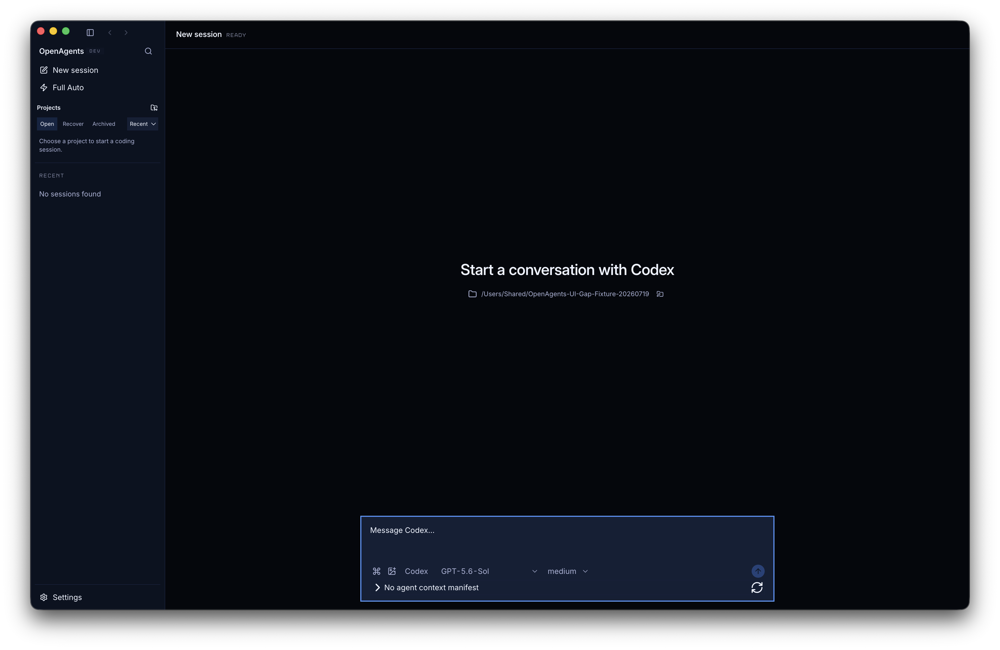
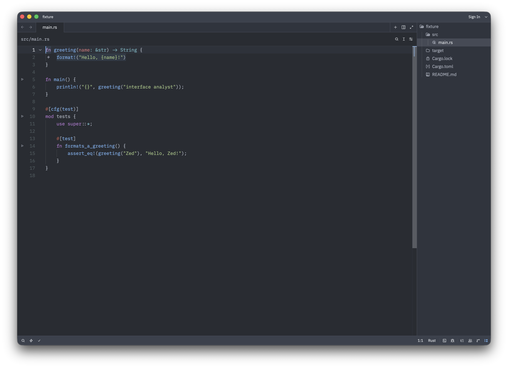
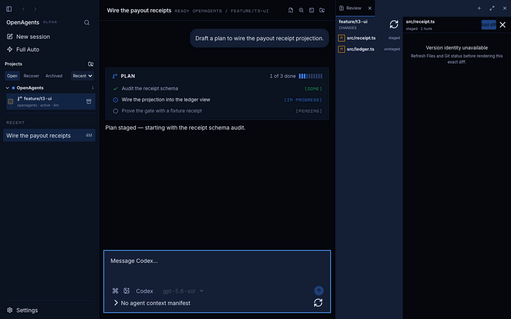

# OpenAgents IDE and Zed programmatic UI gap analysis

- Date: 2026-07-19
- Class: historical analysis
- Owner: Sol issue #9035
- Status: complete assessment
- Source snapshot: OpenAgents `41726ba7068ef89c35d9f749ea9966caab95ef65`; Zed `f032f4d433da3747f9d7bcc9e9cd52d6ca3fb3e4`
- Scope: desktop user interface
- Evidence schema: `openagents.ui-gap-evidence.v1`

## Result

OpenAgents is not at Zed-class UI breadth.
It has a credible agent-first IDE base, but it does not yet have a complete desktop IDE interface.
The largest functional gaps are command search, project search, language breadth, tasks, and debugging.
The largest quality gaps are the red visual gate and the unstyled AI editing surface.

This assessment found four P0 gaps, eleven P1 gaps, and two P2 scope decisions.
The P0 label applies to a broad desktop IDE claim.
It does not change the current OpenAgents ProductSpec or release authority.

OpenAgents also has product strengths that Zed does not replace.
Keep its typed agent operations, evidence lineage, checkpoints, backlinks, degraded states, remote agent control, and browser preview concept.

## Anti-pattern verdict

Verdict: **fail for a broad Zed-class UI claim**.

The verdict has two direct causes.
All 24 OpenAgents visual states exceeded the checked-in drift limit.
The OpenAgents AI editing component also uses two class names that have no matching stylesheet selector.

This is not a verdict on the current basic-IDE promise.
It is a verdict on interface breadth and visual conformance against the selected Zed source.

| Target | Accessibility | Performance | Responsive | Theming | Anti-patterns | Total | Rating |
| --- | ---: | ---: | ---: | ---: | ---: | ---: | --- |
| OpenAgents IDE | 3 | 2 | 2 | 2 | 2 | 11/20 | Acceptable |
| Zed | 2 | 3 | 3 | 4 | 4 | 16/20 | Good |

The Zed accessibility score is conservative.
The native tree exposed the menu system, but it did not expose the custom editor contents.
The OCR result proved visible fixture text, not semantic access.

## Authority boundary

Zed is a comparison source.
It is not product authority for OpenAgents.
The assessment does not authorize a Zed feature, a release, or a parity claim.

Each finding has a product-scope disposition.
`close-gap` identifies an admitted UI need for a broad IDE claim.
`product-decision-required` identifies a useful difference that needs separate product authority.
`preserve-left-lead` protects an OpenAgents strength.

## Pinned evidence

| Item | OpenAgents | Zed |
| --- | --- | --- |
| Commit | `41726ba7068ef89c35d9f749ea9966caab95ef65` | `f032f4d433da3747f9d7bcc9e9cd52d6ca3fb3e4` |
| Tree | `798d73205db93df2543b50e98368b38de8e22db5` | `bc5e231b224529baeb1a3cc2c8ea54eff8ac21ad` |
| Tracked files | 10,116 | 4,206 |
| Selected UI files | 281 | 752 |
| Selected UI bytes | 4,459,424 | 21,173,349 |
| Corpus digest | `95a43cedf13d65b152258930c11c3a71d261b78ddc4036720a77360059575342` | `448ee8d110a6748e24b57ffd3c49580b54df08b8a8c28ec6db591e6d547c55b0` |

Both source identities were clean when the run started.
The evidence stores public root labels instead of local checkout paths.

## Reusable analysis infrastructure

The reusable tool set is in [`ui-gap-analysis/`](./ui-gap-analysis/README.md).
It runs from a normal terminal and does not need the Codex application.

The tool set has these parts:

- A versioned JSON evidence schema
- A pinned target and source-probe configuration
- A Node.js doctor, source scanner, command receipt, comparison, and validator
- A Swift macOS window, screenshot, image-metric, and accessibility capture
- A Swift Vision OCR adapter for custom-rendered interface text
- An isolated Electron adapter for the OpenAgents DOM and window
- Unit tests for target configuration, glob isolation, comparison planes, validation, and private-path rejection

The design keeps six evidence planes separate.
It does not convert a match count into a product score.
It does not convert a screenshot delta into a usability result.
It also keeps runtime, source, build, visual, and reviewed finding data separate.

The configuration cannot execute a command.
An operator must give each build command explicitly.
This control prevents an imported comparison configuration from becoming command authority.

## Build and launch receipts

### OpenAgents

The frozen workspace install and the Electron binary install completed.
The source build passed in 6.257 seconds.
The renderer build transformed 3,134 shell modules and 1,262 editor modules.
The built `renderer/boot.js` file was 12,309,274 bytes.
Its SHA-256 digest was `0eee52aeaca8fef2432834a4dfd7f0c043f9e82531d17e5b1abb34606a4dfd0a`.

The isolated launch used a disposable workspace and a temporary app profile.
It used Chromium mock keychain mode and did not use the normal signed-in profile.
The visible window was 1,728 by 1,084 points.
The live DOM inventory contained 32 visible landmarks and controls.

The live capture shows the signed-out OpenAgents shell.
The current IDE-specific visual state comes from the visual fixture run.
This distinction prevents the report from describing a fixture as a live coding session.



### Zed

The Zed checkout specified Rust 1.95.
The local pinned toolchain was incomplete, so the run installed Rust 1.95 in an isolated temporary toolchain home.
CMake 4.4.0 was also necessary.

The first source build ran for 420.16 seconds and failed in `gpui_macos`.
Xcode had a `metal` launcher, but it did not have the Metal Toolchain component.
The documented `xcodebuild -downloadComponent MetalToolchain` command installed Metal Toolchain 17F109.
The download size was 687.9 MB.

The cached source build then passed in 88.63 seconds.
It used 6,105,382,912 bytes of maximum resident memory.
The debug executable was 1,176,800,136 bytes and was an arm64 Mach-O file.
Its SHA-256 digest was `0fe792082059a28bd6d4922ea1e6100dd8658e71d2cf92045a8639c0cfd0d331`.
The final receipt wrapper confirmed the same artifact with a 1.612-second cached build.

The launch used `ZED_STATELESS=1`, an isolated user-data directory, and a disposable Rust project.
The settings disabled telemetry and AI.
The launch probe measured 514.048 ms from process start to the first visible window.
The captured editor window was 1,536 by 1,084 points.

The native capture contained 315 AX nodes.
The menu system accounted for 307 of those nodes.
The custom editor contents were not in the AX tree.
The OCR adapter found 41 visible text rows, including the project, file tree, Rust code, sign-in state, and Rust status.



## Source signal result

The scanner counted exact regular-expression matches in the selected corpora.
The counts measure evidence density only.
Different implementation languages and component models make raw count comparisons unsuitable for capability scoring.

| Signal | OpenAgents | Zed | Reviewed meaning |
| --- | ---: | ---: | --- |
| Agent context and proposal | 5,497 | 2,116 | OpenAgents has a strong agent-first model. |
| Collaboration and remote | 536 | 2,762 | The products target different remote workflows. |
| Editor tabs and splits | 1,551 | 23,273 | Zed has much deeper pane and editor implementation. |
| Focus and keyboard | 300 | 2,153 | Zed has broader keyboard infrastructure. |
| Language diagnostics | 1,029 | 7,820 | Zed has much broader language infrastructure. |
| Search and commands | 85 | 690 | OpenAgents has clear search and palette gaps. |
| Settings, theme, and keymap | 1,891 | 17,129 | Zed has much deeper customization UI. |
| Terminal, task, test, and debug | 1,130 | 8,632 | Tasks and debugging are absent in OpenAgents UI. |
| Theme token use | 1,132 | 909 | Raw token count does not prove theme quality. |
| Motion and reduced motion | 257 | 111 | OpenAgents has explicit reduced-motion rules. |

## Complete UI matrix

| UI area | OpenAgents | Zed | Disposition |
| --- | --- | --- | --- |
| Application shell | Partial persistent shell | Mature docks, panes, and status regions | Close gap, P1 |
| Project explorer | Rename, move, duplicate, delete, compare, reveal, terminal, and search | Adds clipboard, trash restore, ignore, and rich navigation | Close remaining gap, P1 |
| Tabs and panes | Tabs, preview, reorder, close actions, split state, and groups | Mature drag split and pane management | Close gap, P1 |
| Command palette | Fixed command list without query | Query, usage sort, and fuzzy match | Close gap, P0 |
| Project search | Path and content search | Regex, replace, globs, open-only, and ignored-file controls | Close gap, P0 |
| Language UI | Monaco and TypeScript or JavaScript project actions | Broad language and native editor depth | Close gap, P0 |
| Agent review | Typed operations, evidence, lineage, checkpoints, and backlinks | File and hunk review with keep and reject | Preserve OpenAgents lead |
| Git | Read-only review by design | Stage, commit, sync, stash, history, and conflict UI | Product decision, P1 |
| Terminal | Session transcript, input, restart, interrupt, and previews | PTY terminal interaction | Close gap, P1 |
| Tasks and debug | Not observed | Task history and full debugger controls | Close gap, P0 |
| Settings and themes | Partial account, editor, plugin, keybinding, and diagnostic settings | Searchable settings, themes, icons, and keymap editor | Close gap, P1 |
| Extensions | MCP and OpenAgents plugin control | Editor extension discovery and lifecycle | Product decision, P2 |
| Remote and collaboration | Remote agent control and mobile pairing | SSH workspace and live human collaboration | Product decision, P2 |
| Restoration | Editors, drafts, selections, tabs, and history | Wider workbench, dock, pane, and debugger restoration | Close gap, P1 |
| Accessibility proof | Good DOM intent and passing contract tests | Native menu access, but custom editor not exposed in this run | Add task-based proof, P1 |
| Narrow window | Sidebar hides below 760 pixels | Native resizable docks | Verify and repair, P1 |
| Visual conformance | 24 of 24 states drift | Source-native runner exists, but no baseline run completed | Repair OpenAgents gate, P1 |
| AI editing visuals | Complete state model with missing CSS selectors | Mature agent diff surface | Repair, P1 |
| Browser preview | Local preview and viewport presets | Not observed in this source lane | Preserve OpenAgents lead |
| Feedback states | Strong explicit partial, degraded, stale, and error states | Strong error and empty-state intent | No material gap |

The machine-readable version is in [`gap-assessment.json`](./ui-gap-analysis/evidence/gap-assessment.json).
It contains exact line references, confidence, runtime probes, and product-scope dispositions.

## P0 gaps for a broad IDE claim

### Query the command palette

The OpenAgents palette renders command families and shortcut badges.
It does not render a query input.
Zed has a query editor, usage ordering, and asynchronous smart-case fuzzy matching.

Add a text query, keyboard selection, result count, no-result state, and fuzzy ranking.
Keep the existing command registry as the command authority.

### Complete project search

OpenAgents has bounded path and content search.
It does not expose regex, replace, include, exclude, open-file scope, or ignored-file scope.
These controls are necessary for repository refactors.

Add preview-before-replace and operation receipts.
Do not let a text replacement bypass workspace mutation authority.

### Expand language coverage

OpenAgents exposes definition, references, format, rename, code actions, diagnostics, outline, and problems UI.
The project-aware gate accepts only TypeScript and JavaScript.
Zed has a much broader language service and editor surface.

Use language adapters behind the existing typed capability model.
Do not replace typed capability state with direct extension UI callbacks.

### Add tasks and debugging

No user-visible task runner or debugger was found in the OpenAgents renderer composition.
Zed has task selection, history, rerun, debugger lifecycle, frames, variables, breakpoints, modules, and console UI.

Add tasks before a full debugger if the work must be split.
Both surfaces need explicit execution authority, environment identity, cancellation, output, and evidence.

## P1 quality and workflow gaps

### Repair the visual gate

The OpenAgents visual suite checked 24 states.
All 24 states exceeded the maximum different-pixel ratio of 0.001.
The minimum drift ratio was 0.019188.
The median was 0.074438.
The maximum was 0.632655.

The current `files-rich-diff` image also shows a stale fixture contract.
The review panel reports that version identity is unavailable.
The current explorer reads the new path-index projection, while the fixture still seeds an older workspace-browser model.



Update the fixture to the current state model.
Then review and admit new baselines in a separate visual change.
Do not update baselines only to make the ratio green.

### Style the AI editing surface

`react-cursor.tsx` uses `oa-react-ide-cursor` and `oa-react-ide-cursor-candidates`.
No tracked stylesheet selector matches either class.
The component has a strong state model, but its unscoped HTML layout is not a production visual surface.

Add a complete layout for request controls, candidate navigation, content, decision controls, errors, focus, and overflow.
Test completion, next-edit, answer, and proposal states.

### Repair narrow navigation

The shell hides its sidebar below 760 pixels.
No replacement navigation trigger was found in the inspected composition.
Run the named 640-pixel probe before classifying this as a confirmed defect.

### Reduce editor-toolbar density

The editor toolbar includes navigation, quick open, closed-tab restore, tab close actions, wrap, minimap, language status, five language actions, split, group selection, Vim, context, settings, save all, save as, and save.
This density weakens hierarchy and increases pointer travel.

Move low-frequency actions to a command or overflow menu.
Keep save state, language state, and the current primary action visible.

### Complete the terminal and workbench

Replace the transcript-like terminal with a terminal-native emulator if interactive terminal work is in scope.
Add complete pane restoration, scroll, folds, breakpoints, and workbench geometry.
Add the missing project explorer clipboard, trash, ignore, and diagnostic navigation actions.

### Decide Git authority

The read-only Git surface is intentional.
Do not copy Zed Git mutation controls without compatible OpenAgents authority.
If Git delivery stays outside the product, document the difference as a retained scope boundary.

## OpenAgents strengths to keep

- Typed agent proposals and selected operations
- Exact evidence, lineage, and checkpoint state
- Conversation-to-code backlinks
- Explicit partial, degraded, unavailable, stale, and recovery states
- Remote control for agent sessions
- Browser preview viewport presets
- Reduced-motion CSS
- Typed workspace mutations in the current Pierre explorer

The current Pierre explorer changes an earlier source conclusion.
It already implements drag move, rename, duplicate, delete, compare, reveal, terminal, and search actions.
An older compatibility path still states that mutation controls are withheld.
Reconcile that internal authority description so one interface model does not contradict another.

## Zed features that need product decisions

Do not treat these Zed capabilities as automatic OpenAgents backlog items:

- Full Git delivery UI
- Editor extension marketplace
- SSH workspace editing
- Live human project sharing
- Calls, channels, and social collaboration

They can be valuable.
They also expand product scope, authority, support, and security obligations.

## Runtime accessibility result

The OpenAgents adapter used the live Electron DOM.
It found 18 buttons, 3 combination boxes, 3 navigation regions, 2 main regions, 2 headings, 2 sections, 1 aside, and 1 text box.
This is not a VoiceOver result.

The Zed adapter used the macOS AX API.
It found 315 nodes.
Most nodes were application menus.
The custom GPUI editor contents did not appear in the captured AX tree.
Vision OCR confirmed the editor, project tree, Rust source, and status bar.
OCR does not prove keyboard or assistive-technology access.

Run task-based keyboard and VoiceOver checks for both products.
The tasks must cover explorer, editor, search, review, terminal, tasks, debug, and settings.

## Reproduction

Use the commands in [`ui-gap-analysis/README.md`](./ui-gap-analysis/README.md).
The minimum deterministic sequence is:

1. Run `doctor` and confirm both commit and tree values.
2. Run `scan-source` for the two selected corpora.
3. Run each explicit build through `record-command`.
4. Launch each product with a disposable project and profile.
5. Run `capture-macos` for the window, image metrics, and native tree.
6. Run `capture-ocr` when a custom renderer omits visible text from the native tree.
7. Run the isolated OpenAgents adapter for DOM evidence.
8. Run `compare` and validate each evidence record.
9. Review findings. Do not generate product priorities from probe counts.

Zed also has a source-native visual test runner:

```sh
VISUAL_TEST_OUTPUT_DIR="$(mktemp -d)" \
  cargo run -p zed --bin zed_visual_test_runner --features visual-tests
```

This runner uses direct Metal texture capture.
It does not need a visible window or Screen Recording permission.
The selected checkout did not include accepted baselines for this run.
Do not use `UPDATE_BASELINE=1` in the comparison checkout because that command writes baseline files.

## Evidence index

- [`doctor.json`](./ui-gap-analysis/evidence/doctor.json)
- [`OpenAgents source scan`](./ui-gap-analysis/evidence/openagents/source.json)
- [`Zed source scan`](./ui-gap-analysis/evidence/zed/source.json)
- [`OpenAgents build receipt`](./ui-gap-analysis/evidence/openagents/build.json)
- [`Zed build receipt`](./ui-gap-analysis/evidence/zed/build.json)
- [`OpenAgents runtime capture`](./ui-gap-analysis/evidence/openagents/runtime.json)
- [`Zed runtime capture`](./ui-gap-analysis/evidence/zed/runtime.json)
- [`Zed OCR capture`](./ui-gap-analysis/evidence/zed/ocr.json)
- [`Programmatic comparison`](./ui-gap-analysis/evidence/comparison.json)
- [`Reviewed gap assessment`](./ui-gap-analysis/evidence/gap-assessment.json)
- [`OpenAgents visual drift summary`](./ui-gap-analysis/evidence/openagents/visual-baseline-drift-summary.json)

## Limits

- The OpenAgents live capture is a signed-out shell state.
- The OpenAgents IDE image is a current visual fixture, not a live coding session.
- The Zed capture uses a debug binary and a synthetic Rust project.
- The first Zed build receipt contains a host prerequisite failure, not a Zed product defect.
- The Zed visual runner did not complete a baseline comparison.
- The two runtime accessibility providers use different role namespaces.
- Pixel luma and edge density do not measure usability.
- Source match counts do not measure product completeness.
- No assistive-technology user completed the task probes.
- This assessment does not authorize implementation, release, or public parity claims.
