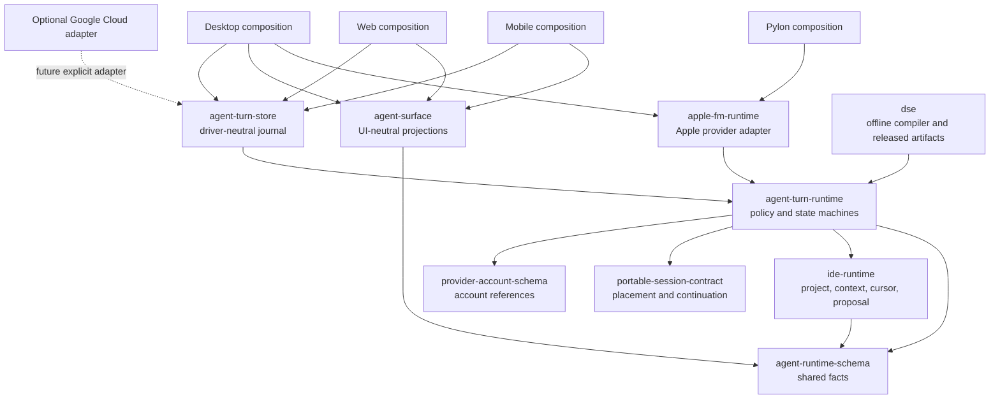
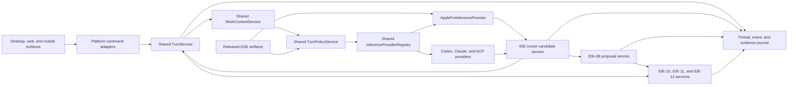

# Apple FM router chat to the full OpenAgents system

- Date: 2026-07-20
- Status: owner-directed definitive implementation plan
- Owner: OpenAgents shared agent system and Sol roadmap
- Source snapshot: `ec312f73e830c9fab9dee1c2b2a3011405dedf14`
- Synthesis source: `7e5d067c88a040296977beaaf38d62be59a612b7`
- Product target: shared local-first agent system, with Desktop as the first host
- Surface target: Desktop execution, plus safe web and mobile projections
- Runtime target: Node 24, pnpm, Vite Plus, Effect v4, Electron, React Native,
  web React, and the current Swift Apple FM helper
- Release effect: none until the applicable ProductSpec and assurance gates pass

## Result

OpenAgents must replace the current special Apple FM chat path with one trusted
turn system. The system must have shared contracts and a shared Effect kernel.
Desktop must be its first execution host. Web and mobile must use safe
projections of the same turn facts. The new system must connect chat, Editor
context, local inference, provider turns, proposals, tasks, debug work, source
control, evidence, and release state. It must not give Apple FM action
authority.

The shared turn kernel must own route rules and turn state. The Electron main
process must compose that kernel with Desktop adapters. A local model can
recommend a route or produce an advisory result. Deterministic policy must make
the route decision. Existing host services must perform all actions.

The first conversion must keep the current Apple FM bridge behavior. It must
not keep its current package ownership by default. It must move the reusable
wire contract and client boundary from the nested Pylon runtime to neutral root
packages. It must keep Desktop helper supervision in the Desktop host. It must
remove the renderer-side prompt builder and direct reply append. It must make
each local reply a canonical thread turn with identity, context, disclosure,
lifecycle, and evidence data.

The conversion must then use the existing IDE graph. The Editor must keep the
file visible while the user adds context or asks for help. Apple FM must use the
same typed cursor candidate and decision contracts as other providers. All file
changes must use the IDE-08 proposal, review, apply, and undo path.

Current paths are source evidence. They are not the required final ownership.
In particular, `apps/pylon`, `@openagentsinc/pylon-runtime`,
`@openagentsinc/pylon-core`, and Desktop-local contract files must not become
the shared turn-system authority only because useful code is there now.

Version one must be local-first and local-only for OpenAgents control and data.
It must store turn state, agent state, message-chain projections, DSE artifacts,
evaluation data, and optional memory on the device. It must not require a cloud
control plane or cloud trace store. An explicitly selected Codex, Claude, or ACP
lane can contact its provider. That provider call does not authorize an
OpenAgents cloud dependency.

The DSE work must be an offline prompt and policy compiler. It must publish
immutable, evaluated artifacts. Runtime code can resolve a released artifact,
but it cannot optimize or promote itself. MemoHarness memory is a later and
optional layer. Blueprint supplies useful governance patterns, but it is not
the target runtime and it is not an ontology.

## Authority and dispatch boundary

This plan records the owner-requested conversion. It does not release a product,
change a product promise, approve spend, or admit a public claim.

The following sources keep their authority:

- [`MASTER_ROADMAP.md`](./MASTER_ROADMAP.md) owns priority and sequence.
- [`desktop-trust-complete-workbench.product-spec.md`](../../specs/desktop/desktop-trust-complete-workbench.product-spec.md)
  owns the Desktop workbench intent.
- [`cursor-capability-parity.product-spec.md`](../../specs/openagents/cursor-capability-parity.product-spec.md)
  owns the integrated IDE and Cursor parity intent.
- [`full-auto.product-spec.md`](../../specs/desktop/full-auto.product-spec.md)
  owns harness selection, placement, policy bundle, memory, adaptation, and
  optimizer intent.
- [`IDE_ROADMAP_CROSSWALK.md`](../../specs/IDE_ROADMAP_CROSSWALK.md) owns the
  criterion and evidence crosswalk.
- [`docs/ide/ROADMAP.md`](../ide/ROADMAP.md) owns the IDE dependency order.
- AssuranceSpec files own proposed proof design. They do not prove that a gate
  passed.
- Product code, tests, receipts, and owner decisions supply current status.

Implementation work must use a current issue, an admitted packet, or another
accepted work ledger. Each worker must follow the claim protocol. A worker must
not treat this document as release or public-claim authority.

## Source method

This plan reconciles these source groups:

1. All current files in `docs/apple-fm/`.
2. All current files in `docs/ide/`.
3. The DSE Git history audit and its Apple FM and Blueprint analyses.
4. The current MemoHarness analysis.
5. The current Desktop, web, mobile, Cursor parity, Full Auto,
   portable-session, and managed sandbox specifications.
6. The current root package graph and the Desktop, web, mobile, Pylon, Apple
   FM, provider, thread, IDE, context, proposal, task, debug, and source-control
   code.
7. Git history for the retired native Swift, DSE, Blueprint, Apple FM, Pylon,
   and IDE implementations.
8. The package contracts for agent runtime, provider accounts, portable
   sessions, runtime platform, UI, ATIF, sync, and Pylon core.

Historical documents are evidence. They are not current runtime authority.
The plan uses the current code when a historical document conflicts with it.

## Current system

### Current Apple FM path

The current supported path has these parts:

```text
Renderer -> typed preload IPC -> Electron main -> AppleFmHost
         -> nested Pylon runtime client -> Swift foundation-bridge -> Apple FM
```

The current path has useful controls:

- The renderer does not receive the helper path, loopback URL, token, raw file
  content, raw tool data, or private transcript data.
- The Electron main process owns the helper lifecycle.
- The helper has a bounded prompt and output contract.
- The host reports readiness, mode, outcome, and honest usage truth.
- Unsupported hardware, absent helpers, malformed data, and failed probes have
  typed refusal states.
- The bridge can launch, adopt, refresh, stop, and dispose the local helper.

The nested Pylon runtime is a current dependency. It is not a placement
decision for the full system. Its Apple FM folder combines a portable wire
contract, a client, Node process control, workspace tools, Blueprint tools,
Pylon receipts, and program-run evidence. These concerns have different owners
in the target.

The current renderer chat path is not the required full system:

- `buildOpenAgentsAppleFmPrompt` flattens recent notes into one prompt.
- `DesktopAppleFmChatHost.respond` returns only `string | null`.
- The renderer checks `openAgentsStandby` and Apple FM boot state.
- The renderer calls Apple FM directly through its bridge wrapper.
- The renderer appends the result to local note state.
- This path does not use the canonical provider dispatcher.
- It does not record a complete turn lifecycle or effective route.
- It does not bind a project, attachment, context manifest, or IDE generation.
- It cannot make a typed proposal, task, debug, or source-control request.
- Its prompt limit is 3,900 characters in the renderer even though the IPC
  contract permits 4,000 characters.

This path is a valid bridge demonstration. It is not a valid authority graph.

### Current IDE graph

IDE-00 through IDE-12 supply most of the required action system:

| Capability | Current authority |
| --- | --- |
| Project, root, worktree, document, and generation identity | IDE-00 through IDE-02 |
| Monaco documents, edits, save, and conflicts | IDE-03 and IDE-04 |
| Language and review projections | IDE-05 through IDE-07 |
| Context manifest, attachments, proposals, review, apply, undo, and backlinks | IDE-08 |
| Completion, next edit, answer, and proposal candidates | IDE-09 cursor graph |
| Tasks, tests, output, and cancellation | IDE-10 |
| Debug Adapter Protocol sessions and debug projections | IDE-11 |
| Source control, diff, stage, commit, delivery, and evidence | IDE-12 |
| Portable placement and session work | IDE-13 and later, not complete at this source snapshot |

The cursor contract already has provider-neutral intent, candidate, identity,
disclosure, provenance, quality, staleness, decision, cancellation, and undo
data. The current main-process host binds that contract to Claude. It does not
yet select a provider through one registry.

The Editor has another integration gap. `AgentContextTray` exists, but the
production Editor does not mount it. The **Add context** command prepares
context and then changes the workspace from Editor to chat. This split prevents
the required agent-first Editor flow.

### Current provider graph

The current provider lanes include Codex, Claude, Grok ACP, and Cursor ACP.
They have host-owned account, admission, capability, history, and lifecycle
controls. Apple FM is not in this registry.

Apple FM must not become an unrestricted provider lane. It is a local advisory
inference provider. The host can select it for an admitted local task. The host
must keep external action, provider dispatch, and spend authority.

## Findings from history

### Apple FM history

OpenAgents has used at least six Apple FM shapes. The earliest native Swift app
could summarize titles, inspect a workspace, use workspace tools, and delegate
work to Codex or Claude. Later paths used Bun, Electrobun, a loopback service,
and a standalone daemon. OpenAgents retired those paths.

The current AFM-1 through AFM-7 program is the only implementation base for
this plan. It delivered helper supervision, wire contracts, CLI access,
bounded read-only tools, progressive snapshots, Desktop IPC, in-process Pylon,
and package wiring. The conversion must not restore the old app or a second
daemon authority.

Commit `f5919c766930d5913d67484660ff670dd92776fd` imported duplicate nested
runtime trees under Pylon and Probe. Those trees now differ. Pylon also has a
second Node supervisor path, and Desktop has a third packaged helper path. This
history proves that the nested app package is not a stable shared boundary.
The new package must select behavior through conformance tests. It must not
copy every current implementation.

The current native source and Desktop staging data also differ. The Swift
helper reports bridge version `0.1.3`. Desktop staging pins `0.1.1`. The target
must generate or check both values from one source before release.

The history also shows a repeated error. Earlier designs made a local model look
like the router because it produced routing text. The new system must separate a
recommendation from a decision. A model can classify or recommend. Only the
trusted host can admit a route and start work.

### DSE history

The historical `@openagentsinc/dse` package was a real Effect system. It had
signatures, Prompt IR, prediction, schema contracts, datasets, splits, metrics,
bounded search, budget controls, receipts, canaries, an active pointer, and
rollback. It used instruction grids, few-shot selection, joint search, and
knob refinement.

It did not implement MIPROv2 or GEPA in Effect. New records must use honest
algorithm names.

The package disappeared during broad application deletion and a Rust-only
mandate. The record does not show a DSE-specific technical rejection. The new
system must not restore the old package without change. It must use Effect v4,
Node 24, pnpm, Vite Plus, and current OpenAgents contracts.

The corrected DSE contract must make these rules explicit:

- An artifact identity covers all artifact bytes.
- A missing holdout causes failure.
- Training data cannot become holdout data.
- An independent evaluator controls promotion.
- Each candidate binds an immutable dataset revision.
- Admission includes quality, cost, resource, and budget evidence.
- Runtime code cannot change the active artifact.
- A rollback pointer identifies a previously released artifact.

Apple FM is a strong DSE target because a small local model is sensitive to
prompt shape and local rollout has no marginal provider-token cost. The first
DSE work must improve honest useful replies. Later work can compile context
packing and route recommendations.

### Blueprint and Palantir

The current Blueprint work is a governance and evidence program. Its useful
patterns are a typed program, evidence-only runs, action submissions, release
gates, and a rule against self-promotion. It does not execute the optimizer.

OpenAgents deprecates the older Blueprint kernel as prior art for new product
work. This plan does not revive a company brain, a universal object graph, or
its runtime.

The current Blueprint runtime copies remain in web, Pylon, and Probe paths.
Some web code has stale D1 assumptions. `packages/blueprint-contracts` is a
narrow security package. None of these paths is the target home for turn
policy, DSE, IDE context, or memory. The new system must reimplement the useful
governance rules in provider-neutral contracts.

Palantir Ontology has objects, links, actions, functions, security, SDKs, and
branching. The current OpenAgents Blueprint does not have that complete system.
The conversion must not call Blueprint an ontology or call this plan "our
ontology." The current typed project, thread, provider, proposal, task, debug,
source-control, evidence, and release graphs are sufficient authorities.

### MemoHarness

MemoHarness identifies six useful harness dimensions: context, tools,
generation, orchestration, memory, and output. Its strongest reusable idea is a
frozen pre-run experience bank with per-case and global patterns.

The current external evidence is small. It does not isolate every claimed
effect. This plan does not make durable memory a dependency for the first
conversion.

If OpenAgents later adds this memory, the host must own it. It must be local for
Apple FM, owner-only, redacted, consent-bound, and deletable. The renderer must
not assemble or retain the memory bank. A current turn must not change its own
frozen memory input.

## Binding product requirements

The conversion must satisfy these existing requirements. The table is a plan
crosswalk. It is not acceptance evidence.

| Source | Binding requirement for this plan |
| --- | --- |
| Desktop AC17 | Keep packet, evidence, and verification references. |
| Desktop AC26 | Support complete edit, review, apply, test, and recovery work. |
| Desktop AC28 | Keep harness, provider, placement, index, and workflow choices unbundled. |
| Desktop AC39 through AC47 | Use one project graph for context, proposals, tasks, debug, source control, placement, and evidence. |
| Desktop AC50 | Use Effect Schema at all trust boundaries. |
| Desktop AC51 | Use scoped Effect services and owned lifecycle. |
| Desktop AC52 | Report an honest release rung. |
| Web current ProductSpec | Keep custody local-first. Render synced typed facts. Do not make the browser the canonical transcript or IDE action owner. |
| Mobile current ProductSpec | Use the same typed commands and durable refs. Keep agent execution, raw roots, credentials, shell, Git, DAP, and helper launch out of mobile. |
| IDE-14 | Project the IDE-13 identity and safe state to web and mobile. Do not give either surface raw workspace authority. |
| Cursor CP-AC04 | Give completion, next edit, inline, and multi-file candidates typed quality and provenance. |
| Cursor CP-AC12 | Show selected and effective harness, model, provider, account, placement, data destination, and cost. |
| Cursor CP-AC13 | Keep local lexical and symbol work available without remote embeddings. |
| Cursor CP-AC19 | Provide one integrated project journey. |
| Cursor CP-AC20 | Use attachment, context, proposal, review, apply, tests, and backlinks without harness action authority. |
| Cursor CP-AC23 | Keep Effect and TypeScript as control authority. Use native code only for a narrow admitted helper. |
| Cursor CP-AC26 | Use Effect Schema for runtime boundaries. |
| Cursor CP-AC27 | Bind service lifecycle to the release rung. |
| Full Auto FA58 through FA61 | Keep provider handoff host-owned, capability-checked, honest about session transfer, and limited to admitted lanes. |
| Full Auto FA67 | Route only within an owner-bound ordered candidate set. |
| Full Auto FA69 | Resolve an immutable released policy bundle at run start and fail closed. |
| Full Auto FA70 | Freeze the eligible memory bank and enforce privacy. |
| Full Auto FA71 | Permit at most one pre-run adaptation and bind its digest. |
| Full Auto FA72 | Do not let adaptation change authority. |
| Full Auto FA73 | Record the effective tuple and public-safe provenance. |
| Full Auto FA74 | Keep terminal experience compilation separate from work authority. |
| Full Auto FA75 | Use offline optimization, holdout evaluation, and independent release. Prohibit self-promotion. |
| Full Auto FA76 | Keep control in Effect and TypeScript. Limit native code to local inference, PTY, or containment. |

## Fresh code placement audit

The package audit starts from product meaning. It does not start from the path
that contains the oldest implementation. Desktop and Pylon must be composition
roots. Neither app can own contracts or policy that web and mobile must use.

The audit found these placement defects:

- `provider-lane.ts` combines route policy, Desktop persistence, renderer
  delivery, thread projection, and provider-specific events.
- `local-turn-journal.ts` combines the turn state machine, schema, limits, and
  a Node file store.
- Desktop imports the Apple FM client from the nested Pylon runtime.
- The nested Pylon runtime combines Apple FM wire data, Node process control,
  workspace tools, Blueprint tools, Pylon receipts, fleet data, and assignment
  data.
- Desktop build work reaches into the Pylon app for the Swift helper source.
- Desktop IDE contracts contain reusable schemas, but their app paths and
  schema names make reuse difficult.
- `packages/sqlite-runtime` and `packages/runtime-platform` use Node. Their
  names do not make them portable.
- `packages/ui` is a React DOM package. It cannot own mobile-neutral facts.
- Some sync and world source text still names retired Cloudflare services.
  That text is not target architecture.

### Binding placement rules

1. A root contract or core package must not import an app.
2. One app must not import implementation code from another app.
3. Shared schemas must be in root packages before a second surface consumes
   them.
4. Shared Effect services must not import Electron, React, React Native, Node
   file or process APIs, provider SDKs, SQL drivers, or cloud clients.
5. A provider adapter must implement the shared provider interface. The shared
   turn kernel must not import that adapter.
6. A platform store must implement a shared store port. The state machine must
   not import that store.
7. Share UI-neutral projections. Keep DOM and React Native renderers as
   platform adapters.
8. A compatibility re-export can keep a migration green. It cannot become the
   new authority.
9. When code has only one host-specific consumer, keep it in that host. Move
   it only when a second consumer needs the same semantics or when it is a
   required cross-surface contract.
10. Version one must work with no OpenAgents network service. A later optional
    cloud adapter can use Google Cloud. The local core must not import it.

### Required package graph



An arrow means that its source imports or implements the target. Apple FM
implements the provider interface in the turn kernel. `agent-turn-runtime`
must not import `apple-fm-runtime`.

### Definitive ownership

| Owner | Must own | Must not own |
| --- | --- | --- |
| `packages/agent-runtime-schema` | Shared turn and projection schemas | Implementation and storage |
| New `packages/ide-runtime` | Portable IDE schemas and pure services | Platform adapters |
| New `packages/agent-turn-runtime` | Turn policy and state machines | Providers, storage, UI, and platform APIs |
| New `packages/agent-turn-store` | Driver-neutral state and migrations | Platform drivers in its root export |
| New `packages/apple-fm-runtime` | Apple FM contract, provider, supervisor, fixtures, and Swift source | Pylon and Blueprint concerns |
| New `packages/agent-surface` | Pure projectors and surface-intent helpers | Schemas, renderers, and providers |
| `packages/dse` | Offline compile, evaluation, artifacts, release, and rollback | Runtime promotion and provider execution |
| Desktop app | Electron, local actions, platform drivers, and DOM rendering | Shared policy and schemas |
| Web app | Browser-local state, safe supervision, and DOM rendering | Canonical transcript and IDE actions |
| Mobile app | Projection cache, command outbox, and React Native rendering | Agent execution and provider credentials |
| Pylon app | Contributor, custody, assignment, fleet, receipt, and wallet work | Shared turn and Apple FM authority |
| Future cloud adapter | Optional Google Cloud work | Canonical state and version-one dependencies |

`packages/provider-account-schema` remains the account-reference schema
authority. It must not own provider policy. `packages/portable-session-contract`
remains the placement and continuation authority. It must not own turn policy.

`packages/atif` remains the redacted trace interchange format. It must not own
active turn state. `packages/ui` remains a DOM adapter for Desktop and web. It
must not own shared turn facts.

`agent-surface` must import its schemas from `agent-runtime-schema`. It must not
define a second wire contract. `agent-runtime-schema` owns only the
cross-surface context envelope and references. `ide-runtime` owns the detailed
IDE context and proposal schemas.

The implementation must add focused modules to
`packages/agent-runtime-schema`. It must not add all declarations to the root
index. The expected modules are `turn.ts`, `provider.ts`, `route.ts`,
`context.ts`, `artifact.ts`, and `presentation.ts`. The package can re-export
these modules from its public index.

`packages/apple-fm-runtime` must use explicit subpaths. Its root export must be
portable. Its `./node` export can own helper discovery, signature checks,
spawn, readiness, and shutdown. Its `./testing` export can own fixtures and a
fake transport.

The package can own `native/foundation-bridge/` source and build assets.
Desktop must keep Electron IPC and packaged-app staging. Pylon must keep its
CLI, Blueprint tools, assignment receipts, and fleet accounting.

The package split follows the useful pattern in `khala-sync-client`: a
runtime-neutral root with explicit platform subpaths. It does not reuse the
stale Cloudflare transport design in that package.

### Surface composition

Desktop is the first complete execution host. It uses the shared turn kernel,
the Node store adapter, Desktop IDE action adapters, provider adapters, and the
DOM renderer. It owns the canonical local transcript for version one.

Web is a local browser and remote-supervision surface. It uses the same schemas
and safe projections. It can use an admitted browser store such as OPFS with
SQLite-WASM or IndexedDB. It cannot require a server, own the canonical
Desktop transcript, read a raw project root, or perform IDE actions.

Mobile is a remote controller and projection surface in the current ProductSpec.
It uses the same schemas, an Expo SQLite projection cache, and a typed local
command outbox. It does not execute an agent or host the macOS Apple FM helper.
A later iOS provider adapter needs separate product authority.

Pylon remains a contributor and operator product. It can consume the neutral
Apple FM package. It cannot be a dependency of the shared kernel. Current
Desktop imports from `pylon-core` for account custody are transition adapters.
When another product needs those exact behaviors, the team must extract the
portable custody service behind `provider-account-schema`. The team must not
expand `pylon-core` into the universal turn runtime.

### Safe extraction sequence

1. Add package-boundary and import-cycle checks.
2. Extract shared schemas and pure services with compatibility re-exports.
   Preserve persisted schema identifiers and compatibility decoders.
3. Add the shared turn kernel and journal port. Wrap the current Desktop JSON
   stores as transition adapters.
4. Extract Apple FM contracts, client, supervisor, helper verification, and
   native source. Make Desktop and Pylon consumers.
5. Add the driver-neutral store semantics. Add Node, Expo, browser, and memory
   adapters only in their platform subpaths or composition roots.
6. Extract IDE context, cursor, project, and proposal contracts and pure
   services.
7. Add UI-neutral projections. Keep DOM and React Native renderers separate.
8. Add web and mobile local-only compositions after the shared contracts pass.
9. Delete a compatibility facade only after schema, persisted-state, IPC, and
   call-site migration receipts are green.

## Target architecture

The target has four logical planes. Root packages own their portable rules.
Each app composes platform adapters for those rules.

1. The fact and authority plane owns identity, policy, context facts, grants,
   capability, admission, and route decisions.
2. The advisory inference plane produces local or remote candidates.
3. The action plane performs proposals, tasks, debug work, source-control work,
   and provider turns through existing services.
4. The evidence plane records lifecycle, decisions, outputs, checks, receipts,
   and release state.



This plan proposes `TurnService`, `WorkContextService`, `TurnPolicyService`, and
`InferenceProviderRegistry` as names. Packet AFS-00 must freeze the final names
and root-package ownership. A Desktop adapter can use a Desktop-specific name,
but it must not duplicate the shared state machine.

## Required invariants

### Trust invariant

The renderer can send an intent and render a projection. It cannot select a
hidden provider, read a helper secret, or create authority. It also cannot
apply a file change, run a task, start debug work, use Git, or promote an
artifact.

### Route invariant

A model result can contain `RouteRecommendation`. It cannot contain an admitted
`RouteDecision`. The host must derive `RouteDecision` from owner policy,
candidate order, current capability, account readiness, data destination,
cost class, placement, privacy, and task needs.

### Context invariant

Only `WorkContextService` can create the effective context manifest. The
manifest must bind project, root, worktree, document, selection, attachment,
generation, source, byte limit, truncation truth, and redaction truth.

The renderer can request context. It cannot create an authoritative context
manifest from arbitrary note text.

### Action invariant

Inference output is advisory. A file mutation must become an IDE-08 proposal.
A task must use IDE-10. Debug work must use IDE-11. Source-control and delivery
work must use IDE-12. A provider delegation must use the current provider
dispatcher and admission graph.

### Artifact invariant

Runtime code can resolve only a released immutable artifact. A local model,
provider, renderer, or turn service cannot publish, promote, or replace an
artifact.

### Failure invariant

Apple FM failure must not block Editor use, deterministic local navigation,
manual editing, or an already admitted provider lane. A route refusal must keep
the user input and show the exact reason. It must not silently change provider.

### Cost invariant

The interface can describe Apple FM as local and provider-token-free. It must
not describe the complete operation as cost-free. Energy, thermal load, memory,
and wall time remain resources.

### Privacy invariant

Apple FM input must remain on the device. The interface must show local data
destination. A provider fallback needs a new admitted route with its own data
destination disclosure. Local failure cannot silently upload the prompt.

### Local-only version-one invariant

Version one must route, journal, recover, render cards, render message chains,
resolve artifacts, run evaluation, and store optional memory without an
OpenAgents network service. It must wrap the current local `thread-store`,
`local-turn-journal`, and provider event projections with transition adapters.
It must migrate canonical state to the shared state-machine contract and a
local store. It must keep private content in private app data paths.

D1, R2, Workers, Durable Objects, and all other Cloudflare services are stale
historical implementation data. No packet can add, read, call, or depend on
them. An optional future cloud adapter can use Google Cloud only after a
separate owner decision, authority review, privacy design, and local-complete
fallback. Local must remain the preferred mode.

## Core contracts

Packet AFS-00 must freeze contracts that are equivalent to the following model.
It can reuse existing schema fields and branded identifiers.

```ts
type TurnIntent =
  | { _tag: "Ask"; text: string }
  | { _tag: "Complete"; anchor: EditorAnchor }
  | { _tag: "NextEdit"; anchor: EditorAnchor }
  | { _tag: "ProposeEdit"; instruction: string }
  | { _tag: "ExplainFailure"; runRef: RunRef }
  | { _tag: "ExplainDebug"; debugRef: DebugRef }
  | { _tag: "DraftCommitMessage"; sourceControlRef: SourceControlRef }
  | { _tag: "RecommendRoute"; objective: string }

type RouteRecommendation = {
  candidate: "apple_fm" | "codex" | "claude" | "grok_acp" | "cursor_acp"
  taskClass: TurnTaskClass
  reasonCode: RouteReasonCode
  confidence: number
}

type RouteDecision = {
  selected: ProviderRef
  effective: ProviderRef
  admittedCandidateSet: ReadonlyArray<ProviderRef>
  policyArtifactRef: ArtifactRef
  contextManifestRef: ContextManifestRef
  disclosure: TurnDisclosure
  decisionReason: RouteDecisionReason
}

type TurnCandidate =
  | AnswerCandidate
  | CompletionCandidate
  | NextEditCandidate
  | ProposalCandidate

type TurnReceipt = {
  requestRef: TurnRequestRef
  routeDecisionRef: RouteDecisionRef
  providerTurnRef: ProviderTurnRef
  candidateRef: CandidateRef
  decision: "accepted" | "rejected" | "compared" | "cancelled" | "failed"
  usageTruth: "exact" | "estimated" | "unknown"
  evidenceRefs: ReadonlyArray<EvidenceRef>
}
```

These declarations are source examples. The implementation must use
`Schema.Struct`, `Schema.TaggedUnion`, branded identifiers, and
`Schema.TaggedErrorClass`. It must derive TypeScript types from the schemas.

## Service design

### `TurnService`

This shared service owns the canonical turn lifecycle. Desktop must compose it
in Electron main. Web and mobile must consume its safe facts and projections.
The service must:

- Decode one turn intent.
- Resolve current thread, project, and Editor identity.
- Request an effective context manifest.
- Request a host policy decision.
- Start one admitted inference provider.
- Convert provider output to typed candidates.
- Publish bounded progress through a scoped stream.
- Record terminal state and evidence references.
- Preserve the user input on cancellation, refusal, or failure.

It must not own provider credentials, file mutation, task execution, debug
execution, Git execution, DSE promotion, or release.

### `WorkContextService`

This service must adapt the IDE-08 context assembler. It must keep deterministic
facts separate from model summaries. It must create a typed manifest before an
inference request begins.

The service must support these sources:

- Active file and selection.
- Explicit files and directories.
- Project, root, and worktree identity.
- Open documents and generation data.
- Diagnostics and language facts.
- Current diff and source-control facts.
- Selected task, test, debug, and output records.
- Local lexical and symbol results.
- Semantic results only when an admitted provider is available.
- An optional released local context-packing artifact.

A model summary must be a derived context item with provenance. It must not
replace the underlying deterministic facts.

### `TurnPolicyService`

This service must make each route decision. It must apply these controls in
order:

1. Decode the user intent and task class.
2. Read the owner-bound ordered candidate set.
3. Remove lanes that lack current admission, capability, account, placement,
   privacy, or resource readiness.
4. Apply an explicit data-destination and cost policy.
5. Read an optional advisory route recommendation.
6. Select the first admitted effective lane under deterministic policy.
7. Fail closed when the filtered set has no candidate.
8. Record selected, effective, refused, and skipped lanes with reason codes.

The service must not infer a new owner preference. A recommendation cannot add
a candidate to the owner-bound set.

### `InferenceProviderRegistry`

This service must expose one typed interface for local and remote inference.
Each provider adapter must declare:

- Provider, model, account, and placement identity.
- Supported intent and candidate kinds.
- Data destination.
- Usage and cost truth.
- Context and output limits.
- Streaming and cancellation capability.
- Tool and action capability.
- Current readiness and refusal reasons.

Apple FM must declare no external tool or action capability. Its adapter can
support local inference and bounded host-supplied read-only context. It cannot
turn its output into a host command.

### Effect implementation rules

The conversion must use these Effect v4 rules:

- Define services with `Context.Service`.
- Build implementations with `Layer.effect` or another explicit Layer.
- Use named `Effect.fn` functions for important operations.
- Scope background fibers and event streams to the owning Layer.
- Use `forkScoped` for supervised Layer work.
- Use `Config` for process configuration. Do not read `process.env` in business
  logic.
- Use `Schedule` only for bounded, safe, and idempotent retry.
- Put caches in the Layer that owns the cached resource.
- Use `Stream`, `Queue`, `PubSub`, or `SubscriptionRef` for bounded progress and
  backpressure.
- Use the Effect HTTP client only in an external adapter.
- Decode every response and status at the adapter boundary.
- Keep external calls outside database transactions.
- Use deterministic Layers, `TestClock`, `Deferred`, `Queue`, and `Latch` in
  tests. Do not use timed sleeps as proof.

## Reconciliation with the subagent dispatcher synthesis

The later synthesis at
[`2026-07-20-apple-fm-subagent-dispatcher-analysis.md`](../apple-fm/2026-07-20-apple-fm-subagent-dispatcher-analysis.md)
landed at `7e5d067c88a040296977beaaf38d62be59a612b7`. This plan includes its full
analysis and makes these decisions:

### Adopted findings

- The first real delegation must use the current Desktop `codex-local` lane.
  This is the shortest path to one real subagent turn.
- The host must report dispatch only after it starts the real provider turn.
- The chat timeline must reuse the typed workbench agent card seam.
- The card must show a bounded running, done, or failed state.
- A card click must use `DesktopAgentAction` and `selectedAgentRef` to open the
  current right rail and agent inspector.
- The first structured router can request JSON over the current text bridge.
  Main must decode the result with Effect Schema.
- A later Swift `@Generable` path can replace the text-to-JSON adapter after it
  has its own bridge and package evidence.
- The router must use live capability and readiness data for each candidate.
- DSE and memory must not block the first real dispatch slice.

### Corrected findings

The synthesis calls the local output a route decision. This plan calls it a
`RouteRecommendation`. The host creates the only `RouteDecision`. This term
keeps Full Auto FA67 and FA72 explicit.

The synthesis proposes fallback to a local answer when JSON decode fails. This
plan permits that fallback only when the complete raw result passes the normal
local answer contract and the host labels it as an answer. Decode failure must
never dispatch. Empty, unsafe, oversized, or action-claim output must cause a
typed refusal.

The synthesis reads BOOT SEQUENCE rows as router authority. BOOT SEQUENCE is a
renderer projection. The host must read the same main-owned provider and helper
facts that produce that projection. The renderer must not send availability
facts back as authority.

The synthesis names the legacy D1 and R2 raw-event path. Repository policy
retires all Cloudflare runtime paths. Version one must use local turn, thread,
transcript, and bounded event adapters. AFS-01 must move their state rules to
the shared contracts. It must not require a cloud trace reader. Optional future
cloud storage can use an admitted Google Cloud adapter, but local must stay
complete and preferred.

The synthesis says the card can prove that a subagent ran. A card is only a
projection. Provider lifecycle and evidence records supply proof. A done card
cannot become acceptance, delivery, or release evidence by itself.

The synthesis focuses on chat dispatch. This plan extends that seam into the
Editor, IDE cursor candidates, context manifests, proposals, tasks, debug work,
source control, DSE release, and later memory. Chat and Editor must not become
two route systems.

## Canonical user flows

### Local chat answer

1. The renderer sends an `Ask` intent.
2. Main binds the active thread and context manifest.
3. Host policy admits Apple FM for local answer work.
4. Apple FM returns an answer candidate.
5. Main validates the candidate and records the route and lifecycle.
6. The renderer displays the canonical assistant turn with local destination,
   model, placement, and estimated usage truth.

### Chat delegation

1. The renderer sends an `Ask` intent.
2. Main creates the context manifest and owner-bound candidate set.
3. Apple FM can return a `RouteRecommendation` with a bounded task summary.
4. Host policy validates the recommendation against current lane facts.
5. Main creates a route decision for `codex-local` or another admitted lane.
6. Main starts the real provider turn.
7. Main publishes a running agent item only after the start receipt exists.
8. The timeline shows the status card.
9. A click opens the current agent inspector and bounded message chain.
10. Terminal provider state changes the card to done, failed, or cancelled.

### Editor answer

1. The user keeps the active file visible.
2. The user adds file, selection, diagnostic, task, debug, or diff context in
   the Editor agent rail.
3. Main creates an IDE-08 context manifest.
4. The cursor service requests an `AnswerCandidate` from Apple FM or an admitted
   provider.
5. The Editor shows provenance, local or remote destination, quality data, and
   candidate actions.

### Editor change

1. The user requests an edit while the Editor remains visible.
2. The cursor service returns a `ProposalCandidate`.
3. IDE-08 creates a durable proposal with exact preimages and generations.
4. The review surface shows the change.
5. The user or an admitted policy accepts, rejects, or partially accepts it.
6. The project service applies accepted changes and records backlinks.
7. IDE-10, IDE-11, and IDE-12 can add test, debug, and source-control evidence.

Apple FM never writes a file directly in this flow.

### Ambient local microtask

An existing host service supplies a bounded task and facts. Apple FM can draft:

- A boot explanation.
- A context summary.
- A diagnostic or failed-test explanation.
- A debug-state explanation.
- A diff summary.
- A commit-message candidate.
- A completion or next-edit candidate after its quality gate passes.

The host must label each result as advisory. The result cannot block startup,
editing, task completion, debug control, source control, or release.

### Apple FM unavailable

Apple FM can report unsupported hardware, unavailable service, malformed data,
or an unreachable helper. The host must show the exact state. It can use another
provider only when the owner-bound candidate set contains that provider. The
host must disclose the provider data destination. It must not silently upload
local context.

## Work packet sequence

The program has thirteen packets. A packet can start only after its dependencies
pass. The current IDE-13 program keeps its roadmap position. These packets must
coordinate any shared host, IPC, generated catalog, or release file with the
IDE-13 owner.

### AFS-00: freeze the contract and baseline

**Outcome**

Create the accepted implementation ledger. Freeze the package graph and import
rules. Freeze the turn, recommendation, decision, provider, context, candidate,
lifecycle, disclosure, receipt, and safe projection schemas. Record current
Desktop, Pylon, web, mobile, chat, and IDE behavior as the regression baseline.

**Dependencies**

- Current ProductSpec revisions and Sol roadmap.
- A live claim for all shared contract paths.
- Coordination with IDE-13 for hot contracts.

**Primary paths**

- `packages/agent-runtime-schema/`.
- `packages/provider-account-schema/` and
  `packages/portable-session-contract/` as existing semantic inputs.
- New package manifests for `packages/agent-turn-runtime/`,
  `packages/agent-turn-store/`, `packages/apple-fm-runtime/`,
  `packages/agent-surface/`, and the later `packages/ide-runtime/` extraction.
- Compatibility sources in `apps/openagents-desktop/src/`,
  `apps/pylon/packages/runtime/`, and `apps/pylon/src/node/`.
- Applicable ProductSpec or admitted packet records.

**Required work**

- Inventory all existing identifiers and reuse them where their meaning is
  exact.
- Record each current file as keep, extract, transition adapter, evidence only,
  or retire after cutover.
- Add import-boundary checks for every new root package.
- Prohibit root-core imports from apps, platform APIs, provider SDKs, and cloud
  clients.
- Define schema versions and compatibility rules.
- Freeze maximum input, context, output, event, and retained-state bounds.
- Define every refusal and terminal state.
- Define the owner-bound ordered candidate set.
- Define selected and effective route data.
- Define local and remote data-destination disclosures.
- Define the exact difference between recommendation, decision, action, card,
  evidence, acceptance, delivery, and release.
- Capture baseline fixtures for local answer, standby, explicit provider turn,
  malformed Apple FM output, helper failure, and unavailable provider.
- Capture the same safe turn and projection fixtures for Desktop, web, and
  mobile decoders.
- Record the current Swift helper version and Desktop staging version. Freeze
  one generated manifest and wire-version source for AFS-02.

**Exit checks**

- Schema round-trip, invalid-input, size-bound, and compatibility tests pass.
- Package-boundary, subpath-export, and import-cycle checks pass.
- Desktop, web, and mobile decode the same safe fixtures to equivalent facts.
- The baseline proves that current local chat does not dispatch a provider.
- The baseline proves that the explicit provider path still works.
- `pnpm --dir apps/openagents-desktop run typecheck` passes.
- `pnpm --dir apps/openagents-desktop run check:ide-boundaries` passes.

### AFS-01: create the shared turn kernel

**Outcome**

Create the UI-neutral Effect turn kernel and driver-neutral journal state. Make
Electron main the first production composition. Keep the existing chat and
Desktop JSON stores behind compatibility adapters during this packet.

**Dependencies**

- AFS-00.

**Primary paths**

- New `packages/agent-turn-runtime/`.
- New `packages/agent-turn-store/`.
- New focused modules under `packages/agent-runtime-schema/src/`.
- Thin Desktop adapters under `apps/openagents-desktop/src/turn/`.
- `apps/openagents-desktop/src/main.ts`.
- `apps/openagents-desktop/src/preload.cts`.
- `apps/openagents-desktop/src/renderer/boot.ts`.
- `apps/openagents-desktop/src/renderer/shell.ts`.

**Required work**

- Add `TurnService` as a scoped Effect service in the shared package.
- Add `TurnPolicy`, `ProviderRegistry`, `TurnJournal`, `ThreadRepository`,
  `ArtifactResolver`, `ContextSource`, and `ActionBroker` ports.
- Add deterministic state transitions and an in-memory test store.
- Wrap `provider-lane.ts`, `local-turn-journal.ts`, and `thread-store.ts` as
  Desktop transition adapters. Do not copy their mixed concerns into the core.
- Add typed start, cancel, status, progress, and terminal IPC.
- Bind thread, request, provider turn, candidate, and receipt identifiers.
- Keep provider streams behind a bounded main-owned event gateway.
- Persist canonical user and assistant turn state through the current thread
  and journal authority.
- Persist version-one card and message-chain state only in private local app
  storage.
- Make cancellation close provider and subscriber resources.
- Fence every event with request and generation identity.
- Keep the old renderer path as an explicit compatibility flag for rollback.

**Exit checks**

- A fixture provider completes, fails, refuses, and cancels deterministically.
- Late events from an old generation do not change the active turn.
- Renderer reload reconstructs terminal turn state without replaying an action.
- Queue and subscriber bounds hold under a burst fixture.
- The shared packages import no app, Electron, React, Node file or process API,
  provider SDK, SQL driver, or cloud client.
- The in-memory adapter and Desktop adapter pass the same state-transition
  corpus.
- Electron boundary and design-conformance tests pass.

### AFS-02: extract and adapt Apple FM

**Outcome**

Create the neutral Apple FM package. Make Apple FM a local inference provider
under the shared turn service. Keep the current helper behavior, but replace
the Pylon-to-Desktop implementation dependency.

**Dependencies**

- AFS-01.

**Primary paths**

- New `packages/apple-fm-runtime/` with root, `./node`, and `./testing`
  exports.
- New `packages/apple-fm-runtime/native/foundation-bridge/`.
- `apps/openagents-desktop/src/apple-fm-host.ts`.
- `apps/openagents-desktop/src/apple-fm-native-helper.ts`.
- Desktop Apple FM IPC and staging adapters.
- Pylon CLI and node adapters that consume the new package.
- Compatibility re-exports under `apps/pylon/packages/runtime/` during the
  migration window.
- `apps/openagents-desktop/src/main.ts`.

**Required work**

- Move the portable wire schemas, client, capability probe, provider adapter,
  supervisor contract, receipt verification, fixtures, and Swift source to the
  new package.
- Keep Pylon Blueprint tools, assignment receipts, fleet data, wallet data,
  and CLI presentation in Pylon.
- Keep Electron IPC, `process.resourcesPath`, packaged-app staging, signing,
  ASAR, and notarization in Desktop.
- Declare supported intent and candidate kinds.
- Declare local data destination and no external action capability.
- Map helper readiness into provider readiness without renderer input.
- Convert the text completion into an `AnswerCandidate`.
- Add the Phase 1 JSON recommendation decoder.
- Dispatch nothing on decode failure.
- Permit safe answer fallback only after answer validation.
- Record model, bridge, artifact, prompt, output, latency, and estimated usage
  provenance without exposing helper secrets.
- Preserve launch, adoption, stop, dispose, and unsupported-platform behavior.
- Generate the native manifest, bridge version, and accepted wire version from
  one source. The check must detect the current `0.1.3` helper and `0.1.1`
  Desktop staging mismatch.
- Remove the Desktop import of `@openagentsinc/pylon-runtime` for Apple FM.
- Make the new package subpath-only so a browser or mobile bundle cannot import
  the Node host by accident.

**Exit checks**

- Valid answer and recommendation fixtures decode.
- Malformed, oversized, unavailable-agent, action-claim, and empty outputs do
  not dispatch.
- Helper missing, bad health, timeout, cancellation, and process exit have
  typed results.
- The renderer receives no helper path, URL, token, raw tool result, or private
  file data.
- Desktop and Pylon pass the same contract, conformance, lifecycle, and wire
  fixtures through their thin adapters.
- No Apple FM package source imports Pylon, Desktop, Blueprint, assignment,
  fleet, token, wallet, or cloud code.
- Existing Apple FM host and native-helper tests pass.

### AFS-03: remove the renderer authority fork

**Outcome**

Replace the `openAgentsStandby` branch with canonical turn submission. Remove
the renderer prompt builder and direct answer append after the rollback window.

**Dependencies**

- AFS-02.

**Primary paths**

- `apps/openagents-desktop/src/renderer/shell.ts`.
- `apps/openagents-desktop/src/renderer/boot.ts`.
- `apps/openagents-desktop/src/renderer/react-composer.tsx`.
- Renderer shell, composer, design-conformance, and boot tests.

**Required work**

- Submit one typed turn intent from the composer.
- Make local and provider answers use one lifecycle.
- Remove `DesktopAppleFmChatHost.respond` from renderer business logic.
- Remove `buildOpenAgentsAppleFmPrompt` from the renderer.
- Keep the boot probe separate from user turns.
- Show selected and effective provider, placement, destination, and usage truth.
- Preserve the user entry on refusal or failure.
- Remove `openAgentsStandby` after the rollback gate passes.

**Exit checks**

- No renderer code makes a route decision or builds an authoritative prompt.
- Local answer, explicit Codex, explicit Claude, ACP, refusal, and cancellation
  use the same turn states.
- The composer does not block when Apple FM is absent and host policy selects
  another admitted lane.
- Shell, composer, boot, accessibility, and design-conformance tests pass.

### AFS-04: ship one real Codex delegation and inspectable card

**Outcome**

Turn an admitted Apple FM recommendation into one real `codex-local` turn. Show
its live state in chat. Open its bounded message chain in the current right
rail.

**Dependencies**

- AFS-03.
- A current ready `codex-local` capability in the test or dogfood environment.

**Primary paths**

- `packages/agent-surface/`.
- `apps/openagents-desktop/src/main.ts`.
- `apps/openagents-desktop/src/codex-local-runtime.ts`.
- `apps/openagents-desktop/src/renderer/react-timeline.tsx`.
- `apps/openagents-desktop/src/renderer/runtime-agent-graph.ts`.
- `apps/openagents-desktop/src/renderer/runtime-cards.ts`.
- `packages/ui/src/workbench/dispatch.tsx`.
- `packages/ui/src/workbench/agent-group.tsx`.
- `packages/ui/src/workbench/activity-status.tsx`.

**Required work**

- Validate the recommendation against main-owned lane capability and account
  state.
- Keep `codex-local-runtime.ts` as the first Desktop adapter. Do not copy the
  complete Pylon Codex assignment executor.
- Extract a new provider-specific SDK and session driver only if Desktop and a
  second admitted host use the same behavior in this packet. Put that driver
  in a neutral provider package, not in `pylon-core`.
- Create the host route decision.
- Start exactly one real Codex turn through the existing lane dispatcher.
- Create an agent workbench item only after start succeeds.
- Map provider progress to bounded agent-card progress.
- Map terminal state to done, failed, refused, or cancelled.
- Reuse `DesktopAgentAction`, `selectedAgentRef`, `runtimeAgentGraphView`, and
  `delegateTranscriptForAgent` where their meaning is exact.
- Add a spinner only if motion and reduced-motion checks pass. A static running
  glyph remains an acceptable safe fallback.
- Render only the bounded local runtime projection in the first slice.
- Do not call an OpenAgents cloud service for card, inspector, route, recovery,
  or evidence data.
- Do not read legacy D1 or R2 storage from Desktop.

**Exit checks**

- One recommendation produces one and only one provider start.
- An unavailable, unauthenticated, or unadmitted Codex lane produces no start.
- The card cannot show running before the host start receipt.
- The card reaches a terminal state after complete, refusal, failure, timeout,
  or cancellation.
- A click opens the correct agent and not another concurrent agent.
- Raw command arguments, raw command output, local paths, tokens, and secrets do
  not enter the card or inspector projection.
- Timeline, runtime-card, runtime-agent-graph, workbench agent-group,
  accessibility, and visual tests pass.

### AFS-05: join chat and the Editor agent rail

**Outcome**

Keep the active file visible while the user adds context, asks a question, or
requests a change. Use one turn service for chat and Editor work.

**Dependencies**

- AFS-03.
- IDE-08 and IDE-09 contracts at their current compatible revisions.

**Primary paths**

- New `packages/ide-runtime/` contract and pure-service modules.
- Compatibility re-exports from current Desktop IDE contracts.
- `apps/openagents-desktop/src/renderer/react-workspace-surfaces.tsx`.
- `apps/openagents-desktop/src/renderer/react-agent-context.tsx`.
- `apps/openagents-desktop/src/renderer/react-composer.tsx`.
- `apps/openagents-desktop/src/renderer/ide/cursor.ts`.
- `apps/openagents-desktop/src/ide/cursor-service.ts`.
- IDE-08 context and proposal services.

**Required work**

- Extract the project, root, worktree, attachment, generation, context,
  cursor, and proposal vocabulary before the team adds a new context
  vocabulary.
- Preserve current schema identifiers and add compatibility decoders.
- Keep file, Git, DAP, PTY, language-process, Electron, and Monaco adapters in
  Desktop.
- Mount `AgentContextTray` in the production Editor agent rail.
- Mount a bounded agent composer in that rail.
- Change **Add context** so it does not leave the Editor.
- Create the effective context manifest in main.
- Bind active file, selection, explicit attachments, root, worktree, and
  generations.
- Send `Ask`, `Complete`, `NextEdit`, and `ProposeEdit` through the cursor and
  turn contracts.
- Map local and remote answers to the same `AnswerCandidate` shape.
- Show context source, omission, truncation, and stale truth.
- Preserve keyboard navigation, screen-reader labels, focus, and reduced motion.

**Exit checks**

- The active file remains visible through add-context and ask work.
- The service refuses context from another project, root, worktree, or
  generation.
- A stale candidate cannot apply.
- Local lexical and symbol context works with no remote embedding provider.
- `verify:ide-08` and the non-packaged portion of `verify:ide-09` pass.
- New Editor journey and accessibility tests pass.

### AFS-06: connect advisory results to IDE action services

**Outcome**

Use the current proposal, task, debug, and source-control services for every
action that starts from an inference result.

**Dependencies**

- AFS-05.

**Primary paths**

- IDE-08 agent-code contract, service, and host files.
- IDE-10 run contract, service, and host files.
- IDE-11 debug contract, service, and host files.
- IDE-12 source-control contract, service, and host files.
- The turn-to-action adapter under `apps/openagents-desktop/src/turn/`.

**Required work**

- Convert an edit candidate into an IDE-08 proposal with exact preimages.
- Convert a test request into an IDE-10 task intent.
- Convert a debug explanation request into an IDE-11 read-only context request.
- Convert a commit-message draft into an IDE-12 draft field only.
- Require a separate existing command for run, debug control, stage, commit,
  push, or delivery.
- Record backlinks from each candidate to the resulting proposal or action.
- Record action result references back on the canonical turn.
- Prohibit model text from becoming command arguments without a typed adapter
  and an existing grant.

**Exit checks**

- Apple FM output cannot call file, shell, debug, Git, network, or provider APIs
  directly.
- Proposal apply and undo retain exact hash and generation checks.
- Test, debug, and source-control refusals preserve truthful terminal states.
- `verify:ide-08`, `verify:ide-10`, `verify:ide-11`, and `verify:ide-12` pass for
  the affected paths and fixtures.

### AFS-07: add bounded ambient local tasks

**Outcome**

Use Apple FM for small advisory tasks that already have deterministic host
facts. Do not add action authority.

**Dependencies**

- AFS-06.
- A corpus and quality floor for each task kind.

**Task order**

1. Commit-message draft.
2. Failed-test and diagnostic explanation.
3. Context and diff summary.
4. Debug-state explanation.
5. Boot explanation after mount.
6. Completion and next edit only after AFS-09.

**Required work**

- Give each task a separate typed signature and result.
- Give each task separate input, time, output, concurrency, and thermal bounds.
- Make each task cancellable and non-blocking.
- Use deterministic facts as inputs and preserve their references.
- Keep startup, composer send, apply, run, debug, commit, push, and release
  independent from task completion.
- Record explicit advisory provenance.
- Measure acceptance, correction, latency, refusal, and resource use.

**Exit checks**

- Each task passes its own quality corpus.
- Unsupported, slow, cancelled, and resource-limited tasks degrade without a
  loss of deterministic functionality.
- No task adds a provider token row for local Apple FM inference.
- Usage remains estimated or unknown unless the bridge later supplies exact
  values.

### AFS-08: implement the Effect v4 DSE successor

**Outcome**

Create a small current-toolchain package for offline prompt and policy compile,
evaluation, immutable artifacts, release records, and rollback. Do not restore
the old package without correction.

**Dependencies**

- AFS-02 production fixtures.
- An admitted package and generated-catalog claim.
- An independent evaluator role that the applicable assurance design accepts.

**Primary paths**

- `packages/dse/` with `./contract`, `./runtime`, and `./optimizer` exports.
- Checked-in Apple FM signature and dataset records under an approved data path.
- Checked-in released artifacts under an approved artifact path.
- Shared artifact resolver adapter for `agent-turn-runtime`.
- Thin Desktop artifact-location adapter.

**Required contracts**

- `DseSignature` with schema-bound input and output.
- `PromptIr` with complete serialization.
- `DatasetRevision` with immutable example identity.
- `DatasetSplit` with train, validation, and holdout separation.
- `Metric` with quality and resource components.
- `SearchPlan` with explicit honest algorithm name and bounds.
- `CandidateArtifact` with a digest over all bytes.
- `EvaluationReport` with per-example and aggregate results.
- `PromotionRequest` and independent review result.
- `ReleasedArtifactPointer` and `RollbackReceipt`.
- `ResourceBudget` with rollout, time, concurrency, memory, and thermal limits.

The DSE package must import no Apple FM, Desktop, Pylon, Blueprint, provider
SDK, or cloud implementation. `./contract` must contain portable Effect
schemas. `./runtime` must resolve and verify released artifacts. `./optimizer`
must contain only the offline compiler, evaluator, and search code. A runtime
app must not import `./optimizer`.

**First signatures**

1. `AppleFm/HonestChatReply.v1`.
2. `AppleFm/TriageRoute.v1`.
3. `AppleFm/ContextPack.v1`.
4. `AppleFm/EnvironmentSummary.v1`.
5. Task-specific signatures from AFS-07.

The first release must compile `HonestChatReply.v1`. The team must not start
route optimization until the answer contract and evaluator are stable.

**Required search behavior**

- Use bounded instruction grid, few-shot selection, joint search, or knob
  refinement.
- Record the exact algorithm name.
- Record every candidate and evaluation digest.
- Stop at the admitted rollout, time, resource, or failure limit.
- Fail when holdout is missing or contaminated.
- Keep holdout labels inaccessible to candidate generation.
- Require the independent evaluator for promotion.
- Keep runtime free of compiler and promotion authority.

**Exit checks**

- Schema, digest, split, contamination, budget, metric, promotion, and rollback
  tests pass.
- A repeated fixture compile has a reviewable deterministic plan and complete
  receipts.
- A released artifact resolves offline from checked-in bytes.
- Missing, altered, unreviewed, or incompatible artifacts fail closed.
- Package typecheck, unit tests, and root boundary checks pass.

### AFS-09: release compiled answer, context, and route artifacts

**Outcome**

Replace hand-written Apple FM prompts one signature at a time with released DSE
artifacts. Use shadow and canary evidence before each activation.

**Dependencies**

- AFS-08.
- Production-shaped local fixtures from AFS-03 through AFS-07.

**Evaluation order**

1. Honest useful answer.
2. Commit-message draft.
3. Failure explanation.
4. Context packing.
5. Route recommendation.
6. Completion.
7. Next edit.
8. Proposal candidate.

**Route metric**

The route metric must score at least these results:

- Correct local answer.
- Correct provider recommendation.
- Needless provider recommendation.
- False local answer for work that requires a provider.
- Recommendation of an unavailable or disallowed provider.
- Unsafe or false action claim.
- Task-summary preservation.
- Data-destination and cost-policy compliance.
- Latency, memory, thermal, and cancellation behavior.

Correctness has precedence over resource savings. Provider-token savings cannot
compensate for an unsafe or materially wrong route.

**Exit checks**

- Each artifact beats its frozen baseline on validation and holdout data.
- Confidence intervals or another approved uncertainty record accompany small
  datasets.
- Shadow mode causes no provider dispatch or user-visible substitution.
- Canary mode has an explicit population, duration, abort rule, and rollback
  pointer.
- Promotion uses an independent decision and a complete receipt.
- Rollback restores the previous released artifact without an app rebuild when
  the approved pointer design permits it.

### AFS-10: add optional owner-local experience memory

**Outcome**

Add frozen, redacted, owner-local experience recall only after measured benefit.
Do not make memory necessary for the router or IDE.

**Dependencies**

- AFS-09.
- Full Auto FA69 through FA75 contract alignment.
- Explicit owner consent and delete semantics.
- A separate owner decision and admitted Google Cloud design for any optional
  non-local adapter. The first implementation does not include this adapter.

**Required work**

- Create a neutral Schema and Effect package only after this packet is
  admitted. Do not move the current Pylon TAS files.
- Reuse only reviewed ranking, tie-break, and test ideas from TAS. The current
  TAS files have no schema, persistence, consent, delete, or owner-scope
  authority.
- Define per-case experience and global pattern schemas.
- Redact before storage and again before retrieval output.
- Freeze one eligible bank at turn or run start.
- Perform at most one pre-turn adaptation.
- Bind the effective adaptation digest to the turn.
- Prevent current-turn data from changing current-turn input.
- Keep Apple FM memory local on the device.
- Keep all version-one memory, pattern, and bank bytes in private local app
  storage.
- Support inspect, disable, export, and delete for the owner.
- Prohibit cross-owner or cross-project recall without a separate explicit
  scope and authority.
- Add no exact usage row for local inference.

**Exit checks**

- Memory-off behavior remains complete.
- Consent-withheld, deletion, project isolation, owner isolation, redaction,
  stale-bank, and corrupt-bank tests pass.
- Offline evaluation shows a quality improvement before shadow use.
- Shadow and canary evidence show no authority, privacy, or resource regression.

### AFS-11: complete packaged and release evidence

**Outcome**

Prove the complete local-first system from an installed signed application.
Keep each product claim at its honest rung.

**Dependencies**

- All packets required by the selected release scope.
- Current assurance proposal and owner decision.

**Required proof**

- Signed and notarized `darwin-arm64` application.
- Stable bundled Swift helper and current wire version.
- Correct staging, ASAR, resources, entitlements, and signing.
- Launch or adopt, readiness, answer, cancellation, stop, and relaunch.
- Canonical local chat answer.
- Real Codex delegation with card and inspector.
- Editor context, answer, proposal, review, apply, undo, test, debug, and source
  control for the claimed scope.
- Local-only network observation for Apple FM turns.
- Proof that routing, journaling, card state, message-chain state, DSE artifacts,
  evaluation data, recovery, and memory use no OpenAgents cloud service.
- Proof that a selected remote provider receives only its admitted turn input.
- Unsupported platform and hardware behavior.
- Missing helper, malformed output, unavailable provider, cancellation, crash,
  app reload, stale event, and rollback behavior.
- Accessibility, keyboard, reduced-motion, visual, latency, memory, thermal,
  and long-session evidence.
- Artifact identity, release, canary, and rollback evidence for compiled prompts.

**Exit checks**

- Applicable ProductSpec criteria have dereferenceable evidence.
- Applicable assurance gates have an admitted result.
- The release record identifies every unproved or excluded feature.
- The owner makes any required release or public-claim decision.

### AFS-12: prove web and mobile reuse

**Outcome**

Use the same turn facts, safe projections, route disclosure, context
disclosure, and recovery state in Desktop, web, and mobile. Do not give web or
mobile Desktop execution authority.

**Dependencies**

- AFS-06.
- The applicable IDE-13 and IDE-14 contracts.
- Current web and mobile ProductSpec revisions.
- An admitted direct owner-host transport for any cross-device proof.

**Primary paths**

- `packages/agent-runtime-schema/`.
- `packages/agent-surface/`.
- `packages/agent-turn-store/` platform adapter interfaces.
- `apps/openagents.com/` local browser and remote-supervision composition.
- `apps/openagents-mobile/` Effect Native composition, projection cache, and
  command outbox.

**Required work**

- Decode the same safe fixture bytes on all three surfaces.
- Render the same turn and agent identity without exposing raw project paths,
  raw prompts, credentials, helper data, or provider event frames.
- Keep Desktop as the canonical version-one execution and transcript host.
- Add a browser-local store adapter. Use OPFS with SQLite-WASM or IndexedDB only
  after the team admits that adapter.
- Add an Expo SQLite projection-cache adapter and a typed mobile command
  outbox.
- Keep DOM rendering in the web and Desktop adapters. Keep React Native
  rendering in the mobile adapter.
- Use an owner-local direct transport for the first cross-device proof. Do not
  require an OpenAgents cloud service.
- Keep all action admission and execution in the owner host. Web and mobile can
  request a typed command. They cannot create its grant or evidence.
- Keep the later cloud adapter separate. If admitted, it must use Google Cloud
  and local must remain the preferred complete mode.

**Exit checks**

- Desktop, web, and mobile produce equivalent safe projections from the same
  event corpus.
- Web and mobile cannot import Desktop, Pylon, Apple FM Node, Node store, or
  provider SDK modules.
- A web or mobile command with a stale session, generation, grant, or
  capability fails closed.
- Mobile can show the agent graph and bounded message drilldown without agent
  execution or provider credentials.
- Web can show safe supervision facts without raw roots, shell, Git, model,
  or mutation authority.
- Loss of the owner-host connection preserves the local cache and bounded
  outbox state. It does not claim that an action ran.
- Local-only tests pass with OpenAgents network domains blocked.

## Version-one cut line

Version one is AFS-00 through AFS-06 plus the applicable packaged proof in
AFS-11. It has these capabilities:

- One canonical local Desktop turn graph.
- Apple FM local answers.
- Apple FM route recommendations.
- Host-selected delegation to one ready `codex-local` lane.
- A local running, done, failed, refused, or cancelled card.
- A local right-pane message chain.
- Editor context and answer candidates while the file stays visible.
- IDE-08 proposals for all requested file changes.
- IDE-10, IDE-11, and IDE-12 adapters for actions and evidence.
- Private local turn, card, message-chain, and recovery storage.
- No D1, R2, Worker, Cloudflare, or other OpenAgents cloud dependency.

Version one does not include these capabilities:

- Runtime prompt optimization.
- Durable cross-device memory.
- A cloud trace reader.
- Automatic provider selection outside the owner-bound candidate set.
- Multi-provider fanout from one recommendation.
- Direct Apple FM file, shell, debug, Git, network, or release actions.
- A broad completion, next-edit, or multi-file quality claim.
- A broad parity or Full Auto claim.

AFS-07 through AFS-10 are later local-first additions. AFS-12 proves
cross-surface reuse after the shared Desktop path is green. These packets must
not delay a small, honest version-one Desktop release.

## Exact first route algorithm

Version one must use this ordered algorithm:

```text
1. Decode the user intent in main.
2. Resolve thread, project, worktree, document, and generation facts.
3. Read the owner-bound ordered provider candidate set.
4. Read current main-owned provider and Apple FM readiness.
5. Remove candidates that fail capability, admission, account, placement,
   privacy, data-destination, or resource policy.
6. If Apple FM is ready and the task is eligible, request one bounded local
   RouteRecommendation.
7. Decode and validate the recommendation.
8. Apply deterministic host policy to the remaining ordered candidates.
9. Record the RouteDecision.
10. Start the selected lane.
11. Publish a card only after the start result exists.
12. Journal progress and terminal state locally.
```

An invalid recommendation has no route effect. The host continues with the
explicit owner order when policy permits this. It refuses when no candidate is
admitted. It never adds a lane because the model named it.

## File and ownership map

This map is the required migration disposition. It does not grant a claim.

| Current source | Target owner | Disposition |
| --- | --- | --- |
| `packages/agent-runtime-schema/` | Same package, with focused modules | Extend as the canonical safe contract. Do not create another turn vocabulary. |
| Desktop `provider-lane.ts` | Shared turn kernel plus Desktop adapter | Reimplement policy and state. Keep renderer and provider wiring in Desktop. |
| Desktop `provider-lane-registry.ts` | Shared interface plus Desktop adapters | Split policy, account, persistence, and composer concerns. |
| Desktop `local-turn-journal.ts` | Shared store plus Desktop Node adapter | Extract transitions. Wrap the JSON store for migration. |
| Desktop `thread-store.ts` | Shared repository port plus Desktop adapter | Keep data readable. Migrate it by receipt. |
| Desktop Apple FM contract | Shared Apple FM contract plus Desktop IPC | Extract provider facts. Keep Electron channels in Desktop. |
| Desktop Apple FM host | Shared supervisor plus Desktop composition | Extract portable lifecycle rules. Keep Electron wiring in Desktop. |
| Desktop native helper | Shared Apple FM Node export plus Desktop staging | Remove the Pylon import. Keep packaging in Desktop. |
| Nested Pylon Apple FM contract, wire, and client | Shared Apple FM package | Extract with conformance fixtures. Keep temporary re-exports. |
| Pylon Apple FM lifecycle paths | Shared Apple FM Node export plus Pylon adapter | Select one state machine. Retire duplicates after cutover. |
| Pylon Apple FM tools and receipts | Pylon | Keep Pylon behavior out of the provider adapter. |
| Pylon Swift helper | Shared Apple FM native source | Move canonical source. Generate one manifest and wire version. |
| Desktop IDE portable contracts | Shared IDE runtime | Extract schemas and pure services with compatibility decoders. |
| Desktop IDE platform code | Desktop | Keep file, language, Monaco, Git, DAP, PTY, and Electron adapters. |
| Desktop Codex and Claude runtimes | Desktop adapters first | Extract only an exact driver that has a second consumer. |
| Pylon Codex and Claude executors | Pylon and `pylon-core` | Keep assignment, checkout, closeout, capacity, and payment behavior. |
| `packages/pylon-core/` | Pylon domain package | Do not add shared turn, IDE, DSE, or memory work. |
| `packages/ui/` | Desktop and web DOM adapter | Keep safe facts in `agent-surface`. Use React Native on mobile. |
| `packages/sqlite-runtime/` | Desktop Node store driver | Do not import it from shared, web, or mobile code. |
| `packages/runtime-platform/` | Node platform adapter | Do not import it from portable exports. |
| `packages/atif/` | Trace interchange | Project completed events to ATIF. Do not use it as active state. |
| Historical DSE source | Fresh `packages/dse/` | Reimplement on Effect v4. Do not copy stale platform adapters. |
| Pylon TAS files | Later neutral memory package | Use reviewed algorithm and test ideas only. |
| Blueprint runtime copies | Existing owners | Reimplement governance principles in neutral contracts. |

The nested Pylon and Probe runtime trees came from the same historical import
and now differ. The implementation must not copy both. It must select source
evidence by conformance behavior and move only the neutral slice.

Desktop must not import `apps/pylon` or `@openagentsinc/pylon-runtime` for the
target Apple FM or turn path. A shared root package must not import
`pylon-core`. Pylon and Desktop can both import a neutral provider package. A
provider package must not import either app.

## Local data model

Version one must store only the minimum local data that the product needs.

### Durable local data

- Thread and message identifiers.
- User and assistant text under current local thread rules.
- Turn request, route decision, provider turn, and terminal state.
- Selected and effective provider identities.
- Context manifest reference and bounded source metadata.
- Agent-card identity and terminal state.
- A bounded redacted message-chain projection.
- Candidate and proposal backlinks.
- Released artifact identity and rollback identity.
- Consent and deletion state for any later memory.

### Transient local data

- Raw Apple FM prompt and output during decode.
- Raw provider event frames needed for current stream decode.
- Bounded progress lines.
- Unreleased DSE candidate rollouts in an isolated compile workspace.
- Unredacted input during local redaction.

Transient data must have finite byte, item, and time limits. It must not become
durable by default.

### Platform storage adapters

- Desktop must use a Node local-store adapter. It can use
  `packages/sqlite-runtime` because that adapter is Node-only.
- Mobile must use an Expo SQLite projection-cache and outbox adapter.
- Web must use an admitted browser-local adapter. OPFS with SQLite-WASM is the
  preferred candidate. IndexedDB is an allowed fallback after admission.
- Tests must use the deterministic in-memory adapter.
- A later Google Cloud adapter can replicate approved safe data. It must remain
  optional and downstream from the local journal.

The driver-neutral transitions and migrations must be identical for each
adapter that stores canonical turn state. Web and mobile projection caches are
not canonical Desktop transcript stores.

### Forbidden version-one data paths

- Cloudflare D1.
- Cloudflare R2.
- Cloudflare Workers.
- Cloudflare Durable Objects.
- Any hidden OpenAgents cloud fallback.
- Renderer local storage as authority.
- A provider transcript as the route or release authority.
- A model-generated claim as evidence that an action happened.

## DSE dataset plan

Each signature needs its own dataset revision. A dataset example must contain
only the fields needed for that signature.

### `HonestChatReply.v1`

Include:

- Questions that the local model can answer.
- Questions that require current repository facts that are absent.
- Requests for file, shell, provider, or network action.
- False-premise and missing-context requests.
- Helpful bounded refusals.
- Helpful answers that do not repeat a negative capability preamble.

Measure helpfulness, factual support, false action claims, false capability
claims, answer preservation, refusal quality, and output bounds.

### `TriageRoute.v1`

Include:

- Local-answer tasks.
- Provider-required coding tasks.
- Tasks with only Codex ready.
- Tasks with only Claude ready.
- Tasks with no provider ready.
- Tasks with a provider outside the owner candidate set.
- Privacy-sensitive tasks that prohibit remote data transfer.
- Ambiguous tasks that need a question instead of delegation.
- Adversarial text that asks the model to ignore route policy.
- Malformed and overlong task-summary pressure.

The gold label can recommend a lane. It cannot grant the lane.

### `ContextPack.v1`

Include:

- Active selection and nearby symbol facts.
- Explicit attachments.
- Diagnostics, diff, task, debug, and source-control facts.
- Competing relevant and irrelevant files.
- Stale generations.
- Secret-like and private content that the host must omit.
- Truncated source sets.

Measure required-fact recall, irrelevant-byte reduction, secret omission,
source-reference preservation, truncation truth, and downstream task quality.

### Completion and next edit

Use real language and repository shapes from the IDE-09 corpus. Add local-model
latency and resource measurements. Do not admit a broad language claim from a
small TypeScript-only corpus.

## Verification matrix

| Plane | Required checks |
| --- | --- |
| Schema | Round-trip, invalid tag, unknown version, size, required field, and compatibility tests. |
| Trust | Renderer forgery, raw helper field, raw path, raw event, secret, and direct-action tests. |
| Route | Candidate order, recommendation rejection, no-ready-lane, privacy, cost, and data-destination tests. |
| Lifecycle | Start, progress, completion, refusal, failure, timeout, cancel, reload, and stale-generation tests. |
| Idempotency | Duplicate submit, duplicate recommendation, duplicate provider event, duplicate terminal event, and replay tests. |
| Context | Wrong project, root, worktree, document, selection, attachment, and generation tests. |
| Proposal | Exact preimage, partial accept, rebase, conflict, apply, undo, and stale refusal tests. |
| Task | Bounded output, cancel, nonzero exit, timeout, and missing command tests. |
| Debug | Session identity, stale event, adapter exit, malformed DAP, and command refusal tests. |
| Source control | Diff bound, stage, commit draft, commit refusal, push refusal, and delivery evidence tests. |
| UI | Card states, inspector selection, concurrent agents, keyboard, focus, screen reader, reduced motion, and visual tests. |
| Apple FM | Unsupported hardware, absent helper, launch, adopt, bad health, malformed output, timeout, cancel, stop, and dispose tests. |
| Local-only | Offline app, blocked OpenAgents domains, no Cloudflare calls, local recovery, and provider-only network allow tests. |
| DSE | Dataset digest, split, contamination, search bounds, metric, artifact digest, review, promotion, canary, and rollback tests. |
| Memory | Consent withheld, redaction, project isolation, owner isolation, corrupt bank, stale bank, disable, and delete tests. |
| Performance | Cold and warm latency, event rate, queue depth, retained bytes, memory, thermal, and long-session tests. |
| Packaging | Staged helper, ASAR, entitlement, signature, notarization, installed launch, and upgrade tests. |

## Fault corpus

The packaged journey must inject these faults:

- Apple FM emits valid JSON with an unavailable provider.
- Apple FM emits prose around JSON.
- Apple FM emits an unknown provider.
- Apple FM emits a valid local answer with a false action claim.
- Apple FM returns after cancellation.
- Provider readiness changes after recommendation and before start.
- Codex starts but sends no progress.
- Codex exits before a terminal event.
- Two terminal events arrive.
- The renderer reloads during the provider turn.
- The app restarts with a nonterminal local journal row.
- The user switches threads while progress arrives.
- Two agent cards run concurrently.
- The user opens one inspector while another agent completes.
- A context generation changes before candidate acceptance.
- A proposal preimage changes before apply.
- The DSE artifact is absent, altered, or incompatible.
- The local journal is absent, corrupt, or not writable.
- Network access to all OpenAgents services is unavailable.
- A selected provider endpoint is unavailable.
- The system runs on unsupported hardware.

Each injected fault needs a typed expected result. A crash, silent route change,
silent upload, false done state, or lost user input is a failure.

## Rollout and rollback

### Feature controls

Use independent controls for:

- Canonical turn service.
- Apple FM answer adapter.
- Apple FM route recommendation.
- Codex delegation.
- Agent card and inspector.
- Editor rail.
- Ambient task kind.
- Released DSE artifact.
- Optional memory.

A control must not contain a secret or function as a hidden release authority.
The release record must identify its state.

### Rollout rungs

1. Unit and deterministic integration fixtures.
2. Local developer dogfood with no provider dispatch from recommendations.
3. Shadow recommendations with recorded local comparison.
4. Owner-only local answer canary.
5. Owner-only one-Codex delegation canary.
6. Owner-only Editor rail canary.
7. Signed installed application proof.
8. Broader admitted canary only after assurance and owner review.

### Abort rules

Rollback immediately on:

- A false claim that an action started or completed.
- A dispatch outside the owner candidate set.
- A silent provider or data-destination change.
- A secret, private path, raw command, or raw output disclosure.
- A duplicate provider start.
- A stale proposal apply.
- A lost user message.
- A main-process crash or unbounded event state.
- An OpenAgents cloud dependency in version one.
- A missing or invalid release artifact that does not fail closed.

### Rollback order

1. Disable recommendation-based delegation.
2. Keep explicit provider turns available.
3. Disable the released artifact and restore the prior pointer.
4. Keep canonical local turn records readable.
5. Keep Editor manual work and deterministic services available.
6. Remove no local user data during rollback.

## Retirement list

Delete or retire these parts after their replacement passes:

- Renderer `DesktopAppleFmChatHost.respond` business logic.
- Renderer `buildOpenAgentsAppleFmPrompt` authority use.
- The `openAgentsStandby` provider fork.
- Direct renderer append of Apple FM assistant text.
- Duplicate local and provider composer send rules.
- Any route policy derived from renderer BOOT SEQUENCE rows.
- Any plan dependency on the legacy D1 or R2 trace path.
- Any claim that Apple FM itself dispatched an agent.
- The direct Desktop dependency on `@openagentsinc/pylon-runtime` for Apple FM.
- Duplicate Pylon, Probe, and Desktop Apple FM lifecycle rules.
- The structural Apple FM status mirror in `pylon-core` after all consumers use
  the shared contract.
- Use of a Claude-specific event envelope as the general turn envelope.
- Current Desktop JSON state-machine ownership after local-store migration.

Keep these parts:

- The Swift helper behavior and supervised host bridge, after they move to the
  neutral package and Desktop adapter.
- Apple FM typed readiness and honest usage truth.
- Provider-lane behavior that passes the shared provider conformance tests.
- Current local turn and thread data through explicit migration adapters.
- The IDE-08 through IDE-12 action graphs.
- The typed workbench agent item and current inspector seams.
- The provider-neutral IDE cursor contract.
- Blueprint evidence-only and release-gate patterns as design prior art.

## Non-goals

This plan does not authorize:

- A universal ontology.
- Revival of the deprecated Blueprint kernel.
- Revival of the old native Swift application.
- Revival of Bun, Electrobun, or a standalone Apple FM daemon.
- A runtime optimizer service.
- Self-changing prompts without an independent release.
- Automatic remote fallback.
- An unrestricted autonomous provider selector.
- A direct model-to-shell or model-to-file bridge.
- Cloudflare compatibility work.
- Cloud storage in version one.
- Cross-owner or cross-project memory.
- Marketplace, settlement, or exact local-token claims.
- A broad parity, reliability, or release claim from this plan alone.

## Decisions that need separate owner action

The implementation can proceed through the accepted version-one packet after
normal claim and ProductSpec checks. These later choices need separate owner
action if current authority does not already cover them:

- An independent evaluator identity and promotion ceremony.
- A broader Apple FM hardware or operating-system claim.
- A non-local optional data adapter.
- Cross-device synchronization of route, trace, artifact, or memory data.
- A general multi-agent fanout policy.
- A public claim about provider-token savings or completion quality.

## Definition of done

The conversion is complete only when all statements below are true for the
claimed scope:

1. Chat and Editor use one shared turn graph that Electron main composes.
2. Apple FM can answer locally through that graph.
3. Apple FM can recommend, but cannot admit, a route.
4. Host policy selects only from the owner-bound ready candidate set.
5. One real Codex turn can start from an admitted recommendation.
6. The host reports start and terminal truth.
7. The chat card and right pane use local bounded projections.
8. The Editor keeps the active file visible during context and agent work.
9. All changes use IDE-08 proposals.
10. All tasks, debug work, and source-control work use their current services.
11. Version-one control and data work without an OpenAgents cloud service.
12. No Cloudflare runtime path is present.
13. Local failure never causes silent remote upload.
14. DSE runtime use resolves only an independently released immutable artifact.
15. Optional memory is local, consent-bound, inspectable, and deletable.
16. Shared core packages import no app, platform UI, provider SDK, Node process
    or file API, SQL driver, or cloud client.
17. Desktop and Pylon consume Apple FM through the neutral package.
18. Desktop does not import the nested Pylon runtime for Apple FM.
19. Desktop, web, and mobile decode equivalent safe turn projections.
20. Packaged signed evidence covers the selected release scope.
21. Applicable ProductSpec and assurance gates have admitted results.
22. The owner has made each required release and public-claim decision.

## Source index

### Apple FM

- [`2026-06-15-apple-fm-integration-audit.md`](../apple-fm/2026-06-15-apple-fm-integration-audit.md)
- [`2026-06-15-current-apple-fm-electrobun-desktop-audit.md`](../apple-fm/2026-06-15-current-apple-fm-electrobun-desktop-audit.md)
- [`2026-06-15-local-autopilot-admitted-mac-runbook.md`](../apple-fm/2026-06-15-local-autopilot-admitted-mac-runbook.md)
- [`2026-06-15-local-autopilot-admitted-mac-smoke-evidence.md`](../apple-fm/2026-06-15-local-autopilot-admitted-mac-smoke-evidence.md)
- [`2026-06-29-electrobun-apple-fm-swift-sidecar-plan.md`](../apple-fm/2026-06-29-electrobun-apple-fm-swift-sidecar-plan.md)
- [`2026-07-19-apple-fm-swift-bridge-full-audit-and-openagents-desktop-plan.md`](../apple-fm/2026-07-19-apple-fm-swift-bridge-full-audit-and-openagents-desktop-plan.md)
- [`2026-07-20-apple-fm-analyzer-boot-sequence-audit.md`](../apple-fm/2026-07-20-apple-fm-analyzer-boot-sequence-audit.md)
- [`2026-07-20-free-on-device-inference-ide-analysis.md`](../apple-fm/2026-07-20-free-on-device-inference-ide-analysis.md)
- [`2026-07-20-apple-fm-subagent-dispatcher-analysis.md`](../apple-fm/2026-07-20-apple-fm-subagent-dispatcher-analysis.md)
- [`apple-fm-cli.md`](../apple-fm/apple-fm-cli.md)

### DSE, Blueprint, and memory

- [`2026-07-20-dspy-in-effect-git-history-audit.md`](../dspy/2026-07-20-dspy-in-effect-git-history-audit.md)
- [`2026-07-20-apple-fm-dse-analysis.md`](../dspy/2026-07-20-apple-fm-dse-analysis.md)
- [`2026-07-20-memoharness-openagents-integration-analysis.md`](../research/2026-07-20-memoharness-openagents-integration-analysis.md)

### IDE

This plan uses all current documents in `docs/ide/`. The canonical entry points
are:

- [`README.md`](../ide/README.md)
- [`ROADMAP.md`](../ide/ROADMAP.md)
- [`2026-07-20-openagents-ide-crash-prevention-implementation-plan.md`](../ide/2026-07-20-openagents-ide-crash-prevention-implementation-plan.md)

The individual IDE-00 through IDE-12 delivery and acceptance records remain the
source for their current implemented status. IDE-13 and later remain in the
roadmap order.

### Specifications and controls

- [`IDE_ROADMAP_CROSSWALK.md`](../../specs/IDE_ROADMAP_CROSSWALK.md)
- [`desktop-trust-complete-workbench.product-spec.md`](../../specs/desktop/desktop-trust-complete-workbench.product-spec.md)
- [`desktop-trust-complete-workbench.assurance-spec.md`](../../specs/desktop/desktop-trust-complete-workbench.assurance-spec.md)
- [`cursor-capability-parity.product-spec.md`](../../specs/openagents/cursor-capability-parity.product-spec.md)
- [`cursor-capability-parity.assurance-spec.md`](../../specs/openagents/cursor-capability-parity.assurance-spec.md)
- [`full-auto.product-spec.md`](../../specs/desktop/full-auto.product-spec.md)
- [`openagents-com-trust-surface.product-spec.md`](../../specs/web/openagents-com-trust-surface.product-spec.md)
- [`mobile-any-host-fleet-controller.product-spec.md`](../../specs/mobile/mobile-any-host-fleet-controller.product-spec.md)
- [`portable-coding-sessions.product-spec.md`](../../specs/openagents/portable-coding-sessions.product-spec.md)
- [`managed-agent-sandboxes.product-spec.md`](../../specs/openagents/managed-agent-sandboxes.product-spec.md)
- [`managed-agent-sandboxes.assurance-spec.md`](../../specs/openagents/managed-agent-sandboxes.assurance-spec.md)
- [`CLAIM_PROTOCOL.md`](./CLAIM_PROTOCOL.md)
- [`MASTER_ROADMAP.md`](./MASTER_ROADMAP.md)

### Package placement evidence

- [`@openagentsinc/agent-runtime-schema`](https://www.npmjs.com/package/@openagentsinc/agent-runtime-schema)
- [`provider-account-schema/README.md`](../../packages/provider-account-schema/README.md)
- [`portable-session-contract/README.md`](../../packages/portable-session-contract/README.md)
- [`pylon-core/README.md`](../../packages/pylon-core/README.md)
- [`khala-sync/README.md`](../../packages/khala-sync/README.md)
- [`apple-fm-native-helper.ts`](../../apps/openagents-desktop/src/apple-fm-native-helper.ts)
- [`provider-lane.ts`](../../apps/openagents-desktop/src/provider-lane.ts)
- [`local-turn-journal.ts`](../../apps/openagents-desktop/src/local-turn-journal.ts)
- [`apple-fm`](../../apps/pylon/packages/runtime/src/backends/apple-fm/)
- [`apple-fm node adapters`](../../apps/pylon/src/node/)
- [`foundation-bridge`](../../apps/pylon/swift/foundation-bridge/)

## Final disposition

Use this document as the conversion plan and implementation ledger source. Do
not use it as proof that a packet passed. Do not use historical Apple FM, DSE,
Blueprint, MemoHarness, Cloudflare, or IDE text to bypass current code,
ProductSpec, assurance, claim, evidence, release, or owner controls.
