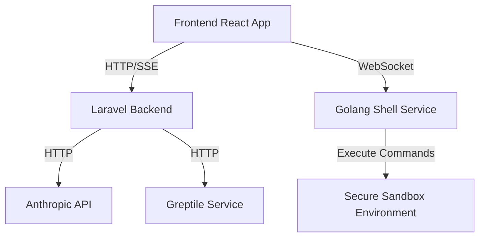

# OpenAgents System Specification

## Table of Contents

1. [Introduction](#introduction)
2. [System Architecture](#system-architecture)
3. [Backend Services](#backend-services)
   - [Laravel Application](#laravel-application)
   - [Golang Shell Service](#golang-shell-service)
   - [Anthropic API Integration](#anthropic-api-integration)
   - [Greptile Integration](#greptile-integration)
4. [Frontend Application](#frontend-application)
5. [Communication Protocols](#communication-protocols)
6. [Security Considerations](#security-considerations)
7. [Scalability and Performance](#scalability-and-performance)
8. [Error Handling and Logging](#error-handling-and-logging)
9. [Testing Strategy](#testing-strategy)
10. [Deployment and DevOps](#deployment-and-devops)
11. [Future Enhancements](#future-enhancements)

## 1. Introduction

The OpenAgents system is designed to provide an interactive coding assistant powered by AI. It integrates with the Anthropic API for natural language processing and code generation, uses Greptile for codebase searching, and provides a secure shell environment for code execution. This document outlines the architecture, components, and best practices for implementing this system.

## 2. System Architecture

The system consists of the following main components:

1. Frontend React Application
2. Laravel Backend Application
3. Golang Shell Service
4. Anthropic API
5. Greptile Service

The architecture follows a microservices approach, with each component having a specific responsibility and communicating via well-defined APIs.



## 3. Backend Services

### 3.1. Laravel Application

The Laravel application serves as the main backend, handling user authentication, managing the conversation state, and coordinating between different services.

Key responsibilities:

- User authentication and authorization
- Conversation management
- Interfacing with Anthropic API
- Coordinating with Greptile for code searches
- Sending server-sent events (SSE) to the frontend

#### API Endpoints:

- `POST /api/conversation/start`: Start a new conversation
- `POST /api/conversation/message`: Send a message in the conversation
- `GET /api/sse-stream`: Establish SSE connection for real-time updates

#### Conversation Flow:

1. User sends a message
2. Laravel backend processes the message
3. If needed, it queries Greptile for relevant code snippets
4. The message and any relevant context are sent to Anthropic API
5. Anthropic's response is processed
6. If the response includes a shell command:
   a. Laravel sends the command to the Golang Shell Service
   b. Receives the result and includes it in the response
7. The response is streamed back to the frontend via SSE

### 3.2. Golang Shell Service

The Golang Shell Service is responsible for executing shell commands in a secure, sandboxed environment.

Key features:

- Secure command execution
- Sandboxed environment to prevent system access
- WebSocket server for real-time communication
- Command whitelisting and input sanitization

#### WebSocket API:

- Incoming message format:
  ```json
  {
    "type": "shell_command",
    "content": "command_to_execute"
  }
  ```
- Outgoing message format:
  ```json
  {
    "type": "shell_command_result",
    "content": "command_output"
  }
  ```

#### Security Measures:

- Use a restricted set of allowed commands
- Run commands in a containerized environment (e.g., using Docker)
- Implement rate limiting to prevent abuse
- Validate and sanitize all input

### 3.3. Anthropic API Integration

The Anthropic API is used for natural language processing and code generation.

Integration points:

- Send user messages and context to Anthropic
- Process Anthropic's responses
- Handle streaming responses for real-time feedback

### 3.4. Greptile Integration

Greptile is used for searching codebases and providing relevant code snippets.

Integration points:

- Send search queries to Greptile
- Process and format Greptile results
- Include Greptile results in the context sent to Anthropic

## 4. Frontend Application

The frontend is a React application that provides the user interface for interacting with the AI assistant and viewing code execution results.

Key components:

- Chat interface for user-AI interaction
- Code editor for displaying and editing code snippets
- Terminal component for displaying shell command results

### Chat Component:

- Displays conversation history
- Allows users to input messages
- Shows real-time updates from the AI

### Code Editor Component:

- Syntax highlighting for multiple languages
- Line numbering
- Copy-to-clipboard functionality

### Terminal Component:

- Displays results of shell commands
- Mimics a real terminal interface
- Read-only (no user input)

## 5. Communication Protocols

### HTTP:

Used for RESTful API calls between the frontend and Laravel backend, and for Laravel's communication with external services (Anthropic, Greptile).

### Server-Sent Events (SSE):

Used for real-time, one-way communication from the Laravel backend to the frontend. This is used to stream AI responses and update the conversation in real-time.

### WebSocket:

Used for bi-directional, real-time communication between the frontend and the Golang Shell Service. This allows for sending shell commands and receiving results instantly.

## 6. Security Considerations

- Implement proper authentication and authorization for all API endpoints
- Use HTTPS for all communications
- Implement rate limiting on all endpoints to prevent abuse
- Sanitize and validate all user inputs
- Use secure WebSocket connections (WSS)
- Implement proper error handling to avoid information leakage
- Regularly update all dependencies and apply security patches
- Use environment variables for sensitive configuration (API keys, database credentials)
- Implement audit logging for all sensitive operations

## 7. Scalability and Performance

- Use caching mechanisms in Laravel to reduce database load
- Implement database indexing for frequently accessed data
- Use a load balancer for distributing traffic across multiple server instances
- Implement horizontal scaling for the Golang Shell Service
- Use a message queue system (e.g., Redis) for handling background tasks
- Optimize database queries and use eager loading where appropriate
- Implement proper database connection pooling

## 8. Error Handling and Logging

- Implement comprehensive error handling throughout the application
- Use structured logging for easier parsing and analysis
- Set up centralized log management (e.g., ELK stack)
- Implement application performance monitoring (APM)
- Set up alerts for critical errors and performance issues

## 9. Testing Strategy

- Implement unit tests for all backend services
- Create integration tests for API endpoints
- Develop end-to-end tests for critical user flows
- Implement frontend unit tests using Jest and React Testing Library
- Perform regular security audits and penetration testing

## 10. Deployment and DevOps

- Use containerization (Docker) for consistent environments
- Implement CI/CD pipelines for automated testing and deployment
- Use infrastructure-as-code for managing server configurations
- Implement blue-green deployment strategy for zero-downtime updates
- Set up automated backups for databases and critical data

## 11. Future Enhancements

- Implement user authentication and personalized experiences
- Add support for multiple AI models and allow users to choose
- Implement a plugin system for extending functionality
- Add support for collaborative coding sessions
- Implement an offline mode with a locally running AI model

This specification provides a comprehensive overview of the OpenAgents system, focusing on security, scalability, and proper separation of concerns. By following these guidelines, you can create a robust and secure system for AI-assisted coding and shell command execution.
