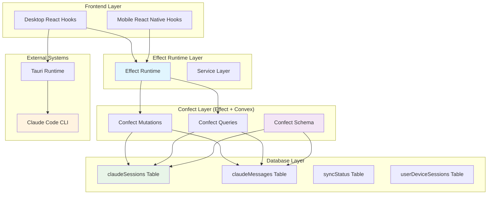

# Claude Code Sessions in Effect-TS: Complete System Architecture

## Overview

This document provides a comprehensive analysis of how Claude Code sessions are represented and managed using Effect-TS patterns in the OpenAgents project. The system represents a sophisticated multi-layer architecture that combines Effect-TS functional programming patterns with Convex real-time database capabilities through the Confect framework.

Claude Code sessions in this system are **not implemented as a dedicated Effect-TS service layer**, but rather as **database entities with Effect-based operations** that provide type-safe, composable, and error-safe session management across desktop and mobile platforms.

## Table of Contents

1. [Architecture Overview](#architecture-overview)
2. [Core Data Model](#core-data-model)
3. [Effect-TS Integration Patterns](#effect-ts-integration-patterns)
4. [Session Lifecycle Management](#session-lifecycle-management)
5. [Cross-Platform Considerations](#cross-platform-considerations)
6. [Error Handling & Type Safety](#error-handling--type-safety)
7. [Performance & Scalability](#performance--scalability)
8. [Integration with React](#integration-with-react)
9. [Testing Patterns](#testing-patterns)
10. [Future Enhancements](#future-enhancements)

## Architecture Overview

### System Architecture Diagram



### Architectural Principles

1. **Effect-First Design**: All database operations use `Effect.gen` patterns for composable, type-safe operations
2. **Schema-Driven Development**: Effect Schema definitions provide compile-time type safety and runtime validation
3. **Functional Error Handling**: Tagged errors (`MobileSyncError`, `SessionValidationError`) replace traditional exception handling
4. **Option Types**: `Option` types eliminate null/undefined errors throughout the session lifecycle
5. **Immutable State**: All session updates are immutable transformations through Effect operations

## Core Data Model

### Primary Session Schema

The `claudeSessions` table represents the core session entity:

```typescript
// Schema Definition (packages/convex/confect/schema.ts)
claudeSessions: defineTable(
  Schema.Struct({
    sessionId: Schema.String.pipe(Schema.nonEmptyString()),
    projectPath: Schema.String.pipe(Schema.nonEmptyString()),
    title: Schema.optional(Schema.String),
    status: Schema.Literal("active", "inactive", "error", "processed"),
    createdBy: Schema.Literal("desktop", "mobile"),
    lastActivity: Schema.Number,
    userId: Schema.optional(Id.Id("users")),
    metadata: Schema.optional(
      Schema.Struct({
        workingDirectory: Schema.optional(Schema.String),
        model: Schema.optional(Schema.String),
        systemPrompt: Schema.optional(Schema.String),
        originalMobileSessionId: Schema.optional(Schema.String),
      })
    ),
  })
).index("by_session_id", ["sessionId"])
 .index("by_status", ["status"])
 .index("by_last_activity", ["lastActivity"])
 .index("by_user_id", ["userId"])
```

### Session Message Schema

Messages within sessions are stored in the `claudeMessages` table:

```typescript
claudeMessages: defineTable(
  Schema.Struct({
    sessionId: Schema.String.pipe(Schema.nonEmptyString()),
    messageId: Schema.String.pipe(Schema.nonEmptyString()),
    messageType: Schema.Literal("user", "assistant", "tool_use", "tool_result", "thinking"),
    content: Schema.String,
    timestamp: Schema.String, // ISO timestamp
    userId: Schema.optional(Id.Id("users")),
    toolInfo: Schema.optional(
      Schema.Struct({
        toolName: Schema.String,
        toolUseId: Schema.String,
        input: Schema.Any,
        output: Schema.optional(Schema.String),
      })
    ),
    metadata: Schema.optional(Schema.Any),
  })
).index("by_session_id", ["sessionId"])
 .index("by_timestamp", ["timestamp"])
 .index("by_user_id", ["userId"])
```

### Session Status Tracking

The `syncStatus` table tracks synchronization state across platforms:

```typescript
syncStatus: defineTable(
  Schema.Struct({
    sessionId: Schema.String.pipe(Schema.nonEmptyString()),
    lastSyncedMessageId: Schema.optional(Schema.String),
    desktopLastSeen: Schema.optional(Schema.Number),
    mobileLastSeen: Schema.optional(Schema.Number),
    syncErrors: Schema.optional(Schema.Array(Schema.String)),
  })
).index("by_session_id", ["sessionId"])
```

## Effect-TS Integration Patterns

### Effect Generators for Database Operations

All session operations use `Effect.gen` patterns for composable, type-safe database access:

```typescript
// Session Creation (packages/convex/confect/mobile_sync.ts)
export const createClaudeSession = mutation({
  args: CreateClaudeSessionArgs,
  returns: CreateClaudeSessionResult,
  handler: ({ sessionId, projectPath, createdBy, title, metadata }) =>
    Effect.gen(function* () {
      const { db, auth } = yield* ConfectMutationCtx;

      // Get authenticated user with Option handling
      const identity = yield* auth.getUserIdentity();
      let userId: any = undefined;
      
      if (Option.isSome(identity)) {
        const authSubject = identity.value.subject;
        const user = yield* db
          .query("users")
          .withIndex("by_openauth_subject", (q) => q.eq("openAuthSubject", authSubject))
          .first();
          
        if (Option.isSome(user)) {
          userId = user.value._id;
        }
      }

      // Check if session exists using Option pattern
      const existingSession = yield* db
        .query("claudeSessions")
        .withIndex("by_session_id", (q) => q.eq("sessionId", sessionId))
        .first();

      return yield* Option.match(existingSession, {
        onSome: (session) =>
          // Update existing session
          db.patch(session._id, {
            title,
            status: "active" as const,
            lastActivity: Date.now(),
            metadata,
            ...(userId ? { userId } : {}),
          }).pipe(Effect.as(session._id)),
        
        onNone: () =>
          Effect.gen(function* () {
            // Create new session
            const sessionDoc = yield* db.insert("claudeSessions", {
              sessionId,
              projectPath,
              title: title || `${createdBy} Session - ${new Date().toLocaleString()}`,
              status: "active" as const,
              createdBy,
              lastActivity: Date.now(),
              ...(userId ? { userId } : {}),
              metadata,
            });

            // Initialize sync status
            yield* db.insert("syncStatus", {
              sessionId,
            });

            return sessionDoc;
          })
      });
    }),
});
```

### Option Types for Null Safety

The system extensively uses `Option` types to eliminate null/undefined errors:

```typescript
// Message Addition with Option Handling
export const addClaudeMessage = mutation({
  args: AddClaudeMessageArgs,
  returns: AddClaudeMessageResult,
  handler: ({ sessionId, messageId, messageType, content, timestamp, toolInfo, metadata }) =>
    Effect.gen(function* () {
      const { db } = yield* ConfectMutationCtx;
      const user = yield* getAuthenticatedUserEffectMutation;

      // Check for existing message using Option pattern
      const existingMessage = yield* db
        .query("claudeMessages")
        .withIndex("by_session_id", (q) => q.eq("sessionId", sessionId))
        .filter((q) => q.eq(q.field("messageId"), messageId))
        .first();

      return yield* Option.match(existingMessage, {
        onSome: (msg) => 
          Effect.gen(function* () {
            yield* Effect.logInfo(`⚠️ [CONFECT] Message ${messageId} already exists, skipping`);
            return msg._id;
          }),
        onNone: () =>
          Effect.gen(function* () {
            const messageDoc = yield* db.insert("claudeMessages", {
              sessionId,
              messageId,
              messageType,
              content,
              timestamp,
              toolInfo,
              metadata,
            });

            yield* Effect.logInfo(`✅ [CONFECT] Successfully added message ${messageId} to session ${sessionId}`);
            return messageDoc;
          })
      });
    }),
});
```

### Authentication Context Integration

The system integrates authentication through Effect context patterns:

```typescript
// Authentication Helper with Effect Patterns
const getAuthenticatedUserEffectMutation = Effect.gen(function* () {
  const { db, auth } = yield* ConfectMutationCtx;
  
  const identity = yield* auth.getUserIdentity();
  if (Option.isNone(identity)) {
    return yield* Effect.fail(new Error("Not authenticated"));
  }

  // Look up user by OpenAuth subject first
  const authSubject = identity.value.subject;
  const user = yield* db
    .query("users")
    .withIndex("by_openauth_subject", (q) => q.eq("openAuthSubject", authSubject))
    .first();

  return yield* Option.match(user, {
    onSome: (u) => Effect.succeed(u),
    onNone: () =>
      // Fallback: try looking up by GitHub ID (for backwards compatibility)
      Effect.gen(function* () {
        const fallbackUser = yield* db
          .query("users")
          .withIndex("by_github_id", (q) => q.eq("githubId", authSubject))
          .first();
        
        return yield* Option.match(fallbackUser, {
          onSome: (u) => Effect.succeed(u),
          onNone: () => Effect.fail(new Error("User not found"))
        });
      })
  });
});
```

## Session Lifecycle Management

### Session Creation Flow

1. **Schema Validation**: Input parameters validated through Effect Schema
2. **Authentication Check**: User identity resolved through Effect context
3. **Duplicate Detection**: Existing sessions checked using Option patterns
4. **Database Transaction**: Session created with sync status initialization
5. **Activity Tracking**: Last activity timestamp and metadata recorded

```typescript
// Session Status Update with Effect Logging
export const updateSessionStatus = mutation({
  args: UpdateSessionStatusArgs,
  returns: UpdateSessionStatusResult,
  handler: ({ sessionId, status }) =>
    Effect.gen(function* () {
      const { db } = yield* ConfectMutationCtx;

      const session = yield* db
        .query("claudeSessions")
        .withIndex("by_session_id", (q) => q.eq("sessionId", sessionId))
        .first();

      yield* Option.match(session, {
        onSome: (s) =>
          db.patch(s._id, {
            status,
            lastActivity: Date.now(),
          }),
        onNone: () => Effect.void,
      });

      return null;
    }),
});
```

### Message Processing Pipeline

Messages flow through a multi-stage pipeline with Effect transformations:

1. **Deduplication**: Check for existing messages using Option patterns
2. **Validation**: Message type and content validation through Schema
3. **Persistence**: Atomic database insertion with metadata
4. **Sync Update**: Session activity and sync status updates
5. **Side Effects**: Logging and notification through Effect operations

### Session Query Patterns

```typescript
// Pending Mobile Sessions Query
export const getPendingMobileSessions = query({
  args: GetPendingMobileSessionsArgs,
  returns: GetPendingMobileSessionsResult,
  handler: () =>
    Effect.gen(function* () {
      const { db } = yield* ConfectQueryCtx;

      const results = yield* db
        .query("claudeSessions")
        .withIndex("by_status", (q) => q.eq("status", "active"))
        .filter((q) => q.eq(q.field("createdBy"), "mobile"))
        .order("desc")
        .take(10);

      yield* Effect.logInfo(`🔍 [CONFECT] getPendingMobileSessions query returned: ${results.length} sessions`);
      
      if (results.length > 0) {
        yield* Effect.logInfo("📋 [CONFECT] Mobile sessions:", results.map(s => ({
          sessionId: s.sessionId,
          status: s.status,
          createdBy: s.createdBy,
          metadata: s.metadata
        })));
      }

      return results;
    }),
});
```

## Cross-Platform Considerations

### Mobile-Desktop Session Synchronization

The system handles two distinct session ID formats for cross-platform compatibility:

1. **Mobile Session IDs**: `mobile-${timestamp}-${random}` format for Convex persistence
2. **Claude Code UUIDs**: Standard UUID format required by Claude Code CLI
3. **Session Mapping**: Desktop maintains mapping between UUIDs and mobile session IDs

```typescript
// Mobile Session Request (created from mobile)
export const requestDesktopSession = mutation({
  args: RequestDesktopSessionArgs,
  returns: RequestDesktopSessionResult,
  handler: ({ projectPath, initialMessage, title }) =>
    Effect.gen(function* () {
      const { db } = yield* ConfectMutationCtx;
      const user = yield* getAuthenticatedUserEffectMutation;

      const sessionId = `mobile-${Date.now()}-${Math.random().toString(36).substring(2)}`;

      yield* Effect.logInfo(`📱 [CONFECT] requestDesktopSession creating session:`, {
        sessionId,
        projectPath,
        title,
      });

      // Create session
      yield* db.insert("claudeSessions", {
        sessionId,
        projectPath,
        title: title ?? `Mobile Session - ${new Date().toLocaleString()}`,
        status: "active" as const,
        createdBy: "mobile" as const,
        lastActivity: Date.now(),
        userId: user._id,
      });

      // Initialize sync status
      yield* db.insert("syncStatus", {
        sessionId,
      });

      // Add initial message if provided
      if (initialMessage) {
        yield* Effect.logInfo(`📱 [CONFECT] Adding initial message to session ${sessionId}`);
        const messageId = `user-${Date.now()}`;
        
        yield* db.insert("claudeMessages", {
          sessionId,
          messageId,
          messageType: "user" as const,
          content: initialMessage,
          timestamp: new Date().toISOString(),
        });

        yield* Effect.logInfo(`✅ [CONFECT] Initial message created with ID: ${messageId}`);
      }

      return sessionId;
    }),
});
```

### Device Session Tracking

The system tracks sessions across multiple device types using the `userDeviceSessions` table with Effect Schema:

```typescript
userDeviceSessions: defineTable(
  Schema.Struct({
    userId: Id.Id("users"),
    deviceId: Schema.String.pipe(Schema.nonEmptyString()),
    deviceType: Schema.Literal("desktop", "mobile", "github"),
    sessionPeriods: Schema.Array(
      Schema.Struct({
        start: Schema.Number,
        end: Schema.optional(Schema.Number),
      })
    ),
    actionsCount: Schema.Struct({
      messages: Schema.Number,
      toolUses: Schema.Number,
      githubEvents: Schema.optional(Schema.Number),
    }),
    lastActivity: Schema.Number,
    metadata: Schema.optional(
      Schema.Struct({
        platform: Schema.optional(Schema.String),
        version: Schema.optional(Schema.String),
        location: Schema.optional(Schema.String),
      })
    ),
  })
)
```

## Error Handling & Type Safety

### Tagged Error System

The session system uses a comprehensive tagged error system built on Effect-TS:

```typescript
// Custom Error Types (packages/shared/src/services/MobileSyncService.ts)
export class MobileSyncError extends Schema.TaggedError<MobileSyncError>()(
  "MobileSyncError",
  { message: Schema.String }
) {}

export class SessionValidationError extends Schema.TaggedError<SessionValidationError>()(
  "SessionValidationError", 
  { reason: Schema.String, sessionId: Schema.String }
) {}

export class ProcessingTimeoutError extends Schema.TaggedError<ProcessingTimeoutError>()(
  "ProcessingTimeoutError",
  { timeoutMs: Schema.Number, operation: Schema.String }
) {}
```

### Effect Error Handling Patterns

```typescript
// Hook with Comprehensive Error Handling
export function useConfectMobileSync(
  confectApi: any,
  options: UseConfectMobileSyncOptions = {}
): UseConfectMobileSyncReturn {
  const processMobileSession = useCallback(async (session: MobileSession) => {
    const program = Effect.gen(function* () {
      const syncService = yield* MobileSyncService;
      
      console.log(`🔄 [CONFECT-SYNC] Processing mobile session: ${session.sessionId}`);
      
      // Process the session using Effect patterns
      const result = yield* syncService.processMobileSession(session);
      
      // Update status to processed
      yield* syncService.updateSessionStatus(session.sessionId, "processed");
      
      return result;
    });

    try {
      const exit = await Runtime.runPromiseExit(runtimeRef.current)(program);
      
      if (Exit.isFailure(exit)) {
        const cause = exit.cause;
        let errorMessage = "Unknown error";
        
        // Handle specific error types
        if (cause._tag === "Fail") {
          const error = cause.error;
          if (error instanceof MobileSyncError) {
            errorMessage = `Mobile sync failed: ${error.message}`;
          } else if (error instanceof SessionValidationError) {
            errorMessage = `Session validation failed: ${error.reason}`;
          } else if (error instanceof ProcessingTimeoutError) {
            errorMessage = `Processing timeout after ${error.timeoutMs}ms`;
          }
        }
        
        console.error(`❌ [CONFECT-SYNC] Failed to process session ${session.sessionId}:`, errorMessage);
        setError(errorMessage);
      }
    } catch (error) {
      console.error(`❌ [CONFECT-SYNC] Unexpected error processing session:`, error);
      setError(String(error));
    }
  }, [enabled]);
}
```

### Schema Validation

All session operations include compile-time and runtime type safety through Effect Schema:

```typescript
// Schema Definitions (packages/convex/confect/mobile_sync_schemas.ts)
export const CreateClaudeSessionArgs = Schema.Struct({
  sessionId: Schema.String,
  projectPath: Schema.String,
  createdBy: Schema.Literal("desktop", "mobile"),
  title: Schema.optional(Schema.String),
  metadata: Schema.optional(
    Schema.Struct({
      workingDirectory: Schema.optional(Schema.String),
      model: Schema.optional(Schema.String),
      systemPrompt: Schema.optional(Schema.String),
      originalMobileSessionId: Schema.optional(Schema.String),
    })
  ),
});

export const AddClaudeMessageArgs = Schema.Struct({
  sessionId: Schema.String,
  messageId: Schema.String,
  messageType: Schema.Literal("user", "assistant", "tool_use", "tool_result", "thinking"),
  content: Schema.String,
  timestamp: Schema.String,
  toolInfo: Schema.optional(
    Schema.Struct({
      toolName: Schema.String,
      toolUseId: Schema.String,
      input: Schema.Any,
      output: Schema.optional(Schema.String),
    })
  ),
  metadata: Schema.optional(Schema.Any),
});
```

## Performance & Scalability

### Database Indexing Strategy

Strategic indexes optimize session queries across different access patterns:

```typescript
claudeSessions: defineTable(/* schema */)
  .index("by_session_id", ["sessionId"])      // Primary lookup
  .index("by_status", ["status"])             // Status filtering
  .index("by_last_activity", ["lastActivity"]) // Temporal queries
  .index("by_user_id", ["userId"])            // User-specific queries

claudeMessages: defineTable(/* schema */)
  .index("by_session_id", ["sessionId"])      // Session message queries
  .index("by_timestamp", ["timestamp"])       // Temporal ordering
  .index("by_user_id", ["userId"])            // User-specific messages
```

### Query Optimization Patterns

```typescript
// Optimized Pending Sessions Query
export const getPendingMobileSessions = query({
  args: GetPendingMobileSessionsArgs,
  returns: GetPendingMobileSessionsResult,
  handler: () =>
    Effect.gen(function* () {
      const { db } = yield* ConfectQueryCtx;

      // Use status index for efficient filtering
      const results = yield* db
        .query("claudeSessions")
        .withIndex("by_status", (q) => q.eq("status", "active"))
        .filter((q) => q.eq(q.field("createdBy"), "mobile"))
        .order("desc")
        .take(10); // Limit results for performance

      return results;
    }),
});
```

### Batch Operations

```typescript
// Batch Message Addition
export const batchAddMessages = mutation({
  args: BatchAddMessagesArgs,
  returns: BatchAddMessagesResult,
  handler: ({ sessionId, messages }) =>
    Effect.gen(function* () {
      const { db } = yield* ConfectMutationCtx;
      const user = yield* getAuthenticatedUserEffectMutation;

      const insertedIds: any[] = [];

      // Process messages in sequence with deduplication
      for (const message of messages) {
        const existingMessage = yield* db
          .query("claudeMessages")
          .withIndex("by_session_id", (q) => q.eq("sessionId", sessionId))
          .filter((q) => q.eq(q.field("messageId"), message.messageId))
          .first();

        if (Option.isNone(existingMessage)) {
          const messageDoc = yield* db.insert("claudeMessages", {
            sessionId,
            messageId: message.messageId,
            messageType: message.messageType,
            content: message.content,
            timestamp: message.timestamp,
            toolInfo: message.toolInfo,
            metadata: message.metadata,
          });

          insertedIds.push(messageDoc);
        }
      }

      // Single activity update for batch
      const session = yield* db
        .query("claudeSessions")
        .withIndex("by_session_id", (q) => q.eq("sessionId", sessionId))
        .first();

      yield* Option.match(session, {
        onSome: (s) => db.patch(s._id, { lastActivity: Date.now() }),
        onNone: () => Effect.void,
      });

      return insertedIds;
    }),
});
```

## Integration with React

### Hook Architecture

React components integrate with Effect-TS sessions through specialized hooks:

```typescript
// Desktop Session Manager Hook (apps/desktop/src/hooks/useSessionManager.ts)
export const useSessionManager = () => {
  const [sessions, setSessions] = useState<Session[]>([]);
  const { openChatPane, updateSessionMessages } = usePaneStore();
  
  // Convex mutations using Effect-based operations
  const createClaudeSession = useMutation(api.confect.mobile_sync.createClaudeSession);
  const updateSessionStatus = useMutation(api.confect.mobile_sync.updateSessionStatus);

  const createSession = useCallback(async () => {
    try {
      // Tauri command to create Claude Code session
      const result = await invoke<CommandResult<string>>("create_session", {
        projectPath: newProjectPath,
      });

      if (result.success && result.data) {
        const sessionId = result.data;
        
        // Create the Confect session document so mobile can see it
        await createClaudeSession({
          sessionId,
          projectPath: newProjectPath,
          createdBy: "desktop" as const,
          title: `Desktop Session - ${newProjectPath}`,
        });

        // Session creation continues...
      }
    } catch (error) {
      console.error("Failed to create session:", error);
    }
  }, [newProjectPath, createClaudeSession]);
};
```

### Runtime Integration

Effect runtime is integrated at the application level:

```typescript
// Effect Runtime Context Integration
const useEffectService = () => {
  const runtime = useContext(EffectRuntimeContext);
  
  const runEffect = useCallback(async <A, E>(effect: Effect.Effect<A, E>) => {
    const exit = await Runtime.runPromiseExit(runtime)(effect);
    
    if (Exit.isFailure(exit)) {
      // Handle specific errors
      throw new Error(`Effect execution failed: ${Exit.causeSquash(exit.cause)}`);
    }
    
    return exit.value;
  }, [runtime]);
  
  return { runEffect };
};
```

## Testing Patterns

### Service Testing Infrastructure

Effect-TS sessions are tested using comprehensive service testing patterns:

```typescript
// Session Service Test Suite
describe("MobileSyncService", () => {
  const TestRuntime = Runtime.defaultRuntime.pipe(
    Runtime.provide(MobileSyncServiceLive.Default)
  );

  it("should process mobile session successfully", async () => {
    const mockSession: MobileSession = {
      sessionId: "mobile-123-abc",
      projectPath: "/test/project",
      status: "active",
      createdBy: "mobile",
      lastActivity: Date.now(),
    };

    const program = Effect.gen(function* () {
      const syncService = yield* MobileSyncService;
      return yield* syncService.processMobileSession(mockSession);
    });

    const result = await Runtime.runPromise(TestRuntime)(program);
    
    expect(result.success).toBe(true);
    expect(result.sessionId).toBe("mobile-123-abc");
  });

  it("should handle session validation errors", async () => {
    const invalidSession: MobileSession = {
      sessionId: "", // Invalid empty session ID
      projectPath: "/test/project",
      status: "active",
      createdBy: "mobile",
      lastActivity: Date.now(),
    };

    const program = Effect.gen(function* () {
      const syncService = yield* MobileSyncService;
      return yield* syncService.processMobileSession(invalidSession);
    });

    const exit = await Runtime.runPromiseExit(TestRuntime)(program);
    
    expect(Exit.isFailure(exit)).toBe(true);
    if (Exit.isFailure(exit)) {
      const cause = exit.cause;
      expect(cause._tag).toBe("Fail");
      if (cause._tag === "Fail") {
        expect(cause.error).toBeInstanceOf(SessionValidationError);
      }
    }
  });
});
```

### Integration Testing

```typescript
// Full Session Lifecycle Test
describe("Session Lifecycle Integration", () => {
  it("should handle complete mobile-to-desktop session flow", async () => {
    // 1. Create mobile session
    const mobileSessionId = await runEffect(
      createClaudeSession({
        sessionId: "mobile-test-123",
        projectPath: "/test/project",
        createdBy: "mobile",
        title: "Test Mobile Session",
      })
    );

    // 2. Add initial message
    await runEffect(
      addClaudeMessage({
        sessionId: "mobile-test-123",
        messageId: "user-msg-1",
        messageType: "user",
        content: "Hello Claude",
        timestamp: new Date().toISOString(),
      })
    );

    // 3. Query pending sessions
    const pendingSessions = await runEffect(
      getPendingMobileSessions({})
    );

    expect(pendingSessions).toHaveLength(1);
    expect(pendingSessions[0].sessionId).toBe("mobile-test-123");

    // 4. Process session
    const syncService = await runEffect(MobileSyncService);
    const result = await runEffect(
      syncService.processMobileSession(pendingSessions[0])
    );

    expect(result.success).toBe(true);

    // 5. Verify session status update
    const updatedSession = await runEffect(
      getSession({ sessionId: "mobile-test-123" })
    );

    expect(updatedSession?.status).toBe("processed");
  });
});
```

## Future Enhancements

### Agent Orchestration Integration

The session system is designed to integrate with Effect-TS actor model patterns for agent orchestration:

```typescript
// Future: Agent Orchestration Layer
export class AgentOrchestratorService extends Effect.Service<AgentOrchestratorService>()(
  'AgentOrchestratorService',
  {
    sync: () => ({
      orchestrateSession: (sessionId: string) =>
        Effect.gen(function* () {
          // Load session context
          const session = yield* getSession({ sessionId });
          
          // Create agent actor
          const agent = yield* AgentActor.make({
            sessionId,
            context: session?.metadata,
          });
          
          // Begin orchestration
          return yield* agent.start();
        }),
    }),
    dependencies: [MobileSyncService]
  }
) {}
```

### Streaming Integration

Future enhancements will integrate Effect Streams for real-time session updates:

```typescript
// Future: Session Event Streaming
export const sessionEventStream = (sessionId: string) =>
  Stream.fromQueue(sessionEventQueue).pipe(
    Stream.filter(event => event.sessionId === sessionId),
    Stream.map(event => ({
      type: event.type,
      sessionId: event.sessionId,
      timestamp: Date.now(),
      data: event.data,
    })),
    Stream.tap(event => Effect.logInfo(`Session event: ${event.type}`))
  );
```

### Enhanced Error Recovery

```typescript
// Future: Automatic Session Recovery
export const recoverFailedSession = (sessionId: string) =>
  Effect.gen(function* () {
    const session = yield* getSession({ sessionId });
    
    if (Option.isNone(session)) {
      return yield* Effect.fail(new SessionValidationError("Session not found"));
    }
    
    // Implement recovery logic with retry policies
    return yield* Effect.retry(
      syncSessionFromHook({ 
        hookData: { 
          sessionId, 
          event: "recovery",
          projectPath: session.value.projectPath 
        } 
      }),
      Schedule.exponential("1 second").pipe(
        Schedule.compose(Schedule.recurs(3))
      )
    );
  });
```

## Conclusion

The Claude Code session representation in Effect-TS demonstrates a sophisticated functional programming approach to session management. Rather than implementing sessions as a dedicated service layer, the system leverages:

1. **Database-centric design** with Effect-enhanced operations
2. **Comprehensive type safety** through Schema validation
3. **Functional error handling** with tagged errors and Option types
4. **Cross-platform synchronization** with mobile-desktop session mapping
5. **Performance optimization** through strategic indexing and batch operations

This architecture provides a robust, scalable, and maintainable foundation for Claude Code session management across desktop and mobile platforms, with clear patterns for future enhancements including agent orchestration and real-time streaming capabilities.

The system successfully eliminates common source of bugs (null/undefined errors, unhandled exceptions) while providing excellent developer experience through comprehensive type safety and composable operations. The integration with React through specialized hooks maintains separation of concerns while enabling real-time updates and error handling at the UI layer.