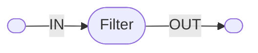
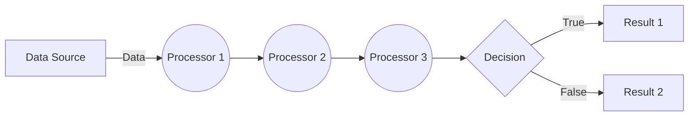

Excerpts and paraphrases from Flow-Based Programming, 2nd Edition by J. Paul Morrison

```mermaid
graph LR
    A([ ]) -->|IN| B([Filter])
    B -->|OUT| C([ ])
```

```mermaid
graph LR
    A[Data Source] -->|Data| B((Processor 1))
    B --> C((Processor 2))
    C --> D((Processor 3))
    D --> E{Decision}
    E -->|True| F[Result 1]
    E -->|False| G[Result 2]
```