# Mobile-Desktop Claude Code Session Synchronization System

## Overview

This document describes the comprehensive session synchronization system that enables seamless Claude Code integration between mobile and desktop applications. The system allows users to initiate Claude Code sessions from mobile devices and have them processed by the desktop application, with full bidirectional message synchronization.

## System Architecture

### High-Level Architecture


### Core Components

1. **Mobile App**: React Native interface for session creation
2. **Convex Database**: Real-time backend for session and message persistence
3. **Desktop App**: Tauri application that interfaces with Claude Code CLI
4. **Claude Code CLI**: External process for AI interactions

## Session Lifecycle

### 1. Mobile Session Creation

```mermaid
sequenceDiagram
    participant User as Mobile User
    participant Mobile as Mobile App
    participant Convex as Convex DB
    participant Desktop as Desktop App
    participant Claude as Claude Code

    User->>Mobile: Create new session
    Mobile->>Convex: requestDesktopSession()
    Convex->>Convex: Create session (mobile-123-abc)
    Convex->>Mobile: Return session ID
    Mobile->>Mobile: Redirect to session view
    
    Desktop->>Convex: Poll getPendingMobileSessions()
    Convex->>Desktop: Return pending sessions
    Desktop->>Claude: create_session(projectPath)
    Claude->>Desktop: Return UUID (uuid-456-def)
    Desktop->>Convex: Update session status to "active"
    Desktop->>Desktop: Store UUID→Mobile ID mapping
```



### 2. Message Flow


## Key Technical Concepts

### Session ID Architecture

The system uses a dual-ID approach to maintain compatibility while enabling unified persistence:

- **Mobile Session ID**: `mobile-${timestamp}-${random}` format
  - Used for Convex database persistence
  - What mobile users see and interact with
  - Remains consistent throughout session lifecycle

- **Claude Code UUID**: Standard UUID format
  - Required by Claude Code CLI for streaming
  - Used for local desktop session management
  - Mapped to mobile session ID for persistence

### Session Mapping System

```typescript
// Desktop maintains mapping between Claude Code UUID and Mobile session ID
const sessionIdMapping = new Map<string, string>();
// Key: Claude Code UUID (uuid-456-def)
// Value: Mobile session ID (mobile-123-abc)

// Messages persist to mobile session ID, not Claude Code UUID
await addClaudeMessage({
  sessionId: sessionIdMapping.get(claudeUUID) || claudeUUID,
  // ... message data
});
```

## Component Breakdown

### Mobile Components

#### `ClaudeCodeMobile.tsx`
- **Purpose**: Main mobile interface for Claude Code sessions
- **Key Functions**:
  - Session creation via `requestDesktopSession()`
  - Message display and input
  - Real-time session list updates
- **State Management**: Local React state with Convex real-time queries

```typescript
// Session creation flow
const handleCreateSession = async () => {
  const sessionId = await requestDesktopSession({
    projectPath: newProjectPath.trim(),
    initialMessage: initialMessage.trim() || undefined,
    title: newSessionTitle.trim() || undefined,
  });
  
  // Redirect to newly created session
  setSelectedSessionId(sessionId);
  setActiveTab("sessions");
};
```

### Desktop Components

#### `useMobileSessionSync.ts`
- **Purpose**: Core hook for processing mobile session requests
- **Key Responsibilities**:
  - Poll for pending mobile sessions
  - Create Claude Code sessions
  - Update session status in Convex
  - Maintain session ID mapping
- **Circuit Breaker**: Prevents infinite processing loops

```typescript
const createSessionFromMobile = async (mobileSession: MobileSession) => {
  // Create Claude Code session
  const result = await invoke("create_session", {
    projectPath: mobileSession.projectPath,
  });
  
  const localSessionId = result.data; // Claude Code UUID
  
  // Update mobile session to active (don't create new session)
  await updateSessionStatus({
    sessionId: mobileSession.sessionId, // Mobile session ID
    status: "active"
  });
  
  // Store mapping for message persistence
  setSessionIdMapping(prev => {
    const newMapping = new Map(prev);
    newMapping.set(localSessionId, mobileSession.sessionId);
    return newMapping;
  });
  
  // Trigger Claude Code response to existing message (no duplication)
  const mobileMessages = await queryMobileSessionMessages(mobileSession.sessionId);
  const lastUserMessage = mobileMessages.find(msg => msg.messageType === 'user');
  
  if (lastUserMessage) {
    // Send to Claude Code UUID, messages persist to mobile session ID
    await invoke("send_message", {
      sessionId: localSessionId,
      message: lastUserMessage.content,
    });
  }
};
```

#### **Duplicate Message Prevention**

**Historical Issue**: The original architecture used a `MobileSessionInitializer` component that would query mobile session messages and replay them to Claude Code. However, this created duplicate user messages:
- Mobile session already contained the initial user message
- MobileSessionInitializer would find this message and "replay" it
- This resulted in two identical user messages with different timestamps

**Current Solution**: Two-part fix for duplicate messages:

1. **Eliminated MobileSessionInitializer component**:
   - Mobile session is created with initial message
   - Desktop directly queries the existing message
   - No separate initialization component needed

2. **Implemented `trigger_claude_response` Rust command**:
   - The original `send_message` command ALWAYS creates a new user message
   - New `trigger_claude_response` command triggers Claude without creating a user message
   - Used when processing mobile sessions to avoid duplicating existing user messages
   - Preserves the existing user message from mobile session

#### `useClaudeStreaming.ts`
- **Purpose**: Handle Claude Code message streaming
- **Key Features**:
  - Real-time message streaming from Claude Code
  - Dual session ID support (streaming vs persistence)
  - Message type filtering and mapping
  - Convex persistence integration

```typescript
interface UseClaudeStreamingOptions {
  sessionId: string; // Claude Code UUID for streaming
  persistToSessionId?: string; // Mobile session ID for persistence
  onMessage?: (message: Message) => void;
  onError?: (error: Error) => void;
}

// Message persistence with ID mapping
const persistMessageToConvex = async (message: Message) => {
  const targetSessionId = persistToSessionId || sessionId;
  
  await addClaudeMessage({
    sessionId: targetSessionId, // Persists to mobile session ID
    messageId: message.id,
    messageType: mapMessageTypeToConvex(message.message_type),
    content: message.content,
    timestamp: message.timestamp,
    // ... additional message data
  });
};
```

#### `SessionStreamManager.tsx`
- **Purpose**: Bridge component between session management and streaming
- **Key Function**: Pass both streaming and persistence session IDs

```typescript
export function SessionStreamManager({ 
  sessionId,           // Claude Code UUID
  persistToSessionId,  // Mobile session ID  
  isInitializing,
  onMessagesUpdate, 
  onError 
}: SessionStreamManagerProps) {
  const { messages, startStreaming, stopStreaming, error } = useClaudeStreaming({
    sessionId,         // Stream from Claude Code UUID
    persistToSessionId, // Persist to mobile session ID
    onMessage: () => {}, 
    onError: (err) => onError(sessionId, err)
  });
  
  // Component handles streaming lifecycle
};
```

### Rust Backend (Tauri)

#### Key Commands

1. **`send_message`**: Original command that ALWAYS creates a new user message
   - Used for normal chat interactions where user is typing a new message
   - Creates user message and triggers Claude response
   
2. **`trigger_claude_response`**: New command that triggers Claude WITHOUT creating a user message
   - Used specifically for mobile session processing
   - Preserves the existing user message from mobile session
   - Prevents duplicate messages

```rust
// lib.rs
#[tauri::command]
async fn trigger_claude_response(
    session_id: String,
    message: String,
    state: State<'_, AppState>,
) -> Result<CommandResult<()>, String> {
    // Triggers Claude without creating a user message
    manager.trigger_response(&session_id, message).await
}

// manager.rs
pub async fn trigger_response(&self, session_id: &str, message: String) -> Result<(), ClaudeError> {
    ClaudeSession::trigger_response_static(session, message).await
}

// ClaudeSession::trigger_response_static
// Similar to send_message_static but WITHOUT this section:
// let user_msg = Message { ... };
// session_lock.add_message(user_msg).await;
```

### Convex Backend

#### Session Management Mutations

```typescript
// Create mobile session
export const requestDesktopSession = mutation({
  handler: async (ctx, args) => {
    const sessionId = `mobile-${Date.now()}-${Math.random().toString(36).substring(2)}`;
    
    await ctx.db.insert("claudeSessions", {
      sessionId,
      projectPath: args.projectPath,
      status: "active",
      createdBy: "mobile",
      lastActivity: Date.now(),
    });
    
    // Add initial message if provided
    if (args.initialMessage) {
      await ctx.db.insert("claudeMessages", {
        sessionId,
        messageId: `user-${Date.now()}`,
        messageType: "user",
        content: args.initialMessage,
        timestamp: new Date().toISOString(),
      });
    }
    
    return sessionId;
  },
});

// Update session status (used instead of creating duplicate session)
export const updateSessionStatus = mutation({
  args: {
    sessionId: v.string(),
    status: v.union(v.literal("active"), v.literal("inactive"), v.literal("error")),
  },
  handler: async (ctx, args) => {
    const session = await ctx.db
      .query("claudeSessions")
      .withIndex("by_session_id")
      .filter(q => q.eq(q.field("sessionId"), args.sessionId))
      .first();
      
    if (session) {
      await ctx.db.patch(session._id, {
        status: args.status,
        lastActivity: Date.now(),
      });
    }
  },
});
```

#### Message Persistence

```typescript
// Add messages with comprehensive type support
export const addClaudeMessage = mutation({
  args: {
    sessionId: v.string(),
    messageId: v.string(),
    messageType: v.union(
      v.literal("user"), 
      v.literal("assistant"), 
      v.literal("tool_use"), 
      v.literal("tool_result"),
      v.literal("thinking") // Claude's reasoning process
    ),
    content: v.string(),
    timestamp: v.string(),
    toolInfo: v.optional(v.object({
      toolName: v.string(),
      toolUseId: v.string(), 
      input: v.any(),
      output: v.optional(v.string()),
    })),
    metadata: v.optional(v.any()),
  },
  handler: async (ctx, args) => {
    // Prevent duplicate messages
    const existingMessage = await ctx.db
      .query("claudeMessages")
      .withIndex("by_session_id")
      .filter(q => q.and(
        q.eq(q.field("sessionId"), args.sessionId),
        q.eq(q.field("messageId"), args.messageId)
      ))
      .first();
      
    if (existingMessage) {
      return existingMessage._id;
    }
    
    // Insert new message
    const messageDoc = await ctx.db.insert("claudeMessages", args);
    
    // Update session activity
    const session = await ctx.db
      .query("claudeSessions")
      .withIndex("by_session_id")
      .filter(q => q.eq(q.field("sessionId"), args.sessionId))
      .first();
      
    if (session) {
      await ctx.db.patch(session._id, {
        lastActivity: Date.now(),
      });
    }
    
    return messageDoc;
  },
});
```

## Database Schema

### `claudeSessions` Table

```typescript
claudeSessions: defineTable({
  sessionId: v.string(),          // Mobile format or UUID
  projectPath: v.string(),        // Project directory path
  title: v.optional(v.string()),  // User-provided title
  status: v.union(                // Session lifecycle status
    v.literal("active"),          // Currently processing
    v.literal("inactive"),        // Paused/stopped
    v.literal("error"),          // Failed state
  ),
  createdBy: v.union(             // Originating platform
    v.literal("desktop"),
    v.literal("mobile")
  ),
  lastActivity: v.number(),       // Timestamp of last update
  metadata: v.optional(v.object({ // Additional session data
    workingDirectory: v.optional(v.string()),
    model: v.optional(v.string()),
    systemPrompt: v.optional(v.string()),
  })),
}).index("by_session_id", ["sessionId"])
  .index("by_status", ["status"])
  .index("by_last_activity", ["lastActivity"])
```

### `claudeMessages` Table

```typescript
claudeMessages: defineTable({
  sessionId: v.string(),         // References claudeSessions
  messageId: v.string(),         // Unique message identifier
  messageType: v.union(          // Message type classification
    v.literal("user"),           // User input
    v.literal("assistant"),      // Claude response
    v.literal("tool_use"),       // Tool invocation
    v.literal("tool_result"),    // Tool execution result
    v.literal("thinking")        // Claude's reasoning process
  ),
  content: v.string(),           // Message text content
  timestamp: v.string(),         // ISO timestamp
  toolInfo: v.optional(v.object({ // Tool-specific metadata
    toolName: v.string(),
    toolUseId: v.string(), 
    input: v.any(),
    output: v.optional(v.string()),
  })),
  metadata: v.optional(v.any()), // Additional message metadata
}).index("by_session_id", ["sessionId"])
  .index("by_timestamp", ["timestamp"])
```

## Message Types and Handling

### Message Type Mapping

The system supports comprehensive message type mapping between Claude Code streaming format and Convex persistence format:

```typescript
const mapMessageTypeToConvex = (streamingType: string) => {
  switch (streamingType) {
    case 'assistant':
      return 'assistant';  // Claude's final responses
    case 'user':
      return 'user';       // User input and requests
    case 'tool_use':
      return 'tool_use';   // Tool invocations with parameters
    case 'tool_result':
      return 'tool_result'; // Tool execution outputs
    case 'thinking':
      return 'thinking';   // Claude's reasoning process
    
    // Filtered out (not persisted)
    case 'system':
    case 'summary':
    case 'error':
      return null;
      
    default:
      console.warn('Unknown message type:', streamingType);
      return null;
  }
};
```

### Message Persistence Flow

1. **Claude Code Streaming**: Messages stream in real-time from Claude Code CLI
2. **Type Filtering**: Only user-facing message types are persisted
3. **ID Mapping**: Messages persist to mobile session ID, not Claude Code UUID
4. **Deduplication**: Existing messages are not re-inserted
5. **Real-time Updates**: Convex pushes updates to mobile app immediately

## Error Handling and Edge Cases

### Circuit Breaker Pattern

```typescript
// Prevent infinite processing loops
const PROCESSING_COOLDOWN = 5000; // 5 seconds
const lastProcessedTimeRef = useRef<Record<string, number>>({});

const createSessionFromMobile = async (mobileSession: MobileSession) => {
  const now = Date.now();
  const lastProcessed = lastProcessedTimeRef.current[sessionId] || 0;
  
  if (now - lastProcessed < PROCESSING_COOLDOWN) {
    console.log(`Skipping ${sessionId} - processed recently`);
    return;
  }
  
  lastProcessedTimeRef.current[sessionId] = now;
  // ... proceed with processing
};
```

### Error States

1. **Claude Code Not Initialized**: Update session status to "error"
2. **Network Failures**: Graceful degradation with retry logic
3. **Duplicate Processing**: Circuit breaker prevents race conditions
4. **Invalid Messages**: Type filtering prevents malformed data persistence

## Performance Considerations

### Optimization Strategies

1. **Debounced Processing**: 200ms debounce on session processing to prevent rapid state changes
2. **Efficient Queries**: Indexed queries on session ID and status for fast lookups  
3. **Message Deduplication**: Prevents redundant database operations
4. **Stream Processing**: Non-blocking message streaming with Effect.js
5. **Circuit Breakers**: Prevents infinite loops and excessive processing

### Monitoring Points

- Session creation rate and duplicate prevention
- Message persistence latency
- Real-time synchronization performance
- Claude Code CLI stability and error rates
- Database query performance and optimization

## Deployment and Configuration

### Environment Variables

```bash
# Convex Configuration
VITE_CONVEX_URL=https://your-convex-deployment.convex.cloud

# Claude Code Integration
CLAUDE_CODE_PATH=/path/to/claude-code-cli
```

### Build Process

```bash
# Desktop Application
cd apps/desktop
bun run build

# Mobile Application  
cd apps/mobile
bun run compile
```

## Future Enhancements

### Planned Improvements

1. **Bidirectional Session Sharing**: Desktop-initiated sessions visible in mobile
2. **Real-time Collaboration**: Multiple users in same session
3. **Session Templates**: Pre-configured session types for common workflows
4. **Enhanced Error Recovery**: Automatic retry and recovery mechanisms
5. **Performance Analytics**: Detailed metrics and monitoring dashboard

### Extensibility Points

1. **Custom Message Types**: Extend message type enum for specialized use cases
2. **Plugin Architecture**: Allow custom session processors
3. **Multiple AI Providers**: Support for providers beyond Claude Code
4. **Advanced Filtering**: User-configurable message filtering rules

## Troubleshooting Guide

### Common Issues

**Issue**: Mobile sessions not appearing in desktop
- **Cause**: Desktop app not initialized or Claude Code not running
- **Solution**: Check `isAppInitialized` state and Claude Code status

**Issue**: Messages not persisting to mobile session
- **Cause**: Session ID mapping not established or incorrect persistence ID
- **Solution**: Verify session mapping in `useMobileSessionSync` hook

**Issue**: Duplicate user messages in mobile sessions
- **Cause**: Rust `send_message` command always creates a new user message
- **Solution**: Use `trigger_claude_response` command which triggers Claude without creating a user message

**Issue**: Duplicate sessions being created
- **Cause**: Race condition in session processing or mapping failure
- **Solution**: Check circuit breaker logic and session deduplication

**Issue**: Claude Code streaming failures
- **Cause**: Claude Code CLI not available or permission issues
- **Solution**: Verify Claude Code installation and file system permissions

### Debug Logging

The system includes comprehensive debug logging with prefixed tags:

```typescript
console.log('🚀 [MOBILE-SYNC] Starting session creation');
console.log('💾 [STREAMING] Persisting message to Convex');
console.log('🔍 [CONVEX] Query returned N sessions');
console.log('⚠️ [CIRCUIT-BREAKER] Skipping duplicate processing');
```

### Health Checks

1. **Session Creation**: Monitor successful mobile session processing rate
2. **Message Flow**: Verify end-to-end message persistence and delivery
3. **Real-time Updates**: Test Convex subscription performance
4. **Error Rates**: Track Claude Code integration stability

## Conclusion

This mobile-desktop Claude Code synchronization system provides a robust, scalable foundation for cross-platform AI interaction. The dual-ID architecture maintains compatibility while enabling unified persistence, and the comprehensive error handling ensures reliable operation in production environments.

The system successfully eliminates duplicate session creation, enables real-time message synchronization, and provides a seamless user experience across mobile and desktop platforms. Future enhancements will build upon this solid architectural foundation to enable even more sophisticated collaboration and AI interaction patterns.