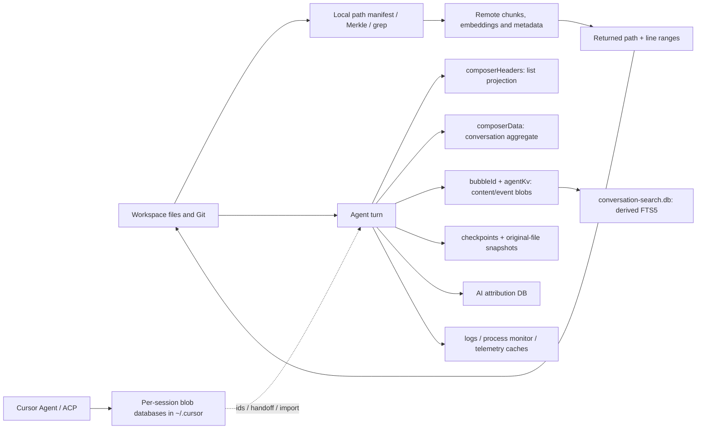

# Cursor Product Teardown — 2026-07-11 (local-storage audit updated 2026-07-18)

Updated analysis of Cursor (Anysphere), revisiting OpenAgents episode 197's
"Reverse Engineering Cursor" study and episode 195's "10x better" thesis
against what Cursor actually became through mid-2026.

- Date: 2026-07-11
- Subject: Cursor 2.x–3.x, the agent-platform pivot, and the ground it left
  behind
- Method: **transcript-grounded retrospective plus archival and public web
  evidence, plus a read-only local bundle survey of the installed Cursor
  3.11.13 on this Mac (added 2026-07-11; §2) and a privacy-safe persistence
  audit of that profile (added 2026-07-18; §2.6).** The bundle pass used
  `plutil`, `codesign`, `spctl`, `file`, `strings`, and bounded `grep` of the
  shipped JS bundles, a names-only look at local state directories, and one
  snapshot of the already-running process table. The persistence pass used
  filesystem metadata, SQLite schemas and aggregate queries, JSON key/type
  inspection, file signatures, and bounded searches of the shipped retrieval
  implementation. It did not reproduce prompts, source text, tokens, account
  identifiers, chat titles, workspace names, or secret values. Its evidence
  classes are:
  - `[source]` — the recovered episode-197-era reverse-engineering corpus,
    pinned in this repository's own Git history (see §1);
  - `[bundle]` — observed in the installed signed application bundle at
    `/Applications/Cursor.app` (3.11.13), surveyed 2026-07-11;
  - `[runtime]` — observed in the live process table, socket snapshot, or
    local filesystem state during those surveys;
  - `[public]` — a named public source (Cursor's own blog/changelog, press,
    or community forum), fetched 2026-07-11 or 2026-07-18 as identified;
  - `[inferred]` — reasoned conclusions from multiple observations;
  - `[limitation]` — a boundary on what this evidence can prove.
- Transcripts [`195`](../transcripts/195.md) and [`197`](../transcripts/197.md)
  are machine-generated; product claims from them are paraphrased intent, not
  quote-grade authority. The reconciliation of 195 against the current roadmap
  already exists in
  [`2026-07-10-episode-195-followup-analysis.md`](../sol/2026-07-10-episode-195-followup-analysis.md)
  and is not re-derived here.

## 1. What we knew then — the recovered era-197 corpus

Episode 197 (recorded 2025-11-13) showed a then-new repo folder of Cursor
reverse-engineering reports. That corpus was located for this teardown in the
openagents repository's own history: **`docs/re/cursor/`**, added 2025-11-13
(the episode day, alongside a `docs/re/DISCLAIMER.md` educational/interop
notice) and deleted 2025-12-01 in a commit titled `Nuke`. It is readable at
pinned commit `ecc0a9054e` (`git show ecc0a9054e:docs/re/cursor/...`) [source].
An older, separate Commander-era "curser/" analysis corpus (December 2024
vintage: fifteen Cursor system specifications, CLI analysis, security review,
tool-capability mapping) survives in `OpenAgentsInc/dashboard` under
`docs/internal/bi/cursor/`, consolidated there 2025-08-15 [source]. The
lineage matters: OpenAgents has now studied Cursor seriously in three distinct
eras.

What the era-197 corpus established, from local inspection of Cursor 2.0.43
on this machine [source]:

- Cursor was a **VS Code fork on Electron** (VS Code base 1.99.3 in logs),
  bundle id `com.todesktop.230313mzl4w4u92`, with its own extension gallery
  at `marketplace.cursorapi.com` and a native `cursor-tunnel` binary of
  VS Code remote-CLI lineage.
- Its runtime delta over stock VS Code was mostly **observability and agent
  plumbing**, not local intelligence: Sentry SDKs plus an unusually broad
  OpenTelemetry instrumentation set, a `cursor-proclist` native process
  addon, `chrome-remote-interface`, and SolidJS panels grafted alongside the
  VS Code webview UI.
- **No local models shipped.** The bundle confirmed the "heavy compute in the
  cloud" architecture; tokenization, file walking, and shadow-workspace
  process machinery prepared context locally, but inference was cloud-only.
- The companion `openagents-cursor-integration-plan.md` (3,301 lines) turned
  episode 195's ten upgrades into a differentiation table — hybrid
  local/swarm/cloud inference, desktop+mobile sync, orchestrator plus
  CLI-agent subagents, open marketplace with revenue sharing, scheduled
  overnight work, SQLite-backed searchable history — and closed with the
  line the episode read on camera: "6 weeks to MVP. 20 weeks to 10x better
  than Cursor."

Episode 195's demand set (paraphrased; see the follow-up analysis for the
full reconstruction) was: a real desktop app over the TUI, mobile parity,
overnight/scheduled work, CLI agents as subagents in one conversation,
discoverable history and memory, hassle-free integrations, open source,
mixed local/cloud inference, idle-compute markets, and revenue sharing.

`[limitation]` The era corpus proves what Cursor 2.0.43 shipped on one
machine in November 2025 and what OpenAgents intended; current Cursor builds
are covered by the §2 bundle survey of 3.11.13 plus public evidence.

## 2. Local bundle survey — Cursor 3.11.13 [bundle]

Cursor 3.11.13 is installed on this machine (built `2026-07-10T01:45:28Z`
per `product.json` `date` — the day before this survey), which makes the
then-vs-now comparison against the era-197 survey of 2.0.43 direct: same
Mac, same evidence conventions, eight months apart.

The 2026-07-18 persistence audit confirmed the installed artifact was still
3.11.13 / commit `3f21b08f0b436a07be29fbfe00b304fa15553350` and pinned the
selected corpus: SHA-256 `ec977a9708ea0cdeee3820b108b5b97416ae4ad55e58a4bb093e7b1ca224e3f7`
for `product.json`,
`1cbca4aa324570b485ddd750d80fc36cd13132a1a1a7b669ee910b5ff346dfea`
for `crepectl`, and
`9a6a2495d10eddff622db06292d34004a583a4fcc08a0e0dcd07ee21bddbbfe0`
for `workbench.glass.main.js` [bundle].

### 2.1 Identity and security posture

| Field                                            | Value                                                                                                          |
| ------------------------------------------------ | -------------------------------------------------------------------------------------------------------------- |
| `CFBundleIdentifier`                             | `com.todesktop.230313mzl4w4u92` (unchanged ToDesktop-era id)                                                   |
| `CFBundleShortVersionString` / `CFBundleVersion` | `3.11.13`                                                                                                      |
| `LSMinimumSystemVersion`                         | `12.0`                                                                                                         |
| URL scheme                                       | `cursor:` (`urlProtocol` in `product.json`)                                                                    |
| Document types                                   | the standard VS Code editor set (C/C++/web/source files, role Editor) — no agent/skill doc types               |
| Signing                                          | `Developer ID Application: Hilary Stout (VDXQ22DGB9)`, hardened runtime (`flags=0x10000(runtime)`), thin arm64 |
| Notarization                                     | `spctl -a`: accepted, `source=Notarized Developer ID`                                                          |
| Entitlements                                     | exactly four: `automation.apple-events`, `cs.allow-jit`, `device.audio-input`, `device.camera`                 |

Notable in the posture: **no `com.apple.security.app-sandbox`** (the host
app is not App-Sandboxed, like ChatGPT/Claude desktop), but also **no
`allow-unsigned-executable-memory`** — a tighter JIT posture than the
ChatGPT app. `Info.plist` sets `NSAppTransportSecurity` →
`NSAllowsArbitraryLoads = true` (ATS disabled), and the declared signing
identity is a personal name rather than "Anysphere, Inc." (the
`package.json` author is `Anysphere, Inc.`).

### 2.2 Runtime identity: still a stock-Electron VS Code fork — but no longer a thin one

- `Contents/Frameworks/` holds a **stock `Electron Framework.framework`**
  (no rename, no Chrome-layout fork) plus `Squirrel.framework` (with
  `ShipIt`), `Mantle`, `ReactiveObjC`, and VS Code-named helpers
  `Cursor Helper (GPU|Plugin|Renderer).app`. Framework strings:
  `Chrome/144.0.7559.236 Electron/40.10.3`, Node `v24.15.0`. This is the
  opposite verdict from the ChatGPT app's first-party "Owl" Chromium fork:
  Cursor ships mainline Electron.
- `Resources/app/product.json`: `version 3.11.13`, **`vscodeVersion`
  `1.125.0`** — versus `1.99.3` in the era-197 survey of 2.0.43. Anysphere
  kept merging upstream VS Code through the agent pivot; the fork is
  tracked, not frozen. `quality: stable`, commit
  `3f21b08f0b436a07be29fbfe00b304fa15553350`.
- `Resources/app/package.json`: `author: "Anysphere, Inc."`, `repository`
  still `https://github.com/microsoft/vscode.git`.
- Update feed: `updateUrl https://api2.cursor.sh/updates`,
  **`backupUpdateUrl http://cursorapi.com/updates` — plain HTTP** — with
  Squirrel/ShipIt plus a first-party `cursor-update-supervisor` Mach-O
  helper in `resources/helpers/`.
- Telemetry/flags: `enableTelemetry: true` (error+usage), a Statsig client
  key with log proxy `https://api3.cursor.sh/tev1/v1`, `@sentry/*` and
  `@opentelemetry/*` in `node_modules`. `[runtime]` The live crashpad
  handler runs with `--url=https://f.a.k/e` — crash upload pointed at a
  deliberately unresolvable URL in this configuration.
- Extension gallery: `marketplace.cursorapi.com` with a Cursor-controlled
  `extensions-control` URL on `api2.cursor.sh`;
  `cursorTrustedExtensionAuthAccess` grants `anysphere.cursor-retrieval`
  and `anysphere.cursor-commits` trusted auth access.

### 2.3 Bundle map

```
Cursor.app/Contents/
├── MacOS/Cursor                          # Electron launcher (arm64)
├── Frameworks/
│   ├── Electron Framework.framework      # STOCK Electron 40.10.3 / Chrome 144.0.7559.236 / Node 24.15.0
│   ├── Squirrel.framework (ShipIt)       # updater
│   ├── Mantle.framework, ReactiveObjC.framework
│   └── Cursor Helper (GPU|Plugin|Renderer).app
└── Resources/app/                        # plain directory, NOT asar-packed
    ├── product.json, package.json        # VS Code product config; vscodeVersion 1.125.0
    ├── out/ (120 MB)                     # compiled workbench
    │   └── vs/workbench/
    │       ├── workbench.desktop.main.js (41 MB)          # classic IDE workbench
    │       ├── workbench.glass.main.js (46 MB)            # "Glass" — the Agents-Window-era UI
    │       └── workbench.anysphere-ui-automations.js (8 MB)
    │   └── vs/glass/, vs/workbench/react-runtime/         # React runtime beside the VS Code workbench
    ├── extensions/ (141 MB)              # VS Code built-ins + 17 first-party cursor-* extensions (§2.4)
    ├── node_modules/ (155 MB)            # @anysphere/policy-watcher, cursor-proclist, node-pty,
    │                                     # @vscode/{ripgrep,sqlite3,tree-sitter-wasm,spdlog},
    │                                     # @sentry/*, @opentelemetry/*, @tokenizer
    ├── bin/                              # cursor, code, cursor-tunnel (12 MB), code-tunnel -> cursor-tunnel
    └── resources/helpers/
        ├── cursorsandbox (3.3 MB)        # Rust macOS Seatbelt sandbox wrapper (§2.4)
        ├── crepectl (5.1 MB)             # Rust "Crepe" local code-index builder (§2.4)
        ├── cursor-update-supervisor (241 KB)
        └── node (113 MB)                 # private bundled Node runtime
```

### 2.4 The compiled-in agent layer

Seventeen first-party `cursor-*` extensions ship beside the VS Code
built-ins. Their own `package.json` descriptions (verbatim):

- `cursor-agent-exec` — "Provides agent execution capabilities for Cursor,
  enabling agents to run commands, interact with files, and use tools with
  user permissions and approvals"
- `cursor-agent-worker` — "Install and run Cursor agent worker from
  extension startup"
- `cursor-browser-automation` — "MCP server for browser automation in
  Cursor"
- `cursor-checkout` — "Checkout provider for branch migration operations"
- `cursor-mcp` — "Handles MCP for Cursor"
- `cursor-retrieval` — "Handles indexing and retrieval for Cursor"
- `cursor-ndjson-ingest` — "HTTP server for ingesting NDJSON logs to
  workspace/.cursor/debug.log"
- `cursor-worktree-textmate` — "Provides TextMate-only syntax highlighting
  for .cursor/worktrees files without activating language servers."
- plus `cursor-always-local`, `cursor-shadow-workspace`, `cursor-commits`,
  `cursor-deeplink`, `cursor-explorer`, `cursor-file-service`,
  `cursor-polyfills-remote`, `cursor-resolver`(+`-helper`), and
  `cursor-socket`.

Two native Rust sidecars stand out:

- **`cursorsandbox`** embeds strings `"/usr/bin/sandbox-exec"`,
  `"sandbox: starting macOS seatbelt sandbox application"`,
  `"(deny default)"`, and
  `(deny file-write* (subpath (param "READONLY_ROOT_0")))` — a
  deny-by-default macOS Seatbelt wrapper for agent-run commands, the same
  architectural move as Codex's Seatbelt policy layer. Agent command
  isolation is a shipped local binary, not just changelog language.
- **`crepectl`** self-describes as "Crepe index management tool": it builds
  a local disk index (`index.bin`, `metadata.json`, `postings.bin`) from a
  git commit via gitoxide with memory-bounded disk spilling. Its CI path
  strings (`/Users/runner/work/everysphere/everysphere/.../crates/crepe/`)
  reveal Anysphere's internal monorepo name, **everysphere**; a backend
  deploy path string in the JS
  (`/home/ubuntu/deploys/everysphere-anybot/backend/scripts`) leaks a
  server-side project name, **anybot**. Cursor now ships local Rust
  code-indexing machinery where era-197 saw only cloud-side indexing with
  local metadata caches.

No model weights or local-inference runtime were found anywhere in the
bundle: local compute grew in indexing, sandboxing, and orchestration —
inference remains cloud-only.

### 2.5 Agent-era fingerprints in the shipped JS

Bounded string counts in `workbench.glass.main.js` (the 46 MB agent-UI
bundle; `workbench.desktop.main.js` shows the same fingerprints at slightly
lower counts):

| Fingerprint                              | Count  | Fingerprint                      | Count |
| ---------------------------------------- | ------ | -------------------------------- | ----- |
| `composer`                               | 21,179 | `subagent`                       | 2,714 |
| `worktree`                               | 2,133  | `bugbot`                         | 941   |
| `cloud agent`                            | 260    | `bestOfN`/`best-of-n`            | 217   |
| `sideChat`/`side chat`                   | 248    | `Remote Control`/`remoteControl` | 150   |
| `computerUse`/`computer use`             | 59     | `Agents Window`/`agentsWindow`   | 70    |
| `planMode`/`plan mode`                   | 48     | `background agent`               | 41    |
| hook names (`beforeShellExecution` etc.) | 20     | `Design Mode`/`designMode`       | 17    |
| `AwaitTool`/`await_tool`                 | 8      | `kimi`                           | 5     |

- **Model slugs**: `"composer-1"`, `"composer-2"`, `"composer-2.5"`,
  `"composer-2.5-fast"`, alongside third-party `"claude-3.5-sonnet"`,
  `"gpt-5.5"`, `"grok-3"`, `"o3"`, `"gemini"`. A Claude Code **import**
  surface is compiled in (`"claude-code-import-indicator"`,
  `"claude-plugin"`, `"claude-project"`, `"claude-user"`) — a migration
  lane for Claude Code users' projects and plugins.
- **Verbatim strings**: "Turn on Remote Control to keep this computer
  awake"; "Remote Control runs on a cloud agent, which requires data
  storag[e]…" — mobile Remote Control is implemented as a cloud-agent
  relay, exactly the their-cloud-only shape §6 Adapt 2 contrasts with
  portable sessions.
- **Endpoints**: regional agent backends `agent.api5.cursor.sh`,
  `agent-gcpp-uswest.api5.cursor.sh`,
  `agentn-gcpp-{uswest,eucentral,apsoutheast}.api5.cursor.sh`;
  `api2`/`api3`/`api4.cursor.sh`; doc links
  `cursor.com/docs/{agent/subagents, agent/hooks, cloud-agent/*,
  configuration/worktrees, bugbot}`; `cursor.com/dashboard/cloud-agents`;
  `cursor.com/automations/new`.

### 2.6 Full local-persistence audit — 2026-07-18

#### The short answer

Cursor keeps substantially more than preferences and a disposable cache on
this computer. The durable profile contains complete local chat/search text,
agent event and tool-result blobs, attached and changed file material,
checkpoints and original-file states, AI-code-attribution snapshots, local file
history, terminal command/directory history, workspace paths and identifiers,
screenshots supplied to chats, MCP configuration and approvals, downloaded
agent runtimes, logs, machine/telemetry identifiers, browser cookies, and
Cursor account credentials. The largest user-data database is a 48.5 MB
SQLite file, with a separate 41.2 MB backup.

The important negative is equally specific: **no persistent local codebase
embedding/vector database was found in either Cursor-owned root.** Cursor's
conversation-search index is local, but it is ordinary SQLite FTS5 over chat
titles and bodies, not an embedding index. Cursor's codebase semantic index is
the remote one: the current official security description says the client
hashes the workspace into a Merkle tree, uploads changed files, and the server
chunks and embeds them into Turbopuffer; search returns an obfuscated path and
line range, then the client reads that source range locally. The installed
client contains local Merkle/git-snapshot and Crepe index-building machinery,
but this profile had no `index.bin`, `postings.bin`, `metadata.json`, vector
store, `snapshots/` directory, or populated retrieval checkpoint directory at
audit time. That distinction matters: **local full text and snapshots are
present; semantic code embeddings are remote.** [runtime, bundle, public:
[Cursor security](https://cursor.com/security),
[secure codebase indexing](https://cursor.com/blog/secure-codebase-indexing),
and [data-use overview](https://cursor.com/data-use)]

#### Root map and observed size

Sizes are point-in-time allocated sizes and will change with use. Counts below
are aggregate deliberately: private workspace names, chat titles, prompts,
source, tokens, and identifiers were not copied into this report.

| Location                                                                            |  Observed size | What it owns                                                                                                                                                                                   |
| ----------------------------------------------------------------------------------- | -------------: | ---------------------------------------------------------------------------------------------------------------------------------------------------------------------------------------------- |
| `~/Library/Application Support/Cursor/`                                             |         1.1 GB | Main Electron/VS Code profile: global and workspace databases, chat search, local history, downloaded agent runtimes, workbench caches, logs, browser storage, cookies, crash/telemetry queues |
| `~/.cursor/`                                                                        |          34 MB | Cursor Agent/ACP sessions, CLI chat stores, project-scoped agent state, AI-code tracking, skills, plugins, extensions, plans, hooks, MCP and CLI configuration                                 |
| `~/Library/HTTPStorages/com.todesktop.230313mzl4w4u92/`                             |         168 KB | macOS URL-loading cache database plus WAL/SHM                                                                                                                                                  |
| `~/Library/Preferences/com.todesktop.230313mzl4w4u92.plist`                         | 4 KB allocated | macOS application preferences                                                                                                                                                                  |
| `~/Library/Caches/cursor-compile-cache/`                                            |         1.2 MB | Version/architecture-keyed native Node compile cache outside the main profile                                                                                                                  |
| `~/Library/Preferences/ByHost/com.todesktop.230313mzl4w4u92.ShipIt.<host-id>.plist` |        present | Per-host Squirrel/ShipIt updater preference state                                                                                                                                              |

The main profile breaks down as 789 MB under `User/`, 219 MB of
commit-keyed `CachedData/`, 142 MB of logs, 9.9 MB of workspace state, 1.9 MB
for the isolated `cursor-browser` Chromium partition, 1.5 MB of process-monitor
logs, and smaller GPU/WebGPU, code, local/session storage, IndexedDB, Sentry,
Crashpad, cookie, trust-token, DIPS, transport-security, and shared-dictionary
stores. Most of the 789 MB `User/` number is not conversation data: 692 MB is
four retained, complete Cursor Agent runtime versions at roughly 173 MB each.
The compile cache was keyed `v24.5.0-arm64-<build-id>`; the host-specific
ShipIt filename contains a machine identifier, redacted here.

#### The main SQLite database: chats, tool data, file material, and credentials

`~/Library/Application Support/Cursor/User/globalStorage/state.vscdb` is the
center of gravity. Its schema is not stock VS Code alone:

```sql
CREATE TABLE ItemTable (key TEXT UNIQUE ON CONFLICT REPLACE, value BLOB);
CREATE TABLE cursorDiskKV (key TEXT UNIQUE ON CONFLICT REPLACE, value BLOB);
CREATE TABLE composerHeaders (
  composerId TEXT PRIMARY KEY,
  workspaceId TEXT,
  createdAt INTEGER,
  lastUpdatedAt INTEGER,
  isArchived INTEGER,
  isSubagent INTEGER,
  recency INTEGER,
  checkpointAt INTEGER,
  value TEXT
);
```

On this profile, `ItemTable` held 221 rows / 1.11 MB of values,
`cursorDiskKV` held 4,335 rows / 43.13 MB, and `composerHeaders` held 25
conversation headers across six workspace identifiers. A second
`state.vscdb.backup` retained another 41.2 MB copy, so deleting or rewriting
only the live database is not a complete erasure.

The `cursorDiskKV` families show exactly what fills it:

| Key family                               |  Rows | Value bytes | Established content class                                                                                                                                                                                                                                    |
| ---------------------------------------- | ----: | ----------: | ------------------------------------------------------------------------------------------------------------------------------------------------------------------------------------------------------------------------------------------------------------ |
| `agentKv:blob:<content-id>`              | 2,937 |    30.03 MB | Agent messages and structured events, tool/file payloads, plaintext source-shaped blobs, binary protobuf-like records, and JPEG attachments                                                                                                                  |
| `bubbleId:<conversation-id>:<bubble-id>` | 1,175 |     8.02 MB | JSON conversation bubbles; the largest single row was 1.49 MB                                                                                                                                                                                                |
| `composerData:<conversation-id>`         |    32 |      656 KB | Full composer state, including context, text/rich text, model config, usage, attached code-chunk URIs, changed/added/removed files, original-file states, checkpoints, branches/worktrees, subagent links, todos, token breakdown, and encryption-key fields |
| `ofsContent:<content-id>`                |    24 |      315 KB | Original-file/source content snapshots                                                                                                                                                                                                                       |
| `checkpointId:<conversation-id>`         |    32 |      198 KB | JSON file checkpoint manifests                                                                                                                                                                                                                               |
| `inlineDiff:*`                           |    14 |      180 KB | Inline-diff state and content                                                                                                                                                                                                                                |

This is not merely a compressed summary or embedding of the user's work. File
signatures and JSON schemas establish that the database contains recoverable
full text, source-shaped bytes, images, structured conversation state, and
file/change snapshots. Some opaque rows appear protobuf-like or otherwise
binary encoded; encoding is not encryption. The audit did not decode or quote
private row contents.

`ItemTable` adds classic workbench state and several privacy-relevant records:

- retained terminal command and directory histories;
- recently opened paths, workspace metadata, repository paths, tabs, editor
  view state, layout and startup caches;
- cached server/feature-flag/admin configuration, telemetry state, theme and
  command catalogs;
- browser-automation history and AI-code-tracking summaries;
- MCP OAuth/client-registration secret envelopes and a per-workspace Git IPC
  authentication secret;
- `cursorAuth/accessToken` and `cursorAuth/refreshToken`.

The last point is unusually concrete: both Cursor account-token values were
424-character, three-segment JWT-shaped **plain text** in `state.vscdb`, not an
opaque OS-keychain reference. This report did not print or validate them.
MCP/Git secret records use JSON envelopes whose payload is a byte-array
`Buffer`; the storage shape alone does not prove whether each byte array is
encrypted, so they are classified as protected/opaque rather than claimed
safe. A cached scoped profile is also stored as readable JSON. The database
file is mode `0644`, but its `~/Library/Application Support` parent is mode
`0700` on this Mac, providing the effective local-account boundary.

#### Conversation search is a second full-text copy

`User/globalStorage/conversation-search.db` is a 287 KB SQLite database with
schema user-version 7. It held 31 local conversations and a configured cap of
10,000. The core virtual table is:

```sql
CREATE VIRTUAL TABLE conversation_fts USING fts5(
  title,
  body,
  tokenize = 'unicode61 remove_diacritics 2',
  prefix = '2 3'
);
```

That means search stores indexed conversation titles and bodies locally in
FTS content/segment/docsize tables. It is a searchable second representation
of chat text, with source/scope/id, archive state, timestamps, and root/cache
fingerprints in the companion `conversations` table. Its schema can also
represent `cloud-cache` conversations, although all 31 rows in this snapshot
were `local`. Cursor's 3.11 changelog independently calls this a local search
index. [public: [Side Chats and Conversation Search](https://cursor.com/changelog/side-chat)]

#### Cursor Agent, ACP, and CLI session stores

`~/.cursor/acp-sessions/<session-id>/` contained 74 session directories and 71
SQLite `store.db` files totaling 4.70 MB, plus WAL/SHM files for live/recent
stores. Each session has a readable `meta.json` carrying `cwd`, `title`, and
`schemaVersion`. The database schema is deliberately generic:

```sql
CREATE TABLE blobs (id TEXT PRIMARY KEY, data BLOB);
CREATE TABLE meta (key TEXT PRIMARY KEY, value TEXT);
```

Sampled stores contained JSON and binary blobs representing durable protocol
events/messages; the largest store was 668 KB. `~/.cursor/chats/` uses the
same blob/meta schema for Cursor Agent CLI chats. `~/.cursor/projects/`
duplicates project association and per-project agent integration state; in
this profile it included repo identifiers, MCP authentication/approval state,
tool schemas and browser artifacts. `plans/`, `agents/`, `skills/`,
`skills-cursor/`, `plugins/`, and `hooks.json` persist authored and installed
instruction bundles independently of chat deletion.

This tree has a weaker permission posture than the main profile: `~/.cursor`,
its session directories, most metadata files, and most session databases were
mode `0755`/`0644`. The home directory was `0750` and group `staff`; therefore
another local account able to traverse that group boundary could potentially
read the session database and metadata. `mcp.json` was correctly `0600`, but
that exception does not protect the transcript stores.

#### AI attribution stores source snapshots too

`~/.cursor/ai-tracking/ai-code-tracking.db` (561 KB) is not just counters. Its
schema includes:

- `ai_code_hashes`: 491 content hashes tied to source category, file name and
  extension, request/conversation id, timestamp, and model;
- `tracked_file_content`: 17 rows containing the actual tracked file content
  (14 KB total in this snapshot), git path, conversation, model and timestamp;
- `scored_commits`: 19 commit/branch rows with commit message/date, line
  additions/deletions split among tab/composer/human/blank categories, and two
  AI-percentage versions;
- `conversation_summaries`: title, TLDR, overview, bullets, model and mode
  (empty here); and
- deletion and tracking-state tables.

So the AI-code attribution feature creates another durable map from source
content and Git history back to conversations/models. Hashing does not replace
the stored `tracked_file_content` copy.

#### VS Code history, workspace state, and visible project artifacts

- `User/History/` held 25 resource histories and 65 versioned file snapshots
  (972 KB). Each resource has `entries.json` plus the retained file versions.
  This is VS Code local history: it can preserve source text after the current
  working file changes or is deleted.
- `User/workspaceStorage/<workspace-hash>/` held per-workspace `state.vscdb`
  databases, `workspace.json` with the original folder URI, database backups,
  retrieval metadata, and five screenshots attached during work. The retrieval
  artifact is material: `embeddable_files.txt` was a 9.51 MB manifest of
  exactly 100,000 unique relative paths (average 94 characters, maximum 273),
  with no vectors or file contents. The exact round-number boundary is
  consistent with a candidate-file cap, although the audit did not execute the
  code path that selected it. `high_level_folder_description.txt` was only a
  39-byte, one-line marker—not a compressed repository summary. The two
  observed workspace DBs held UI/extension state, not a vector index.
- `User/globalStorage/storage.json` retains window state, profile association,
  theme/splash state, shutdown timing, and stable telemetry device/machine/SQM
  identifiers. `workspace.json`, recently-opened state, tab state and CLI
  `cwd` metadata make the mapping from hashes/ids back to real local folders
  available on the same machine.

#### What the retrieval/indexing code stores locally—and what it uploads

There are three different mechanisms that should not be collapsed into
"Cursor's index":

1. **Conversation search:** local SQLite FTS5, full chat title/body (§2.6).
2. **Codebase semantic search:** remote embeddings and metadata. Cursor's
   official current description says indexing is on by default, the client
   computes and syncs a Merkle tree, changed plaintext files are uploaded for
   server-side chunking/embedding, vectors live in Turbopuffer, and an AWS
   cache keys embeddings by chunk hash. Stored metadata includes obfuscated
   relative paths and line ranges. Git indexing additionally stores commit
   SHAs, parents and obfuscated file names remotely. Cursor acknowledges that
   embedding reversal may be possible and path obfuscation leaks hierarchy.
   [public: [security](https://cursor.com/security)]
3. **Local retrieval/snapshot machinery:** the shipped native file-service
   exposes Merkle, GitGraph, grep, diff and codebase-snapshot clients. The JS
   registers codebases in workspace state, builds git packfile snapshots under
   a profile-level `snapshots/` base, uploads them on a five-minute scheduler,
   registers commit/tree hashes, advances a local pointer, and deletes each
   packfile after upload. The bundled `crepectl build` can construct a
   commit-pinned disk index with a cache path and memory-bounded spilling. Its
   binary names `index.bin`, `postings.bin`, and `metadata.json`.

On this machine, the retrieval extension's durable directory contained only
an empty `checkpoints/` directory, and the newer `snapshots/` base was absent.
No Crepe output files were present anywhere under the two Cursor roots. This
proves absence in the audited profile, not that the shipped code can never
materialize transient local hashes, packfiles, or indexes during another run.
It also does not erase the remote index attached to the Cursor account. The
official data-use page says embeddings and codebase metadata may remain in
Cursor's database even though plaintext used to compute them is request-lived.

#### Caches, logs, telemetry, and embedded browser state

- `CachedData/` retained 11 commit-keyed workbench code caches totaling 219 MB;
  old application versions are therefore represented after update.
- `logs/` retained 860 files in 11 launch directories from 2026-06-22 through
  2026-07-11, totaling 142 MB. They include window, renderer, extension-host,
  terminal, Git, MCP, grep and indexing/retrieval diagnostics. Log files can
  carry paths, commands, process details, request ids and error-adjacent
  snippets even when telemetry policy says code is not intentionally sent.
- `process-monitor/` retained timestamped process-observation logs (1.5 MB).
  Sentry queue, Crashpad, GPU/WebGPU/code caches and Chromium shared
  dictionaries are separate stores.
- The main Chromium profile has `Cookies`, `DIPS`, `Trust Tokens`,
  `SharedStorage`, `TransportSecurity`, `Network Persistent State`, Local
  Storage LevelDB, Session Storage LevelDB, IndexedDB and WebStorage. The
  dedicated `Partitions/cursor-browser/` profile repeats cookies, trust
  tokens, DIPS, local/session storage, cache and GPU/WebGPU state for Cursor's
  embedded browser. The macOS HTTP-storage SQLite database is a third network
  metadata/cache surface.
- `statsig-cache.json` (538 KB), its temporary sibling, `storage.json`, and
  `machineid` retain feature-flag/experiment state and stable device
  identifiers. `sentry/`, logs and update diagnostics persist separately from
  the user's chat history.

#### Best architectural reconstruction: why Cursor is shaped this way

Everything in this subsection is inference from the pinned bundle, database
schemas, aggregate state, timestamps, permissions and Cursor's public remote-
index description. It is **not** a claim of access to Cursor's private design
documents. Confidence labels mean:

- **high** — the structure or shipped control flow has few plausible alternate
  explanations;
- **medium** — the explanation fits all observed evidence but another design
  could produce the same artifacts; and
- **low** — useful hypothesis, explicitly awaiting runtime/network proof.

##### One product surface, at least four persistence systems

`[inferred, high]` Cursor is not backed by one canonical local database. It is
the composition of at least four independently evolved products:

1. the inherited VS Code/Electron workbench under
   `~/Library/Application Support/Cursor`;
2. Cursor's Composer/Agents Window object store inside the global VS Code
   `state.vscdb`;
3. the separately shipped Cursor Agent/ACP runtime under `~/.cursor`; and
4. cloud agents plus the server-side semantic index, represented locally by
   ids, caches, fingerprints and sync state rather than a full remote replica.

That layering explains the otherwise odd duplication. The GUI uses VS Code's
existing storage lifecycle and extension APIs; the CLI needs a home that works
without Electron and across editors; ACP needs session-local locking and
resume; remote agents need account-scoped identity rather than a workstation-
only row. Shipping each subsystem independently was faster and safer than one
cross-product migration, at the cost of making retention and deletion
non-atomic.



The arrows are the best reconstruction of ownership and derivation, not a
captured trace. In particular, the exact bridge between ACP/CLI stores and GUI
Composer rows remains unproven.

##### `state.vscdb` is an object graph with materialized projections

`[inferred, high]` The main chat representation is closer to a content-
addressed object/event graph than a normalized relational transcript:

- `composerHeaders` is the small, indexed list projection needed to render
  recent/archive/workspace views without loading full chats;
- `composerData:<id>` is a mutable conversation aggregate containing UI and
  orchestration state;
- `bubbleId:<conversation>:<bubble>` separates renderable turn units;
- `agentKv:blob:<content-id>` holds large or polymorphic payloads—messages,
  tool results, source, images and binary records—outside the aggregate; and
- `composer.content.<digest>`, `ofsContent`, checkpoint and inline-diff rows
  deduplicate or preserve file/change material by identity.

This shape gives Cursor three important product properties. First, it can
stream and persist a turn incrementally without rewriting one enormous JSON
document. Second, new tool/event types can be added as opaque blobs without a
relational migration for each release. Third, headers and lightweight
conversation state load quickly while expensive payloads are lazy-loaded.
Those properties fit an agent product whose event vocabulary and payload size
change weekly.

`[inferred, medium]` The tradeoff is orphan and garbage-collection risk. This
snapshot had 25 headers, 32 `composerData` rows and 106 separate
`composer.content` objects. Unequal counts can be legitimate—drafts, side
chats, imported/archived state or shared content—but they also mean deletion
cannot be implemented as one row removal. Cursor needs a reachability walk or
reference accounting across headers, aggregates, bubbles, blobs, checkpoints,
FTS and backups. The observed store does not expose foreign keys or cascading
deletes, so that integrity is application-owned.

##### WAL is for streaming durability; the backup is probably migration insurance

`[inferred, high]` `state.vscdb.options.json` explicitly enables WAL. The live
database reports `journal_mode=wal`, `synchronous=1` (`NORMAL`), 11,846 pages
and 118 free pages. This is a sensible latency/durability compromise for an
interactive stream: append updates without blocking readers, recover committed
turn fragments after a crash, and avoid an `fsync` cost for every token or tool
event.

`[inferred, medium-high]` `state.vscdb.backup` is probably a pre-migration or
recovery snapshot, not a continuously mirrored backup. It was last modified
2026-05-07 while the live DB and conversation FTS were both last modified
2026-07-12. A stale whole-file copy is exactly what an aggressive release
train would keep before changing storage format. That helps rollback from a
bad migration, but also retains conversations and credentials that the live
store may later delete. The backup therefore serves product reliability at the
expense of erasure clarity.

##### FTS is a disposable read model, not conversation authority

`[inferred, high]` `conversation-search.db` is a derived materialized view. Its
candidate queue, reconciliation cursor, `in_progress` bit, root/cache
fingerprints and 10,000-conversation cap describe a background indexer that
can stop, resume, detect source changes and rebuild. The `local` versus
`cloud-cache` source discriminator lets one search surface merge workstation
history with locally cached remote-history text without pretending the two
have the same authority.

The likely flow is: discover changed conversations, queue ids, extract title
and flattened body from the source graph/cache, update FTS and advance the
reconciliation cursor. Deleting only FTS should lose search performance until
rebuild; deleting only the source should require reconciliation before stale
search text disappears. Because the FTS table stores its own content, a
privacy-safe delete has to prove both sides converged.

##### The 100,000-path file is a retrieval frontier, not "compressed code"

`[inferred, medium-high]` `embeddable_files.txt` is most plausibly the local
candidate frontier produced after ignore/filter rules and file discovery. Its
100,000 unique relative paths let Cursor avoid rewalking a very large tree for
every indexing status check, compare inventory state, populate UI, or feed the
Merkle/upload worker. Relative paths make the manifest relocatable inside the
same workspace and smaller than absolute URIs. The exact 100,000-row count is
strong evidence of a hard or sampled ceiling rather than a naturally complete
inventory.

It is still sensitive knowledge: file and directory names reveal architecture,
customers, features, languages and secret-adjacent naming even without source
bytes. It is not an embedding, not a semantic summary, and not meaningfully
compressed—the "compression" is simply that Cursor keeps names while remote
systems keep vectors and the client rereads selected source ranges on demand.

`[inferred, medium]` The tiny `high_level_folder_description.txt` is likely a
legacy marker, cache key, or failed/placeholder output. At 39 bytes and one
word it cannot encode useful high-level knowledge of a 100,000-file workspace.
Its name should not be mistaken for evidence that Cursor stores a prose summary
of the repository locally.

##### Remote embeddings minimize local footprint but make the server the retrieval authority

`[inferred, high]` Cursor chose a split retrieval architecture for economics
and product speed: local code remains the byte authority; the client computes
inventory/hashes and reads final ranges; expensive embedding, cache reuse and
nearest-neighbor search are centralized. This permits one managed embedding
model, cross-machine index reuse, team clone reuse, fast model upgrades and a
thin desktop install. It also explains why `crepectl` can exist without a
persistent vector DB: local indexes/snapshots can accelerate scanning, grep,
telemetry or upload preparation while semantic recall remains a service.

The consequence is that "delete local Cursor data" and "delete what Cursor
knows about this repo" are different operations. Removing local manifests and
databases cannot delete server vectors, chunk-hash caches, obfuscated paths,
Git graph metadata or cloud conversations. Conversely, deleting a remote
index does not remove local chats, file preimages, FTS, AI tracking or history.

`[inferred, low]` The `blobEncryptionKey` and
`speculativeSummarizationEncryptionKey` fields in composer state are probably
client-side material for encrypting cloud-stored conversation blobs or
speculative summaries, not local database encryption. The fields coexist with
readable local content, so they plainly do not protect `state.vscdb` at rest.
The audit did not bind either key to a network request or remote object and
therefore cannot say which server-side store it protects.

##### Checkpoints are preimages for undo, not merely chat decoration

`[inferred, high]` `originalFileStates`, `ofsContent`, checkpoint manifests,
inline diffs, changed-file lists and worktree/branch state form a reversible-
edit system. Before or during an agent edit, Cursor records enough of the
preimage and patch topology to show a diff, reject/apply selected changes,
restore a checkpoint, undo a worktree operation, and resume after a crash.
This is why source survives outside the current workspace even when semantic
embeddings do not.

`[inferred, medium]` Content/digest keys probably reduce duplication when the
same file preimage is referenced by several bubbles or checkpoints. But without
foreign keys, reference lifetime again belongs to application code. A failed
turn or abandoned worktree can leave file objects reachable only through
historical blobs until a garbage collector recognizes them.

##### AI tracking is a provenance sidecar with a different retention clock

`[inferred, high]` The AI tracking database exists separately because its
primary query is not "render this chat" but "attribute these lines/commits to
an agent request and model." Hashes establish identity; retained file content
allows later comparison after the working tree changes; commit statistics
roll that evidence into branch/commit-level percentages. The shipped retrieval
code's post-commit scoring trigger corroborates this use.

Separation lets attribution survive UI/chat schema migrations and lets Git-
oriented reporting run without loading Composer. It also creates another
retention clock: deleting a chat need not delete its content hashes, model/id
links, tracked source snapshot or scored commit unless an explicit cross-store
eraser does so. Nothing in the schema proves the database is used for training;
the supported inference is local provenance and statistics.

##### Plain Cursor JWTs reveal a parallel auth subsystem

`[inferred, medium-high]` VS Code extension secrets in `ItemTable` use
byte-buffer envelopes, while `cursorAuth/accessToken` and
`cursorAuth/refreshToken` are directly readable JWT-shaped strings. The most
likely explanation is that Cursor's first-party auth/session service predates
or bypasses VS Code `SecretStorage` so the main process, renderer, extension
hosts and separately downloaded agent worker can obtain account credentials
through one fast cross-platform state service. Short-lived access credentials
might make that choice seem acceptable, but a refresh credential makes the
local database a durable account-takeover target.

The design appears to rely on the user-profile directory boundary rather than
field-level at-rest encryption. That assumption is stronger under the `0700`
Application Support parent and weaker for the `~/.cursor` tree, whose
session/meta files are broadly readable under this Mac's group permissions.
The presence of tokens in the stale backup could extend exposure beyond token
rotation if an old refresh credential remains accepted.

##### Downloaded agent runtimes decouple agent velocity from editor releases

`[inferred, high]` Four complete ~173 MB runtime versions inside the agent-
worker extension's global storage show an updater inside the updater. Cursor
can ship Agent/ACP service changes without replacing or notarizing the whole
Electron app, keep the app bundle smaller, and select a runtime compatible with
an in-flight session. Versioned directories also allow atomic install/switch
and rollback if a new agent runtime fails.

`[inferred, medium]` Retaining four versions may be an intentional rollback
window, delayed cleanup while sessions reference old versions, or simply
missing garbage collection. The disk shape alone cannot distinguish those.
The same pattern in `CachedData/`—11 workbench commit directories—shows that
Cursor generally favors side-by-side version safety over immediate space
reclamation.

##### Likely lifecycle of one local agent turn

The following is the most coherent end-to-end reconstruction:

1. **Open workspace** `[high]`: resolve the real folder from workspace state;
   load workbench/editor/terminal state; start file watchers and retrieval.
2. **Build retrieval frontier** `[medium-high]`: apply ignore/filter rules,
   reuse or refresh the relative embeddable-file manifest, update local
   Merkle/Git state, and sync changed material to the remote index.
3. **Create/resume conversation** `[high]`: write/update a header and
   `composerData`; resolve referenced bubble/blob/checkpoint objects lazily.
4. **Assemble prompt** `[medium-high]`: remote semantic search returns path and
   line ranges; local grep/recent files/editor context and attachments add
   bytes; selected source is read locally and sent through Cursor's backend.
5. **Stream execution** `[high]`: append bubble and `agentKv` objects under
   WAL while tool calls, shell output, images, source reads and model events
   arrive; update the lighter aggregate/header projection for UI responsiveness.
6. **Protect edits** `[high]`: capture original-file content, checkpoints,
   diffs, branch/worktree state and changed-file totals around mutations.
7. **Derive secondary state** `[medium-high]`: reconcile conversation FTS,
   update AI-code hashes/content/commit scoring, feature/usage state and logs.
8. **Resume or hand off** `[medium]`: GUI uses the global object graph; CLI/ACP
   uses its per-session blob DB; ids/fingerprints or explicit import/handoff
   bridge local and cloud representations.

This lifecycle explains why the disk footprint contains much more human-
readable knowledge than the phrase "remote embeddings" suggests: embeddings
answer _which files should be read_, while local stores preserve _what the
agent saw, said, executed, changed and could undo_.

##### Failure modes implied by the architecture

`[inferred]` The structure predicts several recurring bug classes:

- **chat appears missing but bytes survive:** header/projection loss while
  blobs, composer content, FTS or backup remain;
- **search finds deleted/renamed material:** delayed reconciliation between
  source graph and derived FTS;
- **restore corrupts or resurrects state:** migration fallback to a stale
  whole-file backup;
- **disk growth:** unreachable content blobs, checkpoints, verbose retrieval
  logs, old workbench caches and four side-by-side agent runtimes each require
  separate cleanup;
- **cross-surface mismatch:** GUI, CLI, ACP and cloud each persist sessions
  differently, so archive/delete/resume semantics can diverge;
- **workspace hash mistaken for anonymity:** `workspace.json`, recent paths,
  CLI `cwd`, logs and the 100,000-path manifest re-identify the workspace;
- **credential copying:** ordinary profile backup or forensic collection also
  copies readable Cursor JWTs and opaque extension-secret envelopes; and
- **partial privacy controls:** disabling codebase indexing can stop future
  remote semantic sync without deleting local chat/file/checkpoint/history
  knowledge or proving deletion of an existing remote index.

These are predictions, not observed incidents in this audit. They are the
tests one would run in a dynamic follow-up: create/delete/archive one canary
chat and file, rotate auth, disable/re-enable indexing, restart across an app
update, inspect every store, and capture the network/API deletion receipts.

#### Deletion and retention reality

There is no single on-disk object whose deletion means "Cursor forgot this
conversation/project." A thorough local removal has to account for the live
and backup `state.vscdb`, conversation FTS database, per-workspace databases
and backups, VS Code local-history snapshots, `~/.cursor` Agent/ACP stores and
project state, AI tracking, logs, caches, embedded-browser/network stores and
macOS HTTP/preferences data. Archive is not deletion: archived state is a bit
in the composer header and the conversation remains addressable.

Cursor's public history documentation says regular Agent chat history is local
SQLite while Background Agent chats are remote; exporting is required to keep
an independent copy. Deleting the application bundle alone leaves both profile
roots behind. Cursor support has historically identified
`~/Library/Application Support/Cursor` and `~/.cursor` as the two primary
clean-reset roots, but that advice omits the observed HTTPStorages,
Preferences, and compile-cache locations and says nothing about remote
codebase embeddings or cloud/background-agent data. Account deletion is the
separate remote-data path; Cursor states complete removal may take up to 30
days because of backups. [public: [chat history](https://docs.cursor.com/en/agent/chat/history),
[security/account deletion](https://cursor.com/security)]

`[limitation]` This was a static, read-only audit of one macOS stable profile.
SQLite schemas and aggregate/type/signature checks establish storage classes,
not the meaning of every opaque protobuf-like blob. Cursor was not relaunched,
network traffic was not captured, Keychain contents were not requested, and
no credential was decrypted or tested. Absence of a local vector store is
bounded to the audited roots and time. Cloud/background-agent history,
server-side caches, remote embeddings and provider retention cannot be proven
from local disk; the remote description above is Cursor's current public
claim, not an independent server audit.

#### Runtime snapshot from the original 2026-07-11 pass

`[runtime]` Cursor 3.11.13 was running during the original bundle survey. The
process table showed, beside the main process and standard Electron helpers:
`Cursor Helper: conversation-search` (the transcript-search index as a
dedicated utility process), `Cursor Helper (Plugin): extension-host Agents
Window [1-1]` (the Agents Window has its own extension host), `mcp-process`,
`shared-process`, per-workspace `fileWatcher` processes, and Node workers
running `extensions/cursor-always-local/dist/gitWorker.js`. Renderer processes
register custom schemes `cursor-rpc-devtools` and `sentry-ipc`. `lsof` showed
only outbound TLS connections (AWS EC2 and Cloudflare edges)—no local listening
sockets in that snapshot.

### 2.7 Then vs now: 2.0.43 (era 197) → 3.11.13

| Axis             | 2.0.43, 2025-11 [source]                                                | 3.11.13, built 2026-07-10 [bundle]                                                                                                                                                      |
| ---------------- | ----------------------------------------------------------------------- | --------------------------------------------------------------------------------------------------------------------------------------------------------------------------------------- |
| Bundle id        | `com.todesktop.230313mzl4w4u92`                                         | unchanged                                                                                                                                                                               |
| VS Code base     | 1.99.3                                                                  | **1.125.0** — upstream merges continued through the pivot                                                                                                                               |
| Electron runtime | stock `Electron Framework.framework`                                    | still stock: Electron 40.10.3 / Chrome 144.0.7559.236 / Node 24.15.0                                                                                                                    |
| Fork delta       | observability + agent plumbing (Sentry/OTel, `cursor-proclist`, panels) | **a compiled-in agent platform**: 17 `cursor-*` extensions, 46 MB Glass UI bundle, React runtime, Seatbelt sandbox binary, Crepe local indexer, private Node runtime, update supervisor |
| Local models     | none                                                                    | **still none** — cloud-only inference confirmed on a 2026-07-10 build                                                                                                                   |
| Indexing         | cloud-side, local metadata caches                                       | + local Rust index builder (`crepectl`)                                                                                                                                                 |
| Updater          | Squirrel ("updates disabled by user preference" in logs)                | Squirrel + ShipIt + first-party `cursor-update-supervisor`; feed `api2.cursor.sh/updates`, plain-HTTP backup URL                                                                        |
| `~/.cursor`      | extensions only                                                         | agents/chats/projects/plugins/skills/hooks/mcp state tree                                                                                                                               |

### 2.8 Consequences for the recommendations

The bundle pass sharpens rather than overturns §6. Three notes:

1. **Reject 1's premise is updated, its conclusion strengthened.** The
   era-197 "mostly telemetry and glue" description of the fork delta is
   stale for 3.x: the delta is now a full agent platform. But that platform
   ships as _extensions plus native sidecar binaries beside a tracked
   upstream base_ — Cursor itself demonstrates that agent capability does
   not require owning an editor fork's internals, which is exactly why
   OpenAgents should not build one.
2. **Adapt 5 (isolation-by-default) is now bundle-verified**, not just
   changelog language: `cursorsandbox` is a shipped deny-by-default
   Seatbelt wrapper for agent commands.
3. **The trust argument gains concrete surfaces**: an unsandboxed host with
   ATS disabled, a plain-HTTP backup update URL, and always-on telemetry
   with Statsig flag control are the client-side texture of the
   §4 predictability/trust drops.

## 3. What Cursor became — the 2.x–3.x agent-platform pivot

The striking fact is that episode 197 was recorded roughly two weeks **after**
Cursor's own pivot began, studying a build (2.0.43) that was already the new
era. The trajectory since:

- **Cursor 2.0 (2025-10-29)** introduced Composer, an in-house frontier model
  marketed as "4x faster than similarly intelligent models" completing most
  turns under 30 seconds, and a redesigned interface "centered around agents
  rather than files," running up to eight parallel agents isolated via git
  worktrees or remote machines, plus a native browser tool for the agent to
  test its own work [public: Cursor 2.0 blog and changelog;
  artificialintelligence-news.com; Thurrott]. `[bundle]` corroborated in
  3.11.13: `composer-1`/`composer-2` model slugs, ~21k `composer`
  references, ~2.1k `worktree` references, and a first-party
  `cursor-browser-automation` MCP extension (§2.4–2.5).
- **Cursor CLI cloud handoff (2026-01-16)**: plan and ask modes came to the
  CLI, and prepending `&` to any message pushes a local conversation to a
  Cloud Agent that keeps running, resumable on web or mobile
  [public: cursor.com/changelog/cli-jan-16-2026].
- **Cursor 3.0 (2026-04-02)** made the "Agents Window" the new primary
  interface — "run many agents in parallel across repos and environments:
  locally, in worktrees, in the cloud, and on remote SSH" — with agent tabs
  in side-by-side/grid layouts, `/worktree`, `/best-of-n` (same task across
  multiple models, compare results), Design Mode, an `Await` tool for
  background shells and subagents, and plans shared alongside transcripts.
  The classic IDE remains available ("switch back to the IDE anytime")
  [public: cursor.com/changelog/3-0]. `[bundle]` corroborated: `bestOfN`,
  `planMode`, `AwaitTool`/`await_tool`, `subagent`, and `Agents Window`
  strings all compiled into the shipped Glass bundle, and the classic
  workbench ships beside it as a separate 41 MB bundle (§2.3, §2.5);
  `[runtime]` the Agents Window ran with its own extension-host process
  during the survey (§2.6).
- **Automations (3.8, 2026-06-18)**: an `/automate` skill, GitHub triggers
  (issue comments, PR reviews, workflow completion), and the computer-use
  tool enabled by default for automations [public: cursor.com/changelog].
  `[bundle]` corroborated: `computerUse` strings and
  `cursor.com/automations/new` links compiled in (§2.5).
- **Marketplace and customization (3.9, 2026-06-22)**: one customization
  surface for plugins, skills, MCPs, and subagents, with a marketplace
  leaderboard; team MCP distribution and org-group access control followed
  in 3.10 [public: cursor.com/changelog]. `[runtime]` names-only local
  state shows `plugins/`, `skills/`, `hooks.json`, and `mcp.json` under
  `~/.cursor` (§2.6).
- **Cursor Mobile for iOS (3.9, 2026-06-29)**: cloud agents on the phone with
  voice input, push notifications and Live Activities for agent status, and
  a "Remote Control" feature to direct desktop agents from the phone
  [public: cursor.com/changelog]. `[bundle]` corroborated: "Turn on Remote
  Control to keep this computer awake" and "Remote Control runs on a cloud
  agent…" ship in the Glass bundle (§2.5).
- **Side chats and transcript search (3.11, 2026-07-10)**: parallel side
  conversations that do not interrupt the main agent thread, and agent
  transcript search via command palette backed by local indexing
  [public: cursor.com/changelog]. `[runtime]` corroborated: a dedicated
  `Cursor Helper: conversation-search` utility process was live during the
  survey (§2.6).
- **Composer provenance controversy (2026-03)**: users discovered via
  internal identifiers that Composer 2 was post-trained on Moonshot AI's
  open-weights Kimi K2.5; Cursor confirmed within hours, a co-founder called
  the non-disclosure a mistake, and Cursor stated roughly a quarter of
  Composer 2's total compute came from the base model [public: TechCrunch
  2026-03-22; VentureBeat; datastudios.org]. `[bundle]` the 3.11.13 client
  still carries only five bounded `kimi` strings against thousands of
  `composer` references — the lineage remains invisible at the product
  surface (§2.5).
- **Pricing turbulence**: the June 2025 move from 500 "fast requests" to
  usage-based credits produced surprise charges, a public apology, and
  refunds for the 2025-06-16–07-04 window; June 2026 reworked Teams again,
  splitting usage pools between first-party Composer/Auto and third-party
  API models [public: Vantage; finout.io; wearefounders.uk timeline;
  eesel.ai].
- **Stability and UX churn**: Cursor's own 2.3 changelog is titled "Layout
  Customization and Stability Improvements"; community forums from April
  through July 2026 track a persistent class of complaints that the Agents
  Window force-opens on startup, ignores the setting meant to disable it,
  and forgets open projects, alongside reports of release-breaking updates
  corrupting chat histories and worktrees [public: forum.cursor.com threads
  "Trapped in Cursor Agents Window", "Cursor always opens in Agent Window
  mode", "Cursor defaults to Agents Window on application restart";
  vibecoding.app 2026 problem catalog].
- **Business posture**: after a $2.3B Series D at $29.3B (2025), third-party
  trackers report ARR estimates near $1B (late 2025) rising toward ~$4B by
  mid-2026 with a majority-enterprise mix; on 2026-06-16 SpaceX announced an
  all-stock acquisition of Anysphere at $60B, expected to close in Q3
  pending approvals, following the SpaceX–xAI merger [public: TechCrunch
  2026-04-17; CNBC 2026-06-16; Forbes; Yahoo Finance; qz.com. ARR figures
  are third-party estimates, not audited disclosures].

`[inferred]` The owner's "from IDE land to wacky agent IDE, shifting sands"
description matches the record: in roughly eight months Cursor moved its
center of gravity from an editor with an AI sidebar to an agent-orchestration
platform where the editor is one reachable pane — while the fork itself was
never abandoned, only demoted.

## 4. The dropped ground

What the IDE-era Cursor did well, and what the agent-era Cursor abandoned or
destabilized. This is the owner's core question, and the evidence supports
five specific drops:

1. **Startup predictability and user-controlled defaults.** The Agents
   Window hijacks startup, the opt-out setting is reported not to hold, and
   open-project state is forgotten across restarts [public: forum threads
   above]. An editor whose core loyalty was "your workspace, where you left
   it" now renegotiates the workspace on every launch. `[inferred]` This is
   the exact failure class OpenAgents encoded as decision 16 (predictable
   software as executable release contracts): Cursor ships the feature but
   not the contract, so regressions in the promise are invisible until users
   complain.
2. **Editor trust under rapid release cadence.** Corrupted chat histories
   and worktrees after updates, file-save failures, and crash reports form
   the dominant negative feedback theme [public: vibecoding.app;
   checkthat.ai review synthesis]. The IDE-era product earned trust as a
   daily driver; the agent-era product spends that trust on velocity.
3. **Billing legibility.** The 2025 pricing transition converted a flat,
   understood entitlement into an opaque metered pool without adequate
   notice, then required an apology and refunds [public: wearefounders.uk;
   Vantage]. Two regimes later, third-party explainers exist because the
   pricing needs explaining. `[inferred]` The durable lesson is not "never
   change pricing"; it is that usage truth must be visible before the bill —
   the posture OpenAgents encodes as exact-or-`not_measured` usage accounting
   on every receipt.
4. **Model identity transparency.** Shipping Composer 2 without disclosing
   its base model, until users forensically identified it, converted a
   defensible engineering choice (post-training an open base is normal) into
   a trust incident [public: TechCrunch; VentureBeat]. `[inferred]` This is
   the provider/model axis of OpenAgents' no-silent-substitution law
   surfacing at the vendor level: users treat model identity as part of the
   product contract even when the vendor does not.
5. **The open seam.** Cursor's pivot doubled down on closed: closed fork,
   closed models, closed cloud, a marketplace whose extensions target a
   closed host. No public evidence was found of contributor revenue sharing
   in the marketplace, of an open agent-engine boundary, or of any local
   inference option — three of episode 195's demands remain entirely
   unclaimed by the incumbent [public: absence across cursor.com changelog
   and docs as of 2026-07-11]. `[bundle]` the local-inference negative is
   now verified for the client: no model weights or inference runtime exist
   anywhere in the 3.11.13 bundle (§2.4). `[limitation]` for revenue sharing
   and the engine boundary, absence of evidence in public channels remains
   weaker than a verified negative.

What Cursor did **not** drop, and should be credited for: the parallel-agent
isolation model (worktrees/remote machines) is genuinely good mechanics; the
CLI `&` handoff is a clean gesture for local-to-cloud continuation; plan mode
before execution and best-of-N comparison are honest concessions that agent
output needs review structure [public: changelogs cited above].

## 5. Where the 10x thesis stands now

Episode 195's ten demands, scored against what Cursor itself did:

| 195 demand                  | Cursor's own verdict by mid-2026                                                                                                                                          | Status for OpenAgents                                                                                |
| --------------------------- | ------------------------------------------------------------------------------------------------------------------------------------------------------------------------- | ---------------------------------------------------------------------------------------------------- |
| Desktop app over TUI        | Validated: rebuilt its product around an agent-first desktop surface [public: 2.0/3.0]                                                                                    | Contested lane; win on reliability, not novelty                                                      |
| Mobile with the same work   | Validated: iOS app with cloud agents, voice, Remote Control of desktop agents [public: 3.9]                                                                               | Contested; OpenAgents' any-host portable-session model is deeper than remote-controlling one desktop |
| Overnight/scheduled work    | Validated: Automations with triggers and computer use [public: 3.8]                                                                                                       | Contested; OpenAgents differentiates on budgets, receipts, restart-safety per the 195 follow-up      |
| CLI agents as subagents     | Partially validated: subagents exist, `Await` coordinates them; single-conversation delegation across foreign harnesses (Codex+Claude in one graph) is not Cursor's shape | Open lane; this is the live #8712/Lane-C direction                                                   |
| Discoverable history        | Validated late: transcript search with local indexing, side chats [public: 3.11]                                                                                          | Contested; loss-accounting and provenance (#8674 discipline) remain undone there `[inferred]`        |
| Hassle-free integrations    | Partially: marketplace + one customization surface, but MCP/plugin/skill/subagent vocabulary is still exposed [public: 3.9/3.10]                                          | Contested; lifecycle-not-plumbing (D4) still open                                                    |
| Open source                 | Not attempted                                                                                                                                                             | **Open lane** — the load-bearing differentiation seam                                                |
| Local + cloud inference mix | Not attempted (cloud-only; first-party models are cloud models; `[bundle]` no weights in 3.11.13, §2.4)                                                                   | **Open lane** — post-R7 placement-class work                                                         |
| Idle-compute market         | Not attempted                                                                                                                                                             | Open, deferred behind its revisit gates                                                              |
| Revenue sharing             | Not attempted (no public evidence)                                                                                                                                        | Open, deferred behind safe extension lifecycle                                                       |

`[inferred]` Reading the table honestly: Cursor spent 2025–2026 validating
the _market_ for roughly six of the ten demands — the faster-horse company
bought the car drawings. What it fumbled is everything OpenAgents' laws are
about: predictability contracts, usage truth, identity truth, completeness
truth. And what it never touched — the open engine, the typed public
protocol, local execution, economic participation — is precisely the
open-at-the-load-bearing-seam differentiation the adaptation analysis already
names. The 10x thesis survives, but its content shifted: in 2025 it was a
feature list; in 2026 it is a trust and openness list, because the features
are now table stakes.

The 197-era plan's specific technical bets read differently now: codebase
indexing/semantic search, shadow-workspace validation, and fast-apply remain
sound reference systems [source: integration plan §§1.1–1.4]; the
"6 weeks to MVP, 20 weeks to 10x" timeline was wrong the way all such
timelines are wrong, but its ordering (intelligence core before marketplace
before mobile) was inverted by events — mobile and continuity turned out to
be the differentiating floor, which is what the current P0 encodes.

## 6. Lessons for OpenAgents

Each lesson is bound to an owning program coordinate. Per the teardown-README
rule, none of these may live only here: anything load-bearing moves into the
named roadmap gate, issue, or contract.

### Adapt

1. **Make startup predictability a permanent oracle, not a fixed bug.**
   Cursor's Agents Window regressions show the failure mode recurs release
   after release when the promise is not executable. The decision-16 contract
   (episode 248's stable recent-work promise, #8675 acceptance) should be
   treated as a _standing_ regression suite across every future default
   change, with "user's chosen surface is restored on restart" as an explicit
   behavior contract in the packages/behavior-contracts registry.
   Owner: decision 16, D0 truthful-baseline gate, CUT-27 (#8707) installed-
   product acceptance.
2. **Cloud handoff proves the portable-session market; win it on identity.**
   Cursor's `&` handoff moves a conversation to _their_ cloud only, and
   Remote Control drives _one_ desktop. The Rev 30/31 portable-session and
   capability-broker packets (move a durable session between authorized
   local, owner-managed, and managed-cloud hosts without forking identity,
   authority, secrets, or receipts) are the strictly stronger contract.
   Ship the difference visibly: session movement with receipts, not
   fire-and-forget cloud copies. Owner: the remote-first portable sessions
   pathway doc and its Revision 30/31 work packets; #8547/#8636 for targets.
3. **Best-of-N and plan mode belong in the fleet vocabulary as typed
   comparisons.** Running one task across multiple models/harnesses and
   comparing outcomes is a natural FleetRun shape OpenAgents already has the
   substrate for (mixed Codex+Claude proof #8640; Lane C per-child usage
   rollups). Adapt it as a typed work-unit fan-out with per-child receipts
   and an explicit comparison record — not as UI garnish. Owner: D5 fleet
   cockpit within #8574; conversation-native delegation per the 195
   follow-up Amendment A.
4. **Transcript search validated demand; do it loss-accounted.** Cursor
   added local-indexed transcript search eight months after the agent pivot.
   OpenAgents' ordering (completeness #8674 first, then discovery) is
   correct; keep Amendment B (owner-private search with counted gaps and
   exact source navigation) as the D2 follow-on rather than racing to a
   lossy index. Owner: D2 within #8574, post-#8674.
5. **Worktree/remote isolation as the default parallel-agent mechanic.**
   Cursor's eight-agents-without-interference model matches the CUT graph's
   worktree discipline and the Firecracker Agent Computer lane. No new work
   needed; treat Cursor as market confirmation that isolation-by-default is
   the correct consumer-visible posture, and keep "which host, which
   isolation, which account" on the receipt. Owner: CUT graph #8681–#8707;
   #8547.
6. **Model provenance is part of the product contract.** Composer/Kimi shows
   users will forensically audit model identity. OpenAgents' model-level
   no-substitution pin (EP250: Fable pinned to claude-fable-5, refusing
   substitution) is the right posture; extend the same disclosure honesty to
   any future first-party or fine-tuned model: name the base, the
   post-training, and the serving path in public docs from day one.
   Owner: no-silent-substitution law (all identity axes); harness-selector
   surfaces from #8712.
7. **Price with usage truth in the loop.** Both Cursor pricing crises came
   from bills users could not predict from what they could see. OpenAgents'
   exact-or-`not_measured` receipts must reach the _pre-spend_ surface:
   before a fleet run, show the account/lane/budget that will be consumed;
   after, reconcile against exact rows. Owner: capability-truthful
   affordances ("no lane, no Send") and the usage-receipt law; D5 fleet
   controls.
8. **Make local knowledge inspectable, bounded, and erasable as one product
   contract.** Cursor's state is recoverable but fragmented across primary and
   backup SQLite databases, FTS, file history, ACP stores, AI attribution,
   logs, caches, browser partitions and remote embeddings. OpenAgents should
   expose a typed per-session/per-workspace inventory with byte counts,
   retention class, encryption state, remote replicas, export and verified
   deletion—never call a chat deleted while its FTS, checkpoint, history,
   log, backup or remote-index representation survives undisclosed. Owner:
   private-state/storage truth, support-artifact redaction, and portable-
   session lifecycle contracts.

### Reject

1. **Do not fight for VS-Code-fork parity.** The incumbent itself demoted
   the editor; the era-197 corpus shows the fork's runtime delta was mostly
   telemetry and glue [source]. _Correction 2026-07-11:_ the 3.11.13 bundle
   shows that description is stale — the delta is now a compiled-in agent
   platform (§2.4) — but it ships as extensions plus native sidecars beside
   a tracked upstream base, which strengthens the conclusion: the valuable
   layer is separable from the editor. OpenAgents Desktop's OpenCode-parity
   workbench target (R5 exit) is the right editor scope; a full IDE is not.
2. **Do not ship computer-use-on-by-default in unattended paths.** Cursor
   enables the computer-use tool by default for Automations [public: 3.8
   changelog]. Under OpenAgents law that is an authority grant inside an
   unattended lane and must remain deny/ask-by-default with typed policy,
   per the 195 follow-up's Automations slice (budgeted, pauseable,
   Inbox-visible). Owner: Amendment D boundary; approvals authority classes.
3. **Do not let defaults evangelize.** Force-opening the flagship surface on
   startup is growth pressure expressed as UI. OpenAgents surfaces earn
   attention through the Inbox/attention model, never by overriding the
   user's last chosen context. Owner: decision 16; behavior contracts.
4. **Do not copy the closed-marketplace shape.** A leaderboard of closed
   extensions for a closed host is the weakest form of ecosystem. The A10
   signed-catalog lifecycle (provenance, capability review, rollback) plus
   eventual economic receipts is the stronger form; keep payment out of the
   install gate. Owner: D4 integration lifecycle; deferred revenue-sharing
   horizon.
5. **Do not treat valuation as verdict.** `[inferred]` The $60B SpaceX
   outcome proves distribution and enterprise demand for agent coding; it
   does not prove the product posture is right, and the acquisition
   consolidates Cursor further into one closed corporate stack — widening,
   not narrowing, the open-seam lane.

## 7. What not to conclude

- Do not conclude Cursor abandoned the IDE: the editor remains one switch
  away [public: 3.0 changelog]. The claim supported by evidence is a
  center-of-gravity move plus a defaults fight, not a product deletion.
- Do not conclude Cursor is failing commercially: every business indicator
  points the other way [public: §3]. The dropped ground is trust mechanics,
  not revenue.
- Do not conclude the 195 feature list is still differentiating by itself:
  most of it is now the incumbent's roadmap too. The differentiation that
  remains is the part Cursor structurally cannot copy without ceasing to be
  Cursor: the open engine, typed public protocol, host-portable sessions
  with receipts, capability-truthful UI, and economic participation.
- `[limitation]` Remaining boundaries after the §2 bundle and persistence
  passes: no network capture or interactive UI/feature pass was performed (one read-only
  process/socket snapshot only, no launch or sign-in); server-side behavior
  — Composer training lineage, cloud-agent internals, pricing enforcement —
  is unprovable from the client; compiled strings prove a feature surface
  exists in the build, not that it is enabled for every account; this is one
  machine's stable-channel build and profile; no access to private forums or usage data;
  community-complaint prevalence is not quantified, and third-party ARR
  figures are estimates. Public claims remain bounded by the named sources
  as of 2026-07-11.

## Sources

Primary: read-only local survey of `/Applications/Cursor.app` 3.11.13 on
2026-07-11 (`plutil`, `codesign`, `spctl`, `file`, `strings`, bounded
`grep`; one live process/socket snapshot), plus the 2026-07-18 privacy-safe
local-persistence audit (filesystem metadata, SQLite schema/aggregate queries,
JSON keys/types, signatures, and bounded shipped-code searches; no reproduced
private values), the
recovered era-197 corpus at openagents commit `ecc0a9054e`
(`docs/re/cursor/`), and the Commander-era corpus in
`OpenAgentsInc/dashboard` (`docs/internal/bi/cursor/`). Public: Cursor's
[Security](https://cursor.com/security),
[Data Use & Privacy](https://cursor.com/data-use),
[secure-codebase-indexing](https://cursor.com/blog/secure-codebase-indexing),
[chat-history](https://docs.cursor.com/en/agent/chat/history), and
[conversation-search](https://cursor.com/changelog/side-chat) pages;
cursor.com blog/changelog (2.0, 2.3,
3.0, 3.8–3.11, CLI 2026-01-16), TechCrunch (2026-03-22, 2026-04-17), CNBC
(2026-06-16), Forbes, Yahoo Finance, qz.com, VentureBeat, datastudios.org,
Vantage, finout.io, wearefounders.uk, eesel.ai, forum.cursor.com threads,
vibecoding.app, checkthat.ai, artificialintelligence-news.com, Thurrott.
